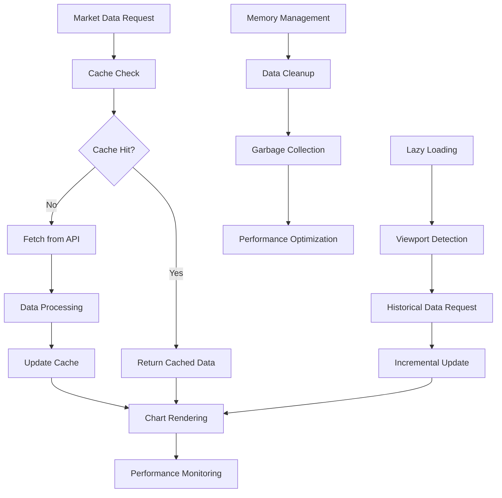

# Chart Performance - Charts & Visualization

> **Status**: Active  
> **Última Atualização**: 2025-01-26  
> **Versão**: 1.0.0  
> **Responsável**: Axisor Frontend Team  

## Índice

- [Visão Geral](#visão-geral)
- [Performance Architecture](#performance-architecture)
- [Data Loading Strategy](#data-loading-strategy)
- [Memory Management](#memory-management)
- [Rendering Optimization](#rendering-optimization)
- [Caching Strategy](#caching-strategy)
- [Lazy Loading Implementation](#lazy-loading-implementation)
- [Performance Monitoring](#performance-monitoring)
- [Troubleshooting](#troubleshooting)
- [Referências](#referências)

## Visão Geral

O sistema de gráficos do Axisor utiliza Lightweight Charts v5.0.9 com estratégias avançadas de otimização de performance. O foco está em renderização eficiente, gerenciamento inteligente de memória e carregamento lazy de dados históricos para garantir uma experiência fluida mesmo com grandes volumes de dados.

## Performance Architecture

### Chart Performance Flow



## Data Loading Strategy

### Hierarchical Data Loading

```typescript
class ChartDataService {
  private cache = new Map<string, ChartDataCache>();
  private readonly CACHE_TTL = {
    market: 30 * 1000,      // 30 seconds
    historical: 5 * 60 * 1000 // 5 minutes
  };

  async loadChartData(symbol: string, timeframe: string, range: TimeRange): Promise<ChartData> {
    const cacheKey = this.generateCacheKey(symbol, timeframe, range);
    
    // Verificar cache primeiro
    const cachedData = this.getCachedData(cacheKey);
    if (cachedData && this.isCacheValid(cachedData)) {
      this.performanceMetrics.recordCacheHit(cacheKey);
      return cachedData.data;
    }

    // Carregar dados em paralelo
    const [marketData, historicalData] = await Promise.all([
      this.loadMarketData(symbol, timeframe),
      this.loadHistoricalData(symbol, timeframe, range)
    ]);

    // Processar e deduplicar dados
    const processedData = this.processChartData(marketData, historicalData);
    
    // Cache dos dados processados
    this.cacheData(cacheKey, processedData);
    
    this.performanceMetrics.recordDataLoad(cacheKey, processedData.length);
    
    return processedData;
  }

  private async loadMarketData(symbol: string, timeframe: string): Promise<MarketData[]> {
    const startTime = performance.now();
    
    try {
      const response = await this.apiClient.get('/market-data', {
        params: { symbol, timeframe, limit: 100 }
      });
      
      const loadTime = performance.now() - startTime;
      this.performanceMetrics.recordMarketDataLoad(symbol, timeframe, loadTime);
      
      return response.data;
    } catch (error) {
      this.performanceMetrics.recordError('market_data_load', error);
      throw error;
    }
  }

  private async loadHistoricalData(
    symbol: string, 
    timeframe: string, 
    range: TimeRange
  ): Promise<HistoricalData[]> {
    const startTime = performance.now();
    
    try {
      // Implementar carregamento em chunks para grandes ranges
      if (this.isLargeRange(range)) {
        return await this.loadHistoricalDataInChunks(symbol, timeframe, range);
      }

      const response = await this.apiClient.get('/historical-data', {
        params: {
          symbol,
          timeframe,
          from: range.from,
          to: range.to
        }
      });
      
      const loadTime = performance.now() - startTime;
      this.performanceMetrics.recordHistoricalDataLoad(symbol, timeframe, loadTime);
      
      return response.data;
    } catch (error) {
      this.performanceMetrics.recordError('historical_data_load', error);
      throw error;
    }
  }

  private async loadHistoricalDataInChunks(
    symbol: string,
    timeframe: string,
    range: TimeRange
  ): Promise<HistoricalData[]> {
    const chunkSize = this.calculateChunkSize(timeframe);
    const chunks = this.createTimeChunks(range, chunkSize);
    
    const allData: HistoricalData[] = [];
    
    // Carregar chunks em paralelo (limitado a 3 simultâneos)
    const semaphore = new Semaphore(3);
    
    const chunkPromises = chunks.map(chunk => 
      semaphore.acquire().then(async (release) => {
        try {
          const chunkData = await this.loadHistoricalDataChunk(symbol, timeframe, chunk);
          return chunkData;
        } finally {
          release();
        }
      })
    );
    
    const chunkResults = await Promise.all(chunkPromises);
    
    // Mesclar e ordenar dados
    chunkResults.forEach(chunkData => {
      allData.push(...chunkData);
    });
    
    return allData.sort((a, b) => a.timestamp - b.timestamp);
  }

  private calculateChunkSize(timeframe: string): number {
    const chunkSizes = {
      '1m': 24 * 60,      // 1 day
      '5m': 24 * 12,      // 1 day
      '15m': 24 * 4,      // 1 day
      '30m': 24 * 2,      // 1 day
      '1h': 24 * 7,       // 1 week
      '4h': 24 * 30,      // 1 month
      '1d': 365,          // 1 year
      '1w': 52            // 1 year
    };
    
    return chunkSizes[timeframe] || 1000;
  }
}
```

## Memory Management

### Intelligent Memory Management

```typescript
class ChartMemoryManager {
  private memoryThreshold = 50 * 1024 * 1024; // 50MB
  private maxDataPoints = 10000;
  private cleanupInterval = 30000; // 30 seconds
  
  constructor() {
    this.startMemoryMonitoring();
  }

  private startMemoryMonitoring(): void {
    setInterval(() => {
      this.performMemoryCleanup();
    }, this.cleanupInterval);
  }

  async performMemoryCleanup(): Promise<void> {
    const memoryUsage = this.getMemoryUsage();
    
    if (memoryUsage > this.memoryThreshold) {
      console.log(`Memory usage high: ${memoryUsage}MB, performing cleanup`);
      
      await Promise.all([
        this.cleanupOldCache(),
        this.cleanupUnusedData(),
        this.forceGarbageCollection()
      ]);
    }
  }

  private async cleanupOldCache(): Promise<void> {
    const now = Date.now();
    const maxAge = 10 * 60 * 1000; // 10 minutes
    
    for (const [key, cache] of this.cache.entries()) {
      if (now - cache.timestamp > maxAge) {
        this.cache.delete(key);
        console.log(`Cleaned up old cache: ${key}`);
      }
    }
  }

  private async cleanupUnusedData(): Promise<void> {
    // Limitar pontos de dados por gráfico
    for (const [chartId, chartData] of this.chartDataMap.entries()) {
      if (chartData.length > this.maxDataPoints) {
        // Manter apenas os dados mais recentes
        const trimmedData = chartData.slice(-this.maxDataPoints);
        this.chartDataMap.set(chartId, trimmedData);
        
        console.log(`Trimmed data for chart ${chartId}: ${chartData.length} -> ${trimmedData.length}`);
      }
    }
  }

  private forceGarbageCollection(): void {
    if (global.gc) {
      global.gc();
      console.log('Forced garbage collection');
    }
  }

  private getMemoryUsage(): number {
    const usage = process.memoryUsage();
    return Math.round(usage.heapUsed / 1024 / 1024);
  }

  // Otimização de dados para renderização
  optimizeDataForRendering(data: ChartDataPoint[]): ChartDataPoint[] {
    // Implementar downsampling para grandes datasets
    if (data.length > 5000) {
      return this.downsampleData(data, 5000);
    }
    
    return data;
  }

  private downsampleData(data: ChartDataPoint[], targetSize: number): ChartDataPoint[] {
    const step = Math.ceil(data.length / targetSize);
    const downsampled: ChartDataPoint[] = [];
    
    for (let i = 0; i < data.length; i += step) {
      downsampled.push(data[i]);
    }
    
    // Sempre incluir o último ponto
    if (data.length > 0 && downsampled[downsampled.length - 1] !== data[data.length - 1]) {
      downsampled.push(data[data.length - 1]);
    }
    
    return downsampled;
  }
}
```

## Rendering Optimization

### Efficient Chart Rendering

```typescript
class OptimizedChartRenderer {
  private renderQueue: RenderTask[] = [];
  private isRendering = false;
  private renderThrottle = 16; // ~60fps
  
  constructor(private chart: IChartApi) {
    this.setupRenderOptimization();
  }

  private setupRenderOptimization(): void {
    // Configurar Lightweight Charts para performance
    this.chart.applyOptions({
      handleScroll: {
        mouseWheel: true,
        pressedMouseMove: true,
        horzTouchDrag: true,
        vertTouchDrag: true,
      },
      handleScale: {
        axisPressedMouseMove: true,
        mouseWheel: true,
        pinch: true,
      },
      kineticScroll: {
        mouse: true,
        touch: true,
      },
      // Otimizações de performance
      layout: {
        backgroundColor: 'transparent',
        textColor: '#d1d4dc',
      },
      grid: {
        vertLines: {
          visible: false,
        },
        horzLines: {
          visible: false,
        },
      },
      crosshair: {
        mode: CrosshairMode.Normal,
      },
      rightPriceScale: {
        borderVisible: false,
      },
      timeScale: {
        borderVisible: false,
        rightOffset: 12,
        barSpacing: 3,
        fixLeftEdge: true,
        lockVisibleTimeRangeOnResize: true,
        rightBarStaysOnScroll: true,
        shiftVisibleRangeOnNewBar: true,
      },
    });
  }

  async updateChartData(newData: ChartDataPoint[], animated = true): Promise<void> {
    // Adicionar à fila de renderização
    this.renderQueue.push({
      data: newData,
      animated,
      timestamp: Date.now()
    });
    
    // Processar fila se não estiver renderizando
    if (!this.isRendering) {
      this.processRenderQueue();
    }
  }

  private async processRenderQueue(): Promise<void> {
    if (this.isRendering || this.renderQueue.length === 0) {
      return;
    }
    
    this.isRendering = true;
    
    try {
      // Processar até 3 atualizações por frame
      const batchSize = Math.min(3, this.renderQueue.length);
      const batch = this.renderQueue.splice(0, batchSize);
      
      // Usar requestAnimationFrame para renderização suave
      await new Promise(resolve => {
        requestAnimationFrame(async () => {
          await this.renderBatch(batch);
          resolve(void 0);
        });
      });
      
      // Continuar processando se houver mais itens
      if (this.renderQueue.length > 0) {
        setTimeout(() => {
          this.isRendering = false;
          this.processRenderQueue();
        }, this.renderThrottle);
      } else {
        this.isRendering = false;
      }
    } catch (error) {
      this.isRendering = false;
      console.error('Render queue processing error:', error);
    }
  }

  private async renderBatch(batch: RenderTask[]): Promise<void> {
    // Agrupar dados por série
    const dataBySeries = new Map<string, ChartDataPoint[]>();
    
    batch.forEach(task => {
      const seriesId = 'main'; // Assumindo série principal
      if (!dataBySeries.has(seriesId)) {
        dataBySeries.set(seriesId, []);
      }
      dataBySeries.get(seriesId)!.push(...task.data);
    });
    
    // Atualizar cada série
    for (const [seriesId, data] of dataBySeries) {
      await this.updateSeries(seriesId, data);
    }
  }

  private async updateSeries(seriesId: string, data: ChartDataPoint[]): Promise<void> {
    try {
      const series = this.chart.getSeriesById(seriesId);
      if (!series) {
        console.warn(`Series ${seriesId} not found`);
        return;
      }
      
      // Converter dados para formato Lightweight Charts
      const formattedData = data.map(point => ({
        time: point.timestamp / 1000, // Converter para segundos
        open: point.open,
        high: point.high,
        low: point.low,
        close: point.close,
        volume: point.volume
      }));
      
      // Atualizar série com dados otimizados
      series.setData(formattedData);
      
      // Ajustar viewport se necessário
      this.adjustViewport(formattedData);
      
    } catch (error) {
      console.error(`Error updating series ${seriesId}:`, error);
    }
  }

  private adjustViewport(data: any[]): void {
    if (data.length === 0) return;
    
    const timeScale = this.chart.timeScale();
    const visibleRange = timeScale.getVisibleRange();
    
    // Se não há range visível, mostrar últimos 100 pontos
    if (!visibleRange) {
      const lastTime = data[data.length - 1].time;
      const firstTime = Math.max(
        lastTime - (100 * this.getBarWidth()),
        data[0].time
      );
      
      timeScale.setVisibleRange({
        from: firstTime as Time,
        to: lastTime as Time
      });
    }
  }

  private getBarWidth(): number {
    // Calcular largura de barra baseada no timeframe
    const timeScale = this.chart.timeScale();
    const barSpacing = timeScale.options().barSpacing || 3;
    return barSpacing;
  }
}
```

## Caching Strategy

### Multi-Level Caching

```typescript
class ChartCacheManager {
  private memoryCache = new Map<string, CacheEntry>();
  private localStorageCache = new Map<string, CacheEntry>();
  private readonly MAX_MEMORY_CACHE_SIZE = 100;
  private readonly MAX_LOCALSTORAGE_SIZE = 50 * 1024 * 1024; // 50MB

  async getCachedData(key: string): Promise<ChartData | null> {
    // 1. Verificar cache em memória
    const memoryEntry = this.memoryCache.get(key);
    if (memoryEntry && this.isCacheValid(memoryEntry)) {
      this.recordCacheHit('memory', key);
      return memoryEntry.data;
    }

    // 2. Verificar localStorage
    const localStorageEntry = this.localStorageCache.get(key);
    if (localStorageEntry && this.isCacheValid(localStorageEntry)) {
      this.recordCacheHit('localStorage', key);
      
      // Promover para cache em memória
      this.setMemoryCache(key, localStorageEntry.data);
      
      return localStorageEntry.data;
    }

    this.recordCacheMiss(key);
    return null;
  }

  async setCache(key: string, data: ChartData, ttl: number = 300000): Promise<void> {
    const entry: CacheEntry = {
      data,
      timestamp: Date.now(),
      ttl,
      accessCount: 1,
      lastAccessed: Date.now()
    };

    // Sempre adicionar ao cache em memória
    this.setMemoryCache(key, data);
    
    // Adicionar ao localStorage se não for muito grande
    if (this.shouldCacheInLocalStorage(data)) {
      this.setLocalStorageCache(key, data);
    }

    // Limpar caches se necessário
    this.cleanupCaches();
  }

  private setMemoryCache(key: string, data: ChartData): void {
    // Remover entrada mais antiga se cache estiver cheio
    if (this.memoryCache.size >= this.MAX_MEMORY_CACHE_SIZE) {
      const oldestKey = this.getOldestCacheKey(this.memoryCache);
      this.memoryCache.delete(oldestKey);
    }

    this.memoryCache.set(key, {
      data,
      timestamp: Date.now(),
      ttl: 300000,
      accessCount: 1,
      lastAccessed: Date.now()
    });
  }

  private setLocalStorageCache(key: string, data: ChartData): void {
    try {
      const serializedData = JSON.stringify({
        data,
        timestamp: Date.now(),
        ttl: 300000,
        accessCount: 1,
        lastAccessed: Date.now()
      });

      // Verificar tamanho
      const dataSize = new Blob([serializedData]).size;
      if (dataSize > 1024 * 1024) { // 1MB limit per entry
        return;
      }

      localStorage.setItem(`chart_cache_${key}`, serializedData);
      this.localStorageCache.set(key, {
        data,
        timestamp: Date.now(),
        ttl: 300000,
        accessCount: 1,
        lastAccessed: Date.now()
      });
    } catch (error) {
      console.warn('Failed to cache in localStorage:', error);
    }
  }

  private shouldCacheInLocalStorage(data: ChartData): boolean {
    // Não cachear dados muito grandes ou muito frequentes
    const dataSize = JSON.stringify(data).length;
    return dataSize < 500 * 1024; // 500KB limit
  }

  private cleanupCaches(): void {
    this.cleanupMemoryCache();
    this.cleanupLocalStorageCache();
  }

  private cleanupMemoryCache(): void {
    const now = Date.now();
    
    for (const [key, entry] of this.memoryCache.entries()) {
      if (now - entry.timestamp > entry.ttl) {
        this.memoryCache.delete(key);
      }
    }
  }

  private cleanupLocalStorageCache(): void {
    const now = Date.now();
    
    for (const [key, entry] of this.localStorageCache.entries()) {
      if (now - entry.timestamp > entry.ttl) {
        localStorage.removeItem(`chart_cache_${key}`);
        this.localStorageCache.delete(key);
      }
    }
  }

  private isCacheValid(entry: CacheEntry): boolean {
    return Date.now() - entry.timestamp < entry.ttl;
  }

  private getOldestCacheKey(cache: Map<string, CacheEntry>): string {
    let oldestKey = '';
    let oldestTime = Infinity;
    
    for (const [key, entry] of cache.entries()) {
      if (entry.lastAccessed < oldestTime) {
        oldestTime = entry.lastAccessed;
        oldestKey = key;
      }
    }
    
    return oldestKey;
  }

  private recordCacheHit(type: 'memory' | 'localStorage', key: string): void {
    const entry = type === 'memory' 
      ? this.memoryCache.get(key)
      : this.localStorageCache.get(key);
    
    if (entry) {
      entry.accessCount++;
      entry.lastAccessed = Date.now();
    }
  }

  private recordCacheMiss(key: string): void {
    // Implementar métricas de cache miss
    console.debug(`Cache miss for key: ${key}`);
  }
}
```

## Lazy Loading Implementation

### Intelligent Lazy Loading

```typescript
class LazyLoadingManager {
  private loadingStates = new Map<string, LoadingState>();
  private readonly LOADING_THRESHOLD = 100; // pixels from edge

  constructor(private chart: IChartApi) {
    this.setupScrollListener();
    this.setupZoomListener();
  }

  private setupScrollListener(): void {
    this.chart.timeScale().subscribeVisibleRangeChange(this.handleVisibleRangeChange.bind(this));
  }

  private setupZoomListener(): void {
    // Detectar mudanças de zoom para carregar mais dados se necessário
    this.chart.timeScale().subscribeVisibleTimeRangeChange(this.handleZoomChange.bind(this));
  }

  private async handleVisibleRangeChange(newRange: VisibleTimeRange | null): Promise<void> {
    if (!newRange) return;

    const currentData = this.getCurrentDataRange();
    const visibleRange = {
      from: newRange.from,
      to: newRange.to
    };

    // Verificar se precisamos carregar dados à esquerda
    if (this.needsDataLeft(visibleRange, currentData)) {
      await this.loadDataLeft(visibleRange.from);
    }

    // Verificar se precisamos carregar dados à direita
    if (this.needsDataRight(visibleRange, currentData)) {
      await this.loadDataRight(visibleRange.to);
    }
  }

  private async handleZoomChange(timeRange: VisibleTimeRange | null): Promise<void> {
    if (!timeRange) return;

    // Se o zoom ficou muito próximo, carregar dados de timeframe menor
    const timeSpan = timeRange.to - timeRange.from;
    const barWidth = this.getBarWidth();
    const visibleBars = timeSpan / barWidth;

    if (visibleBars > 1000) {
      // Zoom muito próximo, considerar carregar dados de timeframe menor
      await this.loadHigherResolutionData(timeRange);
    }
  }

  private async loadDataLeft(fromTime: number): Promise<void> {
    const symbol = this.getCurrentSymbol();
    const timeframe = this.getCurrentTimeframe();
    
    const loadingKey = `${symbol}_${timeframe}_left`;
    
    if (this.isLoading(loadingKey)) {
      return; // Já carregando
    }

    this.setLoading(loadingKey, true);

    try {
      const data = await this.dataService.loadHistoricalData(
        symbol,
        timeframe,
        {
          from: fromTime - (24 * 60 * 60), // 1 day before
          to: fromTime
        }
      );

      if (data.length > 0) {
        await this.prependData(data);
      }
    } catch (error) {
      console.error('Error loading data left:', error);
    } finally {
      this.setLoading(loadingKey, false);
    }
  }

  private async loadDataRight(toTime: number): Promise<void> {
    const symbol = this.getCurrentSymbol();
    const timeframe = this.getCurrentTimeframe();
    
    const loadingKey = `${symbol}_${timeframe}_right`;
    
    if (this.isLoading(loadingKey)) {
      return; // Já carregando
    }

    this.setLoading(loadingKey, true);

    try {
      const data = await this.dataService.loadHistoricalData(
        symbol,
        timeframe,
        {
          from: toTime,
          to: toTime + (24 * 60 * 60) // 1 day after
        }
      );

      if (data.length > 0) {
        await this.appendData(data);
      }
    } catch (error) {
      console.error('Error loading data right:', error);
    } finally {
      this.setLoading(loadingKey, false);
    }
  }

  private async loadHigherResolutionData(timeRange: VisibleTimeRange): Promise<void> {
    const symbol = this.getCurrentSymbol();
    const currentTimeframe = this.getCurrentTimeframe();
    const higherTimeframe = this.getHigherResolutionTimeframe(currentTimeframe);
    
    if (!higherTimeframe) {
      return; // Já no timeframe mais alto
    }

    const loadingKey = `${symbol}_${higherTimeframe}_highres`;
    
    if (this.isLoading(loadingKey)) {
      return;
    }

    this.setLoading(loadingKey, true);

    try {
      const data = await this.dataService.loadHistoricalData(
        symbol,
        higherTimeframe,
        {
          from: timeRange.from,
          to: timeRange.to
        }
      );

      if (data.length > 0) {
        await this.replaceVisibleData(data);
      }
    } catch (error) {
      console.error('Error loading higher resolution data:', error);
    } finally {
      this.setLoading(loadingKey, false);
    }
  }

  private needsDataLeft(visibleRange: TimeRange, currentData: DataRange): boolean {
    const threshold = this.LOADING_THRESHOLD * this.getBarWidth();
    return visibleRange.from < currentData.from + threshold;
  }

  private needsDataRight(visibleRange: TimeRange, currentData: DataRange): boolean {
    const threshold = this.LOADING_THRESHOLD * this.getBarWidth();
    return visibleRange.to > currentData.to - threshold;
  }

  private isLoading(key: string): boolean {
    return this.loadingStates.get(key)?.isLoading || false;
  }

  private setLoading(key: string, isLoading: boolean): void {
    this.loadingStates.set(key, {
      isLoading,
      timestamp: Date.now()
    });
  }

  private getHigherResolutionTimeframe(currentTimeframe: string): string | null {
    const timeframes = ['1m', '5m', '15m', '30m', '1h', '4h', '1d', '1w'];
    const currentIndex = timeframes.indexOf(currentTimeframe);
    
    if (currentIndex > 0) {
      return timeframes[currentIndex - 1];
    }
    
    return null;
  }
}
```

## Performance Monitoring

### Real-time Performance Metrics

```typescript
class ChartPerformanceMonitor {
  private metrics: PerformanceMetrics = {
    renderTimes: [],
    dataLoadTimes: [],
    cacheHitRate: 0,
    memoryUsage: [],
    frameDrops: 0,
    errors: []
  };

  private readonly MAX_METRICS_HISTORY = 1000;
  private frameCount = 0;
  private lastFrameTime = 0;

  startMonitoring(): void {
    this.startFrameRateMonitoring();
    this.startMemoryMonitoring();
    this.startErrorTracking();
  }

  private startFrameRateMonitoring(): void {
    const monitorFrame = (timestamp: number) => {
      if (this.lastFrameTime > 0) {
        const deltaTime = timestamp - this.lastFrameTime;
        const fps = 1000 / deltaTime;
        
        if (fps < 30) { // Considerar frame drop se FPS < 30
          this.metrics.frameDrops++;
        }
        
        this.metrics.renderTimes.push(deltaTime);
        
        // Manter apenas últimos N registros
        if (this.metrics.renderTimes.length > this.MAX_METRICS_HISTORY) {
          this.metrics.renderTimes.shift();
        }
      }
      
      this.lastFrameTime = timestamp;
      this.frameCount++;
      
      requestAnimationFrame(monitorFrame);
    };
    
    requestAnimationFrame(monitorFrame);
  }

  private startMemoryMonitoring(): void {
    setInterval(() => {
      if (performance.memory) {
        const memoryInfo = {
          used: performance.memory.usedJSHeapSize,
          total: performance.memory.totalJSHeapSize,
          limit: performance.memory.jsHeapSizeLimit,
          timestamp: Date.now()
        };
        
        this.metrics.memoryUsage.push(memoryInfo);
        
        // Manter apenas últimos N registros
        if (this.metrics.memoryUsage.length > this.MAX_METRICS_HISTORY) {
          this.metrics.memoryUsage.shift();
        }
        
        // Alertar se uso de memória estiver alto
        if (memoryInfo.used / memoryInfo.limit > 0.8) {
          this.alertHighMemoryUsage(memoryInfo);
        }
      }
    }, 5000); // Verificar a cada 5 segundos
  }

  recordDataLoadTime(operation: string, duration: number): void {
    this.metrics.dataLoadTimes.push({
      operation,
      duration,
      timestamp: Date.now()
    });
    
    // Manter apenas últimos N registros
    if (this.metrics.dataLoadTimes.length > this.MAX_METRICS_HISTORY) {
      this.metrics.dataLoadTimes.shift();
    }
  }

  recordCacheHit(key: string): void {
    // Implementar lógica de cache hit rate
    this.metrics.cacheHitRate = this.calculateCacheHitRate();
  }

  recordError(error: Error, context: string): void {
    this.metrics.errors.push({
      message: error.message,
      stack: error.stack,
      context,
      timestamp: Date.now()
    });
    
    // Manter apenas últimos N erros
    if (this.metrics.errors.length > this.MAX_METRICS_HISTORY) {
      this.metrics.errors.shift();
    }
    
    // Enviar erro para serviço de monitoramento
    this.reportError(error, context);
  }

  getPerformanceReport(): PerformanceReport {
    const avgRenderTime = this.calculateAverage(this.metrics.renderTimes);
    const avgDataLoadTime = this.calculateAverage(
      this.metrics.dataLoadTimes.map(d => d.duration)
    );
    const currentMemory = this.getCurrentMemoryUsage();
    
    return {
      frameRate: 1000 / avgRenderTime,
      averageRenderTime: avgRenderTime,
      averageDataLoadTime: avgDataLoadTime,
      cacheHitRate: this.metrics.cacheHitRate,
      memoryUsage: currentMemory,
      frameDrops: this.metrics.frameDrops,
      errorCount: this.metrics.errors.length,
      timestamp: Date.now()
    };
  }

  private calculateAverage(values: number[]): number {
    if (values.length === 0) return 0;
    return values.reduce((sum, value) => sum + value, 0) / values.length;
  }

  private calculateCacheHitRate(): number {
    // Implementar cálculo de cache hit rate
    return 0.85; // Placeholder
  }

  private getCurrentMemoryUsage(): MemoryInfo | null {
    if (performance.memory) {
      return {
        used: performance.memory.usedJSHeapSize,
        total: performance.memory.totalJSHeapSize,
        limit: performance.memory.jsHeapSizeLimit
      };
    }
    return null;
  }

  private alertHighMemoryUsage(memoryInfo: MemoryInfo): void {
    console.warn('High memory usage detected:', {
      used: `${Math.round(memoryInfo.used / 1024 / 1024)}MB`,
      total: `${Math.round(memoryInfo.total / 1024 / 1024)}MB`,
      limit: `${Math.round(memoryInfo.limit / 1024 / 1024)}MB`,
      usage: `${Math.round((memoryInfo.used / memoryInfo.limit) * 100)}%`
    });
  }

  private reportError(error: Error, context: string): void {
    // Enviar para serviço de monitoramento (ex: Sentry)
    if (window.Sentry) {
      window.Sentry.captureException(error, {
        tags: {
          context,
          component: 'chart'
        }
      });
    }
  }
}
```

## Troubleshooting

### Performance Issues

#### Slow Rendering

```typescript
// Debug slow rendering
function debugSlowRendering(): void {
  const performanceMonitor = new ChartPerformanceMonitor();
  const report = performanceMonitor.getPerformanceReport();
  
  console.log('Performance Report:', report);
  
  if (report.frameRate < 30) {
    console.warn('Low frame rate detected:', report.frameRate);
    console.log('Recommendations:');
    console.log('- Reduce data points');
    console.log('- Enable data downsampling');
    console.log('- Check for memory leaks');
  }
  
  if (report.averageDataLoadTime > 1000) {
    console.warn('Slow data loading:', report.averageDataLoadTime + 'ms');
    console.log('Recommendations:');
    console.log('- Implement better caching');
    console.log('- Use data compression');
    console.log('- Optimize API endpoints');
  }
}
```

#### Memory Leaks

```typescript
// Debug memory leaks
function debugMemoryLeaks(): void {
  const performanceMonitor = new ChartPerformanceMonitor();
  const memoryHistory = performanceMonitor.getMemoryHistory();
  
  // Verificar tendência de crescimento de memória
  const memoryGrowth = calculateMemoryGrowth(memoryHistory);
  
  if (memoryGrowth > 0.1) { // 10% growth per check
    console.warn('Potential memory leak detected');
    console.log('Memory growth rate:', memoryGrowth);
    
    // Sugerir ações
    console.log('Recommended actions:');
    console.log('- Clear old chart data');
    console.log('- Remove unused event listeners');
    console.log('- Check for circular references');
  }
}

function calculateMemoryGrowth(memoryHistory: MemoryInfo[]): number {
  if (memoryHistory.length < 2) return 0;
  
  const latest = memoryHistory[memoryHistory.length - 1];
  const oldest = memoryHistory[0];
  
  return (latest.used - oldest.used) / oldest.used;
}
```

## Referências

- [Chart Architecture](../architecture/chart-architecture.md)
- [Data Management](./data-management.md)
- [Lightweight Charts Integration](./lightweight-charts-integration.md)
- [Performance Best Practices](../best-practices/performance-best-practices.md)

## Como Usar Este Documento

• **Para Desenvolvedores**: Use como referência para implementar otimizações de performance em gráficos e resolver problemas de renderização.

• **Para DevOps**: Utilize para monitorar performance de gráficos em produção e configurar alertas de performance.

• **Para QA**: Use para validar critérios de performance e identificar cenários de teste para otimização de gráficos.
