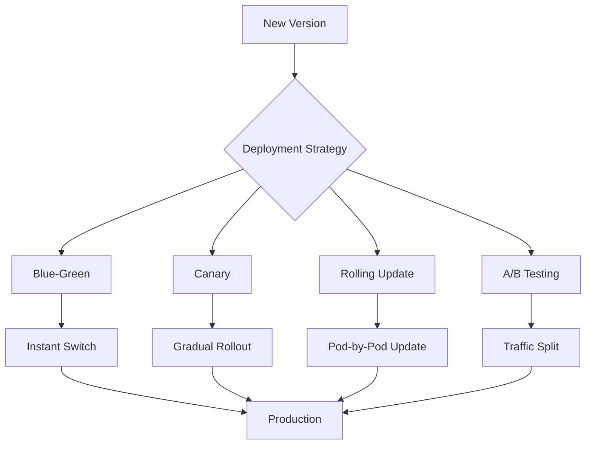

# Deployment Strategies

## Summary

Comprehensive guide for implementing various deployment strategies in the Axisor platform. This document covers blue-green, canary, rolling updates, and other deployment patterns for zero-downtime deployments.

## Deployment Strategy Architecture



## Blue-Green Deployment

### Blue-Green Strategy

Blue-Green deployment maintains two identical production environments (blue and green). Only one environment is live at a time.

```yaml
# Blue Environment (Current)
apiVersion: apps/v1
kind: Deployment
metadata:
  name: axisor-backend-blue
  namespace: axisor
  labels:
    app: axisor-backend
    version: blue
spec:
  replicas: 3
  selector:
    matchLabels:
      app: axisor-backend
      version: blue
  template:
    metadata:
      labels:
        app: axisor-backend
        version: blue
    spec:
      containers:
      - name: backend
        image: axisor/backend:v1.0.0
        ports:
        - containerPort: 3010
---
# Green Environment (New)
apiVersion: apps/v1
kind: Deployment
metadata:
  name: axisor-backend-green
  namespace: axisor
  labels:
    app: axisor-backend
    version: green
spec:
  replicas: 3
  selector:
    matchLabels:
      app: axisor-backend
      version: green
  template:
    metadata:
      labels:
        app: axisor-backend
        version: green
    spec:
      containers:
      - name: backend
        image: axisor/backend:v1.1.0
        ports:
        - containerPort: 3010
```

### Blue-Green Service

```yaml
apiVersion: v1
kind: Service
metadata:
  name: axisor-backend
  namespace: axisor
spec:
  selector:
    app: axisor-backend
    version: blue  # Switch between blue and green
  ports:
  - port: 80
    targetPort: 3010
```

### Blue-Green Switch Script

```bash
#!/bin/bash
# Blue-Green deployment switch

CURRENT_VERSION=$(kubectl get service axisor-backend -n axisor -o jsonpath='{.spec.selector.version}')
NEW_VERSION=""

if [ "$CURRENT_VERSION" = "blue" ]; then
    NEW_VERSION="green"
elif [ "$CURRENT_VERSION" = "green" ]; then
    NEW_VERSION="blue"
else
    echo "Error: Unknown current version"
    exit 1
fi

echo "Switching from $CURRENT_VERSION to $NEW_VERSION"

# Update service selector
kubectl patch service axisor-backend -n axisor -p "{\"spec\":{\"selector\":{\"version\":\"$NEW_VERSION\"}}}"

# Wait for rollout
kubectl rollout status deployment/axisor-backend-$NEW_VERSION -n axisor --timeout=300s

# Verify health
kubectl port-forward svc/axisor-backend 3010:80 -n axisor &
sleep 10
curl -f http://localhost:3010/health || {
    echo "Health check failed, rolling back"
    kubectl patch service axisor-backend -n axisor -p "{\"spec\":{\"selector\":{\"version\":\"$CURRENT_VERSION\"}}}"
    exit 1
}

echo "Successfully switched to $NEW_VERSION"
```

## Canary Deployment

### Canary Strategy

Canary deployment gradually shifts traffic to the new version, allowing for testing with a small percentage of users.

```yaml
# Stable deployment
apiVersion: apps/v1
kind: Deployment
metadata:
  name: axisor-backend-stable
  namespace: axisor
  labels:
    app: axisor-backend
    version: stable
spec:
  replicas: 9
  selector:
    matchLabels:
      app: axisor-backend
      version: stable
  template:
    metadata:
      labels:
        app: axisor-backend
        version: stable
    spec:
      containers:
      - name: backend
        image: axisor/backend:v1.0.0
        ports:
        - containerPort: 3010
---
# Canary deployment
apiVersion: apps/v1
kind: Deployment
metadata:
  name: axisor-backend-canary
  namespace: axisor
  labels:
    app: axisor-backend
    version: canary
spec:
  replicas: 1
  selector:
    matchLabels:
      app: axisor-backend
      version: canary
  template:
    metadata:
      labels:
        app: axisor-backend
        version: canary
    spec:
      containers:
      - name: backend
        image: axisor/backend:v1.1.0
        ports:
        - containerPort: 3010
```

### Canary Ingress

```yaml
apiVersion: networking.k8s.io/v1
kind: Ingress
metadata:
  name: axisor-backend-ingress
  namespace: axisor
  annotations:
    nginx.ingress.kubernetes.io/canary: "true"
    nginx.ingress.kubernetes.io/canary-weight: "10"  # 10% traffic to canary
spec:
  rules:
  - host: api.axisor.com
    http:
      paths:
      - path: /
        pathType: Prefix
        backend:
          service:
            name: axisor-backend
            port:
              number: 80
```

### Canary Traffic Management

```bash
#!/bin/bash
# Canary deployment management

# Increase canary traffic to 25%
kubectl patch ingress axisor-backend-ingress -n axisor -p '{"metadata":{"annotations":{"nginx.ingress.kubernetes.io/canary-weight":"25"}}}'

# Wait and monitor
sleep 300

# Check metrics
kubectl top pods -n axisor -l app=axisor-backend

# If metrics look good, increase to 50%
kubectl patch ingress axisor-backend-ingress -n axisor -p '{"metadata":{"annotations":{"nginx.ingress.kubernetes.io/canary-weight":"50"}}}'

# Wait and monitor
sleep 300

# If still good, increase to 100%
kubectl patch ingress axisor-backend-ingress -n axisor -p '{"metadata":{"annotations":{"nginx.ingress.kubernetes.io/canary-weight":"100"}}}'

# Scale up canary and scale down stable
kubectl scale deployment axisor-backend-canary --replicas=10 -n axisor
kubectl scale deployment axisor-backend-stable --replicas=0 -n axisor

# Remove canary annotations
kubectl patch ingress axisor-backend-ingress -n axisor -p '{"metadata":{"annotations":{"nginx.ingress.kubernetes.io/canary":null,"nginx.ingress.kubernetes.io/canary-weight":null}}}'
```

## Rolling Update Deployment

### Rolling Update Strategy

Rolling update gradually replaces old pods with new ones, maintaining service availability.

```yaml
apiVersion: apps/v1
kind: Deployment
metadata:
  name: axisor-backend
  namespace: axisor
spec:
  replicas: 5
  strategy:
    type: RollingUpdate
    rollingUpdate:
      maxUnavailable: 1
      maxSurge: 1
  selector:
    matchLabels:
      app: axisor-backend
  template:
    metadata:
      labels:
        app: axisor-backend
    spec:
      containers:
      - name: backend
        image: axisor/backend:v1.1.0
        ports:
        - containerPort: 3010
        readinessProbe:
          httpGet:
            path: /ready
            port: 3010
          initialDelaySeconds: 5
          periodSeconds: 5
        livenessProbe:
          httpGet:
            path: /health
            port: 3010
          initialDelaySeconds: 30
          periodSeconds: 10
```

### Rolling Update Commands

```bash
# Update image
kubectl set image deployment/axisor-backend backend=axisor/backend:v1.1.0 -n axisor

# Watch rollout
kubectl rollout status deployment/axisor-backend -n axisor

# Check rollout history
kubectl rollout history deployment/axisor-backend -n axisor

# Rollback if needed
kubectl rollout undo deployment/axisor-backend -n axisor

# Rollback to specific revision
kubectl rollout undo deployment/axisor-backend --to-revision=2 -n axisor
```

## A/B Testing Deployment

### A/B Testing Strategy

A/B testing allows comparing two versions with different traffic splits based on user characteristics.

```yaml
# Version A
apiVersion: apps/v1
kind: Deployment
metadata:
  name: axisor-backend-v1
  namespace: axisor
  labels:
    app: axisor-backend
    version: v1
spec:
  replicas: 5
  selector:
    matchLabels:
      app: axisor-backend
      version: v1
  template:
    metadata:
      labels:
        app: axisor-backend
        version: v1
    spec:
      containers:
      - name: backend
        image: axisor/backend:v1.0.0
        ports:
        - containerPort: 3010
---
# Version B
apiVersion: apps/v1
kind: Deployment
metadata:
  name: axisor-backend-v2
  namespace: axisor
  labels:
    app: axisor-backend
    version: v2
spec:
  replicas: 5
  selector:
    matchLabels:
      app: axisor-backend
      version: v2
  template:
    metadata:
      labels:
        app: axisor-backend
        version: v2
    spec:
      containers:
      - name: backend
        image: axisor/backend:v1.1.0
        ports:
        - containerPort: 3010
```

### A/B Testing Service

```yaml
apiVersion: v1
kind: Service
metadata:
  name: axisor-backend-v1
  namespace: axisor
spec:
  selector:
    app: axisor-backend
    version: v1
  ports:
  - port: 80
    targetPort: 3010
---
apiVersion: v1
kind: Service
metadata:
  name: axisor-backend-v2
  namespace: axisor
spec:
  selector:
    app: axisor-backend
    version: v2
  ports:
  - port: 80
    targetPort: 3010
```

### A/B Testing Ingress

```yaml
apiVersion: networking.k8s.io/v1
kind: Ingress
metadata:
  name: axisor-backend-ab-test
  namespace: axisor
  annotations:
    nginx.ingress.kubernetes.io/rewrite-target: /
spec:
  rules:
  - host: api.axisor.com
    http:
      paths:
      - path: /
        pathType: Prefix
        backend:
          service:
            name: axisor-backend-v1
            port:
              number: 80
      - path: /v2
        pathType: Prefix
        backend:
          service:
            name: axisor-backend-v2
            port:
              number: 80
```

## Feature Flag Deployment

### Feature Flag Strategy

Feature flags allow enabling/disabling features without code deployment.

```yaml
apiVersion: v1
kind: ConfigMap
metadata:
  name: feature-flags
  namespace: axisor
data:
  feature-flags.json: |
    {
      "newDashboard": {
        "enabled": true,
        "percentage": 50,
        "users": ["user1", "user2"]
      },
      "newApi": {
        "enabled": false,
        "percentage": 0,
        "users": []
      }
    }
```

### Feature Flag Service

```typescript
// Feature flag service
export class FeatureFlagService {
  private flags: any;

  constructor() {
    this.loadFlags();
  }

  private async loadFlags() {
    const response = await fetch('/api/config/feature-flags');
    this.flags = await response.json();
  }

  isEnabled(feature: string, userId?: string): boolean {
    const flag = this.flags[feature];
    if (!flag) return false;

    // Check if feature is enabled
    if (!flag.enabled) return false;

    // Check user-specific enablement
    if (userId && flag.users.includes(userId)) return true;

    // Check percentage rollout
    if (flag.percentage > 0) {
      const hash = this.hashUserId(userId || 'anonymous');
      return (hash % 100) < flag.percentage;
    }

    return false;
  }

  private hashUserId(userId: string): number {
    let hash = 0;
    for (let i = 0; i < userId.length; i++) {
      const char = userId.charCodeAt(i);
      hash = ((hash << 5) - hash) + char;
      hash = hash & hash; // Convert to 32-bit integer
    }
    return Math.abs(hash);
  }
}
```

## Deployment Automation

### Automated Deployment Script

```bash
#!/bin/bash
# Automated deployment with strategy selection

DEPLOYMENT_STRATEGY=${1:-"rolling"}
VERSION=${2:-"latest"}
ENVIRONMENT=${3:-"staging"}

echo "Deploying version $VERSION to $ENVIRONMENT using $DEPLOYMENT_STRATEGY strategy"

case $DEPLOYMENT_STRATEGY in
  "rolling")
    kubectl set image deployment/axisor-backend backend=axisor/backend:$VERSION -n axisor-$ENVIRONMENT
    kubectl rollout status deployment/axisor-backend -n axisor-$ENVIRONMENT
    ;;
  "blue-green")
    ./blue-green-deploy.sh $VERSION $ENVIRONMENT
    ;;
  "canary")
    ./canary-deploy.sh $VERSION $ENVIRONMENT
    ;;
  *)
    echo "Unknown deployment strategy: $DEPLOYMENT_STRATEGY"
    exit 1
    ;;
esac

echo "Deployment completed successfully"
```

### Deployment Validation

```bash
#!/bin/bash
# Deployment validation script

NAMESPACE="axisor"
SERVICE="axisor-backend"

echo "Validating deployment..."

# Check pod status
kubectl get pods -n $NAMESPACE -l app=$SERVICE

# Check service endpoints
kubectl get endpoints $SERVICE -n $NAMESPACE

# Health check
kubectl port-forward svc/$SERVICE 3010:80 -n $NAMESPACE &
PORT_FORWARD_PID=$!
sleep 10

if curl -f http://localhost:3010/health; then
    echo "✅ Health check passed"
else
    echo "❌ Health check failed"
    kill $PORT_FORWARD_PID
    exit 1
fi

# Performance check
RESPONSE_TIME=$(curl -w "%{time_total}" -s -o /dev/null http://localhost:3010/health)
if (( $(echo "$RESPONSE_TIME < 1.0" | bc -l) )); then
    echo "✅ Performance check passed (${RESPONSE_TIME}s)"
else
    echo "❌ Performance check failed (${RESPONSE_TIME}s)"
    kill $PORT_FORWARD_PID
    exit 1
fi

kill $PORT_FORWARD_PID
echo "✅ Deployment validation completed successfully"
```

## How to Use This Document

- **For Zero-Downtime**: Use Blue-Green deployment for instant switches
- **For Risk Reduction**: Use Canary deployment for gradual rollouts
- **For Simplicity**: Use Rolling Updates for standard deployments
- **For Testing**: Use A/B Testing for feature comparison
- **For Flexibility**: Use Feature Flags for runtime control
