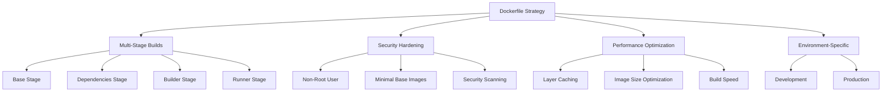

# Dockerfile Configuration

## Summary

Comprehensive guide for Dockerfile configuration in the Axisor platform. This document covers multi-stage builds, optimization strategies, security best practices, and environment-specific configurations for both backend and frontend services.

## Dockerfile Architecture



## Backend Dockerfile

### Production Dockerfile

```dockerfile
# Multi-stage build for production
FROM node:20-alpine AS base

# Install dependencies only when needed
FROM base AS deps
# Check https://github.com/nodejs/docker-node/tree/b4117f9333da4138b03a546ec926ef50a31506c3#nodealpine to understand why libc6-compat might be needed.
RUN apk add --no-cache libc6-compat curl openssl
WORKDIR /app

# Install dependencies based on the preferred package manager
COPY package.json package-lock.json* ./
RUN npm ci --only=production && npm cache clean --force

# Rebuild the source code only when needed
FROM base AS builder
WORKDIR /app
COPY --from=deps /app/node_modules ./node_modules
COPY . .

# Install dev dependencies for building
RUN npm install typescript @types/node tsx --save-dev

# Generate Prisma client
RUN npx prisma generate

# Skip TypeScript compilation for now - use tsx directly
RUN echo "Skipping TypeScript build, using tsx directly"

# Production image, copy all the files and run the app
FROM base AS runner
WORKDIR /app

# Install OpenSSL and curl
RUN apk add --no-cache openssl curl

# Create a non-root user
RUN addgroup --system --gid 1001 nodejs
RUN adduser --system --uid 1001 nodejs

# Copy the source code (no dist folder since we're using tsx)
COPY --from=builder /app/src ./src
COPY --from=builder /app/node_modules ./node_modules
COPY --from=builder /app/package.json ./package.json
COPY --from=builder /app/prisma ./prisma

# Copy environment files
COPY --from=builder /app/.env.example ./.env.example

# Change ownership to nodejs user
RUN chown -R nodejs:nodejs /app
USER nodejs

# Expose port
EXPOSE 3010

# Health check
HEALTHCHECK --interval=30s --timeout=3s --start-period=5s --retries=3 \
  CMD curl -f http://localhost:3010/health || exit 1

# Start the application with tsx (production environment)
CMD ["npx", "tsx", "src/index.ts"]
```

### Development Dockerfile

```dockerfile
# Development Dockerfile
FROM node:20-alpine AS base

# Install dependencies
RUN apk add --no-cache libc6-compat curl openssl git
WORKDIR /app

# Copy package files
COPY package.json package-lock.json* ./

# Install all dependencies (including dev dependencies)
RUN npm ci && npm cache clean --force

# Copy source code
COPY . .

# Generate Prisma client
RUN npx prisma generate

# Create non-root user
RUN addgroup --system --gid 1001 nodejs
RUN adduser --system --uid 1001 nodejs

# Change ownership
RUN chown -R nodejs:nodejs /app
USER nodejs

# Expose port
EXPOSE 3010

# Health check
HEALTHCHECK --interval=30s --timeout=3s --start-period=5s --retries=3 \
  CMD curl -f http://localhost:3010/health || exit 1

# Start development server
CMD ["npm", "run", "dev"]
```

## Frontend Dockerfile

### Production Dockerfile

```dockerfile
# Multi-stage build for production
FROM node:20-alpine AS base

# Install dependencies only when needed
FROM base AS deps
RUN apk add --no-cache libc6-compat
WORKDIR /app

# Install dependencies based on the preferred package manager
COPY package.json package-lock.json* ./
RUN npm ci && npm cache clean --force

# Rebuild the source code only when needed
FROM base AS builder
WORKDIR /app
COPY --from=deps /app/node_modules ./node_modules
COPY . .

# Build the application
RUN npm run build

# Production image with nginx
FROM nginx:alpine AS runner

# Copy built assets
COPY --from=builder /app/dist /usr/share/nginx/html

# Copy nginx configuration
COPY nginx.conf /etc/nginx/nginx.conf

# Expose port
EXPOSE 80

# Health check
HEALTHCHECK --interval=30s --timeout=3s --start-period=5s --retries=3 \
  CMD curl -f http://localhost/ || exit 1

# Start nginx
CMD ["nginx", "-g", "daemon off;"]
```

### Development Dockerfile

```dockerfile
# Development Dockerfile
FROM node:20-alpine AS base

# Install dependencies
RUN apk add --no-cache libc6-compat
WORKDIR /app

# Copy package files
COPY package.json package-lock.json* ./

# Install all dependencies
RUN npm ci && npm cache clean --force

# Copy source code
COPY . .

# Create non-root user
RUN addgroup --system --gid 1001 nodejs
RUN adduser --system --uid 1001 nodejs

# Change ownership
RUN chown -R nodejs:nodejs /app
USER nodejs

# Expose port
EXPOSE 3001

# Health check
HEALTHCHECK --interval=30s --timeout=3s --start-period=5s --retries=3 \
  CMD curl -f http://localhost:3001 || exit 1

# Start development server
CMD ["npm", "run", "dev"]
```

## Multi-Stage Build Strategy

### Stage Breakdown

```dockerfile
# Stage 1: Base - Common base image
FROM node:20-alpine AS base
RUN apk add --no-cache libc6-compat curl openssl
WORKDIR /app

# Stage 2: Dependencies - Install dependencies only
FROM base AS deps
COPY package.json package-lock.json* ./
RUN npm ci --only=production && npm cache clean --force

# Stage 3: Builder - Build the application
FROM base AS builder
COPY --from=deps /app/node_modules ./node_modules
COPY . .
RUN npm run build

# Stage 4: Runner - Production runtime
FROM base AS runner
COPY --from=builder /app/dist ./dist
COPY --from=builder /app/node_modules ./node_modules
COPY --from=builder /app/package.json ./package.json
USER nodejs
EXPOSE 3010
CMD ["npm", "start"]
```

### Build Optimization

```dockerfile
# Use .dockerignore to exclude unnecessary files
# .dockerignore
node_modules
npm-debug.log
.git
.gitignore
README.md
.env
.nyc_output
coverage
.coverage
.env.local
.env.development.local
.env.test.local
.env.production.local

# Optimize layer caching
FROM node:20-alpine AS base
WORKDIR /app

# Copy package files first for better caching
COPY package.json package-lock.json* ./

# Install dependencies (this layer will be cached if package.json doesn't change)
RUN npm ci --only=production && npm cache clean --force

# Copy source code (this layer will be rebuilt when source changes)
COPY . .

# Build application
RUN npm run build
```

## Security Hardening

### Non-Root User

```dockerfile
# Create non-root user
RUN addgroup --system --gid 1001 nodejs
RUN adduser --system --uid 1001 nodejs

# Create app directory with proper permissions
RUN mkdir -p /app && chown -R nodejs:nodejs /app

# Switch to non-root user
USER nodejs
```

### Minimal Base Images

```dockerfile
# Use Alpine Linux for smaller image size
FROM node:20-alpine AS base

# Remove unnecessary packages
RUN apk del --purge && rm -rf /var/cache/apk/*

# Use distroless images for production (alternative)
FROM gcr.io/distroless/nodejs20-debian11 AS runner
COPY --from=builder /app/dist /app
WORKDIR /app
CMD ["index.js"]
```

### Security Scanning

```dockerfile
# Add security scanning stage
FROM base AS security-scan
COPY . .
RUN npm audit --audit-level=high
RUN npx snyk test --severity-threshold=high

# Use security-hardened base image
FROM node:20-alpine3.18 AS base
RUN apk add --no-cache --upgrade apk-tools
```

## Performance Optimization

### Layer Optimization

```dockerfile
# Combine RUN commands to reduce layers
FROM node:20-alpine AS base
RUN apk add --no-cache \
    libc6-compat \
    curl \
    openssl \
    && rm -rf /var/cache/apk/*

# Use multi-line commands for readability
RUN npm ci --only=production \
    && npm cache clean --force \
    && rm -rf /tmp/*
```

### Build Context Optimization

```dockerfile
# Use .dockerignore to reduce build context
# .dockerignore
node_modules
.git
*.log
.env*
coverage
.nyc_output
dist
build
```

### Image Size Optimization

```dockerfile
# Use Alpine Linux
FROM node:20-alpine AS base

# Remove package manager cache
RUN npm ci --only=production \
    && npm cache clean --force \
    && rm -rf /var/cache/apk/*

# Use multi-stage build to exclude build dependencies
FROM node:20-alpine AS runner
COPY --from=builder /app/dist ./dist
COPY --from=builder /app/node_modules ./node_modules
# Exclude dev dependencies from final image
```

## Environment-Specific Configurations

### Production Configuration

```dockerfile
# Production Dockerfile
FROM node:20-alpine AS base

# Install production dependencies only
FROM base AS deps
COPY package.json package-lock.json* ./
RUN npm ci --only=production && npm cache clean --force

# Build for production
FROM base AS builder
COPY --from=deps /app/node_modules ./node_modules
COPY . .
RUN npm run build

# Production runtime
FROM base AS runner
COPY --from=builder /app/dist ./dist
COPY --from=builder /app/node_modules ./node_modules

# Security hardening
RUN addgroup --system --gid 1001 nodejs
RUN adduser --system --uid 1001 nodejs
USER nodejs

# Health check
HEALTHCHECK --interval=30s --timeout=3s --start-period=5s --retries=3 \
  CMD curl -f http://localhost:3010/health || exit 1

# Production command
CMD ["npm", "start"]
```

### Development Configuration

```dockerfile
# Development Dockerfile
FROM node:20-alpine AS base

# Install all dependencies including dev dependencies
COPY package.json package-lock.json* ./
RUN npm ci && npm cache clean --force

# Copy source code
COPY . .

# Generate Prisma client
RUN npx prisma generate

# Development command with hot reload
CMD ["npm", "run", "dev"]
```

### Testing Configuration

```dockerfile
# Testing Dockerfile
FROM node:20-alpine AS base

# Install dependencies
COPY package.json package-lock.json* ./
RUN npm ci && npm cache clean --force

# Copy source code
COPY . .

# Generate Prisma client
RUN npx prisma generate

# Run tests
CMD ["npm", "test"]
```

## Health Checks

### Backend Health Check

```dockerfile
# Health check for backend
HEALTHCHECK --interval=30s --timeout=3s --start-period=5s --retries=3 \
  CMD curl -f http://localhost:3010/health || exit 1
```

### Frontend Health Check

```dockerfile
# Health check for frontend
HEALTHCHECK --interval=30s --timeout=3s --start-period=5s --retries=3 \
  CMD curl -f http://localhost/ || exit 1
```

### Database Health Check

```dockerfile
# Health check for database
HEALTHCHECK --interval=30s --timeout=3s --start-period=5s --retries=3 \
  CMD pg_isready -U $POSTGRES_USER -d $POSTGRES_DB || exit 1
```

### Redis Health Check

```dockerfile
# Health check for Redis
HEALTHCHECK --interval=30s --timeout=3s --start-period=5s --retries=3 \
  CMD redis-cli ping || exit 1
```

## Build Commands

### Local Development

```bash
# Build development image
docker build -f Dockerfile.dev -t axisor-backend:dev .

# Build with build args
docker build -f Dockerfile.dev \
  --build-arg NODE_ENV=development \
  --build-arg PORT=3010 \
  -t axisor-backend:dev .

# Build and run
docker build -f Dockerfile.dev -t axisor-backend:dev .
docker run -p 3010:3010 axisor-backend:dev
```

### Production Build

```bash
# Build production image
docker build -f Dockerfile -t axisor-backend:latest .

# Build with build args
docker build -f Dockerfile \
  --build-arg NODE_ENV=production \
  --build-arg PORT=3010 \
  -t axisor-backend:latest .

# Build and tag for registry
docker build -f Dockerfile -t axisor-backend:latest .
docker tag axisor-backend:latest registry.example.com/axisor-backend:latest
docker push registry.example.com/axisor-backend:latest
```

### Multi-Architecture Build

```bash
# Build for multiple architectures
docker buildx build --platform linux/amd64,linux/arm64 -t axisor-backend:latest .

# Build and push for multiple architectures
docker buildx build --platform linux/amd64,linux/arm64 \
  -t registry.example.com/axisor-backend:latest \
  --push .
```

## Build Optimization

### Docker BuildKit

```bash
# Enable Docker BuildKit
export DOCKER_BUILDKIT=1

# Use BuildKit features
docker build --build-arg BUILDKIT_INLINE_CACHE=1 -t axisor-backend:latest .
```

### Build Cache

```bash
# Use build cache
docker build --cache-from axisor-backend:latest -t axisor-backend:latest .

# Use registry cache
docker build --cache-from registry.example.com/axisor-backend:cache -t axisor-backend:latest .
```

### Parallel Builds

```bash
# Build multiple images in parallel
docker build -f backend/Dockerfile -t axisor-backend:latest backend/ &
docker build -f frontend/Dockerfile -t axisor-frontend:latest frontend/ &
wait
```

## Troubleshooting

### Build Issues

```bash
# Debug build process
docker build --progress=plain -t axisor-backend:debug .

# Build with verbose output
docker build --no-cache --progress=plain -t axisor-backend:debug .

# Check build context
docker build --no-cache --progress=plain -t axisor-backend:debug . 2>&1 | tee build.log
```

### Image Issues

```bash
# Inspect image layers
docker history axisor-backend:latest

# Check image size
docker images axisor-backend:latest

# Analyze image
docker run --rm -v /var/run/docker.sock:/var/run/docker.sock \
  wagoodman/dive:latest axisor-backend:latest
```

### Runtime Issues

```bash
# Debug container
docker run -it --entrypoint /bin/sh axisor-backend:latest

# Check container logs
docker logs axisor-backend-container

# Inspect container
docker inspect axisor-backend-container
```

## Best Practices

### Dockerfile Best Practices

1. **Use specific base image tags**
   ```dockerfile
   FROM node:20-alpine3.18  # Specific version
   ```

2. **Minimize layers**
   ```dockerfile
   RUN apk add --no-cache \
       libc6-compat \
       curl \
       openssl
   ```

3. **Use .dockerignore**
   ```dockerignore
   node_modules
   .git
   *.log
   .env*
   ```

4. **Use multi-stage builds**
   ```dockerfile
   FROM node:20-alpine AS base
   FROM base AS deps
   FROM base AS builder
   FROM base AS runner
   ```

5. **Run as non-root user**
   ```dockerfile
   RUN adduser --system --uid 1001 nodejs
   USER nodejs
   ```

### Security Best Practices

1. **Use minimal base images**
2. **Keep base images updated**
3. **Scan for vulnerabilities**
4. **Use non-root users**
5. **Limit file permissions**

### Performance Best Practices

1. **Optimize layer caching**
2. **Use multi-stage builds**
3. **Minimize image size**
4. **Use build cache**
5. **Parallel builds**

## How to Use This Document

- **For Development**: Use the development Dockerfile configurations for local development
- **For Production**: Use the production Dockerfile configurations for production deployments
- **For Optimization**: Follow the performance optimization strategies
- **For Security**: Implement the security hardening measures
- **For Troubleshooting**: Use the troubleshooting section for common issues
