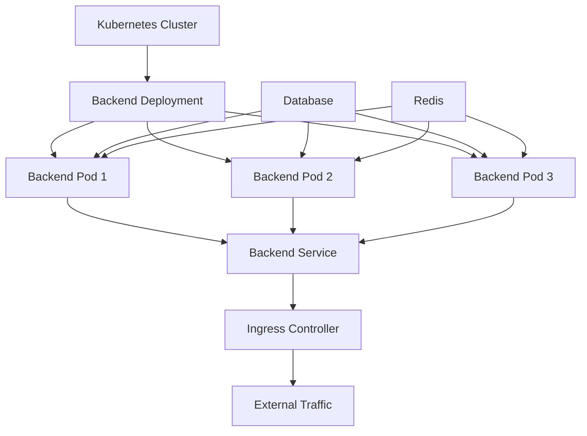

# Kubernetes Backend Deployment

## Summary

Complete guide for deploying the Axisor backend service on Kubernetes. This document covers deployment configuration, scaling, health checks, resource management, and production best practices.

## Backend Deployment Architecture



## Basic Backend Deployment

### Deployment Manifest

```yaml
apiVersion: apps/v1
kind: Deployment
metadata:
  name: axisor-backend
  namespace: axisor
  labels:
    app: axisor-backend
    version: v1.0.0
spec:
  replicas: 3
  strategy:
    type: RollingUpdate
    rollingUpdate:
      maxUnavailable: 1
      maxSurge: 1
  selector:
    matchLabels:
      app: axisor-backend
  template:
    metadata:
      labels:
        app: axisor-backend
        version: v1.0.0
    spec:
      serviceAccountName: axisor-backend
      securityContext:
        runAsNonRoot: true
        runAsUser: 1000
        runAsGroup: 1000
        fsGroup: 1000
      containers:
      - name: backend
        image: axisor/backend:latest
        ports:
        - name: http
          containerPort: 3010
          protocol: TCP
        - name: metrics
          containerPort: 9090
          protocol: TCP
        env:
        - name: NODE_ENV
          value: "production"
        - name: PORT
          value: "3010"
        - name: LOG_LEVEL
          value: "info"
        envFrom:
        - configMapRef:
            name: axisor-config
        - secretRef:
            name: axisor-secrets
        resources:
          requests:
            memory: "256Mi"
            cpu: "250m"
          limits:
            memory: "512Mi"
            cpu: "500m"
        livenessProbe:
          httpGet:
            path: /health
            port: 3010
          initialDelaySeconds: 30
          periodSeconds: 10
          timeoutSeconds: 5
          failureThreshold: 3
        readinessProbe:
          httpGet:
            path: /ready
            port: 3010
          initialDelaySeconds: 5
          periodSeconds: 5
          timeoutSeconds: 3
          failureThreshold: 3
        startupProbe:
          httpGet:
            path: /health
            port: 3010
          initialDelaySeconds: 10
          periodSeconds: 5
          timeoutSeconds: 3
          failureThreshold: 10
        volumeMounts:
        - name: tmp
          mountPath: /tmp
        - name: var-cache
          mountPath: /var/cache
        - name: var-log
          mountPath: /var/log
      volumes:
      - name: tmp
        emptyDir: {}
      - name: var-cache
        emptyDir: {}
      - name: var-log
        emptyDir: {}
      imagePullSecrets:
      - name: axisor-registry-secret
```

## Backend Service

### Service Manifest

```yaml
apiVersion: v1
kind: Service
metadata:
  name: axisor-backend
  namespace: axisor
  labels:
    app: axisor-backend
spec:
  type: ClusterIP
  selector:
    app: axisor-backend
  ports:
  - name: http
    port: 80
    targetPort: 3010
    protocol: TCP
  - name: metrics
    port: 9090
    targetPort: 9090
    protocol: TCP
  sessionAffinity: None
```

## Horizontal Pod Autoscaler

### HPA Configuration

```yaml
apiVersion: autoscaling/v2
kind: HorizontalPodAutoscaler
metadata:
  name: axisor-backend-hpa
  namespace: axisor
spec:
  scaleTargetRef:
    apiVersion: apps/v1
    kind: Deployment
    name: axisor-backend
  minReplicas: 3
  maxReplicas: 10
  metrics:
  - type: Resource
    resource:
      name: cpu
      target:
        type: Utilization
        averageUtilization: 70
  - type: Resource
    resource:
      name: memory
      target:
        type: Utilization
        averageUtilization: 80
  - type: Pods
    pods:
      metric:
        name: http_requests_per_second
      target:
        type: AverageValue
        averageValue: "100"
  behavior:
    scaleDown:
      stabilizationWindowSeconds: 300
      policies:
      - type: Percent
        value: 50
        periodSeconds: 60
    scaleUp:
      stabilizationWindowSeconds: 60
      policies:
      - type: Percent
        value: 100
        periodSeconds: 60
      - type: Pods
        value: 2
        periodSeconds: 60
      selectPolicy: Max
```

## Vertical Pod Autoscaler

### VPA Configuration

```yaml
apiVersion: autoscaling.k8s.io/v1
kind: VerticalPodAutoscaler
metadata:
  name: axisor-backend-vpa
  namespace: axisor
spec:
  targetRef:
    apiVersion: apps/v1
    kind: Deployment
    name: axisor-backend
  updatePolicy:
    updateMode: "Auto"
  resourcePolicy:
    containerPolicies:
    - containerName: backend
      minAllowed:
        cpu: 100m
        memory: 128Mi
      maxAllowed:
        cpu: 1000m
        memory: 1Gi
      controlledResources: ["cpu", "memory"]
```

## Pod Disruption Budget

### PDB Configuration

```yaml
apiVersion: policy/v1
kind: PodDisruptionBudget
metadata:
  name: axisor-backend-pdb
  namespace: axisor
spec:
  minAvailable: 2
  selector:
    matchLabels:
      app: axisor-backend
```

## Network Policies

### Backend Network Policy

```yaml
apiVersion: networking.k8s.io/v1
kind: NetworkPolicy
metadata:
  name: axisor-backend-netpol
  namespace: axisor
spec:
  podSelector:
    matchLabels:
      app: axisor-backend
  policyTypes:
  - Ingress
  - Egress
  ingress:
  - from:
    - namespaceSelector:
        matchLabels:
          name: axisor
    - podSelector:
        matchLabels:
          app: axisor-frontend
    ports:
    - protocol: TCP
      port: 3010
  - from:
    - podSelector:
        matchLabels:
          app: prometheus
    ports:
    - protocol: TCP
      port: 9090
  egress:
  - to:
    - podSelector:
        matchLabels:
          app: axisor-database
    ports:
    - protocol: TCP
      port: 5432
  - to:
    - podSelector:
        matchLabels:
          app: axisor-redis
    ports:
    - protocol: TCP
      port: 6379
  - to: []
    ports:
    - protocol: TCP
      port: 443
    - protocol: TCP
      port: 80
```

## ConfigMap and Secrets

### Backend ConfigMap

```yaml
apiVersion: v1
kind: ConfigMap
metadata:
  name: axisor-config
  namespace: axisor
data:
  NODE_ENV: "production"
  PORT: "3010"
  LOG_LEVEL: "info"
  RATE_LIMIT_MAX: "100"
  CORS_ORIGIN: "https://app.axisor.com"
  PROMETHEUS_PORT: "9090"
  JWT_EXPIRES_IN: "24h"
  LN_MARKETS_API_URL: "https://api.lnmarkets.com"
  LN_MARKETS_TESTNET_API_URL: "https://api.testnet.lnmarkets.com"
```

### Backend Secrets

```yaml
apiVersion: v1
kind: Secret
metadata:
  name: axisor-secrets
  namespace: axisor
type: Opaque
data:
  DATABASE_URL: cG9zdGdyZXM6Ly9wb3N0Z3Jlczpxd2VydHl1aT9AYXhpc29yLWRiOjU0MzIvYXhpc29y
  REDIS_URL: cmVkaXM6Ly9yZWRpczpxd2VydHl1aT9AYXhpc29yLXJlZGlzOjYzNzk=
  JWT_SECRET: eW91ci1qd3Qtc2VjcmV0LWhlcmU=
  LN_MARKETS_API_KEY: eW91ci1hcGkta2V5LWhlcmU=
  LN_MARKETS_API_SECRET: eW91ci1hcGktc2VjcmV0LWhlcmU=
```

## Service Account and RBAC

### Service Account

```yaml
apiVersion: v1
kind: ServiceAccount
metadata:
  name: axisor-backend
  namespace: axisor
automountServiceAccountToken: false
```

### Role and RoleBinding

```yaml
apiVersion: rbac.authorization.k8s.io/v1
kind: Role
metadata:
  name: axisor-backend-role
  namespace: axisor
rules:
- apiGroups: [""]
  resources: ["pods", "services", "endpoints"]
  verbs: ["get", "list", "watch"]
- apiGroups: ["apps"]
  resources: ["deployments", "replicasets"]
  verbs: ["get", "list", "watch"]
- apiGroups: [""]
  resources: ["secrets", "configmaps"]
  verbs: ["get", "list"]
---
apiVersion: rbac.authorization.k8s.io/v1
kind: RoleBinding
metadata:
  name: axisor-backend-binding
  namespace: axisor
subjects:
- kind: ServiceAccount
  name: axisor-backend
  namespace: axisor
roleRef:
  kind: Role
  name: axisor-backend-role
  apiGroup: rbac.authorization.k8s.io
```

## Ingress Configuration

### Backend Ingress

```yaml
apiVersion: networking.k8s.io/v1
kind: Ingress
metadata:
  name: axisor-backend-ingress
  namespace: axisor
  annotations:
    nginx.ingress.kubernetes.io/rewrite-target: /
    nginx.ingress.kubernetes.io/ssl-redirect: "true"
    nginx.ingress.kubernetes.io/force-ssl-redirect: "true"
    cert-manager.io/cluster-issuer: "letsencrypt-prod"
spec:
  ingressClassName: nginx
  tls:
  - hosts:
    - api.axisor.com
    secretName: axisor-tls
  rules:
  - host: api.axisor.com
    http:
      paths:
      - path: /
        pathType: Prefix
        backend:
          service:
            name: axisor-backend
            port:
              number: 80
```

## Monitoring and Observability

### ServiceMonitor

```yaml
apiVersion: monitoring.coreos.com/v1
kind: ServiceMonitor
metadata:
  name: axisor-backend
  namespace: monitoring
  labels:
    app: axisor-backend
spec:
  selector:
    matchLabels:
      app: axisor-backend
  endpoints:
  - port: metrics
    path: /metrics
    interval: 30s
    scrapeTimeout: 10s
```

## Deployment Commands

### Deploy Backend

```bash
# Apply all backend resources
kubectl apply -f backend-deployment.yaml
kubectl apply -f backend-service.yaml
kubectl apply -f backend-hpa.yaml
kubectl apply -f backend-vpa.yaml
kubectl apply -f backend-pdb.yaml

# Check deployment status
kubectl get deployments -n axisor
kubectl get pods -n axisor -l app=axisor-backend

# Check logs
kubectl logs -f deployment/axisor-backend -n axisor
```

### Scaling Commands

```bash
# Manual scaling
kubectl scale deployment axisor-backend --replicas=5 -n axisor

# Check HPA status
kubectl get hpa axisor-backend-hpa -n axisor

# Check VPA status
kubectl get vpa axisor-backend-vpa -n axisor
```

### Health Checks

```bash
# Check pod health
kubectl get pods -n axisor -l app=axisor-backend

# Check service endpoints
kubectl get endpoints axisor-backend -n axisor

# Test backend health
kubectl port-forward svc/axisor-backend 3010:80 -n axisor
curl http://localhost:3010/health
```

## Troubleshooting

### Common Issues

#### Pod CrashLoopBackOff

```bash
# Check pod logs
kubectl logs deployment/axisor-backend -n axisor --previous

# Check pod events
kubectl describe pod -l app=axisor-backend -n axisor

# Check resource usage
kubectl top pods -n axisor -l app=axisor-backend
```

#### Service Not Accessible

```bash
# Check service endpoints
kubectl get endpoints axisor-backend -n axisor

# Check service selector
kubectl get pods -n axisor -l app=axisor-backend

# Test service connectivity
kubectl run test-pod --image=busybox -n axisor --rm -it --restart=Never -- wget -O- http://axisor-backend
```

## How to Use This Document

- **For Deployment**: Use the deployment manifests for initial setup
- **For Scaling**: Use the HPA and VPA configurations for automatic scaling
- **For Security**: Use the network policies and RBAC for access control
- **For Monitoring**: Use the ServiceMonitor for metrics collection
