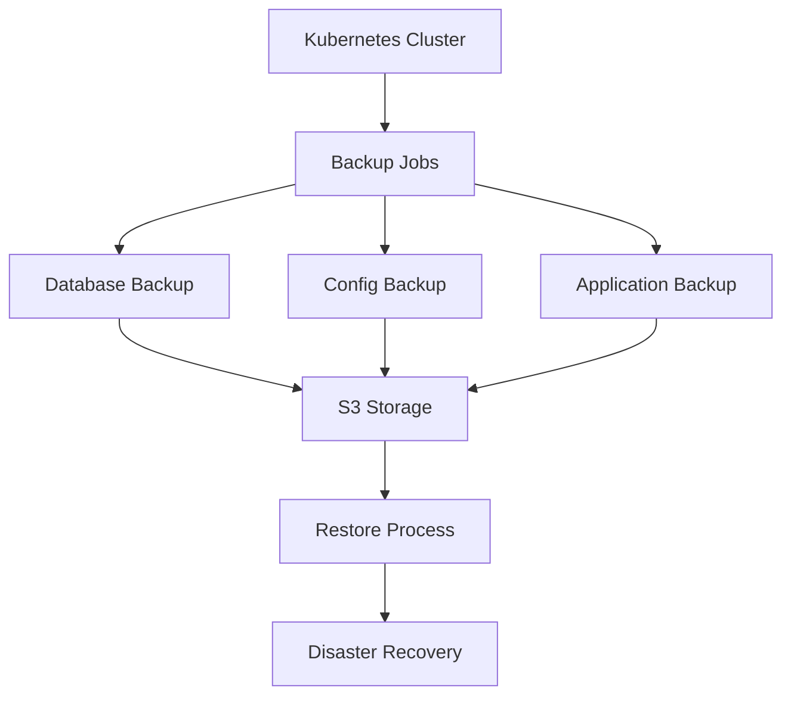

# Kubernetes Backup and Restore

## Summary

Comprehensive guide for implementing backup and restore strategies in Kubernetes for the Axisor platform. This document covers database backups, application state, configuration backups, and disaster recovery procedures.

## Backup Architecture



## Database Backup

### PostgreSQL Backup Job

```yaml
apiVersion: batch/v1
kind: CronJob
metadata:
  name: postgres-backup
  namespace: axisor
spec:
  schedule: "0 2 * * *"
  jobTemplate:
    spec:
      template:
        spec:
          containers:
          - name: backup
            image: postgres:15
            env:
            - name: PGPASSWORD
              valueFrom:
                secretKeyRef:
                  name: axisor-secrets
                  key: DATABASE_PASSWORD
            - name: AWS_ACCESS_KEY_ID
              valueFrom:
                secretKeyRef:
                  name: aws-credentials
                  key: access-key-id
            - name: AWS_SECRET_ACCESS_KEY
              valueFrom:
                secretKeyRef:
                  name: aws-credentials
                  key: secret-access-key
            command:
            - /bin/bash
            - -c
            - |
              pg_dump -h axisor-database -U postgres axisor | gzip > /backup/axisor-$(date +%Y%m%d-%H%M%S).sql.gz
              aws s3 cp /backup/axisor-$(date +%Y%m%d-%H%M%S).sql.gz s3://axisor-backups/database/
              # Keep only last 30 days
              aws s3 ls s3://axisor-backups/database/ --recursive | awk '$1 < "'$(date -d '30 days ago' '+%Y-%m-%d')'" {print $4}' | xargs -r aws s3 rm s3://axisor-backups/database/
            volumeMounts:
            - name: backup-volume
              mountPath: /backup
          volumes:
          - name: backup-volume
            persistentVolumeClaim:
              claimName: backup-pvc
          restartPolicy: OnFailure
```

### Redis Backup Job

```yaml
apiVersion: batch/v1
kind: CronJob
metadata:
  name: redis-backup
  namespace: axisor
spec:
  schedule: "0 3 * * *"
  jobTemplate:
    spec:
      template:
        spec:
          containers:
          - name: backup
            image: redis:7-alpine
            command:
            - /bin/bash
            - -c
            - |
              redis-cli -h axisor-redis --rdb /backup/axisor-redis-$(date +%Y%m%d-%H%M%S).rdb
              gzip /backup/axisor-redis-$(date +%Y%m%d-%H%M%S).rdb
              aws s3 cp /backup/axisor-redis-$(date +%Y%m%d-%H%M%S).rdb.gz s3://axisor-backups/redis/
            volumeMounts:
            - name: backup-volume
              mountPath: /backup
          volumes:
          - name: backup-volume
            persistentVolumeClaim:
              claimName: backup-pvc
          restartPolicy: OnFailure
```

## Configuration Backup

### ConfigMap and Secret Backup

```yaml
apiVersion: batch/v1
kind: CronJob
metadata:
  name: config-backup
  namespace: axisor
spec:
  schedule: "0 1 * * *"
  jobTemplate:
    spec:
      template:
        spec:
          containers:
          - name: backup
            image: bitnami/kubectl:latest
            command:
            - /bin/bash
            - -c
            - |
              # Backup ConfigMaps
              kubectl get configmaps -n axisor -o yaml > /backup/configmaps-$(date +%Y%m%d-%H%M%S).yaml
              
              # Backup Secrets (without sensitive data)
              kubectl get secrets -n axisor -o yaml > /backup/secrets-$(date +%Y%m%d-%H%M%S).yaml
              
              # Backup Deployments
              kubectl get deployments -n axisor -o yaml > /backup/deployments-$(date +%Y%m%d-%H%M%S).yaml
              
              # Backup Services
              kubectl get services -n axisor -o yaml > /backup/services-$(date +%Y%m%d-%H%M%S).yaml
              
              # Compress and upload
              tar -czf /backup/k8s-config-$(date +%Y%m%d-%H%M%S).tar.gz /backup/*.yaml
              aws s3 cp /backup/k8s-config-$(date +%Y%m%d-%H%M%S).tar.gz s3://axisor-backups/kubernetes/
            volumeMounts:
            - name: backup-volume
              mountPath: /backup
          volumes:
          - name: backup-volume
            persistentVolumeClaim:
              claimName: backup-pvc
          restartPolicy: OnFailure
```

## Application State Backup

### Application Data Backup

```yaml
apiVersion: batch/v1
kind: CronJob
metadata:
  name: app-state-backup
  namespace: axisor
spec:
  schedule: "0 4 * * *"
  jobTemplate:
    spec:
      template:
        spec:
          containers:
          - name: backup
            image: axisor/backup-tool:latest
            env:
            - name: BACKUP_TYPE
              value: "application-state"
            - name: S3_BUCKET
              value: "axisor-backups"
            command:
            - /bin/bash
            - -c
            - |
              # Backup user data
              curl -X POST http://axisor-backend:3010/api/admin/backup/user-data \
                -H "Authorization: Bearer $ADMIN_TOKEN" \
                -o /backup/user-data-$(date +%Y%m%d-%H%M%S).json
              
              # Backup automation configurations
              curl -X POST http://axisor-backend:3010/api/admin/backup/automations \
                -H "Authorization: Bearer $ADMIN_TOKEN" \
                -o /backup/automations-$(date +%Y%m%d-%H%M%S).json
              
              # Upload to S3
              aws s3 cp /backup/ s3://axisor-backups/application/ --recursive
            volumeMounts:
            - name: backup-volume
              mountPath: /backup
          volumes:
          - name: backup-volume
            persistentVolumeClaim:
              claimName: backup-pvc
          restartPolicy: OnFailure
```

## Restore Procedures

### Database Restore

```yaml
apiVersion: batch/v1
kind: Job
metadata:
  name: postgres-restore
  namespace: axisor
spec:
  template:
    spec:
      containers:
      - name: restore
        image: postgres:15
        env:
        - name: PGPASSWORD
          valueFrom:
            secretKeyRef:
              name: axisor-secrets
              key: DATABASE_PASSWORD
        - name: RESTORE_FILE
          value: "axisor-20240106-020000.sql.gz"
        command:
        - /bin/bash
        - -c
        - |
          # Download backup from S3
          aws s3 cp s3://axisor-backups/database/$RESTORE_FILE /backup/
          
          # Stop application
          kubectl scale deployment axisor-backend --replicas=0 -n axisor
          
          # Wait for pods to terminate
          kubectl wait --for=delete pod -l app=axisor-backend --timeout=300s -n axisor
          
          # Drop and recreate database
          psql -h axisor-database -U postgres -c "DROP DATABASE IF EXISTS axisor;"
          psql -h axisor-database -U postgres -c "CREATE DATABASE axisor;"
          
          # Restore database
          gunzip -c /backup/$RESTORE_FILE | psql -h axisor-database -U postgres axisor
          
          # Restart application
          kubectl scale deployment axisor-backend --replicas=3 -n axisor
        volumeMounts:
        - name: backup-volume
          mountPath: /backup
      volumes:
      - name: backup-volume
        persistentVolumeClaim:
          claimName: backup-pvc
      restartPolicy: Never
```

### Configuration Restore

```yaml
apiVersion: batch/v1
kind: Job
metadata:
  name: config-restore
  namespace: axisor
spec:
  template:
    spec:
      containers:
      - name: restore
        image: bitnami/kubectl:latest
        command:
        - /bin/bash
        - -c
        - |
          # Download configuration backup
          aws s3 cp s3://axisor-backups/kubernetes/k8s-config-20240106-010000.tar.gz /backup/
          
          # Extract backup
          tar -xzf /backup/k8s-config-20240106-010000.tar.gz -C /backup/
          
          # Restore ConfigMaps
          kubectl apply -f /backup/configmaps-20240106-010000.yaml
          
          # Restore Secrets
          kubectl apply -f /backup/secrets-20240106-010000.yaml
          
          # Restore Deployments
          kubectl apply -f /backup/deployments-20240106-010000.yaml
          
          # Restore Services
          kubectl apply -f /backup/services-20240106-010000.yaml
        volumeMounts:
        - name: backup-volume
          mountPath: /backup
      volumes:
      - name: backup-volume
        persistentVolumeClaim:
          claimName: backup-pvc
      restartPolicy: Never
```

## Disaster Recovery

### Full Cluster Restore

```yaml
apiVersion: batch/v1
kind: Job
metadata:
  name: disaster-recovery
  namespace: axisor
spec:
  template:
    spec:
      containers:
      - name: recovery
        image: axisor/disaster-recovery:latest
        env:
        - name: RECOVERY_DATE
          value: "20240106"
        command:
        - /bin/bash
        - -c
        - |
          # 1. Restore database
          kubectl create job postgres-restore --from=cronjob/postgres-backup
          kubectl wait --for=condition=complete job/postgres-restore --timeout=1800s
          
          # 2. Restore configuration
          kubectl create job config-restore --from=cronjob/config-backup
          kubectl wait --for=condition=complete job/config-restore --timeout=600s
          
          # 3. Restore application state
          kubectl create job app-state-restore --from=cronjob/app-state-backup
          kubectl wait --for=condition=complete job/app-state-restore --timeout=600s
          
          # 4. Verify all services are running
          kubectl wait --for=condition=available deployment/axisor-backend --timeout=300s
          kubectl wait --for=condition=available deployment/axisor-frontend --timeout=300s
          
          # 5. Run health checks
          curl -f http://axisor-backend:3010/health || exit 1
          curl -f http://axisor-frontend:80/health || exit 1
          
          echo "Disaster recovery completed successfully"
        volumeMounts:
        - name: backup-volume
          mountPath: /backup
      volumes:
      - name: backup-volume
        persistentVolumeClaim:
          claimName: backup-pvc
      restartPolicy: Never
```

## Backup Monitoring

### Backup Status Monitoring

```yaml
apiVersion: v1
kind: ConfigMap
metadata:
  name: backup-monitoring
  namespace: axisor
data:
  backup-check.sh: |
    #!/bin/bash
    
    # Check if backups are recent (within 24 hours)
    LATEST_DB_BACKUP=$(aws s3 ls s3://axisor-backups/database/ --recursive | sort | tail -n 1 | awk '{print $1" "$2}')
    LATEST_CONFIG_BACKUP=$(aws s3 ls s3://axisor-backups/kubernetes/ --recursive | sort | tail -n 1 | awk '{print $1" "$2}')
    
    # Convert to timestamp and check if within 24 hours
    DB_TIMESTAMP=$(date -d "$LATEST_DB_BACKUP" +%s)
    CONFIG_TIMESTAMP=$(date -d "$LATEST_CONFIG_BACKUP" +%s)
    CURRENT_TIMESTAMP=$(date +%s)
    TWENTY_FOUR_HOURS=86400
    
    if [ $((CURRENT_TIMESTAMP - DB_TIMESTAMP)) -gt $TWENTY_FOUR_HOURS ]; then
      echo "ERROR: Database backup is older than 24 hours"
      exit 1
    fi
    
    if [ $((CURRENT_TIMESTAMP - CONFIG_TIMESTAMP)) -gt $TWENTY_FOUR_HOURS ]; then
      echo "ERROR: Configuration backup is older than 24 hours"
      exit 1
    fi
    
    echo "SUCCESS: All backups are recent"
```

## Backup Storage

### S3 Bucket Configuration

```yaml
apiVersion: v1
kind: ConfigMap
metadata:
  name: s3-backup-config
  namespace: axisor
data:
  bucket-policy.json: |
    {
      "Version": "2012-10-17",
      "Statement": [
        {
          "Sid": "BackupAccess",
          "Effect": "Allow",
          "Principal": {
            "AWS": "arn:aws:iam::ACCOUNT-ID:role/axisor-backup-role"
          },
          "Action": [
            "s3:GetObject",
            "s3:PutObject",
            "s3:DeleteObject",
            "s3:ListBucket"
          ],
          "Resource": [
            "arn:aws:s3:::axisor-backups",
            "arn:aws:s3:::axisor-backups/*"
          ]
        }
      ]
    }
  
  lifecycle-policy.json: |
    {
      "Rules": [
        {
          "ID": "BackupLifecycle",
          "Status": "Enabled",
          "Transitions": [
            {
              "Days": 30,
              "StorageClass": "STANDARD_IA"
            },
            {
              "Days": 90,
              "StorageClass": "GLACIER"
            },
            {
              "Days": 365,
              "StorageClass": "DEEP_ARCHIVE"
            }
          ],
          "Expiration": {
            "Days": 2555
          }
        }
      ]
    }
```

## How to Use This Document

- **For Backup**: Use the backup jobs for automated data protection
- **For Restore**: Use the restore procedures for disaster recovery
- **For Monitoring**: Use the monitoring scripts for backup health checks
- **For Storage**: Use the S3 configuration for backup storage management
