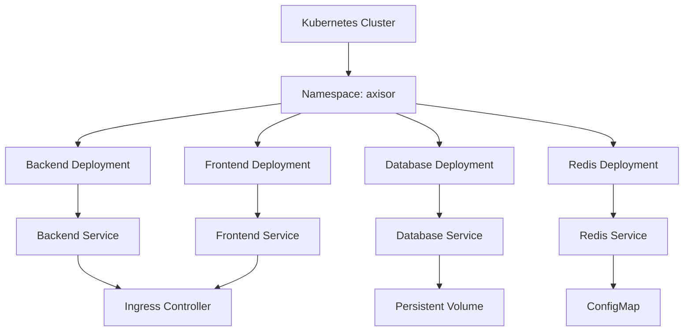

# Kubernetes Deployment Strategy

## Summary

Comprehensive guide for deploying the Axisor platform on Kubernetes. This document covers deployment strategies, rolling updates, scaling policies, and best practices for production deployments.

## Deployment Architecture



## Deployment Strategies

### Rolling Update Strategy

```yaml
apiVersion: apps/v1
kind: Deployment
metadata:
  name: axisor-backend
  namespace: axisor
spec:
  replicas: 3
  strategy:
    type: RollingUpdate
    rollingUpdate:
      maxUnavailable: 1
      maxSurge: 1
  selector:
    matchLabels:
      app: axisor-backend
  template:
    metadata:
      labels:
        app: axisor-backend
    spec:
      containers:
      - name: backend
        image: axisor/backend:latest
        ports:
        - containerPort: 3010
        resources:
          requests:
            memory: "256Mi"
            cpu: "250m"
          limits:
            memory: "512Mi"
            cpu: "500m"
```

### Blue-Green Deployment

```yaml
apiVersion: apps/v1
kind: Deployment
metadata:
  name: axisor-backend-blue
  namespace: axisor
spec:
  replicas: 3
  selector:
    matchLabels:
      app: axisor-backend
      version: blue
  template:
    metadata:
      labels:
        app: axisor-backend
        version: blue
    spec:
      containers:
      - name: backend
        image: axisor/backend:v1.0.0
        ports:
        - containerPort: 3010
```

### Canary Deployment

```yaml
apiVersion: apps/v1
kind: Deployment
metadata:
  name: axisor-backend-canary
  namespace: axisor
spec:
  replicas: 1
  selector:
    matchLabels:
      app: axisor-backend
      version: canary
  template:
    metadata:
      labels:
        app: axisor-backend
        version: canary
    spec:
      containers:
      - name: backend
        image: axisor/backend:v1.1.0
        ports:
        - containerPort: 3010
```

## Scaling Configuration

### Horizontal Pod Autoscaler

```yaml
apiVersion: autoscaling/v2
kind: HorizontalPodAutoscaler
metadata:
  name: axisor-backend-hpa
  namespace: axisor
spec:
  scaleTargetRef:
    apiVersion: apps/v1
    kind: Deployment
    name: axisor-backend
  minReplicas: 3
  maxReplicas: 10
  metrics:
  - type: Resource
    resource:
      name: cpu
      target:
        type: Utilization
        averageUtilization: 70
  - type: Resource
    resource:
      name: memory
      target:
        type: Utilization
        averageUtilization: 80
```

### Vertical Pod Autoscaler

```yaml
apiVersion: autoscaling.k8s.io/v1
kind: VerticalPodAutoscaler
metadata:
  name: axisor-backend-vpa
  namespace: axisor
spec:
  targetRef:
    apiVersion: apps/v1
    kind: Deployment
    name: axisor-backend
  updatePolicy:
    updateMode: "Auto"
  resourcePolicy:
    containerPolicies:
    - containerName: backend
      minAllowed:
        cpu: 100m
        memory: 128Mi
      maxAllowed:
        cpu: 1000m
        memory: 1Gi
```

## Health Checks

### Liveness Probe

```yaml
apiVersion: apps/v1
kind: Deployment
metadata:
  name: axisor-backend
  namespace: axisor
spec:
  template:
    spec:
      containers:
      - name: backend
        image: axisor/backend:latest
        ports:
        - containerPort: 3010
        livenessProbe:
          httpGet:
            path: /health
            port: 3010
          initialDelaySeconds: 30
          periodSeconds: 10
          timeoutSeconds: 5
          failureThreshold: 3
```

### Readiness Probe

```yaml
apiVersion: apps/v1
kind: Deployment
metadata:
  name: axisor-backend
  namespace: axisor
spec:
  template:
    spec:
      containers:
      - name: backend
        image: axisor/backend:latest
        ports:
        - containerPort: 3010
        readinessProbe:
          httpGet:
            path: /ready
            port: 3010
          initialDelaySeconds: 5
          periodSeconds: 5
          timeoutSeconds: 3
          failureThreshold: 3
```

## Resource Management

### Resource Requests and Limits

```yaml
apiVersion: apps/v1
kind: Deployment
metadata:
  name: axisor-backend
  namespace: axisor
spec:
  template:
    spec:
      containers:
      - name: backend
        image: axisor/backend:latest
        resources:
          requests:
            memory: "256Mi"
            cpu: "250m"
          limits:
            memory: "512Mi"
            cpu: "500m"
```

### Quality of Service

```yaml
apiVersion: v1
kind: Pod
metadata:
  name: axisor-backend
  namespace: axisor
spec:
  containers:
  - name: backend
    image: axisor/backend:latest
    resources:
      requests:
        memory: "256Mi"
        cpu: "250m"
      limits:
        memory: "512Mi"
        cpu: "500m"
  # This pod will have QoS class: Guaranteed
```

## How to Use This Document

- **For Deployment**: Use the deployment strategies for different release scenarios
- **For Scaling**: Use the scaling configurations for automatic resource management
- **For Health**: Use the health check configurations for reliability
- **For Resources**: Use the resource management for optimal performance
