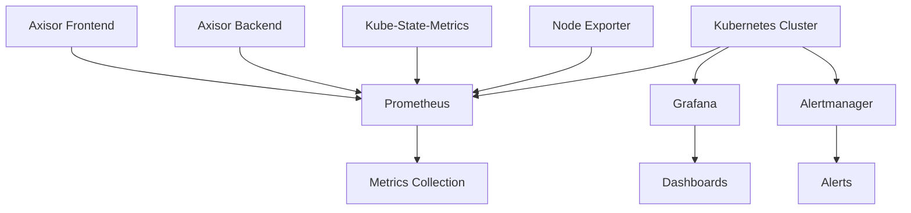

# Kubernetes Monitoring Setup

## Summary

Comprehensive guide for setting up monitoring in Kubernetes for the Axisor platform. This document covers Prometheus, Grafana, alerting, and observability best practices for production deployments.

## Monitoring Architecture



## Prometheus Configuration

### Prometheus Deployment

```yaml
apiVersion: apps/v1
kind: Deployment
metadata:
  name: prometheus
  namespace: monitoring
spec:
  replicas: 1
  selector:
    matchLabels:
      app: prometheus
  template:
    metadata:
      labels:
        app: prometheus
    spec:
      containers:
      - name: prometheus
        image: prometheus/prometheus:latest
        ports:
        - containerPort: 9090
        args:
        - --config.file=/etc/prometheus/prometheus.yml
        - --storage.tsdb.path=/prometheus/
        - --web.console.libraries=/etc/prometheus/console_libraries
        - --web.console.templates=/etc/prometheus/consoles
        - --web.enable-lifecycle
        volumeMounts:
        - name: prometheus-config
          mountPath: /etc/prometheus
        - name: prometheus-storage
          mountPath: /prometheus
      volumes:
      - name: prometheus-config
        configMap:
          name: prometheus-config
      - name: prometheus-storage
        persistentVolumeClaim:
          claimName: prometheus-pvc
```

### Prometheus ConfigMap

```yaml
apiVersion: v1
kind: ConfigMap
metadata:
  name: prometheus-config
  namespace: monitoring
data:
  prometheus.yml: |
    global:
      scrape_interval: 15s
      evaluation_interval: 15s
    
    rule_files:
      - "alert_rules.yml"
    
    alerting:
      alertmanagers:
        - static_configs:
            - targets:
              - alertmanager:9093
    
    scrape_configs:
      - job_name: 'prometheus'
        static_configs:
          - targets: ['localhost:9090']
      
      - job_name: 'kubernetes-pods'
        kubernetes_sd_configs:
          - role: pod
        relabel_configs:
          - source_labels: [__meta_kubernetes_pod_annotation_prometheus_io_scrape]
            action: keep
            regex: true
          - source_labels: [__meta_kubernetes_pod_annotation_prometheus_io_path]
            action: replace
            target_label: __metrics_path__
            regex: (.+)
      
      - job_name: 'axisor-backend'
        static_configs:
          - targets: ['axisor-backend:9090']
      
      - job_name: 'node-exporter'
        static_configs:
          - targets: ['node-exporter:9100']
```

## Grafana Configuration

### Grafana Deployment

```yaml
apiVersion: apps/v1
kind: Deployment
metadata:
  name: grafana
  namespace: monitoring
spec:
  replicas: 1
  selector:
    matchLabels:
      app: grafana
  template:
    metadata:
      labels:
        app: grafana
    spec:
      containers:
      - name: grafana
        image: grafana/grafana:latest
        ports:
        - containerPort: 3000
        env:
        - name: GF_SECURITY_ADMIN_PASSWORD
          valueFrom:
            secretKeyRef:
              name: grafana-secrets
              key: admin-password
        volumeMounts:
        - name: grafana-storage
          mountPath: /var/lib/grafana
        - name: grafana-config
          mountPath: /etc/grafana/provisioning
      volumes:
      - name: grafana-storage
        persistentVolumeClaim:
          claimName: grafana-pvc
      - name: grafana-config
        configMap:
          name: grafana-config
```

### Grafana ConfigMap

```yaml
apiVersion: v1
kind: ConfigMap
metadata:
  name: grafana-config
  namespace: monitoring
data:
  datasources.yml: |
    apiVersion: 1
    datasources:
      - name: Prometheus
        type: prometheus
        url: http://prometheus:9090
        access: proxy
        isDefault: true
  
  dashboards.yml: |
    apiVersion: 1
    providers:
      - name: 'default'
        orgId: 1
        folder: ''
        type: file
        disableDeletion: false
        updateIntervalSeconds: 10
        allowUiUpdates: true
        options:
          path: /var/lib/grafana/dashboards
```

## Alerting Configuration

### Alertmanager Deployment

```yaml
apiVersion: apps/v1
kind: Deployment
metadata:
  name: alertmanager
  namespace: monitoring
spec:
  replicas: 1
  selector:
    matchLabels:
      app: alertmanager
  template:
    metadata:
      labels:
        app: alertmanager
    spec:
      containers:
      - name: alertmanager
        image: prom/alertmanager:latest
        ports:
        - containerPort: 9093
        args:
        - --config.file=/etc/alertmanager/alertmanager.yml
        - --storage.path=/alertmanager
        volumeMounts:
        - name: alertmanager-config
          mountPath: /etc/alertmanager
        - name: alertmanager-storage
          mountPath: /alertmanager
      volumes:
      - name: alertmanager-config
        configMap:
          name: alertmanager-config
      - name: alertmanager-storage
        persistentVolumeClaim:
          claimName: alertmanager-pvc
```

### Alertmanager ConfigMap

```yaml
apiVersion: v1
kind: ConfigMap
metadata:
  name: alertmanager-config
  namespace: monitoring
data:
  alertmanager.yml: |
    global:
      smtp_smarthost: 'localhost:587'
      smtp_from: 'alerts@axisor.com'
    
    route:
      group_by: ['alertname']
      group_wait: 10s
      group_interval: 10s
      repeat_interval: 1h
      receiver: 'web.hook'
      routes:
      - match:
          severity: critical
        receiver: 'critical-alerts'
      - match:
          severity: warning
        receiver: 'warning-alerts'
    
    receivers:
    - name: 'web.hook'
      webhook_configs:
      - url: 'http://axisor-backend:3010/api/alerts/webhook'
    
    - name: 'critical-alerts'
      email_configs:
      - to: 'admin@axisor.com'
        subject: 'CRITICAL: {{ .GroupLabels.alertname }}'
        body: |
          {{ range .Alerts }}
          Alert: {{ .Annotations.summary }}
          Description: {{ .Annotations.description }}
          {{ end }}
    
    - name: 'warning-alerts'
      email_configs:
      - to: 'team@axisor.com'
        subject: 'WARNING: {{ .GroupLabels.alertname }}'
        body: |
          {{ range .Alerts }}
          Alert: {{ .Annotations.summary }}
          Description: {{ .Annotations.description }}
          {{ end }}
```

## Alert Rules

### Alert Rules ConfigMap

```yaml
apiVersion: v1
kind: ConfigMap
metadata:
  name: alert-rules
  namespace: monitoring
data:
  alert_rules.yml: |
    groups:
    - name: axisor-alerts
      rules:
      - alert: BackendDown
        expr: up{job="axisor-backend"} == 0
        for: 1m
        labels:
          severity: critical
        annotations:
          summary: "Axisor backend is down"
          description: "The Axisor backend service has been down for more than 1 minute."
      
      - alert: HighErrorRate
        expr: rate(http_requests_total{status=~"5.."}[5m]) > 0.1
        for: 5m
        labels:
          severity: warning
        annotations:
          summary: "High error rate detected"
          description: "Error rate is above 10% for the last 5 minutes."
      
      - alert: HighMemoryUsage
        expr: (node_memory_MemTotal_bytes - node_memory_MemAvailable_bytes) / node_memory_MemTotal_bytes > 0.8
        for: 5m
        labels:
          severity: warning
        annotations:
          summary: "High memory usage"
          description: "Memory usage is above 80% for the last 5 minutes."
      
      - alert: DiskSpaceLow
        expr: (node_filesystem_avail_bytes / node_filesystem_size_bytes) < 0.1
        for: 5m
        labels:
          severity: critical
        annotations:
          summary: "Disk space is low"
          description: "Disk space is below 10% on one or more nodes."
```

## Service Monitoring

### ServiceMonitor for Axisor Backend

```yaml
apiVersion: monitoring.coreos.com/v1
kind: ServiceMonitor
metadata:
  name: axisor-backend
  namespace: monitoring
spec:
  selector:
    matchLabels:
      app: axisor-backend
  endpoints:
  - port: metrics
    path: /metrics
    interval: 30s
```

### PodMonitor for Axisor Frontend

```yaml
apiVersion: monitoring.coreos.com/v1
kind: PodMonitor
metadata:
  name: axisor-frontend
  namespace: monitoring
spec:
  selector:
    matchLabels:
      app: axisor-frontend
  podMetricsEndpoints:
  - port: metrics
    path: /metrics
    interval: 30s
```

## How to Use This Document

- **For Prometheus**: Use the Prometheus configuration for metrics collection
- **For Grafana**: Use the Grafana setup for dashboards and visualization
- **For Alerts**: Use the alerting configuration for monitoring and notifications
- **For Services**: Use the ServiceMonitor examples for application monitoring
