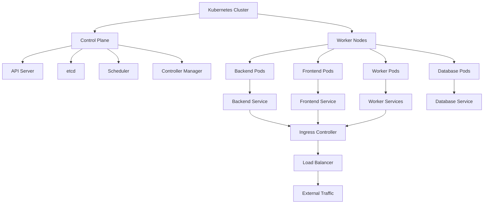

# Kubernetes Deployment Overview

## Summary

Comprehensive guide for deploying the Axisor platform on Kubernetes. This document covers cluster architecture, resource definitions, scaling strategies, monitoring, and operational procedures for running Axisor in a Kubernetes environment.

## Kubernetes Architecture



## Cluster Configuration

### Namespace

```yaml
apiVersion: v1
kind: Namespace
metadata:
  name: axisor
  labels:
    name: axisor
    environment: production
```

### ConfigMap

```yaml
apiVersion: v1
kind: ConfigMap
metadata:
  name: axisor-config
  namespace: axisor
data:
  NODE_ENV: "production"
  PORT: "13016"
  LOG_LEVEL: "info"
  LOG_FORMAT: "json"
  RATE_LIMIT_MAX: "100"
  RATE_LIMIT_TIME_WINDOW: "60000"
  CORS_ORIGIN: "https://axisor.com"
  PROMETHEUS_PORT: "9090"
  JWT_EXPIRES_IN: "2h"
  REFRESH_TOKEN_EXPIRES_IN: "7d"
  LN_MARKETS_API_URL: "https://api.lnmarkets.com"
  LN_MARKETS_SANDBOX_URL: "https://api.lnmarkets.com/sandbox"
```

### Secrets

```yaml
apiVersion: v1
kind: Secret
metadata:
  name: axisor-secrets
  namespace: axisor
type: Opaque
data:
  DATABASE_URL: <base64-encoded-database-url>
  REDIS_URL: <base64-encoded-redis-url>
  JWT_SECRET: <base64-encoded-jwt-secret>
  REFRESH_TOKEN_SECRET: <base64-encoded-refresh-token-secret>
  ENCRYPTION_KEY: <base64-encoded-encryption-key>
  SMTP_HOST: <base64-encoded-smtp-host>
  SMTP_PORT: <base64-encoded-smtp-port>
  SMTP_USER: <base64-encoded-smtp-user>
  SMTP_PASS: <base64-encoded-smtp-password>
  SMTP_FROM: <base64-encoded-smtp-from>
  ALERT_EMAIL_TO: <base64-encoded-alert-email>
  SLACK_WEBHOOK_URL: <base64-encoded-slack-webhook-url>
  SLACK_ALERT_CHANNEL: <base64-encoded-slack-channel>
  ALERT_WEBHOOK_URL: <base64-encoded-webhook-url>
  ALERT_WEBHOOK_TOKEN: <base64-encoded-webhook-token>
```

## Backend Deployment

### Deployment Configuration

```yaml
apiVersion: apps/v1
kind: Deployment
metadata:
  name: axisor-backend
  namespace: axisor
  labels:
    app: axisor-backend
    version: v1
spec:
  replicas: 3
  selector:
    matchLabels:
      app: axisor-backend
  template:
    metadata:
      labels:
        app: axisor-backend
        version: v1
    spec:
      containers:
      - name: backend
        image: axisor/backend:latest
        ports:
        - containerPort: 13016
          name: http
        - containerPort: 9090
          name: metrics
        env:
        - name: NODE_ENV
          valueFrom:
            configMapKeyRef:
              name: axisor-config
              key: NODE_ENV
        - name: PORT
          valueFrom:
            configMapKeyRef:
              name: axisor-config
              key: PORT
        - name: LOG_LEVEL
          valueFrom:
            configMapKeyRef:
              name: axisor-config
              key: LOG_LEVEL
        - name: LOG_FORMAT
          valueFrom:
            configMapKeyRef:
              name: axisor-config
              key: LOG_FORMAT
        - name: RATE_LIMIT_MAX
          valueFrom:
            configMapKeyRef:
              name: axisor-config
              key: RATE_LIMIT_MAX
        - name: RATE_LIMIT_TIME_WINDOW
          valueFrom:
            configMapKeyRef:
              name: axisor-config
              key: RATE_LIMIT_TIME_WINDOW
        - name: CORS_ORIGIN
          valueFrom:
            configMapKeyRef:
              name: axisor-config
              key: CORS_ORIGIN
        - name: PROMETHEUS_PORT
          valueFrom:
            configMapKeyRef:
              name: axisor-config
              key: PROMETHEUS_PORT
        - name: JWT_EXPIRES_IN
          valueFrom:
            configMapKeyRef:
              name: axisor-config
              key: JWT_EXPIRES_IN
        - name: REFRESH_TOKEN_EXPIRES_IN
          valueFrom:
            configMapKeyRef:
              name: axisor-config
              key: REFRESH_TOKEN_EXPIRES_IN
        - name: LN_MARKETS_API_URL
          valueFrom:
            configMapKeyRef:
              name: axisor-config
              key: LN_MARKETS_API_URL
        - name: LN_MARKETS_SANDBOX_URL
          valueFrom:
            configMapKeyRef:
              name: axisor-config
              key: LN_MARKETS_SANDBOX_URL
        - name: DATABASE_URL
          valueFrom:
            secretKeyRef:
              name: axisor-secrets
              key: DATABASE_URL
        - name: REDIS_URL
          valueFrom:
            secretKeyRef:
              name: axisor-secrets
              key: REDIS_URL
        - name: JWT_SECRET
          valueFrom:
            secretKeyRef:
              name: axisor-secrets
              key: JWT_SECRET
        - name: REFRESH_TOKEN_SECRET
          valueFrom:
            secretKeyRef:
              name: axisor-secrets
              key: REFRESH_TOKEN_SECRET
        - name: ENCRYPTION_KEY
          valueFrom:
            secretKeyRef:
              name: axisor-secrets
              key: ENCRYPTION_KEY
        - name: SMTP_HOST
          valueFrom:
            secretKeyRef:
              name: axisor-secrets
              key: SMTP_HOST
        - name: SMTP_PORT
          valueFrom:
            secretKeyRef:
              name: axisor-secrets
              key: SMTP_PORT
        - name: SMTP_USER
          valueFrom:
            secretKeyRef:
              name: axisor-secrets
              key: SMTP_USER
        - name: SMTP_PASS
          valueFrom:
            secretKeyRef:
              name: axisor-secrets
              key: SMTP_PASS
        - name: SMTP_FROM
          valueFrom:
            secretKeyRef:
              name: axisor-secrets
              key: SMTP_FROM
        - name: ALERT_EMAIL_TO
          valueFrom:
            secretKeyRef:
              name: axisor-secrets
              key: ALERT_EMAIL_TO
        - name: SLACK_WEBHOOK_URL
          valueFrom:
            secretKeyRef:
              name: axisor-secrets
              key: SLACK_WEBHOOK_URL
        - name: SLACK_ALERT_CHANNEL
          valueFrom:
            secretKeyRef:
              name: axisor-secrets
              key: SLACK_ALERT_CHANNEL
        - name: ALERT_WEBHOOK_URL
          valueFrom:
            secretKeyRef:
              name: axisor-secrets
              key: ALERT_WEBHOOK_URL
        - name: ALERT_WEBHOOK_TOKEN
          valueFrom:
            secretKeyRef:
              name: axisor-secrets
              key: ALERT_WEBHOOK_TOKEN
        resources:
          requests:
            memory: "256Mi"
            cpu: "250m"
          limits:
            memory: "512Mi"
            cpu: "500m"
        livenessProbe:
          httpGet:
            path: /health
            port: 13016
          initialDelaySeconds: 30
          periodSeconds: 10
          timeoutSeconds: 5
          failureThreshold: 3
        readinessProbe:
          httpGet:
            path: /health
            port: 13016
          initialDelaySeconds: 5
          periodSeconds: 5
          timeoutSeconds: 3
          failureThreshold: 3
        volumeMounts:
        - name: tmp
          mountPath: /tmp
      volumes:
      - name: tmp
        emptyDir: {}
      restartPolicy: Always
```

### Service Configuration

```yaml
apiVersion: v1
kind: Service
metadata:
  name: axisor-backend-service
  namespace: axisor
  labels:
    app: axisor-backend
spec:
  selector:
    app: axisor-backend
  ports:
  - name: http
    port: 80
    targetPort: 13016
    protocol: TCP
  - name: metrics
    port: 9090
    targetPort: 9090
    protocol: TCP
  type: ClusterIP
```

## Frontend Deployment

### Deployment Configuration

```yaml
apiVersion: apps/v1
kind: Deployment
metadata:
  name: axisor-frontend
  namespace: axisor
  labels:
    app: axisor-frontend
    version: v1
spec:
  replicas: 2
  selector:
    matchLabels:
      app: axisor-frontend
  template:
    metadata:
      labels:
        app: axisor-frontend
        version: v1
    spec:
      containers:
      - name: frontend
        image: axisor/frontend:latest
        ports:
        - containerPort: 80
          name: http
        env:
        - name: VITE_API_URL
          value: "https://api.axisor.com"
        - name: VITE_WS_URL
          value: "wss://api.axisor.com"
        resources:
          requests:
            memory: "128Mi"
            cpu: "100m"
          limits:
            memory: "256Mi"
            cpu: "200m"
        livenessProbe:
          httpGet:
            path: /
            port: 80
          initialDelaySeconds: 30
          periodSeconds: 10
          timeoutSeconds: 5
          failureThreshold: 3
        readinessProbe:
          httpGet:
            path: /
            port: 80
          initialDelaySeconds: 5
          periodSeconds: 5
          timeoutSeconds: 3
          failureThreshold: 3
      restartPolicy: Always
```

### Service Configuration

```yaml
apiVersion: v1
kind: Service
metadata:
  name: axisor-frontend-service
  namespace: axisor
  labels:
    app: axisor-frontend
spec:
  selector:
    app: axisor-frontend
  ports:
  - name: http
    port: 80
    targetPort: 80
    protocol: TCP
  type: ClusterIP
```

## Database Deployment

### PostgreSQL Deployment

```yaml
apiVersion: apps/v1
kind: Deployment
metadata:
  name: postgres
  namespace: axisor
  labels:
    app: postgres
spec:
  replicas: 1
  selector:
    matchLabels:
      app: postgres
  template:
    metadata:
      labels:
        app: postgres
    spec:
      containers:
      - name: postgres
        image: postgres:15-alpine
        ports:
        - containerPort: 5432
          name: postgres
        env:
        - name: POSTGRES_DB
          value: "axisor"
        - name: POSTGRES_USER
          valueFrom:
            secretKeyRef:
              name: axisor-secrets
              key: POSTGRES_USER
        - name: POSTGRES_PASSWORD
          valueFrom:
            secretKeyRef:
              name: axisor-secrets
              key: POSTGRES_PASSWORD
        volumeMounts:
        - name: postgres-storage
          mountPath: /var/lib/postgresql/data
        resources:
          requests:
            memory: "512Mi"
            cpu: "250m"
          limits:
            memory: "1Gi"
            cpu: "500m"
        livenessProbe:
          exec:
            command:
            - pg_isready
            - -U
            - postgres
          initialDelaySeconds: 30
          periodSeconds: 10
          timeoutSeconds: 5
          failureThreshold: 3
        readinessProbe:
          exec:
            command:
            - pg_isready
            - -U
            - postgres
          initialDelaySeconds: 5
          periodSeconds: 5
          timeoutSeconds: 3
          failureThreshold: 3
      volumes:
      - name: postgres-storage
        persistentVolumeClaim:
          claimName: postgres-pvc
      restartPolicy: Always
```

### PostgreSQL Service

```yaml
apiVersion: v1
kind: Service
metadata:
  name: postgres-service
  namespace: axisor
  labels:
    app: postgres
spec:
  selector:
    app: postgres
  ports:
  - name: postgres
    port: 5432
    targetPort: 5432
    protocol: TCP
  type: ClusterIP
```

### PostgreSQL Persistent Volume

```yaml
apiVersion: v1
kind: PersistentVolumeClaim
metadata:
  name: postgres-pvc
  namespace: axisor
spec:
  accessModes:
    - ReadWriteOnce
  resources:
    requests:
      storage: 20Gi
  storageClassName: fast-ssd
```

## Worker Deployments

### Margin Monitor Worker

```yaml
apiVersion: apps/v1
kind: Deployment
metadata:
  name: margin-monitor
  namespace: axisor
  labels:
    app: margin-monitor
spec:
  replicas: 2
  selector:
    matchLabels:
      app: margin-monitor
  template:
    metadata:
      labels:
        app: margin-monitor
    spec:
      containers:
      - name: margin-monitor
        image: axisor/backend:latest
        command: ["npm", "run", "worker:margin-monitor"]
        env:
        - name: NODE_ENV
          value: "production"
        - name: DATABASE_URL
          valueFrom:
            secretKeyRef:
              name: axisor-secrets
              key: DATABASE_URL
        - name: REDIS_URL
          valueFrom:
            secretKeyRef:
              name: axisor-secrets
              key: REDIS_URL
        resources:
          requests:
            memory: "256Mi"
            cpu: "250m"
          limits:
            memory: "512Mi"
            cpu: "500m"
        livenessProbe:
          exec:
            command:
            - sh
            - -c
            - "ps aux | grep 'worker:margin-monitor' | grep -v grep"
          initialDelaySeconds: 30
          periodSeconds: 30
          timeoutSeconds: 5
          failureThreshold: 3
      restartPolicy: Always
```

### Automation Executor Worker

```yaml
apiVersion: apps/v1
kind: Deployment
metadata:
  name: automation-executor
  namespace: axisor
  labels:
    app: automation-executor
spec:
  replicas: 3
  selector:
    matchLabels:
      app: automation-executor
  template:
    metadata:
      labels:
        app: automation-executor
    spec:
      containers:
      - name: automation-executor
        image: axisor/backend:latest
        command: ["npm", "run", "worker:automation-executor"]
        env:
        - name: NODE_ENV
          value: "production"
        - name: DATABASE_URL
          valueFrom:
            secretKeyRef:
              name: axisor-secrets
              key: DATABASE_URL
        - name: REDIS_URL
          valueFrom:
            secretKeyRef:
              name: axisor-secrets
              key: REDIS_URL
        resources:
          requests:
            memory: "256Mi"
            cpu: "250m"
          limits:
            memory: "512Mi"
            cpu: "500m"
        livenessProbe:
          exec:
            command:
            - sh
            - -c
            - "ps aux | grep 'worker:automation-executor' | grep -v grep"
          initialDelaySeconds: 30
          periodSeconds: 30
          timeoutSeconds: 5
          failureThreshold: 3
      restartPolicy: Always
```

## Scaling Configuration

### Horizontal Pod Autoscaler

```yaml
apiVersion: autoscaling/v2
kind: HorizontalPodAutoscaler
metadata:
  name: axisor-backend-hpa
  namespace: axisor
spec:
  scaleTargetRef:
    apiVersion: apps/v1
    kind: Deployment
    name: axisor-backend
  minReplicas: 3
  maxReplicas: 10
  metrics:
  - type: Resource
    resource:
      name: cpu
      target:
        type: Utilization
        averageUtilization: 70
  - type: Resource
    resource:
      name: memory
      target:
        type: Utilization
        averageUtilization: 80
  behavior:
    scaleDown:
      stabilizationWindowSeconds: 300
      policies:
      - type: Percent
        value: 10
        periodSeconds: 60
    scaleUp:
      stabilizationWindowSeconds: 60
      policies:
      - type: Percent
        value: 50
        periodSeconds: 60
```

### Vertical Pod Autoscaler

```yaml
apiVersion: autoscaling.k8s.io/v1
kind: VerticalPodAutoscaler
metadata:
  name: axisor-backend-vpa
  namespace: axisor
spec:
  targetRef:
    apiVersion: apps/v1
    kind: Deployment
    name: axisor-backend
  updatePolicy:
    updateMode: "Auto"
  resourcePolicy:
    containerPolicies:
    - containerName: backend
      minAllowed:
        cpu: 100m
        memory: 128Mi
      maxAllowed:
        cpu: 1000m
        memory: 1Gi
```

## Ingress Configuration

### Ingress Controller

```yaml
apiVersion: networking.k8s.io/v1
kind: Ingress
metadata:
  name: axisor-ingress
  namespace: axisor
  annotations:
    kubernetes.io/ingress.class: "nginx"
    nginx.ingress.kubernetes.io/ssl-redirect: "true"
    nginx.ingress.kubernetes.io/force-ssl-redirect: "true"
    nginx.ingress.kubernetes.io/rate-limit: "100"
    nginx.ingress.kubernetes.io/rate-limit-window: "1m"
    cert-manager.io/cluster-issuer: "letsencrypt-prod"
spec:
  tls:
  - hosts:
    - api.axisor.com
    - app.axisor.com
    secretName: axisor-tls
  rules:
  - host: api.axisor.com
    http:
      paths:
      - path: /
        pathType: Prefix
        backend:
          service:
            name: axisor-backend-service
            port:
              number: 80
  - host: app.axisor.com
    http:
      paths:
      - path: /
        pathType: Prefix
        backend:
          service:
            name: axisor-frontend-service
            port:
              number: 80
```

## Monitoring Configuration

### ServiceMonitor for Prometheus

```yaml
apiVersion: monitoring.coreos.com/v1
kind: ServiceMonitor
metadata:
  name: axisor-backend-monitor
  namespace: axisor
  labels:
    app: axisor-backend
spec:
  selector:
    matchLabels:
      app: axisor-backend
  endpoints:
  - port: metrics
    interval: 30s
    path: /metrics
```

### PodMonitor for Workers

```yaml
apiVersion: monitoring.coreos.com/v1
kind: PodMonitor
metadata:
  name: axisor-workers-monitor
  namespace: axisor
  labels:
    app: axisor-workers
spec:
  selector:
    matchLabels:
      app: margin-monitor
  podMetricsEndpoints:
  - port: metrics
    interval: 30s
    path: /metrics
```

## Deployment Commands

### Apply Configurations

```bash
# Apply namespace
kubectl apply -f k8s/namespace.yaml

# Apply configmap and secrets
kubectl apply -f k8s/configmap.yaml
kubectl apply -f k8s/secret.yaml

# Apply database
kubectl apply -f k8s/postgres.yaml

# Apply backend
kubectl apply -f k8s/backend-deployment.yaml
kubectl apply -f k8s/backend-service.yaml

# Apply frontend
kubectl apply -f k8s/frontend-deployment.yaml
kubectl apply -f k8s/frontend-service.yaml

# Apply workers
kubectl apply -f k8s/workers/

# Apply ingress
kubectl apply -f k8s/ingress.yaml

# Apply monitoring
kubectl apply -f k8s/monitoring/
```

### Scaling Commands

```bash
# Scale backend deployment
kubectl scale deployment axisor-backend --replicas=5 -n axisor

# Scale workers
kubectl scale deployment margin-monitor --replicas=3 -n axisor
kubectl scale deployment automation-executor --replicas=5 -n axisor

# Apply HPA
kubectl apply -f k8s/backend-hpa.yaml
```

### Update Commands

```bash
# Update backend image
kubectl set image deployment/axisor-backend backend=axisor/backend:v1.1.0 -n axisor

# Update frontend image
kubectl set image deployment/axisor-frontend frontend=axisor/frontend:v1.1.0 -n axisor

# Check rollout status
kubectl rollout status deployment/axisor-backend -n axisor

# Rollback deployment
kubectl rollout undo deployment/axisor-backend -n axisor
```

## Troubleshooting

### Common Issues

#### Pod Issues

```bash
# Check pod status
kubectl get pods -n axisor

# Check pod logs
kubectl logs -f deployment/axisor-backend -n axisor

# Describe pod
kubectl describe pod <pod-name> -n axisor

# Debug pod
kubectl exec -it <pod-name> -n axisor -- /bin/sh
```

#### Service Issues

```bash
# Check service status
kubectl get services -n axisor

# Check endpoints
kubectl get endpoints -n axisor

# Test service connectivity
kubectl run debug --image=busybox -it --rm --restart=Never -- nslookup axisor-backend-service.axisor.svc.cluster.local
```

#### Ingress Issues

```bash
# Check ingress status
kubectl get ingress -n axisor

# Check ingress controller logs
kubectl logs -f deployment/nginx-ingress-controller -n ingress-nginx

# Test ingress connectivity
kubectl run debug --image=busybox -it --rm --restart=Never -- wget -O- http://api.axisor.com/health
```

### Performance Monitoring

```bash
# Check resource usage
kubectl top pods -n axisor
kubectl top nodes

# Check HPA status
kubectl get hpa -n axisor

# Check events
kubectl get events -n axisor --sort-by='.lastTimestamp'
```

## Security Configuration

### Network Policies

```yaml
apiVersion: networking.k8s.io/v1
kind: NetworkPolicy
metadata:
  name: axisor-network-policy
  namespace: axisor
spec:
  podSelector: {}
  policyTypes:
  - Ingress
  - Egress
  ingress:
  - from:
    - namespaceSelector:
        matchLabels:
          name: ingress-nginx
    ports:
    - protocol: TCP
      port: 80
    - protocol: TCP
      port: 443
  egress:
  - to:
    - namespaceSelector:
        matchLabels:
          name: axisor
    ports:
    - protocol: TCP
      port: 5432
    - protocol: TCP
      port: 6379
```

### Pod Security Policy

```yaml
apiVersion: policy/v1beta1
kind: PodSecurityPolicy
metadata:
  name: axisor-psp
spec:
  privileged: false
  allowPrivilegeEscalation: false
  requiredDropCapabilities:
    - ALL
  volumes:
    - 'configMap'
    - 'emptyDir'
    - 'projected'
    - 'secret'
    - 'downwardAPI'
    - 'persistentVolumeClaim'
  runAsUser:
    rule: 'MustRunAsNonRoot'
  seLinux:
    rule: 'RunAsAny'
  fsGroup:
    rule: 'RunAsAny'
```

## How to Use This Document

- **For Deployment**: Use the deployment configurations to deploy Axisor on Kubernetes
- **For Scaling**: Use the HPA and VPA configurations for automatic scaling
- **For Monitoring**: Use the ServiceMonitor and PodMonitor configurations for Prometheus monitoring
- **For Troubleshooting**: Use the troubleshooting section for common issues
- **For Security**: Use the network policies and pod security policies for security hardening
