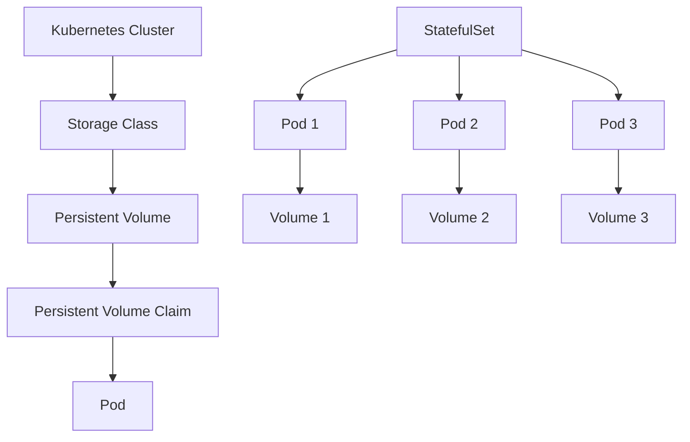

# Kubernetes Persistent Storage

## Summary

Complete guide for implementing persistent storage in Kubernetes for the Axisor platform. This document covers PersistentVolumes, PersistentVolumeClaims, StatefulSets, and backup strategies for production deployments.

## Storage Architecture



## Storage Classes

### Basic Storage Class

```yaml
apiVersion: storage.k8s.io/v1
kind: StorageClass
metadata:
  name: axisor-storage
provisioner: kubernetes.io/aws-ebs
parameters:
  type: gp3
  fsType: ext4
  encrypted: "true"
volumeBindingMode: WaitForFirstConsumer
allowVolumeExpansion: true
reclaimPolicy: Retain
```

### Fast Storage Class

```yaml
apiVersion: storage.k8s.io/v1
kind: StorageClass
metadata:
  name: axisor-fast-storage
provisioner: kubernetes.io/aws-ebs
parameters:
  type: gp3
  fsType: ext4
  encrypted: "true"
  iops: "3000"
  throughput: "125"
volumeBindingMode: WaitForFirstConsumer
allowVolumeExpansion: true
reclaimPolicy: Retain
```

## Persistent Volumes

### Static Persistent Volume

```yaml
apiVersion: v1
kind: PersistentVolume
metadata:
  name: axisor-db-pv
spec:
  capacity:
    storage: 100Gi
  accessModes:
    - ReadWriteOnce
  persistentVolumeReclaimPolicy: Retain
  storageClassName: axisor-storage
  hostPath:
    path: /data/axisor-db
```

### Dynamic Persistent Volume

```yaml
apiVersion: v1
kind: PersistentVolume
metadata:
  name: axisor-redis-pv
spec:
  capacity:
    storage: 50Gi
  accessModes:
    - ReadWriteOnce
  persistentVolumeReclaimPolicy: Delete
  storageClassName: axisor-fast-storage
  awsElasticBlockStore:
    volumeID: vol-12345678
    fsType: ext4
```

## Persistent Volume Claims

### Database PVC

```yaml
apiVersion: v1
kind: PersistentVolumeClaim
metadata:
  name: axisor-db-pvc
  namespace: axisor
spec:
  accessModes:
    - ReadWriteOnce
  storageClassName: axisor-storage
  resources:
    requests:
      storage: 100Gi
```

### Redis PVC

```yaml
apiVersion: v1
kind: PersistentVolumeClaim
metadata:
  name: axisor-redis-pvc
  namespace: axisor
spec:
  accessModes:
    - ReadWriteOnce
  storageClassName: axisor-fast-storage
  resources:
    requests:
      storage: 50Gi
```

## StatefulSets

### Database StatefulSet

```yaml
apiVersion: apps/v1
kind: StatefulSet
metadata:
  name: axisor-database
  namespace: axisor
spec:
  serviceName: axisor-database
  replicas: 1
  selector:
    matchLabels:
      app: axisor-database
  template:
    metadata:
      labels:
        app: axisor-database
    spec:
      containers:
      - name: postgres
        image: postgres:15
        ports:
        - containerPort: 5432
        env:
        - name: POSTGRES_DB
          value: "axisor"
        - name: POSTGRES_USER
          value: "postgres"
        - name: POSTGRES_PASSWORD
          valueFrom:
            secretKeyRef:
              name: axisor-secrets
              key: DATABASE_PASSWORD
        volumeMounts:
        - name: data
          mountPath: /var/lib/postgresql/data
  volumeClaimTemplates:
  - metadata:
      name: data
    spec:
      accessModes:
        - ReadWriteOnce
      storageClassName: axisor-storage
      resources:
        requests:
          storage: 100Gi
```

### Redis StatefulSet

```yaml
apiVersion: apps/v1
kind: StatefulSet
metadata:
  name: axisor-redis
  namespace: axisor
spec:
  serviceName: axisor-redis
  replicas: 1
  selector:
    matchLabels:
      app: axisor-redis
  template:
    metadata:
      labels:
        app: axisor-redis
    spec:
      containers:
      - name: redis
        image: redis:7-alpine
        ports:
        - containerPort: 6379
        volumeMounts:
        - name: data
          mountPath: /data
        command:
        - redis-server
        - --appendonly
        - "yes"
  volumeClaimTemplates:
  - metadata:
      name: data
    spec:
      accessModes:
        - ReadWriteOnce
      storageClassName: axisor-fast-storage
      resources:
        requests:
          storage: 50Gi
```

## Backup Strategies

### Database Backup Job

```yaml
apiVersion: batch/v1
kind: CronJob
metadata:
  name: axisor-db-backup
  namespace: axisor
spec:
  schedule: "0 2 * * *"
  jobTemplate:
    spec:
      template:
        spec:
          containers:
          - name: backup
            image: postgres:15
            env:
            - name: PGPASSWORD
              valueFrom:
                secretKeyRef:
                  name: axisor-secrets
                  key: DATABASE_PASSWORD
            command:
            - /bin/bash
            - -c
            - |
              pg_dump -h axisor-database -U postgres axisor > /backup/axisor-$(date +%Y%m%d-%H%M%S).sql
              aws s3 cp /backup/axisor-$(date +%Y%m%d-%H%M%S).sql s3://axisor-backups/database/
            volumeMounts:
            - name: backup-volume
              mountPath: /backup
          volumes:
          - name: backup-volume
            persistentVolumeClaim:
              claimName: axisor-backup-pvc
          restartPolicy: OnFailure
```

### Redis Backup Job

```yaml
apiVersion: batch/v1
kind: CronJob
metadata:
  name: axisor-redis-backup
  namespace: axisor
spec:
  schedule: "0 3 * * *"
  jobTemplate:
    spec:
      template:
        spec:
          containers:
          - name: backup
            image: redis:7-alpine
            command:
            - /bin/bash
            - -c
            - |
              redis-cli -h axisor-redis --rdb /backup/axisor-redis-$(date +%Y%m%d-%H%M%S).rdb
              aws s3 cp /backup/axisor-redis-$(date +%Y%m%d-%H%M%S).rdb s3://axisor-backups/redis/
            volumeMounts:
            - name: backup-volume
              mountPath: /backup
          volumes:
          - name: backup-volume
            persistentVolumeClaim:
              claimName: axisor-backup-pvc
          restartPolicy: OnFailure
```

## Volume Expansion

### Expanding PVC

```yaml
apiVersion: v1
kind: PersistentVolumeClaim
metadata:
  name: axisor-db-pvc
  namespace: axisor
spec:
  accessModes:
    - ReadWriteOnce
  storageClassName: axisor-storage
  resources:
    requests:
      storage: 200Gi  # Expanded from 100Gi
```

### File System Expansion

```yaml
apiVersion: batch/v1
kind: Job
metadata:
  name: axisor-db-expand-fs
  namespace: axisor
spec:
  template:
    spec:
      containers:
      - name: expand-fs
        image: postgres:15
        command:
        - /bin/bash
        - -c
        - |
          resize2fs /dev/sdb
          echo "File system expanded successfully"
        volumeMounts:
        - name: data
          mountPath: /var/lib/postgresql/data
      volumes:
      - name: data
        persistentVolumeClaim:
          claimName: axisor-db-pvc
      restartPolicy: Never
```

## How to Use This Document

- **For Storage**: Use the storage classes for different performance requirements
- **For Volumes**: Use the PersistentVolume and PVC examples for data persistence
- **For Stateful**: Use the StatefulSet examples for stateful applications
- **For Backup**: Use the backup strategies for data protection
