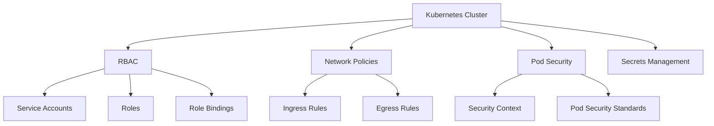

# Kubernetes Security Policies

## Summary

Comprehensive guide for implementing security policies in Kubernetes for the Axisor platform. This document covers RBAC, network policies, pod security, and security best practices for production deployments.

## Security Architecture



## RBAC Configuration

### Service Account

```yaml
apiVersion: v1
kind: ServiceAccount
metadata:
  name: axisor-backend
  namespace: axisor
automountServiceAccountToken: false
```

### Role

```yaml
apiVersion: rbac.authorization.k8s.io/v1
kind: Role
metadata:
  name: axisor-backend-role
  namespace: axisor
rules:
- apiGroups: [""]
  resources: ["pods", "services", "endpoints"]
  verbs: ["get", "list", "watch"]
- apiGroups: ["apps"]
  resources: ["deployments", "replicasets"]
  verbs: ["get", "list", "watch"]
- apiGroups: [""]
  resources: ["secrets", "configmaps"]
  verbs: ["get", "list"]
```

### RoleBinding

```yaml
apiVersion: rbac.authorization.k8s.io/v1
kind: RoleBinding
metadata:
  name: axisor-backend-binding
  namespace: axisor
subjects:
- kind: ServiceAccount
  name: axisor-backend
  namespace: axisor
roleRef:
  kind: Role
  name: axisor-backend-role
  apiGroup: rbac.authorization.k8s.io
```

### ClusterRole

```yaml
apiVersion: rbac.authorization.k8s.io/v1
kind: ClusterRole
metadata:
  name: axisor-cluster-role
rules:
- apiGroups: [""]
  resources: ["nodes"]
  verbs: ["get", "list", "watch"]
- apiGroups: ["metrics.k8s.io"]
  resources: ["nodes", "pods"]
  verbs: ["get", "list"]
```

### ClusterRoleBinding

```yaml
apiVersion: rbac.authorization.k8s.io/v1
kind: ClusterRoleBinding
metadata:
  name: axisor-cluster-binding
subjects:
- kind: ServiceAccount
  name: axisor-backend
  namespace: axisor
roleRef:
  kind: ClusterRole
  name: axisor-cluster-role
  apiGroup: rbac.authorization.k8s.io
```

## Network Policies

### Basic Network Policy

```yaml
apiVersion: networking.k8s.io/v1
kind: NetworkPolicy
metadata:
  name: axisor-network-policy
  namespace: axisor
spec:
  podSelector:
    matchLabels:
      app: axisor-backend
  policyTypes:
  - Ingress
  - Egress
  ingress:
  - from:
    - namespaceSelector:
        matchLabels:
          name: axisor
    - podSelector:
        matchLabels:
          app: axisor-frontend
    ports:
    - protocol: TCP
      port: 3010
  egress:
  - to:
    - podSelector:
        matchLabels:
          app: axisor-database
    ports:
    - protocol: TCP
      port: 5432
  - to:
    - podSelector:
        matchLabels:
          app: axisor-redis
    ports:
    - protocol: TCP
      port: 6379
```

### Deny All Network Policy

```yaml
apiVersion: networking.k8s.io/v1
kind: NetworkPolicy
metadata:
  name: deny-all
  namespace: axisor
spec:
  podSelector: {}
  policyTypes:
  - Ingress
  - Egress
```

### Allow All Network Policy

```yaml
apiVersion: networking.k8s.io/v1
kind: NetworkPolicy
metadata:
  name: allow-all
  namespace: axisor
spec:
  podSelector: {}
  policyTypes:
  - Ingress
  - Egress
  ingress:
  - {}
  egress:
  - {}
```

## Pod Security

### Security Context

```yaml
apiVersion: apps/v1
kind: Deployment
metadata:
  name: axisor-backend
  namespace: axisor
spec:
  template:
    spec:
      securityContext:
        runAsNonRoot: true
        runAsUser: 1000
        runAsGroup: 1000
        fsGroup: 1000
        seccompProfile:
          type: RuntimeDefault
      containers:
      - name: backend
        image: axisor/backend:latest
        securityContext:
          allowPrivilegeEscalation: false
          readOnlyRootFilesystem: true
          runAsNonRoot: true
          runAsUser: 1000
          capabilities:
            drop:
            - ALL
        volumeMounts:
        - name: tmp
          mountPath: /tmp
        - name: var-cache
          mountPath: /var/cache
        - name: var-log
          mountPath: /var/log
      volumes:
      - name: tmp
        emptyDir: {}
      - name: var-cache
        emptyDir: {}
      - name: var-log
        emptyDir: {}
```

### Pod Security Standards

```yaml
apiVersion: v1
kind: Namespace
metadata:
  name: axisor
  labels:
    pod-security.kubernetes.io/enforce: restricted
    pod-security.kubernetes.io/audit: restricted
    pod-security.kubernetes.io/warn: restricted
```

## Secrets Management

### Secret Encryption

```yaml
apiVersion: v1
kind: Secret
metadata:
  name: axisor-secrets
  namespace: axisor
  annotations:
    kubernetes.io/encryption-provider-config: "encryption-provider-config.yaml"
type: Opaque
data:
  DATABASE_URL: cG9zdGdyZXM6Ly9wb3N0Z3JlczoxMjM0NTZAYXhpc29yLWRiOjU0MzIvYXhpc29y
```

### Secret Rotation

```yaml
apiVersion: batch/v1
kind: CronJob
metadata:
  name: secret-rotation
  namespace: axisor
spec:
  schedule: "0 0 1 * *"
  jobTemplate:
    spec:
      template:
        spec:
          containers:
          - name: secret-rotation
            image: axisor/secret-rotation:latest
            env:
            - name: KUBECONFIG
              value: /etc/kubernetes/kubeconfig
            volumeMounts:
            - name: kubeconfig
              mountPath: /etc/kubernetes
          volumes:
          - name: kubeconfig
            secret:
              secretName: kubeconfig
          restartPolicy: OnFailure
```

## Security Scanning

### Security Policy

```yaml
apiVersion: v1
kind: ConfigMap
metadata:
  name: security-policy
  namespace: axisor
data:
  policy.yaml: |
    apiVersion: v1
    kind: Policy
    metadata:
      name: axisor-security-policy
    spec:
      rules:
      - name: "No privileged containers"
        match:
          resources:
            kinds: ["Pod"]
        validate:
          message: "Privileged containers are not allowed"
          pattern:
            spec:
              containers:
              - name: "*"
                securityContext:
                  privileged: false
      
      - name: "No root user"
        match:
          resources:
            kinds: ["Pod"]
        validate:
          message: "Root user is not allowed"
          pattern:
            spec:
              securityContext:
                runAsNonRoot: true
```

### Admission Controller

```yaml
apiVersion: v1
kind: ConfigMap
metadata:
  name: admission-controller-config
  namespace: axisor
data:
  config.yaml: |
    apiVersion: v1
    kind: Config
    metadata:
      name: admission-controller-config
    spec:
      rules:
      - name: "Validate security context"
        match:
          resources:
            kinds: ["Pod"]
        validate:
          message: "Security context validation failed"
          pattern:
            spec:
              securityContext:
                runAsNonRoot: true
                runAsUser: ">0"
```

## How to Use This Document

- **For RBAC**: Use the RBAC configurations for access control
- **For Network**: Use the network policies for traffic control
- **For Pods**: Use the pod security configurations for container security
- **For Secrets**: Use the secrets management for sensitive data protection
