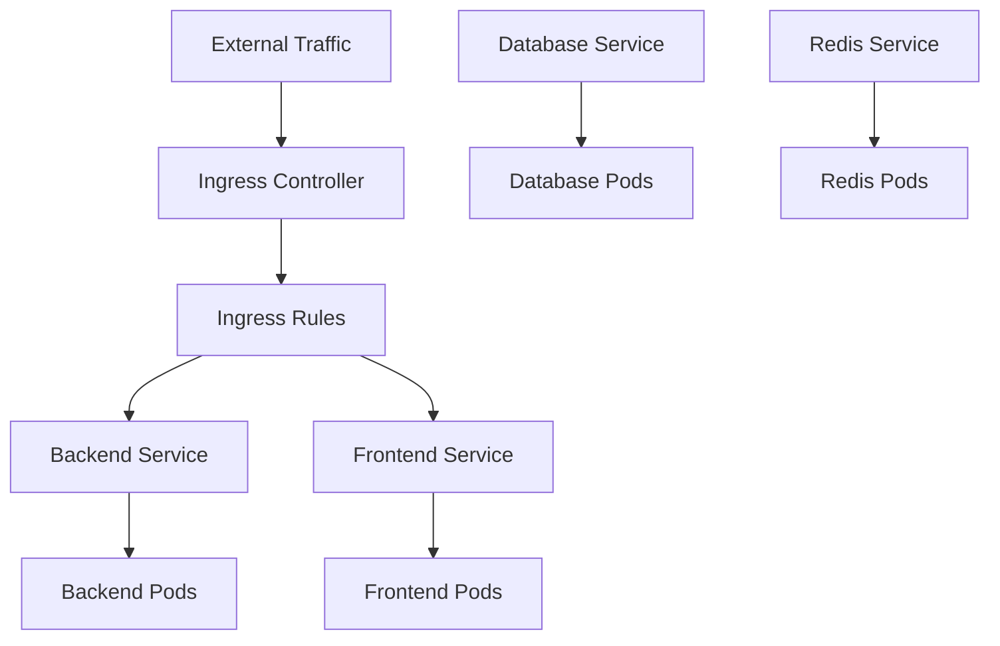

# Kubernetes Service Configuration

## Summary

Complete guide for configuring Kubernetes services in the Axisor platform. This document covers service types, networking, load balancing, and ingress configuration for production deployments.

## Service Architecture



## Service Types

### ClusterIP Service

```yaml
apiVersion: v1
kind: Service
metadata:
  name: axisor-backend
  namespace: axisor
spec:
  type: ClusterIP
  selector:
    app: axisor-backend
  ports:
  - name: http
    port: 80
    targetPort: 3010
    protocol: TCP
```

### NodePort Service

```yaml
apiVersion: v1
kind: Service
metadata:
  name: axisor-backend-nodeport
  namespace: axisor
spec:
  type: NodePort
  selector:
    app: axisor-backend
  ports:
  - name: http
    port: 80
    targetPort: 3010
    nodePort: 30080
    protocol: TCP
```

### LoadBalancer Service

```yaml
apiVersion: v1
kind: Service
metadata:
  name: axisor-backend-lb
  namespace: axisor
spec:
  type: LoadBalancer
  selector:
    app: axisor-backend
  ports:
  - name: http
    port: 80
    targetPort: 3010
    protocol: TCP
```

## Ingress Configuration

### Basic Ingress

```yaml
apiVersion: networking.k8s.io/v1
kind: Ingress
metadata:
  name: axisor-ingress
  namespace: axisor
  annotations:
    nginx.ingress.kubernetes.io/rewrite-target: /
spec:
  ingressClassName: nginx
  rules:
  - host: api.axisor.com
    http:
      paths:
      - path: /
        pathType: Prefix
        backend:
          service:
            name: axisor-backend
            port:
              number: 80
```

### Advanced Ingress with SSL

```yaml
apiVersion: networking.k8s.io/v1
kind: Ingress
metadata:
  name: axisor-ingress
  namespace: axisor
  annotations:
    nginx.ingress.kubernetes.io/rewrite-target: /
    nginx.ingress.kubernetes.io/ssl-redirect: "true"
    nginx.ingress.kubernetes.io/force-ssl-redirect: "true"
    cert-manager.io/cluster-issuer: "letsencrypt-prod"
spec:
  ingressClassName: nginx
  tls:
  - hosts:
    - api.axisor.com
    - app.axisor.com
    secretName: axisor-tls
  rules:
  - host: api.axisor.com
    http:
      paths:
      - path: /
        pathType: Prefix
        backend:
          service:
            name: axisor-backend
            port:
              number: 80
  - host: app.axisor.com
    http:
      paths:
      - path: /
        pathType: Prefix
        backend:
          service:
            name: axisor-frontend
            port:
              number: 80
```

## Network Policies

### Basic Network Policy

```yaml
apiVersion: networking.k8s.io/v1
kind: NetworkPolicy
metadata:
  name: axisor-network-policy
  namespace: axisor
spec:
  podSelector:
    matchLabels:
      app: axisor-backend
  policyTypes:
  - Ingress
  - Egress
  ingress:
  - from:
    - namespaceSelector:
        matchLabels:
          name: axisor
    - podSelector:
        matchLabels:
          app: axisor-frontend
    ports:
    - protocol: TCP
      port: 3010
  egress:
  - to:
    - podSelector:
        matchLabels:
          app: axisor-database
    ports:
    - protocol: TCP
      port: 5432
```

## Service Discovery

### DNS Configuration

```yaml
apiVersion: v1
kind: Service
metadata:
  name: axisor-backend
  namespace: axisor
spec:
  selector:
    app: axisor-backend
  ports:
  - name: http
    port: 80
    targetPort: 3010
  # Service will be available at:
  # axisor-backend.axisor.svc.cluster.local
  # axisor-backend.axisor
  # axisor-backend (within same namespace)
```

## Load Balancing

### Session Affinity

```yaml
apiVersion: v1
kind: Service
metadata:
  name: axisor-backend
  namespace: axisor
spec:
  selector:
    app: axisor-backend
  ports:
  - name: http
    port: 80
    targetPort: 3010
  sessionAffinity: ClientIP
  sessionAffinityConfig:
    clientIP:
      timeoutSeconds: 3600
```

### External Traffic Policy

```yaml
apiVersion: v1
kind: Service
metadata:
  name: axisor-backend
  namespace: axisor
spec:
  type: LoadBalancer
  selector:
    app: axisor-backend
  ports:
  - name: http
    port: 80
    targetPort: 3010
  externalTrafficPolicy: Local
```

## How to Use This Document

- **For Services**: Use the service types for different networking needs
- **For Ingress**: Use the ingress configurations for external access
- **For Security**: Use the network policies for traffic control
- **For Discovery**: Use the service discovery for internal communication
