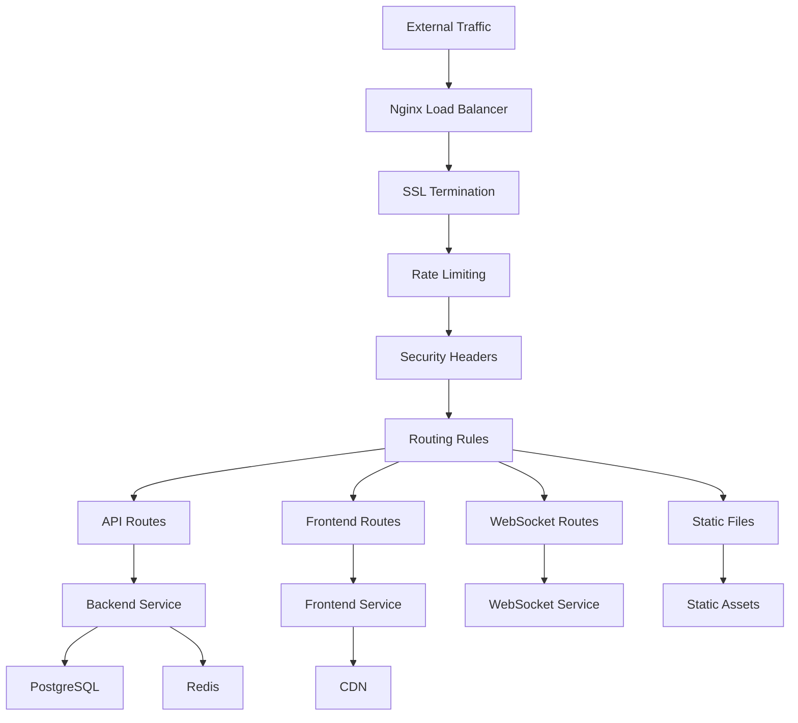

# Nginx Configuration

## Summary

Comprehensive guide for Nginx configuration in the Axisor platform. This document covers reverse proxy setup, SSL termination, load balancing, rate limiting, security headers, and performance optimization for production deployments.

## Nginx Architecture



## Main Configuration

### nginx.conf

```nginx
# Nginx Configuration for Axisor Production

events {
    worker_connections 1024;
    use epoll;
    multi_accept on;
}

http {
    include       /etc/nginx/mime.types;
    default_type  application/octet-stream;

    # Logging
    log_format main '$remote_addr - $remote_user [$time_local] "$request" '
                    '$status $body_bytes_sent "$http_referer" '
                    '"$http_user_agent" "$http_x_forwarded_for"';

    access_log /var/log/nginx/access.log main;
    error_log /var/log/nginx/error.log warn;

    # Performance
    sendfile        on;
    tcp_nopush      on;
    tcp_nodelay     on;
    keepalive_timeout 65;
    types_hash_max_size 2048;
    client_max_body_size 100M;

    # Gzip compression
    gzip on;
    gzip_vary on;
    gzip_min_length 1024;
    gzip_types
        text/plain
        text/css
        text/xml
        text/javascript
        application/javascript
        application/xml+rss
        application/json;

    # Rate limiting
    limit_req_zone $binary_remote_addr zone=api:10m rate=10r/s;
    limit_req_zone $binary_remote_addr zone=auth:10m rate=10r/m;
    limit_req_zone $binary_remote_addr zone=automations:10m rate=2r/s;

    # Upstream servers
    upstream backend {
        server backend:3010;
        keepalive 32;
    }

    upstream frontend {
        server frontend:80;
        keepalive 32;
    }

    server {
        listen 80;
        server_name _;
        return 301 https://$host$request_uri;
    }

    server {
        listen 443 ssl http2;
        server_name your-domain.com;

        # SSL Configuration
        ssl_certificate /etc/nginx/ssl/fullchain.pem;
        ssl_certificate_key /etc/nginx/ssl/privkey.pem;
        ssl_protocols TLSv1.2 TLSv1.3;
        ssl_ciphers ECDHE-RSA-AES128-GCM-SHA256:ECDHE-RSA-AES256-GCM-SHA384;
        ssl_prefer_server_ciphers off;
        ssl_session_cache shared:SSL:10m;
        ssl_session_timeout 10m;

        # Security headers
        add_header X-Frame-Options "SAMEORIGIN" always;
        add_header X-XSS-Protection "1; mode=block" always;
        add_header X-Content-Type-Options "nosniff" always;
        add_header Referrer-Policy "no-referrer-when-downgrade" always;
        add_header Content-Security-Policy "default-src 'self'; script-src 'self' 'unsafe-inline' 'unsafe-eval'; style-src 'self' 'unsafe-inline';" always;

        # API routes
        location /api/ {
            proxy_pass http://backend;
            proxy_http_version 1.1;
            proxy_set_header Upgrade $http_upgrade;
            proxy_set_header Connection 'upgrade';
            proxy_set_header Host $host;
            proxy_set_header X-Real-IP $remote_addr;
            proxy_set_header X-Forwarded-For $proxy_add_x_forwarded_for;
            proxy_set_header X-Forwarded-Proto $scheme;
            proxy_cache_bypass $http_upgrade;

            # Rate limiting for API
            limit_req zone=api burst=20 nodelay;

            # CORS
            add_header Access-Control-Allow-Origin *;
            add_header Access-Control-Allow-Methods "GET, POST, PUT, DELETE, OPTIONS";
            add_header Access-Control-Allow-Headers "Authorization, Content-Type, Accept";

            # Handle preflight requests
            if ($request_method = 'OPTIONS') {
                return 204;
            }
        }

        # Auth routes with stricter rate limiting
        location /api/auth/ {
            proxy_pass http://backend;
            proxy_http_version 1.1;
            proxy_set_header Host $host;
            proxy_set_header X-Real-IP $remote_addr;
            proxy_set_header X-Forwarded-For $proxy_add_x_forwarded_for;
            proxy_set_header X-Forwarded-Proto $scheme;

            # Stricter rate limiting for auth
            limit_req zone=auth burst=20 nodelay;
        }

        # Automations with rate limiting
        location /api/automations/ {
            proxy_pass http://backend;
            proxy_http_version 1.1;
            proxy_set_header Host $host;
            proxy_set_header X-Real-IP $remote_addr;
            proxy_set_header X-Forwarded-For $proxy_add_x_forwarded_for;
            proxy_set_header X-Forwarded-Proto $scheme;

            limit_req zone=automations burst=10 nodelay;
        }

        # WebSocket routes
        location /test/ws/ {
            proxy_pass http://backend;
            proxy_http_version 1.1;
            proxy_set_header Upgrade $http_upgrade;
            proxy_set_header Connection "upgrade";
            proxy_set_header Host $host;
            proxy_set_header X-Real-IP $remote_addr;
            proxy_set_header X-Forwarded-For $proxy_add_x_forwarded_for;
            proxy_set_header X-Forwarded-Proto $scheme;

            # WebSocket specific settings
            proxy_buffering off;
            proxy_cache off;
        }

        # Static files and frontend
        location / {
            proxy_pass http://frontend;
            proxy_http_version 1.1;
            proxy_set_header Host $host;
            proxy_set_header X-Real-IP $remote_addr;
            proxy_set_header X-Forwarded-For $proxy_add_x_forwarded_for;
            proxy_set_header X-Forwarded-Proto $scheme;

            # Cache static assets
            location ~* \.(js|css|png|jpg|jpeg|gif|ico|svg)$ {
                expires 1y;
                add_header Cache-Control "public, immutable";
            }

            # Cache HTML with shorter expiry
            location ~* \.(html)$ {
                expires 1h;
                add_header Cache-Control "public, must-revalidate, proxy-revalidate";
            }
        }

        # Health check endpoint
        location /health {
            access_log off;
            return 200 "healthy\n";
            add_header Content-Type text/plain;
        }

        # Block access to sensitive files
        location ~ /\. {
            deny all;
        }

        location ~ \.(env|git|gitignore|htaccess|htpasswd)$ {
            deny all;
        }

        # Error pages
        error_page 404 /404.html;
        error_page 500 502 503 504 /50x.html;
    }
}
```

## SSL Configuration

### SSL Certificate Setup

```nginx
# SSL Configuration
ssl_certificate /etc/nginx/ssl/fullchain.pem;
ssl_certificate_key /etc/nginx/ssl/privkey.pem;
ssl_protocols TLSv1.2 TLSv1.3;
ssl_ciphers ECDHE-RSA-AES128-GCM-SHA256:ECDHE-RSA-AES256-GCM-SHA384:ECDHE-RSA-AES256-SHA384:ECDHE-RSA-AES128-SHA256;
ssl_prefer_server_ciphers off;
ssl_session_cache shared:SSL:10m;
ssl_session_timeout 10m;
ssl_session_tickets off;

# OCSP Stapling
ssl_stapling on;
ssl_stapling_verify on;
ssl_trusted_certificate /etc/nginx/ssl/chain.pem;
resolver 8.8.8.8 8.8.4.4 valid=300s;
resolver_timeout 5s;

# HSTS
add_header Strict-Transport-Security "max-age=31536000; includeSubDomains; preload" always;
```

### Let's Encrypt Configuration

```nginx
# Let's Encrypt challenge
location /.well-known/acme-challenge/ {
    root /var/www/certbot;
}

# Redirect HTTP to HTTPS
server {
    listen 80;
    server_name your-domain.com;
    return 301 https://$server_name$request_uri;
}
```

## Rate Limiting

### Rate Limit Zones

```nginx
# Rate limiting zones
limit_req_zone $binary_remote_addr zone=api:10m rate=10r/s;
limit_req_zone $binary_remote_addr zone=auth:10m rate=10r/m;
limit_req_zone $binary_remote_addr zone=automations:10m rate=2r/s;
limit_req_zone $binary_remote_addr zone=uploads:10m rate=5r/s;
limit_req_zone $binary_remote_addr zone=general:10m rate=20r/s;

# Connection limiting
limit_conn_zone $binary_remote_addr zone=conn_limit_per_ip:10m;
limit_conn_zone $server_name zone=conn_limit_per_server:10m;
```

### Rate Limit Application

```nginx
# API rate limiting
location /api/ {
    limit_req zone=api burst=20 nodelay;
    limit_conn conn_limit_per_ip 10;
    # ... proxy configuration
}

# Auth rate limiting
location /api/auth/ {
    limit_req zone=auth burst=10 nodelay;
    limit_conn conn_limit_per_ip 5;
    # ... proxy configuration
}

# Automation rate limiting
location /api/automations/ {
    limit_req zone=automations burst=5 nodelay;
    limit_conn conn_limit_per_ip 3;
    # ... proxy configuration
}

# Upload rate limiting
location /api/upload/ {
    limit_req zone=uploads burst=3 nodelay;
    limit_conn conn_limit_per_ip 2;
    # ... proxy configuration
}

# General rate limiting
location / {
    limit_req zone=general burst=50 nodelay;
    limit_conn conn_limit_per_ip 20;
    limit_conn conn_limit_per_server 1000;
    # ... proxy configuration
}
```

## Security Headers

### Security Headers Configuration

```nginx
# Security headers
add_header X-Frame-Options "SAMEORIGIN" always;
add_header X-XSS-Protection "1; mode=block" always;
add_header X-Content-Type-Options "nosniff" always;
add_header Referrer-Policy "no-referrer-when-downgrade" always;
add_header Permissions-Policy "geolocation=(), microphone=(), camera=()" always;

# Content Security Policy
add_header Content-Security-Policy "default-src 'self'; script-src 'self' 'unsafe-inline' 'unsafe-eval' https://cdn.jsdelivr.net; style-src 'self' 'unsafe-inline' https://fonts.googleapis.com; font-src 'self' https://fonts.gstatic.com; img-src 'self' data: https:; connect-src 'self' https: wss:; frame-ancestors 'self';" always;

# HSTS
add_header Strict-Transport-Security "max-age=31536000; includeSubDomains; preload" always;

# X-Frame-Options
add_header X-Frame-Options "SAMEORIGIN" always;

# X-Content-Type-Options
add_header X-Content-Type-Options "nosniff" always;

# Referrer Policy
add_header Referrer-Policy "strict-origin-when-cross-origin" always;
```

### Security Headers for API

```nginx
# API security headers
location /api/ {
    # Remove server header
    more_clear_headers 'Server';
    
    # Security headers
    add_header X-Frame-Options "DENY" always;
    add_header X-Content-Type-Options "nosniff" always;
    add_header X-XSS-Protection "1; mode=block" always;
    add_header Referrer-Policy "strict-origin-when-cross-origin" always;
    
    # CORS headers
    add_header Access-Control-Allow-Origin "https://app.axisor.com" always;
    add_header Access-Control-Allow-Methods "GET, POST, PUT, DELETE, OPTIONS" always;
    add_header Access-Control-Allow-Headers "Authorization, Content-Type, Accept, X-Requested-With" always;
    add_header Access-Control-Allow-Credentials "true" always;
    add_header Access-Control-Max-Age "86400" always;
    
    # Handle preflight requests
    if ($request_method = 'OPTIONS') {
        add_header Access-Control-Allow-Origin "https://app.axisor.com" always;
        add_header Access-Control-Allow-Methods "GET, POST, PUT, DELETE, OPTIONS" always;
        add_header Access-Control-Allow-Headers "Authorization, Content-Type, Accept, X-Requested-With" always;
        add_header Access-Control-Allow-Credentials "true" always;
        add_header Access-Control-Max-Age "86400" always;
        add_header Content-Length 0;
        add_header Content-Type text/plain;
        return 204;
    }
    
    # ... proxy configuration
}
```

## Load Balancing

### Upstream Configuration

```nginx
# Backend upstream
upstream backend {
    server backend1:3010 weight=3 max_fails=3 fail_timeout=30s;
    server backend2:3010 weight=3 max_fails=3 fail_timeout=30s;
    server backend3:3010 weight=2 max_fails=3 fail_timeout=30s;
    keepalive 32;
}

# Frontend upstream
upstream frontend {
    server frontend1:80 weight=2 max_fails=3 fail_timeout=30s;
    server frontend2:80 weight=2 max_fails=3 fail_timeout=30s;
    keepalive 32;
}

# Database upstream (for read replicas)
upstream database_read {
    server db-primary:5432 weight=1 max_fails=3 fail_timeout=30s;
    server db-replica1:5432 weight=2 max_fails=3 fail_timeout=30s;
    server db-replica2:5432 weight=2 max_fails=3 fail_timeout=30s;
    keepalive 16;
}
```

### Load Balancing Methods

```nginx
# Round Robin (default)
upstream backend {
    server backend1:3010;
    server backend2:3010;
    server backend3:3010;
}

# Least Connections
upstream backend {
    least_conn;
    server backend1:3010;
    server backend2:3010;
    server backend3:3010;
}

# IP Hash
upstream backend {
    ip_hash;
    server backend1:3010;
    server backend2:3010;
    server backend3:3010;
}

# Weighted Round Robin
upstream backend {
    server backend1:3010 weight=3;
    server backend2:3010 weight=2;
    server backend3:3010 weight=1;
}
```

## Caching Configuration

### Static File Caching

```nginx
# Static assets caching
location ~* \.(js|css|png|jpg|jpeg|gif|ico|svg|woff|woff2|ttf|eot)$ {
    expires 1y;
    add_header Cache-Control "public, immutable";
    add_header Vary "Accept-Encoding";
    
    # Gzip compression
    gzip_static on;
    
    # Cache in browser
    add_header Cache-Control "public, max-age=31536000, immutable";
}

# HTML caching
location ~* \.(html)$ {
    expires 1h;
    add_header Cache-Control "public, must-revalidate, proxy-revalidate";
    add_header Vary "Accept-Encoding";
}

# API response caching
location /api/static/ {
    proxy_pass http://backend;
    proxy_cache_valid 200 1h;
    proxy_cache_valid 404 1m;
    add_header X-Cache-Status $upstream_cache_status;
}
```

### Proxy Caching

```nginx
# Proxy cache configuration
proxy_cache_path /var/cache/nginx levels=1:2 keys_zone=api_cache:10m max_size=1g inactive=60m use_temp_path=off;

# Cache configuration
location /api/cacheable/ {
    proxy_pass http://backend;
    proxy_cache api_cache;
    proxy_cache_valid 200 302 10m;
    proxy_cache_valid 404 1m;
    proxy_cache_use_stale error timeout updating http_500 http_502 http_503 http_504;
    proxy_cache_lock on;
    add_header X-Cache-Status $upstream_cache_status;
}
```

## WebSocket Configuration

### WebSocket Proxy

```nginx
# WebSocket configuration
location /ws/ {
    proxy_pass http://backend;
    proxy_http_version 1.1;
    proxy_set_header Upgrade $http_upgrade;
    proxy_set_header Connection "upgrade";
    proxy_set_header Host $host;
    proxy_set_header X-Real-IP $remote_addr;
    proxy_set_header X-Forwarded-For $proxy_add_x_forwarded_for;
    proxy_set_header X-Forwarded-Proto $scheme;
    
    # WebSocket specific settings
    proxy_buffering off;
    proxy_cache off;
    proxy_read_timeout 86400;
    proxy_send_timeout 86400;
    proxy_connect_timeout 86400;
}
```

### WebSocket Load Balancing

```nginx
# WebSocket upstream
upstream websocket {
    server backend1:3010;
    server backend2:3010;
    server backend3:3010;
}

# WebSocket location
location /ws/ {
    proxy_pass http://websocket;
    proxy_http_version 1.1;
    proxy_set_header Upgrade $http_upgrade;
    proxy_set_header Connection "upgrade";
    proxy_set_header Host $host;
    proxy_set_header X-Real-IP $remote_addr;
    proxy_set_header X-Forwarded-For $proxy_add_x_forwarded_for;
    proxy_set_header X-Forwarded-Proto $scheme;
    
    # Sticky sessions for WebSocket
    ip_hash;
    
    # WebSocket specific settings
    proxy_buffering off;
    proxy_cache off;
    proxy_read_timeout 86400;
    proxy_send_timeout 86400;
    proxy_connect_timeout 86400;
}
```

## Performance Optimization

### Gzip Compression

```nginx
# Gzip configuration
gzip on;
gzip_vary on;
gzip_min_length 1024;
gzip_proxied any;
gzip_comp_level 6;
gzip_types
    text/plain
    text/css
    text/xml
    text/javascript
    application/javascript
    application/xml+rss
    application/json
    application/xml
    image/svg+xml;
```

### HTTP/2 Configuration

```nginx
# HTTP/2 configuration
server {
    listen 443 ssl http2;
    server_name your-domain.com;
    
    # HTTP/2 push
    location / {
        http2_push /css/main.css;
        http2_push /js/main.js;
        http2_push /images/logo.png;
    }
}
```

### Buffer Configuration

```nginx
# Buffer configuration
client_body_buffer_size 128k;
client_max_body_size 100m;
client_header_buffer_size 1k;
large_client_header_buffers 4 4k;
output_buffers 1 32k;
postpone_output 1460;

# Proxy buffer configuration
proxy_buffering on;
proxy_buffer_size 4k;
proxy_buffers 8 4k;
proxy_busy_buffers_size 8k;
proxy_temp_file_write_size 8k;
```

## Monitoring and Logging

### Access Log Configuration

```nginx
# Custom log format
log_format detailed '$remote_addr - $remote_user [$time_local] '
                   '"$request" $status $body_bytes_sent '
                   '"$http_referer" "$http_user_agent" '
                   '"$http_x_forwarded_for" $request_time '
                   '$upstream_response_time $upstream_status';

# Access log
access_log /var/log/nginx/access.log detailed;
error_log /var/log/nginx/error.log warn;
```

### Health Check Configuration

```nginx
# Health check endpoint
location /nginx-health {
    access_log off;
    return 200 "healthy\n";
    add_header Content-Type text/plain;
}

# Status endpoint
location /nginx-status {
    stub_status on;
    access_log off;
    allow 127.0.0.1;
    allow 10.0.0.0/8;
    deny all;
}
```

## Deployment Commands

### Nginx Deployment

```bash
# Test configuration
nginx -t

# Reload configuration
nginx -s reload

# Restart nginx
systemctl restart nginx

# Check status
systemctl status nginx

# View logs
tail -f /var/log/nginx/access.log
tail -f /var/log/nginx/error.log
```

### SSL Certificate Management

```bash
# Generate self-signed certificate
openssl req -x509 -nodes -days 365 -newkey rsa:2048 \
    -keyout /etc/nginx/ssl/privkey.pem \
    -out /etc/nginx/ssl/fullchain.pem

# Let's Encrypt certificate
certbot --nginx -d your-domain.com

# Renew certificate
certbot renew --dry-run
```

## Troubleshooting

### Common Issues

#### Configuration Issues

```bash
# Test configuration
nginx -t

# Check configuration syntax
nginx -T

# View configuration
nginx -V
```

#### Performance Issues

```bash
# Check nginx status
curl http://localhost/nginx-status

# Monitor connections
netstat -an | grep :80 | wc -l
netstat -an | grep :443 | wc -l

# Check error logs
tail -f /var/log/nginx/error.log
```

#### SSL Issues

```bash
# Check SSL certificate
openssl x509 -in /etc/nginx/ssl/fullchain.pem -text -noout

# Test SSL connection
openssl s_client -connect your-domain.com:443

# Check certificate expiration
echo | openssl s_client -servername your-domain.com -connect your-domain.com:443 2>/dev/null | openssl x509 -noout -dates
```

## How to Use This Document

- **For Setup**: Use the main configuration for initial Nginx setup
- **For SSL**: Use the SSL configuration for certificate setup
- **For Security**: Use the security headers and rate limiting configurations
- **For Performance**: Use the caching and optimization configurations
- **For Troubleshooting**: Use the troubleshooting section for common issues
