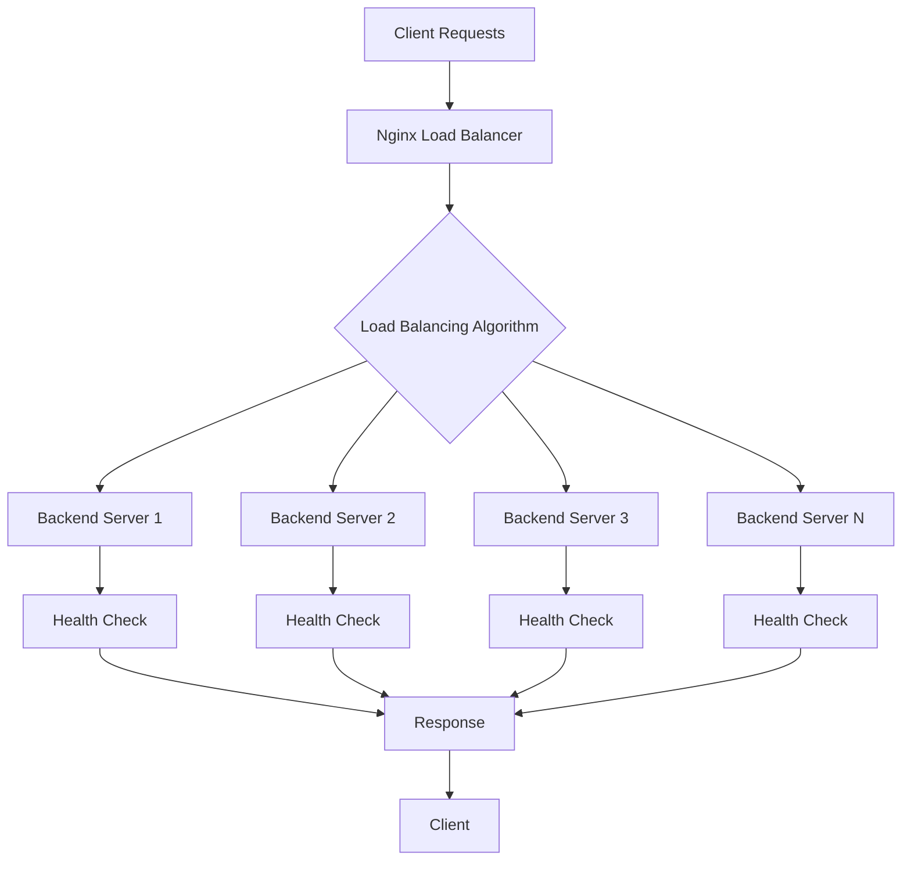

# Nginx Load Balancing

## Summary

Comprehensive guide for implementing load balancing with Nginx in the Axisor platform. This document covers various load balancing methods, health checks, session persistence, and failover strategies for high availability.

## Load Balancing Architecture



## Load Balancing Methods

### Round Robin (Default)

```nginx
upstream backend {
    server backend1:3010;
    server backend2:3010;
    server backend3:3010;
}
```

### Weighted Round Robin

```nginx
upstream backend {
    server backend1:3010 weight=3;
    server backend2:3010 weight=2;
    server backend3:3010 weight=1;
}
```

### Least Connections

```nginx
upstream backend {
    least_conn;
    server backend1:3010;
    server backend2:3010;
    server backend3:3010;
}
```

### IP Hash

```nginx
upstream backend {
    ip_hash;
    server backend1:3010;
    server backend2:3010;
    server backend3:3010;
}
```

## Health Checks

### Basic Health Check

```nginx
upstream backend {
    server backend1:3010 max_fails=3 fail_timeout=30s;
    server backend2:3010 max_fails=3 fail_timeout=30s;
    server backend3:3010 max_fails=3 fail_timeout=30s;
}
```

### Advanced Health Check

```nginx
upstream backend {
    server backend1:3010 weight=3 max_fails=3 fail_timeout=30s;
    server backend2:3010 weight=3 max_fails=3 fail_timeout=30s;
    server backend3:3010 weight=2 max_fails=3 fail_timeout=30s;
    server backend4:3010 backup;
}
```

## Session Persistence

### IP Hash for Session Persistence

```nginx
upstream backend {
    ip_hash;
    server backend1:3010;
    server backend2:3010;
    server backend3:3010;
}
```

### Sticky Sessions with Cookie

```nginx
upstream backend {
    server backend1:3010;
    server backend2:3010;
    server backend3:3010;
    
    sticky cookie srv_id expires=1h domain=.axisor.com path=/;
}
```

## Failover and Backup

### Backup Server Configuration

```nginx
upstream backend {
    server backend1:3010 weight=3 max_fails=3 fail_timeout=30s;
    server backend2:3010 weight=3 max_fails=3 fail_timeout=30s;
    server backend3:3010 weight=2 max_fails=3 fail_timeout=30s;
    server backup1:3010 backup;
    server backup2:3010 backup;
}
```

### Down Server Handling

```nginx
upstream backend {
    server backend1:3010 max_fails=3 fail_timeout=30s;
    server backend2:3010 max_fails=3 fail_timeout=30s;
    server backend3:3010 max_fails=3 fail_timeout=30s down;
}
```

## How to Use This Document

- **For Setup**: Use the load balancing methods for initial configuration
- **For Health**: Use the health check configurations for monitoring
- **For Sessions**: Use the session persistence methods for stateful applications
- **For Failover**: Use the backup and failover configurations for high availability
