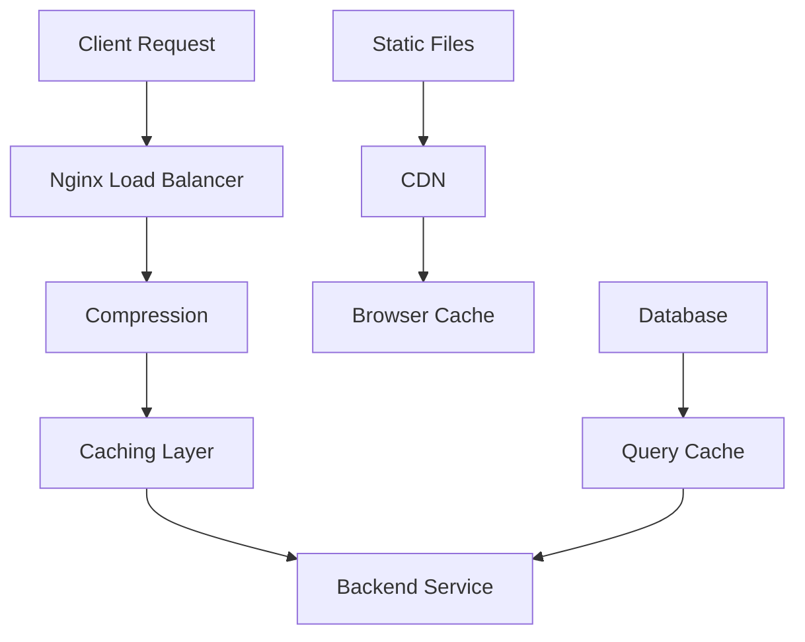

# Nginx Performance Optimization

## Summary

Comprehensive guide for optimizing Nginx performance in the Axisor platform. This document covers caching strategies, compression, connection optimization, and performance monitoring.

## Performance Architecture



## Caching Configuration

### Static File Caching

```nginx
# Static assets caching
location ~* \.(js|css|png|jpg|jpeg|gif|ico|svg|woff|woff2|ttf|eot)$ {
    expires 1y;
    add_header Cache-Control "public, immutable";
    add_header Vary "Accept-Encoding";
    
    # Gzip compression
    gzip_static on;
}

# HTML caching
location ~* \.(html)$ {
    expires 1h;
    add_header Cache-Control "public, must-revalidate, proxy-revalidate";
    add_header Vary "Accept-Encoding";
}
```

### Proxy Caching

```nginx
# Proxy cache configuration
proxy_cache_path /var/cache/nginx levels=1:2 keys_zone=api_cache:10m max_size=1g inactive=60m use_temp_path=off;

# Cache configuration
location /api/cacheable/ {
    proxy_pass http://backend;
    proxy_cache api_cache;
    proxy_cache_valid 200 302 10m;
    proxy_cache_valid 404 1m;
    proxy_cache_use_stale error timeout updating http_500 http_502 http_503 http_504;
    proxy_cache_lock on;
    add_header X-Cache-Status $upstream_cache_status;
}
```

## Compression Configuration

### Gzip Compression

```nginx
# Gzip configuration
gzip on;
gzip_vary on;
gzip_min_length 1024;
gzip_proxied any;
gzip_comp_level 6;
gzip_types
    text/plain
    text/css
    text/xml
    text/javascript
    application/javascript
    application/xml+rss
    application/json
    application/xml
    image/svg+xml;
```

### Brotli Compression

```nginx
# Brotli configuration
brotli on;
brotli_comp_level 6;
brotli_types
    text/plain
    text/css
    application/json
    application/javascript
    text/xml
    application/xml
    application/xml+rss
    text/javascript;
```

## Connection Optimization

### Keep-Alive Configuration

```nginx
# Keep-alive settings
keepalive_timeout 65;
keepalive_requests 100;
tcp_nopush on;
tcp_nodelay on;
```

### Upstream Keep-Alive

```nginx
upstream backend {
    server backend1:3010;
    server backend2:3010;
    keepalive 32;
}

location /api/ {
    proxy_pass http://backend;
    proxy_http_version 1.1;
    proxy_set_header Connection "";
}
```

## Buffer Configuration

### Client Buffers

```nginx
# Client buffer configuration
client_body_buffer_size 128k;
client_max_body_size 100m;
client_header_buffer_size 1k;
large_client_header_buffers 4 4k;
output_buffers 1 32k;
postpone_output 1460;
```

### Proxy Buffers

```nginx
# Proxy buffer configuration
proxy_buffering on;
proxy_buffer_size 4k;
proxy_buffers 8 4k;
proxy_busy_buffers_size 8k;
proxy_temp_file_write_size 8k;
```

## HTTP/2 Configuration

### HTTP/2 Setup

```nginx
server {
    listen 443 ssl http2;
    server_name your-domain.com;
    
    # HTTP/2 push
    location / {
        http2_push /css/main.css;
        http2_push /js/main.js;
        http2_push /images/logo.png;
    }
}
```

## Performance Monitoring

### Status Module

```nginx
# Status endpoint
location /nginx-status {
    stub_status on;
    access_log off;
    allow 127.0.0.1;
    allow 10.0.0.0/8;
    deny all;
}
```

### Custom Metrics

```nginx
# Custom log format for performance
log_format performance '$remote_addr - $remote_user [$time_local] '
                      '"$request" $status $body_bytes_sent '
                      '"$http_referer" "$http_user_agent" '
                      '$request_time $upstream_response_time';

access_log /var/log/nginx/performance.log performance;
```

## How to Use This Document

- **For Caching**: Use the caching configurations for static and dynamic content
- **For Compression**: Use the compression settings for bandwidth optimization
- **For Connections**: Use the connection optimization for better performance
- **For Monitoring**: Use the monitoring configurations for performance tracking
