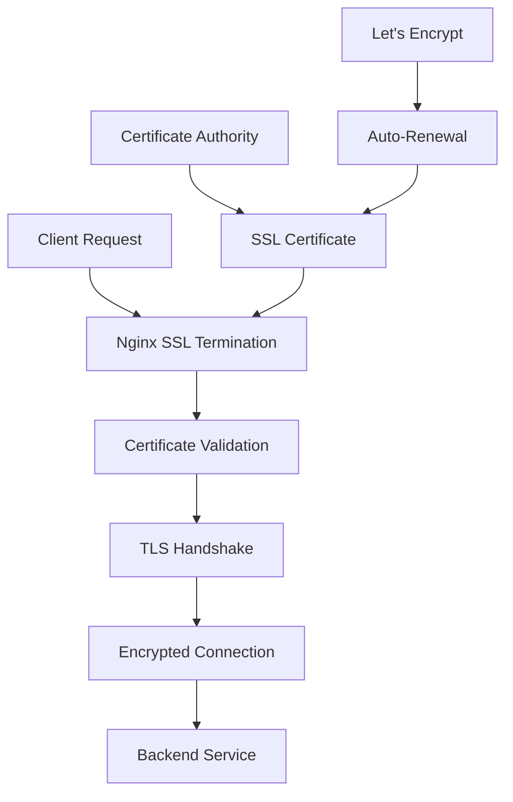

# Nginx SSL Setup

## Summary

Complete guide for setting up SSL/TLS with Nginx in the Axisor platform. This document covers certificate generation, Let's Encrypt integration, SSL configuration, and security best practices.

## SSL Architecture



## Certificate Generation

### Self-Signed Certificate

```bash
# Generate private key
openssl genrsa -out /etc/nginx/ssl/privkey.pem 2048

# Generate certificate signing request
openssl req -new -key /etc/nginx/ssl/privkey.pem -out /etc/nginx/ssl/cert.csr

# Generate self-signed certificate
openssl x509 -req -days 365 -in /etc/nginx/ssl/cert.csr -signkey /etc/nginx/ssl/privkey.pem -out /etc/nginx/ssl/fullchain.pem
```

### Let's Encrypt Certificate

```bash
# Install certbot
apt-get update
apt-get install certbot python3-certbot-nginx

# Generate certificate
certbot --nginx -d your-domain.com

# Test renewal
certbot renew --dry-run
```

## SSL Configuration

### Basic SSL Configuration

```nginx
server {
    listen 443 ssl http2;
    server_name your-domain.com;

    # SSL Certificate
    ssl_certificate /etc/nginx/ssl/fullchain.pem;
    ssl_certificate_key /etc/nginx/ssl/privkey.pem;

    # SSL Protocols
    ssl_protocols TLSv1.2 TLSv1.3;

    # SSL Ciphers
    ssl_ciphers ECDHE-RSA-AES128-GCM-SHA256:ECDHE-RSA-AES256-GCM-SHA384;
    ssl_prefer_server_ciphers off;

    # SSL Session
    ssl_session_cache shared:SSL:10m;
    ssl_session_timeout 10m;
}
```

### Advanced SSL Configuration

```nginx
server {
    listen 443 ssl http2;
    server_name your-domain.com;

    # SSL Certificate
    ssl_certificate /etc/nginx/ssl/fullchain.pem;
    ssl_certificate_key /etc/nginx/ssl/privkey.pem;

    # SSL Protocols
    ssl_protocols TLSv1.2 TLSv1.3;

    # SSL Ciphers
    ssl_ciphers ECDHE-RSA-AES128-GCM-SHA256:ECDHE-RSA-AES256-GCM-SHA384:ECDHE-RSA-AES256-SHA384:ECDHE-RSA-AES128-SHA256;
    ssl_prefer_server_ciphers off;

    # SSL Session
    ssl_session_cache shared:SSL:10m;
    ssl_session_timeout 10m;
    ssl_session_tickets off;

    # OCSP Stapling
    ssl_stapling on;
    ssl_stapling_verify on;
    ssl_trusted_certificate /etc/nginx/ssl/chain.pem;
    resolver 8.8.8.8 8.8.4.4 valid=300s;
    resolver_timeout 5s;

    # HSTS
    add_header Strict-Transport-Security "max-age=31536000; includeSubDomains; preload" always;
}
```

## HTTP to HTTPS Redirect

### Basic Redirect

```nginx
server {
    listen 80;
    server_name your-domain.com;
    return 301 https://$server_name$request_uri;
}
```

### Advanced Redirect

```nginx
server {
    listen 80;
    server_name your-domain.com www.your-domain.com;
    
    # Let's Encrypt challenge
    location /.well-known/acme-challenge/ {
        root /var/www/certbot;
    }
    
    # Redirect all other traffic to HTTPS
    location / {
        return 301 https://$server_name$request_uri;
    }
}
```

## Security Headers

### SSL Security Headers

```nginx
server {
    listen 443 ssl http2;
    server_name your-domain.com;

    # SSL Configuration
    ssl_certificate /etc/nginx/ssl/fullchain.pem;
    ssl_certificate_key /etc/nginx/ssl/privkey.pem;

    # Security Headers
    add_header Strict-Transport-Security "max-age=31536000; includeSubDomains; preload" always;
    add_header X-Frame-Options "SAMEORIGIN" always;
    add_header X-Content-Type-Options "nosniff" always;
    add_header X-XSS-Protection "1; mode=block" always;
    add_header Referrer-Policy "strict-origin-when-cross-origin" always;
}
```

## Certificate Management

### Let's Encrypt Auto-Renewal

```bash
# Create renewal script
cat > /etc/cron.d/certbot-renew << EOF
0 12 * * * root certbot renew --quiet
EOF

# Test renewal
certbot renew --dry-run
```

### Certificate Monitoring

```bash
# Check certificate expiration
echo | openssl s_client -servername your-domain.com -connect your-domain.com:443 2>/dev/null | openssl x509 -noout -dates

# Check certificate details
openssl x509 -in /etc/nginx/ssl/fullchain.pem -text -noout
```

## How to Use This Document

- **For Setup**: Use the certificate generation steps for initial SSL setup
- **For Configuration**: Use the SSL configuration examples for Nginx setup
- **For Security**: Use the security headers for enhanced protection
- **For Management**: Use the certificate management commands for maintenance
