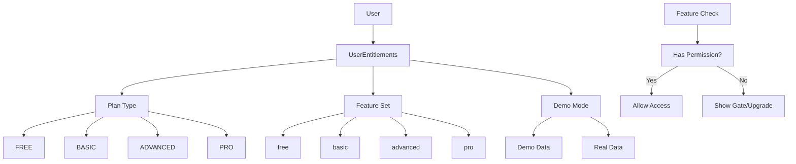

# Entitlements System

## Summary

Comprehensive entitlements and feature gating system that controls user access to platform features based on their plan and verification status. Implements demo mode for unverified users and granular feature permissions for different plan tiers.

## System Architecture



## Database Schema

### UserEntitlements Model

```prisma
model UserEntitlements {
  id          String   @id @default(uuid())
  user_id     String   @unique
  plan        String   @default("FREE")
  feature_set String   @default("free")
  demo_mode   Boolean  @default(true)
  created_at  DateTime @default(now())
  updated_at  DateTime @default(now())
  
  user User @relation(fields: [user_id], references: [id], onDelete: Cascade)
  
  @@map("user_entitlements")
}
```

### User Model Updates

```prisma
model User {
  // ... existing fields
  account_status String @default("pending_verification")
  plan_type      PlanType @default(free)
  user_entitlements UserEntitlements?
}
```

## Plan Tiers and Features

### FREE Plan (Unverified Users)

**Features:**
- `view_dashboard` - View dashboard with demo data
- `create_draft_bots` - Create bot configurations (draft only)
- `backtest` - Run backtests on demo data
- `view_reports_readonly` - View reports in read-only mode

**Limitations:**
- Demo mode only
- No live trading
- No real data access
- Limited bot creation

### BASIC Plan ($29/month)

**Features:**
- All FREE features
- `connect_1_exchange` - Connect to one exchange
- `run_live_bots_limited` - Run up to 3 live bots
- `basic_support` - Email support

**Upgrades from FREE:**
- Real data access
- Live bot execution
- Exchange connectivity
- Customer support

### ADVANCED Plan ($99/month)

**Features:**
- All BASIC features
- `unlimited_bots` - No bot limit
- `advanced_reports` - Detailed analytics
- `priority_ws` - Priority WebSocket connections

**Upgrades from BASIC:**
- Unlimited bot creation
- Advanced analytics
- Priority data feeds
- Enhanced performance

### PRO Plan ($299/month)

**Features:**
- All ADVANCED features
- `multi_tenant` - Multi-account management
- `compliance` - Compliance reporting
- `api_access` - Full API access
- `white_label` - White-label solutions

**Upgrades from ADVANCED:**
- Enterprise features
- API access
- White-label options
- Compliance tools

## Feature Gating Implementation

### Frontend Feature Gating

```typescript
// Feature configuration
export const FEATURES = {
  free: [
    'view_dashboard',
    'create_draft_bots',
    'backtest',
    'view_reports_readonly'
  ],
  basic: [
    'view_dashboard',
    'create_draft_bots',
    'backtest',
    'view_reports_readonly',
    'connect_1_exchange',
    'run_live_bots_limited',
    'basic_support'
  ],
  advanced: [
    'view_dashboard',
    'create_draft_bots',
    'backtest',
    'view_reports_readonly',
    'connect_1_exchange',
    'run_live_bots_limited',
    'basic_support',
    'unlimited_bots',
    'advanced_reports',
    'priority_ws'
  ],
  pro: [
    'view_dashboard',
    'create_draft_bots',
    'backtest',
    'view_reports_readonly',
    'connect_1_exchange',
    'run_live_bots_limited',
    'basic_support',
    'unlimited_bots',
    'advanced_reports',
    'priority_ws',
    'multi_tenant',
    'compliance',
    'api_access',
    'white_label'
  ]
};

// Feature checking hook
export function useEntitlements() {
  const [entitlements, setEntitlements] = useState<any>(null);
  const [loading, setLoading] = useState(true);
  
  useEffect(() => {
    fetch('/api/me/entitlements', {
      headers: {
        'Authorization': `Bearer ${localStorage.getItem('access_token')}`
      }
    })
      .then(r => r.json())
      .then(setEntitlements)
      .finally(() => setLoading(false));
  }, []);
  
  return { entitlements, loading };
}

// Feature permission check
export function hasFeature(entitlements: any, feature: string): boolean {
  if (!entitlements) return false;
  return FEATURES[entitlements.feature_set as keyof typeof FEATURES]?.includes(feature) ?? false;
}
```

### ProtectedButton Component

```typescript
interface ProtectedButtonProps {
  feature: string;
  children: React.ReactNode;
  onClick?: () => void;
  fallback?: React.ReactNode;
}

export function ProtectedButton({ feature, children, onClick, fallback }: ProtectedButtonProps) {
  const { entitlements } = useEntitlements();
  const hasPermission = hasFeature(entitlements, feature);
  
  if (!hasPermission) {
    return fallback || <PlanGateButton feature={feature} />;
  }
  
  return (
    <button onClick={onClick}>
      {children}
    </button>
  );
}
```

### Backend Feature Validation

```typescript
// EntitlementsService
export class EntitlementsService {
  constructor(private prisma: PrismaClient) {}
  
  async hasFeature(userId: string, feature: string): Promise<boolean> {
    const entitlements = await this.getUserEntitlements(userId);
    if (!entitlements) return false;

    const features = this.getFeaturesByPlan(entitlements.feature_set);
    return features.includes(feature);
  }
  
  private getFeaturesByPlan(plan: string): string[] {
    const featureMap: Record<string, string[]> = {
      free: ['view_dashboard', 'create_draft_bots', 'backtest', 'view_reports_readonly'],
      basic: ['view_dashboard', 'create_draft_bots', 'backtest', 'view_reports_readonly', 'connect_1_exchange', 'run_live_bots_limited', 'basic_support'],
      advanced: ['view_dashboard', 'create_draft_bots', 'backtest', 'view_reports_readonly', 'connect_1_exchange', 'run_live_bots_limited', 'basic_support', 'unlimited_bots', 'advanced_reports', 'priority_ws'],
      pro: ['view_dashboard', 'create_draft_bots', 'backtest', 'view_reports_readonly', 'connect_1_exchange', 'run_live_bots_limited', 'basic_support', 'unlimited_bots', 'advanced_reports', 'priority_ws', 'multi_tenant', 'compliance', 'api_access', 'white_label']
    };

    return featureMap[plan] || featureMap.free;
  }
}

// Middleware for feature checking
export async function requireFeature(feature: string) {
  return async (request: FastifyRequest, reply: FastifyReply) => {
    const userId = (request as any).user.sub;
    const entitlementsService = new EntitlementsService(prisma);
    
    const hasPermission = await entitlementsService.hasFeature(userId, feature);
    
    if (!hasPermission) {
      return reply.status(403).send({
        error: 'FEATURE_NOT_AVAILABLE',
        message: `Feature '${feature}' not available in your current plan`,
        requiredPlan: getRequiredPlan(feature)
      });
    }
  };
}
```

## Demo Mode vs Real Mode

### Demo Mode (Unverified Users)

**Data Source:**
- Static JSON files in `/public/demo/`
- Pre-generated realistic data
- No real-time updates
- No persistence

**Features:**
- View demo dashboard
- Create draft bots
- Run backtests on demo data
- View demo reports

**User Experience:**
- Clear demo mode banner
- "Verify email to access real features" messaging
- Demo data indicators
- Upgrade prompts

### Real Mode (Verified Users)

**Data Source:**
- Live API connections
- Real-time market data
- User's actual data
- Persistent storage

**Features:**
- Full platform access
- Live trading capabilities
- Real data analytics
- Exchange connectivity

## Plan Upgrade Flow

### Upgrade Triggers

1. **Feature Access**: User tries to access premium feature
2. **Plan Gate**: Contextual upgrade prompts
3. **Manual**: User navigates to plans page
4. **Tour End**: After completing product tour

### Upgrade Process

```typescript
// Plan selection endpoint
POST /api/plans/choose
{
  "plan": "BASIC",
  "payment_method": "stripe_payment_method_id"
}

// Response
{
  "success": true,
  "entitlements": {
    "plan": "BASIC",
    "feature_set": "basic",
    "demo_mode": false,
    "features": ["view_dashboard", "connect_1_exchange", ...]
  }
}
```

### Entitlement Updates

```typescript
// Update user entitlements after upgrade
async updatePlan(userId: string, plan: string, demoMode: boolean = false) {
  return await this.prisma.userEntitlements.update({
    where: { user_id: userId },
    data: {
      plan,
      feature_set: plan.toLowerCase(),
      demo_mode: demoMode,
      updated_at: new Date()
    }
  });
}
```

## API Endpoints

### Get User Entitlements

```typescript
GET /api/me/entitlements

// Response
{
  "plan": "FREE",
  "feature_set": "free",
  "demo_mode": true,
  "features": ["view_dashboard", "create_draft_bots", "backtest", "view_reports_readonly"]
}
```

### Check Feature Permission

```typescript
POST /api/me/entitlements/check-feature
{
  "feature": "connect_1_exchange"
}

// Response
{
  "hasFeature": false,
  "feature": "connect_1_exchange",
  "requiredPlan": "BASIC"
}
```

## Migration and Backfill

### Schema Migration

```sql
-- Add UserEntitlements table
CREATE TABLE user_entitlements (
  id UUID PRIMARY KEY DEFAULT gen_random_uuid(),
  user_id UUID UNIQUE NOT NULL REFERENCES "User"(id) ON DELETE CASCADE,
  plan VARCHAR(50) DEFAULT 'FREE',
  feature_set VARCHAR(50) DEFAULT 'free',
  demo_mode BOOLEAN DEFAULT true,
  created_at TIMESTAMP DEFAULT NOW(),
  updated_at TIMESTAMP DEFAULT NOW()
);
```

### Backfill Script

```typescript
// backfill-entitlements.ts
async function backfillEntitlements() {
  const usersWithoutEntitlements = await prisma.user.findMany({
    where: { user_entitlements: null }
  });

  for (const user of usersWithoutEntitlements) {
    const demoMode = !user.email_verified;
    const plan = mapPlanType(user.plan_type);
    
    await prisma.userEntitlements.create({
      data: {
        user_id: user.id,
        plan,
        feature_set: plan.toLowerCase(),
        demo_mode: demoMode
      }
    });
  }
}
```

## Monitoring and Analytics

### Key Metrics

- **Plan Distribution**: Users by plan tier
- **Feature Usage**: Most/least used features
- **Upgrade Conversion**: FREE → BASIC → ADVANCED → PRO
- **Demo Engagement**: Time spent in demo mode
- **Feature Blocks**: Most blocked features

### Event Tracking

```typescript
// Feature access events
trackEvent('feature_accessed', { feature: 'connect_1_exchange' });
trackEvent('feature_blocked', { feature: 'api_access', currentPlan: 'BASIC' });
trackEvent('plan_upgraded', { from: 'FREE', to: 'BASIC' });
trackEvent('demo_mode_entered');
trackEvent('demo_mode_exited');
```

## Security Considerations

### Permission Validation

- Always validate permissions on backend
- Never trust frontend-only checks
- Implement proper error messages
- Log permission denials

### Data Isolation

- Demo users see only demo data
- Real users see only their data
- Proper data filtering by entitlements
- No cross-user data leakage

## Troubleshooting

### Common Issues

1. **Entitlements Not Loading**
   - Check JWT token validity
   - Verify database connection
   - Check user_entitlements table

2. **Feature Not Available**
   - Verify user's plan tier
   - Check feature configuration
   - Validate permission logic

3. **Demo Mode Issues**
   - Check email verification status
   - Verify demo data files
   - Check entitlements creation

## Related Documentation

- [Registration Verification Flow](./registration-verification-flow.md)
- [Demo Mode](./demo-mode.md)
- [Plan Gate System](./plan-gate-system.md)
- [Feature Flags](./feature-flags.md)
- [API Security](../security/api-security/)

---

## How to Use This Document

• **For Developers**: Use as reference for implementing feature gating, permission checks, and entitlements management.

• **For Product Managers**: Use to understand plan tiers, feature availability, and conversion optimization strategies.

• **For Security Team**: Use to validate permission systems, data isolation, and access control implementation.

• **For Support Team**: Use to understand user entitlements, plan limitations, and troubleshooting common issues.
