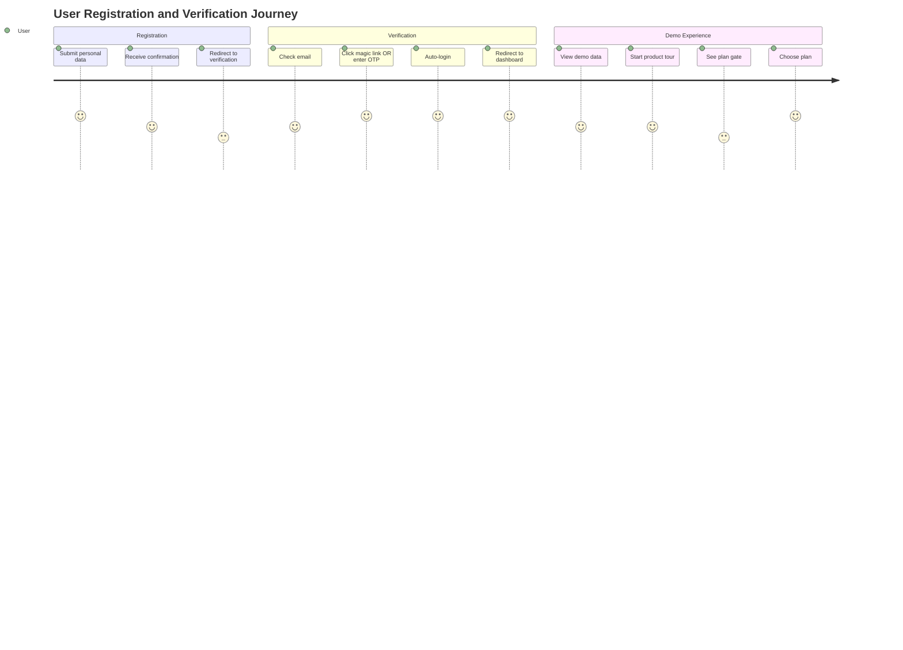

# Registration and Verification Flow

## Summary

Complete user registration and email verification flow implementing industry-standard security practices. Users must verify their email before accessing sensitive features, with demo mode available for unverified users and contextual plan gates for conversion optimization.

## User Journey Map



## Flow Overview

### 1. Registration Phase

**User Actions:**
- Fill personal data form (name, email, password)
- Submit registration

**System Actions:**
- Create user with `email_verified=false`
- Generate verification token
- Send email with magic link + OTP
- Redirect to verification page

**Code Implementation:**
```typescript
// Registration endpoint
POST /api/registration/personal-data
{
  "first_name": "John",
  "last_name": "Doe", 
  "email": "john@example.com",
  "password": "securepassword"
}

// Response
{
  "success": true,
  "message": "Registration successful. Please verify your email."
}
```

### 2. Verification Phase

**User Options:**
- **Magic Link**: Click link in email → Auto-login
- **OTP Code**: Enter 6-digit code from email

**System Actions:**
- Validate token/code
- Mark email as verified
- Create FREE entitlement
- Generate JWT token
- Set HttpOnly cookie
- Redirect to dashboard

**Code Implementation:**
```typescript
// Magic link verification
GET /api/auth/verify-email/:token
// → Auto-login + redirect to /login?verified=true&message=account_created&email=...

// OTP verification
POST /api/auth/verify-email/otp
{
  "email": "john@example.com",
  "code": "123456"
}
// → Return JWT token
```

### 3. Demo Experience Phase

**User Actions:**
- View dashboard with demo data
- Interact with demo features
- Start product tour
- See plan gate after tour

**System Actions:**
- Load static demo data
- Show demo mode banner
- Auto-start product tour
- Display plan gate with cooldown

## Key Components

### VerifyEmailRequired Page

**Features:**
- Email display with masking
- OTP input field (6 digits)
- Magic link fallback
- Resend email button
- Auto-polling for verification status
- Rate limiting protection

**User Experience:**
- Clear instructions
- Visual feedback
- Error handling
- Mobile responsive

### Email Templates

**Magic Link + OTP Template:**
```handlebars
{{#if otp}}
<div class="otp-section">
  <p><strong>Use este código de verificação:</strong></p>
  <div class="otp-code">{{otp}}</div>
  <p class="expiry">Código expira em 10 minutos</p>
</div>

<div class="separator">- OU -</div>
{{/if}}

<div class="magic-link-section">
  <a href="{{verificationUrl}}" class="button">
    ✅ Verificar Meu Email
  </a>
  <p class="expiry">Link expira em 24 horas</p>
</div>
```

### Demo Mode Integration

**Demo Data Loading:**
```typescript
// Demo service
export async function loadDemoData(): Promise<DemoData> {
  const [ohlcv, metrics, bots, positions] = await Promise.all([
    fetch('/demo/ohlcv_BTCUSD_1h.json').then(r => r.json()),
    fetch('/demo/metrics.json').then(r => r.json()),
    fetch('/demo/bots.json').then(r => r.json()),
    fetch('/demo/positions.json').then(r => r.json())
  ]);
  
  return { ohlcv, metrics, bots, positions };
}
```

## Security Features

### Rate Limiting

```typescript
// OTP attempts: 5 per 15 minutes
// Email resends: 3 per hour
// IP-based tracking with Redis
```

### Token Security

```typescript
// Magic link: 24h expiration, single-use
// OTP: 10min expiration, bcrypt hashed
// JWT: 7 days, HttpOnly cookie
```

### Anti-fraud Protection

- IP tracking and blacklisting
- Device fingerprinting
- Risk score calculation
- Auto-blacklist suspicious patterns

## User Experience Features

### Auto-Login

After successful verification:
1. Generate JWT token
2. Set HttpOnly cookie
3. Redirect to login page with success parameters
4. Show welcome message on login page

**Token Hashing Strategy:**
- Magic Link tokens use SHA256 hashing (GitHub style) for secure storage
- OTP codes use bcrypt hashing for additional security
- Separate storage prevents conflicts between verification methods

### Demo Mode Banner

```typescript
// Demo mode indicator
<div className="demo-banner">
  <span>🎯 Demo Mode</span>
  <span>You're viewing demo data. Verify your email to access real features.</span>
</div>
```

### Product Tour Integration

```typescript
// Auto-start tour for new users
useEffect(() => {
  if (isFirstVisit && isDemoMode) {
    startProductTour();
  }
}, [isFirstVisit, isDemoMode]);
```

## Conversion Optimization

### Plan Gate Triggers

1. **Tour End**: After completing product tour
2. **Tour Skip**: When user skips tour
3. **Blocked Action**: When trying to access premium feature
4. **Cooldown**: 90 seconds between gate displays

### Plan Decision Sheet

**Features:**
- Clear value proposition
- Feature comparison
- Pricing display
- Limited-time offers
- Easy upgrade flow

## Analytics and Tracking

### Key Metrics

- **Verification Rate**: % of users who verify email
- **Demo Engagement**: Time spent in demo mode
- **Tour Completion**: % who complete product tour
- **Gate Conversion**: % who upgrade to paid plans
- **Abuse Detection**: Fraud attempts blocked

### Event Tracking

```typescript
// Verification events
trackEvent('email_verification_started');
trackEvent('email_verification_completed');
trackEvent('demo_mode_entered');
trackEvent('product_tour_started');
trackEvent('plan_gate_shown');
trackEvent('plan_selected');
```

## Error Handling

### Common Issues

1. **Email Not Delivered**
   - Check spam folder
   - Verify email address
   - Resend with different provider

2. **OTP Invalid**
   - Check expiration (10 minutes)
   - Verify code format (6 digits)
   - Rate limit protection

3. **Magic Link Expired**
   - 24-hour expiration
   - Single-use only
   - Request new verification

4. **Rate Limit Hit**
   - Wait for cooldown period
   - Contact support if needed
   - Check for abuse patterns

## Testing Scenarios

### Critical Test Cases

1. **T1**: Complete registration → verification → demo
2. **T2**: OTP verification flow
3. **T3**: Magic link verification flow
4. **T4**: Rate limiting protection
5. **T5**: Demo mode functionality
6. **T6**: Plan gate conversion

### Test Data

```typescript
// Test user for verification flow
const testUser = {
  email: 'test@example.com',
  firstName: 'Test',
  lastName: 'User',
  password: 'testpassword123'
};
```

## Performance Considerations

### Optimization

- **Email Delivery**: <2s for email sending
- **Page Load**: <2s for verification pages
- **Demo Data**: <1s for demo data loading
- **Tour Start**: <500ms for tour initialization

### Monitoring

- Email deliverability rates
- Verification completion rates
- Demo engagement metrics
- Conversion funnel analysis

## Related Documentation

- [Email Verification Security](../security/authentication/email-verification.md)
- [Entitlements System](./entitlements-system.md)
- [Demo Mode](./demo-mode.md)
- [Plan Gate System](./plan-gate-system.md)
- [Feature Flags](./feature-flags.md)

---

## How to Use This Document

• **For Product Managers**: Use to understand the complete user journey, conversion optimization strategies, and key metrics to track.

• **For Developers**: Use as reference for implementing the verification flow components and understanding the technical requirements.

• **For UX Designers**: Use to understand the user experience flow, interface requirements, and interaction patterns.

• **For QA Engineers**: Use to understand test scenarios, edge cases, and validation requirements for the verification system.
