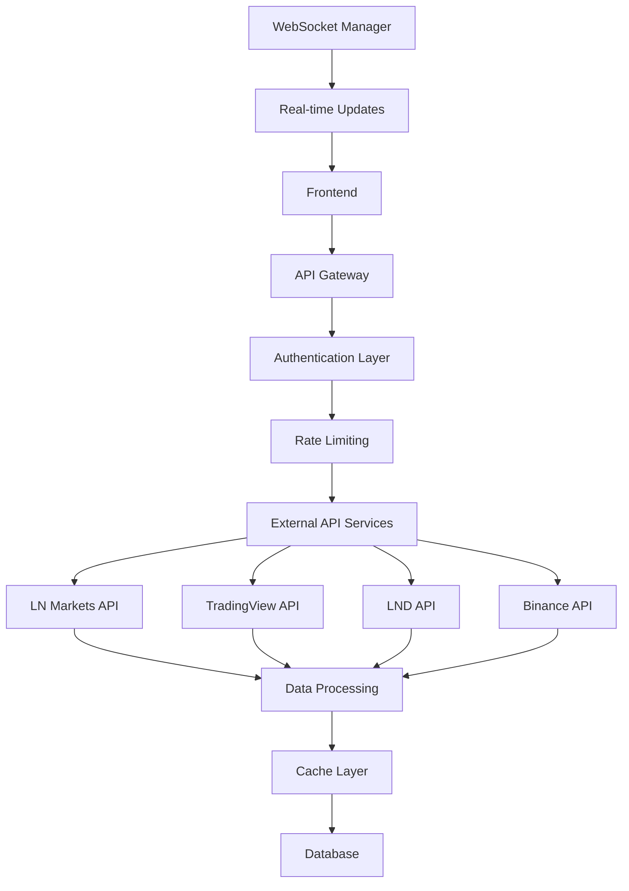

# External APIs Integration

## Summary

Comprehensive guide for integrating and managing external APIs in the Axisor platform. This document covers authentication, data handling, error management, rate limiting, and best practices for external API integrations.

## Integration Architecture



## Core Integration Services

### Account Credentials Service

```typescript
// backend/src/services/account-credentials.service.ts
export class AccountCredentialsService {
  private prisma: PrismaClient;
  private userExchangeAccountService: UserExchangeAccountService;

  constructor(prisma: PrismaClient) {
    this.prisma = prisma;
    this.userExchangeAccountService = new UserExchangeAccountService(prisma);
  }

  /**
   * Get active account credentials for user
   */
  async getActiveAccountCredentials(userId: string): Promise<AccountCredentials | null> {
    console.log('🔍 ACCOUNT CREDENTIALS - Fetching active account for user:', userId);
    
    const activeAccount = await this.prisma.userExchangeAccounts.findFirst({
      where: {
        user_id: userId,
        is_active: true
      },
      include: {
        exchange: true
      }
    });

    if (!activeAccount) {
      console.log('❌ ACCOUNT CREDENTIALS - No active account found');
      return null;
    }

    console.log('✅ ACCOUNT CREDENTIALS - Active account found:', {
      accountName: activeAccount.account_name,
      exchangeName: activeAccount.exchange.name
    });

    // Get credentials from database and decrypt them
    console.log('🔍 ACCOUNT CREDENTIALS - Calling UserExchangeAccountService.decryptCredentials...');
    const credentials = this.userExchangeAccountService.decryptCredentials(activeAccount.credentials);
    console.log('✅ ACCOUNT CREDENTIALS - Decrypted credentials:', {
      hasApiKey: !!credentials['API Key'],
      hasApiSecret: !!credentials['API Secret'],
      hasPassphrase: !!credentials['Passphrase'],
      isTestnet: credentials.isTestnet
    });

    return {
      accountName: activeAccount.account_name,
      exchangeName: activeAccount.exchange.name,
      credentials
    };
  }
}
```

### LN Markets Integration

```typescript
// backend/src/routes/lnmarkets-header.routes.ts
export async function lnMarketsHeaderRoutes(fastify: FastifyInstance) {
  console.log('🚀 LN MARKETS HEADER ROUTES - Module loaded!');
  const prisma = new PrismaClient();

  fastify.get('/header-data', {
    preHandler: [authMiddleware],
    schema: {
      response: {
        200: {
          type: 'object',
          properties: {
            success: { type: 'boolean' },
            data: {
              type: 'object',
              properties: {
                index: { type: 'number' },
                tradingFees: { type: 'number' },
                nextFunding: { type: 'number' },
                rate: { type: 'number' },
                rateChange: { type: 'number' },
                timestamp: { type: 'number' },
                source: { type: 'string' },
                network: { type: 'string' }
              }
            }
          }
        }
      }
    }
  }, async (request, reply) => {
    console.log('🚀 LN MARKETS HEADER ROUTE - Route called!');
    try {
      const user = (request as any).user;
      
      // Get active credentials
      const { AccountCredentialsService } = await import('../services/account-credentials.service');
      const accountCredentialsService = new AccountCredentialsService(prisma);
      const activeCredentials = await accountCredentialsService.getActiveAccountCredentials(user.id);
      
      if (!activeCredentials) {
        return reply.status(400).send({
          success: false,
          error: 'MISSING_CREDENTIALS',
          message: 'No active exchange account found'
        });
      }

      // As credenciais já estão descriptografadas pelo AccountCredentialsService
      const decryptedCredentials = activeCredentials.credentials;
      
      console.log('🔍 LN MARKETS HEADER - Decrypted credentials:', {
        hasApiKey: !!decryptedCredentials['API Key'],
        hasApiSecret: !!decryptedCredentials['API Secret'],
        hasPassphrase: !!decryptedCredentials['Passphrase'],
        isTestnet: decryptedCredentials.isTestnet
      });

      // Detectar testnet
      const testnetResult = TestnetDetector.detectTestnet(decryptedCredentials);
      
      // Criar serviço otimizado
      const lnMarketsOptimized = new LNMarketsOptimizedService(
        {
          apiKey: decryptedCredentials['API Key'],
          apiSecret: decryptedCredentials['API Secret'],
          passphrase: decryptedCredentials['Passphrase'],
          isTestnet: testnetResult.isTestnet
        },
        fastify.log
      );

      // Fetch data
      const specificData = await lnMarketsOptimized.getSpecificData();
      
      const combinedData = {
        index: specificData.rate.index || 0,
        tradingFees: specificData.tradingFees.tradingFees,
        nextFunding: specificData.nextFunding.nextFunding,
        rate: specificData.rate.rate,
        rateChange: specificData.rate.rateChange,
        timestamp: Date.now()
      };

      const responseData = {
        index: specificData.rate.index || 0,
        tradingFees: specificData.tradingFees.tradingFees,
        nextFunding: specificData.nextFunding.nextFunding,
        rate: specificData.rate.rate,
        rateChange: specificData.rate.rateChange,
        timestamp: Date.now(),
        source: 'lnmarkets-optimized',
        network: testnetResult.isTestnet ? 'testnet' : 'mainnet'
      };

      return reply.send({
        success: true,
        data: responseData
      });

    } catch (error) {
      console.error('❌ LN MARKETS HEADER ERROR:', error);
      return reply.status(500).send({
        success: false,
        error: 'INTERNAL_ERROR',
        message: 'Failed to fetch LN Markets header data'
      });
    }
  });
}
```

### TradingView Data Service Integration

```typescript
// backend/src/services/tradingview-data.service.ts
export class TradingViewDataService {
  private cache: Map<string, any> = new Map();
  private rateLimiter: IntelligentRateLimiter;
  private circuitBreaker: CircuitBreaker;

  constructor() {
    this.rateLimiter = new IntelligentRateLimiter();
    this.circuitBreaker = new CircuitBreaker();
  }

  /**
   * Get market data with fallback mechanisms
   */
  async getMarketData(symbol: string): Promise<MarketData> {
    try {
      // Check cache first
      const cached = this.cache.get(symbol);
      if (cached && this.isCacheValid(cached)) {
        return cached.data;
      }

      // Rate limiting check
      if (!this.rateLimiter.canMakeRequest('tradingview')) {
        throw new Error('Rate limit exceeded');
      }

      // Circuit breaker check
      if (!this.circuitBreaker.canExecute('tradingview')) {
        return this.getFallbackData(symbol);
      }

      // Fetch from TradingView API
      const data = await this.fetchFromTradingView(symbol);
      
      // Cache the result
      this.cache.set(symbol, {
        data,
        timestamp: Date.now(),
        ttl: 60000 // 1 minute
      });

      return data;

    } catch (error) {
      console.error('TradingView API error:', error);
      return this.getFallbackData(symbol);
    }
  }

  /**
   * Get fallback data when primary source fails
   */
  private getFallbackData(symbol: string): MarketData {
    // Implement fallback logic
    return {
      symbol,
      price: 0,
      change: 0,
      timestamp: Date.now(),
      source: 'fallback'
    };
  }
}
```

## Data Processing and Validation

### Market Data Validator

```typescript
// backend/src/validators/market-data.validator.ts
export class MarketDataValidator {
  /**
   * Validate market data structure
   */
  static validateMarketData(data: any): boolean {
    const requiredFields = ['symbol', 'price', 'timestamp'];
    
    for (const field of requiredFields) {
      if (!data[field]) {
        console.error(`Missing required field: ${field}`);
        return false;
      }
    }

    // Validate price is positive number
    if (typeof data.price !== 'number' || data.price <= 0) {
      console.error('Invalid price value');
      return false;
    }

    // Validate timestamp is recent (within 5 minutes)
    const now = Date.now();
    const dataTime = new Date(data.timestamp).getTime();
    if (now - dataTime > 5 * 60 * 1000) {
      console.error('Data is too old');
      return false;
    }

    return true;
  }

  /**
   * Sanitize market data
   */
  static sanitizeMarketData(data: any): any {
    return {
      symbol: data.symbol?.toString().trim(),
      price: parseFloat(data.price) || 0,
      change: parseFloat(data.change) || 0,
      timestamp: parseInt(data.timestamp) || Date.now(),
      source: data.source?.toString().trim() || 'unknown'
    };
  }
}
```

### Error Handling

```typescript
// backend/src/services/error-handler.service.ts
export class ExternalAPIErrorHandler {
  /**
   * Handle external API errors
   */
  static handleError(error: any, source: string): APIError {
    console.error(`❌ ${source.toUpperCase()} API ERROR:`, error);

    if (error.response) {
      // API responded with error status
      return {
        code: error.response.status,
        message: error.response.data?.message || 'API request failed',
        source,
        timestamp: Date.now()
      };
    } else if (error.request) {
      // Request was made but no response received
      return {
        code: 'NETWORK_ERROR',
        message: 'No response from API',
        source,
        timestamp: Date.now()
      };
    } else {
      // Something else happened
      return {
        code: 'UNKNOWN_ERROR',
        message: error.message || 'Unknown error occurred',
        source,
        timestamp: Date.now()
      };
    }
  }

  /**
   * Retry logic for failed requests
   */
  static async retryRequest<T>(
    requestFn: () => Promise<T>,
    maxRetries: number = 3,
    delay: number = 1000
  ): Promise<T> {
    for (let attempt = 1; attempt <= maxRetries; attempt++) {
      try {
        return await requestFn();
      } catch (error) {
        if (attempt === maxRetries) {
          throw error;
        }
        
        console.log(`Retry attempt ${attempt}/${maxRetries} after ${delay}ms`);
        await new Promise(resolve => setTimeout(resolve, delay));
        delay *= 2; // Exponential backoff
      }
    }
    
    throw new Error('Max retries exceeded');
  }
}
```

## Rate Limiting and Caching

### Intelligent Rate Limiter

```typescript
// backend/src/services/intelligent-rate-limiter.service.ts
export class IntelligentRateLimiter {
  private limits: Map<string, RateLimit> = new Map();

  /**
   * Check if request can be made
   */
  canMakeRequest(service: string): boolean {
    const limit = this.limits.get(service);
    if (!limit) {
      this.limits.set(service, {
        requests: 0,
        windowStart: Date.now(),
        maxRequests: this.getMaxRequests(service)
      });
      return true;
    }

    const now = Date.now();
    const windowDuration = 60000; // 1 minute

    // Reset window if expired
    if (now - limit.windowStart > windowDuration) {
      limit.requests = 0;
      limit.windowStart = now;
    }

    return limit.requests < limit.maxRequests;
  }

  /**
   * Record request
   */
  recordRequest(service: string): void {
    const limit = this.limits.get(service);
    if (limit) {
      limit.requests++;
    }
  }

  /**
   * Get max requests per service
   */
  private getMaxRequests(service: string): number {
    const limits = {
      'lnmarkets': 10,      // 10 requests per minute
      'tradingview': 100,   // 100 requests per minute
      'binance': 50,        // 50 requests per minute
      'lnd': 20            // 20 requests per minute
    };

    return limits[service] || 10;
  }
}
```

### Cache Management

```typescript
// backend/src/services/intelligent-cache.service.ts
export class IntelligentCache {
  private cache: Map<string, CacheEntry> = new Map();
  private ttlConfig: Map<string, number> = new Map();

  constructor() {
    // Configure TTL for different data types
    this.ttlConfig.set('market_data', 30000);      // 30 seconds
    this.ttlConfig.set('user_data', 300000);      // 5 minutes
    this.ttlConfig.set('exchange_data', 60000);  // 1 minute
  }

  /**
   * Get cached data
   */
  get(key: string): any | null {
    const entry = this.cache.get(key);
    if (!entry) {
      return null;
    }

    const now = Date.now();
    if (now - entry.timestamp > entry.ttl) {
      this.cache.delete(key);
      return null;
    }

    return entry.data;
  }

  /**
   * Set cached data
   */
  set(key: string, data: any, ttl?: number): void {
    const defaultTtl = this.ttlConfig.get(key.split(':')[0]) || 60000;
    const actualTtl = ttl || defaultTtl;

    this.cache.set(key, {
      data,
      timestamp: Date.now(),
      ttl: actualTtl
    });
  }

  /**
   * Clear expired entries
   */
  cleanup(): void {
    const now = Date.now();
    for (const [key, entry] of this.cache.entries()) {
      if (now - entry.timestamp > entry.ttl) {
        this.cache.delete(key);
      }
    }
  }
}
```

## WebSocket Integration

### WebSocket Manager

```typescript
// backend/src/services/websocket-manager.service.ts
export class WebSocketManager {
  private connections: Map<string, WebSocket> = new Map();
  private subscriptions: Map<string, Set<string>> = new Map();

  /**
   * Connect to external WebSocket
   */
  async connect(service: string, url: string): Promise<void> {
    return new Promise((resolve, reject) => {
      const ws = new WebSocket(url);
      
      ws.on('open', () => {
        console.log(`✅ WebSocket connected to ${service}`);
        this.connections.set(service, ws);
        resolve();
      });

      ws.on('error', (error) => {
        console.error(`❌ WebSocket error for ${service}:`, error);
        reject(error);
      });

      ws.on('message', (data) => {
        this.handleMessage(service, data);
      });
    });
  }

  /**
   * Subscribe to data stream
   */
  subscribe(service: string, symbol: string): void {
    if (!this.subscriptions.has(service)) {
      this.subscriptions.set(service, new Set());
    }
    
    this.subscriptions.get(service)!.add(symbol);
    
    // Send subscription message
    const ws = this.connections.get(service);
    if (ws && ws.readyState === WebSocket.OPEN) {
      ws.send(JSON.stringify({
        type: 'subscribe',
        symbol
      }));
    }
  }

  /**
   * Handle incoming messages
   */
  private handleMessage(service: string, data: Buffer): void {
    try {
      const message = JSON.parse(data.toString());
      
      // Validate message structure
      if (this.validateMessage(message)) {
        // Process message based on service
        this.processMessage(service, message);
      }
    } catch (error) {
      console.error(`Error parsing WebSocket message from ${service}:`, error);
    }
  }
}
```

## Recent Fixes and Improvements

### Credential Decryption Fix (2025-01-23)

**Problem**: External API routes were failing due to credential decryption issues.

**Solution**: Fixed key corruption in `UserExchangeAccountService.decryptCredentials()`.

```typescript
// ❌ PROBLEMA: Object.entries() causava corrupção de chaves
Object.entries(encryptedCredentials).forEach(([key, value]) => {
  // key seria corrompido para caracteres especiais
});

// ✅ SOLUÇÃO: Object.keys() com for...of
const keys = Object.keys(encryptedCredentials);
for (const key of keys) {
  const value = encryptedCredentials[key];
  // key permanece intacto
}
```

### Double Decryption Fix (2025-01-23)

**Problem**: Some routes were decrypting credentials twice.

**Solution**: Ensure `AccountCredentialsService` handles decryption, routes use decrypted credentials directly.

### Testnet Detection Fix (2025-01-23)

**Problem**: Testnet mode wasn't being properly detected and applied.

**Solution**: Implemented proper testnet detection in `TestnetDetector.detectTestnet()`.

## Best Practices

### 1. Error Handling
- Always implement fallback mechanisms
- Use circuit breakers for external services
- Log all errors with context
- Implement retry logic with exponential backoff

### 2. Rate Limiting
- Respect external API rate limits
- Implement intelligent rate limiting
- Use caching to reduce API calls
- Monitor rate limit usage

### 3. Data Validation
- Validate all incoming data
- Sanitize data before processing
- Implement data freshness checks
- Use type-safe interfaces

### 4. Security
- Encrypt sensitive credentials
- Use secure communication (HTTPS/WSS)
- Implement proper authentication
- Monitor for security issues

### 5. Performance
- Use caching strategically
- Implement connection pooling
- Monitor response times
- Optimize data processing

## How to Use This Document

- **For Implementation**: Use the service examples for external API integration
- **For Error Handling**: Use the error handling patterns for robust integration
- **For Rate Limiting**: Use the rate limiting service for API management
- **For Caching**: Use the cache service for performance optimization
- **For WebSockets**: Use the WebSocket manager for real-time data
- **For Troubleshooting**: Refer to the recent fixes section for common issues
