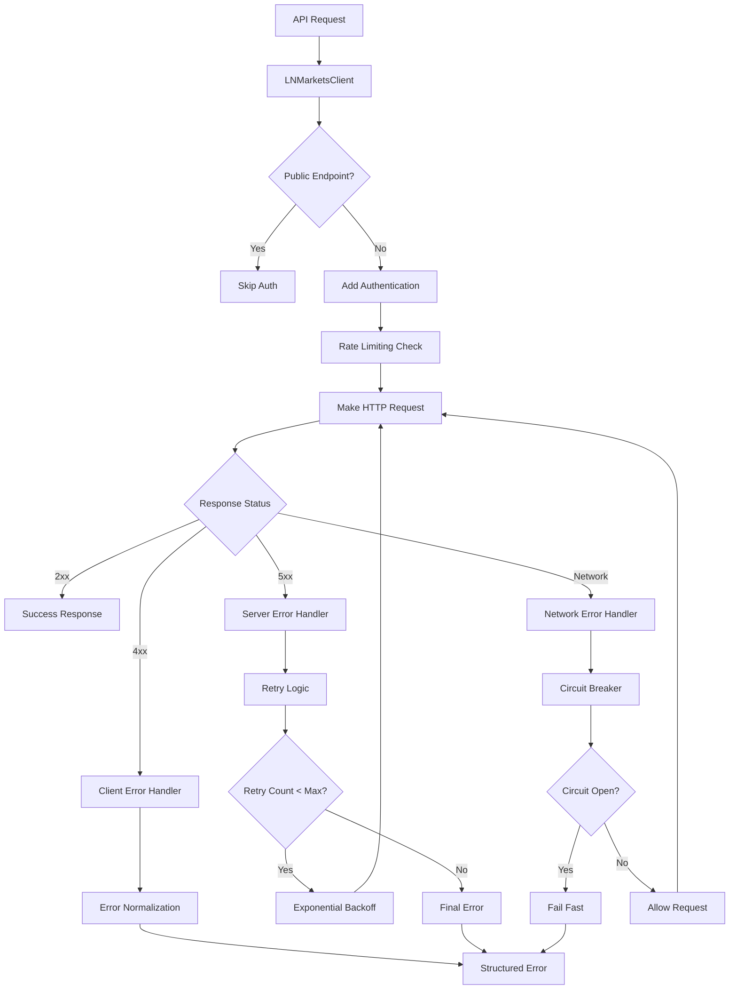
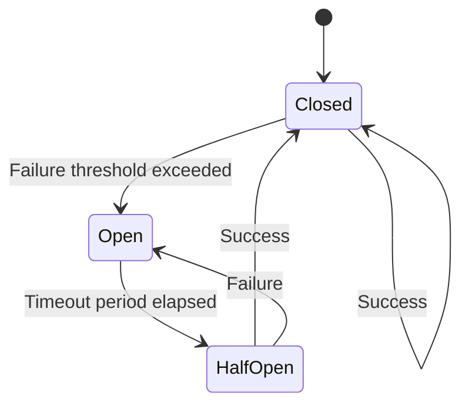

# LN Markets API Error Handling

## Summary

Comprehensive error handling strategy for LN Markets API integration, including retry mechanisms, circuit breaker patterns, and detailed error categorization. This document covers the complete error handling pipeline from HTTP client to application layer.

## Architecture



## Error Categories

### 1. Authentication Errors (401)

**Cause**: Invalid credentials, expired tokens, or malformed signatures
**Response**: Immediate failure with clear error message

```typescript
// Example: Invalid API Key
{
  "error": "LN Markets API: Invalid credentials",
  "status": 401,
  "timestamp": "2025-01-06T10:30:00Z"
}
```

### 2. Authorization Errors (403)

**Cause**: Insufficient permissions for the requested operation
**Response**: Immediate failure with permission details

```typescript
// Example: Insufficient permissions
{
  "error": "LN Markets API: Insufficient permissions",
  "status": 403,
  "operation": "futures/create_position",
  "required_permissions": ["trading:write"]
}
```

### 3. Not Found Errors (404)

**Cause**: Endpoint doesn't exist or resource not found
**Response**: Immediate failure with endpoint information

```typescript
// Example: Endpoint not found
{
  "error": "LN Markets API: Endpoint not found",
  "status": 404,
  "endpoint": "/v2/futures/invalid_endpoint"
}
```

### 4. Rate Limiting Errors (429)

**Cause**: Too many requests per time window
**Response**: Retry with exponential backoff

```typescript
// Example: Rate limit exceeded
{
  "error": "LN Markets API: Rate limit exceeded",
  "status": 429,
  "retry_after": 60,
  "limit": 100,
  "remaining": 0
}
```

### 5. Server Errors (5xx)

**Cause**: LN Markets server issues, temporary unavailability
**Response**: Retry with exponential backoff and circuit breaker

```typescript
// Example: Server error
{
  "error": "LN Markets API: Internal server error",
  "status": 500,
  "retry_count": 2,
  "max_retries": 3
}
```

### 6. Network Errors

**Cause**: Connection timeouts, DNS resolution failures, network unavailability
**Response**: Retry with circuit breaker protection

```typescript
// Example: Network timeout
{
  "error": "Network timeout after 30000ms",
  "type": "ECONNABORTED",
  "code": "TIMEOUT"
}
```

## Retry Strategy

### Exponential Backoff

```typescript
interface RetryConfig {
  maxRetries: number;
  baseDelay: number;
  maxDelay: number;
  backoffMultiplier: number;
}

const retryConfig: RetryConfig = {
  maxRetries: 3,
  baseDelay: 1000,      // 1 second
  maxDelay: 30000,      // 30 seconds
  backoffMultiplier: 2
};

async function retryWithBackoff<T>(
  operation: () => Promise<T>,
  config: RetryConfig
): Promise<T> {
  let lastError: Error;
  
  for (let attempt = 0; attempt <= config.maxRetries; attempt++) {
    try {
      return await operation();
    } catch (error) {
      lastError = error as Error;
      
      // Don't retry on client errors (4xx)
      if (isClientError(error)) {
        throw error;
      }
      
      // Don't retry on last attempt
      if (attempt === config.maxRetries) {
        break;
      }
      
      // Calculate delay with exponential backoff
      const delay = Math.min(
        config.baseDelay * Math.pow(config.backoffMultiplier, attempt),
        config.maxDelay
      );
      
      await new Promise(resolve => setTimeout(resolve, delay));
    }
  }
  
  throw lastError!;
}
```

### Retryable vs Non-Retryable Errors

**Retryable Errors:**
- 5xx server errors
- Network timeouts
- Rate limiting (429)
- Connection refused

**Non-Retryable Errors:**
- 4xx client errors (except 429)
- Authentication failures (401)
- Authorization failures (403)
- Not found (404)
- Validation errors (422)

## Circuit Breaker Implementation

### State Machine



### Configuration

```typescript
interface CircuitBreakerConfig {
  failureThreshold: number;    // 5 failures
  timeout: number;            // 60 seconds
  resetTimeout: number;       // 30 seconds
}

const circuitBreakerConfig: CircuitBreakerConfig = {
  failureThreshold: 5,
  timeout: 60000,
  resetTimeout: 30000
};
```

### Implementation

```typescript
class CircuitBreaker {
  private state: 'CLOSED' | 'OPEN' | 'HALF_OPEN' = 'CLOSED';
  private failureCount = 0;
  private lastFailureTime = 0;
  
  async execute<T>(operation: () => Promise<T>): Promise<T> {
    if (this.state === 'OPEN') {
      if (Date.now() - this.lastFailureTime > this.resetTimeout) {
        this.state = 'HALF_OPEN';
      } else {
        throw new Error('Circuit breaker is OPEN');
      }
    }
    
    try {
      const result = await operation();
      this.onSuccess();
      return result;
    } catch (error) {
      this.onFailure();
      throw error;
    }
  }
  
  private onSuccess(): void {
    this.failureCount = 0;
    this.state = 'CLOSED';
  }
  
  private onFailure(): void {
    this.failureCount++;
    this.lastFailureTime = Date.now();
    
    if (this.failureCount >= this.failureThreshold) {
      this.state = 'OPEN';
    }
  }
}
```

## Error Normalization

### Standardized Error Format

```typescript
interface LNMarketsError {
  code: string;
  message: string;
  status: number;
  timestamp: string;
  endpoint: string;
  method: string;
  retryable: boolean;
  details?: any;
}

class LNMarketsErrorHandler {
  normalizeError(error: any, context: RequestContext): LNMarketsError {
    const baseError: LNMarketsError = {
      code: this.getErrorCode(error),
      message: this.getErrorMessage(error),
      status: error.response?.status || 0,
      timestamp: new Date().toISOString(),
      endpoint: context.endpoint,
      method: context.method,
      retryable: this.isRetryable(error)
    };
    
    if (error.response?.data) {
      baseError.details = error.response.data;
    }
    
    return baseError;
  }
  
  private getErrorCode(error: any): string {
    if (error.response?.status === 401) return 'AUTH_FAILED';
    if (error.response?.status === 403) return 'INSUFFICIENT_PERMISSIONS';
    if (error.response?.status === 404) return 'ENDPOINT_NOT_FOUND';
    if (error.response?.status === 429) return 'RATE_LIMIT_EXCEEDED';
    if (error.response?.status >= 500) return 'SERVER_ERROR';
    if (error.code === 'ECONNABORTED') return 'TIMEOUT';
    if (error.code === 'ENOTFOUND') return 'DNS_ERROR';
    return 'UNKNOWN_ERROR';
  }
  
  private isRetryable(error: any): boolean {
    const status = error.response?.status;
    const code = error.code;
    
    // Retry on server errors and network issues
    if (status >= 500) return true;
    if (status === 429) return true;
    if (['ECONNABORTED', 'ENOTFOUND', 'ECONNREFUSED'].includes(code)) return true;
    
    return false;
  }
}
```

## Monitoring and Alerting

### Error Metrics

```typescript
interface ErrorMetrics {
  totalErrors: number;
  errorsByType: Record<string, number>;
  errorsByEndpoint: Record<string, number>;
  averageResponseTime: number;
  circuitBreakerState: string;
  lastErrorTime: string;
}

class ErrorMonitor {
  private metrics: ErrorMetrics = {
    totalErrors: 0,
    errorsByType: {},
    errorsByEndpoint: {},
    averageResponseTime: 0,
    circuitBreakerState: 'CLOSED',
    lastErrorTime: ''
  };
  
  recordError(error: LNMarketsError): void {
    this.metrics.totalErrors++;
    
    // Increment error type counter
    this.metrics.errorsByType[error.code] = 
      (this.metrics.errorsByType[error.code] || 0) + 1;
    
    // Increment endpoint error counter
    this.metrics.errorsByEndpoint[error.endpoint] = 
      (this.metrics.errorsByEndpoint[error.endpoint] || 0) + 1;
    
    this.metrics.lastErrorTime = error.timestamp;
    
    // Alert on critical errors
    if (this.shouldAlert(error)) {
      this.sendAlert(error);
    }
  }
  
  private shouldAlert(error: LNMarketsError): boolean {
    // Alert on authentication failures
    if (error.code === 'AUTH_FAILED') return true;
    
    // Alert on high error rate
    if (this.metrics.totalErrors > 100) return true;
    
    // Alert on circuit breaker opening
    if (this.metrics.circuitBreakerState === 'OPEN') return true;
    
    return false;
  }
}
```

### Alerting Rules

```yaml
# Prometheus alerting rules
groups:
  - name: lnmarkets_api_errors
    rules:
      - alert: LNMarketsAPIDown
        expr: lnmarkets_api_errors_total > 10
        for: 5m
        labels:
          severity: critical
        annotations:
          summary: "LN Markets API experiencing high error rate"
          
      - alert: LNMarketsAuthFailures
        expr: lnmarkets_api_errors{type="AUTH_FAILED"} > 0
        for: 1m
        labels:
          severity: warning
        annotations:
          summary: "LN Markets API authentication failures detected"
          
      - alert: LNMarketsCircuitBreakerOpen
        expr: lnmarkets_circuit_breaker_state == 1
        for: 1m
        labels:
          severity: warning
        annotations:
          summary: "LN Markets API circuit breaker is OPEN"
```

## Troubleshooting Guide

### Common Issues

#### 1. Authentication Failures

**Symptoms:**
- 401 Unauthorized errors
- "Invalid credentials" messages

**Diagnosis:**
```bash
# Check API key format
curl -H "LNM-ACCESS-KEY: your-api-key" \
     https://api.lnmarkets.com/v2/user

# Verify signature generation
openssl dgst -sha256 -hmac "your-secret" -binary | base64
```

**Solutions:**
- Verify API key, secret, and passphrase
- Check timestamp synchronization
- Ensure correct signature algorithm (HMAC SHA256 + Base64)

#### 2. Rate Limiting

**Symptoms:**
- 429 Too Many Requests
- Requests failing after successful periods

**Diagnosis:**
```typescript
// Check request frequency
const stats = lnMarketsClient.getStats();
console.log('Requests per minute:', stats.requestCount / 60);
```

**Solutions:**
- Implement proper rate limiting (1 req/sec for authenticated endpoints)
- Add exponential backoff
- Use request queuing for high-frequency operations

#### 3. Network Timeouts

**Symptoms:**
- ECONNABORTED errors
- Requests hanging indefinitely

**Diagnosis:**
```typescript
// Check timeout configuration
const client = new LNMarketsClient({
  timeout: 30000, // 30 seconds
  // ...
});
```

**Solutions:**
- Increase timeout for slow operations
- Implement retry logic with backoff
- Use circuit breaker for protection

#### 4. Circuit Breaker Issues

**Symptoms:**
- Immediate failures without retry
- "Circuit breaker is OPEN" errors

**Diagnosis:**
```typescript
// Check circuit breaker state
console.log('Circuit state:', circuitBreaker.getState());
console.log('Failure count:', circuitBreaker.getFailureCount());
```

**Solutions:**
- Wait for reset timeout period
- Investigate underlying issues
- Adjust failure threshold if needed

### Debug Commands

```bash
# Test API connectivity
curl -v https://api.lnmarkets.com/v2/futures/ticker

# Check authentication
curl -H "LNM-ACCESS-KEY: test" \
     -H "LNM-ACCESS-SIGNATURE: test" \
     -H "LNM-ACCESS-PASSPHRASE: test" \
     -H "LNM-ACCESS-TIMESTAMP: $(date +%s)000" \
     https://api.lnmarkets.com/v2/user

# Monitor error logs
tail -f logs/lnmarkets-errors.log | grep -E "(ERROR|WARN)"
```

## Best Practices

### 1. Error Handling Strategy

- **Fail Fast**: Don't retry client errors (4xx)
- **Retry Smart**: Use exponential backoff for server errors
- **Circuit Break**: Protect against cascading failures
- **Log Everything**: Detailed error context for debugging

### 2. Monitoring

- **Track Error Rates**: Monitor error frequency and types
- **Alert on Critical**: Immediate alerts for auth failures
- **Dashboard**: Visual error metrics and trends
- **Health Checks**: Regular API connectivity tests

### 3. Resilience

- **Graceful Degradation**: Continue operation when possible
- **Fallback Data**: Use cached data when API fails
- **User Communication**: Clear error messages for users
- **Recovery Procedures**: Documented steps for common issues

## How to Use This Document

- **For Developers**: Reference error codes and retry strategies when implementing API calls
- **For Operations**: Use monitoring and alerting sections for system health
- **For Troubleshooting**: Follow the troubleshooting guide for common issues
- **For Architecture**: Understand the complete error handling pipeline and circuit breaker patterns

