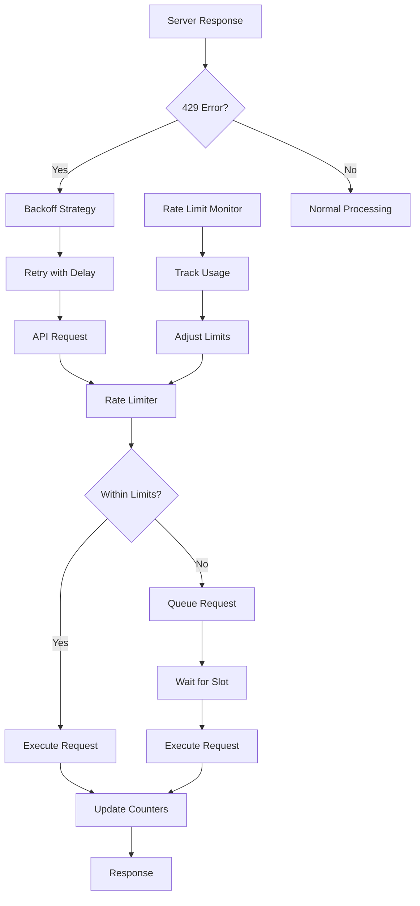

# LN Markets API Rate Limiting

## Summary

Comprehensive rate limiting strategy for LN Markets API integration, including request throttling, burst handling, and adaptive rate control. This document covers the complete rate limiting implementation from client-side throttling to server-side compliance.

## Architecture



## Rate Limiting Strategy

### 1. Client-Side Throttling

**Purpose**: Prevent hitting server rate limits by controlling request frequency locally

```typescript
interface RateLimiterConfig {
  requestsPerSecond: number;
  burstLimit: number;
  windowSize: number;
  maxQueueSize: number;
}

class LNMarketsRateLimiter {
  private config: RateLimiterConfig;
  private requestQueue: Array<() => Promise<any>> = [];
  private lastRequestTime = 0;
  private requestCount = 0;
  private windowStart = Date.now();
  
  constructor(config: RateLimiterConfig) {
    this.config = config;
  }
  
  async execute<T>(request: () => Promise<T>): Promise<T> {
    return new Promise((resolve, reject) => {
      const wrappedRequest = async () => {
        try {
          const result = await request();
          resolve(result);
        } catch (error) {
          reject(error);
        }
      };
      
      this.requestQueue.push(wrappedRequest);
      this.processQueue();
    });
  }
  
  private async processQueue(): Promise<void> {
    if (this.requestQueue.length === 0) return;
    
    const now = Date.now();
    const timeSinceLastRequest = now - this.lastRequestTime;
    const minInterval = 1000 / this.config.requestsPerSecond;
    
    if (timeSinceLastRequest >= minInterval) {
      const request = this.requestQueue.shift();
      if (request) {
        this.lastRequestTime = now;
        this.requestCount++;
        await request();
        this.processQueue();
      }
    } else {
      const delay = minInterval - timeSinceLastRequest;
      setTimeout(() => this.processQueue(), delay);
    }
  }
}
```

### 2. Token Bucket Algorithm

**Purpose**: Allow burst requests while maintaining average rate limits

```typescript
class TokenBucket {
  private tokens: number;
  private lastRefill: number;
  private capacity: number;
  private refillRate: number;
  
  constructor(capacity: number, refillRate: number) {
    this.capacity = capacity;
    this.refillRate = refillRate;
    this.tokens = capacity;
    this.lastRefill = Date.now();
  }
  
  tryConsume(tokens: number = 1): boolean {
    this.refill();
    
    if (this.tokens >= tokens) {
      this.tokens -= tokens;
      return true;
    }
    
    return false;
  }
  
  private refill(): void {
    const now = Date.now();
    const timePassed = (now - this.lastRefill) / 1000;
    const tokensToAdd = timePassed * this.refillRate;
    
    this.tokens = Math.min(this.capacity, this.tokens + tokensToAdd);
    this.lastRefill = now;
  }
  
  getTokens(): number {
    this.refill();
    return this.tokens;
  }
}
```

### 3. Sliding Window Rate Limiter

**Purpose**: More accurate rate limiting with sliding time windows

```typescript
class SlidingWindowRateLimiter {
  private windowSize: number;
  private maxRequests: number;
  private requests: number[] = [];
  
  constructor(windowSizeMs: number, maxRequests: number) {
    this.windowSize = windowSizeMs;
    this.maxRequests = maxRequests;
  }
  
  isAllowed(): boolean {
    const now = Date.now();
    
    // Remove old requests outside the window
    this.requests = this.requests.filter(
      timestamp => now - timestamp < this.windowSize
    );
    
    if (this.requests.length < this.maxRequests) {
      this.requests.push(now);
      return true;
    }
    
    return false;
  }
  
  getWaitTime(): number {
    if (this.requests.length === 0) return 0;
    
    const oldestRequest = Math.min(...this.requests);
    const windowEnd = oldestRequest + this.windowSize;
    const waitTime = windowEnd - Date.now();
    
    return Math.max(0, waitTime);
  }
}
```

## LN Markets Specific Implementation

### Rate Limit Configuration

```typescript
interface LNMarketsRateLimits {
  // Public endpoints (no authentication required)
  public: {
    requestsPerSecond: 10;
    burstLimit: 50;
    windowSize: 60000; // 1 minute
  };
  
  // Authenticated endpoints
  authenticated: {
    requestsPerSecond: 1;
    burstLimit: 5;
    windowSize: 60000; // 1 minute
  };
  
  // High-frequency endpoints (market data)
  marketData: {
    requestsPerSecond: 5;
    burstLimit: 20;
    windowSize: 60000; // 1 minute
  };
}

const rateLimits: LNMarketsRateLimits = {
  public: {
    requestsPerSecond: 10,
    burstLimit: 50,
    windowSize: 60000
  },
  authenticated: {
    requestsPerSecond: 1,
    burstLimit: 5,
    windowSize: 60000
  },
  marketData: {
    requestsPerSecond: 5,
    burstLimit: 20,
    windowSize: 60000
  }
};
```

### Endpoint Classification

```typescript
class EndpointClassifier {
  private static readonly PUBLIC_ENDPOINTS = [
    '/futures/ticker',
    '/futures/btc_usd/ticker',
    '/futures/btc_usd/index',
    '/futures/btc_usd/price',
    '/options/btc_usd/volatility-index',
    '/leaderboard',
    '/options/market'
  ];
  
  private static readonly MARKET_DATA_ENDPOINTS = [
    '/futures/ticker',
    '/futures/btc_usd/ticker',
    '/futures/btc_usd/index',
    '/futures/btc_usd/price',
    '/options/btc_usd/volatility-index'
  ];
  
  static getRateLimitType(endpoint: string): keyof LNMarketsRateLimits {
    if (this.PUBLIC_ENDPOINTS.some(ep => endpoint.includes(ep))) {
      if (this.MARKET_DATA_ENDPOINTS.some(ep => endpoint.includes(ep))) {
        return 'marketData';
      }
      return 'public';
    }
    
    return 'authenticated';
  }
}
```

### Integrated Rate Limiting

```typescript
class LNMarketsClientWithRateLimit {
  private rateLimiters: Map<string, TokenBucket> = new Map();
  private config: LNMarketsConfig;
  
  constructor(config: LNMarketsConfig) {
    this.config = config;
    this.initializeRateLimiters();
  }
  
  private initializeRateLimiters(): void {
    Object.entries(rateLimits).forEach(([type, limits]) => {
      this.rateLimiters.set(type, new TokenBucket(
        limits.burstLimit,
        limits.requestsPerSecond
      ));
    });
  }
  
  async request<T>(config: AxiosRequestConfig): Promise<T> {
    const endpoint = config.url || '';
    const rateLimitType = EndpointClassifier.getRateLimitType(endpoint);
    const rateLimiter = this.rateLimiters.get(rateLimitType);
    
    if (!rateLimiter) {
      throw new Error(`No rate limiter found for type: ${rateLimitType}`);
    }
    
    // Wait for rate limit availability
    await this.waitForRateLimit(rateLimiter);
    
    // Make the actual request
    return this.makeRequest<T>(config);
  }
  
  private async waitForRateLimit(rateLimiter: TokenBucket): Promise<void> {
    while (!rateLimiter.tryConsume()) {
      const waitTime = 1000 / rateLimiter.getTokens();
      await new Promise(resolve => setTimeout(resolve, waitTime));
    }
  }
}
```

## Server Response Handling

### 429 Error Response Analysis

```typescript
interface RateLimitResponse {
  error: string;
  status: number;
  retry_after?: number;
  limit?: number;
  remaining?: number;
  reset_time?: string;
}

class RateLimitHandler {
  async handle429Error(response: AxiosResponse): Promise<void> {
    const data = response.data as RateLimitResponse;
    const retryAfter = data.retry_after || 60; // Default 60 seconds
    
    this.logger.warn('Rate limit exceeded', {
      retryAfter,
      limit: data.limit,
      remaining: data.remaining,
      resetTime: data.reset_time
    });
    
    // Wait for the specified time
    await new Promise(resolve => setTimeout(resolve, retryAfter * 1000));
  }
}
```

### Adaptive Rate Limiting

```typescript
class AdaptiveRateLimiter {
  private baseRate: number;
  private currentRate: number;
  private lastAdjustment: number;
  private consecutive429s: number = 0;
  
  constructor(baseRate: number) {
    this.baseRate = baseRate;
    this.currentRate = baseRate;
    this.lastAdjustment = Date.now();
  }
  
  on429Error(): void {
    this.consecutive429s++;
    
    // Reduce rate by 50% after 3 consecutive 429s
    if (this.consecutive429s >= 3) {
      this.currentRate = Math.max(0.1, this.currentRate * 0.5);
      this.lastAdjustment = Date.now();
      this.consecutive429s = 0;
    }
  }
  
  onSuccess(): void {
    this.consecutive429s = 0;
    
    // Gradually increase rate back to base rate
    const timeSinceAdjustment = Date.now() - this.lastAdjustment;
    if (timeSinceAdjustment > 300000) { // 5 minutes
      this.currentRate = Math.min(this.baseRate, this.currentRate * 1.1);
      this.lastAdjustment = Date.now();
    }
  }
  
  getCurrentRate(): number {
    return this.currentRate;
  }
}
```

## Performance Optimization

### Request Batching

```typescript
class RequestBatcher {
  private batchSize: number;
  private batchTimeout: number;
  private pendingRequests: Array<{
    request: () => Promise<any>;
    resolve: (value: any) => void;
    reject: (error: any) => void;
  }> = [];
  
  constructor(batchSize: number = 10, batchTimeout: number = 1000) {
    this.batchSize = batchSize;
    this.batchTimeout = batchTimeout;
  }
  
  async addRequest<T>(request: () => Promise<T>): Promise<T> {
    return new Promise((resolve, reject) => {
      this.pendingRequests.push({ request, resolve, reject });
      
      if (this.pendingRequests.length >= this.batchSize) {
        this.processBatch();
      } else if (this.pendingRequests.length === 1) {
        setTimeout(() => this.processBatch(), this.batchTimeout);
      }
    });
  }
  
  private async processBatch(): Promise<void> {
    const batch = this.pendingRequests.splice(0, this.batchSize);
    
    try {
      const results = await Promise.all(
        batch.map(item => item.request())
      );
      
      results.forEach((result, index) => {
        batch[index].resolve(result);
      });
    } catch (error) {
      batch.forEach(item => item.reject(error));
    }
  }
}
```

### Connection Pooling

```typescript
class ConnectionPool {
  private connections: AxiosInstance[] = [];
  private availableConnections: AxiosInstance[] = [];
  private maxConnections: number;
  
  constructor(maxConnections: number = 5) {
    this.maxConnections = maxConnections;
    this.initializeConnections();
  }
  
  private initializeConnections(): void {
    for (let i = 0; i < this.maxConnections; i++) {
      const connection = axios.create({
        timeout: 30000,
        headers: {
          'User-Agent': 'Axisor-LNMarkets-Client/2.0'
        }
      });
      
      this.connections.push(connection);
      this.availableConnections.push(connection);
    }
  }
  
  async getConnection(): Promise<AxiosInstance> {
    if (this.availableConnections.length > 0) {
      return this.availableConnections.pop()!;
    }
    
    // Wait for a connection to become available
    return new Promise((resolve) => {
      const checkForConnection = () => {
        if (this.availableConnections.length > 0) {
          resolve(this.availableConnections.pop()!);
        } else {
          setTimeout(checkForConnection, 10);
        }
      };
      checkForConnection();
    });
  }
  
  releaseConnection(connection: AxiosInstance): void {
    this.availableConnections.push(connection);
  }
}
```

## Monitoring and Metrics

### Rate Limit Metrics

```typescript
interface RateLimitMetrics {
  totalRequests: number;
  rateLimitedRequests: number;
  averageResponseTime: number;
  currentRate: number;
  tokensAvailable: number;
  queueSize: number;
}

class RateLimitMonitor {
  private metrics: RateLimitMetrics = {
    totalRequests: 0,
    rateLimitedRequests: 0,
    averageResponseTime: 0,
    currentRate: 0,
    tokensAvailable: 0,
    queueSize: 0
  };
  
  recordRequest(duration: number, wasRateLimited: boolean): void {
    this.metrics.totalRequests++;
    if (wasRateLimited) {
      this.metrics.rateLimitedRequests++;
    }
    
    // Update average response time
    this.metrics.averageResponseTime = 
      (this.metrics.averageResponseTime * (this.metrics.totalRequests - 1) + duration) / 
      this.metrics.totalRequests;
  }
  
  updateRateLimiterState(rateLimiter: TokenBucket): void {
    this.metrics.tokensAvailable = rateLimiter.getTokens();
  }
  
  getMetrics(): RateLimitMetrics {
    return { ...this.metrics };
  }
  
  getRateLimitEfficiency(): number {
    if (this.metrics.totalRequests === 0) return 0;
    return (this.metrics.totalRequests - this.metrics.rateLimitedRequests) / 
           this.metrics.totalRequests;
  }
}
```

### Prometheus Metrics

```typescript
import { register, Counter, Histogram, Gauge } from 'prom-client';

const rateLimitMetrics = {
  requestsTotal: new Counter({
    name: 'lnmarkets_requests_total',
    help: 'Total number of LN Markets API requests',
    labelNames: ['endpoint', 'status']
  }),
  
  requestDuration: new Histogram({
    name: 'lnmarkets_request_duration_seconds',
    help: 'Duration of LN Markets API requests',
    labelNames: ['endpoint', 'status']
  }),
  
  rateLimitHits: new Counter({
    name: 'lnmarkets_rate_limit_hits_total',
    help: 'Total number of rate limit hits',
    labelNames: ['endpoint', 'type']
  }),
  
  tokensAvailable: new Gauge({
    name: 'lnmarkets_tokens_available',
    help: 'Number of available rate limit tokens',
    labelNames: ['type']
  })
};

// Register metrics
register.registerMetric(rateLimitMetrics.requestsTotal);
register.registerMetric(rateLimitMetrics.requestDuration);
register.registerMetric(rateLimitMetrics.rateLimitHits);
register.registerMetric(rateLimitMetrics.tokensAvailable);
```

## Configuration Management

### Environment-Based Configuration

```typescript
interface RateLimitConfig {
  development: LNMarketsRateLimits;
  staging: LNMarketsRateLimits;
  production: LNMarketsRateLimits;
}

const rateLimitConfigs: RateLimitConfig = {
  development: {
    public: { requestsPerSecond: 20, burstLimit: 100, windowSize: 60000 },
    authenticated: { requestsPerSecond: 5, burstLimit: 20, windowSize: 60000 },
    marketData: { requestsPerSecond: 10, burstLimit: 50, windowSize: 60000 }
  },
  staging: {
    public: { requestsPerSecond: 15, burstLimit: 75, windowSize: 60000 },
    authenticated: { requestsPerSecond: 3, burstLimit: 15, windowSize: 60000 },
    marketData: { requestsPerSecond: 8, burstLimit: 40, windowSize: 60000 }
  },
  production: {
    public: { requestsPerSecond: 10, burstLimit: 50, windowSize: 60000 },
    authenticated: { requestsPerSecond: 1, burstLimit: 5, windowSize: 60000 },
    marketData: { requestsPerSecond: 5, burstLimit: 20, windowSize: 60000 }
  }
};

function getRateLimitConfig(): LNMarketsRateLimits {
  const env = process.env.NODE_ENV || 'development';
  return rateLimitConfigs[env as keyof RateLimitConfig];
}
```

### Dynamic Configuration Updates

```typescript
class DynamicRateLimitConfig {
  private config: LNMarketsRateLimits;
  private updateListeners: Array<(config: LNMarketsRateLimits) => void> = [];
  
  constructor() {
    this.config = getRateLimitConfig();
    this.loadFromEnvironment();
  }
  
  private loadFromEnvironment(): void {
    // Load configuration from environment variables
    if (process.env.LNMARKETS_RATE_LIMIT_PUBLIC) {
      this.config.public.requestsPerSecond = parseInt(process.env.LNMARKETS_RATE_LIMIT_PUBLIC);
    }
    
    if (process.env.LNMARKETS_RATE_LIMIT_AUTHENTICATED) {
      this.config.authenticated.requestsPerSecond = parseInt(process.env.LNMARKETS_RATE_LIMIT_AUTHENTICATED);
    }
  }
  
  updateConfig(newConfig: Partial<LNMarketsRateLimits>): void {
    this.config = { ...this.config, ...newConfig };
    this.notifyListeners();
  }
  
  addUpdateListener(listener: (config: LNMarketsRateLimits) => void): void {
    this.updateListeners.push(listener);
  }
  
  private notifyListeners(): void {
    this.updateListeners.forEach(listener => listener(this.config));
  }
  
  getConfig(): LNMarketsRateLimits {
    return { ...this.config };
  }
}
```

## Troubleshooting Guide

### Common Rate Limiting Issues

#### 1. Frequent 429 Errors

**Symptoms:**
- Regular "Too Many Requests" errors
- Requests failing after successful periods

**Diagnosis:**
```typescript
// Check current rate limiting configuration
const metrics = rateLimitMonitor.getMetrics();
console.log('Rate limit efficiency:', metrics.rateLimitEfficiency);
console.log('Current rate:', metrics.currentRate);
```

**Solutions:**
- Reduce request frequency
- Implement proper queuing
- Use request batching
- Add exponential backoff

#### 2. Slow Response Times

**Symptoms:**
- High average response times
- Requests taking longer than expected

**Diagnosis:**
```typescript
// Check response time metrics
const metrics = rateLimitMonitor.getMetrics();
console.log('Average response time:', metrics.averageResponseTime);
```

**Solutions:**
- Optimize request batching
- Use connection pooling
- Implement parallel requests where possible
- Cache frequently accessed data

#### 3. Queue Overflow

**Symptoms:**
- Requests being dropped
- Memory usage increasing

**Diagnosis:**
```typescript
// Check queue size
const metrics = rateLimitMonitor.getMetrics();
console.log('Queue size:', metrics.queueSize);
```

**Solutions:**
- Increase queue capacity
- Implement request prioritization
- Add circuit breaker for protection
- Monitor memory usage

### Debug Commands

```bash
# Check rate limiting status
curl -H "Authorization: Bearer $TOKEN" \
     https://api.lnmarkets.com/v2/user/rate-limits

# Monitor request frequency
watch -n 1 'curl -s https://api.lnmarkets.com/v2/futures/ticker | jq .'

# Test rate limiting
for i in {1..20}; do
  curl -H "Authorization: Bearer $TOKEN" \
       https://api.lnmarkets.com/v2/user
  sleep 0.1
done
```

## Best Practices

### 1. Rate Limiting Strategy

- **Start Conservative**: Begin with lower rates and increase gradually
- **Monitor Continuously**: Track rate limit efficiency and adjust as needed
- **Handle Bursts**: Use token bucket for burst request handling
- **Respect Server Limits**: Always stay within LN Markets rate limits

### 2. Performance Optimization

- **Batch Requests**: Group multiple requests when possible
- **Use Connection Pooling**: Reuse HTTP connections
- **Implement Caching**: Reduce API calls for static data
- **Parallel Processing**: Execute independent requests concurrently

### 3. Error Handling

- **Graceful Degradation**: Continue operation when rate limited
- **User Communication**: Inform users about rate limiting
- **Automatic Recovery**: Implement backoff strategies
- **Monitoring**: Alert on rate limit violations

## How to Use This Document

- **For Developers**: Reference rate limiting implementation when making API calls
- **For Operations**: Use monitoring sections for system health and performance
- **For Troubleshooting**: Follow the troubleshooting guide for common rate limiting issues
- **For Configuration**: Use the configuration management sections for environment setup

