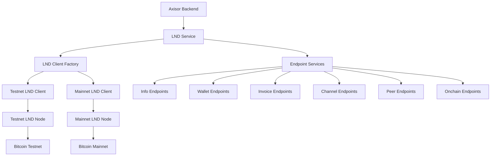

# LND (Lightning Network Daemon) Setup Guide

## Summary

Complete setup guide for LND (Lightning Network Daemon) integration with Axisor, covering installation, configuration, security, and connection management for both testnet and mainnet environments.

## Architecture



## Prerequisites

### System Requirements

- **OS**: Linux (Ubuntu 20.04+), macOS, or Windows
- **RAM**: Minimum 4GB, Recommended 8GB+
- **Storage**: Minimum 100GB SSD
- **CPU**: 2+ cores
- **Network**: Stable internet connection

### Software Dependencies

- **Go**: Version 1.19+ (for building from source)
- **Bitcoin Core**: Version 0.21.0+ (for full node)
- **Docker**: Optional, for containerized setup
- **Git**: For cloning repositories

## Installation Methods

### Method 1: Docker Installation (Recommended)

#### Docker Compose Setup

```yaml
# docker-compose.lnd.yml
version: '3.8'

services:
  lnd:
    image: lightninglabs/lnd:v0.17.4-beta
    container_name: lnd
    restart: unless-stopped
    ports:
      - "10009:10009"  # gRPC port
      - "8080:8080"    # REST port
      - "9735:9735"    # P2P port
    volumes:
      - lnd_data:/root/.lnd
      - ./lnd.conf:/root/.lnd/lnd.conf:ro
      - ./tls.cert:/root/.lnd/tls.cert:ro
      - ./admin.macaroon:/root/.lnd/admin.macaroon:ro
    environment:
      - LND_NETWORK=testnet
    networks:
      - lightning

  bitcoin:
    image: ruimarinho/bitcoin-core:24.0
    container_name: bitcoin
    restart: unless-stopped
    ports:
      - "18332:18332"  # Testnet RPC
      - "18333:18333"  # Testnet P2P
    volumes:
      - bitcoin_data:/home/bitcoin/.bitcoin
      - ./bitcoin.conf:/home/bitcoin/.bitcoin/bitcoin.conf:ro
    environment:
      - BITCOIN_NETWORK=testnet
    networks:
      - lightning

volumes:
  lnd_data:
  bitcoin_data:

networks:
  lightning:
    driver: bridge
```

#### Configuration Files

**lnd.conf**:
```ini
# LND Configuration
[Application Options]
debuglevel=info
maxpendingchannels=10
alias=Axisor-LND-Node
color=#68F0AE
listen=0.0.0.0:9735
rpclisten=0.0.0.0:10009
restlisten=0.0.0.0:8080

# Bitcoin Configuration
[bitcoin]
bitcoin.active=1
bitcoin.testnet=1
bitcoin.node=bitcoind

# Bitcoind Configuration
[bitcoind]
bitcoind.rpchost=bitcoin:18332
bitcoind.rpcuser=bitcoin
bitcoind.rpcpass=bitcoin
bitcoind.zmqpubrawblock=tcp://bitcoin:28332
bitcoind.zmqpubrawtx=tcp://bitcoin:28333

# Database Configuration
[db]
db.backend=bolt

# Logging Configuration
[logging]
log.format=json
```

**bitcoin.conf**:
```ini
# Bitcoin Core Configuration
server=1
rpcuser=bitcoin
rpcpassword=bitcoin
rpcbind=0.0.0.0:18332
rpcallowip=0.0.0.0/0
testnet=1
txindex=1
zmqpubrawblock=tcp://0.0.0.0:28332
zmqpubrawtx=tcp://0.0.0.0:28333
```

### Method 2: Source Installation

#### Install Dependencies

```bash
# Ubuntu/Debian
sudo apt update
sudo apt install -y build-essential git curl

# Install Go
wget https://go.dev/dl/go1.21.5.linux-amd64.tar.gz
sudo tar -C /usr/local -xzf go1.21.5.linux-amd64.tar.gz
export PATH=$PATH:/usr/local/go/bin

# Install Bitcoin Core
sudo apt install -y bitcoin-core
```

#### Build and Install LND

```bash
# Clone LND repository
git clone https://github.com/lightningnetwork/lnd.git
cd lnd

# Build LND
make install

# Verify installation
lnd --version
```

## Configuration

### Environment-Specific Configuration

#### Testnet Configuration

```typescript
// backend/src/config/lnd.testnet.ts
export const testnetConfig = {
  network: 'testnet' as const,
  baseURL: 'https://localhost:8080',
  credentials: {
    macaroon: process.env.LND_TESTNET_MACAROON,
    tlsCert: process.env.LND_TESTNET_TLS_CERT
  },
  timeout: 30000,
  retryAttempts: 3,
  retryDelay: 1000
};
```

#### Mainnet Configuration

```typescript
// backend/src/config/lnd.mainnet.ts
export const mainnetConfig = {
  network: 'mainnet' as const,
  baseURL: 'https://your-lnd-node:8080',
  credentials: {
    macaroon: process.env.LND_MAINNET_MACAROON,
    tlsCert: process.env.LND_MAINNET_TLS_CERT
  },
  timeout: 30000,
  retryAttempts: 3,
  retryDelay: 1000
};
```

### Security Configuration

#### TLS Certificate Setup

```bash
# Generate TLS certificate (done automatically by LND)
# Certificate will be created at: ~/.lnd/tls.cert

# Copy certificate for application use
cp ~/.lnd/tls.cert ./lnd-tls.cert

# Convert to base64 for environment variable
base64 -w 0 lnd-tls.cert > lnd-tls.cert.base64
```

#### Macaroon Authentication

```bash
# List available macaroons
ls ~/.lnd/data/chain/bitcoin/testnet/

# Copy admin macaroon for application use
cp ~/.lnd/data/chain/bitcoin/testnet/admin.macaroon ./admin.macaroon

# Convert to base64 for environment variable
base64 -w 0 admin.macaroon > admin.macaroon.base64
```

#### Environment Variables

```bash
# .env file
LND_TESTNET_BASE_URL=https://localhost:8080
LND_TESTNET_TLS_CERT="LS0tLS1CRUdJTi..."
LND_TESTNET_MACAROON="AgEDbG5kMAoE..."

LND_MAINNET_BASE_URL=https://your-lnd-node:8080
LND_MAINNET_TLS_CERT="LS0tLS1CRUdJTi..."
LND_MAINNET_MACAROON="AgEDbG5kMAoE..."
```

## LND Service Integration

### Service Initialization

```typescript
// backend/src/services/lnd/LNDService.ts
import { LNDService } from './LNDService';
import { testnetConfig, mainnetConfig } from '../../config/lnd';

class LNDManager {
  private testnetService: LNDService;
  private mainnetService: LNDService;
  private currentNetwork: 'testnet' | 'mainnet' = 'testnet';

  constructor() {
    // Initialize testnet service
    this.testnetService = new LNDService(testnetConfig, logger);
    
    // Initialize mainnet service (if configured)
    if (process.env.NODE_ENV === 'production') {
      this.mainnetService = new LNDService(mainnetConfig, logger);
    }
  }

  getCurrentService(): LNDService {
    return this.currentNetwork === 'testnet' 
      ? this.testnetService 
      : this.mainnetService;
  }

  switchNetwork(network: 'testnet' | 'mainnet'): void {
    this.currentNetwork = network;
    logger.info(`Switched to ${network} network`);
  }

  async healthCheck(): Promise<boolean> {
    try {
      const service = this.getCurrentService();
      return await service.isHealthy();
    } catch (error) {
      logger.error('LND health check failed:', error);
      return false;
    }
  }
}

export const lndManager = new LNDManager();
```

### Endpoint Usage Examples

#### Info Endpoints

```typescript
// Get node information
const info = await lndManager.getCurrentService().info.getInfo();
console.log('Node ID:', info.identity_pubkey);
console.log('Version:', info.version);

// Get network information
const networkInfo = await lndManager.getCurrentService().info.getNetworkInfo();
console.log('Network:', networkInfo.network);
console.log('Node count:', networkInfo.num_nodes);
```

#### Wallet Endpoints

```typescript
// Get wallet balance
const balance = await lndManager.getCurrentService().wallet.getTotalBalance();
console.log('Total balance:', balance.total_balance);
console.log('Confirmed balance:', balance.confirmed_balance);
console.log('Unconfirmed balance:', balance.unconfirmed_balance);

// Get on-chain balance
const onchainBalance = await lndManager.getCurrentService().wallet.getOnchainBalance();
console.log('On-chain balance:', onchainBalance.total_balance);

// Get channel balance
const channelBalance = await lndManager.getCurrentService().wallet.getChannelBalance();
console.log('Channel balance:', channelBalance.balance);
```

#### Invoice Endpoints

```typescript
// Create invoice
const invoice = await lndManager.getCurrentService().invoice.createInvoice({
  value: 1000, // 1000 satoshis
  memo: 'Payment for Axisor subscription',
  expiry: 3600 // 1 hour
});
console.log('Invoice:', invoice.payment_request);

// Decode payment request
const decoded = await lndManager.getCurrentService().invoice.decodePayReq({
  pay_req: invoice.payment_request
});
console.log('Amount:', decoded.num_satoshis);
console.log('Destination:', decoded.destination);
```

## Network Setup

### Testnet Setup

#### 1. Start Bitcoin Testnet Node

```bash
# Start Bitcoin Core in testnet mode
bitcoind -testnet -server -rpcuser=bitcoin -rpcpassword=bitcoin \
  -rpcbind=0.0.0.0 -rpcallowip=0.0.0.0/0 \
  -txindex -zmqpubrawblock=tcp://0.0.0.0:28332 \
  -zmqpubrawtx=tcp://0.0.0.0:28333
```

#### 2. Start LND Node

```bash
# Start LND with testnet configuration
lnd --testnet --bitcoin.active --bitcoin.testnet \
  --bitcoind.rpchost=localhost:18332 \
  --bitcoind.rpcuser=bitcoin \
  --bitcoind.rpcpass=bitcoin \
  --rpclisten=localhost:10009 \
  --restlisten=localhost:8080
```

#### 3. Create Wallet

```bash
# Create new wallet
lncli --testnet create

# Unlock wallet
lncli --testnet unlock
```

#### 4. Get Testnet Bitcoin

```bash
# Get testnet coins from faucet
# Visit: https://testnet-faucet.mempool.co/
# Or use: https://coinfaucet.eu/en/btc-testnet/

# Check balance
lncli --testnet walletbalance
```

### Mainnet Setup

#### 1. Security Considerations

```bash
# Create dedicated user for LND
sudo useradd -m -s /bin/bash lnd
sudo usermod -aG bitcoin lnd

# Set up proper file permissions
sudo chown -R lnd:lnd /home/lnd/.lnd
sudo chmod 600 /home/lnd/.lnd/admin.macaroon
sudo chmod 644 /home/lnd/.lnd/tls.cert
```

#### 2. Firewall Configuration

```bash
# Allow necessary ports
sudo ufw allow 9735/tcp  # P2P port
sudo ufw allow 8080/tcp  # REST API (restrict to your IP)
sudo ufw allow 10009/tcp # gRPC API (restrict to your IP)

# Deny direct access to Bitcoin RPC
sudo ufw deny 8332/tcp
sudo ufw deny 18332/tcp
```

#### 3. SSL/TLS Configuration

```bash
# Use reverse proxy with SSL termination
# Nginx configuration
server {
    listen 443 ssl;
    server_name your-lnd-domain.com;
    
    ssl_certificate /path/to/certificate.crt;
    ssl_certificate_key /path/to/private.key;
    
    location / {
        proxy_pass https://localhost:8080;
        proxy_set_header Host $host;
        proxy_set_header X-Real-IP $remote_addr;
        proxy_set_header X-Forwarded-For $proxy_add_x_forwarded_for;
        proxy_set_header X-Forwarded-Proto $scheme;
    }
}
```

## Monitoring and Maintenance

### Health Monitoring

```typescript
// Health check service
class LNDHealthMonitor {
  async checkNodeHealth(): Promise<HealthStatus> {
    try {
      const service = lndManager.getCurrentService();
      const info = await service.info.getInfo();
      const balance = await service.wallet.getTotalBalance();
      
      return {
        status: 'healthy',
        nodeId: info.identity_pubkey,
        version: info.version,
        balance: balance.total_balance,
        lastChecked: new Date().toISOString()
      };
    } catch (error) {
      return {
        status: 'unhealthy',
        error: error.message,
        lastChecked: new Date().toISOString()
      };
    }
  }

  async checkChannelHealth(): Promise<ChannelStatus[]> {
    try {
      const service = lndManager.getCurrentService();
      const channels = await service.channel.listChannels();
      
      return channels.map(channel => ({
        channelId: channel.chan_id,
        remotePubkey: channel.remote_pubkey,
        capacity: channel.capacity,
        localBalance: channel.local_balance,
        remoteBalance: channel.remote_balance,
        active: channel.active,
        lastUpdate: new Date(channel.last_update).toISOString()
      }));
    } catch (error) {
      logger.error('Channel health check failed:', error);
      return [];
    }
  }
}
```

### Backup Strategy

```bash
#!/bin/bash
# backup-lnd.sh

# Create backup directory
BACKUP_DIR="/backup/lnd/$(date +%Y%m%d)"
mkdir -p "$BACKUP_DIR"

# Backup LND data
cp -r ~/.lnd/data "$BACKUP_DIR/"

# Backup configuration
cp ~/.lnd/lnd.conf "$BACKUP_DIR/"

# Backup TLS certificate
cp ~/.lnd/tls.cert "$BACKUP_DIR/"

# Backup macaroons
cp ~/.lnd/data/chain/bitcoin/*/admin.macaroon "$BACKUP_DIR/"

# Compress backup
tar -czf "$BACKUP_DIR/lnd-backup-$(date +%Y%m%d-%H%M%S).tar.gz" -C "$BACKUP_DIR" .

# Upload to cloud storage (optional)
# aws s3 cp "$BACKUP_DIR/lnd-backup-*.tar.gz" s3://your-backup-bucket/

echo "Backup completed: $BACKUP_DIR"
```

### Log Management

```bash
# Configure log rotation
sudo tee /etc/logrotate.d/lnd << EOF
/home/lnd/.lnd/logs/bitcoin/testnet/*.log {
    daily
    missingok
    rotate 30
    compress
    delaycompress
    notifempty
    create 644 lnd lnd
}
EOF

# Set up log monitoring
sudo tee /etc/rsyslog.d/50-lnd.conf << EOF
# LND log forwarding
:programname, isequal, "lnd" /var/log/lnd.log
& stop
EOF
```

## Troubleshooting

### Common Issues

#### 1. Connection Failures

**Symptoms**: Cannot connect to LND node
**Solutions**:
```bash
# Check if LND is running
ps aux | grep lnd

# Check port accessibility
netstat -tlnp | grep :8080

# Test connection
curl -k https://localhost:8080/v1/getinfo
```

#### 2. Authentication Errors

**Symptoms**: 401 Unauthorized errors
**Solutions**:
```bash
# Verify macaroon file
ls -la ~/.lnd/data/chain/bitcoin/testnet/admin.macaroon

# Test authentication
lncli --testnet getinfo
```

#### 3. Wallet Issues

**Symptoms**: Cannot create invoices or make payments
**Solutions**:
```bash
# Check wallet status
lncli --testnet walletbalance

# Check if wallet is unlocked
lncli --testnet getinfo | grep -i "unlocked"

# Unlock wallet if needed
lncli --testnet unlock
```

#### 4. Channel Issues

**Symptoms**: Channels not opening or closing
**Solutions**:
```bash
# List channels
lncli --testnet listchannels

# Check pending channels
lncli --testnet pendingchannels

# Close problematic channel
lncli --testnet closechannel --channel_point=<txid>:<output_index>
```

### Debug Commands

```bash
# Enable debug logging
lnd --debuglevel=debug

# Check Bitcoin connection
lncli --testnet getinfo | grep -i bitcoin

# Monitor logs in real-time
tail -f ~/.lnd/logs/bitcoin/testnet/lnd.log

# Check network connectivity
lncli --testnet describegraph
```

## Security Best Practices

### 1. Network Security

- Use VPN or private networks for LND access
- Restrict API access to specific IP addresses
- Use SSL/TLS termination at reverse proxy level
- Regularly update LND and Bitcoin Core

### 2. Key Management

- Backup seed phrase securely (offline storage)
- Use hardware wallets for mainnet operations
- Rotate macaroons regularly
- Monitor for unauthorized access

### 3. Operational Security

- Run LND as non-root user
- Use proper file permissions (600 for macaroons)
- Monitor logs for suspicious activity
- Implement rate limiting on API endpoints

## Performance Optimization

### 1. Database Optimization

```ini
# lnd.conf optimizations
[db]
db.backend=bolt
db.bolt.auto-compact=true
db.bolt.auto-compact-min-age=168h
```

### 2. Memory Optimization

```ini
# Memory settings
[Application Options]
maxpendingchannels=10
maxchansize=16777216
```

### 3. Network Optimization

```ini
# Network settings
[Application Options]
nat=true
externalhosts=your-domain.com
```

## How to Use This Document

- **For Setup**: Follow installation methods for your environment
- **For Configuration**: Use environment-specific configuration examples
- **For Integration**: Reference LND service integration patterns
- **For Troubleshooting**: Use common issues and debug commands sections
- **For Security**: Follow security best practices for production deployments

