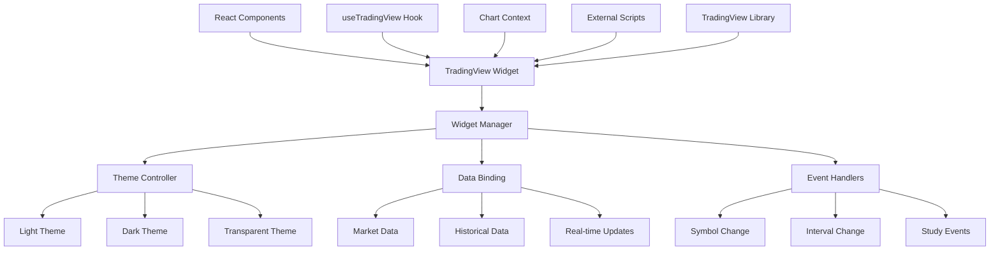

# TradingView Chart Integration

## Summary

Comprehensive integration guide for TradingView chart widgets within the Axisor platform, covering widget configuration, theme management, data binding, and advanced chart features. This document provides complete implementation patterns for embedding TradingView charts in React components.

## Architecture



## Widget Configuration

### Basic Widget Setup

```typescript
// TradingView widget configuration interface
interface TradingViewWidgetConfig {
  container_id: string;
  width: number | string;
  height: number | string;
  symbol: string;
  interval: string;
  timezone: string;
  locale: string;
  theme: 'light' | 'dark';
  style: '0' | '1' | '2' | '3';
  toolbar_bg?: string;
  enable_publishing: boolean;
  allow_symbol_change: boolean;
  details: boolean;
  hotlist: boolean;
  calendar: boolean;
  hide_side_toolbar: boolean;
  hide_top_toolbar: boolean;
  hide_legend: boolean;
  studies: string[];
  show_popup_button: boolean;
  popup_width: string;
  popup_height: string;
  support_host: string;
}

// Widget manager class
class TradingViewWidgetManager {
  private widgets = new Map<string, any>();
  private scriptLoaded = false;
  private scriptPromise: Promise<void> | null = null;

  constructor() {
    this.loadTradingViewScript();
  }

  private loadTradingViewScript(): Promise<void> {
    if (this.scriptPromise) {
      return this.scriptPromise;
    }

    this.scriptPromise = new Promise((resolve, reject) => {
      if (typeof window !== 'undefined' && window.TradingView) {
        this.scriptLoaded = true;
        resolve();
        return;
      }

      const script = document.createElement('script');
      script.type = 'text/javascript';
      script.src = 'https://s3.tradingview.com/tv.js';
      script.async = true;
      
      script.onload = () => {
        this.scriptLoaded = true;
        resolve();
      };
      
      script.onerror = () => {
        reject(new Error('Failed to load TradingView script'));
      };

      document.head.appendChild(script);
    });

    return this.scriptPromise;
  }

  async createWidget(config: TradingViewWidgetConfig): Promise<any> {
    await this.loadTradingViewScript();

    if (!window.TradingView) {
      throw new Error('TradingView library not available');
    }

    const widget = new window.TradingView.widget(config);
    this.widgets.set(config.container_id, widget);

    return widget;
  }

  updateWidget(containerId: string, updates: Partial<TradingViewWidgetConfig>): void {
    const widget = this.widgets.get(containerId);
    if (widget) {
      widget.chart().setSymbol(updates.symbol);
      if (updates.interval) {
        widget.chart().setResolution(updates.interval);
      }
      if (updates.theme) {
        widget.chart().setTheme(updates.theme);
      }
    }
  }

  destroyWidget(containerId: string): void {
    const widget = this.widgets.get(containerId);
    if (widget) {
      widget.remove();
      this.widgets.delete(containerId);
    }
  }

  getWidget(containerId: string): any {
    return this.widgets.get(containerId);
  }
}

// Global widget manager instance
export const tradingViewManager = new TradingViewWidgetManager();
```

### Theme Management

```typescript
// Theme configuration for different modes
interface ThemeConfig {
  light: TradingViewTheme;
  dark: TradingViewTheme;
  transparent: TradingViewTheme;
}

interface TradingViewTheme {
  colorTheme: 'light' | 'dark';
  background: {
    type: 'solid' | 'gradient';
    color: string;
  };
  grid: {
    vertLines: {
      color: string;
      style: number;
      visible: boolean;
    };
    horzLines: {
      color: string;
      style: number;
      visible: boolean;
    };
  };
  crosshair: {
    mode: number;
    color: string;
  };
  priceScale: {
    borderColor: string;
    scaleMargins: {
      top: number;
      bottom: number;
    };
  };
  timeScale: {
    borderColor: string;
    timeVisible: boolean;
    secondsVisible: boolean;
  };
}

const themeConfigs: ThemeConfig = {
  light: {
    colorTheme: 'light',
    background: {
      type: 'solid',
      color: '#ffffff'
    },
    grid: {
      vertLines: {
        color: '#e1e3e6',
        style: 0,
        visible: true
      },
      horzLines: {
        color: '#e1e3e6',
        style: 0,
        visible: true
      }
    },
    crosshair: {
      mode: 0,
      color: '#758696'
    },
    priceScale: {
      borderColor: '#cccccc',
      scaleMargins: {
        top: 0.1,
        bottom: 0.1
      }
    },
    timeScale: {
      borderColor: '#cccccc',
      timeVisible: true,
      secondsVisible: false
    }
  },
  dark: {
    colorTheme: 'dark',
    background: {
      type: 'solid',
      color: '#1e1e1e'
    },
    grid: {
      vertLines: {
        color: '#2a2e39',
        style: 0,
        visible: true
      },
      horzLines: {
        color: '#2a2e39',
        style: 0,
        visible: true
      }
    },
    crosshair: {
      mode: 0,
      color: '#758696'
    },
    priceScale: {
      borderColor: '#2a2e39',
      scaleMargins: {
        top: 0.1,
        bottom: 0.1
      }
    },
    timeScale: {
      borderColor: '#2a2e39',
      timeVisible: true,
      secondsVisible: false
    }
  },
  transparent: {
    colorTheme: 'dark',
    background: {
      type: 'solid',
      color: 'transparent'
    },
    grid: {
      vertLines: {
        color: 'rgba(255, 255, 255, 0.1)',
        style: 0,
        visible: true
      },
      horzLines: {
        color: 'rgba(255, 255, 255, 0.1)',
        style: 0,
        visible: true
      }
    },
    crosshair: {
      mode: 0,
      color: 'rgba(255, 255, 255, 0.5)'
    },
    priceScale: {
      borderColor: 'transparent',
      scaleMargins: {
        top: 0.1,
        bottom: 0.1
      }
    },
    timeScale: {
      borderColor: 'transparent',
      timeVisible: true,
      secondsVisible: false
    }
  }
};

// Theme manager
class TradingViewThemeManager {
  private currentTheme: keyof ThemeConfig = 'dark';

  getTheme(themeName: keyof ThemeConfig): TradingViewTheme {
    return themeConfigs[themeName];
  }

  setTheme(themeName: keyof ThemeConfig): void {
    this.currentTheme = themeName;
  }

  getCurrentTheme(): TradingViewTheme {
    return themeConfigs[this.currentTheme];
  }

  applyThemeToWidget(widget: any, themeName: keyof ThemeConfig): void {
    const theme = this.getTheme(themeName);
    widget.chart().setTheme(theme);
  }
}

export const themeManager = new TradingViewThemeManager();
```

## React Integration

### TradingView Chart Component

```typescript
// TradingView chart component
interface TradingViewChartProps {
  symbol?: string;
  interval?: string;
  height?: number;
  width?: number | string;
  theme?: 'light' | 'dark' | 'transparent';
  showToolbar?: boolean;
  showLegend?: boolean;
  studies?: string[];
  className?: string;
  onSymbolChange?: (symbol: string) => void;
  onIntervalChange?: (interval: string) => void;
  onStudyEvent?: (event: any) => void;
}

const TradingViewChart: React.FC<TradingViewChartProps> = ({
  symbol = 'BINANCE:BTCUSDT',
  interval = '60',
  height = 500,
  width = '100%',
  theme = 'dark',
  showToolbar = true,
  showLegend = true,
  studies = [],
  className = '',
  onSymbolChange,
  onIntervalChange,
  onStudyEvent
}) => {
  const containerRef = useRef<HTMLDivElement>(null);
  const widgetRef = useRef<any>(null);
  const [isLoading, setIsLoading] = useState(true);
  const [error, setError] = useState<string | null>(null);

  // Generate unique container ID
  const containerId = useMemo(() => 
    `tradingview_${symbol.replace(/[^a-zA-Z0-9]/g, '_')}_${Date.now()}`, 
    [symbol]
  );

  // Initialize widget
  useEffect(() => {
    const initializeWidget = async () => {
      if (!containerRef.current) return;

      try {
        setIsLoading(true);
        setError(null);

        // Clear container
        containerRef.current.innerHTML = '';

        const config: TradingViewWidgetConfig = {
          container_id: containerId,
          width,
          height,
          symbol,
          interval,
          timezone: 'Etc/UTC',
          locale: 'en',
          theme: theme === 'transparent' ? 'dark' : theme,
          style: '1',
          enable_publishing: false,
          allow_symbol_change: !!onSymbolChange,
          details: true,
          hotlist: true,
          calendar: true,
          hide_side_toolbar: !showToolbar,
          hide_top_toolbar: !showToolbar,
          hide_legend: !showLegend,
          studies,
          show_popup_button: true,
          popup_width: '1000',
          popup_height: '650',
          support_host: 'https://www.tradingview.com'
        };

        // Apply transparent theme if needed
        if (theme === 'transparent') {
          Object.assign(config, themeManager.getTheme('transparent'));
        }

        const widget = await tradingViewManager.createWidget(config);
        widgetRef.current = widget;

        // Set up event listeners
        if (onSymbolChange) {
          widget.chart().onSymbolChanged().subscribe(null, (symbolData: any) => {
            onSymbolChange(symbolData.symbol);
          });
        }

        if (onIntervalChange) {
          widget.chart().onIntervalChanged().subscribe(null, (interval: string) => {
            onIntervalChange(interval);
          });
        }

        if (onStudyEvent) {
          widget.chart().onStudyEvent().subscribe(null, onStudyEvent);
        }

        setIsLoading(false);
      } catch (err) {
        console.error('TradingView widget initialization failed:', err);
        setError(err instanceof Error ? err.message : 'Failed to initialize chart');
        setIsLoading(false);
      }
    };

    initializeWidget();

    // Cleanup
    return () => {
      if (widgetRef.current) {
        tradingViewManager.destroyWidget(containerId);
      }
    };
  }, [symbol, interval, height, width, theme, showToolbar, showLegend, studies]);

  // Update widget when props change
  useEffect(() => {
    if (widgetRef.current) {
      tradingViewManager.updateWidget(containerId, {
        symbol,
        interval,
        theme: theme === 'transparent' ? 'dark' : theme
      });
    }
  }, [symbol, interval, theme]);

  if (error) {
    return (
      <div className={`tradingview-error ${className}`} style={{ width, height }}>
        <div className="error-content">
          <h3>Chart Error</h3>
          <p>{error}</p>
          <button onClick={() => window.location.reload()}>
            Reload Page
          </button>
        </div>
      </div>
    );
  }

  return (
    <div className={`tradingview-container ${className}`} style={{ width, height }}>
      {isLoading && (
        <div className="tradingview-loading">
          <div className="loading-spinner" />
          <p>Loading chart...</p>
        </div>
      )}
      <div 
        ref={containerRef}
        id={containerId}
        style={{ 
          width: '100%', 
          height: '100%',
          opacity: isLoading ? 0 : 1,
          transition: 'opacity 0.3s ease'
        }}
      />
    </div>
  );
};

export default TradingViewChart;
```

### Custom Hook for TradingView

```typescript
// Custom hook for TradingView integration
interface UseTradingViewOptions {
  symbol?: string;
  interval?: string;
  theme?: 'light' | 'dark' | 'transparent';
  autoResize?: boolean;
  onReady?: () => void;
  onError?: (error: Error) => void;
}

export function useTradingView(options: UseTradingViewOptions = {}) {
  const {
    symbol = 'BINANCE:BTCUSDT',
    interval = '60',
    theme = 'dark',
    autoResize = true,
    onReady,
    onError
  } = options;

  const [isReady, setIsReady] = useState(false);
  const [widget, setWidget] = useState<any>(null);
  const [error, setError] = useState<Error | null>(null);
  const containerRef = useRef<HTMLDivElement>(null);

  const containerId = useMemo(() => 
    `tradingview_hook_${Date.now()}`, 
    []
  );

  const initializeWidget = useCallback(async () => {
    if (!containerRef.current) return;

    try {
      setError(null);

      const config: TradingViewWidgetConfig = {
        container_id: containerId,
        width: '100%',
        height: '100%',
        symbol,
        interval,
        timezone: 'Etc/UTC',
        locale: 'en',
        theme: theme === 'transparent' ? 'dark' : theme,
        style: '1',
        enable_publishing: false,
        allow_symbol_change: false,
        details: true,
        hotlist: false,
        calendar: false,
        hide_side_toolbar: false,
        hide_top_toolbar: false,
        hide_legend: false,
        studies: [],
        show_popup_button: true,
        popup_width: '1000',
        popup_height: '650',
        support_host: 'https://www.tradingview.com'
      };

      const newWidget = await tradingViewManager.createWidget(config);
      setWidget(newWidget);
      setIsReady(true);
      onReady?.();
    } catch (err) {
      const error = err instanceof Error ? err : new Error('Unknown error');
      setError(error);
      onError?.(error);
    }
  }, [symbol, interval, theme, onReady, onError]);

  const updateSymbol = useCallback((newSymbol: string) => {
    if (widget) {
      widget.chart().setSymbol(newSymbol);
    }
  }, [widget]);

  const updateInterval = useCallback((newInterval: string) => {
    if (widget) {
      widget.chart().setResolution(newInterval);
    }
  }, [widget]);

  const updateTheme = useCallback((newTheme: 'light' | 'dark' | 'transparent') => {
    if (widget) {
      widget.chart().setTheme(newTheme === 'transparent' ? 'dark' : newTheme);
    }
  }, [widget]);

  const addStudy = useCallback((studyId: string, studyConfig: any = {}) => {
    if (widget) {
      widget.chart().createStudy(studyId, false, false, studyConfig);
    }
  }, [widget]);

  const removeStudy = useCallback((studyId: string) => {
    if (widget) {
      widget.chart().removeEntity(studyId);
    }
  }, [widget]);

  const executeAction = useCallback((actionId: string) => {
    if (widget) {
      widget.chart().executeActionById(actionId);
    }
  }, [widget]);

  // Initialize on mount
  useEffect(() => {
    initializeWidget();

    return () => {
      tradingViewManager.destroyWidget(containerId);
    };
  }, [initializeWidget]);

  // Auto-resize handling
  useEffect(() => {
    if (!autoResize || !widget) return;

    const handleResize = () => {
      if (widget && containerRef.current) {
        const { width, height } = containerRef.current.getBoundingClientRect();
        widget.resize(width, height);
      }
    };

    window.addEventListener('resize', handleResize);
    return () => window.removeEventListener('resize', handleResize);
  }, [widget, autoResize]);

  return {
    containerRef,
    isReady,
    widget,
    error,
    updateSymbol,
    updateInterval,
    updateTheme,
    addStudy,
    removeStudy,
    executeAction
  };
}
```

## Advanced Features

### Study Management

```typescript
// Study management utilities
interface StudyConfig {
  id: string;
  name: string;
  inputs: Record<string, any>;
  styles: Record<string, any>;
  precision?: number;
}

class StudyManager {
  private widget: any;
  private studies = new Map<string, StudyConfig>();

  constructor(widget: any) {
    this.widget = widget;
  }

  addStudy(config: StudyConfig): void {
    try {
      this.widget.chart().createStudy(
        config.id,
        false, // locked
        false, // visible
        config.inputs,
        config.styles,
        config.precision
      );
      
      this.studies.set(config.id, config);
    } catch (error) {
      console.error(`Failed to add study ${config.id}:`, error);
    }
  }

  removeStudy(studyId: string): void {
    try {
      this.widget.chart().removeEntity(studyId);
      this.studies.delete(studyId);
    } catch (error) {
      console.error(`Failed to remove study ${studyId}:`, error);
    }
  }

  updateStudy(studyId: string, updates: Partial<StudyConfig>): void {
    const study = this.studies.get(studyId);
    if (study) {
      const updatedStudy = { ...study, ...updates };
      this.removeStudy(studyId);
      this.addStudy(updatedStudy);
    }
  }

  getStudies(): StudyConfig[] {
    return Array.from(this.studies.values());
  }

  // Predefined study configurations
  static getPresetStudies(): StudyConfig[] {
    return [
      {
        id: 'Volume',
        name: 'Volume',
        inputs: {},
        styles: {}
      },
      {
        id: 'RSI',
        name: 'Relative Strength Index',
        inputs: { length: 14 },
        styles: {},
        precision: 2
      },
      {
        id: 'MACD',
        name: 'MACD',
        inputs: { 
          fastLength: 12, 
          slowLength: 26, 
          sourceLength: 9 
        },
        styles: {},
        precision: 2
      },
      {
        id: 'Bollinger Bands',
        name: 'Bollinger Bands',
        inputs: { 
          length: 20, 
          source: 'close', 
          mult: 2.0 
        },
        styles: {},
        precision: 2
      }
    ];
  }
}
```

### Event Handling

```typescript
// Event handling for TradingView widgets
interface TradingViewEvents {
  onSymbolChanged?: (symbol: any) => void;
  onIntervalChanged?: (interval: string) => void;
  onStudyEvent?: (event: any) => void;
  onCrosshairMoved?: (event: any) => void;
  onVisibleRangeChanged?: (event: any) => void;
  onStudyAdded?: (study: any) => void;
  onStudyRemoved?: (study: any) => void;
}

class TradingViewEventHandler {
  private widget: any;
  private subscriptions = new Map<string, any>();

  constructor(widget: any, events: TradingViewEvents) {
    this.widget = widget;
    this.setupEventHandlers(events);
  }

  private setupEventHandlers(events: TradingViewEvents): void {
    const chart = this.widget.chart();

    if (events.onSymbolChanged) {
      const subscription = chart.onSymbolChanged().subscribe(null, events.onSymbolChanged);
      this.subscriptions.set('symbolChanged', subscription);
    }

    if (events.onIntervalChanged) {
      const subscription = chart.onIntervalChanged().subscribe(null, events.onIntervalChanged);
      this.subscriptions.set('intervalChanged', subscription);
    }

    if (events.onStudyEvent) {
      const subscription = chart.onStudyEvent().subscribe(null, events.onStudyEvent);
      this.subscriptions.set('studyEvent', subscription);
    }

    if (events.onCrosshairMoved) {
      const subscription = chart.onCrosshairMoved().subscribe(null, events.onCrosshairMoved);
      this.subscriptions.set('crosshairMoved', subscription);
    }

    if (events.onVisibleRangeChanged) {
      const subscription = chart.onVisibleRangeChanged().subscribe(null, events.onVisibleRangeChanged);
      this.subscriptions.set('visibleRangeChanged', subscription);
    }
  }

  unsubscribeAll(): void {
    this.subscriptions.forEach(subscription => {
      if (subscription && typeof subscription.unsubscribe === 'function') {
        subscription.unsubscribe();
      }
    });
    this.subscriptions.clear();
  }

  unsubscribe(eventName: string): void {
    const subscription = this.subscriptions.get(eventName);
    if (subscription && typeof subscription.unsubscribe === 'function') {
      subscription.unsubscribe();
      this.subscriptions.delete(eventName);
    }
  }
}
```

## Performance Optimization

### Lazy Loading

```typescript
// Lazy loading implementation for TradingView widgets
interface LazyLoadingOptions {
  rootMargin?: string;
  threshold?: number;
  enabled?: boolean;
}

const TradingViewLazyChart: React.FC<TradingViewChartProps & { lazy?: boolean }> = ({
  lazy = true,
  ...props
}) => {
  const [isVisible, setIsVisible] = useState(!lazy);
  const [hasLoaded, setHasLoaded] = useState(false);
  const containerRef = useRef<HTMLDivElement>(null);

  useEffect(() => {
    if (!lazy || hasLoaded) return;

    const observer = new IntersectionObserver(
      ([entry]) => {
        if (entry.isIntersecting) {
          setIsVisible(true);
          setHasLoaded(true);
          observer.disconnect();
        }
      },
      {
        rootMargin: '100px',
        threshold: 0.1
      }
    );

    if (containerRef.current) {
      observer.observe(containerRef.current);
    }

    return () => observer.disconnect();
  }, [lazy, hasLoaded]);

  if (lazy && !isVisible) {
    return (
      <div 
        ref={containerRef}
        className="tradingview-lazy-placeholder"
        style={{ 
          height: props.height || 500,
          width: props.width || '100%',
          background: 'linear-gradient(90deg, #f0f0f0 25%, #e0e0e0 50%, #f0f0f0 75%)',
          backgroundSize: '200% 100%',
          animation: 'shimmer 1.5s infinite'
        }}
      >
        <div className="placeholder-content">
          <div className="placeholder-chart" />
          <p>Loading chart...</p>
        </div>
      </div>
    );
  }

  return <TradingViewChart {...props} />;
};
```

### Memory Management

```typescript
// Memory management for TradingView widgets
class TradingViewMemoryManager {
  private activeWidgets = new Map<string, any>();
  private maxWidgets = 5;

  createWidget(id: string, config: TradingViewWidgetConfig): Promise<any> {
    // Clean up old widgets if we exceed the limit
    if (this.activeWidgets.size >= this.maxWidgets) {
      this.cleanupOldestWidget();
    }

    return tradingViewManager.createWidget(config).then(widget => {
      this.activeWidgets.set(id, {
        widget,
        createdAt: Date.now(),
        lastAccessed: Date.now()
      });
      return widget;
    });
  }

  destroyWidget(id: string): void {
    const widgetData = this.activeWidgets.get(id);
    if (widgetData) {
      tradingViewManager.destroyWidget(id);
      this.activeWidgets.delete(id);
    }
  }

  getWidget(id: string): any {
    const widgetData = this.activeWidgets.get(id);
    if (widgetData) {
      widgetData.lastAccessed = Date.now();
      return widgetData.widget;
    }
    return null;
  }

  private cleanupOldestWidget(): void {
    let oldestId = '';
    let oldestTime = Date.now();

    this.activeWidgets.forEach((data, id) => {
      if (data.lastAccessed < oldestTime) {
        oldestTime = data.lastAccessed;
        oldestId = id;
      }
    });

    if (oldestId) {
      this.destroyWidget(oldestId);
    }
  }

  cleanup(): void {
    this.activeWidgets.forEach((_, id) => {
      this.destroyWidget(id);
    });
  }

  getStats(): { activeWidgets: number; maxWidgets: number } {
    return {
      activeWidgets: this.activeWidgets.size,
      maxWidgets: this.maxWidgets
    };
  }
}

export const memoryManager = new TradingViewMemoryManager();
```

## Testing

### Component Testing

```typescript
// TradingView chart component tests
import { render, screen, waitFor } from '@testing-library/react';
import TradingViewChart from './TradingViewChart';

// Mock TradingView
const mockWidget = {
  chart: () => ({
    setSymbol: jest.fn(),
    setResolution: jest.fn(),
    setTheme: jest.fn(),
    onSymbolChanged: () => ({ subscribe: jest.fn() }),
    onIntervalChanged: () => ({ subscribe: jest.fn() }),
    onStudyEvent: () => ({ subscribe: jest.fn() }),
    createStudy: jest.fn(),
    removeEntity: jest.fn(),
    executeActionById: jest.fn()
  }),
  remove: jest.fn()
};

const mockTradingView = {
  widget: jest.fn(() => mockWidget)
};

Object.defineProperty(window, 'TradingView', {
  value: mockTradingView,
  writable: true
});

describe('TradingViewChart', () => {
  beforeEach(() => {
    jest.clearAllMocks();
  });

  it('should render chart with default props', async () => {
    render(<TradingViewChart />);
    
    await waitFor(() => {
      expect(mockTradingView.widget).toHaveBeenCalledWith(
        expect.objectContaining({
          symbol: 'BINANCE:BTCUSDT',
          interval: '60',
          theme: 'dark'
        })
      );
    });
  });

  it('should update widget when props change', async () => {
    const { rerender } = render(
      <TradingViewChart symbol="BINANCE:ETHUSDT" />
    );

    await waitFor(() => {
      expect(mockWidget.chart().setSymbol).toHaveBeenCalledWith('BINANCE:ETHUSDT');
    });

    rerender(<TradingViewChart symbol="BINANCE:ETHUSDT" interval="240" />);
    
    await waitFor(() => {
      expect(mockWidget.chart().setResolution).toHaveBeenCalledWith('240');
    });
  });

  it('should handle theme changes', async () => {
    const { rerender } = render(<TradingViewChart theme="light" />);

    await waitFor(() => {
      expect(mockWidget.chart().setTheme).toHaveBeenCalledWith('light');
    });

    rerender(<TradingViewChart theme="dark" />);

    await waitFor(() => {
      expect(mockWidget.chart().setTheme).toHaveBeenCalledWith('dark');
    });
  });

  it('should cleanup widget on unmount', () => {
    const { unmount } = render(<TradingViewChart />);
    
    unmount();
    
    expect(mockWidget.remove).toHaveBeenCalled();
  });
});
```

### Hook Testing

```typescript
// TradingView hook tests
import { renderHook, act } from '@testing-library/react-hooks';
import { useTradingView } from './useTradingView';

describe('useTradingView', () => {
  beforeEach(() => {
    jest.clearAllMocks();
  });

  it('should initialize widget', async () => {
    const { result } = renderHook(() => useTradingView());

    await act(async () => {
      await new Promise(resolve => setTimeout(resolve, 100));
    });

    expect(result.current.isReady).toBe(true);
    expect(result.current.widget).toBeDefined();
  });

  it('should update symbol', async () => {
    const { result } = renderHook(() => useTradingView());

    await act(async () => {
      await new Promise(resolve => setTimeout(resolve, 100));
    });

    act(() => {
      result.current.updateSymbol('BINANCE:ETHUSDT');
    });

    expect(mockWidget.chart().setSymbol).toHaveBeenCalledWith('BINANCE:ETHUSDT');
  });

  it('should handle errors', async () => {
    const onError = jest.fn();
    mockTradingView.widget.mockRejectedValueOnce(new Error('Widget error'));

    const { result } = renderHook(() => useTradingView({ onError }));

    await act(async () => {
      await new Promise(resolve => setTimeout(resolve, 100));
    });

    expect(result.current.error).toBeDefined();
    expect(onError).toHaveBeenCalled();
  });
});
```

## Best Practices

### 1. Performance Optimization

- Use lazy loading for charts not immediately visible
- Implement widget pooling for multiple charts
- Clean up event listeners and subscriptions
- Use React.memo for chart components

### 2. Error Handling

- Implement fallback UI for chart failures
- Handle network errors gracefully
- Provide retry mechanisms
- Log errors for debugging

### 3. Accessibility

- Provide alternative text for charts
- Ensure keyboard navigation works
- Use proper ARIA labels
- Test with screen readers

### 4. Mobile Responsiveness

- Use responsive dimensions
- Handle orientation changes
- Optimize for touch interactions
- Test on various screen sizes

## How to Use This Document

- **For Basic Integration**: Follow the TradingView chart component implementation
- **For Advanced Features**: Use the study management and event handling patterns
- **For Performance**: Implement lazy loading and memory management strategies
- **For Testing**: Use the testing examples to ensure chart reliability
- **For Customization**: Reference the theme management and widget configuration options

