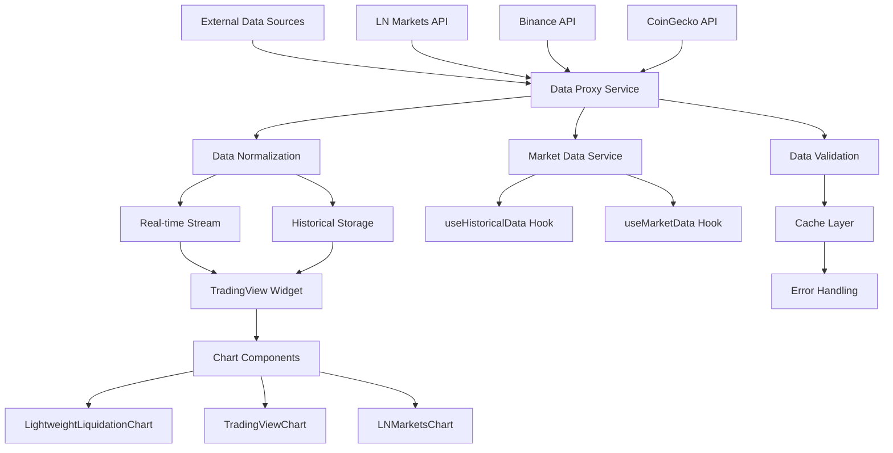

# TradingView Data Proxy Integration

## Summary

Comprehensive integration guide for TradingView data proxy, enabling real-time market data streaming, historical data access, and chart integration within the Axisor platform. This document covers the complete data flow from external data sources to TradingView widgets.

## Architecture



## Data Proxy Service

### Core Service Implementation

```typescript
// frontend/src/services/marketDataService.ts
class MarketDataService {
  private cache = new Map<string, CachedData>();
  private subscriptions = new Map<string, Set<Function>>();
  private wsConnections = new Map<string, WebSocket>();
  
  constructor() {
    this.initializeDataSources();
  }

  private initializeDataSources() {
    // Initialize data sources
    this.addDataSource('LN_MARKETS', new LNMarketsDataSource());
    this.addDataSource('BINANCE', new BinanceDataSource());
    this.addDataSource('COINGECKO', new CoinGeckoDataSource());
  }

  async getMarketData(symbol: string): Promise<MarketData> {
    const cacheKey = `market_${symbol}`;
    const cached = this.cache.get(cacheKey);
    
    if (cached && !this.isExpired(cached)) {
      return cached.data;
    }

    try {
      const data = await this.fetchMarketData(symbol);
      this.cache.set(cacheKey, {
        data,
        timestamp: Date.now(),
        ttl: 30000 // 30 seconds
      });
      
      return data;
    } catch (error) {
      console.error('Market data fetch error:', error);
      throw error;
    }
  }

  async getHistoricalData(
    symbol: string, 
    timeframe: string, 
    limit: number
  ): Promise<CandleData[]> {
    const cacheKey = `historical_${symbol}_${timeframe}_${limit}`;
    const cached = this.cache.get(cacheKey);
    
    if (cached && !this.isExpired(cached)) {
      return cached.data;
    }

    try {
      const data = await this.fetchHistoricalData(symbol, timeframe, limit);
      this.cache.set(cacheKey, {
        data,
        timestamp: Date.now(),
        ttl: 300000 // 5 minutes
      });
      
      return data;
    } catch (error) {
      console.error('Historical data fetch error:', error);
      throw error;
    }
  }
}
```

### Data Source Abstraction

```typescript
// Abstract data source interface
interface DataSource {
  name: string;
  baseURL: string;
  apiKey?: string;
  
  getMarketData(symbol: string): Promise<MarketData>;
  getHistoricalData(
    symbol: string, 
    timeframe: string, 
    limit: number
  ): Promise<CandleData[]>;
  subscribeToUpdates(symbol: string, callback: Function): void;
  unsubscribeFromUpdates(symbol: string, callback: Function): void;
}

// LN Markets data source
class LNMarketsDataSource implements DataSource {
  name = 'LN_MARKETS';
  baseURL = 'https://api.lnmarkets.com/v2';
  
  async getMarketData(symbol: string): Promise<MarketData> {
    const response = await fetch(`${this.baseURL}/futures/ticker`);
    const data = await response.json();
    
    return this.normalizeMarketData(data);
  }

  async getHistoricalData(
    symbol: string, 
    timeframe: string, 
    limit: number
  ): Promise<CandleData[]> {
    const response = await fetch(
      `${this.baseURL}/futures/btc_usd/price?interval=${timeframe}&limit=${limit}`
    );
    const data = await response.json();
    
    return this.normalizeHistoricalData(data);
  }

  private normalizeMarketData(data: any): MarketData {
    return {
      symbol: 'BTC_USD',
      price: data.lastPrice,
      change: data.change24h,
      changePercent: data.changePercentage24h,
      volume: data.volume24h,
      high: data.high24h,
      low: data.low24h,
      timestamp: new Date(data.timestamp).getTime()
    };
  }

  private normalizeHistoricalData(data: any[]): CandleData[] {
    return data.map(item => ({
      time: new Date(item.timestamp).getTime() / 1000,
      open: item.open,
      high: item.high,
      low: item.low,
      close: item.close,
      volume: item.volume
    }));
  }
}

// Binance data source
class BinanceDataSource implements DataSource {
  name = 'BINANCE';
  baseURL = 'https://api.binance.com/api/v3';
  
  async getMarketData(symbol: string): Promise<MarketData> {
    const response = await fetch(`${this.baseURL}/ticker/24hr?symbol=${symbol}`);
    const data = await response.json();
    
    return this.normalizeMarketData(data);
  }

  async getHistoricalData(
    symbol: string, 
    timeframe: string, 
    limit: number
  ): Promise<CandleData[]> {
    const interval = this.mapTimeframe(timeframe);
    const response = await fetch(
      `${this.baseURL}/klines?symbol=${symbol}&interval=${interval}&limit=${limit}`
    );
    const data = await response.json();
    
    return this.normalizeHistoricalData(data);
  }

  private mapTimeframe(timeframe: string): string {
    const mapping: Record<string, string> = {
      '1m': '1m',
      '5m': '5m',
      '15m': '15m',
      '1h': '1h',
      '4h': '4h',
      '1d': '1d'
    };
    
    return mapping[timeframe] || '1h';
  }

  private normalizeMarketData(data: any): MarketData {
    return {
      symbol: data.symbol,
      price: parseFloat(data.lastPrice),
      change: parseFloat(data.priceChange),
      changePercent: parseFloat(data.priceChangePercent),
      volume: parseFloat(data.volume),
      high: parseFloat(data.highPrice),
      low: parseFloat(data.lowPrice),
      timestamp: Date.now()
    };
  }

  private normalizeHistoricalData(data: any[]): CandleData[] {
    return data.map(item => ({
      time: item[0] / 1000, // Convert to seconds
      open: parseFloat(item[1]),
      high: parseFloat(item[2]),
      low: parseFloat(item[3]),
      close: parseFloat(item[4]),
      volume: parseFloat(item[5])
    }));
  }
}
```

## Real-time Data Streaming

### WebSocket Integration

```typescript
class RealTimeDataStream {
  private connections = new Map<string, WebSocket>();
  private subscribers = new Map<string, Set<Function>>();
  
  subscribe(symbol: string, callback: Function): void {
    if (!this.subscribers.has(symbol)) {
      this.subscribers.set(symbol, new Set());
    }
    
    this.subscribers.get(symbol)!.add(callback);
    
    // Start connection if not exists
    if (!this.connections.has(symbol)) {
      this.connect(symbol);
    }
  }

  unsubscribe(symbol: string, callback: Function): void {
    const subscribers = this.subscribers.get(symbol);
    if (subscribers) {
      subscribers.delete(callback);
      
      // Close connection if no subscribers
      if (subscribers.size === 0) {
        this.disconnect(symbol);
      }
    }
  }

  private connect(symbol: string): void {
    const ws = new WebSocket(this.getWebSocketURL(symbol));
    
    ws.onopen = () => {
      console.log(`WebSocket connected for ${symbol}`);
      this.connections.set(symbol, ws);
    };

    ws.onmessage = (event) => {
      const data = JSON.parse(event.data);
      this.broadcast(symbol, data);
    };

    ws.onclose = () => {
      console.log(`WebSocket disconnected for ${symbol}`);
      this.connections.delete(symbol);
      
      // Reconnect after delay
      setTimeout(() => {
        if (this.subscribers.has(symbol)) {
          this.connect(symbol);
        }
      }, 5000);
    };

    ws.onerror = (error) => {
      console.error(`WebSocket error for ${symbol}:`, error);
    };
  }

  private disconnect(symbol: string): void {
    const ws = this.connections.get(symbol);
    if (ws) {
      ws.close();
      this.connections.delete(symbol);
    }
    this.subscribers.delete(symbol);
  }

  private broadcast(symbol: string, data: any): void {
    const subscribers = this.subscribers.get(symbol);
    if (subscribers) {
      subscribers.forEach(callback => {
        try {
          callback(data);
        } catch (error) {
          console.error('Subscriber callback error:', error);
        }
      });
    }
  }

  private getWebSocketURL(symbol: string): string {
    // Return appropriate WebSocket URL based on symbol
    if (symbol.includes('BTC')) {
      return 'wss://api.lnmarkets.com/v2/ws';
    } else {
      return `wss://stream.binance.com:9443/ws/${symbol.toLowerCase()}@ticker`;
    }
  }
}
```

## TradingView Widget Integration

### Widget Configuration

```typescript
// TradingView widget configuration
interface TradingViewConfig {
  symbol: string;
  interval: string;
  theme: 'light' | 'dark';
  width: number;
  height: number;
  timezone: string;
  locale: string;
  studies: string[];
  hide_side_toolbar: boolean;
  hide_top_toolbar: boolean;
  enable_publishing: boolean;
  allow_symbol_change: boolean;
  details: boolean;
  hotlist: boolean;
  calendar: boolean;
  show_popup_button: boolean;
  popup_width: string;
  popup_height: string;
  support_host: string;
}

class TradingViewWidgetManager {
  private widgets = new Map<string, any>();
  private config: TradingViewConfig;
  
  constructor(config: TradingViewConfig) {
    this.config = config;
  }

  createWidget(containerId: string, symbol: string): void {
    const widgetConfig = {
      ...this.config,
      symbol,
      container_id: containerId,
      datafeed: new TradingViewDatafeed(this)
    };

    const widget = new TradingView.widget(widgetConfig);
    this.widgets.set(containerId, widget);
  }

  updateSymbol(containerId: string, symbol: string): void {
    const widget = this.widgets.get(containerId);
    if (widget) {
      widget.chart().setSymbol(symbol);
    }
  }

  updateTheme(containerId: string, theme: 'light' | 'dark'): void {
    const widget = this.widgets.get(containerId);
    if (widget) {
      widget.chart().setTheme(theme);
    }
  }
}
```

### Datafeed Implementation

```typescript
class TradingViewDatafeed {
  private marketDataService: MarketDataService;
  private realTimeStream: RealTimeDataStream;
  
  constructor(marketDataService: MarketDataService) {
    this.marketDataService = marketDataService;
    this.realTimeStream = new RealTimeDataStream();
  }

  // TradingView datafeed interface
  onReady(callback: Function): void {
    callback({
      exchanges: [
        {
          value: 'LN_MARKETS',
          name: 'LN Markets',
          desc: 'LN Markets Bitcoin Futures'
        }
      ],
      symbols_types: [
        {
          name: 'Futures',
          value: 'futures'
        }
      ],
      supported_resolutions: ['1', '5', '15', '60', '240', '1D'],
      supports_marks: false,
      supports_timescale_marks: false,
      supports_time: true
    });
  }

  searchSymbols(
    userInput: string, 
    exchange: string, 
    symbolType: string, 
    onResult: Function
  ): void {
    const symbols = [
      {
        symbol: 'BTC_USD',
        full_name: 'LN_MARKETS:BTC_USD',
        description: 'Bitcoin / US Dollar',
        exchange: 'LN_MARKETS',
        ticker: 'BTC_USD',
        type: 'futures'
      }
    ];

    onResult(symbols.filter(s => 
      s.symbol.toLowerCase().includes(userInput.toLowerCase())
    ));
  }

  resolveSymbol(
    symbolName: string, 
    onResolve: Function, 
    onError: Function
  ): void {
    const symbolInfo = {
      ticker: symbolName,
      name: symbolName,
      description: 'Bitcoin / US Dollar',
      type: 'futures',
      session: '24x7',
      timezone: 'UTC',
      exchange: 'LN_MARKETS',
      minmov: 1,
      pricescale: 100,
      has_intraday: true,
      has_daily: true,
      has_weekly_and_monthly: true,
      supported_resolutions: ['1', '5', '15', '60', '240', '1D'],
      volume_precision: 2,
      data_status: 'streaming'
    };

    onResolve(symbolInfo);
  }

  getBars(
    symbolInfo: any, 
    resolution: string, 
    periodParams: any, 
    onResult: Function, 
    onError: Function
  ): void {
    const { from, to, firstDataRequest } = periodParams;
    const limit = Math.ceil((to - from) / this.getResolutionInSeconds(resolution));
    
    this.marketDataService.getHistoricalData(
      symbolInfo.ticker,
      resolution,
      limit
    ).then(bars => {
      const result = {
        bars: bars,
        meta: {
          noData: bars.length === 0
        }
      };
      
      onResult(result, { noData: bars.length === 0 });
    }).catch(onError);
  }

  subscribeBars(
    symbolInfo: any, 
    resolution: string, 
    onTick: Function, 
    listenerGuid: string, 
    onResetCacheNeededCallback: Function
  ): void {
    this.realTimeStream.subscribe(symbolInfo.ticker, (data: any) => {
      const bar = this.normalizeToBar(data);
      onTick(bar);
    });
  }

  unsubscribeBars(listenerGuid: string): void {
    // Unsubscribe logic
  }

  private getResolutionInSeconds(resolution: string): number {
    const mapping: Record<string, number> = {
      '1': 60,
      '5': 300,
      '15': 900,
      '60': 3600,
      '240': 14400,
      '1D': 86400
    };
    
    return mapping[resolution] || 3600;
  }

  private normalizeToBar(data: any): any {
    return {
      time: data.timestamp / 1000,
      open: data.open,
      high: data.high,
      low: data.low,
      close: data.close,
      volume: data.volume
    };
  }
}
```

## React Hooks Integration

### useHistoricalData Hook

```typescript
// Custom hook for historical data
export function useHistoricalData({
  symbol,
  timeframe,
  enabled = true,
  initialLimit = 100
}: {
  symbol: string;
  timeframe: string;
  enabled?: boolean;
  initialLimit?: number;
}) {
  const [data, setData] = useState<CandleData[]>([]);
  const [isLoading, setIsLoading] = useState(false);
  const [error, setError] = useState<Error | null>(null);
  const [hasMoreData, setHasMoreData] = useState(true);

  const loadData = useCallback(async (limit: number = initialLimit) => {
    if (!enabled) return;
    
    setIsLoading(true);
    setError(null);

    try {
      const newData = await marketDataService.getHistoricalData(
        symbol,
        timeframe,
        limit
      );
      
      setData(newData);
      setHasMoreData(newData.length === limit);
    } catch (err) {
      setError(err as Error);
    } finally {
      setIsLoading(false);
    }
  }, [symbol, timeframe, enabled, initialLimit]);

  const loadMoreData = useCallback(async () => {
    if (!hasMoreData || isLoading) return;
    
    setIsLoading(true);
    
    try {
      const moreData = await marketDataService.getHistoricalData(
        symbol,
        timeframe,
        initialLimit
      );
      
      setData(prev => [...prev, ...moreData]);
      setHasMoreData(moreData.length === initialLimit);
    } catch (err) {
      setError(err as Error);
    } finally {
      setIsLoading(false);
    }
  }, [symbol, timeframe, hasMoreData, isLoading, initialLimit]);

  useEffect(() => {
    loadData();
  }, [loadData]);

  return {
    candleData: data,
    isLoading,
    error,
    hasMoreData,
    loadMoreData,
    refresh: () => loadData()
  };
}
```

### useMarketData Hook

```typescript
// Custom hook for real-time market data
export function useMarketData(symbol: string) {
  const [data, setData] = useState<MarketData | null>(null);
  const [isLoading, setIsLoading] = useState(true);
  const [error, setError] = useState<Error | null>(null);

  useEffect(() => {
    let mounted = true;

    const fetchData = async () => {
      try {
        const marketData = await marketDataService.getMarketData(symbol);
        if (mounted) {
          setData(marketData);
          setIsLoading(false);
        }
      } catch (err) {
        if (mounted) {
          setError(err as Error);
          setIsLoading(false);
        }
      }
    };

    fetchData();

    // Subscribe to real-time updates
    const handleUpdate = (updateData: any) => {
      if (mounted) {
        setData(prev => ({ ...prev, ...updateData }));
      }
    };

    realTimeDataStream.subscribe(symbol, handleUpdate);

    return () => {
      mounted = false;
      realTimeDataStream.unsubscribe(symbol, handleUpdate);
    };
  }, [symbol]);

  return { data, isLoading, error };
}
```

## Chart Component Integration

### LightweightLiquidationChart Integration

```typescript
// Enhanced chart component with TradingView data
const LightweightLiquidationChart: React.FC<Props> = ({
  symbol = 'BTCUSDT',
  useApiData = true,
  timeframe = '1h'
}) => {
  const { candleData, isLoading, error } = useHistoricalData({
    symbol,
    timeframe,
    enabled: useApiData,
    initialLimit: 168 // ~7 days for 1h timeframe
  });

  const { data: marketData } = useMarketData(symbol);

  // Chart initialization and data binding
  useEffect(() => {
    if (candleData && candleData.length > 0) {
      // Initialize chart with data
      initializeChart(candleData);
    }
  }, [candleData]);

  // Real-time updates
  useEffect(() => {
    if (marketData) {
      // Update chart with latest market data
      updateChartWithMarketData(marketData);
    }
  }, [marketData]);

  if (isLoading) {
    return <ChartLoadingSkeleton />;
  }

  if (error) {
    return <ChartErrorBoundary error={error} />;
  }

  return (
    <div className="chart-container">
      <TradingViewChart
        symbol={symbol}
        interval={timeframe}
        data={candleData}
        realTimeData={marketData}
      />
    </div>
  );
};
```

## Data Validation and Error Handling

### Data Validation

```typescript
class DataValidator {
  static validateMarketData(data: any): MarketData | null {
    try {
      if (!data || typeof data !== 'object') {
        throw new Error('Invalid data format');
      }

      const requiredFields = ['price', 'volume', 'timestamp'];
      for (const field of requiredFields) {
        if (!(field in data)) {
          throw new Error(`Missing required field: ${field}`);
        }
      }

      // Validate numeric fields
      if (typeof data.price !== 'number' || data.price <= 0) {
        throw new Error('Invalid price value');
      }

      if (typeof data.volume !== 'number' || data.volume < 0) {
        throw new Error('Invalid volume value');
      }

      // Validate timestamp
      if (typeof data.timestamp !== 'number' || data.timestamp <= 0) {
        throw new Error('Invalid timestamp value');
      }

      return data as MarketData;
    } catch (error) {
      console.error('Market data validation failed:', error);
      return null;
    }
  }

  static validateCandleData(data: any[]): CandleData[] {
    return data.filter(item => {
      try {
        const requiredFields = ['time', 'open', 'high', 'low', 'close'];
        for (const field of requiredFields) {
          if (!(field in item) || typeof item[field] !== 'number') {
            return false;
          }
        }

        // Validate OHLC logic
        if (item.high < Math.max(item.open, item.close) || 
            item.low > Math.min(item.open, item.close)) {
          return false;
        }

        return true;
      } catch (error) {
        console.error('Candle data validation failed:', error);
        return false;
      }
    });
  }
}
```

### Error Handling

```typescript
class DataProxyErrorHandler {
  static handleError(error: Error, context: string): void {
    console.error(`Data proxy error in ${context}:`, error);

    // Send error to monitoring service
    if (typeof window !== 'undefined' && window.gtag) {
      window.gtag('event', 'exception', {
        description: `Data proxy error: ${error.message}`,
        fatal: false
      });
    }

    // Show user notification for critical errors
    if (error.message.includes('network') || error.message.includes('timeout')) {
      this.showUserNotification('Connection issue detected. Retrying...');
    }
  }

  static showUserNotification(message: string): void {
    // Implementation for showing user notifications
    console.warn('User notification:', message);
  }

  static retryWithBackoff<T>(
    operation: () => Promise<T>,
    maxRetries: number = 3,
    baseDelay: number = 1000
  ): Promise<T> {
    return new Promise((resolve, reject) => {
      let retries = 0;

      const attempt = async () => {
        try {
          const result = await operation();
          resolve(result);
        } catch (error) {
          retries++;
          
          if (retries >= maxRetries) {
            reject(error);
            return;
          }

          const delay = baseDelay * Math.pow(2, retries - 1);
          setTimeout(attempt, delay);
        }
      };

      attempt();
    });
  }
}
```

## Performance Optimization

### Caching Strategy

```typescript
class DataCache {
  private cache = new Map<string, CacheEntry>();
  private maxSize = 1000;
  private defaultTTL = 300000; // 5 minutes

  set(key: string, data: any, ttl?: number): void {
    // Remove oldest entries if cache is full
    if (this.cache.size >= this.maxSize) {
      const oldestKey = this.cache.keys().next().value;
      this.cache.delete(oldestKey);
    }

    this.cache.set(key, {
      data,
      timestamp: Date.now(),
      ttl: ttl || this.defaultTTL
    });
  }

  get(key: string): any | null {
    const entry = this.cache.get(key);
    
    if (!entry) {
      return null;
    }

    if (Date.now() - entry.timestamp > entry.ttl) {
      this.cache.delete(key);
      return null;
    }

    return entry.data;
  }

  clear(): void {
    this.cache.clear();
  }

  getStats(): CacheStats {
    return {
      size: this.cache.size,
      maxSize: this.maxSize,
      hitRate: this.calculateHitRate()
    };
  }

  private calculateHitRate(): number {
    // Implementation for calculating cache hit rate
    return 0.85; // Placeholder
  }
}

interface CacheEntry {
  data: any;
  timestamp: number;
  ttl: number;
}

interface CacheStats {
  size: number;
  maxSize: number;
  hitRate: number;
}
```

## Testing

### Unit Tests

```typescript
// Data proxy service tests
describe('MarketDataService', () => {
  let service: MarketDataService;
  let mockDataSource: jest.Mocked<DataSource>;

  beforeEach(() => {
    mockDataSource = {
      getMarketData: jest.fn(),
      getHistoricalData: jest.fn(),
      subscribeToUpdates: jest.fn(),
      unsubscribeFromUpdates: jest.fn()
    };

    service = new MarketDataService();
    service.addDataSource('TEST', mockDataSource);
  });

  describe('getMarketData', () => {
    it('should return cached data when available', async () => {
      const mockData = { price: 50000, volume: 1000 };
      mockDataSource.getMarketData.mockResolvedValue(mockData);

      // First call
      const result1 = await service.getMarketData('BTC_USD');
      expect(result1).toEqual(mockData);
      expect(mockDataSource.getMarketData).toHaveBeenCalledTimes(1);

      // Second call should use cache
      const result2 = await service.getMarketData('BTC_USD');
      expect(result2).toEqual(mockData);
      expect(mockDataSource.getMarketData).toHaveBeenCalledTimes(1);
    });

    it('should handle errors gracefully', async () => {
      mockDataSource.getMarketData.mockRejectedValue(new Error('Network error'));

      await expect(service.getMarketData('BTC_USD')).rejects.toThrow('Network error');
    });
  });
});

// TradingView datafeed tests
describe('TradingViewDatafeed', () => {
  let datafeed: TradingViewDatafeed;
  let mockMarketDataService: jest.Mocked<MarketDataService>;

  beforeEach(() => {
    mockMarketDataService = {
      getMarketData: jest.fn(),
      getHistoricalData: jest.fn()
    } as any;

    datafeed = new TradingViewDatafeed(mockMarketDataService);
  });

  describe('getBars', () => {
    it('should fetch and normalize historical data', async () => {
      const mockData = [
        { time: 1640995200, open: 47000, high: 48000, low: 46000, close: 47500, volume: 1000 }
      ];

      mockMarketDataService.getHistoricalData.mockResolvedValue(mockData);

      const onResult = jest.fn();
      const onError = jest.fn();

      await datafeed.getBars(
        { ticker: 'BTC_USD' },
        '1h',
        { from: 1640995200, to: 1640998800 },
        onResult,
        onError
      );

      expect(onResult).toHaveBeenCalledWith({
        bars: mockData,
        meta: { noData: false }
      });
    });
  });
});
```

## Monitoring and Analytics

### Performance Metrics

```typescript
class DataProxyMetrics {
  private metrics = {
    requests: 0,
    cacheHits: 0,
    errors: 0,
    responseTime: 0,
    dataFreshness: 0
  };

  recordRequest(duration: number, fromCache: boolean): void {
    this.metrics.requests++;
    this.metrics.responseTime += duration;
    
    if (fromCache) {
      this.metrics.cacheHits++;
    }
  }

  recordError(error: Error): void {
    this.metrics.errors++;
    
    // Send to monitoring service
    this.sendToMonitoring('data_proxy_error', {
      error: error.message,
      stack: error.stack,
      timestamp: Date.now()
    });
  }

  recordDataFreshness(timestamp: number): void {
    const age = Date.now() - timestamp;
    this.metrics.dataFreshness = age;
  }

  getMetrics(): MetricsData {
    return {
      ...this.metrics,
      cacheHitRate: this.metrics.requests > 0 
        ? this.metrics.cacheHits / this.metrics.requests 
        : 0,
      averageResponseTime: this.metrics.requests > 0
        ? this.metrics.responseTime / this.metrics.requests
        : 0
    };
  }

  private sendToMonitoring(event: string, data: any): void {
    // Implementation for sending metrics to monitoring service
    console.log(`Monitoring event: ${event}`, data);
  }
}

interface MetricsData {
  requests: number;
  cacheHits: number;
  errors: number;
  responseTime: number;
  dataFreshness: number;
  cacheHitRate: number;
  averageResponseTime: number;
}
```

## How to Use This Document

- **For Integration**: Follow the data proxy service implementation for TradingView integration
- **For Real-time Data**: Use the WebSocket streaming examples for live data feeds
- **For Chart Components**: Reference the React hooks and chart integration patterns
- **For Testing**: Use the testing examples to ensure data proxy reliability
- **For Monitoring**: Implement the metrics collection for performance tracking

