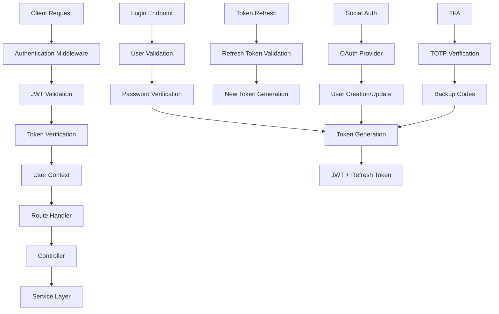

# Internal Authentication System

## Summary

Comprehensive documentation of the internal authentication system for the Axisor platform, covering JWT implementation, middleware, user management, security measures, and integration patterns. This document provides complete guidance for implementing secure authentication across all platform components.

## Architecture



## JWT Implementation

### Token Structure

```typescript
// JWT Payload Structure
interface JWTPayload {
  userId: string;
  email: string;
  username: string;
  plan: string;
  role: 'user' | 'admin' | 'super_admin';
  permissions: string[];
  iat: number; // Issued at
  exp: number; // Expiration
  jti: string; // JWT ID
  iss: string; // Issuer
  aud: string; // Audience
}

// Refresh Token Payload
interface RefreshTokenPayload {
  userId: string;
  tokenId: string;
  type: 'refresh';
  iat: number;
  exp: number;
  jti: string;
}
```

### Token Generation

```typescript
import jwt from 'jsonwebtoken';
import crypto from 'crypto';

class TokenService {
  private accessTokenSecret: string;
  private refreshTokenSecret: string;
  private accessTokenExpiry: string;
  private refreshTokenExpiry: string;

  constructor() {
    this.accessTokenSecret = process.env.JWT_ACCESS_SECRET!;
    this.refreshTokenSecret = process.env.JWT_REFRESH_SECRET!;
    this.accessTokenExpiry = process.env.JWT_ACCESS_EXPIRY || '15m';
    this.refreshTokenExpiry = process.env.JWT_REFRESH_EXPIRY || '7d';
  }

  generateAccessToken(user: User, permissions: string[]): string {
    const payload: JWTPayload = {
      userId: user.id,
      email: user.email,
      username: user.username,
      plan: user.plan,
      role: user.role,
      permissions,
      iat: Math.floor(Date.now() / 1000),
      exp: Math.floor(Date.now() / 1000) + this.parseExpiry(this.accessTokenExpiry),
      jti: crypto.randomUUID(),
      iss: 'axisor-api',
      aud: 'axisor-client'
    };

    return jwt.sign(payload, this.accessTokenSecret, {
      algorithm: 'HS256',
      issuer: 'axisor-api',
      audience: 'axisor-client'
    });
  }

  generateRefreshToken(userId: string, tokenId: string): string {
    const payload: RefreshTokenPayload = {
      userId,
      tokenId,
      type: 'refresh',
      iat: Math.floor(Date.now() / 1000),
      exp: Math.floor(Date.now() / 1000) + this.parseExpiry(this.refreshTokenExpiry),
      jti: crypto.randomUUID()
    };

    return jwt.sign(payload, this.refreshTokenSecret, {
      algorithm: 'HS256'
    });
  }

  verifyAccessToken(token: string): JWTPayload {
    try {
      const decoded = jwt.verify(token, this.accessTokenSecret, {
        issuer: 'axisor-api',
        audience: 'axisor-client',
        algorithms: ['HS256']
      }) as JWTPayload;

      return decoded;
    } catch (error) {
      if (error instanceof jwt.TokenExpiredError) {
        throw new AuthenticationError('Token expired', 'TOKEN_EXPIRED');
      } else if (error instanceof jwt.JsonWebTokenError) {
        throw new AuthenticationError('Invalid token', 'INVALID_TOKEN');
      }
      throw new AuthenticationError('Token verification failed', 'TOKEN_VERIFICATION_FAILED');
    }
  }

  verifyRefreshToken(token: string): RefreshTokenPayload {
    try {
      const decoded = jwt.verify(token, this.refreshTokenSecret, {
        algorithms: ['HS256']
      }) as RefreshTokenPayload;

      if (decoded.type !== 'refresh') {
        throw new AuthenticationError('Invalid token type', 'INVALID_TOKEN_TYPE');
      }

      return decoded;
    } catch (error) {
      if (error instanceof jwt.TokenExpiredError) {
        throw new AuthenticationError('Refresh token expired', 'REFRESH_TOKEN_EXPIRED');
      } else if (error instanceof jwt.JsonWebTokenError) {
        throw new AuthenticationError('Invalid refresh token', 'INVALID_REFRESH_TOKEN');
      }
      throw error;
    }
  }

  private parseExpiry(expiry: string): number {
    const unit = expiry.slice(-1);
    const value = parseInt(expiry.slice(0, -1));

    switch (unit) {
      case 's': return value;
      case 'm': return value * 60;
      case 'h': return value * 60 * 60;
      case 'd': return value * 24 * 60 * 60;
      default: return 15 * 60; // 15 minutes default
    }
  }
}

class AuthenticationError extends Error {
  constructor(message: string, public code: string) {
    super(message);
    this.name = 'AuthenticationError';
  }
}
```

## Authentication Middleware

### Fastify Authentication Middleware

```typescript
import { FastifyRequest, FastifyReply } from 'fastify';
import { PrismaClient } from '@prisma/client';

interface AuthenticatedRequest extends FastifyRequest {
  user: {
    id: string;
    email: string;
    username: string;
    plan: string;
    role: string;
    permissions: string[];
  };
}

class AuthenticationMiddleware {
  private tokenService: TokenService;
  private prisma: PrismaClient;

  constructor(tokenService: TokenService, prisma: PrismaClient) {
    this.tokenService = tokenService;
    this.prisma = prisma;
  }

  async authenticate(request: AuthenticatedRequest, reply: FastifyReply): Promise<void> {
    try {
      const authHeader = request.headers.authorization;
      
      if (!authHeader || !authHeader.startsWith('Bearer ')) {
        return reply.status(401).send({
          success: false,
          error: {
            code: 'AUTHENTICATION_REQUIRED',
            message: 'Authorization header required'
          }
        });
      }

      const token = authHeader.substring(7);
      const payload = this.tokenService.verifyAccessToken(token);

      // Check if user still exists and is active
      const user = await this.prisma.user.findUnique({
        where: { id: payload.userId },
        select: {
          id: true,
          email: true,
          username: true,
          plan: true,
          role: true,
          isActive: true,
          emailVerified: true
        }
      });

      if (!user || !user.isActive) {
        return reply.status(401).send({
          success: false,
          error: {
            code: 'USER_NOT_FOUND',
            message: 'User not found or inactive'
          }
        });
      }

      // Check if email is verified (optional based on business rules)
      if (!user.emailVerified) {
        return reply.status(403).send({
          success: false,
          error: {
            code: 'EMAIL_NOT_VERIFIED',
            message: 'Email verification required'
          }
        });
      }

      // Attach user to request
      request.user = {
        id: user.id,
        email: user.email,
        username: user.username,
        plan: user.plan,
        role: user.role,
        permissions: payload.permissions
      };

    } catch (error) {
      if (error instanceof AuthenticationError) {
        return reply.status(401).send({
          success: false,
          error: {
            code: error.code,
            message: error.message
          }
        });
      }

      console.error('Authentication middleware error:', error);
      return reply.status(500).send({
        success: false,
        error: {
          code: 'INTERNAL_ERROR',
          message: 'Authentication failed'
        }
      });
    }
  }

  // Optional authentication (doesn't fail if no token)
  async optionalAuthenticate(request: AuthenticatedRequest, reply: FastifyReply): Promise<void> {
    try {
      const authHeader = request.headers.authorization;
      
      if (!authHeader || !authHeader.startsWith('Bearer ')) {
        return; // Continue without authentication
      }

      await this.authenticate(request, reply);
    } catch (error) {
      // Ignore authentication errors for optional auth
      return;
    }
  }

  // Admin-only authentication
  async adminAuthenticate(request: AuthenticatedRequest, reply: FastifyReply): Promise<void> {
    await this.authenticate(request, reply);
    
    if (request.user && !['admin', 'super_admin'].includes(request.user.role)) {
      return reply.status(403).send({
        success: false,
        error: {
          code: 'INSUFFICIENT_PERMISSIONS',
          message: 'Admin access required'
        }
      });
    }
  }

  // Permission-based authentication
  hasPermission(permission: string) {
    return async (request: AuthenticatedRequest, reply: FastifyReply): Promise<void> => {
      await this.authenticate(request, reply);
      
      if (request.user && !request.user.permissions.includes(permission)) {
        return reply.status(403).send({
          success: false,
          error: {
            code: 'INSUFFICIENT_PERMISSIONS',
            message: `Permission '${permission}' required`
          }
        });
      }
    };
  }
}

// Export middleware instance
export const authMiddleware = new AuthenticationMiddleware(
  new TokenService(),
  new PrismaClient()
);
```

### Route Registration

```typescript
// Register authentication middleware
export async function authRoutes(fastify: FastifyInstance) {
  // Apply authentication to all routes in this plugin
  fastify.addHook('preHandler', authMiddleware.authenticate.bind(authMiddleware));

  fastify.get('/profile', async (request: AuthenticatedRequest, reply) => {
    // User is available in request.user
    return {
      success: true,
      user: request.user
    };
  });

  // Admin-only route
  fastify.get('/admin/users', {
    preHandler: authMiddleware.adminAuthenticate.bind(authMiddleware)
  }, async (request: AuthenticatedRequest, reply) => {
    // Admin user context
    return { success: true, adminUser: request.user };
  });

  // Permission-based route
  fastify.post('/admin/users/:id/suspend', {
    preHandler: authMiddleware.hasPermission('user:manage').bind(authMiddleware)
  }, async (request: AuthenticatedRequest, reply) => {
    // User has 'user:manage' permission
    return { success: true };
  });
}
```

## User Management

### User Registration

```typescript
class UserService {
  private prisma: PrismaClient;
  private tokenService: TokenService;
  private emailService: EmailService;

  constructor() {
    this.prisma = new PrismaClient();
    this.tokenService = new TokenService();
    this.emailService = new EmailService();
  }

  async registerUser(registrationData: {
    email: string;
    username: string;
    password: string;
    firstName?: string;
    lastName?: string;
  }): Promise<{ user: User; tokens: TokenPair }> {
    // Validate input
    await this.validateRegistrationData(registrationData);

    // Check if user already exists
    const existingUser = await this.prisma.user.findFirst({
      where: {
        OR: [
          { email: registrationData.email },
          { username: registrationData.username }
        ]
      }
    });

    if (existingUser) {
      throw new ValidationError('User already exists', 'USER_EXISTS');
    }

    // Hash password
    const hashedPassword = await this.hashPassword(registrationData.password);

    // Create user
    const user = await this.prisma.user.create({
      data: {
        email: registrationData.email,
        username: registrationData.username,
        password: hashedPassword,
        firstName: registrationData.firstName,
        lastName: registrationData.lastName,
        plan: 'free',
        role: 'user',
        emailVerified: false,
        isActive: true,
        preferences: {
          notifications: true,
          theme: 'dark',
          language: 'en',
          timezone: 'UTC'
        }
      }
    });

    // Generate tokens
    const tokens = await this.generateTokenPair(user);

    // Send verification email
    await this.sendVerificationEmail(user);

    return { user, tokens };
  }

  private async validateRegistrationData(data: {
    email: string;
    username: string;
    password: string;
  }): Promise<void> {
    const errors: string[] = [];

    // Email validation
    if (!this.isValidEmail(data.email)) {
      errors.push('Invalid email format');
    }

    // Username validation
    if (!this.isValidUsername(data.username)) {
      errors.push('Username must be 3-20 characters, alphanumeric and underscores only');
    }

    // Password validation
    if (!this.isValidPassword(data.password)) {
      errors.push('Password must be at least 8 characters with uppercase, lowercase, number and special character');
    }

    if (errors.length > 0) {
      throw new ValidationError('Validation failed', 'VALIDATION_ERROR', errors);
    }
  }

  private isValidEmail(email: string): boolean {
    const emailRegex = /^[^\s@]+@[^\s@]+\.[^\s@]+$/;
    return emailRegex.test(email);
  }

  private isValidUsername(username: string): boolean {
    const usernameRegex = /^[a-zA-Z0-9_]{3,20}$/;
    return usernameRegex.test(username);
  }

  private isValidPassword(password: string): boolean {
    // At least 8 characters, 1 uppercase, 1 lowercase, 1 number, 1 special character
    const passwordRegex = /^(?=.*[a-z])(?=.*[A-Z])(?=.*\d)(?=.*[@$!%*?&])[A-Za-z\d@$!%*?&]{8,}$/;
    return passwordRegex.test(password);
  }

  private async hashPassword(password: string): Promise<string> {
    const bcrypt = await import('bcrypt');
    const saltRounds = 12;
    return bcrypt.hash(password, saltRounds);
  }

  private async sendVerificationEmail(user: User): Promise<void> {
    const verificationToken = crypto.randomBytes(32).toString('hex');
    
    await this.prisma.user.update({
      where: { id: user.id },
      data: {
        emailVerificationToken: verificationToken,
        emailVerificationExpires: new Date(Date.now() + 24 * 60 * 60 * 1000) // 24 hours
      }
    });

    await this.emailService.sendVerificationEmail(user.email, verificationToken);
  }
}
```

### User Login

```typescript
class AuthService {
  private prisma: PrismaClient;
  private tokenService: TokenService;

  constructor() {
    this.prisma = new PrismaClient();
    this.tokenService = new TokenService();
  }

  async loginUser(loginData: {
    email: string;
    password: string;
    rememberMe?: boolean;
  }): Promise<{ user: User; tokens: TokenPair }> {
    // Find user
    const user = await this.prisma.user.findUnique({
      where: { email: loginData.email },
      include: {
        permissions: true
      }
    });

    if (!user) {
      throw new AuthenticationError('Invalid credentials', 'INVALID_CREDENTIALS');
    }

    if (!user.isActive) {
      throw new AuthenticationError('Account is inactive', 'ACCOUNT_INACTIVE');
    }

    // Verify password
    const isPasswordValid = await this.verifyPassword(loginData.password, user.password);
    if (!isPasswordValid) {
      throw new AuthenticationError('Invalid credentials', 'INVALID_CREDENTIALS');
    }

    // Check if email is verified
    if (!user.emailVerified) {
      throw new AuthenticationError('Email verification required', 'EMAIL_NOT_VERIFIED');
    }

    // Update last login
    await this.prisma.user.update({
      where: { id: user.id },
      data: { lastLoginAt: new Date() }
    });

    // Generate tokens
    const tokens = await this.generateTokenPair(user);

    return { user, tokens };
  }

  async refreshToken(refreshToken: string): Promise<TokenPair> {
    const payload = this.tokenService.verifyRefreshToken(refreshToken);

    // Check if refresh token exists in database
    const storedToken = await this.prisma.refreshToken.findUnique({
      where: { id: payload.tokenId },
      include: { user: true }
    });

    if (!storedToken || storedToken.isRevoked) {
      throw new AuthenticationError('Invalid refresh token', 'INVALID_REFRESH_TOKEN');
    }

    // Check if user is still active
    if (!storedToken.user.isActive) {
      throw new AuthenticationError('User is inactive', 'USER_INACTIVE');
    }

    // Generate new token pair
    const newTokens = await this.generateTokenPair(storedToken.user);

    // Revoke old refresh token
    await this.prisma.refreshToken.update({
      where: { id: payload.tokenId },
      data: { isRevoked: true }
    });

    return newTokens;
  }

  async logoutUser(userId: string, tokenId?: string): Promise<void> {
    if (tokenId) {
      // Revoke specific refresh token
      await this.prisma.refreshToken.update({
        where: { id: tokenId },
        data: { isRevoked: true }
      });
    } else {
      // Revoke all refresh tokens for user
      await this.prisma.refreshToken.updateMany({
        where: { userId },
        data: { isRevoked: true }
      });
    }
  }

  private async verifyPassword(password: string, hashedPassword: string): Promise<boolean> {
    const bcrypt = await import('bcrypt');
    return bcrypt.compare(password, hashedPassword);
  }

  private async generateTokenPair(user: User): Promise<TokenPair> {
    // Get user permissions
    const permissions = await this.getUserPermissions(user.id);

    // Generate tokens
    const accessToken = this.tokenService.generateAccessToken(user, permissions);
    
    // Create refresh token record
    const refreshTokenRecord = await this.prisma.refreshToken.create({
      data: {
        userId: user.id,
        expiresAt: new Date(Date.now() + 7 * 24 * 60 * 60 * 1000) // 7 days
      }
    });

    const refreshToken = this.tokenService.generateRefreshToken(
      user.id,
      refreshTokenRecord.id
    );

    return {
      accessToken,
      refreshToken,
      expiresIn: 15 * 60, // 15 minutes
      tokenType: 'Bearer'
    };
  }

  private async getUserPermissions(userId: string): Promise<string[]> {
    const userPermissions = await this.prisma.userPermission.findMany({
      where: { userId },
      include: { permission: true }
    });

    return userPermissions.map(up => up.permission.name);
  }
}

interface TokenPair {
  accessToken: string;
  refreshToken: string;
  expiresIn: number;
  tokenType: string;
}
```

## Social Authentication

### OAuth Integration

```typescript
import passport from 'passport';
import { Strategy as GoogleStrategy } from 'passport-google-oauth20';
import { Strategy as GitHubStrategy } from 'passport-github2';

class SocialAuthService {
  private prisma: PrismaClient;

  constructor() {
    this.prisma = new PrismaClient();
    this.setupStrategies();
  }

  private setupStrategies(): void {
    // Google OAuth
    passport.use(new GoogleStrategy({
      clientID: process.env.GOOGLE_CLIENT_ID!,
      clientSecret: process.env.GOOGLE_CLIENT_SECRET!,
      callbackURL: '/api/auth/google/callback'
    }, this.handleGoogleCallback.bind(this)));

    // GitHub OAuth
    passport.use(new GitHubStrategy({
      clientID: process.env.GITHUB_CLIENT_ID!,
      clientSecret: process.env.GITHUB_CLIENT_SECRET!,
      callbackURL: '/api/auth/github/callback'
    }, this.handleGitHubCallback.bind(this)));
  }

  private async handleGoogleCallback(
    accessToken: string,
    refreshToken: string,
    profile: any,
    done: Function
  ): Promise<void> {
    try {
      const email = profile.emails[0].value;
      const existingUser = await this.findUserByEmail(email);

      if (existingUser) {
        // Update existing user with Google info
        await this.updateUserWithSocialInfo(existingUser.id, {
          provider: 'google',
          providerId: profile.id,
          avatar: profile.photos[0].value
        });

        return done(null, existingUser);
      }

      // Create new user
      const newUser = await this.createUserFromSocialProfile({
        email,
        username: this.generateUsername(profile.displayName),
        firstName: profile.name.givenName,
        lastName: profile.name.familyName,
        avatar: profile.photos[0].value,
        provider: 'google',
        providerId: profile.id,
        emailVerified: true
      });

      return done(null, newUser);
    } catch (error) {
      return done(error, null);
    }
  }

  private async handleGitHubCallback(
    accessToken: string,
    refreshToken: string,
    profile: any,
    done: Function
  ): Promise<void> {
    try {
      const email = profile.emails[0].value;
      const existingUser = await this.findUserByEmail(email);

      if (existingUser) {
        await this.updateUserWithSocialInfo(existingUser.id, {
          provider: 'github',
          providerId: profile.id,
          avatar: profile.photos[0].value
        });

        return done(null, existingUser);
      }

      const newUser = await this.createUserFromSocialProfile({
        email,
        username: profile.username,
        firstName: profile.displayName?.split(' ')[0],
        lastName: profile.displayName?.split(' ').slice(1).join(' '),
        avatar: profile.photos[0].value,
        provider: 'github',
        providerId: profile.id,
        emailVerified: true
      });

      return done(null, newUser);
    } catch (error) {
      return done(error, null);
    }
  }

  private async findUserByEmail(email: string): Promise<User | null> {
    return this.prisma.user.findUnique({
      where: { email }
    });
  }

  private async updateUserWithSocialInfo(
    userId: string,
    socialInfo: any
  ): Promise<void> {
    await this.prisma.user.update({
      where: { id: userId },
      data: {
        socialProvider: socialInfo.provider,
        socialProviderId: socialInfo.providerId,
        avatar: socialInfo.avatar,
        lastLoginAt: new Date()
      }
    });
  }

  private async createUserFromSocialProfile(profileData: {
    email: string;
    username: string;
    firstName?: string;
    lastName?: string;
    avatar?: string;
    provider: string;
    providerId: string;
    emailVerified: boolean;
  }): Promise<User> {
    return this.prisma.user.create({
      data: {
        email: profileData.email,
        username: profileData.username,
        firstName: profileData.firstName,
        lastName: profileData.lastName,
        avatar: profileData.avatar,
        socialProvider: profileData.provider,
        socialProviderId: profileData.providerId,
        emailVerified: profileData.emailVerified,
        plan: 'free',
        role: 'user',
        isActive: true,
        preferences: {
          notifications: true,
          theme: 'dark',
          language: 'en',
          timezone: 'UTC'
        }
      }
    });
  }

  private generateUsername(displayName: string): string {
    const base = displayName.toLowerCase().replace(/[^a-z0-9]/g, '');
    const randomSuffix = Math.random().toString(36).substring(2, 8);
    return `${base}${randomSuffix}`;
  }
}
```

## Two-Factor Authentication (2FA)

### TOTP Implementation

```typescript
import speakeasy from 'speakeasy';
import QRCode from 'qrcode';

class TwoFactorAuthService {
  private prisma: PrismaClient;

  constructor() {
    this.prisma = new PrismaClient();
  }

  async setup2FA(userId: string): Promise<{
    secret: string;
    qrCodeUrl: string;
    backupCodes: string[];
  }> {
    // Generate secret
    const secret = speakeasy.generateSecret({
      name: `Axisor (${userId})`,
      issuer: 'Axisor'
    });

    // Generate backup codes
    const backupCodes = this.generateBackupCodes();

    // Save to database
    await this.prisma.user.update({
      where: { id: userId },
      data: {
        twoFactorSecret: secret.base32,
        twoFactorBackupCodes: backupCodes,
        twoFactorEnabled: false // Will be enabled after verification
      }
    });

    // Generate QR code
    const qrCodeUrl = await QRCode.toDataURL(secret.otpauth_url!);

    return {
      secret: secret.base32,
      qrCodeUrl,
      backupCodes
    };
  }

  async verifyAndEnable2FA(userId: string, token: string): Promise<boolean> {
    const user = await this.prisma.user.findUnique({
      where: { id: userId },
      select: { twoFactorSecret: true }
    });

    if (!user?.twoFactorSecret) {
      throw new Error('2FA not set up');
    }

    const verified = speakeasy.totp.verify({
      secret: user.twoFactorSecret,
      encoding: 'base32',
      token,
      window: 2
    });

    if (verified) {
      await this.prisma.user.update({
        where: { id: userId },
        data: { twoFactorEnabled: true }
      });
    }

    return verified;
  }

  async verify2FA(userId: string, token: string): Promise<boolean> {
    const user = await this.prisma.user.findUnique({
      where: { id: userId },
      select: {
        twoFactorSecret: true,
        twoFactorEnabled: true,
        twoFactorBackupCodes: true
      }
    });

    if (!user?.twoFactorEnabled) {
      return true; // 2FA not enabled
    }

    if (!user.twoFactorSecret) {
      throw new Error('2FA secret not found');
    }

    // Check TOTP token
    const totpVerified = speakeasy.totp.verify({
      secret: user.twoFactorSecret,
      encoding: 'base32',
      token,
      window: 2
    });

    if (totpVerified) {
      return true;
    }

    // Check backup codes
    if (user.twoFactorBackupCodes.includes(token)) {
      // Remove used backup code
      const updatedCodes = user.twoFactorBackupCodes.filter(code => code !== token);
      await this.prisma.user.update({
        where: { id: userId },
        data: { twoFactorBackupCodes: updatedCodes }
      });
      return true;
    }

    return false;
  }

  async disable2FA(userId: string): Promise<void> {
    await this.prisma.user.update({
      where: { id: userId },
      data: {
        twoFactorSecret: null,
        twoFactorBackupCodes: [],
        twoFactorEnabled: false
      }
    });
  }

  private generateBackupCodes(): string[] {
    const codes: string[] = [];
    for (let i = 0; i < 10; i++) {
      codes.push(crypto.randomBytes(4).toString('hex').toUpperCase());
    }
    return codes;
  }
}
```

## Security Measures

### Rate Limiting

```typescript
import rateLimit from 'express-rate-limit';

// Login rate limiting
export const loginRateLimit = rateLimit({
  windowMs: 15 * 60 * 1000, // 15 minutes
  max: 5, // 5 attempts per window
  message: {
    success: false,
    error: {
      code: 'RATE_LIMIT_EXCEEDED',
      message: 'Too many login attempts, please try again later'
    }
  },
  standardHeaders: true,
  legacyHeaders: false,
  skipSuccessfulRequests: true
});

// Registration rate limiting
export const registrationRateLimit = rateLimit({
  windowMs: 60 * 60 * 1000, // 1 hour
  max: 3, // 3 registrations per hour
  message: {
    success: false,
    error: {
      code: 'RATE_LIMIT_EXCEEDED',
      message: 'Too many registration attempts, please try again later'
    }
  }
});
```

### Password Security

```typescript
class PasswordSecurityService {
  private bcrypt: any;

  constructor() {
    this.bcrypt = require('bcrypt');
  }

  async hashPassword(password: string): Promise<string> {
    const saltRounds = 12;
    return this.bcrypt.hash(password, saltRounds);
  }

  async verifyPassword(password: string, hashedPassword: string): Promise<boolean> {
    return this.bcrypt.compare(password, hashedPassword);
  }

  async validatePasswordStrength(password: string): Promise<{
    isValid: boolean;
    errors: string[];
  }> {
    const errors: string[] = [];

    if (password.length < 8) {
      errors.push('Password must be at least 8 characters long');
    }

    if (!/[a-z]/.test(password)) {
      errors.push('Password must contain at least one lowercase letter');
    }

    if (!/[A-Z]/.test(password)) {
      errors.push('Password must contain at least one uppercase letter');
    }

    if (!/\d/.test(password)) {
      errors.push('Password must contain at least one number');
    }

    if (!/[@$!%*?&]/.test(password)) {
      errors.push('Password must contain at least one special character');
    }

    // Check against common passwords
    if (this.isCommonPassword(password)) {
      errors.push('Password is too common');
    }

    return {
      isValid: errors.length === 0,
      errors
    };
  }

  private isCommonPassword(password: string): boolean {
    const commonPasswords = [
      'password', '123456', '123456789', 'qwerty', 'abc123',
      'password123', 'admin', 'letmein', 'welcome', 'monkey'
    ];

    return commonPasswords.includes(password.toLowerCase());
  }
}
```

## API Endpoints

### Authentication Routes

```typescript
export async function authRoutes(fastify: FastifyInstance) {
  const authService = new AuthService();
  const userService = new UserService();
  const twoFactorService = new TwoFactorAuthService();

  // Registration
  fastify.post('/register', {
    config: { rateLimit: registrationRateLimit },
    schema: {
      body: {
        type: 'object',
        required: ['email', 'username', 'password'],
        properties: {
          email: { type: 'string', format: 'email' },
          username: { type: 'string', minLength: 3, maxLength: 20 },
          password: { type: 'string', minLength: 8 },
          firstName: { type: 'string' },
          lastName: { type: 'string' }
        }
      }
    }
  }, async (request, reply) => {
    try {
      const { user, tokens } = await userService.registerUser(request.body);
      
      reply.status(201).send({
        success: true,
        user: {
          id: user.id,
          email: user.email,
          username: user.username,
          plan: user.plan,
          emailVerified: user.emailVerified
        },
        tokens
      });
    } catch (error) {
      if (error instanceof ValidationError) {
        return reply.status(400).send({
          success: false,
          error: {
            code: error.code,
            message: error.message,
            details: error.details
          }
        });
      }
      throw error;
    }
  });

  // Login
  fastify.post('/login', {
    config: { rateLimit: loginRateLimit },
    schema: {
      body: {
        type: 'object',
        required: ['email', 'password'],
        properties: {
          email: { type: 'string', format: 'email' },
          password: { type: 'string' },
          rememberMe: { type: 'boolean' },
          twoFactorToken: { type: 'string' }
        }
      }
    }
  }, async (request, reply) => {
    try {
      const { user, tokens } = await authService.loginUser(request.body);
      
      // Check if 2FA is required
      if (user.twoFactorEnabled && !request.body.twoFactorToken) {
        return reply.status(200).send({
          success: true,
          requires2FA: true,
          message: 'Two-factor authentication required'
        });
      }

      // Verify 2FA if provided
      if (request.body.twoFactorToken) {
        const twoFactorValid = await twoFactorService.verify2FA(
          user.id,
          request.body.twoFactorToken
        );

        if (!twoFactorValid) {
          return reply.status(401).send({
            success: false,
            error: {
              code: 'INVALID_2FA_TOKEN',
              message: 'Invalid two-factor authentication token'
            }
          });
        }
      }

      reply.send({
        success: true,
        user: {
          id: user.id,
          email: user.email,
          username: user.username,
          plan: user.plan,
          role: user.role,
          twoFactorEnabled: user.twoFactorEnabled
        },
        tokens
      });
    } catch (error) {
      if (error instanceof AuthenticationError) {
        return reply.status(401).send({
          success: false,
          error: {
            code: error.code,
            message: error.message
          }
        });
      }
      throw error;
    }
  });

  // Token refresh
  fastify.post('/refresh', async (request, reply) => {
    try {
      const { refreshToken } = request.body;
      const tokens = await authService.refreshToken(refreshToken);
      
      reply.send({
        success: true,
        tokens
      });
    } catch (error) {
      if (error instanceof AuthenticationError) {
        return reply.status(401).send({
          success: false,
          error: {
            code: error.code,
            message: error.message
          }
        });
      }
      throw error;
    }
  });

  // Logout
  fastify.post('/logout', {
    preHandler: authMiddleware.authenticate.bind(authMiddleware)
  }, async (request: AuthenticatedRequest, reply) => {
    try {
      const { refreshToken } = request.body;
      await authService.logoutUser(request.user.id, refreshToken);
      
      reply.send({
        success: true,
        message: 'Logged out successfully'
      });
    } catch (error) {
      throw error;
    }
  });

  // 2FA setup
  fastify.post('/2fa/setup', {
    preHandler: authMiddleware.authenticate.bind(authMiddleware)
  }, async (request: AuthenticatedRequest, reply) => {
    try {
      const setupData = await twoFactorService.setup2FA(request.user.id);
      
      reply.send({
        success: true,
        setup: setupData
      });
    } catch (error) {
      throw error;
    }
  });

  // 2FA verification
  fastify.post('/2fa/verify', {
    preHandler: authMiddleware.authenticate.bind(authMiddleware)
  }, async (request: AuthenticatedRequest, reply) => {
    try {
      const { token } = request.body;
      const verified = await twoFactorService.verifyAndEnable2FA(
        request.user.id,
        token
      );
      
      reply.send({
        success: true,
        verified
      });
    } catch (error) {
      throw error;
    }
  });
}
```

## How to Use This Document

- **For JWT Implementation**: Reference the token service and payload structures
- **For Middleware Integration**: Use the authentication middleware patterns
- **For User Management**: Follow the registration and login service implementations
- **For Security**: Implement the security measures and rate limiting
- **For 2FA**: Use the two-factor authentication service patterns
- **For Social Auth**: Reference the OAuth integration examples

