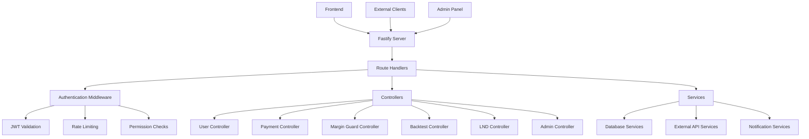

# Internal REST API Endpoints

## Summary

Comprehensive documentation of all internal REST API endpoints in the Axisor backend, organized by functional domains. This document provides detailed information about authentication, request/response schemas, error handling, and usage examples for all available endpoints.

## Architecture



## Authentication

### JWT Token Authentication

All protected endpoints require a valid JWT token in the Authorization header:

```http
Authorization: Bearer <jwt_token>
```

### Token Refresh

```http
POST /api/auth/refresh
Content-Type: application/json

{
  "refreshToken": "refresh_token_here"
}
```

**Response:**
```json
{
  "success": true,
  "accessToken": "new_jwt_token",
  "refreshToken": "new_refresh_token",
  "expiresIn": 3600
}
```

## User Management Endpoints

### User Profile

#### GET /api/user/profile
Get current user profile information.

**Authentication:** Required
**Rate Limit:** 10 req/min

**Response:**
```json
{
  "success": true,
  "user": {
    "id": "user_123",
    "email": "user@example.com",
    "username": "trader123",
    "firstName": "John",
    "lastName": "Doe",
    "plan": "advanced",
    "planExpiresAt": "2025-12-31T23:59:59Z",
    "createdAt": "2024-01-01T00:00:00Z",
    "lastLoginAt": "2025-01-06T10:30:00Z",
    "preferences": {
      "notifications": true,
      "theme": "dark",
      "language": "en",
      "timezone": "UTC"
    },
    "stats": {
      "totalTrades": 150,
      "totalVolume": 50000,
      "winRate": 0.75,
      "profitLoss": 2500.50
    }
  }
}
```

#### PUT /api/user/profile
Update user profile information.

**Authentication:** Required
**Rate Limit:** 5 req/min

**Request:**
```json
{
  "firstName": "John",
  "lastName": "Doe",
  "preferences": {
    "notifications": true,
    "theme": "dark",
    "language": "pt-BR",
    "timezone": "America/Sao_Paulo"
  }
}
```

**Response:**
```json
{
  "success": true,
  "user": {
    "id": "user_123",
    "firstName": "John",
    "lastName": "Doe",
    "preferences": {
      "notifications": true,
      "theme": "dark",
      "language": "pt-BR",
      "timezone": "America/Sao_Paulo"
    },
    "updatedAt": "2025-01-06T10:35:00Z"
  }
}
```

### Multi-Account Management

#### GET /api/user/exchange-accounts
Get user's exchange accounts.

**Authentication:** Required
**Rate Limit:** 10 req/min

**Response:**
```json
{
  "success": true,
  "accounts": [
    {
      "id": "account_123",
      "exchange": "lnmarkets",
      "name": "Main Trading Account",
      "isActive": true,
      "isTestnet": false,
      "credentials": {
        "hasApiKey": true,
        "hasSecret": true,
        "hasPassphrase": true,
        "lastTested": "2025-01-06T10:00:00Z"
      },
      "stats": {
        "totalPositions": 5,
        "totalVolume": 25000,
        "lastActivity": "2025-01-06T09:45:00Z"
      },
      "createdAt": "2024-12-01T00:00:00Z"
    }
  ],
  "limits": {
    "maxAccounts": 5,
    "currentAccounts": 1,
    "planLimits": {
      "free": 1,
      "basic": 3,
      "advanced": 5,
      "pro": 10,
      "lifetime": 15
    }
  }
}
```

#### POST /api/user/exchange-accounts
Create new exchange account.

**Authentication:** Required
**Rate Limit:** 5 req/min

**Request:**
```json
{
  "exchange": "lnmarkets",
  "name": "Testnet Account",
  "credentials": {
    "apiKey": "api_key_here",
    "apiSecret": "api_secret_here",
    "passphrase": "passphrase_here",
    "isTestnet": true
  }
}
```

**Response:**
```json
{
  "success": true,
  "account": {
    "id": "account_456",
    "exchange": "lnmarkets",
    "name": "Testnet Account",
    "isActive": true,
    "isTestnet": true,
    "credentials": {
      "hasApiKey": true,
      "hasSecret": true,
      "hasPassphrase": true,
      "lastTested": null
    },
    "createdAt": "2025-01-06T10:40:00Z"
  }
}
```

## Payment Endpoints

### Lightning Network Payments

#### POST /api/payments/lightning
Create Lightning Network invoice for subscription payment.

**Authentication:** Required
**Rate Limit:** 5 req/min

**Request:**
```json
{
  "plan_type": "advanced"
}
```

**Response:**
```json
{
  "success": true,
  "payment": {
    "id": "payment_789",
    "invoice": "lnbc50u1p3abc123...",
    "amount": 50000,
    "currency": "sats",
    "planType": "advanced",
    "expiresAt": "2025-01-06T11:40:00Z",
    "status": "pending",
    "createdAt": "2025-01-06T10:40:00Z"
  }
}
```

#### GET /api/payments/:id/status
Check payment status.

**Authentication:** Required
**Rate Limit:** 10 req/min

**Response:**
```json
{
  "success": true,
  "payment": {
    "id": "payment_789",
    "status": "completed",
    "amount": 50000,
    "currency": "sats",
    "planType": "advanced",
    "completedAt": "2025-01-06T10:42:00Z",
    "userPlan": {
      "type": "advanced",
      "expiresAt": "2025-02-06T10:42:00Z"
    }
  }
}
```

#### GET /api/payments
Get user payment history.

**Authentication:** Required
**Rate Limit:** 10 req/min

**Query Parameters:**
- `limit` (optional): Number of payments to return (default: 20)

**Response:**
```json
{
  "success": true,
  "payments": [
    {
      "id": "payment_789",
      "amount": 50000,
      "currency": "sats",
      "planType": "advanced",
      "status": "completed",
      "createdAt": "2025-01-06T10:40:00Z",
      "completedAt": "2025-01-06T10:42:00Z"
    }
  ],
  "pagination": {
    "total": 1,
    "limit": 20,
    "offset": 0
  }
}
```

## Margin Guard Endpoints

### Configuration

#### GET /api/user/margin-guard
Get current Margin Guard configuration.

**Authentication:** Required
**Rate Limit:** 10 req/min

**Response:**
```json
{
  "success": true,
  "config": {
    "id": "mg_config_123",
    "isEnabled": true,
    "settings": {
      "distanceThreshold": 0.85,
      "autoCloseEnabled": true,
      "notificationEnabled": true,
      "notificationChannels": ["email", "telegram"],
      "testMode": false
    },
    "planFeatures": {
      "maxPositions": 10,
      "realTimeMonitoring": true,
      "autoClose": true,
      "advancedNotifications": true
    },
    "lastExecution": {
      "timestamp": "2025-01-06T10:30:00Z",
      "action": "notification_sent",
      "positionsChecked": 3,
      "positionsAtRisk": 1
    },
    "createdAt": "2024-12-01T00:00:00Z",
    "updatedAt": "2025-01-06T10:25:00Z"
  }
}
```

#### POST /api/user/margin-guard
Create or update Margin Guard configuration.

**Authentication:** Required
**Rate Limit:** 5 req/min

**Request:**
```json
{
  "isEnabled": true,
  "settings": {
    "distanceThreshold": 0.80,
    "autoCloseEnabled": true,
    "notificationEnabled": true,
    "notificationChannels": ["email", "telegram", "webhook"],
    "testMode": false
  }
}
```

**Response:**
```json
{
  "success": true,
  "config": {
    "id": "mg_config_123",
    "isEnabled": true,
    "settings": {
      "distanceThreshold": 0.80,
      "autoCloseEnabled": true,
      "notificationEnabled": true,
      "notificationChannels": ["email", "telegram", "webhook"],
      "testMode": false
    },
    "updatedAt": "2025-01-06T10:35:00Z"
  }
}
```

#### GET /api/user/margin-guard/positions
Get running positions for Margin Guard monitoring.

**Authentication:** Required
**Rate Limit:** 10 req/min

**Response:**
```json
{
  "success": true,
  "positions": [
    {
      "id": "pos_123",
      "symbol": "BTC_USD",
      "side": "long",
      "size": 1000,
      "entryPrice": 43000,
      "currentPrice": 43500,
      "margin": 100,
      "leverage": 10,
      "pnl": 500,
      "distanceToLiquidation": 0.92,
      "isAtRisk": false,
      "createdAt": "2025-01-06T09:00:00Z"
    }
  ],
  "summary": {
    "totalPositions": 1,
    "positionsAtRisk": 0,
    "totalMargin": 100,
    "totalPnL": 500
  }
}
```

#### POST /api/user/margin-guard/preview
Preview Margin Guard calculation without executing.

**Authentication:** Required
**Rate Limit:** 10 req/min

**Request:**
```json
{
  "positions": ["pos_123"],
  "distanceThreshold": 0.85
}
```

**Response:**
```json
{
  "success": true,
  "preview": {
    "positions": [
      {
        "id": "pos_123",
        "distanceToLiquidation": 0.92,
        "isAtRisk": false,
        "recommendedAction": "none",
        "estimatedTimeToLiquidation": null
      }
    ],
    "summary": {
      "positionsChecked": 1,
      "positionsAtRisk": 0,
      "actionsToExecute": []
    }
  }
}
```

## Backtest Endpoints

### Backtest Execution

#### POST /api/backtests
Execute a new backtest.

**Authentication:** Required
**Rate Limit:** 5 req/min

**Request:**
```json
{
  "startDate": "2024-01-01T00:00:00Z",
  "endDate": "2024-12-31T23:59:59Z",
  "initialBalance": 10000,
  "automationType": "margin_guard",
  "automationConfig": {
    "distanceThreshold": 0.85,
    "autoCloseEnabled": true
  }
}
```

**Response:**
```json
{
  "success": true,
  "backtest": {
    "id": "backtest_456",
    "status": "running",
    "startDate": "2024-01-01T00:00:00Z",
    "endDate": "2024-12-31T23:59:59Z",
    "initialBalance": 10000,
    "automationType": "margin_guard",
    "progress": {
      "current": 0,
      "total": 365,
      "percentage": 0
    },
    "createdAt": "2025-01-06T10:45:00Z"
  }
}
```

#### GET /api/backtests
Get user's backtest history.

**Authentication:** Required
**Rate Limit:** 10 req/min

**Query Parameters:**
- `limit` (optional): Number of backtests to return (default: 10)

**Response:**
```json
{
  "success": true,
  "backtests": [
    {
      "id": "backtest_456",
      "status": "completed",
      "startDate": "2024-01-01T00:00:00Z",
      "endDate": "2024-12-31T23:59:59Z",
      "initialBalance": 10000,
      "finalBalance": 12500,
      "totalReturn": 0.25,
      "maxDrawdown": 0.15,
      "winRate": 0.68,
      "totalTrades": 45,
      "automationType": "margin_guard",
      "createdAt": "2025-01-06T10:45:00Z",
      "completedAt": "2025-01-06T10:50:00Z"
    }
  ],
  "pagination": {
    "total": 1,
    "limit": 10,
    "offset": 0
  }
}
```

#### GET /api/backtests/:id
Get specific backtest result.

**Authentication:** Required
**Rate Limit:** 10 req/min

**Response:**
```json
{
  "success": true,
  "backtest": {
    "id": "backtest_456",
    "status": "completed",
    "configuration": {
      "startDate": "2024-01-01T00:00:00Z",
      "endDate": "2024-12-31T23:59:59Z",
      "initialBalance": 10000,
      "automationType": "margin_guard",
      "automationConfig": {
        "distanceThreshold": 0.85,
        "autoCloseEnabled": true
      }
    },
    "results": {
      "initialBalance": 10000,
      "finalBalance": 12500,
      "totalReturn": 0.25,
      "annualizedReturn": 0.25,
      "maxDrawdown": 0.15,
      "sharpeRatio": 1.85,
      "winRate": 0.68,
      "totalTrades": 45,
      "winningTrades": 31,
      "losingTrades": 14,
      "averageWin": 250,
      "averageLoss": -150,
      "profitFactor": 1.67
    },
    "trades": [
      {
        "timestamp": "2024-01-15T10:30:00Z",
        "symbol": "BTC_USD",
        "side": "long",
        "size": 1000,
        "entryPrice": 42000,
        "exitPrice": 43500,
        "pnl": 150,
        "reason": "margin_guard_auto_close"
      }
    ],
    "equityCurve": [
      {
        "date": "2024-01-01T00:00:00Z",
        "balance": 10000
      }
    ],
    "createdAt": "2025-01-06T10:45:00Z",
    "completedAt": "2025-01-06T10:50:00Z"
  }
}
```

## LND (Lightning Network) Endpoints

### Node Information

#### GET /api/lnd/info
Get LND node information.

**Authentication:** Required
**Rate Limit:** 10 req/min

**Response:**
```json
{
  "success": true,
  "info": {
    "version": "0.17.4-beta",
    "identity_pubkey": "02a1b2c3d4e5f6...",
    "alias": "Axisor-LND-Node",
    "color": "#68F0AE",
    "num_pending_channels": 0,
    "num_active_channels": 5,
    "num_inactive_channels": 1,
    "num_peers": 3,
    "block_height": 2500000,
    "block_hash": "0000000000000000000...",
    "synced_to_chain": true,
    "synced_to_graph": true,
    "testnet": true
  }
}
```

#### GET /api/lnd/wallet/balance
Get wallet balance (on-chain + channels).

**Authentication:** Required
**Rate Limit:** 10 req/min

**Response:**
```json
{
  "success": true,
  "balance": {
    "total_balance": "6000000",
    "confirmed_balance": "950000",
    "unconfirmed_balance": "50000",
    "locked_balance": "0",
    "channel_balance": "5000000"
  }
}
```

### Invoice Management

#### POST /api/lnd/invoices
Create Lightning invoice.

**Authentication:** Required
**Rate Limit:** 10 req/min

**Request:**
```json
{
  "value": 1000,
  "memo": "Payment for services",
  "expiry": 3600
}
```

**Response:**
```json
{
  "success": true,
  "invoice": {
    "payment_request": "lnbc10u1p3abc123...",
    "add_index": "1",
    "payment_addr": "abc123def456...",
    "r_hash": "def456abc789..."
  }
}
```

#### GET /api/lnd/invoices
List Lightning invoices.

**Authentication:** Required
**Rate Limit:** 10 req/min

**Query Parameters:**
- `pending_only` (optional): Only show pending invoices (default: false)
- `limit` (optional): Number of invoices to return (default: 100)

**Response:**
```json
{
  "success": true,
  "invoices": [
    {
      "payment_request": "lnbc10u1p3abc123...",
      "hash": "def456abc789...",
      "value": "1000",
      "creation_date": "1704547200",
      "expiry": "3600",
      "settled": true,
      "amt_paid": "1000",
      "state": "SETTLED"
    }
  ],
  "pagination": {
    "total": 1,
    "limit": 100,
    "offset": 0
  }
}
```

## Admin Endpoints

### System Management

#### GET /api/admin/stats
Get system statistics (admin only).

**Authentication:** Required (Admin)
**Rate Limit:** 10 req/min

**Response:**
```json
{
  "success": true,
  "stats": {
    "users": {
      "total": 1250,
      "active": 890,
      "newToday": 15,
      "byPlan": {
        "free": 500,
        "basic": 300,
        "advanced": 250,
        "pro": 150,
        "lifetime": 50
      }
    },
    "payments": {
      "totalRevenue": 125000,
      "totalTransactions": 450,
      "todayRevenue": 2500,
      "todayTransactions": 8
    },
    "marginGuard": {
      "activeConfigurations": 650,
      "totalExecutions": 12500,
      "positionsProtected": 2500,
      "autoCloses": 150
    },
    "system": {
      "uptime": "99.9%",
      "responseTime": 120,
      "errorRate": 0.01,
      "lastBackup": "2025-01-06T06:00:00Z"
    }
  }
}
```

#### GET /api/admin/users
Get user list (admin only).

**Authentication:** Required (Admin)
**Rate Limit:** 10 req/min

**Query Parameters:**
- `limit` (optional): Number of users to return (default: 50)
- `offset` (optional): Offset for pagination (default: 0)
- `plan` (optional): Filter by plan type
- `status` (optional): Filter by status (active, inactive)

**Response:**
```json
{
  "success": true,
  "users": [
    {
      "id": "user_123",
      "email": "user@example.com",
      "username": "trader123",
      "plan": "advanced",
      "planExpiresAt": "2025-12-31T23:59:59Z",
      "status": "active",
      "createdAt": "2024-01-01T00:00:00Z",
      "lastLoginAt": "2025-01-06T10:30:00Z",
      "stats": {
        "totalPayments": 3,
        "totalVolume": 50000
      }
    }
  ],
  "pagination": {
    "total": 1250,
    "limit": 50,
    "offset": 0
  }
}
```

## Error Handling

### Standard Error Response Format

```json
{
  "success": false,
  "error": {
    "code": "VALIDATION_ERROR",
    "message": "Invalid request parameters",
    "details": [
      {
        "field": "plan_type",
        "message": "Plan type must be one of: basic, advanced, pro, lifetime"
      }
    ]
  },
  "timestamp": "2025-01-06T10:45:00Z",
  "requestId": "req_123456"
}
```

### Common Error Codes

| Code | HTTP Status | Description |
|------|-------------|-------------|
| `VALIDATION_ERROR` | 400 | Request validation failed |
| `AUTHENTICATION_REQUIRED` | 401 | Authentication token required |
| `AUTHENTICATION_FAILED` | 401 | Invalid or expired token |
| `PERMISSION_DENIED` | 403 | Insufficient permissions |
| `RESOURCE_NOT_FOUND` | 404 | Requested resource not found |
| `RATE_LIMIT_EXCEEDED` | 429 | Rate limit exceeded |
| `INTERNAL_SERVER_ERROR` | 500 | Internal server error |
| `SERVICE_UNAVAILABLE` | 503 | Service temporarily unavailable |

## Rate Limiting

### Rate Limit Headers

All responses include rate limiting information:

```http
X-RateLimit-Limit: 10
X-RateLimit-Remaining: 9
X-RateLimit-Reset: 1640995200
```

### Rate Limits by Endpoint Type

| Endpoint Type | Rate Limit | Burst Limit |
|---------------|------------|-------------|
| User Profile | 10 req/min | 20 req/min |
| Payment Operations | 5 req/min | 10 req/min |
| Margin Guard | 10 req/min | 20 req/min |
| Backtest Operations | 5 req/min | 10 req/min |
| LND Operations | 10 req/min | 20 req/min |
| Admin Operations | 10 req/min | 20 req/min |

## Usage Examples

### Complete Payment Flow

```typescript
// 1. Create Lightning invoice
const createPayment = async (planType: string) => {
  const response = await fetch('/api/payments/lightning', {
    method: 'POST',
    headers: {
      'Content-Type': 'application/json',
      'Authorization': `Bearer ${token}`
    },
    body: JSON.stringify({ plan_type: planType })
  });
  
  const data = await response.json();
  return data.payment;
};

// 2. Monitor payment status
const checkPaymentStatus = async (paymentId: string) => {
  const response = await fetch(`/api/payments/${paymentId}/status`, {
    headers: {
      'Authorization': `Bearer ${token}`
    }
  });
  
  const data = await response.json();
  return data.payment;
};

// 3. Complete payment flow
const processPayment = async (planType: string) => {
  try {
    // Create payment
    const payment = await createPayment(planType);
    console.log('Payment created:', payment.invoice);
    
    // Monitor status
    const checkStatus = setInterval(async () => {
      const status = await checkPaymentStatus(payment.id);
      
      if (status.status === 'completed') {
        clearInterval(checkStatus);
        console.log('Payment completed!');
        console.log('New plan:', status.userPlan);
      } else if (status.status === 'expired') {
        clearInterval(checkStatus);
        console.log('Payment expired');
      }
    }, 5000);
    
  } catch (error) {
    console.error('Payment error:', error);
  }
};
```

### Margin Guard Configuration

```typescript
// Configure Margin Guard
const configureMarginGuard = async (settings: any) => {
  const response = await fetch('/api/user/margin-guard', {
    method: 'POST',
    headers: {
      'Content-Type': 'application/json',
      'Authorization': `Bearer ${token}`
    },
    body: JSON.stringify({
      isEnabled: true,
      settings
    })
  });
  
  const data = await response.json();
  return data.config;
};

// Preview Margin Guard calculation
const previewMarginGuard = async (positions: string[], threshold: number) => {
  const response = await fetch('/api/user/margin-guard/preview', {
    method: 'POST',
    headers: {
      'Content-Type': 'application/json',
      'Authorization': `Bearer ${token}`
    },
    body: JSON.stringify({
      positions,
      distanceThreshold: threshold
    })
  });
  
  const data = await response.json();
  return data.preview;
};
```

## Best Practices

### 1. Error Handling

- Always check response status before processing data
- Implement retry logic for transient errors
- Handle rate limiting gracefully
- Log errors for debugging

### 2. Authentication

- Store JWT tokens securely
- Implement token refresh logic
- Handle authentication failures
- Use HTTPS for all requests

### 3. Performance

- Implement request caching where appropriate
- Use pagination for large data sets
- Minimize API calls
- Handle loading states

### 4. Security

- Never expose API keys in client-side code
- Validate all user inputs
- Use HTTPS for all communications
- Implement proper CORS policies

## How to Use This Document

- **For API Integration**: Reference endpoint details and request/response schemas
- **For Error Handling**: Use standard error response formats and error codes
- **For Authentication**: Follow JWT token authentication patterns
- **For Rate Limiting**: Implement proper rate limiting handling
- **For Testing**: Use the usage examples for API testing and integration

