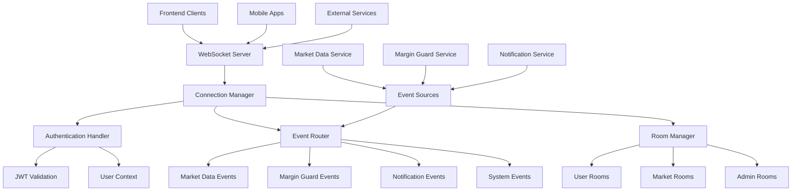

# WebSocket Events API

## Summary

Comprehensive documentation for WebSocket real-time events API in the Axisor platform, covering connection management, event types, authentication, and client implementation patterns. This document provides complete integration guidance for real-time data streaming and notifications.

## Architecture



## Connection Management

### WebSocket Endpoint

**URL:** `wss://api.axisor.com/ws`

### Connection Authentication

```typescript
// Connect with JWT token
const ws = new WebSocket('wss://api.axisor.com/ws', {
  headers: {
    'Authorization': `Bearer ${jwtToken}`
  }
});

// Alternative: Send auth after connection
ws.onopen = () => {
  ws.send(JSON.stringify({
    type: 'auth',
    token: jwtToken
  }));
};
```

### Connection Response

```json
{
  "type": "connection",
  "status": "connected",
  "userId": "user_123",
  "sessionId": "session_456",
  "serverTime": "2025-01-06T10:30:00Z"
}
```

### Connection States

```typescript
enum ConnectionState {
  CONNECTING = 'connecting',
  CONNECTED = 'connected',
  AUTHENTICATED = 'authenticated',
  DISCONNECTED = 'disconnected',
  ERROR = 'error'
}
```

## Event Types

### 1. Market Data Events

#### Market Data Update
**Event:** `market_data_update`

```json
{
  "type": "market_data_update",
  "channel": "market_data",
  "data": {
    "symbol": "BTC_USD",
    "price": 43250.50,
    "change": -1249.50,
    "changePercent": -2.81,
    "volume": 1250000.00,
    "high24h": 44500.00,
    "low24h": 42800.00,
    "timestamp": "2025-01-06T10:30:00Z"
  }
}
```

#### Historical Data Update
**Event:** `historical_data_update`

```json
{
  "type": "historical_data_update",
  "channel": "historical_data",
  "data": {
    "symbol": "BTC_USD",
    "timeframe": "1h",
    "candles": [
      {
        "time": 1704547200,
        "open": 43000,
        "high": 43500,
        "low": 42800,
        "close": 43250,
        "volume": 1000000
      }
    ],
    "timestamp": "2025-01-06T10:30:00Z"
  }
}
```

#### Price Alert
**Event:** `price_alert`

```json
{
  "type": "price_alert",
  "channel": "alerts",
  "data": {
    "id": "alert_123",
    "symbol": "BTC_USD",
    "condition": "above",
    "price": 45000,
    "currentPrice": 45200,
    "triggeredAt": "2025-01-06T10:30:00Z"
  }
}
```

### 2. Margin Guard Events

#### Margin Guard Execution
**Event:** `margin_guard_execution`

```json
{
  "type": "margin_guard_execution",
  "channel": "margin_guard",
  "data": {
    "executionId": "mg_exec_123",
    "userId": "user_123",
    "action": "notification_sent",
    "positions": [
      {
        "id": "pos_123",
        "symbol": "BTC_USD",
        "distanceToLiquidation": 0.82,
        "isAtRisk": true,
        "recommendedAction": "close_position"
      }
    ],
    "summary": {
      "positionsChecked": 3,
      "positionsAtRisk": 1,
      "actionsExecuted": ["notification_sent"]
    },
    "executedAt": "2025-01-06T10:30:00Z"
  }
}
```

#### Position Status Update
**Event:** `position_status_update`

```json
{
  "type": "position_status_update",
  "channel": "positions",
  "data": {
    "userId": "user_123",
    "position": {
      "id": "pos_123",
      "symbol": "BTC_USD",
      "side": "long",
      "size": 1000,
      "entryPrice": 43000,
      "currentPrice": 43500,
      "margin": 100,
      "leverage": 10,
      "pnl": 500,
      "distanceToLiquidation": 0.92,
      "isAtRisk": false,
      "updatedAt": "2025-01-06T10:30:00Z"
    }
  }
}
```

#### Auto-Close Execution
**Event:** `auto_close_execution`

```json
{
  "type": "auto_close_execution",
  "channel": "margin_guard",
  "data": {
    "executionId": "auto_close_123",
    "userId": "user_123",
    "position": {
      "id": "pos_123",
      "symbol": "BTC_USD",
      "closedAt": "2025-01-06T10:30:00Z",
      "reason": "margin_guard_auto_close",
      "pnl": -150
    },
    "executedAt": "2025-01-06T10:30:00Z"
  }
}
```

### 3. Notification Events

#### In-App Notification
**Event:** `in_app_notification`

```json
{
  "type": "in_app_notification",
  "channel": "notifications",
  "data": {
    "id": "notif_123",
    "userId": "user_123",
    "title": "Margin Guard Alert",
    "message": "Position BTC_USD is at risk of liquidation",
    "type": "warning",
    "category": "margin_guard",
    "data": {
      "positionId": "pos_123",
      "distanceToLiquidation": 0.82
    },
    "read": false,
    "createdAt": "2025-01-06T10:30:00Z"
  }
}
```

#### Notification Status Update
**Event:** `notification_status_update`

```json
{
  "type": "notification_status_update",
  "channel": "notifications",
  "data": {
    "id": "notif_123",
    "status": "delivered",
    "deliveredAt": "2025-01-06T10:30:05Z",
    "deliveryMethod": "email"
  }
}
```

### 4. System Events

#### Server Maintenance
**Event:** `server_maintenance`

```json
{
  "type": "server_maintenance",
  "channel": "system",
  "data": {
    "scheduled": true,
    "startTime": "2025-01-07T02:00:00Z",
    "endTime": "2025-01-07T04:00:00Z",
    "message": "Scheduled maintenance will begin in 2 hours"
  }
}
```

#### Service Status Update
**Event:** `service_status_update`

```json
{
  "type": "service_status_update",
  "channel": "system",
  "data": {
    "service": "margin_guard",
    "status": "degraded",
    "message": "Margin Guard service experiencing delays",
    "estimatedRecovery": "2025-01-06T11:00:00Z",
    "updatedAt": "2025-01-06T10:30:00Z"
  }
}
```

## Room Management

### Room Types

#### User Rooms
- **Pattern:** `user:{userId}`
- **Purpose:** User-specific events and notifications
- **Auto-join:** Yes, on authentication

#### Market Data Rooms
- **Pattern:** `market:{symbol}`
- **Purpose:** Symbol-specific market data
- **Auto-join:** No, manual subscription required

#### Admin Rooms
- **Pattern:** `admin:{level}`
- **Purpose:** Administrative notifications
- **Auto-join:** Yes, for admin users

### Room Subscription

```typescript
// Subscribe to room
ws.send(JSON.stringify({
  type: 'subscribe',
  channel: 'market:BTC_USD'
}));

// Unsubscribe from room
ws.send(JSON.stringify({
  type: 'unsubscribe',
  channel: 'market:BTC_USD'
}));

// List subscribed rooms
ws.send(JSON.stringify({
  type: 'list_rooms'
}));
```

### Room Response

```json
{
  "type": "room_subscription",
  "channel": "market:BTC_USD",
  "status": "subscribed",
  "subscribedRooms": [
    "user:user_123",
    "market:BTC_USD"
  ]
}
```

## Client Implementation

### WebSocket Client Class

```typescript
class AxisorWebSocketClient {
  private ws: WebSocket | null = null;
  private reconnectAttempts = 0;
  private maxReconnectAttempts = 5;
  private reconnectDelay = 1000;
  private eventHandlers = new Map<string, Set<Function>>();
  private subscribedRooms = new Set<string>();
  private connectionState: ConnectionState = ConnectionState.DISCONNECTED;

  constructor(
    private url: string,
    private token: string,
    private options: WebSocketOptions = {}
  ) {
    this.maxReconnectAttempts = options.maxReconnectAttempts || 5;
    this.reconnectDelay = options.reconnectDelay || 1000;
  }

  connect(): Promise<void> {
    return new Promise((resolve, reject) => {
      try {
        this.ws = new WebSocket(this.url);
        this.connectionState = ConnectionState.CONNECTING;

        this.ws.onopen = () => {
          this.connectionState = ConnectionState.CONNECTED;
          this.reconnectAttempts = 0;
          
          // Authenticate
          this.ws!.send(JSON.stringify({
            type: 'auth',
            token: this.token
          }));
        };

        this.ws.onmessage = (event) => {
          this.handleMessage(event);
        };

        this.ws.onclose = (event) => {
          this.connectionState = ConnectionState.DISCONNECTED;
          this.handleReconnect();
        };

        this.ws.onerror = (error) => {
          this.connectionState = ConnectionState.ERROR;
          reject(error);
        };

        // Handle authentication response
        this.on('connection', (data) => {
          if (data.status === 'connected') {
            this.connectionState = ConnectionState.AUTHENTICATED;
            this.resubscribeToRooms();
            resolve();
          } else {
            reject(new Error('Authentication failed'));
          }
        });

      } catch (error) {
        reject(error);
      }
    });
  }

  private handleMessage(event: MessageEvent): void {
    try {
      const message = JSON.parse(event.data);
      this.emit(message.type, message);
    } catch (error) {
      console.error('Failed to parse WebSocket message:', error);
    }
  }

  private handleReconnect(): void {
    if (this.reconnectAttempts >= this.maxReconnectAttempts) {
      console.error('Max reconnection attempts reached');
      return;
    }

    this.reconnectAttempts++;
    const delay = this.reconnectDelay * Math.pow(2, this.reconnectAttempts - 1);

    setTimeout(() => {
      console.log(`Reconnecting... (attempt ${this.reconnectAttempts})`);
      this.connect();
    }, delay);
  }

  private resubscribeToRooms(): void {
    this.subscribedRooms.forEach(room => {
      this.subscribe(room);
    });
  }

  // Event handling
  on(event: string, handler: Function): void {
    if (!this.eventHandlers.has(event)) {
      this.eventHandlers.set(event, new Set());
    }
    this.eventHandlers.get(event)!.add(handler);
  }

  off(event: string, handler: Function): void {
    const handlers = this.eventHandlers.get(event);
    if (handlers) {
      handlers.delete(handler);
    }
  }

  private emit(event: string, data: any): void {
    const handlers = this.eventHandlers.get(event);
    if (handlers) {
      handlers.forEach(handler => {
        try {
          handler(data);
        } catch (error) {
          console.error('Event handler error:', error);
        }
      });
    }
  }

  // Room management
  subscribe(channel: string): void {
    if (this.ws && this.connectionState === ConnectionState.AUTHENTICATED) {
      this.ws.send(JSON.stringify({
        type: 'subscribe',
        channel
      }));
      this.subscribedRooms.add(channel);
    }
  }

  unsubscribe(channel: string): void {
    if (this.ws && this.connectionState === ConnectionState.AUTHENTICATED) {
      this.ws.send(JSON.stringify({
        type: 'unsubscribe',
        channel
      }));
      this.subscribedRooms.delete(channel);
    }
  }

  // Utility methods
  send(data: any): void {
    if (this.ws && this.connectionState === ConnectionState.AUTHENTICATED) {
      this.ws.send(JSON.stringify(data));
    }
  }

  disconnect(): void {
    if (this.ws) {
      this.ws.close();
      this.ws = null;
      this.connectionState = ConnectionState.DISCONNECTED;
    }
  }

  getConnectionState(): ConnectionState {
    return this.connectionState;
  }
}

interface WebSocketOptions {
  maxReconnectAttempts?: number;
  reconnectDelay?: number;
}
```

### React Hook for WebSocket

```typescript
export function useWebSocket(
  url: string,
  token: string,
  options: WebSocketOptions = {}
) {
  const [client, setClient] = useState<AxisorWebSocketClient | null>(null);
  const [connectionState, setConnectionState] = useState<ConnectionState>(
    ConnectionState.DISCONNECTED
  );
  const [error, setError] = useState<Error | null>(null);

  useEffect(() => {
    const wsClient = new AxisorWebSocketClient(url, token, options);
    
    wsClient.on('connection', (data) => {
      setConnectionState(data.status === 'connected' ? 
        ConnectionState.AUTHENTICATED : 
        ConnectionState.CONNECTED
      );
    });

    wsClient.on('error', (err) => {
      setError(err);
    });

    wsClient.connect()
      .then(() => {
        setClient(wsClient);
        setError(null);
      })
      .catch((err) => {
        setError(err);
      });

    return () => {
      wsClient.disconnect();
    };
  }, [url, token]);

  const subscribe = useCallback((channel: string) => {
    client?.subscribe(channel);
  }, [client]);

  const unsubscribe = useCallback((channel: string) => {
    client?.unsubscribe(channel);
  }, [client]);

  const send = useCallback((data: any) => {
    client?.send(data);
  }, [client]);

  return {
    client,
    connectionState,
    error,
    subscribe,
    unsubscribe,
    send,
    isConnected: connectionState === ConnectionState.AUTHENTICATED
  };
}
```

## Usage Examples

### Market Data Streaming

```typescript
// Connect and subscribe to market data
const wsClient = new AxisorWebSocketClient(
  'wss://api.axisor.com/ws',
  jwtToken
);

await wsClient.connect();

// Subscribe to BTC market data
wsClient.subscribe('market:BTC_USD');

// Handle market data updates
wsClient.on('market_data_update', (data) => {
  console.log('Price update:', data.data.price);
  updateChart(data.data);
});

wsClient.on('historical_data_update', (data) => {
  console.log('Historical data:', data.data.candles);
  updateHistoricalChart(data.data.candles);
});
```

### Margin Guard Monitoring

```typescript
// Subscribe to margin guard events
wsClient.subscribe('margin_guard');
wsClient.subscribe('positions');

// Handle margin guard executions
wsClient.on('margin_guard_execution', (data) => {
  console.log('Margin Guard executed:', data.data.action);
  
  if (data.data.action === 'notification_sent') {
    showNotification('Margin Guard Alert', 'Positions at risk detected');
  }
});

// Handle position updates
wsClient.on('position_status_update', (data) => {
  console.log('Position updated:', data.data.position);
  updatePositionDisplay(data.data.position);
});

// Handle auto-close executions
wsClient.on('auto_close_execution', (data) => {
  console.log('Position auto-closed:', data.data.position);
  showNotification('Position Closed', 'Position was automatically closed by Margin Guard');
});
```

### Notification System

```typescript
// Subscribe to notifications
wsClient.subscribe('notifications');

// Handle in-app notifications
wsClient.on('in_app_notification', (data) => {
  const notification = data.data;
  
  // Show notification in UI
  showInAppNotification({
    id: notification.id,
    title: notification.title,
    message: notification.message,
    type: notification.type,
    data: notification.data
  });
  
  // Mark as read if needed
  if (notification.category === 'system') {
    markNotificationAsRead(notification.id);
  }
});

// Handle notification status updates
wsClient.on('notification_status_update', (data) => {
  console.log('Notification delivered:', data.data.status);
  updateNotificationStatus(data.data.id, data.data.status);
});
```

### Real-time Dashboard

```typescript
// Dashboard component with WebSocket integration
const Dashboard: React.FC = () => {
  const { client, isConnected, subscribe, unsubscribe } = useWebSocket(
    'wss://api.axisor.com/ws',
    jwtToken
  );

  const [marketData, setMarketData] = useState<MarketData | null>(null);
  const [positions, setPositions] = useState<Position[]>([]);
  const [notifications, setNotifications] = useState<Notification[]>([]);

  useEffect(() => {
    if (isConnected) {
      // Subscribe to all relevant channels
      subscribe('market:BTC_USD');
      subscribe('positions');
      subscribe('notifications');
      subscribe('margin_guard');
    }

    return () => {
      if (isConnected) {
        unsubscribe('market:BTC_USD');
        unsubscribe('positions');
        unsubscribe('notifications');
        unsubscribe('margin_guard');
      }
    };
  }, [isConnected, subscribe, unsubscribe]);

  useEffect(() => {
    if (!client) return;

    // Market data handler
    const handleMarketData = (data: any) => {
      setMarketData(data.data);
    };

    // Position update handler
    const handlePositionUpdate = (data: any) => {
      setPositions(prev => 
        prev.map(pos => 
          pos.id === data.data.position.id ? data.data.position : pos
        )
      );
    };

    // Notification handler
    const handleNotification = (data: any) => {
      setNotifications(prev => [data.data, ...prev]);
    };

    // Register event handlers
    client.on('market_data_update', handleMarketData);
    client.on('position_status_update', handlePositionUpdate);
    client.on('in_app_notification', handleNotification);

    return () => {
      client.off('market_data_update', handleMarketData);
      client.off('position_status_update', handlePositionUpdate);
      client.off('in_app_notification', handleNotification);
    };
  }, [client]);

  return (
    <div className="dashboard">
      <div className="connection-status">
        Status: {isConnected ? 'Connected' : 'Disconnected'}
      </div>
      
      <MarketDataWidget data={marketData} />
      <PositionsWidget positions={positions} />
      <NotificationsWidget notifications={notifications} />
    </div>
  );
};
```

## Error Handling

### Connection Errors

```typescript
// Handle connection errors
wsClient.on('error', (error) => {
  console.error('WebSocket error:', error);
  
  switch (error.code) {
    case 'AUTHENTICATION_FAILED':
      // Redirect to login
      redirectToLogin();
      break;
    case 'RATE_LIMIT_EXCEEDED':
      // Show rate limit message
      showRateLimitMessage();
      break;
    case 'INVALID_ROOM':
      // Handle invalid room subscription
      console.warn('Invalid room subscription:', error.message);
      break;
    default:
      // Generic error handling
      showErrorMessage('Connection error occurred');
  }
});
```

### Reconnection Strategy

```typescript
class WebSocketReconnectionManager {
  private reconnectAttempts = 0;
  private maxAttempts = 5;
  private baseDelay = 1000;
  private maxDelay = 30000;

  async reconnect(client: AxisorWebSocketClient): Promise<void> {
    if (this.reconnectAttempts >= this.maxAttempts) {
      throw new Error('Max reconnection attempts reached');
    }

    this.reconnectAttempts++;
    const delay = Math.min(
      this.baseDelay * Math.pow(2, this.reconnectAttempts - 1),
      this.maxDelay
    );

    await new Promise(resolve => setTimeout(resolve, delay));
    
    try {
      await client.connect();
      this.reconnectAttempts = 0;
    } catch (error) {
      console.error(`Reconnection attempt ${this.reconnectAttempts} failed:`, error);
      await this.reconnect(client);
    }
  }

  reset(): void {
    this.reconnectAttempts = 0;
  }
}
```

## Performance Optimization

### Message Batching

```typescript
class MessageBatcher {
  private batch: any[] = [];
  private batchSize = 10;
  private batchTimeout = 100; // ms
  private timeoutId: NodeJS.Timeout | null = null;

  add(message: any): void {
    this.batch.push(message);
    
    if (this.batch.length >= this.batchSize) {
      this.flush();
    } else if (!this.timeoutId) {
      this.timeoutId = setTimeout(() => this.flush(), this.batchTimeout);
    }
  }

  private flush(): void {
    if (this.batch.length > 0) {
      // Process batch
      this.processBatch(this.batch);
      this.batch = [];
    }
    
    if (this.timeoutId) {
      clearTimeout(this.timeoutId);
      this.timeoutId = null;
    }
  }

  private processBatch(batch: any[]): void {
    // Process batched messages
    console.log('Processing batch of', batch.length, 'messages');
  }
}
```

### Connection Pooling

```typescript
class WebSocketPool {
  private connections = new Map<string, AxisorWebSocketClient>();
  private maxConnections = 5;

  getConnection(key: string, url: string, token: string): AxisorWebSocketClient {
    if (this.connections.has(key)) {
      return this.connections.get(key)!;
    }

    if (this.connections.size >= this.maxConnections) {
      this.closeOldestConnection();
    }

    const client = new AxisorWebSocketClient(url, token);
    this.connections.set(key, client);
    return client;
  }

  private closeOldestConnection(): void {
    const [oldestKey] = this.connections.keys();
    const client = this.connections.get(oldestKey);
    if (client) {
      client.disconnect();
      this.connections.delete(oldestKey);
    }
  }

  closeAll(): void {
    this.connections.forEach(client => client.disconnect());
    this.connections.clear();
  }
}
```

## Security Considerations

### Authentication

- Always use JWT tokens for authentication
- Implement token refresh logic
- Validate tokens on server side
- Handle authentication failures gracefully

### Rate Limiting

- Implement client-side rate limiting
- Respect server-side rate limits
- Handle rate limit errors appropriately
- Use exponential backoff for reconnections

### Data Validation

- Validate all incoming messages
- Sanitize user inputs
- Implement message size limits
- Handle malformed messages gracefully

## How to Use This Document

- **For Connection Setup**: Follow the WebSocket client implementation patterns
- **For Event Handling**: Use the event type definitions and examples
- **For Room Management**: Reference the room subscription patterns
- **For Error Handling**: Implement the error handling strategies
- **For Performance**: Use the optimization techniques for better performance

