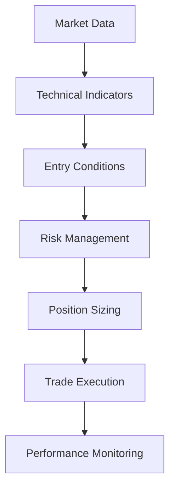

# Getting Started

## Welcome to Axisor

Welcome to Axisor, the comprehensive trading automation platform designed specifically for LN Markets. This guide will help you get started with the platform, from initial setup to creating your first trading automation.

## What is Axisor?

Axisor is a sophisticated trading automation platform that provides:

- **Margin Guard System**: Real-time margin protection with automated actions
- **Trading Automation**: Advanced strategy creation and execution
- **Market Simulation**: Comprehensive backtesting and simulation capabilities
- **User Management**: Secure account management and subscription plans
- **Analytics**: Detailed performance tracking and reporting

## Quick Start Guide

### Step 1: Account Setup

#### Registration
1. Visit the Axisor platform website
2. Click "Sign Up" to create your account
3. Enter your email address and create a secure password
4. Verify your email address through the confirmation link
5. Complete your profile information

#### Account Verification
- **Email Verification**: Required for account activation
- **Identity Verification**: May be required for certain features
- **Payment Information**: Required for subscription plans

### Step 2: Platform Navigation

#### Main Dashboard
The main dashboard provides an overview of your trading activities:

- **Account Overview**: Current balance, margin status, and performance
- **Active Strategies**: Running trading strategies and their status
- **Recent Activity**: Latest trades, alerts, and system notifications
- **Quick Actions**: Shortcuts to common tasks

#### Navigation Menu
- **Dashboard**: Main overview and quick access
- **Trading**: Strategy creation and management
- **Simulation**: Backtesting and market simulation
- **Analytics**: Performance analysis and reporting
- **Settings**: Account and platform configuration

### Step 3: First Trading Strategy

#### Creating a Simple Strategy
1. Navigate to the Trading section
2. Click "Create New Strategy"
3. Choose from predefined templates or start from scratch
4. Configure basic parameters:
   - **Entry Conditions**: When to enter trades
   - **Exit Conditions**: When to exit trades
   - **Risk Management**: Stop loss and take profit levels
   - **Position Sizing**: How much to invest per trade

#### Strategy Configuration
```typescript
// Example: Simple Moving Average Strategy
interface SimpleStrategy {
  name: "Moving Average Crossover";
  description: "Buy when short MA crosses above long MA";
  parameters: {
    shortMA: 20; // Short moving average period
    longMA: 50;  // Long moving average period
    positionSize: 0.1; // 10% of available balance
    stopLoss: 0.02; // 2% stop loss
    takeProfit: 0.04; // 4% take profit
  };
}
```

### Step 4: Testing Your Strategy

#### Backtesting
Before using real money, test your strategy with historical data:

1. Go to the Simulation section
2. Select your strategy
3. Choose a historical period
4. Run the backtest
5. Analyze the results

#### Simulation Results
- **Performance Metrics**: Return, Sharpe ratio, maximum drawdown
- **Trade Analysis**: Individual trade performance
- **Risk Metrics**: Risk-adjusted returns and volatility
- **Visual Charts**: Performance visualization

### Step 5: Setting Up Margin Guard

#### Margin Guard Configuration
Protect your account from margin calls:

1. Navigate to Settings > Margin Guard
2. Configure protection parameters:
   - **Margin Threshold**: Warning level (e.g., 80%)
   - **Protection Actions**: What to do when threshold is reached
   - **Notification Channels**: How to receive alerts

#### Protection Actions
- **Alert Only**: Send notifications without taking action
- **Reduce Position**: Automatically reduce position size
- **Close Position**: Close the position entirely
- **Emergency Stop**: Stop all trading activities

## Platform Features Overview

### Trading Automation

#### Strategy Types
- **Technical Analysis**: Moving averages, RSI, MACD, etc.
- **Price Action**: Support/resistance, breakouts, patterns
- **Market Sentiment**: News analysis, social sentiment
- **Custom Strategies**: Build your own using our strategy builder

#### Strategy Builder
The visual strategy builder allows you to create complex strategies:



#### Risk Management
- **Stop Loss**: Automatic loss limitation
- **Take Profit**: Automatic profit taking
- **Position Sizing**: Dynamic position sizing based on account balance
- **Maximum Drawdown**: Protection against large losses

### Market Simulation

#### Simulation Types
- **Historical Backtesting**: Test strategies against past market data
- **Real-time Simulation**: Live simulation with virtual funds
- **Monte Carlo**: Statistical simulation with multiple scenarios
- **Walk-forward Analysis**: Out-of-sample testing

#### Market Scenarios
- **Bull Market**: Rising market conditions
- **Bear Market**: Declining market conditions
- **Sideways Market**: Range-bound market conditions
- **Volatile Market**: High volatility conditions

### Analytics and Reporting

#### Performance Metrics
- **Total Return**: Overall strategy performance
- **Sharpe Ratio**: Risk-adjusted returns
- **Maximum Drawdown**: Largest peak-to-trough decline
- **Win Rate**: Percentage of profitable trades
- **Average Trade**: Average profit/loss per trade

#### Reporting Features
- **Daily Reports**: Daily performance summaries
- **Monthly Reports**: Monthly performance analysis
- **Custom Reports**: User-defined report generation
- **Export Options**: CSV, PDF, and other formats

## Security and Privacy

### Account Security
- **Two-Factor Authentication**: Enhanced security for your account
- **Secure Password**: Strong password requirements
- **Session Management**: Automatic session timeout
- **Login Monitoring**: Track account access and activity

### Data Protection
- **Encryption**: All data encrypted in transit and at rest
- **Privacy Controls**: Control over your personal information
- **Data Retention**: Clear data retention policies
- **GDPR Compliance**: Full compliance with data protection regulations

### API Security
- **API Keys**: Secure API key management
- **Rate Limiting**: Protection against abuse
- **IP Whitelisting**: Restrict API access by IP address
- **Audit Logging**: Complete audit trail of API usage

## Support and Resources

### Getting Help
- **Documentation**: Comprehensive user guides and API documentation
- **Video Tutorials**: Step-by-step video guides
- **Community Forum**: Connect with other users
- **Support Team**: Direct support via email and chat

### Learning Resources
- **Trading Education**: Learn about trading strategies and risk management
- **Platform Tutorials**: Platform-specific guides and tips
- **Best Practices**: Recommended practices for successful trading
- **Case Studies**: Real-world examples and success stories

### Community
- **User Forum**: Share experiences and get help from other users
- **Strategy Library**: Browse and share trading strategies
- **Market Discussion**: Discuss market conditions and trends
- **Feature Requests**: Suggest new features and improvements

## Next Steps

### Beginner Path
1. **Complete Tutorial**: Go through the platform tutorial
2. **Create First Strategy**: Build a simple moving average strategy
3. **Backtest Strategy**: Test your strategy with historical data
4. **Set Up Margin Guard**: Configure account protection
5. **Start Small**: Begin with small position sizes

### Intermediate Path
1. **Advanced Strategies**: Explore more complex strategy types
2. **Custom Indicators**: Create your own technical indicators
3. **Portfolio Management**: Manage multiple strategies
4. **Performance Optimization**: Optimize strategy parameters
5. **Risk Management**: Implement advanced risk controls

### Advanced Path
1. **API Integration**: Use the API for custom integrations
2. **Machine Learning**: Incorporate ML-based strategies
3. **Multi-Asset Trading**: Trade across multiple assets
4. **Institutional Features**: Access enterprise-level features
5. **White-label Solutions**: Customize the platform for your needs

## Troubleshooting

### Common Issues
- **Login Problems**: Check email verification and password
- **Strategy Not Working**: Verify strategy configuration and market conditions
- **API Errors**: Check API key and rate limits
- **Performance Issues**: Monitor system resources and network connection

### Getting Support
- **Help Center**: Search our knowledge base for answers
- **Contact Support**: Reach out to our support team
- **Community Forum**: Ask questions in the community
- **Status Page**: Check system status and updates

## Conclusion

This getting started guide provides the foundation for using Axisor effectively. As you become more familiar with the platform, explore the advanced features and capabilities to maximize your trading automation potential.

Remember to always:
- Start with small position sizes
- Test strategies thoroughly before live trading
- Use proper risk management
- Keep learning and improving your strategies
- Stay informed about market conditions

Welcome to Axisor, and happy trading!
