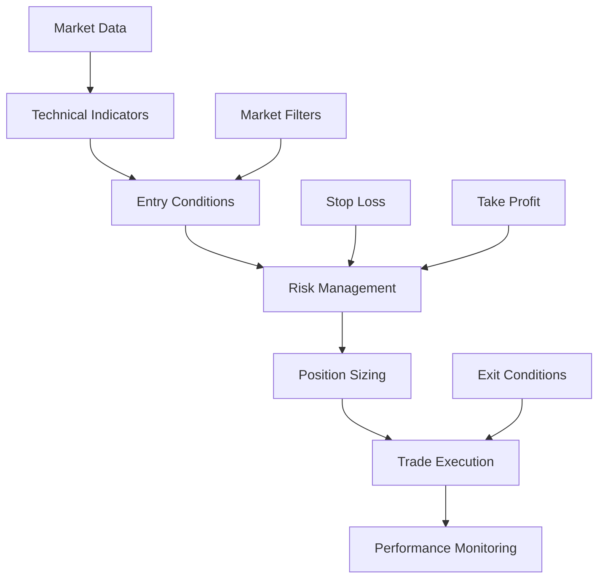

# Strategy Building

## Overview

This document provides a comprehensive guide to building trading strategies in the Axisor platform. It covers strategy design principles, implementation techniques, testing methodologies, and optimization strategies to help you create effective automated trading systems.

## Strategy Design Principles

### Core Principles

#### Strategy Foundation
```typescript
// Strategy Design Principles
interface StrategyPrinciples {
  clarity: {
    objective: "Clear and specific trading objective";
    rules: "Well-defined entry and exit rules";
    parameters: "Clearly defined strategy parameters";
    logic: "Logical and testable strategy logic";
  };
  simplicity: {
    complexity: "Start simple, add complexity gradually";
    components: "Minimize number of strategy components";
    parameters: "Limit number of adjustable parameters";
    maintenance: "Easy to understand and maintain";
  };
  robustness: {
    market_conditions: "Works across different market conditions";
    timeframes: "Consistent across different timeframes";
    parameters: "Stable across parameter variations";
    validation: "Thoroughly tested and validated";
  };
}
```

#### Strategy Components
- **Entry Logic**: Conditions for opening positions
- **Exit Logic**: Conditions for closing positions
- **Risk Management**: Position sizing and risk controls
- **Market Filters**: Conditions that must be met before trading
- **Performance Monitoring**: Metrics to track strategy performance

### Strategy Types

#### Trend Following Strategies

**Moving Average Crossover**
```typescript
// Moving Average Crossover Strategy
interface MovingAverageCrossover {
  concept: "Buy when short MA crosses above long MA, sell when it crosses below";
  parameters: {
    shortPeriod: number; // Short moving average period
    longPeriod: number;  // Long moving average period
    positionSize: number; // Position size as percentage of account
  };
  entry: {
    long: "Short MA > Long MA AND previous Short MA <= previous Long MA";
    short: "Short MA < Long MA AND previous Short MA >= previous Long MA";
  };
  exit: {
    long: "Short MA < Long MA OR stop loss hit";
    short: "Short MA > Long MA OR stop loss hit";
  };
  advantages: "Simple, trend-following, works in trending markets";
  disadvantages: "Lags price action, whipsaws in sideways markets";
}
```

**MACD Strategy**
```typescript
// MACD Strategy
interface MACDStrategy {
  concept: "Buy when MACD line crosses above signal line, sell when it crosses below";
  parameters: {
    fastPeriod: number; // Fast EMA period
    slowPeriod: number; // Slow EMA period
    signalPeriod: number; // Signal line EMA period
    positionSize: number; // Position size
  };
  entry: {
    long: "MACD > Signal AND previous MACD <= previous Signal";
    short: "MACD < Signal AND previous MACD >= previous Signal";
  };
  exit: {
    long: "MACD < Signal OR stop loss hit";
    short: "MACD > Signal OR stop loss hit";
  };
  advantages: "Trend and momentum confirmation, reduces false signals";
  disadvantages: "Still lags price action, can miss early trend changes";
}
```

#### Mean Reversion Strategies

**RSI Mean Reversion**
```typescript
// RSI Mean Reversion Strategy
interface RSIMeanReversion {
  concept: "Buy when RSI is oversold, sell when RSI is overbought";
  parameters: {
    rsiPeriod: number; // RSI calculation period
    oversoldLevel: number; // Oversold threshold (e.g., 30)
    overboughtLevel: number; // Overbought threshold (e.g., 70)
    positionSize: number; // Position size
  };
  entry: {
    long: "RSI < oversoldLevel AND RSI rising";
    short: "RSI > overboughtLevel AND RSI falling";
  };
  exit: {
    long: "RSI > 50 OR take profit hit";
    short: "RSI < 50 OR take profit hit";
  };
  advantages: "Works well in ranging markets, clear entry/exit signals";
  disadvantages: "Can fail in strong trends, requires market regime detection";
}
```

**Bollinger Bands Strategy**
```typescript
// Bollinger Bands Strategy
interface BollingerBandsStrategy {
  concept: "Buy when price touches lower band, sell when price touches upper band";
  parameters: {
    period: number; // Moving average period
    stdDev: number; // Standard deviation multiplier
    positionSize: number; // Position size
  };
  entry: {
    long: "Price touches lower band AND price starts rising";
    short: "Price touches upper band AND price starts falling";
  };
  exit: {
    long: "Price reaches middle band OR take profit hit";
    short: "Price reaches middle band OR take profit hit";
  };
  advantages: "Adapts to volatility, clear support/resistance levels";
  disadvantages: "Can fail in trending markets, requires trend filter";
}
```

#### Momentum Strategies

**Breakout Strategy**
```typescript
// Breakout Strategy
interface BreakoutStrategy {
  concept: "Buy when price breaks above resistance, sell when price breaks below support";
  parameters: {
    lookbackPeriod: number; // Period to calculate support/resistance
    breakoutThreshold: number; // Minimum breakout size
    positionSize: number; // Position size
  };
  entry: {
    long: "Price > highest(high, lookbackPeriod) + breakoutThreshold";
    short: "Price < lowest(low, lookbackPeriod) - breakoutThreshold";
  };
  exit: {
    long: "Price < entry price - stop loss OR take profit hit";
    short: "Price > entry price + stop loss OR take profit hit";
  };
  advantages: "Captures strong price movements, works in trending markets";
  disadvantages: "False breakouts, requires volume confirmation";
}
```

**Momentum Strategy**
```typescript
// Momentum Strategy
interface MomentumStrategy {
  concept: "Buy when momentum is strong and positive, sell when momentum is weak and negative";
  parameters: {
    momentumPeriod: number; // Period for momentum calculation
    threshold: number; // Minimum momentum threshold
    positionSize: number; // Position size
  };
  entry: {
    long: "Momentum > threshold AND momentum rising";
    short: "Momentum < -threshold AND momentum falling";
  };
  exit: {
    long: "Momentum < 0 OR stop loss hit";
    short: "Momentum > 0 OR stop loss hit";
  };
  advantages: "Captures strong price movements, early trend detection";
  disadvantages: "Whipsaws in sideways markets, requires trend confirmation";
}
```

## Strategy Implementation

### Strategy Builder Interface

#### Visual Strategy Builder
The visual strategy builder allows you to create strategies using a drag-and-drop interface:



#### Strategy Components
- **Data Sources**: Market data, indicators, and external data
- **Conditions**: Entry, exit, and filter conditions
- **Actions**: Buy, sell, and risk management actions
- **Parameters**: Configurable strategy parameters
- **Logic**: Conditional logic and operators

### Code-Based Strategy Development

#### Strategy Template
```typescript
// Strategy Template
interface StrategyTemplate {
  name: string;
  description: string;
  version: string;
  author: string;
  
  parameters: {
    [key: string]: {
      type: 'number' | 'string' | 'boolean';
      default: any;
      min?: number;
      max?: number;
      description: string;
    };
  };
  
  indicators: {
    [key: string]: {
      type: string;
      parameters: any;
    };
  };
  
  onInit(): void;
  onTick(): void;
  onBar(): void;
  onTrade(trade: Trade): void;
}
```

#### Example Strategy Implementation
```typescript
// Example: Simple Moving Average Strategy
class SimpleMovingAverageStrategy implements StrategyTemplate {
  name = "Simple Moving Average";
  description = "Buy when short MA crosses above long MA";
  version = "1.0";
  author = "Axisor Team";
  
  parameters = {
    shortPeriod: {
      type: 'number',
      default: 20,
      min: 5,
      max: 100,
      description: 'Short moving average period'
    },
    longPeriod: {
      type: 'number',
      default: 50,
      min: 10,
      max: 200,
      description: 'Long moving average period'
    },
    positionSize: {
      type: 'number',
      default: 0.1,
      min: 0.01,
      max: 1.0,
      description: 'Position size as percentage of account'
    }
  };
  
  indicators = {
    shortMA: {
      type: 'SMA',
      parameters: { period: this.parameters.shortPeriod.default }
    },
    longMA: {
      type: 'SMA',
      parameters: { period: this.parameters.longPeriod.default }
    }
  };
  
  private shortMA: Indicator;
  private longMA: Indicator;
  private position: Position | null = null;
  
  onInit(): void {
    this.shortMA = this.createIndicator('SMA', { period: this.parameters.shortPeriod.default });
    this.longMA = this.createIndicator('SMA', { period: this.parameters.longPeriod.default });
  }
  
  onTick(): void {
    const shortValue = this.shortMA.getValue();
    const longValue = this.longMA.getValue();
    const prevShortValue = this.shortMA.getPreviousValue();
    const prevLongValue = this.longMA.getPreviousValue();
    
    // Entry logic
    if (!this.position) {
      if (shortValue > longValue && prevShortValue <= prevLongValue) {
        this.position = this.buy(this.parameters.positionSize.default);
      } else if (shortValue < longValue && prevShortValue >= prevLongValue) {
        this.position = this.sell(this.parameters.positionSize.default);
      }
    }
    
    // Exit logic
    if (this.position) {
      if (this.position.isLong && shortValue < longValue) {
        this.position.close();
        this.position = null;
      } else if (this.position.isShort && shortValue > longValue) {
        this.position.close();
        this.position = null;
      }
    }
  }
  
  onBar(): void {
    // Update indicators on new bar
    this.shortMA.update();
    this.longMA.update();
  }
  
  onTrade(trade: Trade): void {
    // Handle trade events
    console.log(`Trade executed: ${trade.side} ${trade.size} at ${trade.price}`);
  }
}
```

### Strategy Parameters

#### Parameter Types
```typescript
// Parameter Types
interface ParameterTypes {
  number: {
    integer: "Whole numbers only";
    float: "Decimal numbers";
    percentage: "Values between 0 and 100";
    ratio: "Values between 0 and 1";
  };
  string: {
    text: "Free text input";
    selection: "Predefined options";
    file: "File path or content";
  };
  boolean: {
    true_false: "Boolean true/false values";
    yes_no: "Yes/No options";
  };
}
```

#### Parameter Validation
- **Range Validation**: Ensure parameters are within valid ranges
- **Type Validation**: Ensure parameters are of correct type
- **Dependency Validation**: Ensure parameter dependencies are met
- **Constraint Validation**: Ensure parameters meet business constraints

## Strategy Testing

### Backtesting Framework

#### Backtesting Process
```typescript
// Backtesting Process
interface BacktestingProcess {
  data: {
    historical: "Historical price and volume data";
    quality: "Data quality validation and cleaning";
    frequency: "Appropriate data frequency for strategy";
    period: "Sufficient data period for statistical significance";
  };
  execution: {
    simulation: "Simulate realistic order execution";
    slippage: "Include realistic slippage and costs";
    latency: "Simulate realistic execution latency";
    liquidity: "Consider market liquidity constraints";
  };
  analysis: {
    performance: "Calculate performance metrics";
    risk: "Analyze risk metrics and drawdowns";
    statistics: "Statistical significance testing";
    robustness: "Parameter sensitivity analysis";
  };
}
```

#### Performance Metrics
- **Return Metrics**: Total return, annualized return, CAGR
- **Risk Metrics**: Volatility, Sharpe ratio, maximum drawdown
- **Trade Metrics**: Win rate, average win/loss, profit factor
- **Risk-Adjusted Metrics**: Sortino ratio, Calmar ratio, Sterling ratio

### Walk-Forward Analysis

#### Walk-Forward Process
1. **Training Period**: Use historical data to optimize parameters
2. **Testing Period**: Test optimized parameters on out-of-sample data
3. **Rolling Window**: Move window forward and repeat process
4. **Aggregate Results**: Combine results from all testing periods

#### Walk-Forward Benefits
- **Out-of-Sample Testing**: Test on unseen data
- **Parameter Stability**: Check parameter stability over time
- **Market Adaptation**: Adapt to changing market conditions
- **Realistic Performance**: More realistic performance expectations

### Monte Carlo Analysis

#### Monte Carlo Process
1. **Generate Scenarios**: Create multiple random price scenarios
2. **Run Strategy**: Execute strategy on each scenario
3. **Collect Results**: Gather performance results from all scenarios
4. **Statistical Analysis**: Analyze distribution of results

#### Monte Carlo Benefits
- **Risk Assessment**: Understand potential risk scenarios
- **Confidence Intervals**: Estimate confidence in results
- **Stress Testing**: Test strategy under extreme conditions
- **Robustness**: Assess strategy robustness to market conditions

## Strategy Optimization

### Parameter Optimization

#### Optimization Methods
```typescript
// Optimization Methods
interface OptimizationMethods {
  grid: {
    description: "Test all parameter combinations in a grid";
    advantages: "Comprehensive, finds global optimum";
    disadvantages: "Computationally expensive, overfitting risk";
  };
  genetic: {
    description: "Use genetic algorithm to find optimal parameters";
    advantages: "Efficient, handles complex parameter spaces";
    disadvantages: "May not find global optimum, complex implementation";
  };
  bayesian: {
    description: "Use Bayesian optimization for parameter search";
    advantages: "Efficient, handles uncertainty, good for expensive evaluations";
    disadvantages: "Complex implementation, requires prior knowledge";
  };
}
```

#### Optimization Best Practices
- **Out-of-Sample Testing**: Always validate on unseen data
- **Multiple Timeframes**: Test across different timeframes
- **Market Conditions**: Test in different market conditions
- **Parameter Stability**: Check parameter stability over time
- **Transaction Costs**: Include realistic transaction costs

### Strategy Validation

#### Validation Methods
- **Cross-Validation**: Split data into training and testing sets
- **Bootstrap**: Resample data to test strategy stability
- **Regime Analysis**: Test strategy in different market regimes
- **Stress Testing**: Test under extreme market conditions

#### Validation Metrics
- **Statistical Significance**: Ensure results are statistically significant
- **Risk-Adjusted Returns**: Focus on risk-adjusted performance
- **Consistency**: Check for consistent performance over time
- **Robustness**: Test sensitivity to parameter changes

## Strategy Management

### Strategy Portfolio

#### Portfolio Construction
```typescript
// Strategy Portfolio
interface StrategyPortfolio {
  strategies: {
    trend: "Trend-following strategies for trending markets";
    mean_reversion: "Mean reversion strategies for ranging markets";
    momentum: "Momentum strategies for strong trends";
    arbitrage: "Arbitrage strategies for consistent returns";
  };
  allocation: {
    equal_weight: "Equal allocation to all strategies";
    risk_parity: "Allocate based on risk contribution";
    performance_based: "Allocate based on recent performance";
    regime_based: "Allocate based on market regime";
  };
  rebalancing: {
    frequency: "How often to rebalance portfolio";
    triggers: "What triggers rebalancing";
    costs: "Consider rebalancing costs";
  };
}
```

#### Portfolio Benefits
- **Diversification**: Reduce risk through strategy diversification
- **Stability**: More stable returns across market conditions
- **Risk Management**: Better risk management through diversification
- **Performance**: Improved risk-adjusted performance

### Strategy Monitoring

#### Real-Time Monitoring
- **Performance Tracking**: Monitor strategy performance in real-time
- **Risk Monitoring**: Track risk metrics and exposure
- **Market Conditions**: Monitor changing market conditions
- **Alert System**: Set up alerts for important events

#### Performance Analysis
- **Daily Reports**: Daily performance summaries
- **Monthly Reviews**: Monthly performance analysis
- **Quarterly Assessments**: Quarterly strategy assessments
- **Annual Reviews**: Annual strategy reviews and updates

## Best Practices

### Strategy Development

#### Development Process
1. **Research**: Research market behavior and trading concepts
2. **Design**: Design strategy logic and parameters
3. **Implement**: Implement strategy in code
4. **Test**: Thoroughly test strategy with historical data
5. **Optimize**: Optimize parameters and validate results
6. **Deploy**: Deploy strategy with proper risk controls
7. **Monitor**: Monitor performance and make adjustments

#### Quality Assurance
- **Code Review**: Review strategy code for correctness
- **Testing**: Comprehensive testing across different conditions
- **Documentation**: Document strategy logic and parameters
- **Version Control**: Use version control for strategy code
- **Backup**: Maintain backups of strategy configurations

### Risk Management

#### Risk Controls
- **Position Sizing**: Use appropriate position sizing
- **Stop Losses**: Implement stop loss orders
- **Take Profits**: Use take profit orders
- **Maximum Drawdown**: Set maximum drawdown limits
- **Correlation Limits**: Limit correlation between strategies

#### Risk Monitoring
- **Real-Time Risk**: Monitor risk in real-time
- **Stress Testing**: Regular stress testing
- **Scenario Analysis**: Analyze different market scenarios
- **Risk Reporting**: Regular risk reporting and analysis

## Conclusion

Building effective trading strategies requires a combination of market knowledge, technical skills, and disciplined approach. The Axisor platform provides the tools and framework needed to develop, test, and deploy sophisticated trading strategies.

Key principles for successful strategy building:
- **Start Simple**: Begin with simple strategies and add complexity gradually
- **Test Thoroughly**: Always test strategies with historical data
- **Manage Risk**: Implement proper risk management controls
- **Monitor Performance**: Continuously monitor and optimize strategies
- **Stay Disciplined**: Stick to your strategy rules and risk limits

Remember that successful trading strategies require continuous improvement and adaptation to changing market conditions. Use the tools and resources available in Axisor to develop, test, and optimize your trading strategies for maximum effectiveness.
