# Alert Management System

## Summary

Comprehensive alert management system for the Axisor platform, covering alert creation, routing, escalation, notification delivery, and incident response. This document details the implementation of alert rules, notification channels, escalation policies, and integration with monitoring systems.

## Alert Management Architecture

```mermaid
graph TB
    A[Alert Management System] --> B[Alert Creation]
    A --> C[Alert Routing]
    A --> D[Alert Escalation]
    A --> E[Notification Delivery]
    A --> F[Incident Response]
    
    B --> G[Threshold Alerts]
    B --> H[Anomaly Alerts]
    B --> I[Health Check Alerts]
    B --> J[Security Alerts]
    
    C --> K[Alert Classification]
    C --> L[Alert Prioritization]
    C --> M[Alert Routing Rules]
    C --> N[Alert Grouping]
    
    D --> O[Escalation Policies]
    D --> P[Escalation Timers]
    D --> Q[Escalation Actions]
    D --> R[Escalation History]
    
    E --> S[Email Notifications]
    E --> T[SMS Notifications]
    E --> U[Push Notifications]
    E --> V[Webhook Notifications]
    
    F --> W[Incident Creation]
    F --> X[Incident Assignment]
    F --> Y[Incident Tracking]
    F --> Z[Incident Resolution]
```



## Alert Management Implementation

### Alert Management Service

```typescript
// backend/src/services/alert-management.service.ts
import { PrismaClient } from '@prisma/client';
import { EventEmitter } from 'events';

export interface Alert {
  id: string;
  title: string;
  description: string;
  severity: 'low' | 'medium' | 'high' | 'critical';
  status: 'active' | 'acknowledged' | 'resolved' | 'suppressed';
  source: string;
  metric: string;
  value: number;
  threshold: number;
  timestamp: Date;
  acknowledgedBy?: string;
  acknowledgedAt?: Date;
  resolvedAt?: Date;
  tags: Record<string, string>;
  metadata: Record<string, any>;
}

export interface AlertRule {
  id: string;
  name: string;
  description: string;
  metric: string;
  condition: 'gt' | 'lt' | 'eq' | 'gte' | 'lte' | 'ne';
  threshold: number;
  duration: number; // seconds
  severity: 'low' | 'medium' | 'high' | 'critical';
  enabled: boolean;
  tags: Record<string, string>;
  notificationChannels: string[];
  escalationPolicy?: string;
  suppressionRules?: SuppressionRule[];
}

export interface SuppressionRule {
  id: string;
  name: string;
  description: string;
  conditions: Record<string, any>;
  startTime: Date;
  endTime: Date;
  enabled: boolean;
}

export interface EscalationPolicy {
  id: string;
  name: string;
  description: string;
  steps: EscalationStep[];
  enabled: boolean;
}

export interface EscalationStep {
  delay: number; // minutes
  actions: EscalationAction[];
  conditions?: Record<string, any>;
}

export interface EscalationAction {
  type: 'notify' | 'webhook' | 'script';
  target: string;
  message?: string;
  parameters?: Record<string, any>;
}

export interface NotificationChannel {
  id: string;
  name: string;
  type: 'email' | 'sms' | 'push' | 'webhook' | 'slack' | 'telegram';
  configuration: Record<string, any>;
  enabled: boolean;
  rateLimit?: {
    maxPerMinute: number;
    maxPerHour: number;
    maxPerDay: number;
  };
}

export interface Incident {
  id: string;
  title: string;
  description: string;
  severity: 'low' | 'medium' | 'high' | 'critical';
  status: 'open' | 'investigating' | 'identified' | 'monitoring' | 'resolved';
  priority: 'low' | 'medium' | 'high' | 'critical';
  assignedTo?: string;
  assignedAt?: Date;
  resolvedAt?: Date;
  resolvedBy?: string;
  alerts: string[];
  timeline: IncidentEvent[];
  tags: Record<string, string>;
  metadata: Record<string, any>;
}

export interface IncidentEvent {
  id: string;
  incidentId: string;
  type: 'created' | 'updated' | 'assigned' | 'resolved' | 'comment';
  description: string;
  timestamp: Date;
  userId?: string;
  metadata?: Record<string, any>;
}

export class AlertManagementService extends EventEmitter {
  private prisma: PrismaClient;
  private alertRules: Map<string, AlertRule> = new Map();
  private escalationPolicies: Map<string, EscalationPolicy> = new Map();
  private notificationChannels: Map<string, NotificationChannel> = new Map();
  private activeAlerts: Map<string, Alert> = new Map();
  private suppressionRules: Map<string, SuppressionRule> = new Map();
  private escalationTimers: Map<string, NodeJS.Timeout> = new Map();

  constructor(prisma: PrismaClient) {
    super();
    this.prisma = prisma;
    this.initializeService();
  }

  private async initializeService(): Promise<void> {
    await this.loadAlertRules();
    await this.loadEscalationPolicies();
    await this.loadNotificationChannels();
    await this.loadSuppressionRules();
    await this.loadActiveAlerts();
  }

  /**
   * Create a new alert
   */
  async createAlert(alertData: Partial<Alert>): Promise<Alert> {
    const alert: Alert = {
      id: this.generateId(),
      title: alertData.title || 'Unknown Alert',
      description: alertData.description || '',
      severity: alertData.severity || 'medium',
      status: 'active',
      source: alertData.source || 'unknown',
      metric: alertData.metric || 'unknown',
      value: alertData.value || 0,
      threshold: alertData.threshold || 0,
      timestamp: new Date(),
      tags: alertData.tags || {},
      metadata: alertData.metadata || {},
      ...alertData
    };

    // Check if alert should be suppressed
    if (await this.isAlertSuppressed(alert)) {
      alert.status = 'suppressed';
    }

    // Store alert
    await this.storeAlert(alert);
    this.activeAlerts.set(alert.id, alert);

    // Emit alert event
    this.emit('alertCreated', alert);

    // Process alert
    await this.processAlert(alert);

    return alert;
  }

  /**
   * Process alert through routing and escalation
   */
  private async processAlert(alert: Alert): Promise<void> {
    if (alert.status === 'suppressed') {
      return;
    }

    // Find matching alert rules
    const matchingRules = await this.findMatchingAlertRules(alert);
    
    if (matchingRules.length === 0) {
      // Use default routing
      await this.routeAlert(alert, []);
    } else {
      // Route based on matching rules
      for (const rule of matchingRules) {
        await this.routeAlert(alert, rule.notificationChannels, rule.escalationPolicy);
      }
    }

    // Create incident if severity is high or critical
    if (alert.severity === 'high' || alert.severity === 'critical') {
      await this.createIncident(alert);
    }
  }

  /**
   * Route alert to notification channels
   */
  private async routeAlert(
    alert: Alert,
    channels: string[],
    escalationPolicyId?: string
  ): Promise<void> {
    // Send notifications to channels
    for (const channelId of channels) {
      const channel = this.notificationChannels.get(channelId);
      if (channel && channel.enabled) {
        await this.sendNotification(alert, channel);
      }
    }

    // Start escalation if policy is defined
    if (escalationPolicyId) {
      await this.startEscalation(alert, escalationPolicyId);
    }
  }

  /**
   * Send notification through channel
   */
  private async sendNotification(alert: Alert, channel: NotificationChannel): Promise<void> {
    try {
      // Check rate limits
      if (!await this.checkRateLimit(channel)) {
        console.warn(`Rate limit exceeded for channel ${channel.id}`);
        return;
      }

      const message = this.formatNotificationMessage(alert, channel);
      
      switch (channel.type) {
        case 'email':
          await this.sendEmailNotification(channel, message);
          break;
        case 'sms':
          await this.sendSMSNotification(channel, message);
          break;
        case 'push':
          await this.sendPushNotification(channel, message);
          break;
        case 'webhook':
          await this.sendWebhookNotification(channel, message);
          break;
        case 'slack':
          await this.sendSlackNotification(channel, message);
          break;
        case 'telegram':
          await this.sendTelegramNotification(channel, message);
          break;
        default:
          console.warn(`Unknown notification channel type: ${channel.type}`);
      }

      // Update rate limit counters
      await this.updateRateLimit(channel);
      
    } catch (error) {
      console.error(`Error sending notification through channel ${channel.id}:`, error);
    }
  }

  /**
   * Start escalation process
   */
  private async startEscalation(alert: Alert, escalationPolicyId: string): Promise<void> {
    const policy = this.escalationPolicies.get(escalationPolicyId);
    if (!policy || !policy.enabled) {
      return;
    }

    const escalationId = `${alert.id}-${escalationPolicyId}`;
    
    // Clear any existing escalation timer
    const existingTimer = this.escalationTimers.get(escalationId);
    if (existingTimer) {
      clearTimeout(existingTimer);
    }

    // Start escalation timer
    const timer = setTimeout(async () => {
      await this.executeEscalationStep(alert, policy, 0);
    }, policy.steps[0]?.delay * 60 * 1000 || 0);

    this.escalationTimers.set(escalationId, timer);
  }

  /**
   * Execute escalation step
   */
  private async executeEscalationStep(
    alert: Alert,
    policy: EscalationPolicy,
    stepIndex: number
  ): Promise<void> {
    if (stepIndex >= policy.steps.length) {
      return; // Escalation complete
    }

    const step = policy.steps[stepIndex];
    
    // Execute escalation actions
    for (const action of step.actions) {
      await this.executeEscalationAction(alert, action);
    }

    // Schedule next step
    if (stepIndex + 1 < policy.steps.length) {
      const nextStep = policy.steps[stepIndex + 1];
      const escalationId = `${alert.id}-${policy.id}`;
      
      const timer = setTimeout(async () => {
        await this.executeEscalationStep(alert, policy, stepIndex + 1);
      }, nextStep.delay * 60 * 1000);

      this.escalationTimers.set(escalationId, timer);
    }
  }

  /**
   * Execute escalation action
   */
  private async executeEscalationAction(alert: Alert, action: EscalationAction): Promise<void> {
    switch (action.type) {
      case 'notify':
        await this.executeNotifyAction(alert, action);
        break;
      case 'webhook':
        await this.executeWebhookAction(alert, action);
        break;
      case 'script':
        await this.executeScriptAction(alert, action);
        break;
      default:
        console.warn(`Unknown escalation action type: ${action.type}`);
    }
  }

  /**
   * Execute notify escalation action
   */
  private async executeNotifyAction(alert: Alert, action: EscalationAction): Promise<void> {
    const channel = this.notificationChannels.get(action.target);
    if (channel && channel.enabled) {
      const message = action.message || this.formatNotificationMessage(alert, channel);
      await this.sendNotification(alert, channel);
    }
  }

  /**
   * Execute webhook escalation action
   */
  private async executeWebhookAction(alert: Alert, action: EscalationAction): Promise<void> {
    try {
      const response = await fetch(action.target, {
        method: 'POST',
        headers: {
          'Content-Type': 'application/json',
          ...action.parameters?.headers
        },
        body: JSON.stringify({
          alert,
          action: action.type,
          timestamp: new Date().toISOString(),
          ...action.parameters?.body
        })
      });

      if (!response.ok) {
        throw new Error(`Webhook failed with status ${response.status}`);
      }
    } catch (error) {
      console.error(`Error executing webhook action:`, error);
    }
  }

  /**
   * Execute script escalation action
   */
  private async executeScriptAction(alert: Alert, action: EscalationAction): Promise<void> {
    try {
      const { exec } = require('child_process');
      const command = action.target;
      const options = action.parameters || {};
      
      exec(command, options, (error: any, stdout: string, stderr: string) => {
        if (error) {
          console.error(`Script execution error:`, error);
          return;
        }
        console.log(`Script output:`, stdout);
        if (stderr) {
          console.warn(`Script stderr:`, stderr);
        }
      });
    } catch (error) {
      console.error(`Error executing script action:`, error);
    }
  }

  /**
   * Acknowledge alert
   */
  async acknowledgeAlert(alertId: string, userId: string): Promise<void> {
    const alert = this.activeAlerts.get(alertId);
    if (!alert) {
      throw new Error(`Alert ${alertId} not found`);
    }

    alert.status = 'acknowledged';
    alert.acknowledgedBy = userId;
    alert.acknowledgedAt = new Date();

    await this.updateAlert(alert);
    
    // Clear escalation timer
    const escalationId = `${alertId}-*`;
    for (const [key, timer] of this.escalationTimers.entries()) {
      if (key.startsWith(escalationId)) {
        clearTimeout(timer);
        this.escalationTimers.delete(key);
      }
    }

    this.emit('alertAcknowledged', alert);
  }

  /**
   * Resolve alert
   */
  async resolveAlert(alertId: string, userId: string): Promise<void> {
    const alert = this.activeAlerts.get(alertId);
    if (!alert) {
      throw new Error(`Alert ${alertId} not found`);
    }

    alert.status = 'resolved';
    alert.resolvedAt = new Date();
    alert.resolvedBy = userId;

    await this.updateAlert(alert);
    this.activeAlerts.delete(alertId);
    
    // Clear escalation timer
    const escalationId = `${alertId}-*`;
    for (const [key, timer] of this.escalationTimers.entries()) {
      if (key.startsWith(escalationId)) {
        clearTimeout(timer);
        this.escalationTimers.delete(key);
      }
    }

    this.emit('alertResolved', alert);
  }

  /**
   * Create incident from alert
   */
  private async createIncident(alert: Alert): Promise<Incident> {
    const incident: Incident = {
      id: this.generateId(),
      title: `Incident: ${alert.title}`,
      description: alert.description,
      severity: alert.severity,
      status: 'open',
      priority: this.mapSeverityToPriority(alert.severity),
      alerts: [alert.id],
      timeline: [{
        id: this.generateId(),
        incidentId: '',
        type: 'created',
        description: `Incident created from alert: ${alert.title}`,
        timestamp: new Date()
      }],
      tags: alert.tags,
      metadata: alert.metadata
    };

    incident.timeline[0].incidentId = incident.id;

    // Store incident
    await this.storeIncident(incident);
    
    this.emit('incidentCreated', incident);
    
    return incident;
  }

  /**
   * Find matching alert rules
   */
  private async findMatchingAlertRules(alert: Alert): Promise<AlertRule[]> {
    const matchingRules: AlertRule[] = [];
    
    for (const rule of this.alertRules.values()) {
      if (!rule.enabled) {
        continue;
      }

      // Check if rule matches alert
      if (this.ruleMatchesAlert(rule, alert)) {
        matchingRules.push(rule);
      }
    }
    
    return matchingRules;
  }

  /**
   * Check if rule matches alert
   */
  private ruleMatchesAlert(rule: AlertRule, alert: Alert): boolean {
    // Check metric match
    if (rule.metric !== alert.metric) {
      return false;
    }

    // Check severity match
    if (rule.severity !== alert.severity) {
      return false;
    }

    // Check tag matches
    for (const [key, value] of Object.entries(rule.tags)) {
      if (alert.tags[key] !== value) {
        return false;
      }
    }

    return true;
  }

  /**
   * Check if alert should be suppressed
   */
  private async isAlertSuppressed(alert: Alert): Promise<boolean> {
    const now = new Date();
    
    for (const rule of this.suppressionRules.values()) {
      if (!rule.enabled) {
        continue;
      }

      if (now < rule.startTime || now > rule.endTime) {
        continue;
      }

      // Check suppression conditions
      if (this.matchesSuppressionConditions(rule, alert)) {
        return true;
      }
    }
    
    return false;
  }

  /**
   * Check if alert matches suppression conditions
   */
  private matchesSuppressionConditions(rule: SuppressionRule, alert: Alert): boolean {
    for (const [key, value] of Object.entries(rule.conditions)) {
      if (alert.metadata[key] !== value) {
        return false;
      }
    }
    return true;
  }

  /**
   * Check rate limit for notification channel
   */
  private async checkRateLimit(channel: NotificationChannel): Promise<boolean> {
    if (!channel.rateLimit) {
      return true;
    }

    // This would require implementing rate limiting logic
    // For now, return true
    return true;
  }

  /**
   * Update rate limit counters
   */
  private async updateRateLimit(channel: NotificationChannel): Promise<void> {
    // This would require implementing rate limiting logic
  }

  /**
   * Format notification message
   */
  private formatNotificationMessage(alert: Alert, channel: NotificationChannel): string {
    const template = this.getNotificationTemplate(channel.type);
    
    return template
      .replace('{{title}}', alert.title)
      .replace('{{description}}', alert.description)
      .replace('{{severity}}', alert.severity.toUpperCase())
      .replace('{{source}}', alert.source)
      .replace('{{metric}}', alert.metric)
      .replace('{{value}}', alert.value.toString())
      .replace('{{threshold}}', alert.threshold.toString())
      .replace('{{timestamp}}', alert.timestamp.toISOString());
  }

  /**
   * Get notification template for channel type
   */
  private getNotificationTemplate(channelType: string): string {
    const templates: Record<string, string> = {
      email: `
        <h2>Alert: {{title}}</h2>
        <p><strong>Severity:</strong> {{severity}}</p>
        <p><strong>Description:</strong> {{description}}</p>
        <p><strong>Source:</strong> {{source}}</p>
        <p><strong>Metric:</strong> {{metric}}</p>
        <p><strong>Value:</strong> {{value}} (Threshold: {{threshold}})</p>
        <p><strong>Timestamp:</strong> {{timestamp}}</p>
      `,
      sms: `ALERT [{{severity}}]: {{title}} - {{metric}}: {{value}} ({{source}})`,
      push: `Alert: {{title}}\nSeverity: {{severity}}\nSource: {{source}}`,
      slack: `🚨 *Alert: {{title}}*\nSeverity: {{severity}}\nDescription: {{description}}\nSource: {{source}}`,
      telegram: `🚨 *Alert: {{title}}*\nSeverity: {{severity}}\nDescription: {{description}}\nSource: {{source}}`
    };
    
    return templates[channelType] || `Alert: {{title}} - {{description}}`;
  }

  /**
   * Map severity to priority
   */
  private mapSeverityToPriority(severity: string): string {
    const mapping: Record<string, string> = {
      low: 'low',
      medium: 'medium',
      high: 'high',
      critical: 'critical'
    };
    
    return mapping[severity] || 'medium';
  }

  /**
   * Generate unique ID
   */
  private generateId(): string {
    return Math.random().toString(36).substring(2) + Date.now().toString(36);
  }

  // Data loading methods
  private async loadAlertRules(): Promise<void> {
    // This would load from database
    // For now, we'll use placeholder data
  }

  private async loadEscalationPolicies(): Promise<void> {
    // This would load from database
    // For now, we'll use placeholder data
  }

  private async loadNotificationChannels(): Promise<void> {
    // This would load from database
    // For now, we'll use placeholder data
  }

  private async loadSuppressionRules(): Promise<void> {
    // This would load from database
    // For now, we'll use placeholder data
  }

  private async loadActiveAlerts(): Promise<void> {
    // This would load from database
    // For now, we'll use placeholder data
  }

  // Data storage methods
  private async storeAlert(alert: Alert): Promise<void> {
    // This would store in database
    console.log('Storing alert:', alert.id);
  }

  private async updateAlert(alert: Alert): Promise<void> {
    // This would update in database
    console.log('Updating alert:', alert.id);
  }

  private async storeIncident(incident: Incident): Promise<void> {
    // This would store in database
    console.log('Storing incident:', incident.id);
  }

  // Notification sending methods
  private async sendEmailNotification(channel: NotificationChannel, message: string): Promise<void> {
    console.log(`Sending email notification to ${channel.configuration.to}:`, message);
  }

  private async sendSMSNotification(channel: NotificationChannel, message: string): Promise<void> {
    console.log(`Sending SMS notification to ${channel.configuration.to}:`, message);
  }

  private async sendPushNotification(channel: NotificationChannel, message: string): Promise<void> {
    console.log(`Sending push notification to ${channel.configuration.token}:`, message);
  }

  private async sendWebhookNotification(channel: NotificationChannel, message: string): Promise<void> {
    console.log(`Sending webhook notification to ${channel.configuration.url}:`, message);
  }

  private async sendSlackNotification(channel: NotificationChannel, message: string): Promise<void> {
    console.log(`Sending Slack notification to ${channel.configuration.channel}:`, message);
  }

  private async sendTelegramNotification(channel: NotificationChannel, message: string): Promise<void> {
    console.log(`Sending Telegram notification to ${channel.configuration.chatId}:`, message);
  }
}
```

## Responsibilities

### Alert Processing

- **Alert Creation**: Create alerts from monitoring data
- **Alert Routing**: Route alerts to appropriate channels
- **Alert Escalation**: Escalate alerts based on policies
- **Alert Resolution**: Track alert resolution and closure

### Notification Management

- **Channel Management**: Manage notification channels
- **Message Formatting**: Format messages for different channels
- **Rate Limiting**: Implement rate limiting for notifications
- **Delivery Tracking**: Track notification delivery status

## Critical Points

### Alert Accuracy

- **Threshold Management**: Set appropriate alert thresholds
- **False Positive Reduction**: Minimize false positive alerts
- **Alert Correlation**: Correlate related alerts
- **Alert Suppression**: Suppress alerts during maintenance

### Response Time

- **Fast Notification**: Ensure rapid notification delivery
- **Escalation Timing**: Set appropriate escalation timers
- **Incident Creation**: Quickly create incidents for critical alerts
- **Response Coordination**: Coordinate response across teams

## Evaluation Checklist

- [ ] Alert rules are properly configured
- [ ] Notification channels are working correctly
- [ ] Escalation policies are effective
- [ ] Rate limiting prevents spam
- [ ] Alert suppression works during maintenance
- [ ] Incident creation is automatic for critical alerts
- [ ] Alert acknowledgment and resolution tracking works
- [ ] Notification delivery is reliable
- [ ] Alert correlation reduces noise
- [ ] Response times meet SLA requirements

## How to Use This Document

- **For Alert Configuration**: Use the alert rules to configure monitoring thresholds
- **For Notification Setup**: Use the notification channels to set up alert delivery
- **For Escalation Management**: Use the escalation policies to manage alert escalation
- **For Incident Response**: Use the incident management features to track and resolve issues
