# Custom Dashboard Development

## Summary

Comprehensive guide for developing custom dashboards for the Axisor platform, covering dashboard design principles, panel configuration, data visualization techniques, and advanced dashboard features. This document provides detailed instructions for creating effective monitoring dashboards tailored to specific use cases.

## Custom Dashboard Architecture

```mermaid
graph TB
    A[Custom Dashboard Development] --> B[Dashboard Design]
    A --> C[Panel Configuration]
    A --> D[Data Visualization]
    A --> E[Advanced Features]
    A --> F[Dashboard Management]
    
    B --> G[Layout Design]
    B --> H[Color Schemes]
    B --> I[Typography]
    B --> J[Responsive Design]
    
    C --> K[Panel Types]
    C --> L[Query Configuration]
    C --> M[Field Configuration]
    C --> N[Panel Options]
    
    D --> O[Time Series]
    D --> P[Bar Charts]
    D --> Q[Pie Charts]
    D --> R[Heatmaps]
    
    E --> S[Variables]
    E --> T[Templating]
    E --> U[Annotations]
    E --> V[Links]
    
    F --> W[Version Control]
    F --> X[Sharing]
    F --> Y[Access Control]
    F --> Z[Backup/Restore]
```



## Custom Dashboard Implementation

### Dashboard Design Principles

```typescript
// Dashboard design configuration
interface DashboardDesign {
  layout: {
    gridSize: number;
    panelSpacing: number;
    maxWidth: number;
    responsive: boolean;
  };
  colors: {
    primary: string;
    secondary: string;
    accent: string;
    background: string;
    text: string;
    success: string;
    warning: string;
    error: string;
  };
  typography: {
    fontFamily: string;
    fontSize: {
      small: number;
      medium: number;
      large: number;
      xlarge: number;
    };
    fontWeight: {
      normal: number;
      bold: number;
    };
  };
  themes: {
    light: ColorScheme;
    dark: ColorScheme;
  };
}

interface ColorScheme {
  background: string;
  foreground: string;
  primary: string;
  secondary: string;
  accent: string;
  success: string;
  warning: string;
  error: string;
  info: string;
}

// Default dashboard design
const defaultDashboardDesign: DashboardDesign = {
  layout: {
    gridSize: 24,
    panelSpacing: 1,
    maxWidth: 1200,
    responsive: true
  },
  colors: {
    primary: '#1976d2',
    secondary: '#dc004e',
    accent: '#9c27b0',
    background: '#ffffff',
    text: '#333333',
    success: '#4caf50',
    warning: '#ff9800',
    error: '#f44336'
  },
  typography: {
    fontFamily: 'Inter, -apple-system, BlinkMacSystemFont, sans-serif',
    fontSize: {
      small: 12,
      medium: 14,
      large: 16,
      xlarge: 18
    },
    fontWeight: {
      normal: 400,
      bold: 600
    }
  },
  themes: {
    light: {
      background: '#ffffff',
      foreground: '#333333',
      primary: '#1976d2',
      secondary: '#dc004e',
      accent: '#9c27b0',
      success: '#4caf50',
      warning: '#ff9800',
      error: '#f44336',
      info: '#2196f3'
    },
    dark: {
      background: '#1e1e1e',
      foreground: '#ffffff',
      primary: '#90caf9',
      secondary: '#f48fb1',
      accent: '#ce93d8',
      success: '#81c784',
      warning: '#ffb74d',
      error: '#e57373',
      info: '#64b5f6'
    }
  }
};
```

### Advanced Panel Configuration

```json
{
  "panel": {
    "id": 1,
    "title": "Advanced Trading Metrics",
    "type": "graph",
    "targets": [
      {
        "expr": "rate(axisor_trading_volume_total[5m])",
        "legendFormat": "Trading Volume",
        "refId": "A"
      },
      {
        "expr": "rate(axisor_trading_success_total[5m])",
        "legendFormat": "Successful Trades",
        "refId": "B"
      },
      {
        "expr": "rate(axisor_trading_failure_total[5m])",
        "legendFormat": "Failed Trades",
        "refId": "C"
      }
    ],
    "fieldConfig": {
      "defaults": {
        "color": {
          "mode": "palette-classic"
        },
        "custom": {
          "axisLabel": "Trades per second",
          "axisPlacement": "auto",
          "barAlignment": 0,
          "drawStyle": "line",
          "fillOpacity": 10,
          "gradientMode": "none",
          "hideFrom": {
            "legend": false,
            "tooltip": false,
            "vis": false
          },
          "lineInterpolation": "linear",
          "lineWidth": 2,
          "pointSize": 5,
          "scaleDistribution": {
            "type": "linear"
          },
          "showPoints": "never",
          "spanNulls": false,
          "stacking": {
            "group": "A",
            "mode": "none"
          },
          "thresholdsStyle": {
            "mode": "off"
          }
        },
        "mappings": [],
        "thresholds": {
          "mode": "absolute",
          "steps": [
            {
              "color": "green",
              "value": null
            },
            {
              "color": "red",
              "value": 80
            }
          ]
        },
        "unit": "short"
      },
      "overrides": [
        {
          "matcher": {
            "id": "byName",
            "options": "Trading Volume"
          },
          "properties": [
            {
              "id": "color",
              "value": {
                "mode": "fixed",
                "fixedColor": "blue"
              }
            },
            {
              "id": "custom.fillOpacity",
              "value": 20
            }
          ]
        },
        {
          "matcher": {
            "id": "byName",
            "options": "Successful Trades"
          },
          "properties": [
            {
              "id": "color",
              "value": {
                "mode": "fixed",
                "fixedColor": "green"
              }
            }
          ]
        },
        {
          "matcher": {
            "id": "byName",
            "options": "Failed Trades"
          },
          "properties": [
            {
              "id": "color",
              "value": {
                "mode": "fixed",
                "fixedColor": "red"
              }
            }
          ]
        }
      ]
    },
    "options": {
      "legend": {
        "displayMode": "list",
        "placement": "bottom",
        "showLegend": true
      },
      "tooltip": {
        "mode": "single",
        "sort": "none"
      },
      "graph": {
        "showBars": false,
        "showLines": true,
        "showPoints": false,
        "fill": 0,
        "lineWidth": 2,
        "pointSize": 5,
        "spanNulls": false,
        "stacking": "none"
      }
    },
    "gridPos": {
      "h": 8,
      "w": 12,
      "x": 0,
      "y": 0
    }
  }
}
```

### Interactive Dashboard with Variables

```json
{
  "dashboard": {
    "id": null,
    "title": "Interactive Trading Dashboard",
    "templating": {
      "list": [
        {
          "name": "time_range",
          "type": "interval",
          "query": "1m,5m,15m,30m,1h,6h,12h,1d",
          "current": {
            "text": "5m",
            "value": "5m"
          },
          "options": [
            {
              "text": "1m",
              "value": "1m"
            },
            {
              "text": "5m",
              "value": "5m"
            },
            {
              "text": "15m",
              "value": "15m"
            },
            {
              "text": "30m",
              "value": "30m"
            },
            {
              "text": "1h",
              "value": "1h"
            },
            {
              "text": "6h",
              "value": "6h"
            },
            {
              "text": "12h",
              "value": "12h"
            },
            {
              "text": "1d",
              "value": "1d"
            }
          ]
        },
        {
          "name": "user_plan",
          "type": "query",
          "query": "label_values(axisor_user_metrics, plan_type)",
          "current": {
            "text": "All",
            "value": "$__all"
          },
          "includeAll": true,
          "multi": true,
          "refresh": 1
        },
        {
          "name": "automation_type",
          "type": "query",
          "query": "label_values(axisor_automation_metrics, automation_type)",
          "current": {
            "text": "All",
            "value": "$__all"
          },
          "includeAll": true,
          "multi": true,
          "refresh": 1
        },
        {
          "name": "severity",
          "type": "custom",
          "query": "low,medium,high,critical",
          "current": {
            "text": "All",
            "value": "$__all"
          },
          "options": [
            {
              "text": "All",
              "value": "$__all"
            },
            {
              "text": "Low",
              "value": "low"
            },
            {
              "text": "Medium",
              "value": "medium"
            },
            {
              "text": "High",
              "value": "high"
            },
            {
              "text": "Critical",
              "value": "critical"
            }
          ],
          "includeAll": true,
          "multi": true
        }
      ]
    },
    "panels": [
      {
        "id": 1,
        "title": "Trading Volume by Plan",
        "type": "graph",
        "targets": [
          {
            "expr": "rate(axisor_trading_volume_total{plan_type=~\"$user_plan\"}[$time_range])",
            "legendFormat": "{{plan_type}}",
            "refId": "A"
          }
        ],
        "gridPos": {
          "h": 8,
          "w": 12,
          "x": 0,
          "y": 0
        }
      },
      {
        "id": 2,
        "title": "Automation Success Rate",
        "type": "stat",
        "targets": [
          {
            "expr": "axisor_automation_success_rate{automation_type=~\"$automation_type\"}",
            "legendFormat": "{{automation_type}}",
            "refId": "A"
          }
        ],
        "fieldConfig": {
          "defaults": {
            "color": {
              "mode": "thresholds"
            },
            "thresholds": {
              "steps": [
                {
                  "color": "red",
                  "value": 0
                },
                {
                  "color": "yellow",
                  "value": 80
                },
                {
                  "color": "green",
                  "value": 95
                }
              ]
            },
            "unit": "percent"
          }
        },
        "gridPos": {
          "h": 8,
          "w": 12,
          "x": 12,
          "y": 0
        }
      },
      {
        "id": 3,
        "title": "Alert Distribution",
        "type": "piechart",
        "targets": [
          {
            "expr": "count by (severity) (axisor_alerts{severity=~\"$severity\"})",
            "legendFormat": "{{severity}}",
            "refId": "A"
          }
        ],
        "gridPos": {
          "h": 8,
          "w": 12,
          "x": 0,
          "y": 8
        }
      },
      {
        "id": 4,
        "title": "System Health Score",
        "type": "gauge",
        "targets": [
          {
            "expr": "axisor_system_health_score",
            "legendFormat": "Health Score",
            "refId": "A"
          }
        ],
        "fieldConfig": {
          "defaults": {
            "color": {
              "mode": "thresholds"
            },
            "thresholds": {
              "steps": [
                {
                  "color": "red",
                  "value": 0
                },
                {
                  "color": "yellow",
                  "value": 70
                },
                {
                  "color": "green",
                  "value": 90
                }
              ]
            },
            "unit": "short",
            "min": 0,
            "max": 100
          }
        },
        "options": {
          "showThresholdLabels": true,
          "showThresholdMarkers": true
        },
        "gridPos": {
          "h": 8,
          "w": 12,
          "x": 12,
          "y": 8
        }
      }
    ]
  }
}
```

### Real-time Dashboard Configuration

```json
{
  "dashboard": {
    "id": null,
    "title": "Real-time Trading Monitor",
    "refresh": "5s",
    "time": {
      "from": "now-5m",
      "to": "now"
    },
    "panels": [
      {
        "id": 1,
        "title": "Live Trading Volume",
        "type": "graph",
        "targets": [
          {
            "expr": "rate(axisor_trading_volume_total[1m])",
            "legendFormat": "Volume/min",
            "refId": "A"
          }
        ],
        "fieldConfig": {
          "defaults": {
            "color": {
              "mode": "palette-classic"
            },
            "custom": {
              "drawStyle": "line",
              "lineInterpolation": "smooth",
              "lineWidth": 3,
              "fillOpacity": 10,
              "gradientMode": "opacity",
              "spanNulls": false,
              "insertNulls": false,
              "showPoints": "never",
              "pointSize": 5,
              "stacking": {
                "mode": "none"
              },
              "axisPlacement": "auto",
              "axisLabel": "Trades per minute",
              "scaleDistribution": {
                "type": "linear"
              },
              "hideFrom": {
                "legend": false,
                "tooltip": false,
                "vis": false
              },
              "thresholdsStyle": {
                "mode": "off"
              }
            }
          }
        },
        "options": {
          "legend": {
            "displayMode": "list",
            "placement": "bottom"
          },
          "tooltip": {
            "mode": "single",
            "sort": "none"
          }
        },
        "gridPos": {
          "h": 8,
          "w": 24,
          "x": 0,
          "y": 0
        }
      },
      {
        "id": 2,
        "title": "Active Users",
        "type": "stat",
        "targets": [
          {
            "expr": "axisor_active_users_current",
            "legendFormat": "Active Users",
            "refId": "A"
          }
        ],
        "fieldConfig": {
          "defaults": {
            "color": {
              "mode": "palette-classic"
            },
            "unit": "short",
            "custom": {
              "displayMode": "list",
              "orientation": "auto"
            }
          }
        },
        "gridPos": {
          "h": 4,
          "w": 6,
          "x": 0,
          "y": 8
        }
      },
      {
        "id": 3,
        "title": "Success Rate",
        "type": "stat",
        "targets": [
          {
            "expr": "axisor_trading_success_rate_current",
            "legendFormat": "Success Rate",
            "refId": "A"
          }
        ],
        "fieldConfig": {
          "defaults": {
            "color": {
              "mode": "thresholds"
            },
            "thresholds": {
              "steps": [
                {
                  "color": "red",
                  "value": 0
                },
                {
                  "color": "yellow",
                  "value": 80
                },
                {
                  "color": "green",
                  "value": 95
                }
              ]
            },
            "unit": "percent"
          }
        },
        "gridPos": {
          "h": 4,
          "w": 6,
          "x": 6,
          "y": 8
        }
      },
      {
        "id": 4,
        "title": "Error Rate",
        "type": "stat",
        "targets": [
          {
            "expr": "rate(axisor_errors_total[1m])",
            "legendFormat": "Errors/min",
            "refId": "A"
          }
        ],
        "fieldConfig": {
          "defaults": {
            "color": {
              "mode": "thresholds"
            },
            "thresholds": {
              "steps": [
                {
                  "color": "green",
                  "value": 0
                },
                {
                  "color": "yellow",
                  "value": 1
                },
                {
                  "color": "red",
                  "value": 5
                }
              ]
            },
            "unit": "short"
          }
        },
        "gridPos": {
          "h": 4,
          "w": 6,
          "x": 12,
          "y": 8
        }
      },
      {
        "id": 5,
        "title": "Response Time",
        "type": "stat",
        "targets": [
          {
            "expr": "histogram_quantile(0.95, rate(axisor_response_time_seconds_bucket[1m]))",
            "legendFormat": "95th percentile",
            "refId": "A"
          }
        ],
        "fieldConfig": {
          "defaults": {
            "color": {
              "mode": "thresholds"
            },
            "thresholds": {
              "steps": [
                {
                  "color": "green",
                  "value": 0
                },
                {
                  "color": "yellow",
                  "value": 1
                },
                {
                  "color": "red",
                  "value": 2
                }
              ]
            },
            "unit": "s"
          }
        },
        "gridPos": {
          "h": 4,
          "w": 6,
          "x": 18,
          "y": 8
        }
      }
    ]
  }
}
```

### Dashboard with Annotations

```json
{
  "dashboard": {
    "id": null,
    "title": "Trading Performance with Annotations",
    "annotations": {
      "list": [
        {
          "name": "Deployments",
          "datasource": "Prometheus",
          "expr": "axisor_deployment_event",
          "iconColor": "blue",
          "tags": ["deployment"]
        },
        {
          "name": "Alerts",
          "datasource": "Prometheus",
          "expr": "axisor_alert_event",
          "iconColor": "red",
          "tags": ["alert"]
        },
        {
          "name": "Maintenance",
          "datasource": "Prometheus",
          "expr": "axisor_maintenance_event",
          "iconColor": "yellow",
          "tags": ["maintenance"]
        }
      ]
    },
    "panels": [
      {
        "id": 1,
        "title": "Trading Performance Timeline",
        "type": "graph",
        "targets": [
          {
            "expr": "rate(axisor_trading_volume_total[5m])",
            "legendFormat": "Trading Volume",
            "refId": "A"
          },
          {
            "expr": "rate(axisor_trading_success_total[5m])",
            "legendFormat": "Successful Trades",
            "refId": "B"
          }
        ],
        "gridPos": {
          "h": 12,
          "w": 24,
          "x": 0,
          "y": 0
        }
      }
    ]
  }
}
```

## Responsibilities

### Dashboard Development

- **Design Implementation**: Implement dashboard design principles
- **Panel Configuration**: Configure advanced panel settings
- **Data Visualization**: Create effective data visualizations
- **Interactive Features**: Implement interactive dashboard features

### Customization

- **Theme Development**: Create custom themes and color schemes
- **Layout Design**: Design responsive and effective layouts
- **Component Development**: Develop custom dashboard components
- **Integration**: Integrate with external data sources

## Critical Points

### Performance Optimization

- **Query Optimization**: Optimize Prometheus queries for performance
- **Panel Limits**: Limit number of panels per dashboard
- **Refresh Rates**: Set appropriate refresh rates
- **Data Caching**: Implement effective data caching

### User Experience

- **Responsive Design**: Ensure dashboards work on all devices
- **Intuitive Navigation**: Design clear navigation and layout
- **Accessibility**: Ensure dashboards are accessible
- **Performance**: Maintain fast loading times

## Evaluation Checklist

- [ ] Dashboard design follows best practices
- [ ] Panels are properly configured and optimized
- [ ] Data visualizations are clear and effective
- [ ] Interactive features work correctly
- [ ] Dashboard performance is acceptable
- [ ] Responsive design works on all devices
- [ ] Access control is properly configured
- [ ] Dashboard is regularly updated and maintained
- [ ] User feedback is incorporated
- [ ] Documentation is comprehensive

## How to Use This Document

- **For Dashboard Design**: Use the design principles to create effective dashboards
- **For Panel Configuration**: Use the panel configurations as templates
- **For Interactive Features**: Use the variable and templating examples
- **For Advanced Features**: Use the advanced configuration examples
