# Grafana Dashboard Setup

## Summary

Comprehensive Grafana dashboard setup for the Axisor platform, covering dashboard configuration, visualization setup, alerting rules, data source configuration, and dashboard management. This document details the implementation of Grafana dashboards for monitoring system performance, business metrics, and operational insights.

## Grafana Dashboard Architecture

```mermaid
graph TB
    A[Grafana Dashboard System] --> B[Dashboard Configuration]
    A --> C[Data Sources]
    A --> D[Visualization Panels]
    A --> E[Alerting Rules]
    A --> F[Dashboard Management]
    
    B --> G[System Overview]
    B --> H[Business Metrics]
    B --> I[Application Performance]
    B --> J[Infrastructure Metrics]
    
    C --> K[Prometheus]
    C --> L[PostgreSQL]
    C --> M[Redis]
    C --> N[Custom APIs]
    
    D --> O[Time Series]
    D --> P[Bar Charts]
    D --> Q[Pie Charts]
    D --> R[Stat Panels]
    
    E --> S[Threshold Alerts]
    E --> T[Anomaly Detection]
    E --> U[Business Alerts]
    E --> V[System Alerts]
    
    F --> W[Dashboard Sharing]
    F --> X[Version Control]
    F --> Y[Access Control]
    F --> Z[Backup/Restore]
```



## Grafana Dashboard Implementation

### Dashboard Configuration

```json
{
  "dashboard": {
    "id": null,
    "title": "Axisor Platform Overview",
    "tags": ["axisor", "platform", "overview"],
    "timezone": "browser",
    "panels": [
      {
        "id": 1,
        "title": "System Status",
        "type": "stat",
        "targets": [
          {
            "expr": "up{job=\"axisor-backend\"}",
            "legendFormat": "Backend Status"
          }
        ],
        "fieldConfig": {
          "defaults": {
            "color": {
              "mode": "thresholds"
            },
            "thresholds": {
              "steps": [
                {
                  "color": "red",
                  "value": 0
                },
                {
                  "color": "green",
                  "value": 1
                }
              ]
            }
          }
        },
        "gridPos": {
          "h": 8,
          "w": 12,
          "x": 0,
          "y": 0
        }
      },
      {
        "id": 2,
        "title": "Request Rate",
        "type": "graph",
        "targets": [
          {
            "expr": "rate(axisor_requests_total[5m])",
            "legendFormat": "{{method}} {{route}}"
          }
        ],
        "yAxes": [
          {
            "label": "Requests/sec",
            "min": 0
          }
        ],
        "gridPos": {
          "h": 8,
          "w": 12,
          "x": 12,
          "y": 0
        }
      },
      {
        "id": 3,
        "title": "Response Time",
        "type": "graph",
        "targets": [
          {
            "expr": "histogram_quantile(0.95, rate(axisor_response_time_seconds_bucket[5m]))",
            "legendFormat": "95th percentile"
          },
          {
            "expr": "histogram_quantile(0.50, rate(axisor_response_time_seconds_bucket[5m]))",
            "legendFormat": "50th percentile"
          }
        ],
        "yAxes": [
          {
            "label": "Seconds",
            "min": 0
          }
        ],
        "gridPos": {
          "h": 8,
          "w": 12,
          "x": 0,
          "y": 8
        }
      },
      {
        "id": 4,
        "title": "Error Rate",
        "type": "graph",
        "targets": [
          {
            "expr": "rate(axisor_errors_total[5m])",
            "legendFormat": "{{error_type}}"
          }
        ],
        "yAxes": [
          {
            "label": "Errors/sec",
            "min": 0
          }
        ],
        "gridPos": {
          "h": 8,
          "w": 12,
          "x": 12,
          "y": 8
        }
      },
      {
        "id": 5,
        "title": "Active Users",
        "type": "stat",
        "targets": [
          {
            "expr": "axisor_business_user_metrics{metric_type=\"active_users_24h\"}",
            "legendFormat": "24h Active Users"
          }
        ],
        "fieldConfig": {
          "defaults": {
            "color": {
              "mode": "palette-classic"
            },
            "unit": "short"
          }
        },
        "gridPos": {
          "h": 8,
          "w": 6,
          "x": 0,
          "y": 16
        }
      },
      {
        "id": 6,
        "title": "Revenue (MRR)",
        "type": "stat",
        "targets": [
          {
            "expr": "axisor_business_revenue_metrics{metric_type=\"mrr\"}",
            "legendFormat": "Monthly Recurring Revenue"
          }
        ],
        "fieldConfig": {
          "defaults": {
            "color": {
              "mode": "palette-classic"
            },
            "unit": "currencyUSD"
          }
        },
        "gridPos": {
          "h": 8,
          "w": 6,
          "x": 6,
          "y": 16
        }
      },
      {
        "id": 7,
        "title": "Automation Success Rate",
        "type": "stat",
        "targets": [
          {
            "expr": "axisor_business_automation_metrics{metric_type=\"success_rate\"}",
            "legendFormat": "Success Rate"
          }
        ],
        "fieldConfig": {
          "defaults": {
            "color": {
              "mode": "thresholds"
            },
            "unit": "percent",
            "thresholds": {
              "steps": [
                {
                  "color": "red",
                  "value": 0
                },
                {
                  "color": "yellow",
                  "value": 80
                },
                {
                  "color": "green",
                  "value": 95
                }
              ]
            }
          }
        },
        "gridPos": {
          "h": 8,
          "w": 6,
          "x": 12,
          "y": 16
        }
      },
      {
        "id": 8,
        "title": "Trading Volume",
        "type": "stat",
        "targets": [
          {
            "expr": "axisor_business_trading_metrics{metric_type=\"volume\"}",
            "legendFormat": "Trading Volume"
          }
        ],
        "fieldConfig": {
          "defaults": {
            "color": {
              "mode": "palette-classic"
            },
            "unit": "short"
          }
        },
        "gridPos": {
          "h": 8,
          "w": 6,
          "x": 18,
          "y": 16
        }
      }
    ],
    "time": {
      "from": "now-1h",
      "to": "now"
    },
    "refresh": "30s"
  }
}
```

### Business Metrics Dashboard

```json
{
  "dashboard": {
    "id": null,
    "title": "Axisor Business Metrics",
    "tags": ["axisor", "business", "metrics"],
    "panels": [
      {
        "id": 1,
        "title": "User Growth",
        "type": "graph",
        "targets": [
          {
            "expr": "axisor_business_user_metrics{metric_type=\"total_users\"}",
            "legendFormat": "Total Users"
          },
          {
            "expr": "axisor_business_user_metrics{metric_type=\"new_users_today\"}",
            "legendFormat": "New Users Today"
          }
        ],
        "yAxes": [
          {
            "label": "Users",
            "min": 0
          }
        ],
        "gridPos": {
          "h": 8,
          "w": 12,
          "x": 0,
          "y": 0
        }
      },
      {
        "id": 2,
        "title": "Revenue Trends",
        "type": "graph",
        "targets": [
          {
            "expr": "axisor_business_revenue_metrics{metric_type=\"mrr\"}",
            "legendFormat": "Monthly Recurring Revenue"
          },
          {
            "expr": "axisor_business_revenue_metrics{metric_type=\"total_revenue\"}",
            "legendFormat": "Total Revenue"
          }
        ],
        "yAxes": [
          {
            "label": "Revenue",
            "min": 0
          }
        ],
        "gridPos": {
          "h": 8,
          "w": 12,
          "x": 12,
          "y": 0
        }
      },
      {
        "id": 3,
        "title": "User Retention",
        "type": "graph",
        "targets": [
          {
            "expr": "axisor_business_user_metrics{metric_type=\"retention_rate\"}",
            "legendFormat": "Retention Rate"
          },
          {
            "expr": "axisor_business_user_metrics{metric_type=\"churn_rate\"}",
            "legendFormat": "Churn Rate"
          }
        ],
        "yAxes": [
          {
            "label": "Percentage",
            "min": 0,
            "max": 100
          }
        ],
        "gridPos": {
          "h": 8,
          "w": 12,
          "x": 0,
          "y": 8
        }
      },
      {
        "id": 4,
        "title": "Plan Distribution",
        "type": "piechart",
        "targets": [
          {
            "expr": "axisor_business_user_metrics{metric_type=\"total_users\"}",
            "legendFormat": "{{plan_type}}"
          }
        ],
        "gridPos": {
          "h": 8,
          "w": 12,
          "x": 12,
          "y": 8
        }
      },
      {
        "id": 5,
        "title": "Automation Usage",
        "type": "graph",
        "targets": [
          {
            "expr": "axisor_business_automation_metrics{metric_type=\"active\"}",
            "legendFormat": "Active Automations"
          },
          {
            "expr": "axisor_business_automation_metrics{metric_type=\"executions\"}",
            "legendFormat": "Executions Today"
          }
        ],
        "yAxes": [
          {
            "label": "Count",
            "min": 0
          }
        ],
        "gridPos": {
          "h": 8,
          "w": 12,
          "x": 0,
          "y": 16
        }
      },
      {
        "id": 6,
        "title": "Trading Performance",
        "type": "graph",
        "targets": [
          {
            "expr": "axisor_business_trading_metrics{metric_type=\"success_rate\"}",
            "legendFormat": "Success Rate"
          },
          {
            "expr": "axisor_business_trading_metrics{metric_type=\"volume\"}",
            "legendFormat": "Trading Volume"
          }
        ],
        "yAxes": [
          {
            "label": "Value",
            "min": 0
          }
        ],
        "gridPos": {
          "h": 8,
          "w": 12,
          "x": 12,
          "y": 16
        }
      }
    ]
  }
}
```

### Infrastructure Dashboard

```json
{
  "dashboard": {
    "id": null,
    "title": "Axisor Infrastructure",
    "tags": ["axisor", "infrastructure", "system"],
    "panels": [
      {
        "id": 1,
        "title": "CPU Usage",
        "type": "graph",
        "targets": [
          {
            "expr": "axisor_infrastructure_metrics{metric_type=\"cpu_usage_percent\"}",
            "legendFormat": "CPU Usage %"
          }
        ],
        "yAxes": [
          {
            "label": "Percentage",
            "min": 0,
            "max": 100
          }
        ],
        "gridPos": {
          "h": 8,
          "w": 12,
          "x": 0,
          "y": 0
        }
      },
      {
        "id": 2,
        "title": "Memory Usage",
        "type": "graph",
        "targets": [
          {
            "expr": "axisor_infrastructure_metrics{metric_type=\"memory_usage_percent\"}",
            "legendFormat": "Memory Usage %"
          }
        ],
        "yAxes": [
          {
            "label": "Percentage",
            "min": 0,
            "max": 100
          }
        ],
        "gridPos": {
          "h": 8,
          "w": 12,
          "x": 12,
          "y": 0
        }
      },
      {
        "id": 3,
        "title": "Disk Usage",
        "type": "graph",
        "targets": [
          {
            "expr": "axisor_infrastructure_metrics{metric_type=\"disk_usage_percent\"}",
            "legendFormat": "Disk Usage %"
          }
        ],
        "yAxes": [
          {
            "label": "Percentage",
            "min": 0,
            "max": 100
          }
        ],
        "gridPos": {
          "h": 8,
          "w": 12,
          "x": 0,
          "y": 8
        }
      },
      {
        "id": 4,
        "title": "Network I/O",
        "type": "graph",
        "targets": [
          {
            "expr": "axisor_infrastructure_metrics{metric_type=\"network_bytes_sent\"}",
            "legendFormat": "Bytes Sent"
          },
          {
            "expr": "axisor_infrastructure_metrics{metric_type=\"network_bytes_received\"}",
            "legendFormat": "Bytes Received"
          }
        ],
        "yAxes": [
          {
            "label": "Bytes/sec",
            "min": 0
          }
        ],
        "gridPos": {
          "h": 8,
          "w": 12,
          "x": 12,
          "y": 8
        }
      },
      {
        "id": 5,
        "title": "Database Connections",
        "type": "graph",
        "targets": [
          {
            "expr": "axisor_database_metrics{metric_type=\"active_connections\"}",
            "legendFormat": "Active Connections"
          },
          {
            "expr": "axisor_database_metrics{metric_type=\"idle_connections\"}",
            "legendFormat": "Idle Connections"
          }
        ],
        "yAxes": [
          {
            "label": "Connections",
            "min": 0
          }
        ],
        "gridPos": {
          "h": 8,
          "w": 12,
          "x": 0,
          "y": 16
        }
      },
      {
        "id": 6,
        "title": "Redis Memory",
        "type": "graph",
        "targets": [
          {
            "expr": "redis_memory_used_bytes",
            "legendFormat": "Memory Used"
          },
          {
            "expr": "redis_memory_max_bytes",
            "legendFormat": "Memory Max"
          }
        ],
        "yAxes": [
          {
            "label": "Bytes",
            "min": 0
          }
        ],
        "gridPos": {
          "h": 8,
          "w": 12,
          "x": 12,
          "y": 16
        }
      }
    ]
  }
}
```

### Alerting Rules Configuration

```yaml
# grafana/alert-rules.yml
groups:
  - name: axisor-alerts
    rules:
      - alert: HighErrorRate
        expr: rate(axisor_errors_total[5m]) > 0.1
        for: 2m
        labels:
          severity: warning
        annotations:
          summary: "High error rate detected"
          description: "Error rate is {{ $value }} errors/sec"

      - alert: HighResponseTime
        expr: histogram_quantile(0.95, rate(axisor_response_time_seconds_bucket[5m])) > 2
        for: 5m
        labels:
          severity: warning
        annotations:
          summary: "High response time detected"
          description: "95th percentile response time is {{ $value }}s"

      - alert: HighCPUUsage
        expr: axisor_infrastructure_metrics{metric_type="cpu_usage_percent"} > 80
        for: 5m
        labels:
          severity: warning
        annotations:
          summary: "High CPU usage detected"
          description: "CPU usage is {{ $value }}%"

      - alert: HighMemoryUsage
        expr: axisor_infrastructure_metrics{metric_type="memory_usage_percent"} > 85
        for: 5m
        labels:
          severity: warning
        annotations:
          summary: "High memory usage detected"
          description: "Memory usage is {{ $value }}%"

      - alert: HighDiskUsage
        expr: axisor_infrastructure_metrics{metric_type="disk_usage_percent"} > 90
        for: 5m
        labels:
          severity: critical
        annotations:
          summary: "High disk usage detected"
          description: "Disk usage is {{ $value }}%"

      - alert: DatabaseDown
        expr: up{job="postgresql"} == 0
        for: 1m
        labels:
          severity: critical
        annotations:
          summary: "Database is down"
          description: "PostgreSQL database is not responding"

      - alert: RedisDown
        expr: up{job="redis"} == 0
        for: 1m
        labels:
          severity: critical
        annotations:
          summary: "Redis is down"
          description: "Redis cache is not responding"

      - alert: LowUserRetention
        expr: axisor_business_user_metrics{metric_type="retention_rate"} < 70
        for: 1h
        labels:
          severity: warning
        annotations:
          summary: "Low user retention rate"
          description: "User retention rate is {{ $value }}%"

      - alert: HighChurnRate
        expr: axisor_business_user_metrics{metric_type="churn_rate"} > 10
        for: 1h
        labels:
          severity: warning
        annotations:
          summary: "High user churn rate"
          description: "User churn rate is {{ $value }}%"

      - alert: LowAutomationSuccessRate
        expr: axisor_business_automation_metrics{metric_type="success_rate"} < 90
        for: 30m
        labels:
          severity: warning
        annotations:
          summary: "Low automation success rate"
          description: "Automation success rate is {{ $value }}%"
```

### Data Source Configuration

```yaml
# grafana/datasources.yml
apiVersion: 1

datasources:
  - name: Prometheus
    type: prometheus
    access: proxy
    url: http://prometheus:9090
    isDefault: true
    editable: true

  - name: PostgreSQL
    type: postgres
    access: proxy
    url: postgres:5432
    database: axisor
    user: axisor
    secureJsonData:
      password: ${POSTGRES_PASSWORD}
    jsonData:
      sslmode: disable
      maxOpenConns: 10
      maxIdleConns: 5
      connMaxLifetime: 14400

  - name: Redis
    type: redis
    access: proxy
    url: redis:6379
    jsonData:
      poolSize: 10
      minIdleConns: 5
```

## Responsibilities

### Dashboard Management

- **Dashboard Creation**: Create and configure monitoring dashboards
- **Panel Configuration**: Configure visualization panels and widgets
- **Data Source Integration**: Integrate with Prometheus and other data sources
- **Alerting Setup**: Configure alerting rules and notifications

### Visualization

- **Metrics Visualization**: Display system and business metrics
- **Trend Analysis**: Show trends and patterns over time
- **Performance Monitoring**: Visualize performance metrics
- **Business Intelligence**: Display business KPIs and insights

## Critical Points

### Dashboard Performance

- **Query Optimization**: Optimize Prometheus queries for performance
- **Refresh Rates**: Set appropriate refresh rates for different panels
- **Data Retention**: Configure appropriate data retention periods
- **Panel Limits**: Limit number of panels per dashboard

### Alerting Configuration

- **Threshold Tuning**: Set appropriate alert thresholds
- **Alert Grouping**: Group related alerts to reduce noise
- **Escalation Policies**: Configure alert escalation policies
- **Notification Channels**: Set up reliable notification channels

## Evaluation Checklist

- [ ] Dashboards provide comprehensive system overview
- [ ] Business metrics are clearly visualized
- [ ] Infrastructure metrics are properly displayed
- [ ] Alerting rules are configured and working
- [ ] Data sources are properly connected
- [ ] Dashboard performance is acceptable
- [ ] Access control is properly configured
- [ ] Dashboards are regularly updated
- [ ] Alert notifications are reliable
- [ ] Dashboard sharing and collaboration work

## How to Use This Document

- **For Dashboard Setup**: Use the JSON configurations to create Grafana dashboards
- **For Alerting**: Use the YAML rules to configure Prometheus alerting
- **For Data Sources**: Use the datasource configuration to connect to monitoring systems
- **For Visualization**: Use the panel configurations to create effective visualizations
