# Service Health Checks

## Summary

Comprehensive service health check system for the Axisor platform, covering application health, dependency health, database connectivity, external service availability, and automated health monitoring. This document details the implementation of health check endpoints, dependency monitoring, and integration with alerting systems.

## Service Health Architecture

```mermaid
graph TB
    A[Service Health System] --> B[Application Health]
    A --> C[Dependency Health]
    A --> D[Database Health]
    A --> E[External Service Health]
    A --> F[Health Endpoints]
    
    B --> G[Service Status]
    B --> H[Memory Usage]
    B --> I[CPU Usage]
    B --> J[Response Time]
    
    C --> K[Redis Health]
    C --> L[PostgreSQL Health]
    C --> M[BullMQ Health]
    C --> N[File System Health]
    
    D --> O[Connection Pool]
    D --> P[Query Performance]
    D --> Q[Transaction Status]
    D --> R[Replication Status]
    
    E --> S[LN Markets API]
    E --> T[LND Node]
    E --> U[Payment Services]
    E --> V[Notification Services]
    
    F --> W[Health Check API]
    F --> X[Readiness Probe]
    F --> Y[Liveness Probe]
    F --> Z[Detailed Health]
```



## Service Health Implementation

### Health Check Service

```typescript
// backend/src/services/health-check.service.ts
import { PrismaClient } from '@prisma/client';
import { Redis } from 'ioredis';
import * as os from 'os';
import * as fs from 'fs';
import * as path from 'path';

export interface HealthCheckResult {
  status: 'healthy' | 'degraded' | 'unhealthy';
  timestamp: Date;
  service: string;
  version: string;
  uptime: number;
  checks: HealthCheck[];
  summary: {
    total: number;
    healthy: number;
    degraded: number;
    unhealthy: number;
  };
}

export interface HealthCheck {
  name: string;
  status: 'healthy' | 'degraded' | 'unhealthy';
  message?: string;
  duration: number;
  metadata?: Record<string, any>;
  dependencies?: string[];
}

export interface DependencyHealth {
  name: string;
  status: 'healthy' | 'degraded' | 'unhealthy';
  responseTime: number;
  lastCheck: Date;
  error?: string;
  metadata?: Record<string, any>;
}

export interface ServiceMetrics {
  memory: {
    used: number;
    free: number;
    total: number;
    usagePercent: number;
  };
  cpu: {
    usage: number;
    loadAverage: number[];
    cores: number;
  };
  disk: {
    used: number;
    free: number;
    total: number;
    usagePercent: number;
  };
  network: {
    connections: number;
    bytesIn: number;
    bytesOut: number;
  };
}

export class HealthCheckService {
  private prisma: PrismaClient;
  private redis: Redis;
  private serviceName: string;
  private serviceVersion: string;
  private startTime: Date;
  private healthChecks: Map<string, () => Promise<HealthCheck>> = new Map();
  private dependencyChecks: Map<string, DependencyHealth> = new Map();

  constructor(prisma: PrismaClient, redis: Redis) {
    this.prisma = prisma;
    this.redis = redis;
    this.serviceName = process.env.SERVICE_NAME || 'axisor-backend';
    this.serviceVersion = process.env.SERVICE_VERSION || '1.0.0';
    this.startTime = new Date();
    
    this.initializeHealthChecks();
    this.startPeriodicHealthChecks();
  }

  private initializeHealthChecks(): void {
    // Database health check
    this.healthChecks.set('database', async () => {
      const start = Date.now();
      try {
        await this.prisma.$queryRaw`SELECT 1`;
        return {
          name: 'database',
          status: 'healthy',
          duration: Date.now() - start,
          metadata: {
            type: 'postgresql',
            connection: 'active'
          }
        };
      } catch (error) {
        return {
          name: 'database',
          status: 'unhealthy',
          message: `Database connection failed: ${(error as Error).message}`,
          duration: Date.now() - start,
          metadata: {
            type: 'postgresql',
            connection: 'failed',
            error: (error as Error).message
          }
        };
      }
    });

    // Redis health check
    this.healthChecks.set('redis', async () => {
      const start = Date.now();
      try {
        await this.redis.ping();
        return {
          name: 'redis',
          status: 'healthy',
          duration: Date.now() - start,
          metadata: {
            type: 'redis',
            connection: 'active'
          }
        };
      } catch (error) {
        return {
          name: 'redis',
          status: 'unhealthy',
          message: `Redis connection failed: ${(error as Error).message}`,
          duration: Date.now() - start,
          metadata: {
            type: 'redis',
            connection: 'failed',
            error: (error as Error).message
          }
        };
      }
    });

    // Memory health check
    this.healthChecks.set('memory', async () => {
      const start = Date.now();
      try {
        const memoryUsage = process.memoryUsage();
        const totalMemory = os.totalmem();
        const freeMemory = os.freemem();
        const usagePercent = (memoryUsage.heapUsed / totalMemory) * 100;
        
        let status: 'healthy' | 'degraded' | 'unhealthy' = 'healthy';
        let message: string | undefined;

        if (usagePercent > 90) {
          status = 'unhealthy';
          message = 'Memory usage is critically high';
        } else if (usagePercent > 80) {
          status = 'degraded';
          message = 'Memory usage is high';
        }

        return {
          name: 'memory',
          status,
          message,
          duration: Date.now() - start,
          metadata: {
            heapUsed: memoryUsage.heapUsed,
            heapTotal: memoryUsage.heapTotal,
            external: memoryUsage.external,
            rss: memoryUsage.rss,
            totalMemory,
            freeMemory,
            usagePercent
          }
        };
      } catch (error) {
        return {
          name: 'memory',
          status: 'unhealthy',
          message: `Memory check failed: ${(error as Error).message}`,
          duration: Date.now() - start
        };
      }
    });

    // CPU health check
    this.healthChecks.set('cpu', async () => {
      const start = Date.now();
      try {
        const loadAverage = os.loadavg();
        const cpus = os.cpus();
        const cpuUsage = this.calculateCPUUsage();
        
        let status: 'healthy' | 'degraded' | 'unhealthy' = 'healthy';
        let message: string | undefined;

        if (cpuUsage > 90) {
          status = 'unhealthy';
          message = 'CPU usage is critically high';
        } else if (cpuUsage > 80) {
          status = 'degraded';
          message = 'CPU usage is high';
        }

        return {
          name: 'cpu',
          status,
          message,
          duration: Date.now() - start,
          metadata: {
            usage: cpuUsage,
            loadAverage,
            cores: cpus.length
          }
        };
      } catch (error) {
        return {
          name: 'cpu',
          status: 'unhealthy',
          message: `CPU check failed: ${(error as Error).message}`,
          duration: Date.now() - start
        };
      }
    });

    // Disk health check
    this.healthChecks.set('disk', async () => {
      const start = Date.now();
      try {
        const stats = fs.statSync(process.cwd());
        const diskUsage = this.getDiskUsage();
        
        let status: 'healthy' | 'degraded' | 'unhealthy' = 'healthy';
        let message: string | undefined;

        if (diskUsage.usagePercent > 95) {
          status = 'unhealthy';
          message = 'Disk usage is critically high';
        } else if (diskUsage.usagePercent > 85) {
          status = 'degraded';
          message = 'Disk usage is high';
        }

        return {
          name: 'disk',
          status,
          message,
          duration: Date.now() - start,
          metadata: {
            used: diskUsage.used,
            free: diskUsage.free,
            total: diskUsage.total,
            usagePercent: diskUsage.usagePercent
          }
        };
      } catch (error) {
        return {
          name: 'disk',
          status: 'unhealthy',
          message: `Disk check failed: ${(error as Error).message}`,
          duration: Date.now() - start
        };
      }
    });

    // File system health check
    this.healthChecks.set('filesystem', async () => {
      const start = Date.now();
      try {
        const testFile = path.join(process.cwd(), '.health-check-test');
        
        // Test write
        fs.writeFileSync(testFile, 'health check test');
        
        // Test read
        const content = fs.readFileSync(testFile, 'utf8');
        
        // Test delete
        fs.unlinkSync(testFile);
        
        if (content !== 'health check test') {
          throw new Error('File system read/write test failed');
        }

        return {
          name: 'filesystem',
          status: 'healthy',
          duration: Date.now() - start,
          metadata: {
            type: 'local',
            writable: true,
            readable: true
          }
        };
      } catch (error) {
        return {
          name: 'filesystem',
          status: 'unhealthy',
          message: `File system check failed: ${(error as Error).message}`,
          duration: Date.now() - start
        };
      }
    });

    // External service health checks
    this.healthChecks.set('ln-markets-api', async () => {
      const start = Date.now();
      try {
        const response = await fetch('https://api.lnmarkets.com/v1/info', {
          method: 'GET',
          timeout: 5000
        });
        
        if (!response.ok) {
          throw new Error(`LN Markets API returned ${response.status}`);
        }

        return {
          name: 'ln-markets-api',
          status: 'healthy',
          duration: Date.now() - start,
          metadata: {
            url: 'https://api.lnmarkets.com/v1/info',
            statusCode: response.status,
            responseTime: Date.now() - start
          }
        };
      } catch (error) {
        return {
          name: 'ln-markets-api',
          status: 'unhealthy',
          message: `LN Markets API check failed: ${(error as Error).message}`,
          duration: Date.now() - start,
          metadata: {
            url: 'https://api.lnmarkets.com/v1/info',
            error: (error as Error).message
          }
        };
      }
    });

    // LND node health check
    this.healthChecks.set('lnd-node', async () => {
      const start = Date.now();
      try {
        // This would check LND node connectivity
        // For now, we'll simulate a check
        const isConnected = await this.checkLNDConnection();
        
        return {
          name: 'lnd-node',
          status: isConnected ? 'healthy' : 'unhealthy',
          message: isConnected ? undefined : 'LND node is not accessible',
          duration: Date.now() - start,
          metadata: {
            type: 'lnd',
            connected: isConnected
          }
        };
      } catch (error) {
        return {
          name: 'lnd-node',
          status: 'unhealthy',
          message: `LND node check failed: ${(error as Error).message}`,
          duration: Date.now() - start
        };
      }
    });
  }

  private startPeriodicHealthChecks(): void {
    // Check dependencies every 30 seconds
    setInterval(async () => {
      await this.checkDependencies();
    }, 30000);
  }

  /**
   * Get comprehensive health check result
   */
  async getHealthCheck(): Promise<HealthCheckResult> {
    const checks: HealthCheck[] = [];
    
    // Run all health checks
    for (const [name, checkFn] of this.healthChecks) {
      try {
        const result = await checkFn();
        checks.push(result);
      } catch (error) {
        checks.push({
          name,
          status: 'unhealthy',
          message: `Health check failed: ${(error as Error).message}`,
          duration: 0
        });
      }
    }

    // Calculate summary
    const summary = {
      total: checks.length,
      healthy: checks.filter(c => c.status === 'healthy').length,
      degraded: checks.filter(c => c.status === 'degraded').length,
      unhealthy: checks.filter(c => c.status === 'unhealthy').length
    };

    // Determine overall status
    let overallStatus: 'healthy' | 'degraded' | 'unhealthy' = 'healthy';
    if (summary.unhealthy > 0) {
      overallStatus = 'unhealthy';
    } else if (summary.degraded > 0) {
      overallStatus = 'degraded';
    }

    return {
      status: overallStatus,
      timestamp: new Date(),
      service: this.serviceName,
      version: this.serviceVersion,
      uptime: Date.now() - this.startTime.getTime(),
      checks,
      summary
    };
  }

  /**
   * Get simple health status for readiness/liveness probes
   */
  async getSimpleHealth(): Promise<{ status: string; timestamp: Date }> {
    const healthCheck = await this.getHealthCheck();
    return {
      status: healthCheck.status,
      timestamp: healthCheck.timestamp
    };
  }

  /**
   * Get readiness probe result
   */
  async getReadiness(): Promise<{ ready: boolean; checks: string[] }> {
    const criticalChecks = ['database', 'redis', 'filesystem'];
    const checks: string[] = [];
    let ready = true;

    for (const checkName of criticalChecks) {
      const checkFn = this.healthChecks.get(checkName);
      if (checkFn) {
        try {
          const result = await checkFn();
          if (result.status !== 'healthy') {
            ready = false;
            checks.push(`${checkName}: ${result.status}`);
          } else {
            checks.push(`${checkName}: healthy`);
          }
        } catch (error) {
          ready = false;
          checks.push(`${checkName}: error`);
        }
      }
    }

    return { ready, checks };
  }

  /**
   * Get liveness probe result
   */
  async getLiveness(): Promise<{ alive: boolean; uptime: number }> {
    const uptime = Date.now() - this.startTime.getTime();
    const alive = uptime > 0; // Simple check - service is alive if it has been running

    return { alive, uptime };
  }

  /**
   * Get service metrics
   */
  getServiceMetrics(): ServiceMetrics {
    const memoryUsage = process.memoryUsage();
    const totalMemory = os.totalmem();
    const freeMemory = os.freemem();
    const loadAverage = os.loadavg();
    const cpus = os.cpus();
    const diskUsage = this.getDiskUsage();

    return {
      memory: {
        used: memoryUsage.heapUsed,
        free: freeMemory,
        total: totalMemory,
        usagePercent: (memoryUsage.heapUsed / totalMemory) * 100
      },
      cpu: {
        usage: this.calculateCPUUsage(),
        loadAverage,
        cores: cpus.length
      },
      disk: {
        used: diskUsage.used,
        free: diskUsage.free,
        total: diskUsage.total,
        usagePercent: diskUsage.usagePercent
      },
      network: {
        connections: 0, // Would require network monitoring
        bytesIn: 0,
        bytesOut: 0
      }
    };
  }

  /**
   * Check external dependencies
   */
  private async checkDependencies(): Promise<void> {
    const dependencies = [
      { name: 'ln-markets-api', url: 'https://api.lnmarkets.com/v1/info' },
      { name: 'lnd-node', url: 'http://localhost:10009/v1/getinfo' }
    ];

    for (const dep of dependencies) {
      try {
        const start = Date.now();
        const response = await fetch(dep.url, {
          method: 'GET',
          timeout: 5000
        });
        const responseTime = Date.now() - start;

        this.dependencyChecks.set(dep.name, {
          name: dep.name,
          status: response.ok ? 'healthy' : 'unhealthy',
          responseTime,
          lastCheck: new Date(),
          error: response.ok ? undefined : `HTTP ${response.status}`,
          metadata: {
            url: dep.url,
            statusCode: response.status
          }
        });
      } catch (error) {
        this.dependencyChecks.set(dep.name, {
          name: dep.name,
          status: 'unhealthy',
          responseTime: 0,
          lastCheck: new Date(),
          error: (error as Error).message,
          metadata: {
            url: dep.url
          }
        });
      }
    }
  }

  /**
   * Get dependency health status
   */
  getDependencyHealth(): DependencyHealth[] {
    return Array.from(this.dependencyChecks.values());
  }

  /**
   * Calculate CPU usage
   */
  private calculateCPUUsage(): number {
    // This is a simplified CPU usage calculation
    // In production, you'd want more sophisticated CPU monitoring
    const cpus = os.cpus();
    let totalIdle = 0;
    let totalTick = 0;

    cpus.forEach(cpu => {
      for (const type in cpu.times) {
        totalTick += (cpu.times as any)[type];
      }
      totalIdle += cpu.times.idle;
    });

    return 100 - Math.round((100 * totalIdle) / totalTick);
  }

  /**
   * Get disk usage
   */
  private getDiskUsage(): { used: number; free: number; total: number; usagePercent: number } {
    try {
      const stats = fs.statSync(process.cwd());
      // This is a simplified disk usage calculation
      // In production, you'd want more sophisticated disk monitoring
      const total = 100 * 1024 * 1024 * 1024; // 100GB placeholder
      const free = 50 * 1024 * 1024 * 1024; // 50GB placeholder
      const used = total - free;
      const usagePercent = (used / total) * 100;

      return { used, free, total, usagePercent };
    } catch (error) {
      return { used: 0, free: 0, total: 0, usagePercent: 0 };
    }
  }

  /**
   * Check LND node connection
   */
  private async checkLNDConnection(): Promise<boolean> {
    try {
      // This would check actual LND node connectivity
      // For now, return true as placeholder
      return true;
    } catch (error) {
      return false;
    }
  }

  /**
   * Add custom health check
   */
  addHealthCheck(name: string, checkFn: () => Promise<HealthCheck>): void {
    this.healthChecks.set(name, checkFn);
  }

  /**
   * Remove health check
   */
  removeHealthCheck(name: string): void {
    this.healthChecks.delete(name);
  }

  /**
   * Get health check names
   */
  getHealthCheckNames(): string[] {
    return Array.from(this.healthChecks.keys());
  }
}
```

## Responsibilities

### Health Monitoring

- **Service Health**: Monitor application service health
- **Dependency Health**: Monitor external service dependencies
- **Resource Health**: Monitor system resource utilization
- **Performance Health**: Monitor service performance metrics

### Health Endpoints

- **Health Check API**: Provide comprehensive health status
- **Readiness Probe**: Check if service is ready to receive traffic
- **Liveness Probe**: Check if service is alive and running
- **Metrics Endpoint**: Provide health-related metrics

## Critical Points

### Health Thresholds

- **Memory Usage**: Alert on high memory usage (>80% degraded, >90% unhealthy)
- **CPU Usage**: Alert on high CPU usage (>80% degraded, >90% unhealthy)
- **Disk Usage**: Alert on high disk usage (>85% degraded, >95% unhealthy)
- **Response Time**: Alert on slow response times

### Dependency Monitoring

- **External APIs**: Monitor LN Markets API availability
- **Database**: Monitor PostgreSQL connectivity
- **Cache**: Monitor Redis connectivity
- **File System**: Monitor disk space and file operations

## Evaluation Checklist

- [ ] Health checks cover all critical components
- [ ] Dependency health is monitored
- [ ] Resource utilization is tracked
- [ ] Health endpoints are properly configured
- [ ] Readiness and liveness probes work correctly
- [ ] Health thresholds are appropriate
- [ ] Health check performance is acceptable
- [ ] Health data is accurate and timely
- [ ] Health checks are resilient to failures
- [ ] Health monitoring integrates with alerting

## How to Use This Document

- **For Health Monitoring**: Use the health check service to monitor service health
- **For Kubernetes**: Use readiness and liveness probes for container orchestration
- **For Load Balancers**: Use health endpoints for traffic routing decisions
- **For Alerting**: Use health data to trigger alerts and notifications
