# Business Metrics & KPIs

## Summary

Comprehensive business metrics and key performance indicators (KPIs) tracking for the Axisor platform. This document covers user engagement metrics, revenue tracking, automation performance, trading metrics, and business intelligence to support data-driven decision making and platform optimization.

## Business Metrics Architecture

```mermaid
graph TB
    A[Business Metrics System] --> B[User Metrics]
    A --> C[Revenue Metrics]
    A --> D[Automation Metrics]
    A --> E[Trading Metrics]
    A --> F[Platform Metrics]
    
    B --> G[User Acquisition]
    B --> H[User Engagement]
    B --> I[User Retention]
    B --> J[User Satisfaction]
    
    C --> K[Revenue Growth]
    C --> L[Customer Lifetime Value]
    C --> M[Churn Analysis]
    C --> N[Plan Conversion]
    
    D --> O[Automation Usage]
    D --> P[Automation Performance]
    D --> Q[Automation Success Rate]
    D --> R[Margin Guard Metrics]
    
    E --> S[Trading Volume]
    E --> T[Trading Success]
    E --> U[Risk Metrics]
    E --> V[Market Analysis]
    
    F --> W[System Performance]
    F --> X[Feature Adoption]
    F --> Y[Support Metrics]
    F --> Z[Compliance Metrics]
```



## Business Metrics Implementation

### Business Metrics Service

```typescript
// backend/src/services/business-metrics.service.ts
import { PrismaClient } from '@prisma/client';
import { Counter, Gauge, Histogram } from 'prom-client';

export interface UserMetrics {
  total_users: number;
  active_users_24h: number;
  active_users_7d: number;
  active_users_30d: number;
  new_users_today: number;
  new_users_this_week: number;
  new_users_this_month: number;
  users_by_plan: Record<string, number>;
  user_retention_rate: number;
  user_churn_rate: number;
}

export interface RevenueMetrics {
  total_revenue: number;
  monthly_recurring_revenue: number;
  revenue_growth_rate: number;
  average_revenue_per_user: number;
  customer_lifetime_value: number;
  revenue_by_plan: Record<string, number>;
  payment_success_rate: number;
  refund_rate: number;
}

export interface AutomationMetrics {
  total_automations: number;
  active_automations: number;
  automation_executions_today: number;
  automation_success_rate: number;
  margin_guard_actions: number;
  automation_usage_by_plan: Record<string, number>;
  average_automation_execution_time: number;
}

export interface TradingMetrics {
  total_trades: number;
  successful_trades: number;
  failed_trades: number;
  trading_volume: number;
  average_trade_size: number;
  trading_success_rate: number;
  trades_by_automation_type: Record<string, number>;
  risk_metrics: {
    max_drawdown: number;
    sharpe_ratio: number;
    win_rate: number;
  };
}

export class BusinessMetricsService {
  private prisma: PrismaClient;
  
  // Prometheus metrics
  private userMetrics: Gauge<string>;
  private revenueMetrics: Gauge<string>;
  private automationMetrics: Gauge<string>;
  private tradingMetrics: Gauge<string>;
  private kpiMetrics: Gauge<string>;

  constructor(prisma: PrismaClient) {
    this.prisma = prisma;
    this.initializeMetrics();
  }

  private initializeMetrics(): void {
    // User metrics
    this.userMetrics = new Gauge({
      name: 'axisor_business_user_metrics',
      help: 'Business user metrics',
      labelNames: ['metric_type', 'plan_type', 'period']
    });

    // Revenue metrics
    this.revenueMetrics = new Gauge({
      name: 'axisor_business_revenue_metrics',
      help: 'Business revenue metrics',
      labelNames: ['metric_type', 'plan_type', 'period']
    });

    // Automation metrics
    this.automationMetrics = new Gauge({
      name: 'axisor_business_automation_metrics',
      help: 'Business automation metrics',
      labelNames: ['metric_type', 'automation_type', 'status']
    });

    // Trading metrics
    this.tradingMetrics = new Gauge({
      name: 'axisor_business_trading_metrics',
      help: 'Business trading metrics',
      labelNames: ['metric_type', 'automation_type', 'status']
    });

    // KPI metrics
    this.kpiMetrics = new Gauge({
      name: 'axisor_business_kpi_metrics',
      help: 'Business KPI metrics',
      labelNames: ['kpi_type', 'period']
    });
  }

  /**
   * Get comprehensive user metrics
   */
  async getUserMetrics(): Promise<UserMetrics> {
    const now = new Date();
    const today = new Date(now.getFullYear(), now.getMonth(), now.getDate());
    const weekAgo = new Date(now.getTime() - 7 * 24 * 60 * 60 * 1000);
    const monthAgo = new Date(now.getTime() - 30 * 24 * 60 * 60 * 1000);
    const dayAgo = new Date(now.getTime() - 24 * 60 * 60 * 1000);

    const [
      totalUsers,
      activeUsers24h,
      activeUsers7d,
      activeUsers30d,
      newUsersToday,
      newUsersThisWeek,
      newUsersThisMonth,
      usersByPlan
    ] = await Promise.all([
      this.prisma.user.count(),
      this.getActiveUsersCount(dayAgo),
      this.getActiveUsersCount(weekAgo),
      this.getActiveUsersCount(monthAgo),
      this.getNewUsersCount(today),
      this.getNewUsersCount(weekAgo),
      this.getNewUsersCount(monthAgo),
      this.getUsersByPlan()
    ]);

    const userRetentionRate = await this.calculateUserRetentionRate();
    const userChurnRate = await this.calculateUserChurnRate();

    const metrics: UserMetrics = {
      total_users: totalUsers,
      active_users_24h: activeUsers24h,
      active_users_7d: activeUsers7d,
      active_users_30d: activeUsers30d,
      new_users_today: newUsersToday,
      new_users_this_week: newUsersThisWeek,
      new_users_this_month: newUsersThisMonth,
      users_by_plan: usersByPlan,
      user_retention_rate: userRetentionRate,
      user_churn_rate: userChurnRate
    };

    // Update Prometheus metrics
    this.updateUserMetricsPrometheus(metrics);

    return metrics;
  }

  /**
   * Get comprehensive revenue metrics
   */
  async getRevenueMetrics(): Promise<RevenueMetrics> {
    const now = new Date();
    const monthStart = new Date(now.getFullYear(), now.getMonth(), 1);
    const lastMonthStart = new Date(now.getFullYear(), now.getMonth() - 1, 1);

    const [
      totalRevenue,
      monthlyRecurringRevenue,
      lastMonthRevenue,
      revenueByPlan,
      paymentSuccessRate,
      refundRate
    ] = await Promise.all([
      this.getTotalRevenue(),
      this.getMonthlyRecurringRevenue(),
      this.getRevenueForPeriod(lastMonthStart, monthStart),
      this.getRevenueByPlan(),
      this.getPaymentSuccessRate(),
      this.getRefundRate()
    ]);

    const revenueGrowthRate = lastMonthRevenue > 0 
      ? ((monthlyRecurringRevenue - lastMonthRevenue) / lastMonthRevenue) * 100 
      : 0;

    const averageRevenuePerUser = await this.getAverageRevenuePerUser();
    const customerLifetimeValue = await this.getCustomerLifetimeValue();

    const metrics: RevenueMetrics = {
      total_revenue: totalRevenue,
      monthly_recurring_revenue: monthlyRecurringRevenue,
      revenue_growth_rate: revenueGrowthRate,
      average_revenue_per_user: averageRevenuePerUser,
      customer_lifetime_value: customerLifetimeValue,
      revenue_by_plan: revenueByPlan,
      payment_success_rate: paymentSuccessRate,
      refund_rate: refundRate
    };

    // Update Prometheus metrics
    this.updateRevenueMetricsPrometheus(metrics);

    return metrics;
  }

  /**
   * Get comprehensive automation metrics
   */
  async getAutomationMetrics(): Promise<AutomationMetrics> {
    const now = new Date();
    const today = new Date(now.getFullYear(), now.getMonth(), now.getDate());

    const [
      totalAutomations,
      activeAutomations,
      automationExecutionsToday,
      automationSuccessRate,
      marginGuardActions,
      automationUsageByPlan,
      averageExecutionTime
    ] = await Promise.all([
      this.prisma.automation.count(),
      this.prisma.automation.count({ where: { is_active: true } }),
      this.getAutomationExecutionsCount(today),
      this.getAutomationSuccessRate(),
      this.getMarginGuardActionsCount(),
      this.getAutomationUsageByPlan(),
      this.getAverageAutomationExecutionTime()
    ]);

    const metrics: AutomationMetrics = {
      total_automations: totalAutomations,
      active_automations: activeAutomations,
      automation_executions_today: automationExecutionsToday,
      automation_success_rate: automationSuccessRate,
      margin_guard_actions: marginGuardActions,
      automation_usage_by_plan: automationUsageByPlan,
      average_automation_execution_time: averageExecutionTime
    };

    // Update Prometheus metrics
    this.updateAutomationMetricsPrometheus(metrics);

    return metrics;
  }

  /**
   * Get comprehensive trading metrics
   */
  async getTradingMetrics(): Promise<TradingMetrics> {
    const [
      totalTrades,
      successfulTrades,
      failedTrades,
      tradingVolume,
      averageTradeSize,
      tradesByAutomationType,
      riskMetrics
    ] = await Promise.all([
      this.getTotalTradesCount(),
      this.getSuccessfulTradesCount(),
      this.getFailedTradesCount(),
      this.getTradingVolume(),
      this.getAverageTradeSize(),
      this.getTradesByAutomationType(),
      this.getRiskMetrics()
    ]);

    const tradingSuccessRate = totalTrades > 0 ? (successfulTrades / totalTrades) * 100 : 0;

    const metrics: TradingMetrics = {
      total_trades: totalTrades,
      successful_trades: successfulTrades,
      failed_trades: failedTrades,
      trading_volume: tradingVolume,
      average_trade_size: averageTradeSize,
      trading_success_rate: tradingSuccessRate,
      trades_by_automation_type: tradesByAutomationType,
      risk_metrics: riskMetrics
    };

    // Update Prometheus metrics
    this.updateTradingMetricsPrometheus(metrics);

    return metrics;
  }

  /**
   * Get key performance indicators
   */
  async getKPIs(): Promise<Record<string, number>> {
    const userMetrics = await this.getUserMetrics();
    const revenueMetrics = await this.getRevenueMetrics();
    const automationMetrics = await this.getAutomationMetrics();
    const tradingMetrics = await this.getTradingMetrics();

    const kpis = {
      // User KPIs
      user_acquisition_rate: userMetrics.new_users_today,
      user_retention_rate: userMetrics.user_retention_rate,
      user_churn_rate: userMetrics.user_churn_rate,
      
      // Revenue KPIs
      revenue_growth_rate: revenueMetrics.revenue_growth_rate,
      customer_lifetime_value: revenueMetrics.customer_lifetime_value,
      average_revenue_per_user: revenueMetrics.average_revenue_per_user,
      
      // Automation KPIs
      automation_adoption_rate: (automationMetrics.active_automations / userMetrics.total_users) * 100,
      automation_success_rate: automationMetrics.automation_success_rate,
      
      // Trading KPIs
      trading_success_rate: tradingMetrics.trading_success_rate,
      trading_volume_growth: 0, // Would be calculated based on historical data
      
      // Platform KPIs
      system_uptime: await this.getSystemUptime(),
      average_response_time: await this.getAverageResponseTime(),
      error_rate: await this.getErrorRate()
    };

    // Update Prometheus metrics
    this.updateKPIMetricsPrometheus(kpis);

    return kpis;
  }

  // Helper methods for data collection
  private async getActiveUsersCount(since: Date): Promise<number> {
    return await this.prisma.user.count({
      where: {
        last_activity_at: {
          gte: since
        }
      }
    });
  }

  private async getNewUsersCount(since: Date): Promise<number> {
    return await this.prisma.user.count({
      where: {
        created_at: {
          gte: since
        }
      }
    });
  }

  private async getUsersByPlan(): Promise<Record<string, number>> {
    const usersByPlan = await this.prisma.user.groupBy({
      by: ['plan_type'],
      _count: {
        plan_type: true
      }
    });

    return usersByPlan.reduce((acc, group) => {
      acc[group.plan_type] = group._count.plan_type;
      return acc;
    }, {} as Record<string, number>);
  }

  private async calculateUserRetentionRate(): Promise<number> {
    // Calculate 30-day retention rate
    const thirtyDaysAgo = new Date(Date.now() - 30 * 24 * 60 * 60 * 1000);
    const sixtyDaysAgo = new Date(Date.now() - 60 * 24 * 60 * 60 * 1000);

    const cohortUsers = await this.prisma.user.count({
      where: {
        created_at: {
          gte: sixtyDaysAgo,
          lt: thirtyDaysAgo
        }
      }
    });

    const retainedUsers = await this.prisma.user.count({
      where: {
        created_at: {
          gte: sixtyDaysAgo,
          lt: thirtyDaysAgo
        },
        last_activity_at: {
          gte: thirtyDaysAgo
        }
      }
    });

    return cohortUsers > 0 ? (retainedUsers / cohortUsers) * 100 : 0;
  }

  private async calculateUserChurnRate(): Promise<number> {
    // Calculate monthly churn rate
    const thirtyDaysAgo = new Date(Date.now() - 30 * 24 * 60 * 60 * 1000);
    const sixtyDaysAgo = new Date(Date.now() - 60 * 24 * 60 * 60 * 1000);

    const activeUsers = await this.prisma.user.count({
      where: {
        last_activity_at: {
          gte: sixtyDaysAgo,
          lt: thirtyDaysAgo
        }
      }
    });

    const churnedUsers = await this.prisma.user.count({
      where: {
        last_activity_at: {
          gte: sixtyDaysAgo,
          lt: thirtyDaysAgo
        },
        last_activity_at: {
          lt: thirtyDaysAgo
        }
      }
    });

    return activeUsers > 0 ? (churnedUsers / activeUsers) * 100 : 0;
  }

  private async getTotalRevenue(): Promise<number> {
    const result = await this.prisma.payment.aggregate({
      where: {
        status: 'paid'
      },
      _sum: {
        amount_sats: true
      }
    });

    return result._sum.amount_sats || 0;
  }

  private async getMonthlyRecurringRevenue(): Promise<number> {
    const monthStart = new Date();
    monthStart.setDate(1);
    monthStart.setHours(0, 0, 0, 0);

    const result = await this.prisma.payment.aggregate({
      where: {
        status: 'paid',
        paid_at: {
          gte: monthStart
        }
      },
      _sum: {
        amount_sats: true
      }
    });

    return result._sum.amount_sats || 0;
  }

  private async getRevenueForPeriod(start: Date, end: Date): Promise<number> {
    const result = await this.prisma.payment.aggregate({
      where: {
        status: 'paid',
        paid_at: {
          gte: start,
          lt: end
        }
      },
      _sum: {
        amount_sats: true
      }
    });

    return result._sum.amount_sats || 0;
  }

  private async getRevenueByPlan(): Promise<Record<string, number>> {
    // This would require joining payments with users and aggregating by plan
    // Implementation depends on the specific data model
    return {};
  }

  private async getPaymentSuccessRate(): Promise<number> {
    const totalPayments = await this.prisma.payment.count();
    const successfulPayments = await this.prisma.payment.count({
      where: { status: 'paid' }
    });

    return totalPayments > 0 ? (successfulPayments / totalPayments) * 100 : 0;
  }

  private async getRefundRate(): Promise<number> {
    const totalPayments = await this.prisma.payment.count();
    const refundedPayments = await this.prisma.payment.count({
      where: { status: 'refunded' }
    });

    return totalPayments > 0 ? (refundedPayments / totalPayments) * 100 : 0;
  }

  private async getAverageRevenuePerUser(): Promise<number> {
    const totalRevenue = await this.getTotalRevenue();
    const totalUsers = await this.prisma.user.count();

    return totalUsers > 0 ? totalRevenue / totalUsers : 0;
  }

  private async getCustomerLifetimeValue(): Promise<number> {
    const averageRevenuePerUser = await this.getAverageRevenuePerUser();
    const retentionRate = await this.calculateUserRetentionRate();
    const monthlyChurnRate = (100 - retentionRate) / 100;
    
    const customerLifetimeMonths = monthlyChurnRate > 0 ? 1 / monthlyChurnRate : 12;
    
    return averageRevenuePerUser * customerLifetimeMonths;
  }

  // Automation metrics helpers
  private async getAutomationExecutionsCount(since: Date): Promise<number> {
    // This would require tracking automation executions in a separate table
    return 0;
  }

  private async getAutomationSuccessRate(): Promise<number> {
    // This would require tracking automation success/failure rates
    return 0;
  }

  private async getMarginGuardActionsCount(): Promise<number> {
    // This would require tracking margin guard actions
    return 0;
  }

  private async getAutomationUsageByPlan(): Promise<Record<string, number>> {
    // This would require joining automations with users and aggregating by plan
    return {};
  }

  private async getAverageAutomationExecutionTime(): Promise<number> {
    // This would require tracking automation execution times
    return 0;
  }

  // Trading metrics helpers
  private async getTotalTradesCount(): Promise<number> {
    return await this.prisma.tradingLog.count();
  }

  private async getSuccessfulTradesCount(): Promise<number> {
    return await this.prisma.tradingLog.count({
      where: { status: 'success' }
    });
  }

  private async getFailedTradesCount(): Promise<number> {
    return await this.prisma.tradingLog.count({
      where: { status: 'failed' }
    });
  }

  private async getTradingVolume(): Promise<number> {
    const result = await this.prisma.tradingLog.aggregate({
      _sum: {
        amount: true
      }
    });

    return result._sum.amount || 0;
  }

  private async getAverageTradeSize(): Promise<number> {
    const result = await this.prisma.tradingLog.aggregate({
      _avg: {
        amount: true
      }
    });

    return result._avg.amount || 0;
  }

  private async getTradesByAutomationType(): Promise<Record<string, number>> {
    const tradesByType = await this.prisma.tradingLog.groupBy({
      by: ['automation_type'],
      _count: {
        automation_type: true
      }
    });

    return tradesByType.reduce((acc, group) => {
      acc[group.automation_type || 'manual'] = group._count.automation_type;
      return acc;
    }, {} as Record<string, number>);
  }

  private async getRiskMetrics(): Promise<any> {
    // This would require complex risk calculations
    return {
      max_drawdown: 0,
      sharpe_ratio: 0,
      win_rate: 0
    };
  }

  // System metrics helpers
  private async getSystemUptime(): Promise<number> {
    // This would be calculated based on system monitoring data
    return 99.9;
  }

  private async getAverageResponseTime(): Promise<number> {
    // This would be calculated based on API monitoring data
    return 150; // ms
  }

  private async getErrorRate(): Promise<number> {
    // This would be calculated based on error tracking data
    return 0.5; // %
  }

  // Prometheus metrics updates
  private updateUserMetricsPrometheus(metrics: UserMetrics): void {
    this.userMetrics.labels('total_users', 'all', 'all').set(metrics.total_users);
    this.userMetrics.labels('active_users', 'all', '24h').set(metrics.active_users_24h);
    this.userMetrics.labels('active_users', 'all', '7d').set(metrics.active_users_7d);
    this.userMetrics.labels('active_users', 'all', '30d').set(metrics.active_users_30d);
    this.userMetrics.labels('new_users', 'all', 'today').set(metrics.new_users_today);
    this.userMetrics.labels('retention_rate', 'all', '30d').set(metrics.user_retention_rate);
    this.userMetrics.labels('churn_rate', 'all', 'monthly').set(metrics.user_churn_rate);
  }

  private updateRevenueMetricsPrometheus(metrics: RevenueMetrics): void {
    this.revenueMetrics.labels('total_revenue', 'all', 'all').set(metrics.total_revenue);
    this.revenueMetrics.labels('mrr', 'all', 'monthly').set(metrics.monthly_recurring_revenue);
    this.revenueMetrics.labels('growth_rate', 'all', 'monthly').set(metrics.revenue_growth_rate);
    this.revenueMetrics.labels('arpu', 'all', 'all').set(metrics.average_revenue_per_user);
    this.revenueMetrics.labels('clv', 'all', 'all').set(metrics.customer_lifetime_value);
  }

  private updateAutomationMetricsPrometheus(metrics: AutomationMetrics): void {
    this.automationMetrics.labels('total', 'all', 'all').set(metrics.total_automations);
    this.automationMetrics.labels('active', 'all', 'all').set(metrics.active_automations);
    this.automationMetrics.labels('executions', 'all', 'today').set(metrics.automation_executions_today);
    this.automationMetrics.labels('success_rate', 'all', 'all').set(metrics.automation_success_rate);
  }

  private updateTradingMetricsPrometheus(metrics: TradingMetrics): void {
    this.tradingMetrics.labels('total', 'all', 'all').set(metrics.total_trades);
    this.tradingMetrics.labels('successful', 'all', 'all').set(metrics.successful_trades);
    this.tradingMetrics.labels('failed', 'all', 'all').set(metrics.failed_trades);
    this.tradingMetrics.labels('volume', 'all', 'all').set(metrics.trading_volume);
    this.tradingMetrics.labels('success_rate', 'all', 'all').set(metrics.trading_success_rate);
  }

  private updateKPIMetricsPrometheus(kpis: Record<string, number>): void {
    Object.entries(kpis).forEach(([kpi, value]) => {
      this.kpiMetrics.labels(kpi, 'current').set(value);
    });
  }
}
```

## Responsibilities

### Business Intelligence

- **User Analytics**: Track user acquisition, engagement, and retention
- **Revenue Analytics**: Monitor revenue growth and customer value
- **Automation Analytics**: Track automation usage and performance
- **Trading Analytics**: Monitor trading performance and risk metrics

### Performance Tracking

- **KPI Monitoring**: Track key performance indicators
- **Trend Analysis**: Identify trends and patterns
- **Benchmarking**: Compare performance against targets
- **Reporting**: Generate business reports and insights

## Critical Points

### Data Accuracy

- **Real-time Data**: Ensure metrics reflect current state
- **Data Validation**: Validate metric calculations
- **Historical Accuracy**: Maintain accurate historical data
- **Data Consistency**: Ensure consistent metric definitions

### Business Value

- **Actionable Insights**: Provide insights that drive decisions
- **Trend Identification**: Identify important trends early
- **Performance Optimization**: Support performance improvements
- **Strategic Planning**: Inform strategic business decisions

## Evaluation Checklist

- [ ] User metrics accurately track user behavior
- [ ] Revenue metrics provide clear financial insights
- [ ] Automation metrics track automation performance
- [ ] Trading metrics monitor trading success
- [ ] KPIs align with business objectives
- [ ] Metrics are updated in real-time
- [ ] Historical data is preserved and accessible
- [ ] Dashboards provide clear visualizations
- [ ] Alerts notify of significant changes
- [ ] Reports support decision making

## How to Use This Document

- **For Business Analytics**: Use the metrics definitions to understand business performance
- **For KPI Tracking**: Use the KPI sections to monitor key performance indicators
- **For Reporting**: Use the metrics data to generate business reports
- **For Optimization**: Use the metrics to identify optimization opportunities
