# System Performance Metrics

## Summary

Comprehensive system performance metrics for the Axisor platform, covering application performance, infrastructure metrics, database performance, API response times, and resource utilization. This document provides detailed monitoring of system health and performance optimization opportunities.

## System Performance Architecture

```mermaid
graph TB
    A[System Performance Monitoring] --> B[Application Metrics]
    A --> C[Infrastructure Metrics]
    A --> D[Database Metrics]
    A --> E[API Metrics]
    A --> F[Resource Metrics]
    
    B --> G[Response Times]
    B --> H[Throughput]
    B --> I[Error Rates]
    B --> J[Queue Metrics]
    
    C --> K[CPU Usage]
    C --> L[Memory Usage]
    C --> M[Disk Usage]
    C --> N[Network Usage]
    
    D --> O[Query Performance]
    D --> P[Connection Pool]
    D --> Q[Transaction Metrics]
    D --> R[Index Performance]
    
    E --> S[Endpoint Latency]
    E --> T[Request Volume]
    E --> U[Success Rates]
    E --> V[Rate Limiting]
    
    F --> W[Container Resources]
    F --> X[Node Resources]
    F --> Y[Storage Performance]
    F --> Z[Network Performance]
```



## System Performance Implementation

### Performance Metrics Service

```typescript
// backend/src/services/system-performance.service.ts
import { PrismaClient } from '@prisma/client';
import { Counter, Gauge, Histogram, Summary } from 'prom-client';
import * as os from 'os';

export interface ApplicationMetrics {
  response_time: {
    p50: number;
    p95: number;
    p99: number;
    average: number;
    max: number;
  };
  throughput: {
    requests_per_second: number;
    requests_per_minute: number;
    requests_per_hour: number;
  };
  error_rate: {
    total_errors: number;
    error_percentage: number;
    errors_by_type: Record<string, number>;
  };
  queue_metrics: {
    pending_jobs: number;
    processed_jobs: number;
    failed_jobs: number;
    queue_depth: number;
  };
}

export interface InfrastructureMetrics {
  cpu: {
    usage_percent: number;
    load_average: number[];
    cores: number;
  };
  memory: {
    used_bytes: number;
    free_bytes: number;
    total_bytes: number;
    usage_percent: number;
  };
  disk: {
    used_bytes: number;
    free_bytes: number;
    total_bytes: number;
    usage_percent: number;
    io_wait: number;
  };
  network: {
    bytes_sent: number;
    bytes_received: number;
    packets_sent: number;
    packets_received: number;
  };
}

export interface DatabaseMetrics {
  connection_pool: {
    active_connections: number;
    idle_connections: number;
    total_connections: number;
    max_connections: number;
  };
  query_performance: {
    slow_queries: number;
    average_query_time: number;
    queries_per_second: number;
    deadlocks: number;
  };
  transaction_metrics: {
    active_transactions: number;
    committed_transactions: number;
    rolled_back_transactions: number;
    average_transaction_time: number;
  };
  index_performance: {
    index_hit_ratio: number;
    index_usage: Record<string, number>;
    missing_indexes: string[];
  };
}

export interface APIMetrics {
  endpoint_latency: Record<string, {
    p50: number;
    p95: number;
    p99: number;
    average: number;
  }>;
  request_volume: Record<string, number>;
  success_rates: Record<string, number>;
  rate_limiting: {
    requests_allowed: number;
    requests_blocked: number;
    rate_limit_hits: number;
  };
}

export interface ResourceMetrics {
  container_resources: {
    cpu_limit: number;
    memory_limit: number;
    cpu_usage: number;
    memory_usage: number;
  };
  node_resources: {
    cpu_usage: number;
    memory_usage: number;
    disk_usage: number;
    network_usage: number;
  };
  storage_performance: {
    read_ops: number;
    write_ops: number;
    read_latency: number;
    write_latency: number;
  };
  network_performance: {
    latency: number;
    bandwidth: number;
    packet_loss: number;
    jitter: number;
  };
}

export class SystemPerformanceService {
  private prisma: PrismaClient;
  
  // Prometheus metrics
  private responseTimeHistogram: Histogram<string>;
  private throughputCounter: Counter<string>;
  private errorCounter: Counter<string>;
  private queueMetrics: Gauge<string>;
  private infrastructureMetrics: Gauge<string>;
  private databaseMetrics: Gauge<string>;
  private apiMetrics: Gauge<string>;
  private resourceMetrics: Gauge<string>;

  // Performance tracking
  private requestTimes: number[] = [];
  private errorCounts: Record<string, number> = {};
  private lastMetricsUpdate: Date = new Date();

  constructor(prisma: PrismaClient) {
    this.prisma = prisma;
    this.initializeMetrics();
    this.startMetricsCollection();
  }

  private initializeMetrics(): void {
    // Response time histogram
    this.responseTimeHistogram = new Histogram({
      name: 'axisor_response_time_seconds',
      help: 'Response time in seconds',
      labelNames: ['method', 'route', 'status_code'],
      buckets: [0.1, 0.25, 0.5, 1, 2, 5, 10]
    });

    // Throughput counter
    this.throughputCounter = new Counter({
      name: 'axisor_requests_total',
      help: 'Total number of requests',
      labelNames: ['method', 'route', 'status_code']
    });

    // Error counter
    this.errorCounter = new Counter({
      name: 'axisor_errors_total',
      help: 'Total number of errors',
      labelNames: ['error_type', 'route', 'severity']
    });

    // Queue metrics
    this.queueMetrics = new Gauge({
      name: 'axisor_queue_metrics',
      help: 'Queue metrics',
      labelNames: ['queue_name', 'metric_type']
    });

    // Infrastructure metrics
    this.infrastructureMetrics = new Gauge({
      name: 'axisor_infrastructure_metrics',
      help: 'Infrastructure metrics',
      labelNames: ['metric_type', 'resource_type']
    });

    // Database metrics
    this.databaseMetrics = new Gauge({
      name: 'axisor_database_metrics',
      help: 'Database metrics',
      labelNames: ['metric_type', 'database_type']
    });

    // API metrics
    this.apiMetrics = new Gauge({
      name: 'axisor_api_metrics',
      help: 'API metrics',
      labelNames: ['endpoint', 'metric_type']
    });

    // Resource metrics
    this.resourceMetrics = new Gauge({
      name: 'axisor_resource_metrics',
      help: 'Resource metrics',
      labelNames: ['resource_type', 'metric_type']
    });
  }

  private startMetricsCollection(): void {
    // Collect metrics every 30 seconds
    setInterval(() => {
      this.collectAllMetrics();
    }, 30000);
  }

  /**
   * Track request performance
   */
  trackRequest(method: string, route: string, statusCode: number, responseTime: number): void {
    // Update Prometheus metrics
    this.responseTimeHistogram
      .labels(method, route, statusCode.toString())
      .observe(responseTime / 1000); // Convert to seconds

    this.throughputCounter
      .labels(method, route, statusCode.toString())
      .inc();

    // Track for internal metrics
    this.requestTimes.push(responseTime);
    if (this.requestTimes.length > 1000) {
      this.requestTimes = this.requestTimes.slice(-1000);
    }

    // Track errors
    if (statusCode >= 400) {
      this.trackError('http_error', route, statusCode.toString());
    }
  }

  /**
   * Track error occurrence
   */
  trackError(errorType: string, route: string, severity: string): void {
    this.errorCounter
      .labels(errorType, route, severity)
      .inc();

    this.errorCounts[errorType] = (this.errorCounts[errorType] || 0) + 1;
  }

  /**
   * Get comprehensive application metrics
   */
  async getApplicationMetrics(): Promise<ApplicationMetrics> {
    const responseTime = this.calculateResponseTimeMetrics();
    const throughput = await this.calculateThroughputMetrics();
    const errorRate = this.calculateErrorRateMetrics();
    const queueMetrics = await this.getQueueMetrics();

    return {
      response_time: responseTime,
      throughput: throughput,
      error_rate: errorRate,
      queue_metrics: queueMetrics
    };
  }

  /**
   * Get infrastructure metrics
   */
  async getInfrastructureMetrics(): Promise<InfrastructureMetrics> {
    const cpu = this.getCPUMetrics();
    const memory = this.getMemoryMetrics();
    const disk = this.getDiskMetrics();
    const network = this.getNetworkMetrics();

    return {
      cpu,
      memory,
      disk,
      network
    };
  }

  /**
   * Get database metrics
   */
  async getDatabaseMetrics(): Promise<DatabaseMetrics> {
    const connectionPool = await this.getConnectionPoolMetrics();
    const queryPerformance = await this.getQueryPerformanceMetrics();
    const transactionMetrics = await this.getTransactionMetrics();
    const indexPerformance = await this.getIndexPerformanceMetrics();

    return {
      connection_pool: connectionPool,
      query_performance: queryPerformance,
      transaction_metrics: transactionMetrics,
      index_performance: indexPerformance
    };
  }

  /**
   * Get API metrics
   */
  async getAPIMetrics(): Promise<APIMetrics> {
    const endpointLatency = await this.getEndpointLatencyMetrics();
    const requestVolume = await this.getRequestVolumeMetrics();
    const successRates = await this.getSuccessRateMetrics();
    const rateLimiting = await this.getRateLimitingMetrics();

    return {
      endpoint_latency: endpointLatency,
      request_volume: requestVolume,
      success_rates: successRates,
      rate_limiting: rateLimiting
    };
  }

  /**
   * Get resource metrics
   */
  async getResourceMetrics(): Promise<ResourceMetrics> {
    const containerResources = await this.getContainerResourceMetrics();
    const nodeResources = await this.getNodeResourceMetrics();
    const storagePerformance = await this.getStoragePerformanceMetrics();
    const networkPerformance = await this.getNetworkPerformanceMetrics();

    return {
      container_resources: containerResources,
      node_resources: nodeResources,
      storage_performance: storagePerformance,
      network_performance: networkPerformance
    };
  }

  /**
   * Collect all metrics and update Prometheus
   */
  private async collectAllMetrics(): Promise<void> {
    try {
      const [
        applicationMetrics,
        infrastructureMetrics,
        databaseMetrics,
        apiMetrics,
        resourceMetrics
      ] = await Promise.all([
        this.getApplicationMetrics(),
        this.getInfrastructureMetrics(),
        this.getDatabaseMetrics(),
        this.getAPIMetrics(),
        this.getResourceMetrics()
      ]);

      // Update Prometheus metrics
      this.updateApplicationMetricsPrometheus(applicationMetrics);
      this.updateInfrastructureMetricsPrometheus(infrastructureMetrics);
      this.updateDatabaseMetricsPrometheus(databaseMetrics);
      this.updateAPIMetricsPrometheus(apiMetrics);
      this.updateResourceMetricsPrometheus(resourceMetrics);

      this.lastMetricsUpdate = new Date();
    } catch (error) {
      console.error('Error collecting metrics:', error);
    }
  }

  // Response time calculations
  private calculateResponseTimeMetrics(): any {
    if (this.requestTimes.length === 0) {
      return {
        p50: 0,
        p95: 0,
        p99: 0,
        average: 0,
        max: 0
      };
    }

    const sorted = [...this.requestTimes].sort((a, b) => a - b);
    const len = sorted.length;

    return {
      p50: sorted[Math.floor(len * 0.5)],
      p95: sorted[Math.floor(len * 0.95)],
      p99: sorted[Math.floor(len * 0.99)],
      average: sorted.reduce((a, b) => a + b, 0) / len,
      max: Math.max(...sorted)
    };
  }

  // Throughput calculations
  private async calculateThroughputMetrics(): Promise<any> {
    const now = new Date();
    const oneSecondAgo = new Date(now.getTime() - 1000);
    const oneMinuteAgo = new Date(now.getTime() - 60 * 1000);
    const oneHourAgo = new Date(now.getTime() - 60 * 60 * 1000);

    // This would require tracking request counts in a time series
    // For now, return placeholder values
    return {
      requests_per_second: 0,
      requests_per_minute: 0,
      requests_per_hour: 0
    };
  }

  // Error rate calculations
  private calculateErrorRateMetrics(): any {
    const totalErrors = Object.values(this.errorCounts).reduce((a, b) => a + b, 0);
    const totalRequests = this.requestTimes.length;

    return {
      total_errors: totalErrors,
      error_percentage: totalRequests > 0 ? (totalErrors / totalRequests) * 100 : 0,
      errors_by_type: this.errorCounts
    };
  }

  // Queue metrics
  private async getQueueMetrics(): Promise<any> {
    // This would require integration with BullMQ or similar queue system
    return {
      pending_jobs: 0,
      processed_jobs: 0,
      failed_jobs: 0,
      queue_depth: 0
    };
  }

  // Infrastructure metrics
  private getCPUMetrics(): any {
    const cpus = os.cpus();
    const loadAvg = os.loadavg();

    return {
      usage_percent: 0, // Would require more sophisticated CPU monitoring
      load_average: loadAvg,
      cores: cpus.length
    };
  }

  private getMemoryMetrics(): any {
    const totalMem = os.totalmem();
    const freeMem = os.freemem();
    const usedMem = totalMem - freeMem;

    return {
      used_bytes: usedMem,
      free_bytes: freeMem,
      total_bytes: totalMem,
      usage_percent: (usedMem / totalMem) * 100
    };
  }

  private getDiskMetrics(): any {
    // This would require additional disk monitoring
    return {
      used_bytes: 0,
      free_bytes: 0,
      total_bytes: 0,
      usage_percent: 0,
      io_wait: 0
    };
  }

  private getNetworkMetrics(): any {
    // This would require network interface monitoring
    return {
      bytes_sent: 0,
      bytes_received: 0,
      packets_sent: 0,
      packets_received: 0
    };
  }

  // Database metrics
  private async getConnectionPoolMetrics(): Promise<any> {
    // This would require Prisma connection pool monitoring
    return {
      active_connections: 0,
      idle_connections: 0,
      total_connections: 0,
      max_connections: 0
    };
  }

  private async getQueryPerformanceMetrics(): Promise<any> {
    // This would require query performance monitoring
    return {
      slow_queries: 0,
      average_query_time: 0,
      queries_per_second: 0,
      deadlocks: 0
    };
  }

  private async getTransactionMetrics(): Promise<any> {
    // This would require transaction monitoring
    return {
      active_transactions: 0,
      committed_transactions: 0,
      rolled_back_transactions: 0,
      average_transaction_time: 0
    };
  }

  private async getIndexPerformanceMetrics(): Promise<any> {
    // This would require index usage monitoring
    return {
      index_hit_ratio: 0,
      index_usage: {},
      missing_indexes: []
    };
  }

  // API metrics
  private async getEndpointLatencyMetrics(): Promise<any> {
    // This would require endpoint-specific latency tracking
    return {};
  }

  private async getRequestVolumeMetrics(): Promise<any> {
    // This would require endpoint-specific request counting
    return {};
  }

  private async getSuccessRateMetrics(): Promise<any> {
    // This would require endpoint-specific success rate tracking
    return {};
  }

  private async getRateLimitingMetrics(): Promise<any> {
    // This would require rate limiting monitoring
    return {
      requests_allowed: 0,
      requests_blocked: 0,
      rate_limit_hits: 0
    };
  }

  // Resource metrics
  private async getContainerResourceMetrics(): Promise<any> {
    // This would require container resource monitoring
    return {
      cpu_limit: 0,
      memory_limit: 0,
      cpu_usage: 0,
      memory_usage: 0
    };
  }

  private async getNodeResourceMetrics(): Promise<any> {
    // This would require node resource monitoring
    return {
      cpu_usage: 0,
      memory_usage: 0,
      disk_usage: 0,
      network_usage: 0
    };
  }

  private async getStoragePerformanceMetrics(): Promise<any> {
    // This would require storage performance monitoring
    return {
      read_ops: 0,
      write_ops: 0,
      read_latency: 0,
      write_latency: 0
    };
  }

  private async getNetworkPerformanceMetrics(): Promise<any> {
    // This would require network performance monitoring
    return {
      latency: 0,
      bandwidth: 0,
      packet_loss: 0,
      jitter: 0
    };
  }

  // Prometheus metrics updates
  private updateApplicationMetricsPrometheus(metrics: ApplicationMetrics): void {
    // Response time metrics
    this.infrastructureMetrics.labels('response_time_p50', 'application').set(metrics.response_time.p50);
    this.infrastructureMetrics.labels('response_time_p95', 'application').set(metrics.response_time.p95);
    this.infrastructureMetrics.labels('response_time_p99', 'application').set(metrics.response_time.p99);
    this.infrastructureMetrics.labels('response_time_average', 'application').set(metrics.response_time.average);

    // Throughput metrics
    this.infrastructureMetrics.labels('requests_per_second', 'application').set(metrics.throughput.requests_per_second);
    this.infrastructureMetrics.labels('requests_per_minute', 'application').set(metrics.throughput.requests_per_minute);

    // Error rate metrics
    this.infrastructureMetrics.labels('error_percentage', 'application').set(metrics.error_rate.error_percentage);
    this.infrastructureMetrics.labels('total_errors', 'application').set(metrics.error_rate.total_errors);

    // Queue metrics
    this.queueMetrics.labels('all', 'pending_jobs').set(metrics.queue_metrics.pending_jobs);
    this.queueMetrics.labels('all', 'processed_jobs').set(metrics.queue_metrics.processed_jobs);
    this.queueMetrics.labels('all', 'failed_jobs').set(metrics.queue_metrics.failed_jobs);
  }

  private updateInfrastructureMetricsPrometheus(metrics: InfrastructureMetrics): void {
    // CPU metrics
    this.infrastructureMetrics.labels('cpu_usage_percent', 'system').set(metrics.cpu.usage_percent);
    this.infrastructureMetrics.labels('cpu_load_average_1m', 'system').set(metrics.cpu.load_average[0]);
    this.infrastructureMetrics.labels('cpu_load_average_5m', 'system').set(metrics.cpu.load_average[1]);
    this.infrastructureMetrics.labels('cpu_load_average_15m', 'system').set(metrics.cpu.load_average[2]);

    // Memory metrics
    this.infrastructureMetrics.labels('memory_usage_bytes', 'system').set(metrics.memory.used_bytes);
    this.infrastructureMetrics.labels('memory_usage_percent', 'system').set(metrics.memory.usage_percent);
    this.infrastructureMetrics.labels('memory_total_bytes', 'system').set(metrics.memory.total_bytes);

    // Disk metrics
    this.infrastructureMetrics.labels('disk_usage_bytes', 'system').set(metrics.disk.used_bytes);
    this.infrastructureMetrics.labels('disk_usage_percent', 'system').set(metrics.disk.usage_percent);
    this.infrastructureMetrics.labels('disk_io_wait', 'system').set(metrics.disk.io_wait);

    // Network metrics
    this.infrastructureMetrics.labels('network_bytes_sent', 'system').set(metrics.network.bytes_sent);
    this.infrastructureMetrics.labels('network_bytes_received', 'system').set(metrics.network.bytes_received);
  }

  private updateDatabaseMetricsPrometheus(metrics: DatabaseMetrics): void {
    // Connection pool metrics
    this.databaseMetrics.labels('active_connections', 'postgresql').set(metrics.connection_pool.active_connections);
    this.databaseMetrics.labels('idle_connections', 'postgresql').set(metrics.connection_pool.idle_connections);
    this.databaseMetrics.labels('total_connections', 'postgresql').set(metrics.connection_pool.total_connections);

    // Query performance metrics
    this.databaseMetrics.labels('slow_queries', 'postgresql').set(metrics.query_performance.slow_queries);
    this.databaseMetrics.labels('average_query_time', 'postgresql').set(metrics.query_performance.average_query_time);
    this.databaseMetrics.labels('queries_per_second', 'postgresql').set(metrics.query_performance.queries_per_second);

    // Transaction metrics
    this.databaseMetrics.labels('active_transactions', 'postgresql').set(metrics.transaction_metrics.active_transactions);
    this.databaseMetrics.labels('committed_transactions', 'postgresql').set(metrics.transaction_metrics.committed_transactions);
    this.databaseMetrics.labels('rolled_back_transactions', 'postgresql').set(metrics.transaction_metrics.rolled_back_transactions);

    // Index performance metrics
    this.databaseMetrics.labels('index_hit_ratio', 'postgresql').set(metrics.index_performance.index_hit_ratio);
  }

  private updateAPIMetricsPrometheus(metrics: APIMetrics): void {
    // Endpoint latency metrics
    Object.entries(metrics.endpoint_latency).forEach(([endpoint, latency]) => {
      this.apiMetrics.labels(endpoint, 'latency_p50').set(latency.p50);
      this.apiMetrics.labels(endpoint, 'latency_p95').set(latency.p95);
      this.apiMetrics.labels(endpoint, 'latency_p99').set(latency.p99);
      this.apiMetrics.labels(endpoint, 'latency_average').set(latency.average);
    });

    // Request volume metrics
    Object.entries(metrics.request_volume).forEach(([endpoint, volume]) => {
      this.apiMetrics.labels(endpoint, 'request_volume').set(volume);
    });

    // Success rate metrics
    Object.entries(metrics.success_rates).forEach(([endpoint, rate]) => {
      this.apiMetrics.labels(endpoint, 'success_rate').set(rate);
    });

    // Rate limiting metrics
    this.apiMetrics.labels('rate_limiting', 'requests_allowed').set(metrics.rate_limiting.requests_allowed);
    this.apiMetrics.labels('rate_limiting', 'requests_blocked').set(metrics.rate_limiting.requests_blocked);
    this.apiMetrics.labels('rate_limiting', 'rate_limit_hits').set(metrics.rate_limiting.rate_limit_hits);
  }

  private updateResourceMetricsPrometheus(metrics: ResourceMetrics): void {
    // Container resource metrics
    this.resourceMetrics.labels('container', 'cpu_limit').set(metrics.container_resources.cpu_limit);
    this.resourceMetrics.labels('container', 'memory_limit').set(metrics.container_resources.memory_limit);
    this.resourceMetrics.labels('container', 'cpu_usage').set(metrics.container_resources.cpu_usage);
    this.resourceMetrics.labels('container', 'memory_usage').set(metrics.container_resources.memory_usage);

    // Node resource metrics
    this.resourceMetrics.labels('node', 'cpu_usage').set(metrics.node_resources.cpu_usage);
    this.resourceMetrics.labels('node', 'memory_usage').set(metrics.node_resources.memory_usage);
    this.resourceMetrics.labels('node', 'disk_usage').set(metrics.node_resources.disk_usage);
    this.resourceMetrics.labels('node', 'network_usage').set(metrics.node_resources.network_usage);

    // Storage performance metrics
    this.resourceMetrics.labels('storage', 'read_ops').set(metrics.storage_performance.read_ops);
    this.resourceMetrics.labels('storage', 'write_ops').set(metrics.storage_performance.write_ops);
    this.resourceMetrics.labels('storage', 'read_latency').set(metrics.storage_performance.read_latency);
    this.resourceMetrics.labels('storage', 'write_latency').set(metrics.storage_performance.write_latency);

    // Network performance metrics
    this.resourceMetrics.labels('network', 'latency').set(metrics.network_performance.latency);
    this.resourceMetrics.labels('network', 'bandwidth').set(metrics.network_performance.bandwidth);
    this.resourceMetrics.labels('network', 'packet_loss').set(metrics.network_performance.packet_loss);
    this.resourceMetrics.labels('network', 'jitter').set(metrics.network_performance.jitter);
  }
}
```

## Responsibilities

### Performance Monitoring

- **Application Performance**: Monitor response times and throughput
- **Infrastructure Performance**: Track system resource utilization
- **Database Performance**: Monitor query performance and connections
- **API Performance**: Track endpoint-specific metrics

### Resource Management

- **Resource Utilization**: Monitor CPU, memory, disk, and network usage
- **Capacity Planning**: Identify resource constraints and scaling needs
- **Performance Optimization**: Identify performance bottlenecks
- **Cost Optimization**: Optimize resource usage for cost efficiency

## Critical Points

### Performance Thresholds

- **Response Time**: Monitor p50, p95, p99 response times
- **Throughput**: Track requests per second/minute/hour
- **Error Rates**: Monitor error percentages and types
- **Resource Usage**: Track CPU, memory, disk, and network utilization

### Alerting

- **Performance Degradation**: Alert on response time increases
- **Resource Exhaustion**: Alert on high resource usage
- **Error Spikes**: Alert on error rate increases
- **Capacity Limits**: Alert on approaching resource limits

## Evaluation Checklist

- [ ] Response time metrics accurately track application performance
- [ ] Throughput metrics monitor request volume
- [ ] Error rate metrics track system reliability
- [ ] Infrastructure metrics monitor resource utilization
- [ ] Database metrics track query performance
- [ ] API metrics monitor endpoint performance
- [ ] Resource metrics track container and node resources
- [ ] Performance thresholds are properly configured
- [ ] Alerts are set for performance degradation
- [ ] Metrics are collected and updated regularly

## How to Use This Document

- **For Performance Monitoring**: Use the metrics definitions to monitor system performance
- **For Capacity Planning**: Use the resource metrics to plan infrastructure scaling
- **For Optimization**: Use the performance data to identify optimization opportunities
- **For Alerting**: Use the metrics to set up performance alerts
