# Application Performance Monitoring

## Summary

Comprehensive application performance monitoring (APM) for the Axisor platform, covering performance metrics collection, bottleneck detection, optimization recommendations, and real-time performance analysis. This document details the implementation of APM tools, performance profiling, and performance optimization strategies.

## Application Performance Architecture

```mermaid
graph TB
    A[Application Performance Monitoring] --> B[Performance Metrics]
    A --> C[Bottleneck Detection]
    A --> D[Optimization Analysis]
    A --> E[Real-time Monitoring]
    A --> F[Performance Profiling]
    
    B --> G[Response Time]
    B --> H[Throughput]
    B --> I[Resource Usage]
    B --> J[Error Rates]
    
    C --> K[Database Bottlenecks]
    C --> L[API Bottlenecks]
    C --> M[Memory Bottlenecks]
    C --> N[CPU Bottlenecks]
    
    D --> O[Query Optimization]
    D --> P[Code Optimization]
    D --> Q[Resource Optimization]
    D --> R[Architecture Optimization]
    
    E --> S[Live Metrics]
    E --> T[Performance Alerts]
    E --> U[Trend Analysis]
    E --> V[Capacity Planning]
    
    F --> W[CPU Profiling]
    F --> X[Memory Profiling]
    F --> Y[I/O Profiling]
    F --> Z[Network Profiling]
```



## Application Performance Implementation

### Performance Metrics Service

```typescript
// backend/src/services/performance-metrics.service.ts
import { EventEmitter } from 'events';
import * as os from 'os';
import { performance } from 'perf_hooks';

export interface PerformanceMetrics {
  timestamp: Date;
  responseTime: {
    average: number;
    p50: number;
    p95: number;
    p99: number;
    max: number;
  };
  throughput: {
    requestsPerSecond: number;
    requestsPerMinute: number;
    requestsPerHour: number;
  };
  resourceUsage: {
    cpu: {
      usage: number;
      loadAverage: number[];
    };
    memory: {
      used: number;
      free: number;
      total: number;
      usagePercent: number;
    };
    heap: {
      used: number;
      total: number;
      usagePercent: number;
    };
  };
  errorRate: {
    total: number;
    percentage: number;
    byType: Record<string, number>;
  };
  database: {
    connectionPool: {
      active: number;
      idle: number;
      total: number;
    };
    queryPerformance: {
      averageTime: number;
      slowQueries: number;
      totalQueries: number;
    };
  };
  cache: {
    hitRate: number;
    missRate: number;
    operations: number;
  };
}

export interface PerformanceAlert {
  id: string;
  type: 'response_time' | 'throughput' | 'error_rate' | 'resource_usage';
  severity: 'low' | 'medium' | 'high' | 'critical';
  message: string;
  timestamp: Date;
  metrics: PerformanceMetrics;
  threshold: number;
  currentValue: number;
}

export interface PerformanceRecommendation {
  id: string;
  type: 'optimization' | 'scaling' | 'configuration';
  priority: 'low' | 'medium' | 'high' | 'critical';
  title: string;
  description: string;
  impact: 'low' | 'medium' | 'high';
  effort: 'low' | 'medium' | 'high';
  metrics: {
    before: number;
    after: number;
    improvement: number;
  };
}

export class PerformanceMetricsService extends EventEmitter {
  private metrics: PerformanceMetrics[] = [];
  private requestTimes: number[] = [];
  private errorCounts: Record<string, number> = {};
  private lastMetricsUpdate: Date = new Date();
  private performanceThresholds: Map<string, number> = new Map();
  private recommendations: PerformanceRecommendation[] = [];

  constructor() {
    super();
    this.initializeThresholds();
    this.startMetricsCollection();
    this.startRecommendationEngine();
  }

  private initializeThresholds(): void {
    this.performanceThresholds.set('response_time_p95', 1000); // 1 second
    this.performanceThresholds.set('response_time_p99', 2000); // 2 seconds
    this.performanceThresholds.set('error_rate', 0.05); // 5%
    this.performanceThresholds.set('cpu_usage', 80); // 80%
    this.performanceThresholds.set('memory_usage', 85); // 85%
    this.performanceThresholds.set('throughput_min', 100); // 100 req/s
  }

  private startMetricsCollection(): void {
    // Collect metrics every 30 seconds
    setInterval(() => {
      this.collectMetrics();
    }, 30000);

    // Clean up old metrics every hour
    setInterval(() => {
      this.cleanupOldMetrics();
    }, 3600000);
  }

  private startRecommendationEngine(): void {
    // Generate recommendations every 5 minutes
    setInterval(() => {
      this.generateRecommendations();
    }, 300000);
  }

  /**
   * Track request performance
   */
  trackRequest(method: string, route: string, statusCode: number, responseTime: number): void {
    this.requestTimes.push(responseTime);
    
    // Keep only last 1000 requests for performance
    if (this.requestTimes.length > 1000) {
      this.requestTimes = this.requestTimes.slice(-1000);
    }

    // Track errors
    if (statusCode >= 400) {
      const errorType = `${statusCode}`;
      this.errorCounts[errorType] = (this.errorCounts[errorType] || 0) + 1;
    }
  }

  /**
   * Collect comprehensive performance metrics
   */
  private async collectMetrics(): Promise<void> {
    try {
      const metrics: PerformanceMetrics = {
        timestamp: new Date(),
        responseTime: this.calculateResponseTimeMetrics(),
        throughput: this.calculateThroughputMetrics(),
        resourceUsage: this.getResourceUsageMetrics(),
        errorRate: this.calculateErrorRateMetrics(),
        database: await this.getDatabaseMetrics(),
        cache: await this.getCacheMetrics()
      };

      this.metrics.push(metrics);
      
      // Keep only last 24 hours of metrics
      const cutoffTime = new Date(Date.now() - 24 * 60 * 60 * 1000);
      this.metrics = this.metrics.filter(m => m.timestamp > cutoffTime);

      // Check for performance alerts
      await this.checkPerformanceAlerts(metrics);

      this.lastMetricsUpdate = new Date();
      this.emit('metricsCollected', metrics);
    } catch (error) {
      console.error('Error collecting performance metrics:', error);
    }
  }

  /**
   * Calculate response time metrics
   */
  private calculateResponseTimeMetrics(): any {
    if (this.requestTimes.length === 0) {
      return {
        average: 0,
        p50: 0,
        p95: 0,
        p99: 0,
        max: 0
      };
    }

    const sorted = [...this.requestTimes].sort((a, b) => a - b);
    const len = sorted.length;

    return {
      average: sorted.reduce((a, b) => a + b, 0) / len,
      p50: sorted[Math.floor(len * 0.5)],
      p95: sorted[Math.floor(len * 0.95)],
      p99: sorted[Math.floor(len * 0.99)],
      max: Math.max(...sorted)
    };
  }

  /**
   * Calculate throughput metrics
   */
  private calculateThroughputMetrics(): any {
    const now = new Date();
    const oneSecondAgo = new Date(now.getTime() - 1000);
    const oneMinuteAgo = new Date(now.getTime() - 60 * 1000);
    const oneHourAgo = new Date(now.getTime() - 60 * 60 * 1000);

    // This would require more sophisticated request tracking
    // For now, return placeholder values
    return {
      requestsPerSecond: this.requestTimes.length,
      requestsPerMinute: this.requestTimes.length * 60,
      requestsPerHour: this.requestTimes.length * 3600
    };
  }

  /**
   * Get resource usage metrics
   */
  private getResourceUsageMetrics(): any {
    const memoryUsage = process.memoryUsage();
    const totalMemory = os.totalmem();
    const freeMemory = os.freemem();
    const usedMemory = totalMemory - freeMemory;
    const loadAverage = os.loadavg();

    return {
      cpu: {
        usage: this.calculateCPUUsage(),
        loadAverage
      },
      memory: {
        used: usedMemory,
        free: freeMemory,
        total: totalMemory,
        usagePercent: (usedMemory / totalMemory) * 100
      },
      heap: {
        used: memoryUsage.heapUsed,
        total: memoryUsage.heapTotal,
        usagePercent: (memoryUsage.heapUsed / memoryUsage.heapTotal) * 100
      }
    };
  }

  /**
   * Calculate error rate metrics
   */
  private calculateErrorRateMetrics(): any {
    const totalErrors = Object.values(this.errorCounts).reduce((a, b) => a + b, 0);
    const totalRequests = this.requestTimes.length;
    const errorPercentage = totalRequests > 0 ? (totalErrors / totalRequests) * 100 : 0;

    return {
      total: totalErrors,
      percentage: errorPercentage,
      byType: { ...this.errorCounts }
    };
  }

  /**
   * Get database metrics
   */
  private async getDatabaseMetrics(): Promise<any> {
    // This would require database connection monitoring
    // For now, return placeholder data
    return {
      connectionPool: {
        active: 5,
        idle: 10,
        total: 15
      },
      queryPerformance: {
        averageTime: 50,
        slowQueries: 2,
        totalQueries: 100
      }
    };
  }

  /**
   * Get cache metrics
   */
  private async getCacheMetrics(): Promise<any> {
    // This would require cache monitoring
    // For now, return placeholder data
    return {
      hitRate: 0.95,
      missRate: 0.05,
      operations: 1000
    };
  }

  /**
   * Calculate CPU usage
   */
  private calculateCPUUsage(): number {
    const cpus = os.cpus();
    let totalIdle = 0;
    let totalTick = 0;

    cpus.forEach(cpu => {
      for (const type in cpu.times) {
        totalTick += (cpu.times as any)[type];
      }
      totalIdle += cpu.times.idle;
    });

    return 100 - Math.round((100 * totalIdle) / totalTick);
  }

  /**
   * Check for performance alerts
   */
  private async checkPerformanceAlerts(metrics: PerformanceMetrics): Promise<void> {
    const alerts: PerformanceAlert[] = [];

    // Check response time alerts
    if (metrics.responseTime.p95 > this.performanceThresholds.get('response_time_p95')!) {
      alerts.push({
        id: this.generateAlertId(),
        type: 'response_time',
        severity: 'high',
        message: `High response time: P95 is ${metrics.responseTime.p95}ms`,
        timestamp: new Date(),
        metrics,
        threshold: this.performanceThresholds.get('response_time_p95')!,
        currentValue: metrics.responseTime.p95
      });
    }

    // Check error rate alerts
    if (metrics.errorRate.percentage > this.performanceThresholds.get('error_rate')! * 100) {
      alerts.push({
        id: this.generateAlertId(),
        type: 'error_rate',
        severity: 'critical',
        message: `High error rate: ${metrics.errorRate.percentage}%`,
        timestamp: new Date(),
        metrics,
        threshold: this.performanceThresholds.get('error_rate')! * 100,
        currentValue: metrics.errorRate.percentage
      });
    }

    // Check resource usage alerts
    if (metrics.resourceUsage.cpu.usage > this.performanceThresholds.get('cpu_usage')!) {
      alerts.push({
        id: this.generateAlertId(),
        type: 'resource_usage',
        severity: 'medium',
        message: `High CPU usage: ${metrics.resourceUsage.cpu.usage}%`,
        timestamp: new Date(),
        metrics,
        threshold: this.performanceThresholds.get('cpu_usage')!,
        currentValue: metrics.resourceUsage.cpu.usage
      });
    }

    if (metrics.resourceUsage.memory.usagePercent > this.performanceThresholds.get('memory_usage')!) {
      alerts.push({
        id: this.generateAlertId(),
        type: 'resource_usage',
        severity: 'medium',
        message: `High memory usage: ${metrics.resourceUsage.memory.usagePercent}%`,
        timestamp: new Date(),
        metrics,
        threshold: this.performanceThresholds.get('memory_usage')!,
        currentValue: metrics.resourceUsage.memory.usagePercent
      });
    }

    // Check throughput alerts
    if (metrics.throughput.requestsPerSecond < this.performanceThresholds.get('throughput_min')!) {
      alerts.push({
        id: this.generateAlertId(),
        type: 'throughput',
        severity: 'low',
        message: `Low throughput: ${metrics.throughput.requestsPerSecond} req/s`,
        timestamp: new Date(),
        metrics,
        threshold: this.performanceThresholds.get('throughput_min')!,
        currentValue: metrics.throughput.requestsPerSecond
      });
    }

    // Emit alerts
    for (const alert of alerts) {
      this.emit('performanceAlert', alert);
    }
  }

  /**
   * Generate performance recommendations
   */
  private async generateRecommendations(): Promise<void> {
    if (this.metrics.length === 0) {
      return;
    }

    const latestMetrics = this.metrics[this.metrics.length - 1];
    const recommendations: PerformanceRecommendation[] = [];

    // Database optimization recommendations
    if (latestMetrics.database.queryPerformance.averageTime > 100) {
      recommendations.push({
        id: this.generateRecommendationId(),
        type: 'optimization',
        priority: 'high',
        title: 'Database Query Optimization',
        description: 'Average query time is high. Consider optimizing slow queries, adding indexes, or upgrading database resources.',
        impact: 'high',
        effort: 'medium',
        metrics: {
          before: latestMetrics.database.queryPerformance.averageTime,
          after: 50,
          improvement: 50
        }
      });
    }

    // Memory optimization recommendations
    if (latestMetrics.resourceUsage.memory.usagePercent > 80) {
      recommendations.push({
        id: this.generateRecommendationId(),
        type: 'optimization',
        priority: 'high',
        title: 'Memory Optimization',
        description: 'High memory usage detected. Consider optimizing memory usage, implementing caching, or scaling memory resources.',
        impact: 'high',
        effort: 'medium',
        metrics: {
          before: latestMetrics.resourceUsage.memory.usagePercent,
          after: 70,
          improvement: 10
        }
      });
    }

    // CPU optimization recommendations
    if (latestMetrics.resourceUsage.cpu.usage > 70) {
      recommendations.push({
        id: this.generateRecommendationId(),
        type: 'optimization',
        priority: 'medium',
        title: 'CPU Optimization',
        description: 'High CPU usage detected. Consider optimizing CPU-intensive operations, implementing caching, or scaling CPU resources.',
        impact: 'medium',
        effort: 'medium',
        metrics: {
          before: latestMetrics.resourceUsage.cpu.usage,
          after: 60,
          improvement: 10
        }
      });
    }

    // Response time optimization recommendations
    if (latestMetrics.responseTime.p95 > 500) {
      recommendations.push({
        id: this.generateRecommendationId(),
        type: 'optimization',
        priority: 'high',
        title: 'Response Time Optimization',
        description: 'High response times detected. Consider optimizing slow endpoints, implementing caching, or scaling resources.',
        impact: 'high',
        effort: 'high',
        metrics: {
          before: latestMetrics.responseTime.p95,
          after: 200,
          improvement: 300
        }
      });
    }

    // Cache optimization recommendations
    if (latestMetrics.cache.hitRate < 0.8) {
      recommendations.push({
        id: this.generateRecommendationId(),
        type: 'optimization',
        priority: 'medium',
        title: 'Cache Optimization',
        description: 'Low cache hit rate detected. Consider optimizing cache strategies, increasing cache size, or improving cache keys.',
        impact: 'medium',
        effort: 'low',
        metrics: {
          before: latestMetrics.cache.hitRate,
          after: 0.9,
          improvement: 0.1
        }
      });
    }

    this.recommendations = recommendations;
    this.emit('recommendationsGenerated', recommendations);
  }

  /**
   * Get performance metrics
   */
  getPerformanceMetrics(timeRange?: { start: Date; end: Date }): PerformanceMetrics[] {
    if (!timeRange) {
      return [...this.metrics];
    }

    return this.metrics.filter(m => 
      m.timestamp >= timeRange.start && m.timestamp <= timeRange.end
    );
  }

  /**
   * Get performance recommendations
   */
  getPerformanceRecommendations(): PerformanceRecommendation[] {
    return [...this.recommendations];
  }

  /**
   * Get performance trends
   */
  getPerformanceTrends(metric: keyof PerformanceMetrics, timeRange: { start: Date; end: Date }): Array<{ timestamp: Date; value: number }> {
    const metrics = this.getPerformanceMetrics(timeRange);
    
    return metrics.map(m => ({
      timestamp: m.timestamp,
      value: this.extractMetricValue(m, metric)
    }));
  }

  /**
   * Extract metric value from performance metrics
   */
  private extractMetricValue(metrics: PerformanceMetrics, metric: keyof PerformanceMetrics): number {
    const value = metrics[metric];
    
    if (typeof value === 'number') {
      return value;
    }
    
    if (typeof value === 'object' && value !== null) {
      // For nested objects, return the first numeric value
      for (const key in value) {
        const nestedValue = (value as any)[key];
        if (typeof nestedValue === 'number') {
          return nestedValue;
        }
      }
    }
    
    return 0;
  }

  /**
   * Clean up old metrics
   */
  private cleanupOldMetrics(): void {
    const cutoffTime = new Date(Date.now() - 7 * 24 * 60 * 60 * 1000); // 7 days
    this.metrics = this.metrics.filter(m => m.timestamp > cutoffTime);
  }

  /**
   * Generate alert ID
   */
  private generateAlertId(): string {
    return `alert_${Date.now()}_${Math.random().toString(36).substring(2)}`;
  }

  /**
   * Generate recommendation ID
   */
  private generateRecommendationId(): string {
    return `rec_${Date.now()}_${Math.random().toString(36).substring(2)}`;
  }

  /**
   * Update performance threshold
   */
  updatePerformanceThreshold(metric: string, threshold: number): void {
    this.performanceThresholds.set(metric, threshold);
  }

  /**
   * Get performance thresholds
   */
  getPerformanceThresholds(): Map<string, number> {
    return new Map(this.performanceThresholds);
  }
}
```

### Performance Profiling Service

```typescript
// backend/src/services/performance-profiling.service.ts
import { performance } from 'perf_hooks';
import { EventEmitter } from 'events';

export interface ProfileResult {
  id: string;
  name: string;
  startTime: number;
  endTime: number;
  duration: number;
  memory: {
    before: NodeJS.MemoryUsage;
    after: NodeJS.MemoryUsage;
    delta: NodeJS.MemoryUsage;
  };
  cpu: {
    usage: number;
    loadAverage: number[];
  };
  operations: ProfileOperation[];
  recommendations: string[];
}

export interface ProfileOperation {
  name: string;
  duration: number;
  memory: NodeJS.MemoryUsage;
  calls: number;
  averageDuration: number;
}

export class PerformanceProfilingService extends EventEmitter {
  private activeProfiles: Map<string, ProfileResult> = new Map();
  private profileHistory: ProfileResult[] = [];

  /**
   * Start performance profiling
   */
  startProfile(name: string): string {
    const profileId = this.generateProfileId();
    const startTime = performance.now();
    const memoryBefore = process.memoryUsage();

    const profile: ProfileResult = {
      id: profileId,
      name,
      startTime,
      endTime: 0,
      duration: 0,
      memory: {
        before: memoryBefore,
        after: memoryBefore,
        delta: {
          rss: 0,
          heapTotal: 0,
          heapUsed: 0,
          external: 0,
          arrayBuffers: 0
        }
      },
      cpu: {
        usage: 0,
        loadAverage: []
      },
      operations: [],
      recommendations: []
    };

    this.activeProfiles.set(profileId, profile);
    return profileId;
  }

  /**
   * End performance profiling
   */
  endProfile(profileId: string): ProfileResult | null {
    const profile = this.activeProfiles.get(profileId);
    if (!profile) {
      return null;
    }

    const endTime = performance.now();
    const memoryAfter = process.memoryUsage();
    const duration = endTime - profile.startTime;

    profile.endTime = endTime;
    profile.duration = duration;
    profile.memory.after = memoryAfter;
    profile.memory.delta = {
      rss: memoryAfter.rss - profile.memory.before.rss,
      heapTotal: memoryAfter.heapTotal - profile.memory.before.heapTotal,
      heapUsed: memoryAfter.heapUsed - profile.memory.before.heapUsed,
      external: memoryAfter.external - profile.memory.before.external,
      arrayBuffers: memoryAfter.arrayBuffers - profile.memory.before.arrayBuffers
    };

    // Generate recommendations
    profile.recommendations = this.generateProfileRecommendations(profile);

    this.activeProfiles.delete(profileId);
    this.profileHistory.push(profile);

    this.emit('profileCompleted', profile);
    return profile;
  }

  /**
   * Profile a function
   */
  async profileFunction<T>(
    name: string,
    fn: () => Promise<T> | T
  ): Promise<{ result: T; profile: ProfileResult }> {
    const profileId = this.startProfile(name);
    
    try {
      const result = await fn();
      const profile = this.endProfile(profileId);
      
      if (!profile) {
        throw new Error('Failed to end profile');
      }
      
      return { result, profile };
    } catch (error) {
      this.endProfile(profileId);
      throw error;
    }
  }

  /**
   * Generate profile recommendations
   */
  private generateProfileRecommendations(profile: ProfileResult): string[] {
    const recommendations: string[] = [];

    // Memory recommendations
    if (profile.memory.delta.heapUsed > 10 * 1024 * 1024) { // 10MB
      recommendations.push('High memory usage detected. Consider optimizing memory allocation or implementing garbage collection.');
    }

    // Duration recommendations
    if (profile.duration > 1000) { // 1 second
      recommendations.push('Long execution time detected. Consider optimizing performance-critical code paths.');
    }

    // CPU recommendations
    if (profile.cpu.usage > 80) {
      recommendations.push('High CPU usage detected. Consider optimizing CPU-intensive operations.');
    }

    return recommendations;
  }

  /**
   * Get profile history
   */
  getProfileHistory(timeRange?: { start: Date; end: Date }): ProfileResult[] {
    if (!timeRange) {
      return [...this.profileHistory];
    }

    return this.profileHistory.filter(p => {
      const profileTime = new Date(p.startTime);
      return profileTime >= timeRange.start && profileTime <= timeRange.end;
    });
  }

  /**
   * Get active profiles
   */
  getActiveProfiles(): ProfileResult[] {
    return Array.from(this.activeProfiles.values());
  }

  /**
   * Generate profile ID
   */
  private generateProfileId(): string {
    return `profile_${Date.now()}_${Math.random().toString(36).substring(2)}`;
  }
}
```

## Responsibilities

### Performance Monitoring

- **Metrics Collection**: Collect comprehensive performance metrics
- **Real-time Monitoring**: Monitor performance in real-time
- **Trend Analysis**: Analyze performance trends over time
- **Alerting**: Alert on performance issues

### Performance Analysis

- **Bottleneck Detection**: Identify performance bottlenecks
- **Root Cause Analysis**: Analyze root causes of performance issues
- **Optimization Recommendations**: Provide optimization recommendations
- **Capacity Planning**: Plan for future capacity needs

## Critical Points

### Performance Impact

- **Monitoring Overhead**: Minimize monitoring overhead
- **Data Collection**: Efficient data collection and storage
- **Query Performance**: Optimize performance queries
- **Resource Usage**: Monitor monitoring resource usage

### Optimization

- **Continuous Optimization**: Continuously optimize performance
- **Proactive Monitoring**: Proactively monitor for issues
- **Performance Budgets**: Set and enforce performance budgets
- **Regular Reviews**: Regular performance reviews and improvements

## Evaluation Checklist

- [ ] Performance metrics are comprehensive and accurate
- [ ] Real-time monitoring provides timely insights
- [ ] Bottleneck detection is effective
- [ ] Optimization recommendations are actionable
- [ ] Performance profiling works correctly
- [ ] Alerting is timely and accurate
- [ ] Trend analysis provides valuable insights
- [ ] Performance impact is minimal
- [ ] Data collection is efficient
- [ ] Performance optimization is continuous

## How to Use This Document

- **For Performance Monitoring**: Use the performance metrics service to monitor application performance
- **For Bottleneck Detection**: Use the bottleneck detection features to identify performance issues
- **For Optimization**: Use the optimization recommendations to improve performance
- **For Profiling**: Use the performance profiling service to analyze specific operations
