# Distributed Tracing

## Summary

Comprehensive distributed tracing implementation for the Axisor platform, covering trace collection, analysis, performance monitoring, and integration with observability tools. This document details the implementation of OpenTelemetry, Jaeger integration, and trace-based performance analysis.

## Distributed Tracing Architecture

```mermaid
graph TB
    A[Distributed Tracing System] --> B[Trace Collection]
    A --> C[Trace Analysis]
    A --> D[Performance Monitoring]
    A --> E[Integration]
    A --> F[Visualization]
    
    B --> G[OpenTelemetry SDK]
    B --> H[Instrumentation]
    B --> I[Trace Export]
    B --> J[Sampling]
    
    C --> K[Trace Aggregation]
    C --> L[Span Analysis]
    C --> M[Dependency Mapping]
    C --> N[Error Tracking]
    
    D --> O[Latency Analysis]
    D --> P[Throughput Monitoring]
    D --> Q[Bottleneck Detection]
    D --> R[Performance Optimization]
    
    E --> S[Jaeger]
    E --> T[Prometheus]
    E --> U[Grafana]
    E --> V[Alerting]
    
    F --> W[Trace Visualization]
    F --> X[Service Map]
    F --> Y[Timeline View]
    F --> Z[Error Analysis]
```



## Distributed Tracing Implementation

### OpenTelemetry Configuration

```typescript
// backend/src/config/tracing.ts
import { NodeSDK } from '@opentelemetry/sdk-node';
import { getNodeAutoInstrumentations } from '@opentelemetry/auto-instrumentations-node';
import { JaegerExporter } from '@opentelemetry/exporter-jaeger';
import { PrometheusExporter } from '@opentelemetry/exporter-prometheus';
import { Resource } from '@opentelemetry/resources';
import { SemanticResourceAttributes } from '@opentelemetry/semantic-conventions';
import { TraceExporter } from '@opentelemetry/sdk-trace-base';
import { BatchSpanProcessor } from '@opentelemetry/sdk-trace-base';

export interface TracingConfig {
  enabled: boolean;
  serviceName: string;
  serviceVersion: string;
  environment: string;
  jaeger: {
    endpoint: string;
    enabled: boolean;
  };
  prometheus: {
    port: number;
    enabled: boolean;
  };
  sampling: {
    rate: number;
    type: 'always_on' | 'always_off' | 'traceid_ratio' | 'parent_based';
  };
  instrumentation: {
    http: boolean;
    express: boolean;
    prisma: boolean;
    redis: boolean;
    fetch: boolean;
  };
}

export class TracingService {
  private sdk: NodeSDK;
  private config: TracingConfig;

  constructor(config: TracingConfig) {
    this.config = config;
    this.initializeTracing();
  }

  private initializeTracing(): void {
    if (!this.config.enabled) {
      return;
    }

    // Create resource
    const resource = new Resource({
      [SemanticResourceAttributes.SERVICE_NAME]: this.config.serviceName,
      [SemanticResourceAttributes.SERVICE_VERSION]: this.config.serviceVersion,
      [SemanticResourceAttributes.DEPLOYMENT_ENVIRONMENT]: this.config.environment,
    });

    // Create exporters
    const exporters: TraceExporter[] = [];

    if (this.config.jaeger.enabled) {
      const jaegerExporter = new JaegerExporter({
        endpoint: this.config.jaeger.endpoint,
      });
      exporters.push(jaegerExporter);
    }

    // Create span processor
    const spanProcessor = new BatchSpanProcessor(
      exporters[0] || new JaegerExporter({ endpoint: 'http://localhost:14268/api/traces' })
    );

    // Create SDK
    this.sdk = new NodeSDK({
      resource,
      traceExporter: exporters[0],
      spanProcessor,
      instrumentations: this.getInstrumentations(),
    });

    // Start SDK
    this.sdk.start();
  }

  private getInstrumentations() {
    const instrumentations = [];

    if (this.config.instrumentation.http) {
      instrumentations.push(getNodeAutoInstrumentations({
        '@opentelemetry/instrumentation-http': {
          enabled: true,
          requestHook: (span, request) => {
            span.setAttributes({
              'http.request.headers.user-agent': request.getHeader('user-agent') as string,
              'http.request.headers.content-type': request.getHeader('content-type') as string,
            });
          },
          responseHook: (span, response) => {
            span.setAttributes({
              'http.response.headers.content-type': response.getHeader('content-type') as string,
              'http.response.headers.content-length': response.getHeader('content-length') as string,
            });
          },
        },
      }));
    }

    if (this.config.instrumentation.express) {
      instrumentations.push(getNodeAutoInstrumentations({
        '@opentelemetry/instrumentation-express': {
          enabled: true,
        },
      }));
    }

    if (this.config.instrumentation.prisma) {
      instrumentations.push(getNodeAutoInstrumentations({
        '@opentelemetry/instrumentation-prisma': {
          enabled: true,
        },
      }));
    }

    if (this.config.instrumentation.redis) {
      instrumentations.push(getNodeAutoInstrumentations({
        '@opentelemetry/instrumentation-redis': {
          enabled: true,
        },
      }));
    }

    if (this.config.instrumentation.fetch) {
      instrumentations.push(getNodeAutoInstrumentations({
        '@opentelemetry/instrumentation-fetch': {
          enabled: true,
        },
      }));
    }

    return instrumentations;
  }

  /**
   * Create a custom span
   */
  createSpan(name: string, attributes?: Record<string, any>) {
    const { trace, context } = require('@opentelemetry/api');
    const tracer = trace.getTracer('axisor-tracer');
    
    return tracer.startSpan(name, {
      attributes: {
        'service.name': this.config.serviceName,
        'service.version': this.config.serviceVersion,
        ...attributes,
      },
    });
  }

  /**
   * Add event to current span
   */
  addEvent(name: string, attributes?: Record<string, any>) {
    const { trace } = require('@opentelemetry/api');
    const activeSpan = trace.getActiveSpan();
    
    if (activeSpan) {
      activeSpan.addEvent(name, attributes);
    }
  }

  /**
   * Add attributes to current span
   */
  addAttributes(attributes: Record<string, any>) {
    const { trace } = require('@opentelemetry/api');
    const activeSpan = trace.getActiveSpan();
    
    if (activeSpan) {
      activeSpan.setAttributes(attributes);
    }
  }

  /**
   * Set span status
   */
  setStatus(code: 'OK' | 'ERROR', message?: string) {
    const { trace, SpanStatusCode } = require('@opentelemetry/api');
    const activeSpan = trace.getActiveSpan();
    
    if (activeSpan) {
      activeSpan.setStatus({
        code: code === 'OK' ? SpanStatusCode.OK : SpanStatusCode.ERROR,
        message,
      });
    }
  }

  /**
   * Shutdown tracing
   */
  async shutdown(): Promise<void> {
    if (this.sdk) {
      await this.sdk.shutdown();
    }
  }
}
```

### Custom Instrumentation

```typescript
// backend/src/instrumentation/custom-instrumentation.ts
import { InstrumentationBase, InstrumentationNodeModuleDefinition } from '@opentelemetry/instrumentation';
import { trace, context, SpanStatusCode } from '@opentelemetry/api';

export class AxisorCustomInstrumentation extends InstrumentationBase {
  constructor() {
    super('axisor-custom-instrumentation', '1.0.0');
  }

  protected init() {
    return [
      new InstrumentationNodeModuleDefinition(
        'axisor-services',
        ['*'],
        (moduleExports, moduleVersion) => {
          if (moduleExports.default) {
            return this.wrapDefaultExport(moduleExports.default);
          }
          return moduleExports;
        }
      ),
    ];
  }

  private wrapDefaultExport(service: any) {
    const tracer = trace.getTracer('axisor-custom-instrumentation');
    
    return new Proxy(service, {
      get(target, prop) {
        const originalMethod = target[prop];
        
        if (typeof originalMethod === 'function') {
          return function(...args: any[]) {
            const span = tracer.startSpan(`axisor.${String(prop)}`, {
              attributes: {
                'service.method': String(prop),
                'service.args': JSON.stringify(args),
              },
            });

            return context.with(trace.setSpan(context.active(), span), () => {
              try {
                const result = originalMethod.apply(this, args);
                
                if (result && typeof result.then === 'function') {
                  return result
                    .then((res: any) => {
                      span.setStatus({ code: SpanStatusCode.OK });
                      span.setAttributes({
                        'service.result': JSON.stringify(res),
                      });
                      return res;
                    })
                    .catch((error: any) => {
                      span.setStatus({
                        code: SpanStatusCode.ERROR,
                        message: error.message,
                      });
                      span.setAttributes({
                        'service.error': error.message,
                        'service.error.stack': error.stack,
                      });
                      throw error;
                    })
                    .finally(() => {
                      span.end();
                    });
                } else {
                  span.setStatus({ code: SpanStatusCode.OK });
                  span.setAttributes({
                    'service.result': JSON.stringify(result),
                  });
                  span.end();
                  return result;
                }
              } catch (error: any) {
                span.setStatus({
                  code: SpanStatusCode.ERROR,
                  message: error.message,
                });
                span.setAttributes({
                  'service.error': error.message,
                  'service.error.stack': error.stack,
                });
                span.end();
                throw error;
              }
            });
          };
        }
        
        return originalMethod;
      },
    });
  }
}
```

### Trace Analysis Service

```typescript
// backend/src/services/trace-analysis.service.ts
import { PrismaClient } from '@prisma/client';

export interface TraceAnalysis {
  traceId: string;
  spanCount: number;
  duration: number;
  startTime: Date;
  endTime: Date;
  status: 'success' | 'error' | 'partial';
  services: string[];
  operations: string[];
  errors: TraceError[];
  performance: TracePerformance;
  dependencies: TraceDependency[];
}

export interface TraceError {
  spanId: string;
  operation: string;
  service: string;
  error: string;
  message: string;
  timestamp: Date;
}

export interface TracePerformance {
  slowestOperation: {
    operation: string;
    service: string;
    duration: number;
  };
  averageLatency: number;
  p95Latency: number;
  p99Latency: number;
  throughput: number;
}

export interface TraceDependency {
  service: string;
  operation: string;
  calls: number;
  averageLatency: number;
  errorRate: number;
}

export class TraceAnalysisService {
  private prisma: PrismaClient;

  constructor(prisma: PrismaClient) {
    this.prisma = prisma;
  }

  /**
   * Analyze trace data
   */
  async analyzeTrace(traceId: string): Promise<TraceAnalysis> {
    // This would analyze trace data from Jaeger or other tracing backend
    // For now, we'll return a placeholder analysis
    
    const analysis: TraceAnalysis = {
      traceId,
      spanCount: 0,
      duration: 0,
      startTime: new Date(),
      endTime: new Date(),
      status: 'success',
      services: [],
      operations: [],
      errors: [],
      performance: {
        slowestOperation: {
          operation: '',
          service: '',
          duration: 0
        },
        averageLatency: 0,
        p95Latency: 0,
        p99Latency: 0,
        throughput: 0
      },
      dependencies: []
    };

    return analysis;
  }

  /**
   * Get trace performance metrics
   */
  async getTracePerformanceMetrics(timeRange: {
    start: Date;
    end: Date;
  }): Promise<{
    averageLatency: number;
    p95Latency: number;
    p99Latency: number;
    throughput: number;
    errorRate: number;
    slowestOperations: Array<{
      operation: string;
      service: string;
      averageLatency: number;
      callCount: number;
    }>;
  }> {
    // This would query trace data for performance metrics
    // For now, return placeholder data
    
    return {
      averageLatency: 150,
      p95Latency: 500,
      p99Latency: 1000,
      throughput: 1000,
      errorRate: 0.01,
      slowestOperations: [
        {
          operation: 'database.query',
          service: 'axisor-backend',
          averageLatency: 200,
          callCount: 500
        },
        {
          operation: 'api.call',
          service: 'axisor-backend',
          averageLatency: 300,
          callCount: 200
        }
      ]
    };
  }

  /**
   * Get service dependency map
   */
  async getServiceDependencyMap(): Promise<{
    nodes: Array<{
      id: string;
      label: string;
      group: string;
    }>;
    edges: Array<{
      from: string;
      to: string;
      label: string;
      width: number;
    }>;
  }> {
    // This would analyze trace data to build dependency map
    // For now, return placeholder data
    
    return {
      nodes: [
        { id: 'axisor-frontend', label: 'Frontend', group: 'frontend' },
        { id: 'axisor-backend', label: 'Backend', group: 'backend' },
        { id: 'postgresql', label: 'PostgreSQL', group: 'database' },
        { id: 'redis', label: 'Redis', group: 'cache' },
        { id: 'ln-markets-api', label: 'LN Markets API', group: 'external' },
        { id: 'lnd-node', label: 'LND Node', group: 'external' }
      ],
      edges: [
        { from: 'axisor-frontend', to: 'axisor-backend', label: 'API Calls', width: 5 },
        { from: 'axisor-backend', to: 'postgresql', label: 'Database Queries', width: 3 },
        { from: 'axisor-backend', to: 'redis', label: 'Cache Operations', width: 2 },
        { from: 'axisor-backend', to: 'ln-markets-api', label: 'Trading API', width: 1 },
        { from: 'axisor-backend', to: 'lnd-node', label: 'Lightning Network', width: 1 }
      ]
    };
  }

  /**
   * Get error analysis
   */
  async getErrorAnalysis(timeRange: {
    start: Date;
    end: Date;
  }): Promise<{
    totalErrors: number;
    errorRate: number;
    topErrors: Array<{
      error: string;
      count: number;
      percentage: number;
      lastOccurrence: Date;
    }>;
    errorTrends: Array<{
      timestamp: Date;
      errorCount: number;
    }>;
  }> {
    // This would analyze error data from traces
    // For now, return placeholder data
    
    return {
      totalErrors: 50,
      errorRate: 0.01,
      topErrors: [
        {
          error: 'Database connection timeout',
          count: 20,
          percentage: 40,
          lastOccurrence: new Date()
        },
        {
          error: 'API rate limit exceeded',
          count: 15,
          percentage: 30,
          lastOccurrence: new Date()
        },
        {
          error: 'Invalid authentication token',
          count: 10,
          percentage: 20,
          lastOccurrence: new Date()
        }
      ],
      errorTrends: [
        { timestamp: new Date(Date.now() - 3600000), errorCount: 5 },
        { timestamp: new Date(Date.now() - 1800000), errorCount: 8 },
        { timestamp: new Date(Date.now() - 900000), errorCount: 12 },
        { timestamp: new Date(), errorCount: 15 }
      ]
    };
  }

  /**
   * Get latency analysis
   */
  async getLatencyAnalysis(timeRange: {
    start: Date;
    end: Date;
  }): Promise<{
    averageLatency: number;
    p50Latency: number;
    p95Latency: number;
    p99Latency: number;
    latencyDistribution: Array<{
      bucket: string;
      count: number;
      percentage: number;
    }>;
    latencyTrends: Array<{
      timestamp: Date;
      averageLatency: number;
      p95Latency: number;
    }>;
  }> {
    // This would analyze latency data from traces
    // For now, return placeholder data
    
    return {
      averageLatency: 150,
      p50Latency: 100,
      p95Latency: 500,
      p99Latency: 1000,
      latencyDistribution: [
        { bucket: '0-100ms', count: 1000, percentage: 50 },
        { bucket: '100-500ms', count: 800, percentage: 40 },
        { bucket: '500ms-1s', count: 150, percentage: 7.5 },
        { bucket: '1s+', count: 50, percentage: 2.5 }
      ],
      latencyTrends: [
        { timestamp: new Date(Date.now() - 3600000), averageLatency: 120, p95Latency: 400 },
        { timestamp: new Date(Date.now() - 1800000), averageLatency: 140, p95Latency: 450 },
        { timestamp: new Date(Date.now() - 900000), averageLatency: 160, p95Latency: 500 },
        { timestamp: new Date(), averageLatency: 150, p95Latency: 500 }
      ]
    };
  }
}
```

### Trace-based Performance Monitoring

```typescript
// backend/src/services/trace-performance.service.ts
import { EventEmitter } from 'events';

export interface PerformanceAlert {
  id: string;
  type: 'latency' | 'error_rate' | 'throughput' | 'dependency';
  severity: 'low' | 'medium' | 'high' | 'critical';
  message: string;
  timestamp: Date;
  metadata: Record<string, any>;
}

export interface PerformanceThreshold {
  type: 'latency' | 'error_rate' | 'throughput';
  service?: string;
  operation?: string;
  threshold: number;
  comparison: 'gt' | 'lt' | 'eq' | 'gte' | 'lte';
  duration: number; // seconds
}

export class TracePerformanceService extends EventEmitter {
  private thresholds: PerformanceThreshold[] = [];
  private alertHistory: PerformanceAlert[] = [];

  constructor() {
    super();
    this.initializeDefaultThresholds();
    this.startPerformanceMonitoring();
  }

  private initializeDefaultThresholds(): void {
    this.thresholds = [
      // Latency thresholds
      {
        type: 'latency',
        threshold: 1000,
        comparison: 'gt',
        duration: 300 // 5 minutes
      },
      {
        type: 'latency',
        service: 'axisor-backend',
        threshold: 500,
        comparison: 'gt',
        duration: 300
      },
      
      // Error rate thresholds
      {
        type: 'error_rate',
        threshold: 0.05, // 5%
        comparison: 'gt',
        duration: 300
      },
      {
        type: 'error_rate',
        service: 'axisor-backend',
        threshold: 0.01, // 1%
        comparison: 'gt',
        duration: 300
      },
      
      // Throughput thresholds
      {
        type: 'throughput',
        threshold: 100, // requests per second
        comparison: 'lt',
        duration: 300
      }
    ];
  }

  private startPerformanceMonitoring(): void {
    // Monitor performance every 30 seconds
    setInterval(() => {
      this.checkPerformanceThresholds();
    }, 30000);
  }

  /**
   * Check performance thresholds
   */
  private async checkPerformanceThresholds(): Promise<void> {
    for (const threshold of this.thresholds) {
      try {
        const currentValue = await this.getCurrentPerformanceValue(threshold);
        
        if (this.isThresholdExceeded(threshold, currentValue)) {
          await this.createPerformanceAlert(threshold, currentValue);
        }
      } catch (error) {
        console.error(`Error checking threshold ${threshold.type}:`, error);
      }
    }
  }

  /**
   * Get current performance value
   */
  private async getCurrentPerformanceValue(threshold: PerformanceThreshold): Promise<number> {
    // This would query actual performance data
    // For now, return placeholder values
    
    switch (threshold.type) {
      case 'latency':
        return 150; // ms
      case 'error_rate':
        return 0.01; // 1%
      case 'throughput':
        return 1000; // requests per second
      default:
        return 0;
    }
  }

  /**
   * Check if threshold is exceeded
   */
  private isThresholdExceeded(threshold: PerformanceThreshold, value: number): boolean {
    switch (threshold.comparison) {
      case 'gt':
        return value > threshold.threshold;
      case 'lt':
        return value < threshold.threshold;
      case 'eq':
        return value === threshold.threshold;
      case 'gte':
        return value >= threshold.threshold;
      case 'lte':
        return value <= threshold.threshold;
      default:
        return false;
    }
  }

  /**
   * Create performance alert
   */
  private async createPerformanceAlert(threshold: PerformanceThreshold, value: number): Promise<void> {
    const alert: PerformanceAlert = {
      id: this.generateAlertId(),
      type: threshold.type,
      severity: this.getAlertSeverity(threshold, value),
      message: this.generateAlertMessage(threshold, value),
      timestamp: new Date(),
      metadata: {
        threshold,
        currentValue: value,
        service: threshold.service,
        operation: threshold.operation
      }
    };

    this.alertHistory.push(alert);
    this.emit('performanceAlert', alert);
  }

  /**
   * Get alert severity
   */
  private getAlertSeverity(threshold: PerformanceThreshold, value: number): 'low' | 'medium' | 'high' | 'critical' {
    const ratio = value / threshold.threshold;
    
    if (ratio > 2) {
      return 'critical';
    } else if (ratio > 1.5) {
      return 'high';
    } else if (ratio > 1.2) {
      return 'medium';
    } else {
      return 'low';
    }
  }

  /**
   * Generate alert message
   */
  private generateAlertMessage(threshold: PerformanceThreshold, value: number): string {
    const service = threshold.service ? ` for ${threshold.service}` : '';
    const operation = threshold.operation ? ` (${threshold.operation})` : '';
    
    return `${threshold.type} threshold exceeded${service}${operation}: ${value} ${threshold.comparison} ${threshold.threshold}`;
  }

  /**
   * Generate alert ID
   */
  private generateAlertId(): string {
    return `alert_${Date.now()}_${Math.random().toString(36).substring(2)}`;
  }

  /**
   * Get performance alerts
   */
  getPerformanceAlerts(timeRange?: { start: Date; end: Date }): PerformanceAlert[] {
    if (!timeRange) {
      return [...this.alertHistory];
    }

    return this.alertHistory.filter(alert => 
      alert.timestamp >= timeRange.start && alert.timestamp <= timeRange.end
    );
  }

  /**
   * Add performance threshold
   */
  addPerformanceThreshold(threshold: PerformanceThreshold): void {
    this.thresholds.push(threshold);
  }

  /**
   * Remove performance threshold
   */
  removePerformanceThreshold(thresholdId: string): void {
    // This would require adding an ID field to PerformanceThreshold
    // For now, we'll remove by index
    const index = this.thresholds.findIndex(t => t === this.thresholds.find(t => t === t));
    if (index !== -1) {
      this.thresholds.splice(index, 1);
    }
  }

  /**
   * Get performance thresholds
   */
  getPerformanceThresholds(): PerformanceThreshold[] {
    return [...this.thresholds];
  }
}
```

## Responsibilities

### Trace Collection

- **Instrumentation**: Instrument application code for tracing
- **Span Creation**: Create and manage trace spans
- **Context Propagation**: Propagate trace context across services
- **Sampling**: Implement trace sampling strategies

### Trace Analysis

- **Performance Analysis**: Analyze trace data for performance insights
- **Error Analysis**: Identify and analyze errors in traces
- **Dependency Mapping**: Map service dependencies from trace data
- **Trend Analysis**: Analyze performance trends over time

## Critical Points

### Performance Impact

- **Sampling Strategy**: Implement appropriate sampling to minimize overhead
- **Trace Storage**: Manage trace storage and retention
- **Query Performance**: Optimize trace query performance
- **Resource Usage**: Monitor tracing resource usage

### Trace Quality

- **Span Naming**: Use consistent and descriptive span names
- **Attribute Management**: Add relevant attributes to spans
- **Error Handling**: Properly handle and report errors in traces
- **Context Propagation**: Ensure trace context is properly propagated

## Evaluation Checklist

- [ ] Tracing is properly configured and enabled
- [ ] Instrumentation covers all critical components
- [ ] Trace data is collected and stored correctly
- [ ] Trace analysis provides meaningful insights
- [ ] Performance monitoring is effective
- [ ] Error tracking works correctly
- [ ] Dependency mapping is accurate
- [ ] Trace visualization is clear and useful
- [ ] Performance impact is minimal
- [ ] Trace data is properly retained and managed

## How to Use This Document

- **For Tracing Setup**: Use the OpenTelemetry configuration to set up tracing
- **For Custom Instrumentation**: Use the custom instrumentation examples
- **For Trace Analysis**: Use the trace analysis service for insights
- **For Performance Monitoring**: Use the performance monitoring service for alerts
