# Error Tracking & Analysis

## Summary

Comprehensive error tracking and analysis system for the Axisor platform, covering error collection, analysis, debugging, and resolution tracking. This document details the implementation of error tracking tools, exception handling, error categorization, and integration with monitoring systems.

## Error Tracking Architecture

```mermaid
graph TB
    A[Error Tracking System] --> B[Error Collection]
    A --> C[Error Analysis]
    A --> D[Error Categorization]
    A --> E[Error Resolution]
    A --> F[Error Reporting]
    
    B --> G[Exception Handling]
    B --> H[Error Logging]
    B --> I[Stack Trace Capture]
    B --> J[Context Collection]
    
    C --> K[Error Aggregation]
    C --> L[Trend Analysis]
    C --> M[Root Cause Analysis]
    C --> N[Impact Assessment]
    
    D --> O[Error Classification]
    D --> P[Severity Levels]
    D --> Q[Error Types]
    D --> R[Source Identification]
    
    E --> S[Error Assignment]
    E --> T[Resolution Tracking]
    E --> U[Fix Validation]
    E --> V[Regression Prevention]
    
    F --> W[Error Dashboards]
    F --> X[Alert Generation]
    F --> Y[Notification System]
    F --> Z[Compliance Reporting]
```



## Error Tracking Implementation

### Error Tracking Service

```typescript
// backend/src/services/error-tracking.service.ts
import { EventEmitter } from 'events';
import { PrismaClient } from '@prisma/client';

export interface ErrorEvent {
  id: string;
  timestamp: Date;
  level: 'error' | 'warning' | 'critical' | 'fatal';
  type: string;
  message: string;
  stack?: string;
  source: {
    file?: string;
    line?: number;
    function?: string;
    component: string;
  };
  context: {
    userId?: string;
    sessionId?: string;
    requestId?: string;
    userAgent?: string;
    ip?: string;
    url?: string;
    method?: string;
    statusCode?: number;
    responseTime?: number;
  };
  metadata: Record<string, any>;
  tags: string[];
  fingerprint: string;
  count: number;
  firstSeen: Date;
  lastSeen: Date;
  resolved: boolean;
  assignedTo?: string;
  priority: 'low' | 'medium' | 'high' | 'critical';
  status: 'new' | 'investigating' | 'identified' | 'monitoring' | 'resolved';
}

export interface ErrorAnalysis {
  errorId: string;
  totalOccurrences: number;
  uniqueUsers: number;
  affectedEndpoints: string[];
  timeDistribution: Array<{
    timestamp: Date;
    count: number;
  }>;
  userDistribution: Array<{
    userId: string;
    count: number;
  }>;
  geographicDistribution: Array<{
    country: string;
    count: number;
  }>;
  deviceDistribution: Array<{
    device: string;
    count: number;
  }>;
  browserDistribution: Array<{
    browser: string;
    count: number;
  }>;
  rootCause?: string;
  impact: {
    severity: 'low' | 'medium' | 'high' | 'critical';
    affectedUsers: number;
    businessImpact: string;
    technicalImpact: string;
  };
  recommendations: string[];
}

export interface ErrorTrend {
  period: 'hour' | 'day' | 'week' | 'month';
  timestamp: Date;
  totalErrors: number;
  uniqueErrors: number;
  errorRate: number;
  topErrors: Array<{
    error: string;
    count: number;
    percentage: number;
  }>;
  errorTypes: Record<string, number>;
  severityDistribution: Record<string, number>;
}

export class ErrorTrackingService extends EventEmitter {
  private prisma: PrismaClient;
  private errorEvents: Map<string, ErrorEvent> = new Map();
  private errorAnalysis: Map<string, ErrorAnalysis> = new Map();
  private errorTrends: ErrorTrend[] = [];

  constructor(prisma: PrismaClient) {
    super();
    this.prisma = prisma;
    this.initializeErrorTracking();
  }

  private initializeErrorTracking(): void {
    // Set up global error handlers
    process.on('uncaughtException', (error) => {
      this.trackError(error, 'uncaught_exception', 'critical');
    });

    process.on('unhandledRejection', (reason, promise) => {
      this.trackError(reason as Error, 'unhandled_rejection', 'critical');
    });

    // Start error analysis
    this.startErrorAnalysis();
  }

  /**
   * Track an error event
   */
  async trackError(
    error: Error,
    type: string,
    level: 'error' | 'warning' | 'critical' | 'fatal' = 'error',
    context?: Partial<ErrorEvent['context']>,
    metadata?: Record<string, any>
  ): Promise<string> {
    const errorId = this.generateErrorId();
    const timestamp = new Date();
    const fingerprint = this.generateFingerprint(error, type, context);

    // Check if this is a duplicate error
    const existingError = this.findErrorByFingerprint(fingerprint);
    if (existingError) {
      existingError.count++;
      existingError.lastSeen = timestamp;
      this.errorEvents.set(existingError.id, existingError);
      this.emit('errorUpdated', existingError);
      return existingError.id;
    }

    // Create new error event
    const errorEvent: ErrorEvent = {
      id: errorId,
      timestamp,
      level,
      type,
      message: error.message,
      stack: error.stack,
      source: this.extractSourceInfo(error),
      context: {
        userId: context?.userId,
        sessionId: context?.sessionId,
        requestId: context?.requestId,
        userAgent: context?.userAgent,
        ip: context?.ip,
        url: context?.url,
        method: context?.method,
        statusCode: context?.statusCode,
        responseTime: context?.responseTime,
        ...context
      },
      metadata: metadata || {},
      tags: this.generateTags(error, type, context),
      fingerprint,
      count: 1,
      firstSeen: timestamp,
      lastSeen: timestamp,
      resolved: false,
      priority: this.determinePriority(level, type),
      status: 'new'
    };

    this.errorEvents.set(errorId, errorEvent);
    this.emit('errorTracked', errorEvent);

    // Store in database
    await this.storeErrorEvent(errorEvent);

    return errorId;
  }

  /**
   * Track error with additional context
   */
  async trackErrorWithContext(
    error: Error,
    type: string,
    level: 'error' | 'warning' | 'critical' | 'fatal' = 'error',
    context: Partial<ErrorEvent['context']>,
    metadata?: Record<string, any>
  ): Promise<string> {
    return this.trackError(error, type, level, context, metadata);
  }

  /**
   * Track error from request context
   */
  async trackRequestError(
    error: Error,
    request: any,
    response?: any
  ): Promise<string> {
    const context: Partial<ErrorEvent['context']> = {
      requestId: request.id,
      userAgent: request.headers['user-agent'],
      ip: request.ip,
      url: request.url,
      method: request.method,
      statusCode: response?.statusCode,
      responseTime: response?.responseTime
    };

    return this.trackError(error, 'request_error', 'error', context);
  }

  /**
   * Track error from database operation
   */
  async trackDatabaseError(
    error: Error,
    operation: string,
    table?: string,
    query?: string
  ): Promise<string> {
    const metadata = {
      operation,
      table,
      query: query?.substring(0, 1000) // Limit query length
    };

    return this.trackError(error, 'database_error', 'error', undefined, metadata);
  }

  /**
   * Track error from external API call
   */
  async trackExternalAPIError(
    error: Error,
    service: string,
    endpoint: string,
    method: string,
    statusCode?: number
  ): Promise<string> {
    const metadata = {
      service,
      endpoint,
      method,
      statusCode
    };

    return this.trackError(error, 'external_api_error', 'error', undefined, metadata);
  }

  /**
   * Get error analysis
   */
  async getErrorAnalysis(errorId: string): Promise<ErrorAnalysis | null> {
    const errorEvent = this.errorEvents.get(errorId);
    if (!errorEvent) {
      return null;
    }

    // Check if analysis is cached
    const cachedAnalysis = this.errorAnalysis.get(errorId);
    if (cachedAnalysis) {
      return cachedAnalysis;
    }

    // Generate analysis
    const analysis = await this.generateErrorAnalysis(errorEvent);
    this.errorAnalysis.set(errorId, analysis);

    return analysis;
  }

  /**
   * Get error trends
   */
  async getErrorTrends(
    period: 'hour' | 'day' | 'week' | 'month',
    timeRange: { start: Date; end: Date }
  ): Promise<ErrorTrend[]> {
    // This would query error data for trends
    // For now, return placeholder data
    
    const trends: ErrorTrend[] = [];
    const interval = this.getInterval(period);
    let current = new Date(timeRange.start);

    while (current <= timeRange.end) {
      const trend: ErrorTrend = {
        period,
        timestamp: new Date(current),
        totalErrors: Math.floor(Math.random() * 100),
        uniqueErrors: Math.floor(Math.random() * 50),
        errorRate: Math.random() * 0.1,
        topErrors: [
          { error: 'Database connection timeout', count: 10, percentage: 20 },
          { error: 'API rate limit exceeded', count: 8, percentage: 16 },
          { error: 'Invalid authentication token', count: 5, percentage: 10 }
        ],
        errorTypes: {
          'database_error': 20,
          'api_error': 15,
          'validation_error': 10,
          'authentication_error': 5
        },
        severityDistribution: {
          'error': 40,
          'warning': 30,
          'critical': 20,
          'fatal': 10
        }
      };

      trends.push(trend);
      current = new Date(current.getTime() + interval);
    }

    return trends;
  }

  /**
   * Get error events
   */
  getErrorEvents(filters?: {
    level?: string;
    type?: string;
    status?: string;
    assignedTo?: string;
    timeRange?: { start: Date; end: Date };
    limit?: number;
    offset?: number;
  }): ErrorEvent[] {
    let events = Array.from(this.errorEvents.values());

    // Apply filters
    if (filters?.level) {
      events = events.filter(e => e.level === filters.level);
    }

    if (filters?.type) {
      events = events.filter(e => e.type === filters.type);
    }

    if (filters?.status) {
      events = events.filter(e => e.status === filters.status);
    }

    if (filters?.assignedTo) {
      events = events.filter(e => e.assignedTo === filters.assignedTo);
    }

    if (filters?.timeRange) {
      events = events.filter(e => 
        e.timestamp >= filters.timeRange!.start && 
        e.timestamp <= filters.timeRange!.end
      );
    }

    // Sort by timestamp (newest first)
    events.sort((a, b) => b.timestamp.getTime() - a.timestamp.getTime());

    // Apply pagination
    if (filters?.offset) {
      events = events.slice(filters.offset);
    }

    if (filters?.limit) {
      events = events.slice(0, filters.limit);
    }

    return events;
  }

  /**
   * Update error status
   */
  async updateErrorStatus(
    errorId: string,
    status: ErrorEvent['status'],
    assignedTo?: string
  ): Promise<boolean> {
    const errorEvent = this.errorEvents.get(errorId);
    if (!errorEvent) {
      return false;
    }

    errorEvent.status = status;
    if (assignedTo) {
      errorEvent.assignedTo = assignedTo;
    }

    this.errorEvents.set(errorId, errorEvent);
    this.emit('errorStatusUpdated', errorEvent);

    return true;
  }

  /**
   * Resolve error
   */
  async resolveError(errorId: string, resolution?: string): Promise<boolean> {
    const errorEvent = this.errorEvents.get(errorId);
    if (!errorEvent) {
      return false;
    }

    errorEvent.resolved = true;
    errorEvent.status = 'resolved';
    errorEvent.metadata.resolution = resolution;

    this.errorEvents.set(errorId, errorEvent);
    this.emit('errorResolved', errorEvent);

    return true;
  }

  /**
   * Generate error fingerprint
   */
  private generateFingerprint(
    error: Error,
    type: string,
    context?: Partial<ErrorEvent['context']>
  ): string {
    const components = [
      type,
      error.message,
      context?.method,
      context?.url,
      this.extractSourceInfo(error).file
    ].filter(Boolean);

    return this.hashString(components.join('|'));
  }

  /**
   * Extract source information from error
   */
  private extractSourceInfo(error: Error): ErrorEvent['source'] {
    const stack = error.stack || '';
    const lines = stack.split('\n');
    
    // Find the first line that contains file information
    for (const line of lines) {
      const match = line.match(/at\s+(.+?)\s+\((.+?):(\d+):(\d+)\)/);
      if (match) {
        return {
          function: match[1],
          file: match[2],
          line: parseInt(match[3]),
          component: this.extractComponent(match[2])
        };
      }
    }

    return {
      component: 'unknown'
    };
  }

  /**
   * Extract component from file path
   */
  private extractComponent(filePath: string): string {
    if (filePath.includes('/backend/')) {
      return 'backend';
    } else if (filePath.includes('/frontend/')) {
      return 'frontend';
    } else if (filePath.includes('/database/')) {
      return 'database';
    } else if (filePath.includes('/cache/')) {
      return 'cache';
    } else {
      return 'unknown';
    }
  }

  /**
   * Generate tags for error
   */
  private generateTags(
    error: Error,
    type: string,
    context?: Partial<ErrorEvent['context']>
  ): string[] {
    const tags = [type];

    if (context?.method) {
      tags.push(`method:${context.method}`);
    }

    if (context?.statusCode) {
      tags.push(`status:${context.statusCode}`);
    }

    if (context?.url) {
      const path = context.url.split('?')[0];
      tags.push(`path:${path}`);
    }

    return tags;
  }

  /**
   * Determine error priority
   */
  private determinePriority(
    level: 'error' | 'warning' | 'critical' | 'fatal',
    type: string
  ): 'low' | 'medium' | 'high' | 'critical' {
    if (level === 'fatal' || level === 'critical') {
      return 'critical';
    }

    if (level === 'error') {
      if (type.includes('database') || type.includes('auth')) {
        return 'high';
      }
      return 'medium';
    }

    return 'low';
  }

  /**
   * Generate error analysis
   */
  private async generateErrorAnalysis(errorEvent: ErrorEvent): Promise<ErrorAnalysis> {
    // This would analyze error data to generate insights
    // For now, return placeholder analysis
    
    return {
      errorId: errorEvent.id,
      totalOccurrences: errorEvent.count,
      uniqueUsers: Math.floor(errorEvent.count * 0.8),
      affectedEndpoints: [errorEvent.context.url || 'unknown'],
      timeDistribution: [
        { timestamp: new Date(Date.now() - 3600000), count: 5 },
        { timestamp: new Date(Date.now() - 1800000), count: 8 },
        { timestamp: new Date(Date.now() - 900000), count: 12 },
        { timestamp: new Date(), count: 15 }
      ],
      userDistribution: [
        { userId: 'user1', count: 10 },
        { userId: 'user2', count: 8 },
        { userId: 'user3', count: 5 }
      ],
      geographicDistribution: [
        { country: 'US', count: 15 },
        { country: 'BR', count: 10 },
        { country: 'EU', count: 8 }
      ],
      deviceDistribution: [
        { device: 'desktop', count: 20 },
        { device: 'mobile', count: 15 },
        { device: 'tablet', count: 5 }
      ],
      browserDistribution: [
        { browser: 'Chrome', count: 25 },
        { browser: 'Firefox', count: 10 },
        { browser: 'Safari', count: 5 }
      ],
      rootCause: 'Database connection pool exhausted',
      impact: {
        severity: 'high',
        affectedUsers: 50,
        businessImpact: 'Users unable to access trading features',
        technicalImpact: 'Database connection pool needs scaling'
      },
      recommendations: [
        'Increase database connection pool size',
        'Implement connection retry logic',
        'Add database connection monitoring',
        'Consider database read replicas'
      ]
    };
  }

  /**
   * Start error analysis
   */
  private startErrorAnalysis(): void {
    // Analyze errors every 5 minutes
    setInterval(() => {
      this.analyzeErrors();
    }, 300000);
  }

  /**
   * Analyze errors
   */
  private async analyzeErrors(): Promise<void> {
    const errors = Array.from(this.errorEvents.values());
    
    for (const error of errors) {
      if (!this.errorAnalysis.has(error.id)) {
        const analysis = await this.generateErrorAnalysis(error);
        this.errorAnalysis.set(error.id, analysis);
      }
    }
  }

  /**
   * Store error event in database
   */
  private async storeErrorEvent(errorEvent: ErrorEvent): Promise<void> {
    try {
      // This would store in database
      // For now, just log
      console.log('Storing error event:', errorEvent.id);
    } catch (error) {
      console.error('Error storing error event:', error);
    }
  }

  /**
   * Find error by fingerprint
   */
  private findErrorByFingerprint(fingerprint: string): ErrorEvent | null {
    for (const error of this.errorEvents.values()) {
      if (error.fingerprint === fingerprint) {
        return error;
      }
    }
    return null;
  }

  /**
   * Get interval for period
   */
  private getInterval(period: 'hour' | 'day' | 'week' | 'month'): number {
    switch (period) {
      case 'hour': return 60 * 60 * 1000;
      case 'day': return 24 * 60 * 60 * 1000;
      case 'week': return 7 * 24 * 60 * 60 * 1000;
      case 'month': return 30 * 24 * 60 * 60 * 1000;
      default: return 60 * 60 * 1000;
    }
  }

  /**
   * Generate error ID
   */
  private generateErrorId(): string {
    return `error_${Date.now()}_${Math.random().toString(36).substring(2)}`;
  }

  /**
   * Hash string
   */
  private hashString(str: string): string {
    let hash = 0;
    for (let i = 0; i < str.length; i++) {
      const char = str.charCodeAt(i);
      hash = ((hash << 5) - hash) + char;
      hash = hash & hash; // Convert to 32-bit integer
    }
    return hash.toString(36);
  }
}
```

## Responsibilities

### Error Collection

- **Exception Handling**: Capture and handle exceptions
- **Error Logging**: Log errors with context
- **Stack Trace Capture**: Capture detailed stack traces
- **Context Collection**: Collect relevant context information

### Error Analysis

- **Error Aggregation**: Aggregate similar errors
- **Trend Analysis**: Analyze error trends over time
- **Root Cause Analysis**: Identify root causes of errors
- **Impact Assessment**: Assess business and technical impact

## Critical Points

### Error Handling

- **Comprehensive Coverage**: Ensure all error types are captured
- **Context Preservation**: Preserve relevant context for debugging
- **Performance Impact**: Minimize performance impact of error tracking
- **Data Privacy**: Ensure sensitive data is not logged

### Error Resolution

- **Assignment**: Assign errors to appropriate team members
- **Tracking**: Track error resolution progress
- **Validation**: Validate error fixes
- **Regression Prevention**: Prevent error regressions

## Evaluation Checklist

- [ ] Error tracking covers all application components
- [ ] Error analysis provides meaningful insights
- [ ] Error categorization is effective
- [ ] Error resolution tracking works correctly
- [ ] Error reporting is comprehensive
- [ ] Error dashboards provide clear visibility
- [ ] Alert generation is timely and accurate
- [ ] Notification system works reliably
- [ ] Error data is properly retained
- [ ] Error tracking performance impact is minimal

## How to Use This Document

- **For Error Tracking**: Use the error tracking service to capture and analyze errors
- **For Error Analysis**: Use the error analysis features to understand error patterns
- **For Error Resolution**: Use the error resolution features to track and resolve issues
- **For Error Reporting**: Use the error reporting features to communicate error status
