# Log Analysis & Insights

## Summary

Comprehensive log analysis and insights system for the Axisor platform, covering log aggregation, search, analysis, visualization, and insights generation. This document details the implementation of log analysis tools, search capabilities, and integration with monitoring systems.

## Log Analysis Architecture

```mermaid
graph TB
    A[Log Analysis System] --> B[Log Aggregation]
    A --> C[Log Search]
    A --> D[Log Analysis]
    A --> E[Log Visualization]
    A --> F[Log Insights]
    
    B --> G[Log Collection]
    B --> H[Log Parsing]
    B --> I[Log Enrichment]
    B --> J[Log Indexing]
    
    C --> K[Full-Text Search]
    C --> L[Structured Search]
    C --> M[Time-Based Search]
    C --> N[Faceted Search]
    
    D --> O[Pattern Recognition]
    D --> P[Anomaly Detection]
    D --> Q[Trend Analysis]
    D --> R[Correlation Analysis]
    
    E --> S[Log Dashboards]
    E --> T[Timeline Views]
    E --> U[Heatmaps]
    E --> V[Charts and Graphs]
    
    F --> W[Insight Generation]
    F --> X[Recommendation Engine]
    F --> Y[Alert Generation]
    F --> Z[Report Generation]
```



## Log Analysis Implementation

### Log Analysis Service

```typescript
// backend/src/services/log-analysis.service.ts
import { EventEmitter } from 'events';
import { PrismaClient } from '@prisma/client';

export interface LogEntry {
  id: string;
  timestamp: Date;
  level: 'debug' | 'info' | 'warn' | 'error' | 'fatal';
  message: string;
  service: string;
  component?: string;
  userId?: string;
  sessionId?: string;
  requestId?: string;
  traceId?: string;
  spanId?: string;
  metadata: Record<string, any>;
  tags: string[];
  source: {
    file?: string;
    line?: number;
    function?: string;
  };
  context: Record<string, any>;
}

export interface LogSearchQuery {
  query: string;
  filters: {
    level?: string[];
    service?: string[];
    component?: string[];
    userId?: string[];
    timeRange?: {
      start: Date;
      end: Date;
    };
    tags?: string[];
  };
  pagination: {
    limit: number;
    offset: number;
  };
  sorting: {
    field: string;
    order: 'asc' | 'desc';
  };
}

export interface LogSearchResult {
  entries: LogEntry[];
  total: number;
  aggregations: {
    levels: Record<string, number>;
    services: Record<string, number>;
    components: Record<string, number>;
    timeDistribution: Array<{
      timestamp: Date;
      count: number;
    }>;
  };
  suggestions: string[];
  executionTime: number;
}

export interface LogPattern {
  id: string;
  name: string;
  description: string;
  pattern: string;
  regex: RegExp;
  category: 'error' | 'warning' | 'info' | 'performance' | 'security';
  severity: 'low' | 'medium' | 'high' | 'critical';
  examples: string[];
  frequency: number;
  lastSeen: Date;
  trend: 'increasing' | 'decreasing' | 'stable';
}

export interface LogInsight {
  id: string;
  type: 'pattern' | 'anomaly' | 'trend' | 'correlation';
  title: string;
  description: string;
  severity: 'low' | 'medium' | 'high' | 'critical';
  confidence: number;
  timestamp: Date;
  data: {
    pattern?: LogPattern;
    anomaly?: {
      type: string;
      value: number;
      expected: number;
      deviation: number;
    };
    trend?: {
      direction: 'up' | 'down' | 'stable';
      change: number;
      period: string;
    };
    correlation?: {
      events: string[];
      strength: number;
      lag: number;
    };
  };
  recommendations: string[];
  metadata: Record<string, any>;
}

export interface LogAnalytics {
  totalLogs: number;
  logsByLevel: Record<string, number>;
  logsByService: Record<string, number>;
  logsByComponent: Record<string, number>;
  errorRate: number;
  topErrors: Array<{
    error: string;
    count: number;
    percentage: number;
    lastOccurrence: Date;
  }>;
  logVolume: Array<{
    timestamp: Date;
    count: number;
  }>;
  patterns: LogPattern[];
  insights: LogInsight[];
  performance: {
    averageResponseTime: number;
    slowestOperations: Array<{
      operation: string;
      averageTime: number;
      count: number;
    }>;
  };
}

export class LogAnalysisService extends EventEmitter {
  private prisma: PrismaClient;
  private logEntries: Map<string, LogEntry> = new Map();
  private logPatterns: Map<string, LogPattern> = new Map();
  private logInsights: Map<string, LogInsight> = new Map();
  private searchIndex: Map<string, LogEntry[]> = new Map();

  constructor(prisma: PrismaClient) {
    super();
    this.prisma = prisma;
    this.initializeLogAnalysis();
  }

  private initializeLogAnalysis(): void {
    this.startLogAnalysis();
    this.startPatternDetection();
    this.startInsightGeneration();
  }

  /**
   * Add log entry for analysis
   */
  async addLogEntry(entry: LogEntry): Promise<void> {
    this.logEntries.set(entry.id, entry);
    
    // Add to search index
    this.indexLogEntry(entry);
    
    // Analyze for patterns
    await this.analyzeLogEntry(entry);
    
    this.emit('logEntryAdded', entry);
  }

  /**
   * Search logs
   */
  async searchLogs(query: LogSearchQuery): Promise<LogSearchResult> {
    const startTime = Date.now();
    
    try {
      let results = Array.from(this.logEntries.values());
      
      // Apply filters
      results = this.applyFilters(results, query.filters);
      
      // Apply text search
      if (query.query) {
        results = this.applyTextSearch(results, query.query);
      }
      
      // Sort results
      results = this.sortResults(results, query.sorting);
      
      // Calculate total
      const total = results.length;
      
      // Apply pagination
      const paginatedResults = results.slice(
        query.pagination.offset,
        query.pagination.offset + query.pagination.limit
      );
      
      // Calculate aggregations
      const aggregations = this.calculateAggregations(results);
      
      // Generate suggestions
      const suggestions = this.generateSuggestions(query.query, results);
      
      const executionTime = Date.now() - startTime;
      
      return {
        entries: paginatedResults,
        total,
        aggregations,
        suggestions,
        executionTime
      };
    } catch (error) {
      console.error('Error searching logs:', error);
      return {
        entries: [],
        total: 0,
        aggregations: {
          levels: {},
          services: {},
          components: {},
          timeDistribution: []
        },
        suggestions: [],
        executionTime: Date.now() - startTime
      };
    }
  }

  /**
   * Get log analytics
   */
  async getLogAnalytics(timeRange: {
    start: Date;
    end: Date;
  }): Promise<LogAnalytics> {
    const logs = Array.from(this.logEntries.values()).filter(log => 
      log.timestamp >= timeRange.start && log.timestamp <= timeRange.end
    );

    const analytics: LogAnalytics = {
      totalLogs: logs.length,
      logsByLevel: {},
      logsByService: {},
      logsByComponent: {},
      errorRate: 0,
      topErrors: [],
      logVolume: [],
      patterns: Array.from(this.logPatterns.values()),
      insights: Array.from(this.logInsights.values()),
      performance: {
        averageResponseTime: 0,
        slowestOperations: []
      }
    };

    // Analyze logs by level
    logs.forEach(log => {
      analytics.logsByLevel[log.level] = (analytics.logsByLevel[log.level] || 0) + 1;
      analytics.logsByService[log.service] = (analytics.logsByService[log.service] || 0) + 1;
      
      if (log.component) {
        analytics.logsByComponent[log.component] = (analytics.logsByComponent[log.component] || 0) + 1;
      }
    });

    // Calculate error rate
    const errorCount = analytics.logsByLevel.error || 0;
    analytics.errorRate = analytics.totalLogs > 0 ? (errorCount / analytics.totalLogs) * 100 : 0;

    // Get top errors
    const errorLogs = logs.filter(log => log.level === 'error');
    const errorCounts: Record<string, number> = {};
    const errorLastOccurrence: Record<string, Date> = {};

    errorLogs.forEach(log => {
      const errorKey = log.message;
      errorCounts[errorKey] = (errorCounts[errorKey] || 0) + 1;
      errorLastOccurrence[errorKey] = log.timestamp;
    });

    analytics.topErrors = Object.entries(errorCounts)
      .map(([error, count]) => ({
        error,
        count,
        percentage: (count / errorLogs.length) * 100,
        lastOccurrence: errorLastOccurrence[error]
      }))
      .sort((a, b) => b.count - a.count)
      .slice(0, 10);

    // Calculate log volume over time
    const volumeMap: Record<string, number> = {};
    logs.forEach(log => {
      const hour = new Date(log.timestamp).toISOString().substring(0, 13);
      volumeMap[hour] = (volumeMap[hour] || 0) + 1;
    });

    analytics.logVolume = Object.entries(volumeMap)
      .map(([timestamp, count]) => ({ timestamp: new Date(timestamp), count }))
      .sort((a, b) => a.timestamp.getTime() - b.timestamp.getTime());

    // Calculate performance metrics
    const performanceLogs = logs.filter(log => 
      log.metadata.responseTime || log.metadata.duration
    );

    if (performanceLogs.length > 0) {
      const responseTimes = performanceLogs.map(log => 
        log.metadata.responseTime || log.metadata.duration
      );
      
      analytics.performance.averageResponseTime = 
        responseTimes.reduce((a, b) => a + b, 0) / responseTimes.length;

      // Get slowest operations
      const operationTimes: Record<string, { total: number; count: number }> = {};
      performanceLogs.forEach(log => {
        const operation = log.metadata.operation || log.component || 'unknown';
        const time = log.metadata.responseTime || log.metadata.duration;
        
        if (!operationTimes[operation]) {
          operationTimes[operation] = { total: 0, count: 0 };
        }
        
        operationTimes[operation].total += time;
        operationTimes[operation].count += 1;
      });

      analytics.performance.slowestOperations = Object.entries(operationTimes)
        .map(([operation, data]) => ({
          operation,
          averageTime: data.total / data.count,
          count: data.count
        }))
        .sort((a, b) => b.averageTime - a.averageTime)
        .slice(0, 10);
    }

    return analytics;
  }

  /**
   * Detect log patterns
   */
  async detectLogPatterns(): Promise<LogPattern[]> {
    const patterns: LogPattern[] = [];
    const logs = Array.from(this.logEntries.values());
    
    // Group logs by message similarity
    const messageGroups: Record<string, LogEntry[]> = {};
    
    logs.forEach(log => {
      const normalizedMessage = this.normalizeMessage(log.message);
      if (!messageGroups[normalizedMessage]) {
        messageGroups[normalizedMessage] = [];
      }
      messageGroups[normalizedMessage].push(log);
    });

    // Create patterns from groups
    for (const [normalizedMessage, groupLogs] of Object.entries(messageGroups)) {
      if (groupLogs.length >= 3) { // Minimum frequency for pattern
        const pattern = await this.createLogPattern(normalizedMessage, groupLogs);
        if (pattern) {
          patterns.push(pattern);
        }
      }
    }

    // Update patterns map
    patterns.forEach(pattern => {
      this.logPatterns.set(pattern.id, pattern);
    });

    return patterns;
  }

  /**
   * Generate log insights
   */
  async generateLogInsights(): Promise<LogInsight[]> {
    const insights: LogInsight[] = [];
    const logs = Array.from(this.logEntries.values());
    
    // Pattern insights
    const patterns = Array.from(this.logPatterns.values());
    for (const pattern of patterns) {
      if (pattern.frequency > 10 && pattern.trend === 'increasing') {
        insights.push({
          id: this.generateInsightId(),
          type: 'pattern',
          title: `Increasing Pattern: ${pattern.name}`,
          description: `The pattern "${pattern.name}" is increasing in frequency (${pattern.frequency} occurrences).`,
          severity: pattern.severity,
          confidence: 0.8,
          timestamp: new Date(),
          data: { pattern },
          recommendations: [
            'Investigate the root cause of this pattern',
            'Consider implementing monitoring for this pattern',
            'Review related code or configuration'
          ],
          metadata: {
            patternId: pattern.id,
            frequency: pattern.frequency
          }
        });
      }
    }

    // Anomaly insights
    const anomalies = await this.detectAnomalies(logs);
    for (const anomaly of anomalies) {
      insights.push({
        id: this.generateInsightId(),
        type: 'anomaly',
        title: `Anomaly Detected: ${anomaly.type}`,
        description: `Anomaly detected in ${anomaly.type} with value ${anomaly.value} (expected: ${anomaly.expected}).`,
        severity: 'medium',
        confidence: 0.7,
        timestamp: new Date(),
        data: { anomaly },
        recommendations: [
          'Investigate the cause of this anomaly',
          'Check for recent changes or deployments',
          'Monitor for similar anomalies'
        ],
        metadata: {
          anomalyType: anomaly.type,
          deviation: anomaly.deviation
        }
      });
    }

    // Trend insights
    const trends = await this.detectTrends(logs);
    for (const trend of trends) {
      insights.push({
        id: this.generateInsightId(),
        type: 'trend',
        title: `Trend Detected: ${trend.direction} ${trend.period}`,
        description: `A ${trend.direction} trend detected over ${trend.period} period (change: ${trend.change}%).`,
        severity: 'low',
        confidence: 0.6,
        timestamp: new Date(),
        data: { trend },
        recommendations: [
          'Monitor this trend closely',
          'Consider proactive measures if trend continues',
          'Document trend for future reference'
        ],
        metadata: {
          trendDirection: trend.direction,
          change: trend.change
        }
      });
    }

    // Update insights map
    insights.forEach(insight => {
      this.logInsights.set(insight.id, insight);
    });

    return insights;
  }

  /**
   * Apply filters to log entries
   */
  private applyFilters(logs: LogEntry[], filters: LogSearchQuery['filters']): LogEntry[] {
    let filteredLogs = [...logs];

    if (filters.level && filters.level.length > 0) {
      filteredLogs = filteredLogs.filter(log => filters.level!.includes(log.level));
    }

    if (filters.service && filters.service.length > 0) {
      filteredLogs = filteredLogs.filter(log => filters.service!.includes(log.service));
    }

    if (filters.component && filters.component.length > 0) {
      filteredLogs = filteredLogs.filter(log => 
        log.component && filters.component!.includes(log.component)
      );
    }

    if (filters.userId && filters.userId.length > 0) {
      filteredLogs = filteredLogs.filter(log => 
        log.userId && filters.userId!.includes(log.userId)
      );
    }

    if (filters.timeRange) {
      filteredLogs = filteredLogs.filter(log => 
        log.timestamp >= filters.timeRange!.start && 
        log.timestamp <= filters.timeRange!.end
      );
    }

    if (filters.tags && filters.tags.length > 0) {
      filteredLogs = filteredLogs.filter(log => 
        filters.tags!.some(tag => log.tags.includes(tag))
      );
    }

    return filteredLogs;
  }

  /**
   * Apply text search to log entries
   */
  private applyTextSearch(logs: LogEntry[], query: string): LogEntry[] {
    if (!query.trim()) {
      return logs;
    }

    const searchTerms = query.toLowerCase().split(/\s+/);
    
    return logs.filter(log => {
      const searchableText = [
        log.message,
        log.service,
        log.component,
        log.userId,
        log.sessionId,
        log.requestId,
        ...log.tags,
        JSON.stringify(log.metadata),
        JSON.stringify(log.context)
      ].join(' ').toLowerCase();

      return searchTerms.every(term => searchableText.includes(term));
    });
  }

  /**
   * Sort log entries
   */
  private sortResults(logs: LogEntry[], sorting: LogSearchQuery['sorting']): LogEntry[] {
    return [...logs].sort((a, b) => {
      let aValue: any;
      let bValue: any;

      switch (sorting.field) {
        case 'timestamp':
          aValue = a.timestamp.getTime();
          bValue = b.timestamp.getTime();
          break;
        case 'level':
          aValue = a.level;
          bValue = b.level;
          break;
        case 'service':
          aValue = a.service;
          bValue = b.service;
          break;
        case 'message':
          aValue = a.message;
          bValue = b.message;
          break;
        default:
          aValue = a.timestamp.getTime();
          bValue = b.timestamp.getTime();
      }

      if (sorting.order === 'asc') {
        return aValue < bValue ? -1 : aValue > bValue ? 1 : 0;
      } else {
        return aValue > bValue ? -1 : aValue < bValue ? 1 : 0;
      }
    });
  }

  /**
   * Calculate aggregations
   */
  private calculateAggregations(logs: LogEntry[]): LogSearchResult['aggregations'] {
    const aggregations: LogSearchResult['aggregations'] = {
      levels: {},
      services: {},
      components: {},
      timeDistribution: []
    };

    // Count by level
    logs.forEach(log => {
      aggregations.levels[log.level] = (aggregations.levels[log.level] || 0) + 1;
      aggregations.services[log.service] = (aggregations.services[log.service] || 0) + 1;
      
      if (log.component) {
        aggregations.components[log.component] = (aggregations.components[log.component] || 0) + 1;
      }
    });

    // Time distribution
    const timeMap: Record<string, number> = {};
    logs.forEach(log => {
      const hour = new Date(log.timestamp).toISOString().substring(0, 13);
      timeMap[hour] = (timeMap[hour] || 0) + 1;
    });

    aggregations.timeDistribution = Object.entries(timeMap)
      .map(([timestamp, count]) => ({ timestamp: new Date(timestamp), count }))
      .sort((a, b) => a.timestamp.getTime() - b.timestamp.getTime());

    return aggregations;
  }

  /**
   * Generate search suggestions
   */
  private generateSuggestions(query: string, logs: LogEntry[]): string[] {
    if (!query.trim()) {
      return [];
    }

    const suggestions: string[] = [];
    const queryLower = query.toLowerCase();

    // Service suggestions
    const services = new Set(logs.map(log => log.service));
    services.forEach(service => {
      if (service.toLowerCase().includes(queryLower)) {
        suggestions.push(`service:${service}`);
      }
    });

    // Component suggestions
    const components = new Set(logs.map(log => log.component).filter(Boolean));
    components.forEach(component => {
      if (component!.toLowerCase().includes(queryLower)) {
        suggestions.push(`component:${component}`);
      }
    });

    // Level suggestions
    const levels = ['debug', 'info', 'warn', 'error', 'fatal'];
    levels.forEach(level => {
      if (level.includes(queryLower)) {
        suggestions.push(`level:${level}`);
      }
    });

    return suggestions.slice(0, 10);
  }

  /**
   * Index log entry for search
   */
  private indexLogEntry(entry: LogEntry): void {
    const searchableText = [
      entry.message,
      entry.service,
      entry.component,
      entry.userId,
      entry.sessionId,
      entry.requestId,
      ...entry.tags
    ].join(' ').toLowerCase();

    const words = searchableText.split(/\s+/);
    words.forEach(word => {
      if (word.length > 2) { // Ignore short words
        if (!this.searchIndex.has(word)) {
          this.searchIndex.set(word, []);
        }
        this.searchIndex.get(word)!.push(entry);
      }
    });
  }

  /**
   * Analyze log entry for patterns
   */
  private async analyzeLogEntry(entry: LogEntry): Promise<void> {
    // This would analyze the log entry for patterns
    // For now, just emit an event
    this.emit('logEntryAnalyzed', entry);
  }

  /**
   * Start log analysis
   */
  private startLogAnalysis(): void {
    // Analyze logs every 5 minutes
    setInterval(() => {
      this.analyzeLogs();
    }, 300000);
  }

  /**
   * Start pattern detection
   */
  private startPatternDetection(): void {
    // Detect patterns every 10 minutes
    setInterval(() => {
      this.detectLogPatterns();
    }, 600000);
  }

  /**
   * Start insight generation
   */
  private startInsightGeneration(): void {
    // Generate insights every 15 minutes
    setInterval(() => {
      this.generateLogInsights();
    }, 900000);
  }

  /**
   * Analyze logs
   */
  private async analyzeLogs(): Promise<void> {
    // This would perform comprehensive log analysis
    // For now, just emit an event
    this.emit('logsAnalyzed', {
      totalLogs: this.logEntries.size,
      patterns: this.logPatterns.size,
      insights: this.logInsights.size
    });
  }

  /**
   * Normalize message for pattern detection
   */
  private normalizeMessage(message: string): string {
    // Remove dynamic parts like IDs, timestamps, etc.
    return message
      .replace(/\d+/g, 'N')
      .replace(/[a-f0-9]{8}-[a-f0-9]{4}-[a-f0-9]{4}-[a-f0-9]{4}-[a-f0-9]{12}/g, 'UUID')
      .replace(/\d{4}-\d{2}-\d{2}T\d{2}:\d{2}:\d{2}/g, 'TIMESTAMP')
      .replace(/\d+\.\d+\.\d+\.\d+/g, 'IP')
      .trim();
  }

  /**
   * Create log pattern
   */
  private async createLogPattern(normalizedMessage: string, logs: LogEntry[]): Promise<LogPattern | null> {
    if (logs.length < 3) {
      return null;
    }

    const pattern: LogPattern = {
      id: this.generatePatternId(),
      name: normalizedMessage.substring(0, 100),
      description: `Pattern detected in ${logs.length} log entries`,
      pattern: normalizedMessage,
      regex: new RegExp(normalizedMessage.replace(/[.*+?^${}()|[\]\\]/g, '\\$&')),
      category: this.categorizePattern(logs),
      severity: this.determinePatternSeverity(logs),
      examples: logs.slice(0, 3).map(log => log.message),
      frequency: logs.length,
      lastSeen: new Date(Math.max(...logs.map(log => log.timestamp.getTime()))),
      trend: 'stable'
    };

    return pattern;
  }

  /**
   * Categorize pattern
   */
  private categorizePattern(logs: LogEntry[]): LogPattern['category'] {
    const errorCount = logs.filter(log => log.level === 'error').length;
    const warningCount = logs.filter(log => log.level === 'warn').length;
    
    if (errorCount > logs.length * 0.5) {
      return 'error';
    } else if (warningCount > logs.length * 0.5) {
      return 'warning';
    } else {
      return 'info';
    }
  }

  /**
   * Determine pattern severity
   */
  private determinePatternSeverity(logs: LogEntry[]): LogPattern['severity'] {
    const errorCount = logs.filter(log => log.level === 'error').length;
    const warningCount = logs.filter(log => log.level === 'warn').length;
    
    if (errorCount > logs.length * 0.7) {
      return 'critical';
    } else if (errorCount > logs.length * 0.3) {
      return 'high';
    } else if (warningCount > logs.length * 0.5) {
      return 'medium';
    } else {
      return 'low';
    }
  }

  /**
   * Detect anomalies
   */
  private async detectAnomalies(logs: LogEntry[]): Promise<Array<{
    type: string;
    value: number;
    expected: number;
    deviation: number;
  }>> {
    // This would implement anomaly detection algorithms
    // For now, return placeholder data
    return [];
  }

  /**
   * Detect trends
   */
  private async detectTrends(logs: LogEntry[]): Promise<Array<{
    direction: 'up' | 'down' | 'stable';
    change: number;
    period: string;
  }>> {
    // This would implement trend detection algorithms
    // For now, return placeholder data
    return [];
  }

  /**
   * Generate pattern ID
   */
  private generatePatternId(): string {
    return `pattern_${Date.now()}_${Math.random().toString(36).substring(2)}`;
  }

  /**
   * Generate insight ID
   */
  private generateInsightId(): string {
    return `insight_${Date.now()}_${Math.random().toString(36).substring(2)}`;
  }
}
```

## Responsibilities

### Log Analysis

- **Log Aggregation**: Aggregate logs from multiple sources
- **Log Search**: Provide powerful search capabilities
- **Log Analysis**: Analyze logs for patterns and insights
- **Log Visualization**: Visualize log data and trends

### Insight Generation

- **Pattern Detection**: Detect patterns in log data
- **Anomaly Detection**: Identify anomalies and outliers
- **Trend Analysis**: Analyze trends over time
- **Recommendation Generation**: Generate actionable recommendations

## Critical Points

### Performance

- **Search Performance**: Optimize search performance for large log volumes
- **Indexing**: Efficient indexing of log data
- **Memory Usage**: Manage memory usage for log analysis
- **Query Optimization**: Optimize complex queries

### Accuracy

- **Pattern Detection**: Accurate pattern detection algorithms
- **Anomaly Detection**: Reliable anomaly detection
- **Trend Analysis**: Accurate trend analysis
- **Insight Quality**: High-quality insights and recommendations

## Evaluation Checklist

- [ ] Log analysis covers all log sources
- [ ] Search functionality is fast and accurate
- [ ] Pattern detection works correctly
- [ ] Anomaly detection is reliable
- [ ] Trend analysis provides valuable insights
- [ ] Insight generation is effective
- [ ] Log visualization is clear and useful
- [ ] Performance is acceptable for large log volumes
- [ ] Memory usage is optimized
- [ ] Query optimization is effective

## How to Use This Document

- **For Log Analysis**: Use the log analysis service to analyze log data
- **For Search**: Use the search functionality to find specific log entries
- **For Pattern Detection**: Use the pattern detection features to identify recurring issues
- **For Insights**: Use the insight generation features to get actionable recommendations
