# Synthetic Monitoring

## Summary

Comprehensive synthetic monitoring system for the Axisor platform, covering uptime monitoring, performance testing, availability checks, and synthetic user journey monitoring. This document details the implementation of synthetic tests, monitoring schedules, and integration with alerting systems.

## Synthetic Monitoring Architecture

```mermaid
graph TB
    A[Synthetic Monitoring System] --> B[Uptime Monitoring]
    A --> C[Performance Testing]
    A --> D[User Journey Testing]
    A --> E[API Testing]
    A --> F[Infrastructure Testing]
    
    B --> G[HTTP Checks]
    B --> H[HTTPS Checks]
    B --> I[DNS Checks]
    B --> J[SSL Certificate Checks]
    
    C --> K[Response Time Testing]
    C --> L[Load Testing]
    C --> M[Stress Testing]
    C --> N[Endurance Testing]
    
    D --> O[Login Flow]
    D --> P[Trading Flow]
    D --> Q[Automation Setup]
    D --> R[Profile Management]
    
    E --> S[API Endpoint Testing]
    E --> T[Authentication Testing]
    E --> U[Data Validation Testing]
    E --> V[Rate Limiting Testing]
    
    F --> W[Database Connectivity]
    F --> X[Cache Availability]
    F --> Y[External Service Checks]
    F --> Z[Network Connectivity]
```



## Synthetic Monitoring Implementation

### Synthetic Monitoring Service

```typescript
// backend/src/services/synthetic-monitoring.service.ts
import { EventEmitter } from 'events';
import { PrismaClient } from '@prisma/client';

export interface SyntheticTest {
  id: string;
  name: string;
  description: string;
  type: 'uptime' | 'performance' | 'user_journey' | 'api' | 'infrastructure';
  status: 'active' | 'paused' | 'disabled';
  schedule: {
    interval: number; // minutes
    timeout: number; // seconds
    retries: number;
  };
  configuration: {
    url?: string;
    method?: string;
    headers?: Record<string, string>;
    body?: any;
    expectedStatus?: number;
    expectedResponseTime?: number;
    expectedContent?: string;
    authentication?: {
      type: 'bearer' | 'basic' | 'api_key';
      token?: string;
      username?: string;
      password?: string;
      apiKey?: string;
    };
    assertions?: SyntheticAssertion[];
  };
  locations: string[];
  tags: string[];
  createdAt: Date;
  updatedAt: Date;
}

export interface SyntheticAssertion {
  type: 'status_code' | 'response_time' | 'content' | 'header' | 'json_path';
  property?: string;
  operator: 'equals' | 'not_equals' | 'contains' | 'not_contains' | 'gt' | 'lt' | 'gte' | 'lte';
  value: any;
  message?: string;
}

export interface SyntheticResult {
  id: string;
  testId: string;
  timestamp: Date;
  status: 'success' | 'failure' | 'timeout' | 'error';
  responseTime: number;
  statusCode?: number;
  responseSize?: number;
  error?: string;
  assertions: Array<{
    assertion: SyntheticAssertion;
    passed: boolean;
    actualValue?: any;
    message?: string;
  }>;
  location: string;
  metadata: Record<string, any>;
}

export interface SyntheticReport {
  testId: string;
  period: {
    start: Date;
    end: Date;
  };
  summary: {
    totalTests: number;
    successfulTests: number;
    failedTests: number;
    timeoutTests: number;
    errorTests: number;
    successRate: number;
    averageResponseTime: number;
    p95ResponseTime: number;
    p99ResponseTime: number;
  };
  availability: {
    uptime: number;
    downtime: number;
    incidents: number;
    mttr: number; // Mean Time To Recovery
    mtbf: number; // Mean Time Between Failures
  };
  performance: {
    averageResponseTime: number;
    p50ResponseTime: number;
    p95ResponseTime: number;
    p99ResponseTime: number;
    maxResponseTime: number;
    minResponseTime: number;
  };
  trends: Array<{
    timestamp: Date;
    successRate: number;
    averageResponseTime: number;
    errorCount: number;
  }>;
  topErrors: Array<{
    error: string;
    count: number;
    percentage: number;
  }>;
  locationPerformance: Array<{
    location: string;
    successRate: number;
    averageResponseTime: number;
    errorCount: number;
  }>;
}

export class SyntheticMonitoringService extends EventEmitter {
  private prisma: PrismaClient;
  private tests: Map<string, SyntheticTest> = new Map();
  private results: Map<string, SyntheticResult[]> = new Map();
  private schedules: Map<string, NodeJS.Timeout> = new Map();
  private locations: string[] = ['us-east', 'us-west', 'eu-west', 'asia-pacific'];

  constructor(prisma: PrismaClient) {
    super();
    this.prisma = prisma;
    this.initializeSyntheticMonitoring();
  }

  private async initializeSyntheticMonitoring(): Promise<void> {
    await this.loadTests();
    this.startMonitoring();
  }

  /**
   * Create a synthetic test
   */
  async createTest(testData: Partial<SyntheticTest>): Promise<SyntheticTest> {
    const test: SyntheticTest = {
      id: this.generateTestId(),
      name: testData.name || 'Unnamed Test',
      description: testData.description || '',
      type: testData.type || 'uptime',
      status: 'active',
      schedule: {
        interval: testData.schedule?.interval || 5,
        timeout: testData.schedule?.timeout || 30,
        retries: testData.schedule?.retries || 3,
        ...testData.schedule
      },
      configuration: testData.configuration || {},
      locations: testData.locations || this.locations,
      tags: testData.tags || [],
      createdAt: new Date(),
      updatedAt: new Date(),
      ...testData
    };

    this.tests.set(test.id, test);
    await this.storeTest(test);
    this.scheduleTest(test);

    this.emit('testCreated', test);
    return test;
  }

  /**
   * Update a synthetic test
   */
  async updateTest(testId: string, updates: Partial<SyntheticTest>): Promise<boolean> {
    const test = this.tests.get(testId);
    if (!test) {
      return false;
    }

    const updatedTest = {
      ...test,
      ...updates,
      updatedAt: new Date()
    };

    this.tests.set(testId, updatedTest);
    await this.storeTest(updatedTest);

    // Reschedule if needed
    if (updates.schedule || updates.status) {
      this.unscheduleTest(testId);
      if (updatedTest.status === 'active') {
        this.scheduleTest(updatedTest);
      }
    }

    this.emit('testUpdated', updatedTest);
    return true;
  }

  /**
   * Delete a synthetic test
   */
  async deleteTest(testId: string): Promise<boolean> {
    const test = this.tests.get(testId);
    if (!test) {
      return false;
    }

    this.unscheduleTest(testId);
    this.tests.delete(testId);
    this.results.delete(testId);
    await this.removeTest(testId);

    this.emit('testDeleted', testId);
    return true;
  }

  /**
   * Execute a synthetic test
   */
  async executeTest(testId: string, location?: string): Promise<SyntheticResult> {
    const test = this.tests.get(testId);
    if (!test) {
      throw new Error(`Test ${testId} not found`);
    }

    const startTime = Date.now();
    let result: SyntheticResult;

    try {
      switch (test.type) {
        case 'uptime':
          result = await this.executeUptimeTest(test, location);
          break;
        case 'performance':
          result = await this.executePerformanceTest(test, location);
          break;
        case 'user_journey':
          result = await this.executeUserJourneyTest(test, location);
          break;
        case 'api':
          result = await this.executeAPITest(test, location);
          break;
        case 'infrastructure':
          result = await this.executeInfrastructureTest(test, location);
          break;
        default:
          throw new Error(`Unknown test type: ${test.type}`);
      }
    } catch (error) {
      result = {
        id: this.generateResultId(),
        testId,
        timestamp: new Date(),
        status: 'error',
        responseTime: Date.now() - startTime,
        error: (error as Error).message,
        assertions: [],
        location: location || 'unknown',
        metadata: {}
      };
    }

    // Store result
    await this.storeResult(result);
    
    // Add to results map
    if (!this.results.has(testId)) {
      this.results.set(testId, []);
    }
    this.results.get(testId)!.push(result);

    // Keep only last 1000 results per test
    const testResults = this.results.get(testId)!;
    if (testResults.length > 1000) {
      testResults.splice(0, testResults.length - 1000);
    }

    this.emit('testExecuted', result);
    return result;
  }

  /**
   * Execute uptime test
   */
  private async executeUptimeTest(test: SyntheticTest, location?: string): Promise<SyntheticResult> {
    const startTime = Date.now();
    const url = test.configuration.url;
    
    if (!url) {
      throw new Error('URL is required for uptime test');
    }

    try {
      const response = await fetch(url, {
        method: test.configuration.method || 'GET',
        headers: test.configuration.headers,
        body: test.configuration.body ? JSON.stringify(test.configuration.body) : undefined,
        timeout: test.schedule.timeout * 1000
      });

      const responseTime = Date.now() - startTime;
      const responseText = await response.text();
      const responseSize = responseText.length;

      // Run assertions
      const assertions = await this.runAssertions(test.configuration.assertions || [], {
        statusCode: response.status,
        responseTime,
        content: responseText,
        headers: Object.fromEntries(response.headers.entries())
      });

      const status = assertions.every(a => a.passed) ? 'success' : 'failure';

      return {
        id: this.generateResultId(),
        testId: test.id,
        timestamp: new Date(),
        status,
        responseTime,
        statusCode: response.status,
        responseSize,
        assertions,
        location: location || 'unknown',
        metadata: {
          url,
          method: test.configuration.method || 'GET'
        }
      };
    } catch (error) {
      return {
        id: this.generateResultId(),
        testId: test.id,
        timestamp: new Date(),
        status: 'timeout',
        responseTime: Date.now() - startTime,
        error: (error as Error).message,
        assertions: [],
        location: location || 'unknown',
        metadata: {
          url,
          method: test.configuration.method || 'GET'
        }
      };
    }
  }

  /**
   * Execute performance test
   */
  private async executePerformanceTest(test: SyntheticTest, location?: string): Promise<SyntheticResult> {
    const startTime = Date.now();
    const url = test.configuration.url;
    
    if (!url) {
      throw new Error('URL is required for performance test');
    }

    try {
      const response = await fetch(url, {
        method: test.configuration.method || 'GET',
        headers: test.configuration.headers,
        body: test.configuration.body ? JSON.stringify(test.configuration.body) : undefined,
        timeout: test.schedule.timeout * 1000
      });

      const responseTime = Date.now() - startTime;
      const responseText = await response.text();

      // Run assertions
      const assertions = await this.runAssertions(test.configuration.assertions || [], {
        statusCode: response.status,
        responseTime,
        content: responseText,
        headers: Object.fromEntries(response.headers.entries())
      });

      const status = assertions.every(a => a.passed) ? 'success' : 'failure';

      return {
        id: this.generateResultId(),
        testId: test.id,
        timestamp: new Date(),
        status,
        responseTime,
        statusCode: response.status,
        responseSize: responseText.length,
        assertions,
        location: location || 'unknown',
        metadata: {
          url,
          method: test.configuration.method || 'GET',
          performanceTest: true
        }
      };
    } catch (error) {
      return {
        id: this.generateResultId(),
        testId: test.id,
        timestamp: new Date(),
        status: 'error',
        responseTime: Date.now() - startTime,
        error: (error as Error).message,
        assertions: [],
        location: location || 'unknown',
        metadata: {
          url,
          method: test.configuration.method || 'GET',
          performanceTest: true
        }
      };
    }
  }

  /**
   * Execute user journey test
   */
  private async executeUserJourneyTest(test: SyntheticTest, location?: string): Promise<SyntheticResult> {
    const startTime = Date.now();
    
    try {
      // This would implement actual user journey testing
      // For now, simulate a user journey
      const steps = [
        { name: 'login', url: '/api/auth/login', method: 'POST' },
        { name: 'dashboard', url: '/api/dashboard', method: 'GET' },
        { name: 'trading', url: '/api/trading/positions', method: 'GET' }
      ];

      let totalResponseTime = 0;
      let allStepsPassed = true;
      const stepResults: any[] = [];

      for (const step of steps) {
        const stepStartTime = Date.now();
        try {
          const response = await fetch(step.url, {
            method: step.method,
            headers: test.configuration.headers,
            timeout: test.schedule.timeout * 1000
          });

          const stepResponseTime = Date.now() - stepStartTime;
          totalResponseTime += stepResponseTime;

          stepResults.push({
            step: step.name,
            status: response.ok ? 'success' : 'failure',
            responseTime: stepResponseTime,
            statusCode: response.status
          });

          if (!response.ok) {
            allStepsPassed = false;
          }
        } catch (error) {
          allStepsPassed = false;
          stepResults.push({
            step: step.name,
            status: 'error',
            responseTime: Date.now() - stepStartTime,
            error: (error as Error).message
          });
        }
      }

      return {
        id: this.generateResultId(),
        testId: test.id,
        timestamp: new Date(),
        status: allStepsPassed ? 'success' : 'failure',
        responseTime: totalResponseTime,
        assertions: [],
        location: location || 'unknown',
        metadata: {
          userJourney: true,
          steps: stepResults
        }
      };
    } catch (error) {
      return {
        id: this.generateResultId(),
        testId: test.id,
        timestamp: new Date(),
        status: 'error',
        responseTime: Date.now() - startTime,
        error: (error as Error).message,
        assertions: [],
        location: location || 'unknown',
        metadata: {
          userJourney: true
        }
      };
    }
  }

  /**
   * Execute API test
   */
  private async executeAPITest(test: SyntheticTest, location?: string): Promise<SyntheticResult> {
    const startTime = Date.now();
    const url = test.configuration.url;
    
    if (!url) {
      throw new Error('URL is required for API test');
    }

    try {
      const headers = { ...test.configuration.headers };
      
      // Add authentication if configured
      if (test.configuration.authentication) {
        const auth = test.configuration.authentication;
        switch (auth.type) {
          case 'bearer':
            headers['Authorization'] = `Bearer ${auth.token}`;
            break;
          case 'basic':
            const credentials = Buffer.from(`${auth.username}:${auth.password}`).toString('base64');
            headers['Authorization'] = `Basic ${credentials}`;
            break;
          case 'api_key':
            headers['X-API-Key'] = auth.apiKey!;
            break;
        }
      }

      const response = await fetch(url, {
        method: test.configuration.method || 'GET',
        headers,
        body: test.configuration.body ? JSON.stringify(test.configuration.body) : undefined,
        timeout: test.schedule.timeout * 1000
      });

      const responseTime = Date.now() - startTime;
      const responseText = await response.text();

      // Run assertions
      const assertions = await this.runAssertions(test.configuration.assertions || [], {
        statusCode: response.status,
        responseTime,
        content: responseText,
        headers: Object.fromEntries(response.headers.entries())
      });

      const status = assertions.every(a => a.passed) ? 'success' : 'failure';

      return {
        id: this.generateResultId(),
        testId: test.id,
        timestamp: new Date(),
        status,
        responseTime,
        statusCode: response.status,
        responseSize: responseText.length,
        assertions,
        location: location || 'unknown',
        metadata: {
          url,
          method: test.configuration.method || 'GET',
          apiTest: true
        }
      };
    } catch (error) {
      return {
        id: this.generateResultId(),
        testId: test.id,
        timestamp: new Date(),
        status: 'error',
        responseTime: Date.now() - startTime,
        error: (error as Error).message,
        assertions: [],
        location: location || 'unknown',
        metadata: {
          url,
          method: test.configuration.method || 'GET',
          apiTest: true
        }
      };
    }
  }

  /**
   * Execute infrastructure test
   */
  private async executeInfrastructureTest(test: SyntheticTest, location?: string): Promise<SyntheticResult> {
    const startTime = Date.now();
    
    try {
      // This would implement infrastructure-specific tests
      // For now, simulate infrastructure checks
      const checks = [
        { name: 'database', status: 'success', responseTime: 50 },
        { name: 'redis', status: 'success', responseTime: 10 },
        { name: 'external_api', status: 'success', responseTime: 200 }
      ];

      let totalResponseTime = 0;
      let allChecksPassed = true;

      for (const check of checks) {
        totalResponseTime += check.responseTime;
        if (check.status !== 'success') {
          allChecksPassed = false;
        }
      }

      return {
        id: this.generateResultId(),
        testId: test.id,
        timestamp: new Date(),
        status: allChecksPassed ? 'success' : 'failure',
        responseTime: totalResponseTime,
        assertions: [],
        location: location || 'unknown',
        metadata: {
          infrastructure: true,
          checks
        }
      };
    } catch (error) {
      return {
        id: this.generateResultId(),
        testId: test.id,
        timestamp: new Date(),
        status: 'error',
        responseTime: Date.now() - startTime,
        error: (error as Error).message,
        assertions: [],
        location: location || 'unknown',
        metadata: {
          infrastructure: true
        }
      };
    }
  }

  /**
   * Run assertions
   */
  private async runAssertions(
    assertions: SyntheticAssertion[],
    context: {
      statusCode: number;
      responseTime: number;
      content: string;
      headers: Record<string, string>;
    }
  ): Promise<Array<{
    assertion: SyntheticAssertion;
    passed: boolean;
    actualValue?: any;
    message?: string;
  }>> {
    const results = [];

    for (const assertion of assertions) {
      let actualValue: any;
      let passed = false;

      switch (assertion.type) {
        case 'status_code':
          actualValue = context.statusCode;
          passed = this.evaluateAssertion(actualValue, assertion.operator, assertion.value);
          break;
        case 'response_time':
          actualValue = context.responseTime;
          passed = this.evaluateAssertion(actualValue, assertion.operator, assertion.value);
          break;
        case 'content':
          actualValue = context.content;
          passed = this.evaluateAssertion(actualValue, assertion.operator, assertion.value);
          break;
        case 'header':
          actualValue = context.headers[assertion.property!];
          passed = this.evaluateAssertion(actualValue, assertion.operator, assertion.value);
          break;
        case 'json_path':
          try {
            const json = JSON.parse(context.content);
            actualValue = this.getJsonPathValue(json, assertion.property!);
            passed = this.evaluateAssertion(actualValue, assertion.operator, assertion.value);
          } catch (error) {
            passed = false;
            actualValue = null;
          }
          break;
      }

      results.push({
        assertion,
        passed,
        actualValue,
        message: assertion.message
      });
    }

    return results;
  }

  /**
   * Evaluate assertion
   */
  private evaluateAssertion(actual: any, operator: string, expected: any): boolean {
    switch (operator) {
      case 'equals':
        return actual === expected;
      case 'not_equals':
        return actual !== expected;
      case 'contains':
        return String(actual).includes(String(expected));
      case 'not_contains':
        return !String(actual).includes(String(expected));
      case 'gt':
        return Number(actual) > Number(expected);
      case 'lt':
        return Number(actual) < Number(expected);
      case 'gte':
        return Number(actual) >= Number(expected);
      case 'lte':
        return Number(actual) <= Number(expected);
      default:
        return false;
    }
  }

  /**
   * Get JSON path value
   */
  private getJsonPathValue(obj: any, path: string): any {
    return path.split('.').reduce((current, key) => current?.[key], obj);
  }

  /**
   * Schedule test execution
   */
  private scheduleTest(test: SyntheticTest): void {
    if (test.status !== 'active') {
      return;
    }

    const interval = test.schedule.interval * 60 * 1000; // Convert to milliseconds
    
    const execute = async () => {
      for (const location of test.locations) {
        try {
          await this.executeTest(test.id, location);
        } catch (error) {
          console.error(`Error executing test ${test.id} in location ${location}:`, error);
        }
      }
    };

    // Execute immediately
    execute();

    // Schedule recurring execution
    const timeout = setInterval(execute, interval);
    this.schedules.set(test.id, timeout);
  }

  /**
   * Unschedule test execution
   */
  private unscheduleTest(testId: string): void {
    const timeout = this.schedules.get(testId);
    if (timeout) {
      clearInterval(timeout);
      this.schedules.delete(testId);
    }
  }

  /**
   * Start monitoring
   */
  private startMonitoring(): void {
    // Schedule all active tests
    for (const test of this.tests.values()) {
      if (test.status === 'active') {
        this.scheduleTest(test);
      }
    }
  }

  /**
   * Generate test report
   */
  async generateTestReport(
    testId: string,
    period: { start: Date; end: Date }
  ): Promise<SyntheticReport> {
    const test = this.tests.get(testId);
    if (!test) {
      throw new Error(`Test ${testId} not found`);
    }

    const results = this.results.get(testId) || [];
    const periodResults = results.filter(r => 
      r.timestamp >= period.start && r.timestamp <= period.end
    );

    const totalTests = periodResults.length;
    const successfulTests = periodResults.filter(r => r.status === 'success').length;
    const failedTests = periodResults.filter(r => r.status === 'failure').length;
    const timeoutTests = periodResults.filter(r => r.status === 'timeout').length;
    const errorTests = periodResults.filter(r => r.status === 'error').length;

    const responseTimes = periodResults.map(r => r.responseTime).filter(t => t > 0);
    const averageResponseTime = responseTimes.length > 0 
      ? responseTimes.reduce((a, b) => a + b, 0) / responseTimes.length 
      : 0;

    const sortedResponseTimes = [...responseTimes].sort((a, b) => a - b);
    const p95ResponseTime = sortedResponseTimes.length > 0 
      ? sortedResponseTimes[Math.floor(sortedResponseTimes.length * 0.95)] 
      : 0;
    const p99ResponseTime = sortedResponseTimes.length > 0 
      ? sortedResponseTimes[Math.floor(sortedResponseTimes.length * 0.99)] 
      : 0;

    // Calculate availability metrics
    const uptime = totalTests > 0 ? (successfulTests / totalTests) * 100 : 100;
    const downtime = 100 - uptime;

    // Calculate trends (hourly)
    const trends = [];
    const interval = 60 * 60 * 1000; // 1 hour
    let current = new Date(period.start);

    while (current <= period.end) {
      const next = new Date(current.getTime() + interval);
      const hourResults = periodResults.filter(r => 
        r.timestamp >= current && r.timestamp < next
      );

      const hourTotal = hourResults.length;
      const hourSuccess = hourResults.filter(r => r.status === 'success').length;
      const hourError = hourResults.filter(r => r.status === 'error' || r.status === 'failure').length;
      const hourResponseTime = hourResults.length > 0 
        ? hourResults.reduce((sum, r) => sum + r.responseTime, 0) / hourResults.length 
        : 0;

      trends.push({
        timestamp: new Date(current),
        successRate: hourTotal > 0 ? (hourSuccess / hourTotal) * 100 : 100,
        averageResponseTime: hourResponseTime,
        errorCount: hourError
      });

      current = next;
    }

    // Calculate top errors
    const errorCounts: Record<string, number> = {};
    periodResults.forEach(r => {
      if (r.error) {
        errorCounts[r.error] = (errorCounts[r.error] || 0) + 1;
      }
    });

    const topErrors = Object.entries(errorCounts)
      .map(([error, count]) => ({
        error,
        count,
        percentage: (count / totalTests) * 100
      }))
      .sort((a, b) => b.count - a.count)
      .slice(0, 10);

    // Calculate location performance
    const locationStats: Record<string, { total: number; success: number; responseTime: number; errors: number }> = {};
    periodResults.forEach(r => {
      if (!locationStats[r.location]) {
        locationStats[r.location] = { total: 0, success: 0, responseTime: 0, errors: 0 };
      }
      
      locationStats[r.location].total++;
      if (r.status === 'success') {
        locationStats[r.location].success++;
      }
      locationStats[r.location].responseTime += r.responseTime;
      if (r.status === 'error' || r.status === 'failure') {
        locationStats[r.location].errors++;
      }
    });

    const locationPerformance = Object.entries(locationStats).map(([location, stats]) => ({
      location,
      successRate: (stats.success / stats.total) * 100,
      averageResponseTime: stats.responseTime / stats.total,
      errorCount: stats.errors
    }));

    return {
      testId,
      period,
      summary: {
        totalTests,
        successfulTests,
        failedTests,
        timeoutTests,
        errorTests,
        successRate: totalTests > 0 ? (successfulTests / totalTests) * 100 : 100,
        averageResponseTime,
        p95ResponseTime,
        p99ResponseTime
      },
      availability: {
        uptime,
        downtime,
        incidents: 0, // Would require incident tracking
        mttr: 0, // Would require incident tracking
        mtbf: 0 // Would require incident tracking
      },
      performance: {
        averageResponseTime,
        p50ResponseTime: sortedResponseTimes.length > 0 
          ? sortedResponseTimes[Math.floor(sortedResponseTimes.length * 0.5)] 
          : 0,
        p95ResponseTime,
        p99ResponseTime,
        maxResponseTime: responseTimes.length > 0 ? Math.max(...responseTimes) : 0,
        minResponseTime: responseTimes.length > 0 ? Math.min(...responseTimes) : 0
      },
      trends,
      topErrors,
      locationPerformance
    };
  }

  /**
   * Get synthetic tests
   */
  getTests(): SyntheticTest[] {
    return Array.from(this.tests.values());
  }

  /**
   * Get test results
   */
  getTestResults(testId: string, limit?: number): SyntheticResult[] {
    const results = this.results.get(testId) || [];
    return limit ? results.slice(-limit) : results;
  }

  /**
   * Load tests from database
   */
  private async loadTests(): Promise<void> {
    // This would load tests from database
    // For now, create some default tests
    const defaultTests: Partial<SyntheticTest>[] = [
      {
        name: 'Homepage Uptime',
        description: 'Check if homepage is accessible',
        type: 'uptime',
        configuration: {
          url: 'https://axisor.com',
          method: 'GET',
          expectedStatus: 200
        },
        schedule: { interval: 5, timeout: 30, retries: 3 }
      },
      {
        name: 'API Health Check',
        description: 'Check API health endpoint',
        type: 'api',
        configuration: {
          url: 'https://api.axisor.com/health',
          method: 'GET',
          expectedStatus: 200
        },
        schedule: { interval: 2, timeout: 30, retries: 3 }
      },
      {
        name: 'Login Flow',
        description: 'Test user login flow',
        type: 'user_journey',
        configuration: {},
        schedule: { interval: 10, timeout: 60, retries: 2 }
      }
    ];

    for (const testData of defaultTests) {
      await this.createTest(testData);
    }
  }

  /**
   * Store test in database
   */
  private async storeTest(test: SyntheticTest): Promise<void> {
    // This would store in database
    console.log('Storing test:', test.id);
  }

  /**
   * Remove test from database
   */
  private async removeTest(testId: string): Promise<void> {
    // This would remove from database
    console.log('Removing test:', testId);
  }

  /**
   * Store result in database
   */
  private async storeResult(result: SyntheticResult): Promise<void> {
    // This would store in database
    console.log('Storing result:', result.id);
  }

  /**
   * Generate test ID
   */
  private generateTestId(): string {
    return `test_${Date.now()}_${Math.random().toString(36).substring(2)}`;
  }

  /**
   * Generate result ID
   */
  private generateResultId(): string {
    return `result_${Date.now()}_${Math.random().toString(36).substring(2)}`;
  }
}
```

## Responsibilities

### Test Management

- **Test Creation**: Create and configure synthetic tests
- **Test Scheduling**: Schedule test execution
- **Test Execution**: Execute tests from multiple locations
- **Test Results**: Collect and analyze test results

### Monitoring

- **Uptime Monitoring**: Monitor service availability
- **Performance Monitoring**: Monitor response times and performance
- **User Journey Monitoring**: Monitor complete user workflows
- **API Monitoring**: Monitor API endpoints and functionality

## Critical Points

### Test Coverage

- **Comprehensive Coverage**: Ensure all critical paths are tested
- **Realistic Tests**: Create tests that reflect real user behavior
- **Multiple Locations**: Test from multiple geographic locations
- **Regular Updates**: Keep tests updated with application changes

### Performance Impact

- **Test Frequency**: Balance test frequency with performance impact
- **Resource Usage**: Monitor resource usage of synthetic tests
- **Test Optimization**: Optimize tests for efficiency
- **Location Management**: Manage test locations effectively

## Evaluation Checklist

- [ ] Synthetic tests cover all critical functionality
- [ ] Test execution is reliable and consistent
- [ ] Test results are accurate and meaningful
- [ ] Test scheduling works correctly
- [ ] Test reports provide valuable insights
- [ ] Test performance impact is minimal
- [ ] Test maintenance is manageable
- [ ] Test alerts are timely and accurate
- [ ] Test data is properly retained
- [ ] Test integration with monitoring systems works

## How to Use This Document

- **For Test Creation**: Use the synthetic monitoring service to create and configure tests
- **For Monitoring**: Use the monitoring features to track service availability and performance
- **For Reporting**: Use the reporting features to analyze test results and trends
- **For Alerting**: Use the alerting features to get notified of test failures
