# Monitoring Architecture Overview

## Summary

Comprehensive monitoring and observability architecture for the Axisor platform. This document covers the complete monitoring stack, including metrics collection, logging, alerting, and observability best practices to ensure system reliability, performance, and operational excellence.

## Monitoring Architecture

```mermaid
graph TB
    A[Monitoring Stack] --> B[Metrics Collection]
    A --> C[Logging System]
    A --> D[Alerting System]
    A --> E[Observability Tools]
    
    B --> F[Prometheus]
    B --> G[Node Exporter]
    B --> H[Custom Metrics]
    B --> I[Application Metrics]
    
    C --> J[Structured Logging]
    C --> K[Log Aggregation]
    C --> L[Log Analysis]
    C --> M[Log Retention]
    
    D --> N[Alertmanager]
    D --> O[Alert Rules]
    D --> P[Notification Channels]
    D --> Q[Escalation Policies]
    
    E --> R[Grafana Dashboards]
    E --> S[Distributed Tracing]
    E --> T[Health Checks]
    E --> U[Performance Monitoring]
    
    V[Axisor Backend] --> F
    W[Axisor Frontend] --> F
    X[PostgreSQL] --> F
    Y[Redis] --> F
    Z[Workers] --> F
```



## Monitoring Stack Components

### Core Monitoring Infrastructure

```typescript
// backend/src/services/monitoring.service.ts
import { FastifyInstance } from 'fastify';
import { register, Counter, Histogram, Gauge, Summary } from 'prom-client';
import { PrismaClient } from '@prisma/client';

export interface MonitoringConfig {
  prometheus: {
    enabled: boolean;
    port: number;
    path: string;
  };
  sentry: {
    enabled: boolean;
    dsn: string;
    environment: string;
  };
  logging: {
    level: string;
    format: string;
  };
}

export class MonitoringService {
  private fastify: FastifyInstance;
  private prisma: PrismaClient;
  private config: MonitoringConfig;

  // Prometheus metrics
  private httpRequestsTotal: Counter<string>;
  private httpRequestDuration: Histogram<string>;
  private activeUsers: Gauge<string>;
  private databaseConnections: Gauge<string>;
  private automationExecutions: Counter<string>;
  private marginGuardActions: Counter<string>;
  private systemHealth: Gauge<string>;

  constructor(fastify: FastifyInstance, prisma: PrismaClient, config: MonitoringConfig) {
    this.fastify = fastify;
    this.prisma = prisma;
    this.config = config;
    
    this.initializeMetrics();
    this.setupMonitoring();
  }

  private initializeMetrics(): void {
    // HTTP request metrics
    this.httpRequestsTotal = new Counter({
      name: 'axisor_http_requests_total',
      help: 'Total number of HTTP requests',
      labelNames: ['method', 'route', 'status_code']
    });

    this.httpRequestDuration = new Histogram({
      name: 'axisor_http_request_duration_seconds',
      help: 'HTTP request duration in seconds',
      labelNames: ['method', 'route'],
      buckets: [0.1, 0.5, 1, 2, 5, 10]
    });

    // Business metrics
    this.activeUsers = new Gauge({
      name: 'axisor_active_users',
      help: 'Number of active users'
    });

    this.databaseConnections = new Gauge({
      name: 'axisor_database_connections',
      help: 'Number of active database connections'
    });

    this.automationExecutions = new Counter({
      name: 'axisor_automation_executions_total',
      help: 'Total number of automation executions',
      labelNames: ['automation_type', 'status']
    });

    this.marginGuardActions = new Counter({
      name: 'axisor_margin_guard_actions_total',
      help: 'Total number of margin guard actions',
      labelNames: ['action_type', 'user_plan']
    });

    this.systemHealth = new Gauge({
      name: 'axisor_system_health',
      help: 'System health status (1 = healthy, 0 = unhealthy)'
    });

    // Register metrics
    register.registerMetric(this.httpRequestsTotal);
    register.registerMetric(this.httpRequestDuration);
    register.registerMetric(this.activeUsers);
    register.registerMetric(this.databaseConnections);
    register.registerMetric(this.automationExecutions);
    register.registerMetric(this.marginGuardActions);
    register.registerMetric(this.systemHealth);
  }

  private setupMonitoring(): void {
    if (this.config.prometheus.enabled) {
      this.setupPrometheusMetrics();
    }

    if (this.config.sentry.enabled) {
      this.setupSentryErrorTracking();
    }

    this.setupHealthChecks();
    this.setupPerformanceMonitoring();
  }

  private setupPrometheusMetrics(): void {
    // Add metrics endpoint
    this.fastify.get('/metrics', async (request, reply) => {
      reply.type('text/plain');
      return register.metrics();
    });

    // Add middleware to track HTTP requests
    this.fastify.addHook('onRequest', async (request, reply) => {
      request.startTime = Date.now();
    });

    this.fastify.addHook('onResponse', async (request, reply) => {
      const duration = (Date.now() - request.startTime) / 1000;
      
      this.httpRequestsTotal
        .labels(request.method, request.routerPath, reply.statusCode.toString())
        .inc();

      this.httpRequestDuration
        .labels(request.method, request.routerPath)
        .observe(duration);
    });
  }

  private setupSentryErrorTracking(): void {
    const Sentry = require('@sentry/node');
    
    Sentry.init({
      dsn: this.config.sentry.dsn,
      environment: this.config.sentry.environment,
      integrations: [
        new Sentry.Integrations.Http({ tracing: true }),
        new Sentry.Integrations.Express({ app: this.fastify }),
      ],
      tracesSampleRate: 1.0,
    });

    // Add error tracking middleware
    this.fastify.setErrorHandler(async (error, request, reply) => {
      Sentry.captureException(error);
      throw error;
    });
  }

  private setupHealthChecks(): void {
    this.fastify.get('/health', async (request, reply) => {
      try {
        const health = await this.performHealthCheck();
        this.systemHealth.set(health.healthy ? 1 : 0);
        
        if (health.healthy) {
          reply.code(200).send(health);
        } else {
          reply.code(503).send(health);
        }
      } catch (error) {
        this.systemHealth.set(0);
        reply.code(503).send({
          healthy: false,
          error: error.message,
          timestamp: new Date().toISOString()
        });
      }
    });
  }

  private setupPerformanceMonitoring(): void {
    // Monitor database performance
    setInterval(async () => {
      try {
        const connections = await this.getDatabaseConnections();
        this.databaseConnections.set(connections);
      } catch (error) {
        console.error('Error monitoring database connections:', error);
      }
    }, 30000); // Every 30 seconds

    // Monitor active users
    setInterval(async () => {
      try {
        const activeUsers = await this.getActiveUsers();
        this.activeUsers.set(activeUsers);
      } catch (error) {
        console.error('Error monitoring active users:', error);
      }
    }, 60000); // Every minute
  }

  private async performHealthCheck(): Promise<any> {
    const checks = await Promise.allSettled([
      this.checkDatabase(),
      this.checkRedis(),
      this.checkExternalServices()
    ]);

    const results = {
      healthy: true,
      checks: {},
      timestamp: new Date().toISOString()
    };

    checks.forEach((check, index) => {
      const checkName = ['database', 'redis', 'external_services'][index];
      
      if (check.status === 'fulfilled') {
        results.checks[checkName] = check.value;
        if (!check.value.healthy) {
          results.healthy = false;
        }
      } else {
        results.checks[checkName] = {
          healthy: false,
          error: check.reason.message
        };
        results.healthy = false;
      }
    });

    return results;
  }

  private async checkDatabase(): Promise<any> {
    try {
      await this.prisma.$queryRaw`SELECT 1`;
      return { healthy: true, response_time: Date.now() };
    } catch (error) {
      return { healthy: false, error: error.message };
    }
  }

  private async checkRedis(): Promise<any> {
    try {
      // Redis health check implementation
      return { healthy: true };
    } catch (error) {
      return { healthy: false, error: error.message };
    }
  }

  private async checkExternalServices(): Promise<any> {
    try {
      // Check LN Markets API
      const lnMarketsResponse = await fetch('https://api.lnmarkets.com/v2/user', {
        method: 'GET',
        timeout: 5000
      });

      return {
        healthy: lnMarketsResponse.ok,
        lnmarkets_api: lnMarketsResponse.ok
      };
    } catch (error) {
      return { healthy: false, error: error.message };
    }
  }

  private async getDatabaseConnections(): Promise<number> {
    try {
      const result = await this.prisma.$queryRaw`
        SELECT count(*) as connection_count 
        FROM pg_stat_activity 
        WHERE state = 'active'
      ` as any[];
      return parseInt(result[0]?.connection_count || '0');
    } catch (error) {
      return 0;
    }
  }

  private async getActiveUsers(): Promise<number> {
    try {
      const thirtyMinutesAgo = new Date(Date.now() - 30 * 60 * 1000);
      return await this.prisma.user.count({
        where: {
          last_activity_at: {
            gte: thirtyMinutesAgo
          }
        }
      });
    } catch (error) {
      return 0;
    }
  }

  // Business metrics tracking
  trackAutomationExecution(type: string, status: 'success' | 'failure'): void {
    this.automationExecutions.labels(type, status).inc();
  }

  trackMarginGuardAction(actionType: string, userPlan: string): void {
    this.marginGuardActions.labels(actionType, userPlan).inc();
  }

  // Custom metrics
  createCustomCounter(name: string, help: string, labelNames?: string[]): Counter<string> {
    const counter = new Counter({ name, help, labelNames });
    register.registerMetric(counter);
    return counter;
  }

  createCustomGauge(name: string, help: string, labelNames?: string[]): Gauge<string> {
    const gauge = new Gauge({ name, help, labelNames });
    register.registerMetric(gauge);
    return gauge;
  }

  createCustomHistogram(name: string, help: string, labelNames?: string[]): Histogram<string> {
    const histogram = new Histogram({ name, help, labelNames });
    register.registerMetric(histogram);
    return histogram;
  }
}
```

## Prometheus Configuration

### Prometheus Setup

```yaml
# monitoring/prometheus.yml
global:
  scrape_interval: 15s
  evaluation_interval: 15s

rule_files:
  - "alert_rules.yml"

alerting:
  alertmanagers:
    - static_configs:
        - targets:
          - alertmanager:9093

scrape_configs:
  # Backend API
  - job_name: 'axisor-backend'
    static_configs:
      - targets: ['backend:3010']
    metrics_path: '/metrics'
    scrape_interval: 10s
    scrape_timeout: 5s

  # Frontend Application
  - job_name: 'axisor-frontend'
    static_configs:
      - targets: ['frontend:80']
    metrics_path: '/metrics'
    scrape_interval: 30s

  # PostgreSQL Database
  - job_name: 'postgres'
    static_configs:
      - targets: ['postgres:5432']
    scrape_interval: 30s

  # Redis Cache
  - job_name: 'redis'
    static_configs:
      - targets: ['redis:6379']
    scrape_interval: 30s

  # Node Exporter (System metrics)
  - job_name: 'node-exporter'
    static_configs:
      - targets: ['node-exporter:9100']
    scrape_interval: 15s

  # Nginx Web Server
  - job_name: 'nginx'
    static_configs:
      - targets: ['nginx:80']
    scrape_interval: 30s

  # Workers
  - job_name: 'margin-monitor'
    static_configs:
      - targets: ['margin-monitor:3010']
    metrics_path: '/metrics'
    scrape_interval: 30s

  - job_name: 'automation-executor'
    static_configs:
      - targets: ['automation-executor:3010']
    metrics_path: '/metrics'
    scrape_interval: 30s

  - job_name: 'notification-worker'
    static_configs:
      - targets: ['notification-worker:3010']
    metrics_path: '/metrics'
    scrape_interval: 30s

  - job_name: 'payment-validator'
    static_configs:
      - targets: ['payment-validator:3010']
    metrics_path: '/metrics'
    scrape_interval: 30s
```

## Alert Rules Configuration

### Critical Alerts

```yaml
# monitoring/alert_rules.yml
groups:
  - name: axisor-critical
    rules:
      # Application Health
      - alert: BackendDown
        expr: up{job="axisor-backend"} == 0
        for: 1m
        labels:
          severity: critical
        annotations:
          summary: "Axisor backend is down"
          description: "The Axisor backend service has been down for more than 1 minute"

      - alert: FrontendDown
        expr: up{job="axisor-frontend"} == 0
        for: 1m
        labels:
          severity: critical
        annotations:
          summary: "Axisor frontend is down"
          description: "The Axisor frontend service has been down for more than 1 minute"

      # Database Health
      - alert: DatabaseDown
        expr: up{job="postgres"} == 0
        for: 30s
        labels:
          severity: critical
        annotations:
          summary: "PostgreSQL database is down"
          description: "The PostgreSQL database has been down for more than 30 seconds"

      - alert: DatabaseHighConnections
        expr: axisor_database_connections > 80
        for: 5m
        labels:
          severity: warning
        annotations:
          summary: "High database connection count"
          description: "Database connections are at {{ $value }}, which is above the threshold of 80"

      # Redis Health
      - alert: RedisDown
        expr: up{job="redis"} == 0
        for: 30s
        labels:
          severity: critical
        annotations:
          summary: "Redis cache is down"
          description: "The Redis cache has been down for more than 30 seconds"

      - alert: RedisHighMemoryUsage
        expr: redis_memory_used_bytes / redis_memory_max_bytes * 100 > 90
        for: 5m
        labels:
          severity: warning
        annotations:
          summary: "High Redis memory usage"
          description: "Redis memory usage is at {{ $value }}%, which is above the threshold of 90%"

  - name: axisor-performance
    rules:
      # Performance Alerts
      - alert: HighResponseTime
        expr: histogram_quantile(0.95, rate(axisor_http_request_duration_seconds_bucket[5m])) > 2
        for: 5m
        labels:
          severity: warning
        annotations:
          summary: "High API response time"
          description: "95th percentile response time is {{ $value }}s, which is above the threshold of 2s"

      - alert: HighErrorRate
        expr: rate(axisor_http_requests_total{status_code=~"5.."}[5m]) / rate(axisor_http_requests_total[5m]) * 100 > 5
        for: 5m
        labels:
          severity: warning
        annotations:
          summary: "High error rate"
          description: "Error rate is {{ $value }}%, which is above the threshold of 5%"

      # Business Logic Alerts
      - alert: LowSuccessfulTrades
        expr: rate(axisor_automation_executions_total{status="success"}[1h]) < 0.8
        for: 10m
        labels:
          severity: warning
        annotations:
          summary: "Low successful trade rate"
          description: "Successful trade rate is {{ $value }}%, which is below the threshold of 80%"

      - alert: PaymentProcessingFailed
        expr: rate(axisor_payment_processing_total{status="failed"}[5m]) > 0.1
        for: 5m
        labels:
          severity: critical
        annotations:
          summary: "Payment processing failures"
          description: "Payment processing failure rate is {{ $value }}/s, which is above the threshold of 0.1/s"

  - name: axisor-workers
    rules:
      # Worker Health
      - alert: WorkerDown
        expr: up{job=~".*worker.*"} == 0
        for: 2m
        labels:
          severity: warning
        annotations:
          summary: "Worker {{ $labels.job }} is down"
          description: "The {{ $labels.job }} worker has been down for more than 2 minutes"

      - alert: WorkerQueueBacklog
        expr: axisor_worker_queue_size > 1000
        for: 10m
        labels:
          severity: warning
        annotations:
          summary: "Worker queue backlog"
          description: "Worker queue size is {{ $value }}, which is above the threshold of 1000"

  - name: axisor-system
    rules:
      # System Resources
      - alert: HighCPUUsage
        expr: 100 - (avg by (instance) (rate(node_cpu_seconds_total{mode="idle"}[5m])) * 100) > 80
        for: 10m
        labels:
          severity: warning
        annotations:
          summary: "High CPU usage"
          description: "CPU usage is {{ $value }}%, which is above the threshold of 80%"

      - alert: HighMemoryUsage
        expr: (node_memory_MemTotal_bytes - node_memory_MemAvailable_bytes) / node_memory_MemTotal_bytes * 100 > 85
        for: 10m
        labels:
          severity: warning
        annotations:
          summary: "High memory usage"
          description: "Memory usage is {{ $value }}%, which is above the threshold of 85%"

      - alert: DiskSpaceLow
        expr: (node_filesystem_avail_bytes / node_filesystem_size_bytes * 100) < 10
        for: 5m
        labels:
          severity: critical
        annotations:
          summary: "Low disk space"
          description: "Disk space is {{ $value }}%, which is below the threshold of 10%"

  - name: axisor-external
    rules:
      # External Service Dependencies
      - alert: LNMarketsAPIDown
        expr: up{job="lnmarkets-api"} == 0
        for: 5m
        labels:
          severity: critical
        annotations:
          summary: "LN Markets API is down"
          description: "The LN Markets API has been down for more than 5 minutes"

      - alert: LNDNodeDown
        expr: up{job="lnd-node"} == 0
        for: 5m
        labels:
          severity: critical
        annotations:
          summary: "LND node is down"
          description: "The LND node has been down for more than 5 minutes"

  - name: axisor-user-experience
    rules:
      # User Experience
      - alert: HighUserLoginFailures
        expr: rate(axisor_auth_failures_total[5m]) > 10
        for: 5m
        labels:
          severity: warning
        annotations:
          summary: "High user login failure rate"
          description: "User login failure rate is {{ $value }}/s, which is above the threshold of 10/s"

      - alert: SlowPageLoad
        expr: histogram_quantile(0.95, rate(axisor_page_load_duration_seconds_bucket[5m])) > 5
        for: 10m
        labels:
          severity: warning
        annotations:
          summary: "Slow page load times"
          description: "95th percentile page load time is {{ $value }}s, which is above the threshold of 5s"
```

## Responsibilities

### Metrics Collection

- **Application Metrics**: Track business and technical metrics
- **System Metrics**: Monitor infrastructure and resource usage
- **Custom Metrics**: Implement domain-specific metrics
- **Performance Metrics**: Track response times and throughput

### Alerting & Notifications

- **Alert Rules**: Define conditions for triggering alerts
- **Escalation Policies**: Manage alert escalation procedures
- **Notification Channels**: Configure alert delivery methods
- **Alert Management**: Handle alert lifecycle and resolution

## Critical Points

### Monitoring Coverage

- **Complete Visibility**: Monitor all system components
- **Business Metrics**: Track key business indicators
- **Performance Metrics**: Monitor system performance
- **Error Tracking**: Track and analyze errors

### Alert Management

- **Appropriate Thresholds**: Set realistic alert thresholds
- **Alert Fatigue**: Prevent alert spam and noise
- **Escalation Procedures**: Define clear escalation paths
- **Alert Resolution**: Track alert resolution and follow-up

## Evaluation Checklist

- [ ] Monitoring stack is properly configured
- [ ] All critical metrics are collected
- [ ] Alert rules are comprehensive and appropriate
- [ ] Notification channels are configured
- [ ] Dashboards provide visibility into system health
- [ ] Performance metrics are tracked
- [ ] Error tracking is implemented
- [ ] Health checks are comprehensive
- [ ] Monitoring overhead is minimal
- [ ] Documentation is up-to-date

## How to Use This Document

- **For Monitoring Setup**: Use the configuration examples to set up monitoring
- **For Metrics Collection**: Use the metrics examples to implement monitoring
- **For Alerting**: Use the alert rules to configure notifications
- **For Health Checks**: Use the health check examples to monitor system status
