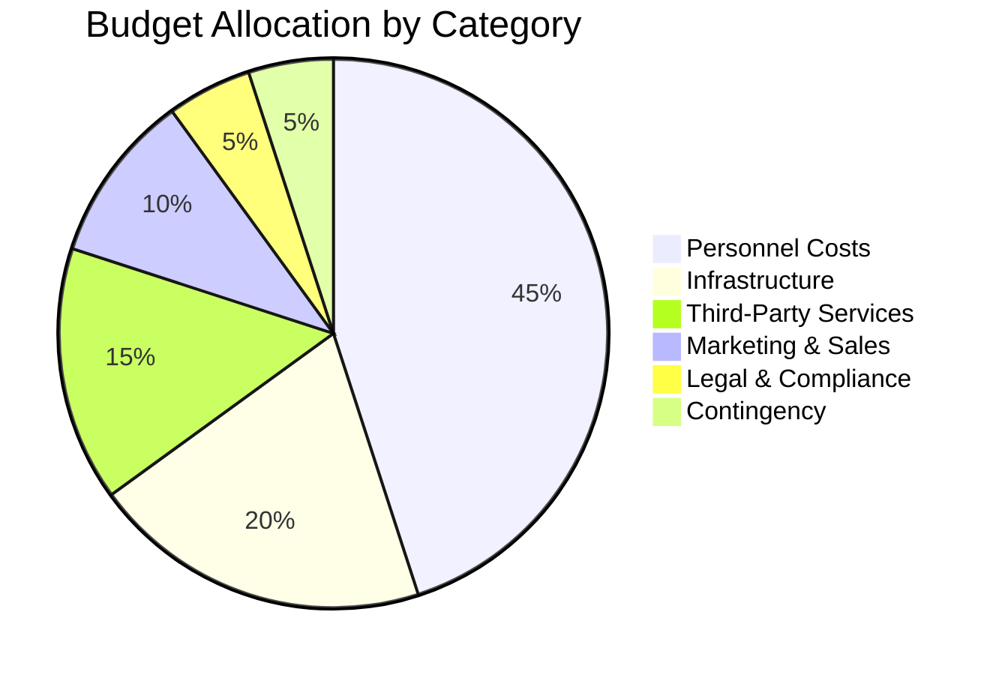

# Project Budget

## Overview

This document provides a comprehensive budget analysis for the Axisor trading automation platform project. It outlines the financial resources required for development, operations, and ongoing maintenance, including detailed cost breakdowns and budget allocation strategies.

## Budget Summary

### Total Project Budget
- **Development Phase (Year 1)**: $2,500,000
- **Operations Phase (Year 2)**: $1,800,000
- **Growth Phase (Year 3)**: $2,200,000
- **Total 3-Year Budget**: $6,500,000

### Budget Allocation by Category


## Detailed Budget Breakdown

### Year 1: Development Phase

#### Personnel Costs ($1,125,000 - 45%)

**Development Team**
- **Senior Backend Developer**: $120,000
- **Backend Developer**: $90,000
- **Senior Frontend Developer**: $115,000
- **Frontend Developer**: $85,000
- **Database Engineer**: $100,000
- **UI/UX Designer**: $80,000
- **DevOps Engineer**: $110,000
- **QA Engineer**: $75,000

**Management and Leadership**
- **Project Manager**: $95,000
- **Technical Lead**: $130,000
- **Product Manager**: $120,000
- **Business Analyst**: $70,000

**Total Personnel Costs**: $1,125,000

#### Infrastructure Costs ($500,000 - 20%)

**Cloud Infrastructure**
- **AWS/GCP/Azure Services**: $200,000
  - Compute instances: $80,000
  - Database services: $60,000
  - Storage and CDN: $30,000
  - Networking and security: $30,000

**Development Infrastructure**
- **Development Tools and Licenses**: $50,000
- **CI/CD Pipeline**: $30,000
- **Monitoring and Logging**: $40,000
- **Security Tools**: $35,000
- **Testing Infrastructure**: $25,000

**Hardware and Equipment**
- **Development Machines**: $60,000
- **Testing Devices**: $20,000
- **Network Equipment**: $15,000
- **Office Equipment**: $25,000

**Total Infrastructure Costs**: $500,000

#### Third-Party Services ($375,000 - 15%)

**Market Data and APIs**
- **LN Markets API**: $50,000
- **Market Data Providers**: $80,000
- **News and Sentiment APIs**: $30,000
- **Payment Processing**: $40,000

**Development Services**
- **External Consulting**: $60,000
- **Security Audits**: $35,000
- **Performance Testing**: $25,000
- **Compliance Consulting**: $30,000

**Software and Tools**
- **Development Software**: $25,000
- **Design Tools**: $15,000
- **Project Management Tools**: $20,000
- **Communication Tools**: $15,000

**Total Third-Party Services**: $375,000

#### Marketing and Sales ($250,000 - 10%)

**Digital Marketing**
- **Social Media Advertising**: $80,000
- **Search Engine Marketing**: $60,000
- **Content Marketing**: $40,000
- **Email Marketing**: $20,000

**Events and Conferences**
- **Industry Conferences**: $30,000
- **Webinars and Events**: $15,000
- **Trade Shows**: $25,000

**Total Marketing and Sales**: $250,000

#### Legal and Compliance ($125,000 - 5%)

**Legal Services**
- **Legal Consultation**: $40,000
- **Contract Review**: $25,000
- **Intellectual Property**: $20,000
- **Regulatory Compliance**: $25,000

**Compliance and Security**
- **Security Audits**: $15,000

**Total Legal and Compliance**: $125,000

#### Contingency ($125,000 - 5%)

**Risk Mitigation**
- **Unexpected Costs**: $125,000

**Total Contingency**: $125,000

### Year 2: Operations Phase

#### Personnel Costs ($810,000 - 45%)

**Operations Team**
- **Senior Backend Developer**: $125,000
- **Backend Developer**: $95,000
- **Senior Frontend Developer**: $120,000
- **Frontend Developer**: $90,000
- **Database Engineer**: $105,000
- **DevOps Engineer**: $115,000
- **QA Engineer**: $80,000
- **Support Engineer**: $70,000

**Management**
- **Project Manager**: $100,000
- **Technical Lead**: $135,000

**Total Personnel Costs**: $810,000

#### Infrastructure Costs ($360,000 - 20%)

**Cloud Infrastructure**
- **Production Services**: $200,000
- **Development and Testing**: $80,000
- **Monitoring and Security**: $50,000
- **Backup and Recovery**: $30,000

**Total Infrastructure Costs**: $360,000

#### Third-Party Services ($270,000 - 15%)

**Market Data and APIs**
- **LN Markets API**: $60,000
- **Market Data Providers**: $100,000
- **Payment Processing**: $50,000
- **Other APIs**: $30,000

**Services**
- **Support Services**: $30,000

**Total Third-Party Services**: $270,000

#### Marketing and Sales ($180,000 - 10%)

**Digital Marketing**
- **Advertising**: $100,000
- **Content Marketing**: $40,000
- **Events**: $40,000

**Total Marketing and Sales**: $180,000

#### Legal and Compliance ($90,000 - 5%)

**Legal Services**
- **Ongoing Legal Support**: $50,000
- **Compliance Monitoring**: $40,000

**Total Legal and Compliance**: $90,000

#### Contingency ($90,000 - 5%)

**Risk Mitigation**
- **Unexpected Costs**: $90,000

**Total Contingency**: $90,000

### Year 3: Growth Phase

#### Personnel Costs ($990,000 - 45%)

**Expanded Team**
- **Senior Backend Developer**: $130,000
- **Backend Developer**: $100,000
- **Senior Frontend Developer**: $125,000
- **Frontend Developer**: $95,000
- **Database Engineer**: $110,000
- **DevOps Engineer**: $120,000
- **QA Engineer**: $85,000
- **Support Engineer**: $75,000
- **Mobile Developer**: $90,000
- **Data Scientist**: $100,000

**Management**
- **Project Manager**: $105,000
- **Technical Lead**: $140,000

**Total Personnel Costs**: $990,000

#### Infrastructure Costs ($440,000 - 20%)

**Cloud Infrastructure**
- **Production Services**: $250,000
- **Development and Testing**: $100,000
- **Monitoring and Security**: $60,000
- **Backup and Recovery**: $30,000

**Total Infrastructure Costs**: $440,000

#### Third-Party Services ($330,000 - 15%)

**Market Data and APIs**
- **LN Markets API**: $70,000
- **Market Data Providers**: $120,000
- **Payment Processing**: $60,000
- **Other APIs**: $40,000

**Services**
- **Support Services**: $40,000

**Total Third-Party Services**: $330,000

#### Marketing and Sales ($220,000 - 10%)

**Digital Marketing**
- **Advertising**: $120,000
- **Content Marketing**: $50,000
- **Events**: $50,000

**Total Marketing and Sales**: $220,000

#### Legal and Compliance ($110,000 - 5%)

**Legal Services**
- **Ongoing Legal Support**: $60,000
- **Compliance Monitoring**: $50,000

**Total Legal and Compliance**: $110,000

#### Contingency ($110,000 - 5%)

**Risk Mitigation**
- **Unexpected Costs**: $110,000

**Total Contingency**: $110,000

## Budget Allocation by Phase

### Development Phase (Months 1-12)

#### Phase 1: Foundation (Months 1-6)
- **Personnel**: $562,500
- **Infrastructure**: $250,000
- **Third-Party Services**: $187,500
- **Marketing**: $125,000
- **Legal**: $62,500
- **Contingency**: $62,500
- **Total**: $1,250,000

#### Phase 2: Enhancement (Months 7-12)
- **Personnel**: $562,500
- **Infrastructure**: $250,000
- **Third-Party Services**: $187,500
- **Marketing**: $125,000
- **Legal**: $62,500
- **Contingency**: $62,500
- **Total**: $1,250,000

### Operations Phase (Months 13-24)

#### Quarter 1 (Months 13-15)
- **Personnel**: $202,500
- **Infrastructure**: $90,000
- **Third-Party Services**: $67,500
- **Marketing**: $45,000
- **Legal**: $22,500
- **Contingency**: $22,500
- **Total**: $450,000

#### Quarter 2 (Months 16-18)
- **Personnel**: $202,500
- **Infrastructure**: $90,000
- **Third-Party Services**: $67,500
- **Marketing**: $45,000
- **Legal**: $22,500
- **Contingency**: $22,500
- **Total**: $450,000

#### Quarter 3 (Months 19-21)
- **Personnel**: $202,500
- **Infrastructure**: $90,000
- **Third-Party Services**: $67,500
- **Marketing**: $45,000
- **Legal**: $22,500
- **Contingency**: $22,500
- **Total**: $450,000

#### Quarter 4 (Months 22-24)
- **Personnel**: $202,500
- **Infrastructure**: $90,000
- **Third-Party Services**: $67,500
- **Marketing**: $45,000
- **Legal**: $22,500
- **Contingency**: $22,500
- **Total**: $450,000

### Growth Phase (Months 25-36)

#### Quarter 1 (Months 25-27)
- **Personnel**: $247,500
- **Infrastructure**: $110,000
- **Third-Party Services**: $82,500
- **Marketing**: $55,000
- **Legal**: $27,500
- **Contingency**: $27,500
- **Total**: $550,000

#### Quarter 2 (Months 28-30)
- **Personnel**: $247,500
- **Infrastructure**: $110,000
- **Third-Party Services**: $82,500
- **Marketing**: $55,000
- **Legal**: $27,500
- **Contingency**: $27,500
- **Total**: $550,000

#### Quarter 3 (Months 31-33)
- **Personnel**: $247,500
- **Infrastructure**: $110,000
- **Third-Party Services**: $82,500
- **Marketing**: $55,000
- **Legal**: $27,500
- **Contingency**: $27,500
- **Total**: $550,000

#### Quarter 4 (Months 34-36)
- **Personnel**: $247,500
- **Infrastructure**: $110,000
- **Third-Party Services**: $82,500
- **Marketing**: $55,000
- **Legal**: $27,500
- **Contingency**: $27,500
- **Total**: $550,000

## Cost Optimization Strategies

### Personnel Cost Optimization

#### Remote Work Benefits
- **Reduced Office Costs**: $50,000 annual savings
- **Access to Global Talent**: 20% cost reduction for certain roles
- **Flexible Work Arrangements**: Improved retention and productivity
- **Reduced Commuting Costs**: Employee satisfaction and cost savings

#### Performance-Based Compensation
- **Base Salary**: 80% of total compensation
- **Performance Bonuses**: 20% based on individual and team performance
- **Equity Participation**: Long-term incentive alignment
- **Professional Development**: Investment in team growth and retention

### Infrastructure Cost Optimization

#### Cloud Cost Management
```typescript
// Infrastructure Cost Optimization
interface CostOptimization {
  compute: {
    reservedInstances: "Reserved instances for predictable workloads";
    spotInstances: "Spot instances for non-critical workloads";
    autoScaling: "Auto-scaling to match demand";
    rightSizing: "Regular instance right-sizing";
  };
  storage: {
    lifecycle: "Automated data lifecycle management";
    compression: "Data compression and deduplication";
    tiering: "Intelligent storage tiering";
    cleanup: "Regular cleanup of unused resources";
  };
  networking: {
    cdn: "CDN for static content delivery";
    optimization: "Network traffic optimization";
    monitoring: "Network usage monitoring";
    optimization: "Bandwidth optimization";
  };
}
```

#### Resource Optimization
- **Resource Monitoring**: Real-time resource utilization monitoring
- **Cost Allocation**: Detailed cost allocation and tracking
- **Budget Alerts**: Automated budget alerts and notifications
- **Cost Reviews**: Regular cost review and optimization

### Third-Party Service Optimization

#### Vendor Management
- **Competitive Bidding**: Regular vendor evaluation and bidding
- **Volume Discounts**: Negotiate volume discounts for high-usage services
- **Service Level Agreements**: Clear SLAs and performance metrics
- **Alternative Providers**: Multiple provider options for critical services

#### Service Consolidation
- **Tool Consolidation**: Consolidate similar tools and services
- **API Optimization**: Optimize API usage and caching
- **Service Integration**: Integrate services to reduce redundancy
- **Cost Monitoring**: Regular service cost monitoring and optimization

## Revenue Projections and ROI

### Revenue Projections

#### Year 1 Revenue
- **Q1**: $0 (Development phase)
- **Q2**: $0 (Development phase)
- **Q3**: $25,000 (Beta launch)
- **Q4**: $100,000 (Public launch)
- **Total Year 1**: $125,000

#### Year 2 Revenue
- **Q1**: $150,000
- **Q2**: $300,000
- **Q3**: $450,000
- **Q4**: $600,000
- **Total Year 2**: $1,500,000

#### Year 3 Revenue
- **Q1**: $750,000
- **Q2**: $900,000
- **Q3**: $1,050,000
- **Q4**: $1,200,000
- **Total Year 3**: $3,900,000

### Return on Investment (ROI)

#### Investment Summary
- **Total Investment**: $6,500,000
- **Total Revenue**: $5,525,000
- **Net Loss**: -$975,000 (3-year period)

#### Break-Even Analysis
- **Break-Even Point**: Month 42 (Year 4, Quarter 2)
- **Break-Even Revenue**: $7,200,000
- **Break-Even Users**: 15,000 paying users

#### Long-Term ROI Projections
- **Year 4**: $2,400,000 revenue, $400,000 profit
- **Year 5**: $3,600,000 revenue, $1,200,000 profit
- **Year 6**: $5,400,000 revenue, $2,400,000 profit
- **5-Year ROI**: 185% return on investment

## Budget Monitoring and Control

### Budget Monitoring Framework

#### Monthly Budget Reviews
- **Actual vs. Budgeted**: Monthly comparison of actual vs. budgeted costs
- **Variance Analysis**: Analysis of significant variances
- **Forecast Updates**: Updated forecasts based on actual performance
- **Action Plans**: Action plans for budget variances

#### Quarterly Budget Reviews
- **Comprehensive Review**: Quarterly comprehensive budget review
- **Strategic Adjustments**: Strategic budget adjustments if needed
- **Performance Analysis**: Analysis of budget performance and trends
- **Future Planning**: Planning for future budget periods

### Budget Control Measures

#### Approval Processes
- **Purchase Approvals**: Clear approval processes for purchases
- **Budget Limits**: Spending limits and approval thresholds
- **Expense Policies**: Clear expense policies and procedures
- **Documentation**: Comprehensive documentation of all expenses

#### Cost Control
- **Regular Monitoring**: Regular monitoring of all costs
- **Variance Reporting**: Timely variance reporting and analysis
- **Cost Optimization**: Continuous cost optimization efforts
- **Budget Adjustments**: Timely budget adjustments when needed

## Funding Strategy

### Funding Sources

#### Initial Funding
- **Seed Funding**: $2,000,000 (Completed)
- **Series A**: $4,500,000 (Target)
- **Total Initial Funding**: $6,500,000

#### Funding Timeline
- **Seed Funding**: Month 0 (Completed)
- **Series A**: Month 12 (Target)
- **Series B**: Month 24 (Potential)
- **IPO/Exit**: Year 5-7 (Long-term)

### Funding Requirements

#### Immediate Funding Needs
- **Development Phase**: $2,500,000
- **Operations Phase**: $1,800,000
- **Growth Phase**: $2,200,000
- **Total Funding Required**: $6,500,000

#### Funding Utilization
- **Personnel**: 45% of total funding
- **Infrastructure**: 20% of total funding
- **Third-Party Services**: 15% of total funding
- **Marketing**: 10% of total funding
- **Legal & Compliance**: 5% of total funding
- **Contingency**: 5% of total funding

## Conclusion

The project budget for Axisor provides a comprehensive financial framework for the development and operation of the trading automation platform. The budget is structured to support the three-phase development approach, with appropriate allocation of resources across personnel, infrastructure, services, and other essential areas.

The cost optimization strategies ensure that resources are used efficiently while maintaining quality and performance. The revenue projections and ROI analysis provide a clear picture of the financial viability and long-term potential of the project.

Regular budget monitoring and control measures ensure that the project stays within budget while achieving its objectives. The funding strategy provides a clear path for securing the necessary resources to execute the project successfully.

This budget framework serves as the foundation for financial decision-making and resource allocation throughout the project lifecycle, ensuring that the Axisor platform can be developed and operated successfully while maintaining financial sustainability and growth potential.
