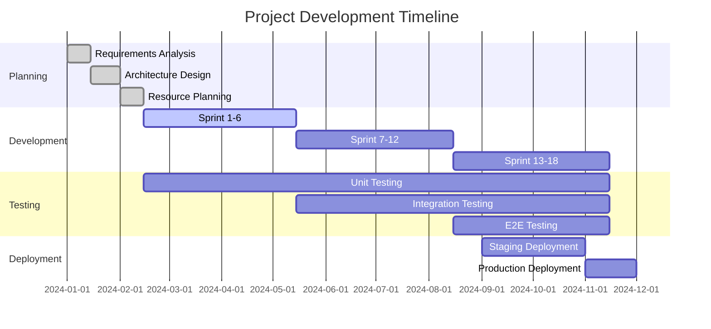

# Project Methodology

## Overview

This document outlines the comprehensive project methodology for the Axisor trading automation platform development. It defines the development approach, processes, tools, and practices that guide the project from conception to deployment and ongoing maintenance.

## Methodology Framework

### Agile Development Approach

#### Core Principles
- **Individuals and Interactions**: Prioritizing people and communication over processes and tools
- **Working Software**: Delivering functional software over comprehensive documentation
- **Customer Collaboration**: Working closely with customers and stakeholders
- **Responding to Change**: Adapting to changing requirements and market conditions

#### Agile Manifesto Implementation
```typescript
// Agile Development Principles
interface AgilePrinciples {
  values: {
    individuals: "People and interactions over processes and tools";
    workingSoftware: "Working software over comprehensive documentation";
    customerCollaboration: "Customer collaboration over contract negotiation";
    respondingToChange: "Responding to change over following a plan";
  };
  practices: {
    iterative: "Iterative and incremental development";
    continuous: "Continuous integration and deployment";
    feedback: "Regular feedback and adaptation";
    collaboration: "Cross-functional team collaboration";
  };
}
```

### Scrum Framework

#### Scrum Roles
- **Product Owner**: Responsible for product vision, backlog management, and stakeholder communication
- **Scrum Master**: Facilitates Scrum process, removes impediments, and ensures team adherence to Scrum practices
- **Development Team**: Self-organizing team responsible for delivering product increments

#### Scrum Events
- **Sprint Planning**: Planning sprint goals, backlog items, and tasks
- **Daily Standups**: Daily synchronization and progress updates
- **Sprint Review**: Demonstration of completed work to stakeholders
- **Sprint Retrospective**: Team reflection and process improvement

#### Scrum Artifacts
- **Product Backlog**: Prioritized list of features and requirements
- **Sprint Backlog**: Selected items for current sprint
- **Product Increment**: Working software delivered at sprint end

### Development Methodology

#### Continuous Integration/Continuous Deployment (CI/CD)

**Continuous Integration**
```typescript
// CI/CD Pipeline Configuration
interface CICDPipeline {
  integration: {
    sourceControl: "Git-based source control with branching strategy";
    automatedTesting: "Automated unit, integration, and E2E tests";
    codeQuality: "Automated code quality checks and linting";
    securityScanning: "Automated security vulnerability scanning";
  };
  deployment: {
    staging: "Automated deployment to staging environment";
    production: "Automated deployment to production with approval";
    rollback: "Automated rollback capabilities";
    monitoring: "Deployment monitoring and health checks";
  };
}
```

**Deployment Strategy**
- **Blue-Green Deployment**: Zero-downtime deployment strategy
- **Canary Releases**: Gradual rollout of new features
- **Feature Flags**: Toggle features on/off without deployment
- **Automated Rollback**: Quick rollback in case of issues

#### Test-Driven Development (TDD)

**TDD Process**
1. **Red**: Write a failing test
2. **Green**: Write minimal code to pass the test
3. **Refactor**: Improve code while keeping tests passing

**Testing Strategy**
```typescript
// Testing Pyramid
interface TestingStrategy {
  unit: {
    coverage: "90%+ code coverage";
    tools: "Jest, React Testing Library";
    focus: "Individual functions and components";
  };
  integration: {
    coverage: "API endpoints and service integration";
    tools: "Supertest, Prisma Mock";
    focus: "Component interaction and data flow";
  };
  e2e: {
    coverage: "Critical user journeys";
    tools: "Playwright, Cypress";
    focus: "End-to-end user workflows";
  };
}
```

#### Behavior-Driven Development (BDD)

**BDD Process**
- **Given**: Define the initial context and state
- **When**: Describe the action or event
- **Then**: Specify the expected outcome

**BDD Implementation**
```gherkin
# Example BDD Scenario
Feature: User Authentication
  Scenario: User can log in with valid credentials
    Given the user has a valid account
    When the user enters valid email and password
    Then the user should be redirected to the dashboard
    And the user should see their profile information
```

### Quality Assurance Methodology

#### Quality Gates
- **Code Quality**: Code review, linting, and quality metrics
- **Security**: Security scanning and vulnerability assessment
- **Performance**: Performance testing and optimization
- **Usability**: User experience testing and validation
- **Compliance**: Regulatory compliance and audit requirements

#### Quality Metrics
```typescript
// Quality Assurance Metrics
interface QualityMetrics {
  codeQuality: {
    coverage: "90%+ test coverage";
    complexity: "Cyclomatic complexity < 10";
    duplication: "Code duplication < 5%";
    maintainability: "Maintainability index > 70";
  };
  performance: {
    responseTime: "API response time < 200ms";
    loadTime: "Page load time < 2 seconds";
    throughput: "Support 1000+ concurrent users";
    availability: "99.9% uptime";
  };
  security: {
    vulnerabilities: "Zero critical vulnerabilities";
    compliance: "100% regulatory compliance";
    encryption: "All data encrypted in transit and at rest";
    access: "Role-based access control";
  };
}
```

## Development Process

### Sprint Planning

#### Sprint Planning Process
1. **Product Backlog Review**: Review and prioritize product backlog items
2. **Sprint Goal Definition**: Define clear sprint objectives
3. **Task Estimation**: Estimate effort for each task using story points
4. **Capacity Planning**: Determine team capacity and sprint commitment
5. **Sprint Backlog Creation**: Create detailed sprint backlog

#### Sprint Planning Tools
```typescript
// Sprint Planning Configuration
interface SprintPlanning {
  duration: "2-week sprints";
  capacity: "Team capacity based on availability";
  estimation: "Story points using Fibonacci sequence";
  planning: "Planning poker for estimation";
  tools: "Jira, Confluence for planning and tracking";
}
```

### Daily Development Process

#### Daily Standup Structure
- **What did you complete yesterday?**
- **What will you work on today?**
- **Are there any impediments or blockers?**

#### Development Workflow
```typescript
// Development Workflow
interface DevelopmentWorkflow {
  feature: {
    planning: "Feature planning and design";
    development: "Feature development and testing";
    review: "Code review and quality assurance";
    deployment: "Deployment to staging and production";
  };
  bug: {
    identification: "Bug identification and reporting";
    investigation: "Root cause analysis and investigation";
    fix: "Bug fix development and testing";
    verification: "Bug fix verification and closure";
  };
  hotfix: {
    identification: "Critical issue identification";
    emergency: "Emergency fix development";
    deployment: "Immediate deployment to production";
    followup: "Follow-up investigation and prevention";
  };
}
```

### Code Review Process

#### Code Review Guidelines
- **Review Criteria**: Code quality, functionality, security, performance
- **Review Process**: Automated checks followed by peer review
- **Review Tools**: GitHub Pull Requests, automated quality checks
- **Review Standards**: Clear coding standards and best practices

#### Code Review Checklist
```typescript
// Code Review Checklist
interface CodeReviewChecklist {
  functionality: {
    requirements: "Meets requirements and acceptance criteria";
    testing: "Adequate test coverage and quality";
    edgeCases: "Handles edge cases and error conditions";
    performance: "Meets performance requirements";
  };
  quality: {
    readability: "Code is readable and well-documented";
    maintainability: "Code is maintainable and extensible";
    standards: "Follows coding standards and conventions";
    architecture: "Follows architectural patterns and principles";
  };
  security: {
    validation: "Input validation and sanitization";
    authentication: "Proper authentication and authorization";
    encryption: "Data encryption and secure storage";
    vulnerabilities: "No security vulnerabilities or risks";
  };
}
```

## Project Management

### Project Planning

#### Project Phases
1. **Planning Phase**: Requirements analysis, architecture design, resource planning
2. **Development Phase**: Feature development, testing, integration
3. **Testing Phase**: Comprehensive testing, quality assurance, performance testing
4. **Deployment Phase**: Production deployment, monitoring, support
5. **Maintenance Phase**: Ongoing maintenance, updates, enhancements

#### Project Timeline


### Risk Management

#### Risk Identification and Assessment
- **Technical Risks**: Architecture, technology, integration risks
- **Business Risks**: Market, competition, regulatory risks
- **Operational Risks**: Team, process, resource risks
- **External Risks**: Economic, environmental, external dependency risks

#### Risk Mitigation Strategies
```typescript
// Risk Management Framework
interface RiskManagement {
  identification: {
    regular: "Regular risk identification and assessment";
    stakeholder: "Stakeholder input and feedback";
    historical: "Learning from past projects and experience";
    monitoring: "Continuous risk monitoring and assessment";
  };
  mitigation: {
    prevention: "Risk prevention strategies and measures";
    reduction: "Risk reduction and mitigation actions";
    transfer: "Risk transfer through insurance or contracts";
    acceptance: "Risk acceptance for low-impact risks";
  };
  monitoring: {
    tracking: "Risk tracking and status monitoring";
    reporting: "Regular risk reporting and communication";
    escalation: "Risk escalation procedures and protocols";
    review: "Regular risk review and assessment";
  };
}
```

### Communication Management

#### Communication Plan
- **Stakeholder Communication**: Regular updates and status reports
- **Team Communication**: Daily standups, sprint reviews, retrospectives
- **External Communication**: Customer updates, marketing communications
- **Documentation**: Comprehensive project documentation and knowledge sharing

#### Communication Tools
```typescript
// Communication Tools and Channels
interface CommunicationTools {
  internal: {
    team: "Slack for team communication and collaboration";
    project: "Jira for project management and tracking";
    documentation: "Confluence for documentation and knowledge sharing";
    code: "GitHub for code collaboration and review";
  };
  external: {
    customers: "Email, website, and support channels";
    stakeholders: "Regular reports and presentations";
    community: "Forums, social media, and community engagement";
    media: "Press releases and media communications";
  };
}
```

## Tools and Technologies

### Development Tools

#### Version Control
- **Git**: Distributed version control system
- **GitHub**: Code hosting and collaboration platform
- **Branching Strategy**: GitFlow with feature branches
- **Code Review**: Pull request-based code review process

#### Development Environment
```typescript
// Development Environment Setup
interface DevelopmentEnvironment {
  ide: {
    primary: "VS Code with TypeScript support";
    plugins: "ESLint, Prettier, GitLens, REST Client";
    configuration: "Shared workspace configuration";
  };
  tools: {
    packageManager: "npm/yarn for dependency management";
    bundler: "Vite for frontend, tsc for backend";
    testing: "Jest, React Testing Library, Playwright";
    linting: "ESLint, Prettier for code quality";
  };
  services: {
    database: "PostgreSQL with Prisma ORM";
    cache: "Redis for caching and sessions";
    queue: "BullMQ for background jobs";
    monitoring: "Prometheus, Grafana for monitoring";
  };
}
```

#### Build and Deployment
- **CI/CD Pipeline**: GitHub Actions for automated builds and deployments
- **Containerization**: Docker for containerized deployments
- **Orchestration**: Kubernetes for container orchestration
- **Monitoring**: Prometheus, Grafana, and Alertmanager for monitoring

### Project Management Tools

#### Project Tracking
- **Jira**: Issue tracking, sprint planning, and project management
- **Confluence**: Documentation, knowledge sharing, and collaboration
- **Slack**: Team communication and real-time collaboration
- **GitHub**: Code repository, issue tracking, and project management

#### Quality Assurance Tools
- **SonarQube**: Code quality analysis and technical debt tracking
- **Snyk**: Security vulnerability scanning
- **Lighthouse**: Performance and accessibility testing
- **Playwright**: End-to-end testing and automation

## Best Practices

### Development Best Practices

#### Code Quality
- **Clean Code**: Write clean, readable, and maintainable code
- **SOLID Principles**: Follow SOLID design principles
- **DRY Principle**: Don't Repeat Yourself
- **KISS Principle**: Keep It Simple, Stupid
- **YAGNI Principle**: You Aren't Gonna Need It

#### Security Best Practices
- **Input Validation**: Validate and sanitize all inputs
- **Authentication**: Implement strong authentication and authorization
- **Encryption**: Encrypt data in transit and at rest
- **Security Headers**: Implement proper security headers
- **Regular Updates**: Keep dependencies and systems updated

#### Performance Best Practices
- **Database Optimization**: Optimize database queries and indexes
- **Caching**: Implement appropriate caching strategies
- **Code Splitting**: Use code splitting for better performance
- **Lazy Loading**: Implement lazy loading for non-critical resources
- **Monitoring**: Monitor performance and optimize bottlenecks

### Process Best Practices

#### Agile Best Practices
- **Regular Retrospectives**: Continuous process improvement
- **Cross-functional Teams**: Self-organizing, cross-functional teams
- **Continuous Integration**: Integrate code frequently
- **Test-Driven Development**: Write tests before code
- **Pair Programming**: Collaborative development practices

#### Quality Assurance Best Practices
- **Test Automation**: Automate testing at all levels
- **Code Reviews**: Mandatory code reviews for all changes
- **Documentation**: Maintain comprehensive documentation
- **Monitoring**: Implement comprehensive monitoring and alerting
- **Incident Response**: Have clear incident response procedures

## Conclusion

The project methodology for Axisor provides a comprehensive framework for developing and delivering a high-quality trading automation platform. The methodology combines Agile principles, Scrum framework, and modern development practices to ensure efficient, collaborative, and successful project delivery.

The development process emphasizes continuous integration, test-driven development, and quality assurance to ensure that the platform meets high standards of quality, security, and performance. The project management approach provides clear structure and processes for planning, execution, and monitoring.

The tools and technologies selected support the methodology and enable efficient development, testing, and deployment. The best practices ensure that the team follows industry standards and delivers high-quality software.

This methodology framework serves as the foundation for successful project execution, ensuring that the Axisor platform is developed efficiently, meets quality standards, and delivers value to users and stakeholders. The methodology is designed to be flexible and adaptable, allowing the team to respond to changing requirements and market conditions while maintaining focus on delivering high-quality software.
