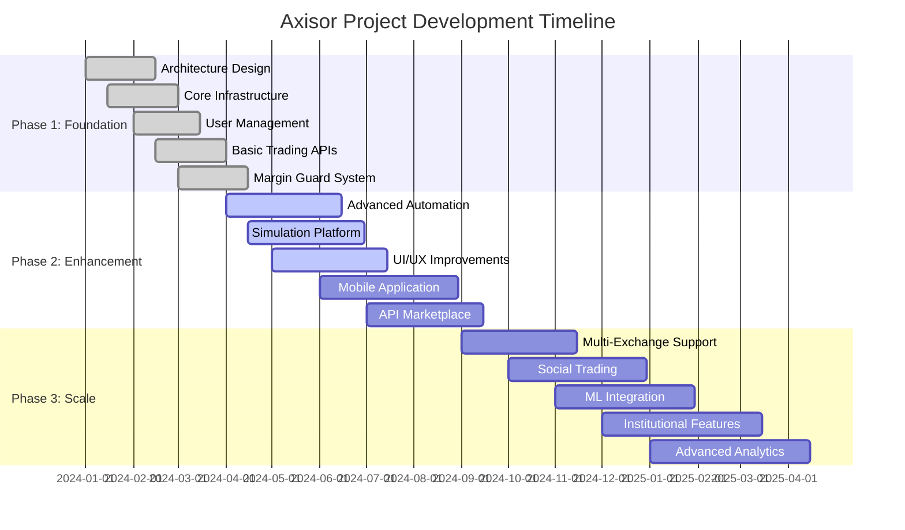

# Project Timeline

## Overview

The Axisor project timeline outlines the development phases, milestones, and key deliverables from initial concept to production deployment and ongoing maintenance. The timeline is organized into distinct phases with clear objectives, deliverables, and success criteria.

## Timeline Visualization

## Phase 1: Foundation (Completed)

### Duration: January 2024 - April 2024
### Status: ✅ Completed

#### Q1 2024: Architecture and Infrastructure

**January 2024: Architecture Design**
- ✅ System architecture planning and design
- ✅ Technology stack selection and evaluation
- ✅ Database schema design and optimization
- ✅ Security architecture and compliance planning
- ✅ Development environment setup

**Key Deliverables:**
- System architecture documentation
- Technology stack documentation
- Database schema and migration scripts
- Security compliance framework
- Development environment configuration

**February 2024: Core Infrastructure**
- ✅ Backend API development and testing
- ✅ Database setup and optimization
- ✅ Authentication and authorization system
- ✅ Basic monitoring and logging setup
- ✅ CI/CD pipeline implementation

**Key Deliverables:**
- RESTful API endpoints
- Database with initial schema
- JWT-based authentication system
- Basic monitoring dashboard
- Automated deployment pipeline

#### Q2 2024: Core Features

**March 2024: User Management**
- ✅ User registration and authentication
- ✅ Profile management and preferences
- ✅ Subscription and billing system
- ✅ Role-based access control
- ✅ User activity tracking

**Key Deliverables:**
- User management system
- Subscription management
- Access control implementation
- User analytics dashboard
- Billing integration

**April 2024: Trading and Margin Systems**
- ✅ Basic trading automation framework
- ✅ Margin Guard system implementation
- ✅ Real-time market data integration
- ✅ Position management system
- ✅ Risk management controls

**Key Deliverables:**
- Trading automation engine
- Margin monitoring system
- Market data integration
- Position tracking system
- Risk management framework

## Phase 2: Enhancement (Current)

### Duration: April 2024 - September 2024
### Status: 🔄 In Progress

#### Q2 2024: Advanced Features

**April-May 2024: Advanced Automation**
- 🔄 Sophisticated trading strategy engine
- 🔄 Backtesting and optimization tools
- 🔄 Custom strategy builder
- 🔄 Strategy performance analytics
- 🔄 Risk management enhancements

**Key Deliverables:**
- Advanced strategy engine
- Backtesting framework
- Strategy builder interface
- Performance analytics
- Enhanced risk controls

**May-June 2024: Simulation Platform**
- 🔄 Market simulation engine
- 🔄 Historical data integration
- 🔄 Real-time simulation capabilities
- 🔄 Performance metrics and reporting
- 🔄 Simulation data management

**Key Deliverables:**
- Simulation engine
- Historical data system
- Real-time simulation
- Performance reporting
- Data management tools

#### Q3 2024: User Experience

**June-July 2024: UI/UX Improvements**
- 🔄 Enhanced user interface design
- 🔄 Improved user experience flows
- 🔄 Advanced charting and visualization
- 🔄 Responsive design optimization
- 🔄 Accessibility improvements

**Key Deliverables:**
- Redesigned user interface
- Improved user flows
- Advanced charting system
- Mobile-responsive design
- Accessibility compliance

**July-August 2024: Mobile Application**
- 📋 Mobile app development
- 📋 Cross-platform compatibility
- 📋 Push notifications
- 📋 Offline functionality
- 📋 Mobile-specific features

**Key Deliverables:**
- Mobile application
- Cross-platform support
- Notification system
- Offline capabilities
- Mobile-optimized features

**August-September 2024: API Marketplace**
- 📋 Third-party API integration
- 📋 API documentation and testing
- 📋 Developer portal
- 📋 API monetization
- 📋 Community features

**Key Deliverables:**
- API marketplace
- Developer documentation
- Testing tools
- Monetization system
- Community platform

## Phase 3: Scale (Planned)

### Duration: September 2024 - April 2025
### Status: 📋 Planned

#### Q4 2024: Multi-Platform Support

**September-October 2024: Multi-Exchange Support**
- 📋 Additional exchange integrations
- 📋 Unified trading interface
- 📋 Cross-exchange arbitrage
- 📋 Portfolio management
- 📋 Risk diversification

**Key Deliverables:**
- Multi-exchange integration
- Unified trading interface
- Arbitrage tools
- Portfolio management
- Risk diversification

**October-December 2024: Social Trading**
- 📋 Social trading features
- 📋 Copy trading functionality
- 📋 Community features
- 📋 Social analytics
- 📋 Reputation system

**Key Deliverables:**
- Social trading platform
- Copy trading system
- Community features
- Social analytics
- Reputation management

#### Q1 2025: Advanced Features

**November 2024 - January 2025: Machine Learning Integration**
- 📋 ML model development
- 📋 Predictive analytics
- 📋 Automated strategy optimization
- 📋 Market sentiment analysis
- 📋 Risk prediction models

**Key Deliverables:**
- ML integration framework
- Predictive analytics
- Strategy optimization
- Sentiment analysis
- Risk prediction

**December 2024 - March 2025: Institutional Features**
- 📋 Enterprise-grade security
- 📋 Advanced compliance tools
- 📋 Institutional reporting
- 📋 White-label solutions
- 📋 Custom integrations

**Key Deliverables:**
- Enterprise security
- Compliance tools
- Institutional reporting
- White-label platform
- Custom integration APIs

**January-April 2025: Advanced Analytics**
- 📋 Advanced reporting tools
- 📋 Custom dashboard creation
- 📋 Data export capabilities
- 📋 Business intelligence integration
- 📋 Predictive modeling

**Key Deliverables:**
- Advanced reporting
- Custom dashboards
- Data export tools
- BI integration
- Predictive models

## Milestone Definitions

### Technical Milestones

#### Architecture Milestones
- **M1: System Architecture Complete**
  - All system components designed and documented
  - Technology stack finalized and implemented
  - Security architecture approved
  - Performance requirements defined

- **M2: Core Infrastructure Complete**
  - Backend API fully functional
  - Database optimized and tested
  - Authentication system implemented
  - Monitoring and logging operational

#### Feature Milestones
- **M3: Basic Trading Features Complete**
  - Trading automation engine functional
  - Margin Guard system operational
  - User management system complete
  - Basic UI/UX implemented

- **M4: Advanced Features Complete**
  - Advanced automation strategies
  - Simulation platform operational
  - Enhanced UI/UX implemented
  - Mobile application launched

- **M5: Scale Features Complete**
  - Multi-exchange support
  - Social trading features
  - ML integration
  - Institutional features

### Business Milestones

#### User Acquisition
- **B1: Beta Launch (100 users)**
  - Closed beta with selected users
  - Initial feedback collection
  - Performance optimization
  - Bug fixes and improvements

- **B2: Public Launch (1,000 users)**
  - Public platform launch
  - Marketing campaign initiation
  - User support system
  - Performance monitoring

- **B3: Growth Phase (10,000 users)**
  - Significant user growth
  - Feature expansion
  - Performance scaling
  - Market expansion

#### Revenue Milestones
- **R1: First Revenue ($1,000 MRR)**
  - First paying customers
  - Subscription system operational
  - Payment processing
  - Revenue tracking

- **R2: Growth Revenue ($10,000 MRR)**
  - Sustainable revenue growth
  - Customer retention
  - Upselling opportunities
  - Market validation

- **R3: Scale Revenue ($100,000 MRR)**
  - Significant revenue milestone
  - Market leadership
  - International expansion
  - Enterprise customers

## Risk Management

### Technical Risks

#### Development Risks
- **Risk**: Technical complexity of trading systems
- **Mitigation**: Phased development approach, expert consultation
- **Contingency**: Extended timeline, additional resources

- **Risk**: Third-party API dependencies
- **Mitigation**: Multiple API providers, fallback systems
- **Contingency**: Alternative integration approaches

#### Performance Risks
- **Risk**: System performance under load
- **Mitigation**: Load testing, performance optimization
- **Contingency**: Infrastructure scaling, code optimization

- **Risk**: Data security and compliance
- **Mitigation**: Security audits, compliance frameworks
- **Contingency**: Enhanced security measures, legal consultation

### Business Risks

#### Market Risks
- **Risk**: Market competition
- **Mitigation**: Unique value proposition, rapid innovation
- **Contingency**: Market differentiation, partnership strategies

- **Risk**: Regulatory changes
- **Mitigation**: Compliance monitoring, legal consultation
- **Contingency**: Regulatory adaptation, compliance updates

#### Operational Risks
- **Risk**: Key personnel departure
- **Mitigation**: Knowledge documentation, team redundancy
- **Contingency**: Recruitment, knowledge transfer

- **Risk**: Funding constraints
- **Mitigation**: Revenue generation, cost optimization
- **Contingency**: Funding rounds, cost reduction

## Success Metrics

### Technical Metrics
- **Code Quality**: 90%+ test coverage, zero critical bugs
- **Performance**: <200ms API response time, 99.9% uptime
- **Security**: Zero security vulnerabilities, compliance certification
- **Scalability**: Support for 10,000+ concurrent users

### Business Metrics
- **User Growth**: Month-over-month user acquisition
- **Revenue Growth**: Sustainable revenue growth trajectory
- **User Satisfaction**: 4.5+ user rating, high retention
- **Market Position**: Top 3 in trading automation category

## Timeline Adjustments

### Factors Affecting Timeline
- **Market Conditions**: Cryptocurrency market volatility
- **Regulatory Changes**: New compliance requirements
- **Technology Changes**: New technology adoption
- **Resource Availability**: Team and funding constraints

### Adjustment Process
1. **Regular Review**: Monthly timeline assessment
2. **Stakeholder Communication**: Transparent updates
3. **Risk Assessment**: Continuous risk evaluation
4. **Contingency Planning**: Alternative timeline scenarios
5. **Resource Reallocation**: Dynamic resource management

## Conclusion

The Axisor project timeline provides a structured approach to development, with clear phases, milestones, and success criteria. The timeline is designed to be flexible and adaptable to changing market conditions and requirements while maintaining focus on delivering value to users and stakeholders.

Regular monitoring and adjustment of the timeline ensures that the project remains on track and can adapt to new opportunities and challenges as they arise. The phased approach allows for early validation, iterative improvement, and risk mitigation throughout the development process.
