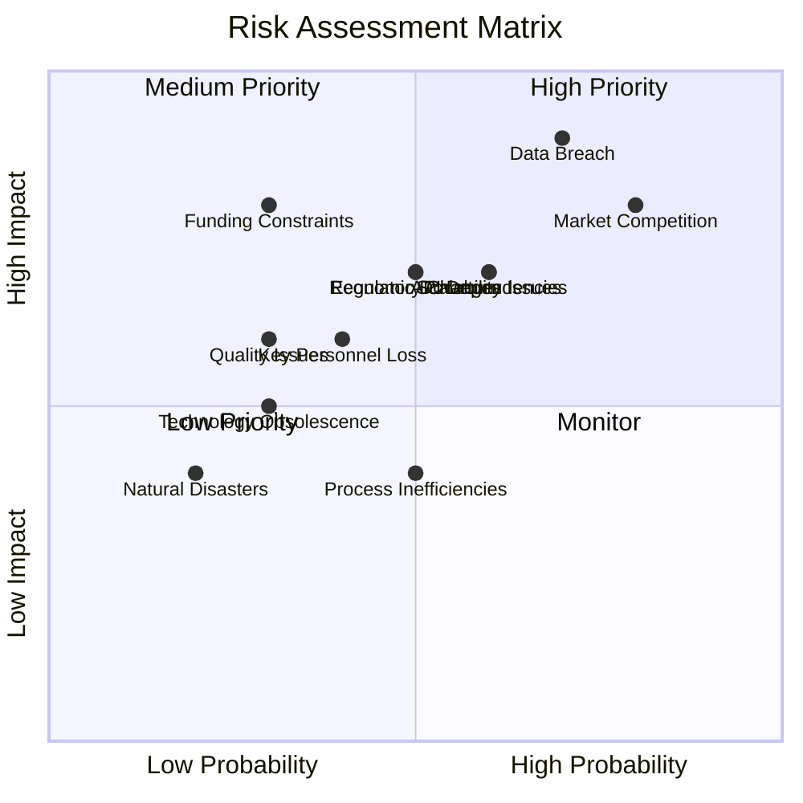

# Risk Management

## Overview

This document outlines the comprehensive risk management strategy for the Axisor trading automation platform project. It identifies potential risks, assesses their impact and probability, and provides mitigation strategies to ensure project success and platform stability.

## Risk Management Framework

### Risk Management Process

#### Risk Identification
- **Systematic Risk Assessment**: Regular identification of potential risks
- **Stakeholder Input**: Risk identification from all stakeholder groups
- **Historical Analysis**: Learning from past projects and industry experience
- **Scenario Planning**: Consideration of various future scenarios
- **Continuous Monitoring**: Ongoing risk identification and assessment

#### Risk Assessment
- **Impact Analysis**: Assessment of potential impact on project objectives
- **Probability Assessment**: Evaluation of likelihood of risk occurrence
- **Risk Rating**: Combined impact and probability scoring
- **Risk Prioritization**: Ranking of risks by severity and urgency
- **Risk Categorization**: Grouping of risks by type and source

#### Risk Mitigation
- **Prevention Strategies**: Actions to prevent risk occurrence
- **Mitigation Strategies**: Actions to reduce risk impact or probability
- **Contingency Planning**: Plans for responding to risk occurrence
- **Risk Transfer**: Insurance or contractual risk transfer
- **Risk Acceptance**: Acceptance of low-impact, low-probability risks

#### Risk Monitoring
- **Regular Reviews**: Periodic risk assessment and review
- **Key Risk Indicators**: Metrics for early risk detection
- **Risk Reporting**: Regular risk status reporting to stakeholders
- **Risk Escalation**: Procedures for escalating high-priority risks
- **Risk Documentation**: Comprehensive risk documentation and tracking

## Risk Categories

### Technical Risks

#### System Architecture Risks

**Risk T-001: Scalability Limitations**
- **Description**: System may not scale to meet growing user demand
- **Impact**: High - System performance degradation, user experience issues
- **Probability**: Medium - Based on current architecture and growth projections
- **Risk Rating**: High
- **Mitigation Strategies**:
  - Implement horizontal scaling capabilities
  - Use microservices architecture
  - Implement load balancing and auto-scaling
  - Regular performance testing and optimization
  - Cloud-native infrastructure design

**Risk T-002: Technology Stack Obsolescence**
- **Description**: Key technologies may become obsolete or unsupported
- **Impact**: Medium - Development delays, increased maintenance costs
- **Probability**: Low - Based on technology maturity and community support
- **Risk Rating**: Medium
- **Mitigation Strategies**:
  - Use well-established, actively maintained technologies
  - Regular technology stack reviews and updates
  - Maintain technology diversity and flexibility
  - Stay informed about technology trends
  - Plan for technology migration paths

#### Data and Security Risks

**Risk T-003: Data Breach or Security Incident**
- **Description**: Unauthorized access to user data or system compromise
- **Impact**: Very High - Reputation damage, legal liability, financial loss
- **Probability**: Medium - Based on industry security incident rates
- **Risk Rating**: Very High
- **Mitigation Strategies**:
  - Implement comprehensive security measures
  - Regular security audits and penetration testing
  - Employee security training and awareness
  - Incident response planning and testing
  - Cyber insurance coverage

**Risk T-004: Data Loss or Corruption**
- **Description**: Loss or corruption of critical system or user data
- **Impact**: Very High - Business disruption, user trust loss
- **Probability**: Low - Based on backup and redundancy measures
- **Risk Rating**: High
- **Mitigation Strategies**:
  - Comprehensive backup and recovery procedures
  - Data replication and redundancy
  - Regular backup testing and validation
  - Disaster recovery planning and testing
  - Data integrity monitoring and validation

#### Integration and API Risks

**Risk T-005: Third-Party API Dependencies**
- **Description**: Dependencies on external APIs may fail or change
- **Impact**: High - Service disruption, functionality loss
- **Probability**: Medium - Based on API reliability and change frequency
- **Risk Rating**: High
- **Mitigation Strategies**:
  - Multiple API provider options
  - API abstraction layers and fallback mechanisms
  - Regular API monitoring and health checks
  - Contractual agreements with API providers
  - Internal API development for critical functions

**Risk T-006: Integration Complexity**
- **Description**: Complex integrations may fail or perform poorly
- **Impact**: Medium - Development delays, functionality issues
- **Probability**: Medium - Based on integration complexity
- **Risk Rating**: Medium
- **Mitigation Strategies**:
  - Phased integration approach
  - Comprehensive testing and validation
  - Expert consultation and support
  - Fallback integration options
  - Regular integration monitoring and optimization

### Business Risks

#### Market and Competition Risks

**Risk B-001: Market Competition**
- **Description**: Intense competition may impact market position and revenue
- **Impact**: High - Market share loss, pricing pressure
- **Probability**: High - Based on market dynamics and competition
- **Risk Rating**: Very High
- **Mitigation Strategies**:
  - Continuous market analysis and competitive intelligence
  - Unique value proposition development
  - Rapid innovation and feature development
  - Strong customer relationships and loyalty
  - Strategic partnerships and alliances

**Risk B-002: Market Changes**
- **Description**: Changes in market conditions may impact demand
- **Impact**: High - Revenue reduction, user base decline
- **Probability**: Medium - Based on market volatility
- **Risk Rating**: High
- **Mitigation Strategies**:
  - Diversified market approach
  - Flexible business model adaptation
  - Market trend monitoring and analysis
  - Product portfolio diversification
  - Strategic market positioning

#### Financial Risks

**Risk B-003: Funding Constraints**
- **Description**: Insufficient funding may impact development and operations
- **Impact**: Very High - Development delays, operational issues
- **Probability**: Low - Based on current funding status
- **Risk Rating**: Medium
- **Mitigation Strategies**:
  - Diversified funding sources
  - Revenue generation and profitability focus
  - Cost optimization and efficiency measures
  - Strategic investor relationships
  - Financial contingency planning

**Risk B-004: Revenue Generation**
- **Description**: Revenue may not meet projections or expectations
- **Impact**: High - Business sustainability issues
- **Probability**: Medium - Based on market and business model
- **Risk Rating**: High
- **Mitigation Strategies**:
  - Multiple revenue streams
  - Flexible pricing models
  - Customer retention and expansion
  - Market expansion strategies
  - Financial performance monitoring

#### Regulatory and Compliance Risks

**Risk B-005: Regulatory Changes**
- **Description**: Changes in regulations may impact business operations
- **Impact**: High - Compliance costs, operational changes
- **Probability**: Medium - Based on regulatory environment
- **Risk Rating**: High
- **Mitigation Strategies**:
  - Regulatory monitoring and analysis
  - Compliance framework implementation
  - Legal consultation and expertise
  - Flexible system architecture
  - Proactive compliance measures

**Risk B-006: Compliance Violations**
- **Description**: Failure to comply with regulations may result in penalties
- **Impact**: Very High - Legal penalties, reputation damage
- **Probability**: Low - Based on compliance measures
- **Risk Rating**: High
- **Mitigation Strategies**:
  - Comprehensive compliance program
  - Regular compliance audits and assessments
  - Employee training and awareness
  - Legal expertise and consultation
  - Compliance monitoring and reporting

### Operational Risks

#### Team and Personnel Risks

**Risk O-001: Key Personnel Departure**
- **Description**: Loss of key team members may impact project delivery
- **Impact**: High - Knowledge loss, development delays
- **Probability**: Medium - Based on team stability and market conditions
- **Risk Rating**: High
- **Mitigation Strategies**:
  - Knowledge documentation and sharing
  - Team redundancy and cross-training
  - Competitive compensation and benefits
  - Positive work environment and culture
  - Succession planning and development

**Risk O-002: Team Performance Issues**
- **Description**: Team performance may not meet expectations
- **Impact**: Medium - Development delays, quality issues
- **Probability**: Low - Based on team capabilities and management
- **Risk Rating**: Medium
- **Mitigation Strategies**:
  - Clear performance expectations and metrics
  - Regular performance reviews and feedback
  - Training and development programs
  - Supportive management and leadership
  - Performance improvement plans

#### Process and Quality Risks

**Risk O-003: Process Inefficiencies**
- **Description**: Inefficient processes may impact productivity and quality
- **Impact**: Medium - Development delays, quality issues
- **Probability**: Medium - Based on process maturity
- **Risk Rating**: Medium
- **Mitigation Strategies**:
  - Process optimization and automation
  - Best practices implementation
  - Regular process reviews and improvements
  - Team training and development
  - Process documentation and standardization

**Risk O-004: Quality Issues**
- **Description**: Quality problems may impact user experience and reputation
- **Impact**: High - User dissatisfaction, reputation damage
- **Probability**: Low - Based on quality assurance measures
- **Risk Rating**: Medium
- **Mitigation Strategies**:
  - Comprehensive quality assurance program
  - Regular testing and validation
  - Code review and quality standards
  - User feedback and testing
  - Continuous quality improvement

### External Risks

#### Economic and Environmental Risks

**Risk E-001: Economic Downturn**
- **Description**: Economic recession may impact user spending and investment
- **Impact**: High - Revenue reduction, user base decline
- **Probability**: Medium - Based on economic indicators
- **Risk Rating**: High
- **Mitigation Strategies**:
  - Diversified business model
  - Cost optimization and efficiency
  - Flexible pricing strategies
  - Market expansion opportunities
  - Financial contingency planning

**Risk E-002: Natural Disasters**
- **Description**: Natural disasters may impact infrastructure and operations
- **Impact**: Medium - Service disruption, infrastructure damage
- **Probability**: Low - Based on geographic location and history
- **Risk Rating**: Low
- **Mitigation Strategies**:
  - Geographic distribution and redundancy
  - Disaster recovery planning and testing
  - Insurance coverage
  - Alternative infrastructure options
  - Emergency response procedures

## Risk Assessment Matrix

### Risk Impact and Probability Matrix



### Risk Prioritization

#### High Priority Risks (Immediate Attention)
- **Data Breach or Security Incident**: Very High Impact, Medium Probability
- **Market Competition**: High Impact, High Probability
- **Scalability Limitations**: High Impact, Medium Probability
- **Third-Party API Dependencies**: High Impact, Medium Probability

#### Medium Priority Risks (Regular Monitoring)
- **Regulatory Changes**: High Impact, Medium Probability
- **Key Personnel Departure**: High Impact, Medium Probability
- **Revenue Generation**: High Impact, Medium Probability
- **Quality Issues**: High Impact, Low Probability

#### Low Priority Risks (Periodic Review)
- **Technology Stack Obsolescence**: Medium Impact, Low Probability
- **Process Inefficiencies**: Medium Impact, Medium Probability
- **Natural Disasters**: Medium Impact, Low Probability
- **Economic Downturn**: High Impact, Medium Probability

## Risk Mitigation Strategies

### Technical Risk Mitigation

#### System Architecture
```typescript
// Risk Mitigation: Scalability and Performance
interface ScalabilityMitigation {
  architecture: {
    microservices: "Microservices architecture for independent scaling";
    loadBalancing: "Load balancing and auto-scaling capabilities";
    caching: "Multi-layer caching strategy";
    database: "Database sharding and read replicas";
  };
  monitoring: {
    performance: "Real-time performance monitoring";
    capacity: "Capacity planning and forecasting";
    alerts: "Automated alerting and response";
    optimization: "Continuous performance optimization";
  };
}
```

#### Security Measures
```typescript
// Risk Mitigation: Security and Data Protection
interface SecurityMitigation {
  prevention: {
    authentication: "Multi-factor authentication and strong passwords";
    authorization: "Role-based access control and least privilege";
    encryption: "Encryption at rest and in transit";
    monitoring: "Security monitoring and intrusion detection";
  };
  response: {
    incidentResponse: "Comprehensive incident response plan";
    backup: "Regular backups and disaster recovery";
    testing: "Regular security testing and audits";
    training: "Security training and awareness programs";
  };
}
```

### Business Risk Mitigation

#### Market Strategy
```typescript
// Risk Mitigation: Market and Competition
interface MarketMitigation {
  differentiation: {
    uniqueValue: "Unique value proposition and competitive advantages";
    innovation: "Continuous innovation and feature development";
    quality: "Superior product quality and user experience";
    service: "Exceptional customer service and support";
  };
  diversification: {
    markets: "Multiple market segments and geographic regions";
    products: "Diversified product portfolio";
    revenue: "Multiple revenue streams";
    partnerships: "Strategic partnerships and alliances";
  };
}
```

#### Financial Management
```typescript
// Risk Mitigation: Financial and Revenue
interface FinancialMitigation {
  revenue: {
    diversification: "Multiple revenue streams and customer segments";
    retention: "Customer retention and expansion strategies";
    pricing: "Flexible pricing models and strategies";
    growth: "Sustainable growth and profitability";
  };
  cost: {
    optimization: "Cost optimization and efficiency measures";
    monitoring: "Financial monitoring and reporting";
    planning: "Financial planning and budgeting";
    contingency: "Financial contingency planning";
  };
}
```

### Operational Risk Mitigation

#### Team Management
```typescript
// Risk Mitigation: Team and Personnel
interface TeamMitigation {
  retention: {
    culture: "Positive work environment and culture";
    compensation: "Competitive compensation and benefits";
    development: "Career development and growth opportunities";
    recognition: "Recognition and reward programs";
  };
  knowledge: {
    documentation: "Comprehensive knowledge documentation";
    sharing: "Knowledge sharing and collaboration";
    training: "Cross-training and skill development";
    succession: "Succession planning and development";
  };
}
```

#### Process Improvement
```typescript
// Risk Mitigation: Process and Quality
interface ProcessMitigation {
  quality: {
    standards: "Quality standards and best practices";
    testing: "Comprehensive testing and validation";
    review: "Code review and quality assurance";
    improvement: "Continuous quality improvement";
  };
  efficiency: {
    automation: "Process automation and optimization";
    tools: "Development tools and technologies";
    training: "Team training and development";
    monitoring: "Process monitoring and optimization";
  };
}
```

## Risk Monitoring and Reporting

### Risk Monitoring Framework

#### Key Risk Indicators (KRIs)
```typescript
// Risk Monitoring: Key Risk Indicators
interface RiskIndicators {
  technical: {
    performance: "System performance and response times";
    availability: "System uptime and availability";
    security: "Security incidents and vulnerabilities";
    scalability: "System capacity and utilization";
  };
  business: {
    revenue: "Revenue growth and performance";
    customers: "Customer acquisition and retention";
    competition: "Competitive position and market share";
    compliance: "Regulatory compliance and violations";
  };
  operational: {
    team: "Team performance and satisfaction";
    quality: "Product quality and user satisfaction";
    processes: "Process efficiency and effectiveness";
    resources: "Resource utilization and availability";
  };
}
```

#### Risk Reporting
- **Daily Monitoring**: Real-time risk monitoring and alerting
- **Weekly Reports**: Weekly risk status and trend reports
- **Monthly Reviews**: Monthly risk assessment and review
- **Quarterly Analysis**: Quarterly risk analysis and strategy review
- **Annual Assessment**: Annual comprehensive risk assessment

### Risk Escalation Procedures

#### Escalation Levels
1. **Level 1**: Team-level risk management and resolution
2. **Level 2**: Department-level risk management and escalation
3. **Level 3**: Executive-level risk management and decision-making
4. **Level 4**: Board-level risk management and strategic decisions

#### Escalation Criteria
- **High Impact**: Risks with significant impact on project objectives
- **High Probability**: Risks with high likelihood of occurrence
- **Urgent**: Risks requiring immediate attention and action
- **Strategic**: Risks affecting strategic objectives and direction

## Risk Management Tools and Technologies

### Risk Management Software
- **Risk Assessment Tools**: Risk identification and assessment software
- **Monitoring Systems**: Real-time risk monitoring and alerting
- **Reporting Platforms**: Risk reporting and dashboard systems
- **Collaboration Tools**: Risk management collaboration and communication
- **Documentation Systems**: Risk documentation and tracking systems

### Risk Management Processes
- **Risk Register**: Comprehensive risk database and tracking
- **Risk Assessment**: Regular risk assessment and evaluation
- **Risk Reporting**: Standardized risk reporting and communication
- **Risk Review**: Regular risk review and update processes
- **Risk Training**: Risk management training and awareness programs

## Conclusion

The risk management strategy for Axisor provides a comprehensive framework for identifying, assessing, and mitigating risks throughout the project lifecycle. The risk categories cover technical, business, operational, and external risks that could impact project success.

The risk assessment matrix helps prioritize risks based on impact and probability, ensuring that resources are allocated effectively to address the most critical risks. The mitigation strategies provide specific actions and measures to reduce risk impact and probability.

Regular risk monitoring and reporting ensure that risks are continuously assessed and managed. The escalation procedures provide clear guidelines for addressing high-priority risks that require immediate attention or strategic decisions.

This risk management framework serves as the foundation for proactive risk management, ensuring that the Axisor project can identify and address potential issues before they become critical problems. By implementing this comprehensive risk management strategy, the project can maintain stability, quality, and success throughout its lifecycle.
