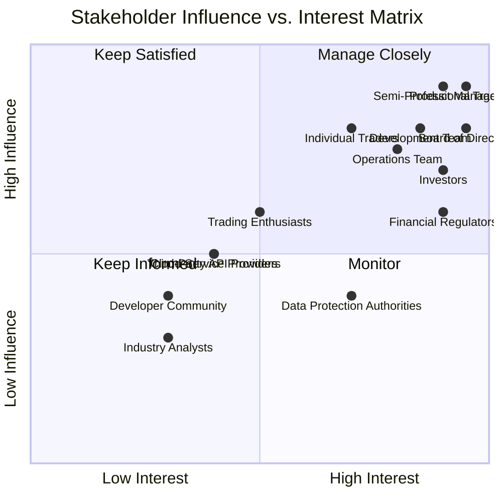

# Stakeholder Analysis

## Overview

This document provides a comprehensive analysis of all stakeholders involved in the Axisor trading automation platform project. It identifies key stakeholders, their interests, influence, and communication requirements to ensure successful project delivery and ongoing platform success.

## Stakeholder Categories

### Primary Stakeholders

#### End Users

**Individual Traders**
- **Description**: Retail traders seeking automated trading solutions
- **Interests**: 
  - Easy-to-use trading automation tools
  - Competitive pricing and subscription plans
  - Reliable margin protection
  - Comprehensive market simulations
  - Responsive customer support
- **Influence**: High (direct revenue source)
- **Communication**: Regular updates, user feedback sessions, support channels

**Semi-Professional Traders**
- **Description**: Experienced traders managing significant portfolios
- **Interests**:
  - Advanced trading strategies and customization
  - Professional-grade analytics and reporting
  - High-performance execution
  - Risk management tools
  - API access for custom integrations
- **Influence**: Very High (high-value customers)
- **Communication**: Dedicated account management, technical support, feature requests

**Trading Enthusiasts**
- **Description**: Users interested in learning and experimenting with trading
- **Interests**:
  - Educational resources and tutorials
  - Simulation and backtesting tools
  - Community features and sharing
  - Affordable entry-level plans
  - Progress tracking and learning paths
- **Influence**: Medium (potential future customers)
- **Communication**: Educational content, community forums, onboarding support

#### Business Stakeholders

**Product Management**
- **Description**: Team responsible for product strategy and roadmap
- **Interests**:
  - Market research and competitive analysis
  - Feature prioritization and user feedback
  - Revenue growth and user acquisition
  - Product-market fit validation
  - Long-term strategic planning
- **Influence**: Very High (product direction)
- **Communication**: Regular product reviews, market analysis, user research

**Development Team**
- **Description**: Technical team responsible for platform development
- **Interests**:
  - Clear technical requirements and specifications
  - Modern development tools and practices
  - Code quality and maintainability
  - Performance and scalability
  - Technical innovation and learning
- **Influence**: High (implementation capability)
- **Communication**: Technical documentation, code reviews, architecture discussions

**Operations Team**
- **Description**: Team responsible for platform operations and maintenance
- **Interests**:
  - System reliability and uptime
  - Performance monitoring and optimization
  - Security and compliance
  - Disaster recovery and backup
  - Cost optimization and efficiency
- **Influence**: High (operational success)
- **Communication**: Operational metrics, incident reports, capacity planning

### Secondary Stakeholders

#### Financial Stakeholders

**Investors**
- **Description**: Financial backers and venture capitalists
- **Interests**:
  - Return on investment and growth metrics
  - Market expansion and competitive positioning
  - Financial performance and profitability
  - Risk management and mitigation
  - Exit strategies and valuation
- **Influence**: Very High (funding and strategic direction)
- **Communication**: Financial reports, board meetings, investor updates

**Board of Directors**
- **Description**: Governance body providing strategic oversight
- **Interests**:
  - Strategic direction and governance
  - Risk management and compliance
  - Executive performance and succession
  - Financial oversight and audit
  - Stakeholder value creation
- **Influence**: Very High (governance and oversight)
- **Communication**: Board meetings, governance reports, strategic reviews

#### Regulatory Stakeholders

**Financial Regulators**
- **Description**: Government agencies overseeing financial services
- **Interests**:
  - Compliance with financial regulations
  - Consumer protection and fair practices
  - Market stability and integrity
  - Anti-money laundering (AML) compliance
  - Know Your Customer (KYC) requirements
- **Influence**: Very High (regulatory compliance)
- **Communication**: Compliance reports, regulatory filings, audit responses

**Data Protection Authorities**
- **Description**: Agencies responsible for data protection and privacy
- **Interests**:
  - GDPR compliance and data protection
  - Privacy by design principles
  - Data breach notification and response
  - User consent and data rights
  - Cross-border data transfers
- **Influence**: High (privacy compliance)
- **Communication**: Privacy impact assessments, compliance reports, breach notifications

#### Technology Partners

**Cloud Service Providers**
- **Description**: AWS, GCP, Azure providing infrastructure services
- **Interests**:
  - Service utilization and growth
  - Performance and reliability
  - Cost optimization and efficiency
  - Security and compliance
  - Innovation and new services
- **Influence**: Medium (infrastructure dependency)
- **Communication**: Service level agreements, performance reviews, cost optimization

**Third-Party API Providers**
- **Description**: External services providing market data and trading APIs
- **Interests**:
  - API usage and revenue
  - Service reliability and performance
  - Security and compliance
  - Innovation and new features
  - Partnership and integration
- **Influence**: Medium (service dependency)
- **Communication**: API documentation, service updates, performance monitoring

#### Community Stakeholders

**Developer Community**
- **Description**: External developers and contributors
- **Interests**:
  - API documentation and tools
  - Developer support and resources
  - Community recognition and contribution
  - Technical innovation and best practices
  - Open source collaboration
- **Influence**: Medium (ecosystem development)
- **Communication**: Developer documentation, community forums, technical blogs

**Industry Analysts**
- **Description**: Financial and technology analysts covering the industry
- **Interests**:
  - Market trends and competitive analysis
  - Technology innovation and adoption
  - Industry performance and outlook
  - Thought leadership and insights
  - Research and analysis
- **Influence**: Medium (market perception)
- **Communication**: Industry reports, analyst briefings, thought leadership

## Stakeholder Influence Matrix

### Influence vs. Interest Analysis



### Stakeholder Engagement Strategies

#### High Influence, High Interest (Manage Closely)
- **Semi-Professional Traders**: Dedicated account management, priority support
- **Product Management**: Regular collaboration, shared decision-making
- **Development Team**: Close collaboration, technical leadership
- **Operations Team**: Integrated planning, operational excellence
- **Investors**: Regular updates, strategic alignment
- **Board of Directors**: Governance oversight, strategic guidance
- **Financial Regulators**: Compliance partnership, regulatory excellence

#### High Influence, Low Interest (Keep Satisfied)
- **Data Protection Authorities**: Compliance excellence, proactive engagement
- **Cloud Service Providers**: Service optimization, cost management
- **Third-Party API Providers**: Partnership management, service reliability

#### Low Influence, High Interest (Keep Informed)
- **Individual Traders**: Regular updates, user feedback, support
- **Trading Enthusiasts**: Educational content, community engagement
- **Developer Community**: Documentation, community support, recognition

#### Low Influence, Low Interest (Monitor)
- **Industry Analysts**: Market intelligence, thought leadership
- **Competitors**: Competitive analysis, market positioning
- **Media**: Public relations, thought leadership

## Communication Strategy

### Communication Matrix

#### Communication Channels by Stakeholder

**Primary Stakeholders**
```typescript
interface PrimaryStakeholderCommunication {
  endUsers: {
    channels: ["Email", "In-app notifications", "Support tickets", "User forums"];
    frequency: "Real-time for critical updates, weekly for general updates";
    content: ["Product updates", "Feature announcements", "Support responses"];
  };
  businessStakeholders: {
    channels: ["Slack", "Email", "Video calls", "Project management tools"];
    frequency: "Daily for operations, weekly for strategy";
    content: ["Project status", "Performance metrics", "Strategic decisions"];
  };
}
```

**Secondary Stakeholders**
```typescript
interface SecondaryStakeholderCommunication {
  financialStakeholders: {
    channels: ["Board meetings", "Financial reports", "Investor updates"];
    frequency: "Monthly for reports, quarterly for reviews";
    content: ["Financial performance", "Strategic updates", "Risk assessments"];
  };
  regulatoryStakeholders: {
    channels: ["Compliance reports", "Regulatory filings", "Audit responses"];
    frequency: "As required by regulations, quarterly for updates";
    content: ["Compliance status", "Regulatory changes", "Audit results"];
  };
  technologyPartners: {
    channels: ["Service reviews", "Technical documentation", "Partnership meetings"];
    frequency: "Monthly for reviews, quarterly for planning";
    content: ["Service performance", "Technical updates", "Partnership opportunities"];
  };
}
```

### Communication Protocols

#### Stakeholder Communication Protocols

**Critical Updates**
- **Immediate Notification**: Security incidents, system outages, regulatory changes
- **Communication Method**: Email, SMS, in-app notifications
- **Response Time**: Within 1 hour for critical issues
- **Follow-up**: Detailed incident reports and resolution updates

**Regular Updates**
- **Frequency**: Weekly for operations, monthly for strategy
- **Communication Method**: Email newsletters, dashboard updates, reports
- **Content**: Progress updates, performance metrics, upcoming changes
- **Feedback**: Stakeholder feedback collection and response

**Strategic Communications**
- **Frequency**: Quarterly for major updates, annually for strategy
- **Communication Method**: Board meetings, investor presentations, strategy sessions
- **Content**: Strategic direction, market analysis, competitive positioning
- **Engagement**: Interactive sessions, Q&A, feedback collection

## Stakeholder Management

### Engagement Strategies

#### User Engagement
```typescript
// User Engagement Strategy
interface UserEngagement {
  onboarding: {
    welcomeSequence: "Email series introducing platform features";
    tutorials: "Interactive tutorials and guided tours";
    support: "Dedicated onboarding support team";
    feedback: "Early user feedback collection and response";
  };
  ongoing: {
    community: "User forums and community features";
    education: "Regular educational content and webinars";
    support: "Multi-channel support system";
    recognition: "User achievement and recognition programs";
  };
  feedback: {
    collection: "Regular surveys and feedback requests";
    response: "Timely response to user feedback";
    implementation: "Feature requests and improvements";
    communication: "Updates on feedback implementation";
  };
}
```

#### Business Stakeholder Engagement
```typescript
// Business Stakeholder Engagement
interface BusinessStakeholderEngagement {
  product: {
    collaboration: "Regular product planning and review sessions";
    feedback: "User research and market analysis";
    alignment: "Strategic alignment and goal setting";
    communication: "Clear communication of product direction";
  };
  development: {
    planning: "Sprint planning and technical reviews";
    collaboration: "Cross-functional collaboration and communication";
    quality: "Code quality and performance standards";
    innovation: "Technical innovation and best practices";
  };
  operations: {
    monitoring: "Real-time monitoring and alerting";
    optimization: "Performance optimization and cost management";
    reliability: "System reliability and uptime management";
    security: "Security monitoring and incident response";
  };
}
```

### Conflict Resolution

#### Stakeholder Conflict Management
```typescript
// Conflict Resolution Framework
interface ConflictResolution {
  identification: {
    earlyWarning: "Early identification of potential conflicts";
    rootCause: "Analysis of underlying causes and interests";
    impact: "Assessment of impact on project and stakeholders";
    escalation: "Clear escalation procedures and authority";
  };
  resolution: {
    mediation: "Neutral mediation and facilitation";
    negotiation: "Structured negotiation and compromise";
    decision: "Clear decision-making authority and process";
    communication: "Transparent communication of decisions";
  };
  prevention: {
    alignment: "Regular alignment and expectation setting";
    communication: "Clear and consistent communication";
    documentation: "Comprehensive documentation and agreements";
    monitoring: "Regular monitoring and early intervention";
  };
}
```

## Success Metrics

### Stakeholder Satisfaction Metrics

#### User Satisfaction
- **Net Promoter Score (NPS)**: Target > 50
- **Customer Satisfaction (CSAT)**: Target > 4.5/5
- **User Retention Rate**: Target > 80% annually
- **Support Response Time**: Target < 2 hours
- **Feature Adoption Rate**: Target > 60% for new features

#### Business Stakeholder Satisfaction
- **Product Team Satisfaction**: Regular surveys and feedback
- **Development Team Satisfaction**: Technical excellence and innovation
- **Operations Team Satisfaction**: System reliability and performance
- **Management Satisfaction**: Strategic alignment and execution

#### External Stakeholder Satisfaction
- **Regulatory Compliance**: 100% compliance with regulations
- **Partner Satisfaction**: Regular partner surveys and reviews
- **Investor Satisfaction**: Financial performance and growth metrics
- **Community Satisfaction**: Developer and user community engagement

### Engagement Metrics

#### Communication Effectiveness
- **Response Rates**: Email open rates, meeting attendance
- **Feedback Quality**: Detailed and actionable feedback
- **Engagement Levels**: Active participation in discussions
- **Satisfaction Scores**: Regular satisfaction surveys
- **Relationship Health**: Relationship quality assessments

## Risk Management

### Stakeholder-Related Risks

#### High-Risk Scenarios
- **Key Stakeholder Departure**: Loss of critical expertise or relationships
- **Regulatory Changes**: New compliance requirements or restrictions
- **Market Changes**: Competitive threats or market disruption
- **Technology Changes**: Disruption of key technology dependencies
- **Financial Constraints**: Funding issues or budget constraints

#### Risk Mitigation Strategies
- **Knowledge Documentation**: Comprehensive documentation of stakeholder knowledge
- **Relationship Management**: Strong relationships with multiple stakeholders
- **Diversification**: Multiple partners and service providers
- **Compliance Monitoring**: Proactive regulatory compliance management
- **Financial Planning**: Robust financial planning and risk management

## Conclusion

The stakeholder analysis for Axisor provides a comprehensive framework for managing relationships with all project stakeholders. By understanding stakeholder interests, influence, and communication requirements, the project can ensure successful delivery and ongoing platform success.

The influence vs. interest matrix helps prioritize stakeholder engagement efforts, while the communication strategy ensures appropriate and effective communication with each stakeholder group. The engagement strategies and conflict resolution framework provide tools for managing stakeholder relationships effectively.

Regular monitoring of stakeholder satisfaction and engagement metrics ensures that stakeholder needs are being met and relationships remain healthy. The risk management approach helps identify and mitigate potential stakeholder-related risks that could impact project success.

This analysis serves as the foundation for stakeholder management throughout the project lifecycle, ensuring that all stakeholders are appropriately engaged and their needs are addressed in the platform development and operation.
