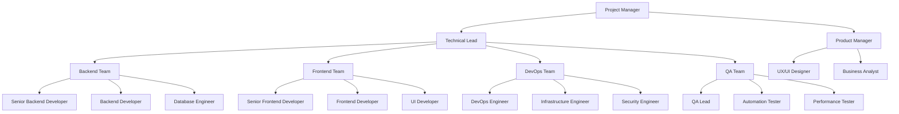

# Team Structure

## Overview

The Axisor project team is organized around functional expertise and cross-functional collaboration, ensuring efficient development, deployment, and maintenance of the trading automation platform. The team structure emphasizes clear roles, responsibilities, and communication channels.

## Team Organization

### Core Team Structure


## Role Definitions

### Leadership Roles

#### Project Manager
**Responsibilities:**
- Overall project coordination and timeline management
- Resource allocation and team coordination
- Risk management and mitigation strategies
- Stakeholder communication and reporting
- Budget management and cost control

**Key Skills:**
- Project management methodologies (Agile, Scrum)
- Financial services domain knowledge
- Risk assessment and management
- Team leadership and communication

#### Technical Lead
**Responsibilities:**
- Technical architecture decisions and oversight
- Code review and quality assurance
- Technical mentoring and team development
- Technology stack evaluation and selection
- Integration with external systems and APIs

**Key Skills:**
- Full-stack development expertise
- System architecture design
- Performance optimization
- Security best practices
- Team leadership

#### Product Manager
**Responsibilities:**
- Product strategy and roadmap planning
- Feature prioritization and requirements gathering
- User experience optimization
- Market research and competitive analysis
- Product metrics and analytics

**Key Skills:**
- Product management methodologies
- User experience design
- Data analysis and metrics
- Financial services knowledge
- Stakeholder management

### Development Teams

#### Backend Team

##### Senior Backend Developer
**Responsibilities:**
- Core API development and architecture
- Database design and optimization
- Integration with external trading APIs
- Performance optimization and scaling
- Code review and mentoring

**Key Skills:**
- Node.js and TypeScript expertise
- PostgreSQL and Redis proficiency
- API design and development
- Microservices architecture
- Financial data processing

**Code Example:**
```typescript
// Senior Backend Developer - API Controller
@Controller('/api/v1/trading')
export class TradingController {
  constructor(
    private readonly tradingService: TradingService,
    private readonly authService: AuthService
  ) {}

  @Post('/execute')
  @UseGuards(JwtAuthGuard)
  async executeTrade(@Body() tradeRequest: TradeRequest): Promise<TradeResponse> {
    const user = await this.authService.getCurrentUser();
    return await this.tradingService.executeTrade(user.id, tradeRequest);
  }
}
```

##### Backend Developer
**Responsibilities:**
- Feature implementation and bug fixes
- Unit and integration testing
- API documentation
- Database migrations and maintenance
- Performance monitoring

**Key Skills:**
- Node.js and TypeScript
- RESTful API development
- Database query optimization
- Testing frameworks (Jest, Supertest)
- Git and version control

##### Database Engineer
**Responsibilities:**
- Database schema design and optimization
- Query performance tuning
- Data migration and backup strategies
- Database security and compliance
- Monitoring and maintenance

**Key Skills:**
- PostgreSQL expertise
- Database optimization techniques
- Data modeling and design
- Backup and recovery procedures
- Security and compliance

#### Frontend Team

##### Senior Frontend Developer
**Responsibilities:**
- Frontend architecture and design patterns
- Component library development
- State management implementation
- Performance optimization
- Code review and mentoring

**Key Skills:**
- React and TypeScript expertise
- Next.js and Vite proficiency
- State management (Zustand, Redux)
- UI/UX implementation
- Performance optimization

**Code Example:**
```typescript
// Senior Frontend Developer - Custom Hook
export const useTradingData = () => {
  const [data, setData] = useState<TradingData | null>(null);
  const [loading, setLoading] = useState(false);
  const [error, setError] = useState<string | null>(null);

  const fetchData = useCallback(async () => {
    setLoading(true);
    setError(null);
    
    try {
      const response = await tradingApi.getData();
      setData(response.data);
    } catch (err) {
      setError(err.message);
    } finally {
      setLoading(false);
    }
  }, []);

  return { data, loading, error, fetchData };
};
```

##### Frontend Developer
**Responsibilities:**
- Feature implementation and UI development
- Component testing and debugging
- Responsive design implementation
- API integration
- Code optimization

**Key Skills:**
- React and TypeScript
- CSS and Tailwind CSS
- Component testing (React Testing Library)
- Git and version control
- Responsive design

##### UI Developer
**Responsibilities:**
- UI component implementation
- Design system maintenance
- Animation and interaction development
- Cross-browser compatibility
- Accessibility implementation

**Key Skills:**
- HTML, CSS, and JavaScript
- Design system tools (Storybook)
- Animation libraries (Framer Motion)
- Accessibility standards (WCAG)
- Cross-browser testing

### Infrastructure Teams

#### DevOps Team

##### DevOps Engineer
**Responsibilities:**
- CI/CD pipeline development and maintenance
- Infrastructure automation and provisioning
- Monitoring and alerting systems
- Deployment strategies and rollback procedures
- Performance optimization

**Key Skills:**
- Docker and Kubernetes
- CI/CD tools (GitHub Actions, Jenkins)
- Infrastructure as Code (Terraform)
- Monitoring tools (Prometheus, Grafana)
- Cloud platforms (AWS, GCP, Azure)

**Infrastructure Example:**
```yaml
# DevOps Engineer - Kubernetes Deployment
apiVersion: apps/v1
kind: Deployment
metadata:
  name: axisor-backend
spec:
  replicas: 3
  selector:
    matchLabels:
      app: axisor-backend
  template:
    metadata:
      labels:
        app: axisor-backend
    spec:
      containers:
      - name: backend
        image: axisor/backend:latest
        ports:
        - containerPort: 3000
        env:
        - name: DATABASE_URL
          valueFrom:
            secretKeyRef:
              name: db-secret
              key: url
```

##### Infrastructure Engineer
**Responsibilities:**
- Server and network infrastructure management
- Security implementation and monitoring
- Backup and disaster recovery
- Capacity planning and scaling
- Cost optimization

**Key Skills:**
- Linux system administration
- Network security and protocols
- Cloud infrastructure management
- Monitoring and logging systems
- Disaster recovery planning

##### Security Engineer
**Responsibilities:**
- Security architecture and implementation
- Vulnerability assessment and penetration testing
- Compliance and audit preparation
- Security monitoring and incident response
- Security training and awareness

**Key Skills:**
- Cybersecurity expertise
- Penetration testing tools
- Compliance frameworks (SOC 2, PCI DSS)
- Security monitoring and SIEM
- Incident response procedures

#### QA Team

##### QA Lead
**Responsibilities:**
- Test strategy and planning
- Quality assurance processes and standards
- Test automation framework development
- Team coordination and mentoring
- Quality metrics and reporting

**Key Skills:**
- Test management and planning
- Test automation frameworks
- Quality assurance methodologies
- Team leadership
- Metrics and reporting

##### Automation Tester
**Responsibilities:**
- Automated test development and maintenance
- Test framework optimization
- Continuous integration testing
- Performance test automation
- Test data management

**Key Skills:**
- Test automation tools (Playwright, Selenium)
- Programming languages (JavaScript, Python)
- CI/CD integration
- Performance testing tools
- Test data management

##### Performance Tester
**Responsibilities:**
- Performance test planning and execution
- Load testing and stress testing
- Performance bottleneck identification
- Optimization recommendations
- Performance monitoring

**Key Skills:**
- Performance testing tools (JMeter, K6)
- Performance analysis and optimization
- Load testing methodologies
- Monitoring and profiling tools
- Database performance tuning

### Support Roles

#### UX/UI Designer
**Responsibilities:**
- User experience research and design
- Interface design and prototyping
- Design system development
- User testing and feedback analysis
- Accessibility and usability optimization

**Key Skills:**
- UX/UI design tools (Figma, Sketch)
- User research methodologies
- Design systems and component libraries
- Accessibility standards
- Prototyping and testing

#### Business Analyst
**Responsibilities:**
- Requirements gathering and analysis
- Business process documentation
- Stakeholder communication
- Data analysis and reporting
- Change management

**Key Skills:**
- Business analysis methodologies
- Requirements gathering techniques
- Data analysis and visualization
- Stakeholder management
- Process documentation

## Communication Structure

### Daily Operations
- **Daily Standups**: 15-minute daily sync meetings
- **Sprint Planning**: Bi-weekly sprint planning sessions
- **Retrospectives**: Bi-weekly retrospective meetings
- **Code Reviews**: Mandatory peer review process

### Reporting Structure
- **Weekly Reports**: Progress updates to stakeholders
- **Monthly Reviews**: Comprehensive project reviews
- **Quarterly Planning**: Strategic planning sessions
- **Annual Reviews**: Performance and goal setting

### Communication Channels
- **Slack**: Real-time team communication
- **GitHub**: Code collaboration and issue tracking
- **Jira**: Project management and task tracking
- **Confluence**: Documentation and knowledge sharing
- **Zoom**: Video meetings and presentations

## Collaboration Guidelines

### Code Collaboration
```typescript
// Example: Code Review Checklist
interface CodeReviewChecklist {
  functionality: {
    codeWorks: boolean;
    edgeCasesHandled: boolean;
    errorHandling: boolean;
  };
  quality: {
    codeStyle: boolean;
    documentation: boolean;
    tests: boolean;
  };
  security: {
    inputValidation: boolean;
    authentication: boolean;
    authorization: boolean;
  };
  performance: {
    efficientAlgorithms: boolean;
    databaseOptimization: boolean;
    cachingStrategy: boolean;
  };
}
```

### Documentation Standards
- **API Documentation**: OpenAPI/Swagger specifications
- **Code Documentation**: JSDoc comments for functions and classes
- **Architecture Documentation**: System design and component documentation
- **User Documentation**: User guides and tutorials
- **Process Documentation**: Development and deployment procedures

### Quality Assurance
- **Code Quality**: ESLint, Prettier, and TypeScript strict mode
- **Testing**: Minimum 80% code coverage requirement
- **Security**: Regular security scans and vulnerability assessments
- **Performance**: Performance testing and optimization
- **Accessibility**: WCAG 2.1 AA compliance

## Team Development

### Skill Development
- **Technical Training**: Regular technical skill development sessions
- **Certification Programs**: Support for professional certifications
- **Conference Attendance**: Budget for industry conference attendance
- **Internal Knowledge Sharing**: Regular tech talks and workshops
- **Mentorship Programs**: Pair programming and mentoring initiatives

### Career Growth
- **Performance Reviews**: Regular performance evaluations
- **Goal Setting**: Individual and team goal setting
- **Career Pathing**: Clear career progression paths
- **Learning Budget**: Annual learning and development budget
- **Internal Mobility**: Opportunities for role changes and growth

## Remote Work Considerations

### Collaboration Tools
- **Video Conferencing**: Zoom for meetings and presentations
- **Screen Sharing**: Collaborative development sessions
- **Documentation**: Centralized documentation and knowledge base
- **Version Control**: Git-based collaboration and code review
- **Project Management**: Agile project management tools

### Communication Protocols
- **Response Times**: Defined response time expectations
- **Availability**: Clear availability and time zone coordination
- **Meeting Etiquette**: Structured meeting protocols
- **Documentation**: Comprehensive documentation for remote collaboration
- **Cultural Awareness**: Sensitivity to different time zones and cultures

## Conclusion

The Axisor team structure is designed to foster collaboration, innovation, and high-quality delivery. By clearly defining roles, responsibilities, and communication channels, the team can effectively work together to build and maintain a world-class trading automation platform.

The structure emphasizes technical excellence, continuous learning, and effective communication, ensuring that the project can adapt to changing requirements while maintaining high standards of quality and performance.
