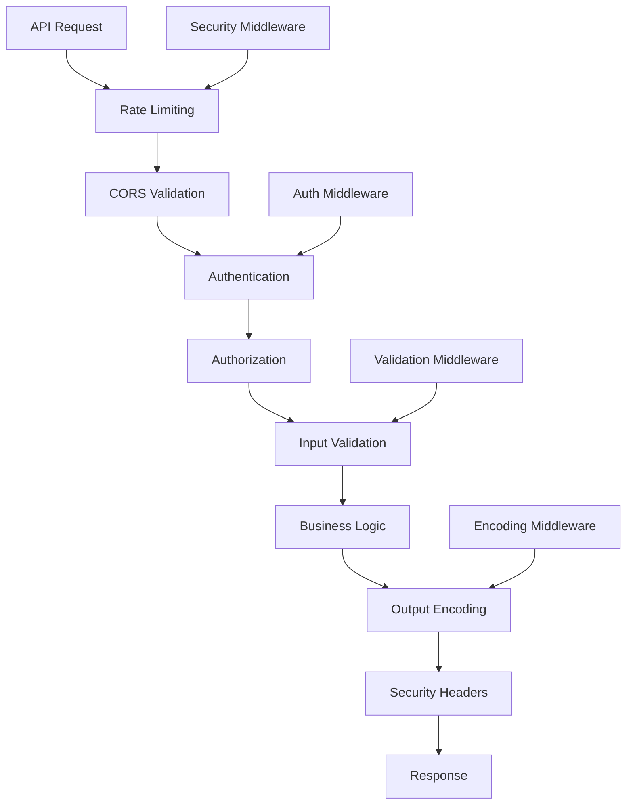

# API Security Overview

## Summary

Comprehensive overview of API security implementation in the Axisor platform. This document covers authentication, authorization, input validation, output encoding, security headers, and protection against common API vulnerabilities.

## API Security Architecture



## Security Middleware Stack

### Authentication Middleware

```typescript
// backend/src/middleware/auth.middleware.ts
export async function authMiddleware(
  request: FastifyRequest,
  reply: FastifyReply
): Promise<void> {
  try {
    console.log('🔍 AUTH MIDDLEWARE - Starting authentication check');
    
    // Get token from Authorization header
    const authHeader = request.headers.authorization;

    if (!authHeader || !authHeader.startsWith('Bearer ')) {
      console.log('❌ AUTH MIDDLEWARE - No valid authorization header');
      return reply.status(401).send({
        error: 'UNAUTHORIZED',
        message: 'Authorization header with Bearer token is required',
      });
    }

    const token = authHeader.substring(7); // Remove 'Bearer ' prefix
    console.log('🔍 AUTH MIDDLEWARE - Token extracted:', '[REDACTED]');

    // Initialize auth service with singleton Prisma instance
    const prisma = await getPrisma();
    const authService = new AuthService(prisma, request.server);

    // Validate token and get user
    console.log('🔍 AUTH MIDDLEWARE - Validating session...');
    const user = await authService.validateSession(token);
    console.log('🔍 AUTH MIDDLEWARE - User from validateSession:', user?.email, 'ID:', user?.id);

    // Attach user to request
    (request as any).user = user;
    
    console.log('✅ AUTH MIDDLEWARE - Authentication successful');
  } catch (error) {
    console.log('❌ AUTH MIDDLEWARE - Error:', error);
    return reply.status(401).send({
      error: 'UNAUTHORIZED',
      message: error instanceof Error ? error.message : 'Invalid token',
    });
  }
}
```

### Input Validation Middleware

```typescript
// backend/src/middleware/validation.middleware.ts
import { FastifyRequest, FastifyReply } from 'fastify';
import Joi from 'joi';

export function validateInput(schema: Joi.ObjectSchema) {
  return async (request: FastifyRequest, reply: FastifyReply): Promise<void> => {
    try {
      const { error, value } = schema.validate(request.body, {
        abortEarly: false,
        stripUnknown: true,
        convert: true
      });

      if (error) {
        const errorDetails = error.details.map(detail => ({
          field: detail.path.join('.'),
          message: detail.message,
          value: detail.context?.value
        }));

        return reply.status(400).send({
          error: 'VALIDATION_ERROR',
          message: 'Input validation failed',
          details: errorDetails
        });
      }

      // Replace request body with validated and sanitized data
      request.body = value;
    } catch (error) {
      return reply.status(500).send({
        error: 'INTERNAL_SERVER_ERROR',
        message: 'Validation middleware error'
      });
    }
  };
}

// Common validation schemas
export const validationSchemas = {
  userRegistration: Joi.object({
    email: Joi.string().email().required().max(255),
    username: Joi.string().alphanum().min(3).max(30).required(),
    password: Joi.string().min(8).max(128).pattern(
      /^(?=.*[a-z])(?=.*[A-Z])(?=.*\d)(?=.*[@$!%*?&])[A-Za-z\d@$!%*?&]/
    ).required(),
    coupon_code: Joi.string().optional().max(50)
  }),

  userLogin: Joi.object({
    emailOrUsername: Joi.string().required().max(255),
    password: Joi.string().required(),
    twoFactorToken: Joi.string().optional().max(10)
  }),

  automation: Joi.object({
    name: Joi.string().required().max(100),
    type: Joi.string().valid('take_profit', 'stop_loss', 'auto_entry').required(),
    is_active: Joi.boolean().default(true),
    config: Joi.object().required()
  }),

  marginGuard: Joi.object({
    mode: Joi.string().valid('basic', 'advanced', 'aggressive').required(),
    margin_threshold: Joi.number().min(5).max(95).required(),
    positions: Joi.array().items(Joi.string()).max(100),
    notification_channels: Joi.array().items(Joi.string()).required()
  })
};
```

### Output Encoding Middleware

```typescript
// backend/src/middleware/output-encoding.middleware.ts
import { FastifyRequest, FastifyReply } from 'fastify';

export async function outputEncodingMiddleware(
  request: FastifyRequest,
  reply: FastifyReply,
  payload: any
): Promise<any> {
  try {
    // Ensure proper content type
    if (!reply.getHeader('content-type')) {
      reply.header('content-type', 'application/json');
    }

    // Sanitize output based on content type
    if (reply.getHeader('content-type')?.includes('application/json')) {
      return sanitizeJSON(payload);
    }

    if (reply.getHeader('content-type')?.includes('text/html')) {
      return sanitizeHTML(payload);
    }

    if (reply.getHeader('content-type')?.includes('text/plain')) {
      return sanitizeText(payload);
    }

    return payload;
  } catch (error) {
    console.error('Output encoding error:', error);
    return payload;
  }
}

/**
 * Sanitize JSON output
 */
function sanitizeJSON(data: any): any {
  if (typeof data === 'string') {
    return escapeJSON(data);
  }

  if (Array.isArray(data)) {
    return data.map(item => sanitizeJSON(item));
  }

  if (data && typeof data === 'object') {
    const sanitized: any = {};
    for (const [key, value] of Object.entries(data)) {
      sanitized[escapeJSON(key)] = sanitizeJSON(value);
    }
    return sanitized;
  }

  return data;
}

/**
 * Sanitize HTML output
 */
function sanitizeHTML(data: any): string {
  if (typeof data !== 'string') {
    data = JSON.stringify(data);
  }

  return data
    .replace(/&/g, '&amp;')
    .replace(/</g, '&lt;')
    .replace(/>/g, '&gt;')
    .replace(/"/g, '&quot;')
    .replace(/'/g, '&#x27;')
    .replace(/\//g, '&#x2F;');
}

/**
 * Sanitize plain text output
 */
function sanitizeText(data: any): string {
  if (typeof data !== 'string') {
    data = JSON.stringify(data);
  }

  // Remove control characters except newlines and tabs
  return data.replace(/[\x00-\x08\x0B\x0C\x0E-\x1F\x7F]/g, '');
}

/**
 * Escape JSON strings
 */
function escapeJSON(str: string): string {
  return str
    .replace(/\\/g, '\\\\')
    .replace(/"/g, '\\"')
    .replace(/\n/g, '\\n')
    .replace(/\r/g, '\\r')
    .replace(/\t/g, '\\t');
}
```

## Security Headers Implementation

### Security Headers Service

```typescript
// backend/src/services/security-headers.service.ts
export class SecurityHeadersService {
  /**
   * Apply comprehensive security headers
   */
  static applySecurityHeaders(reply: FastifyReply, request: FastifyRequest): void {
    // Content Security Policy
    reply.header('Content-Security-Policy', [
      "default-src 'self'",
      "script-src 'self' 'unsafe-inline' 'unsafe-eval' https://cdn.jsdelivr.net",
      "style-src 'self' 'unsafe-inline' https://fonts.googleapis.com",
      "font-src 'self' https://fonts.gstatic.com",
      "img-src 'self' data: https:",
      "connect-src 'self' https://api.lnmarkets.com",
      "frame-src 'none'",
      "object-src 'none'",
      "base-uri 'self'",
      "form-action 'self'"
    ].join('; '));

    // Security headers
    reply.header('X-Content-Type-Options', 'nosniff');
    reply.header('X-Frame-Options', 'DENY');
    reply.header('X-XSS-Protection', '1; mode=block');
    reply.header('Referrer-Policy', 'strict-origin-when-cross-origin');
    reply.header('Permissions-Policy', [
      'camera=()',
      'microphone=()',
      'geolocation=()',
      'interest-cohort=()',
      'usb=()',
      'bluetooth=()',
      'magnetometer=()',
      'accelerometer=()',
      'gyroscope=()'
    ].join(', '));

    // HSTS (only for HTTPS)
    if (request.protocol === 'https') {
      reply.header('Strict-Transport-Security', 'max-age=31536000; includeSubDomains; preload');
    }

    // Additional security headers
    reply.header('X-DNS-Prefetch-Control', 'off');
    reply.header('X-Download-Options', 'noopen');
    reply.header('X-Permitted-Cross-Domain-Policies', 'none');
    reply.header('Cross-Origin-Embedder-Policy', 'require-corp');
    reply.header('Cross-Origin-Opener-Policy', 'same-origin');
    reply.header('Cross-Origin-Resource-Policy', 'same-origin');
  }

  /**
   * Apply API-specific security headers
   */
  static applyAPISecurityHeaders(reply: FastifyReply): void {
    // API-specific headers
    reply.header('X-API-Version', '2.0');
    reply.header('X-Response-Time', Date.now().toString());
    
    // Cache control for API responses
    reply.header('Cache-Control', 'no-cache, no-store, must-revalidate');
    reply.header('Pragma', 'no-cache');
    reply.header('Expires', '0');
  }

  /**
   * Apply CORS headers with security considerations
   */
  static applyCORSSecurityHeaders(
    reply: FastifyReply,
    origin: string,
    allowedOrigins: string[]
  ): void {
    if (allowedOrigins.includes(origin)) {
      reply.header('Access-Control-Allow-Origin', origin);
      reply.header('Access-Control-Allow-Credentials', 'true');
      reply.header('Access-Control-Allow-Methods', 'GET, POST, PUT, DELETE, OPTIONS, PATCH');
      reply.header('Access-Control-Allow-Headers', [
        'Origin',
        'X-Requested-With',
        'Content-Type',
        'Accept',
        'Authorization',
        'X-API-Key',
        'X-Request-ID'
      ].join(', '));
      reply.header('Access-Control-Max-Age', '86400');
    }
  }
}
```

## Input Sanitization

### Input Sanitization Service

```typescript
// backend/src/services/input-sanitization.service.ts
import DOMPurify from 'isomorphic-dompurify';
import validator from 'validator';

export class InputSanitizationService {
  /**
   * Sanitize user input
   */
  static sanitizeInput(input: any, type: 'text' | 'html' | 'sql' | 'json'): any {
    if (typeof input === 'string') {
      return this.sanitizeString(input, type);
    }

    if (Array.isArray(input)) {
      return input.map(item => this.sanitizeInput(item, type));
    }

    if (input && typeof input === 'object') {
      const sanitized: any = {};
      for (const [key, value] of Object.entries(input)) {
        sanitized[this.sanitizeString(key, 'text')] = this.sanitizeInput(value, type);
      }
      return sanitized;
    }

    return input;
  }

  /**
   * Sanitize string input
   */
  static sanitizeString(input: string, type: 'text' | 'html' | 'sql' | 'json'): string {
    if (!input || typeof input !== 'string') {
      return '';
    }

    switch (type) {
      case 'html':
        return DOMPurify.sanitize(input, {
          ALLOWED_TAGS: [],
          ALLOWED_ATTR: []
        });

      case 'sql':
        return this.sanitizeSQL(input);

      case 'json':
        return this.sanitizeJSON(input);

      case 'text':
      default:
        return this.sanitizeText(input);
    }
  }

  /**
   * Sanitize text input
   */
  static sanitizeText(input: string): string {
    return validator.escape(input)
      .replace(/[<>]/g, '')
      .replace(/javascript:/gi, '')
      .replace(/on\w+=/gi, '')
      .trim();
  }

  /**
   * Sanitize SQL input (basic protection)
   */
  static sanitizeSQL(input: string): string {
    // Remove SQL injection patterns
    return input
      .replace(/['"]/g, '')
      .replace(/;/g, '')
      .replace(/--/g, '')
      .replace(/\/\*/g, '')
      .replace(/\*\//g, '')
      .replace(/union/gi, '')
      .replace(/select/gi, '')
      .replace(/insert/gi, '')
      .replace(/update/gi, '')
      .replace(/delete/gi, '')
      .replace(/drop/gi, '')
      .replace(/create/gi, '')
      .replace(/alter/gi, '')
      .replace(/exec/gi, '')
      .replace(/execute/gi, '');
  }

  /**
   * Sanitize JSON input
   */
  static sanitizeJSON(input: string): string {
    try {
      // Validate and parse JSON
      const parsed = JSON.parse(input);
      
      // Sanitize the parsed object
      const sanitized = this.sanitizeInput(parsed, 'json');
      
      // Return sanitized JSON string
      return JSON.stringify(sanitized);
    } catch (error) {
      // Return empty object if JSON is invalid
      return '{}';
    }
  }

  /**
   * Validate and sanitize email
   */
  static sanitizeEmail(email: string): string {
    if (!validator.isEmail(email)) {
      throw new Error('Invalid email format');
    }
    
    return validator.normalizeEmail(email) || email;
  }

  /**
   * Validate and sanitize URL
   */
  static sanitizeURL(url: string): string {
    if (!validator.isURL(url, { protocols: ['http', 'https'] })) {
      throw new Error('Invalid URL format');
    }
    
    return validator.escape(url);
  }

  /**
   * Sanitize file upload data
   */
  static sanitizeFileUpload(file: any): any {
    if (!file || typeof file !== 'object') {
      throw new Error('Invalid file data');
    }

    return {
      name: this.sanitizeString(file.name || '', 'text'),
      type: this.sanitizeString(file.type || '', 'text'),
      size: parseInt(file.size) || 0,
      data: file.data // Binary data should be handled separately
    };
  }
}
```

## API Security Testing

### Security Test Suite

```typescript
// backend/src/tests/api-security.test.ts
import { test } from 'tap';
import Fastify from 'fastify';

test('API Security Tests', async (t) => {
  const fastify = Fastify();
  
  // Register security middleware
  await fastify.register(require('@fastify/helmet'));
  await fastify.register(require('@fastify/rate-limit'), {
    max: 100,
    timeWindow: '1 minute'
  });

  // Test route
  fastify.post('/test', {
    preHandler: [validateInput(validationSchemas.userRegistration)],
    handler: async (request, reply) => {
      return { success: true, data: request.body };
    }
  });

  // Test SQL injection protection
  t.test('should protect against SQL injection', async (t) => {
    const maliciousPayload = {
      email: "'; DROP TABLE users; --",
      username: "admin' OR '1'='1",
      password: "password"
    };

    const response = await fastify.inject({
      method: 'POST',
      url: '/test',
      payload: maliciousPayload
    });

    // Should not crash the server
    t.notEqual(response.statusCode, 500);
    
    // Should return validation error
    t.equal(response.statusCode, 400);
  });

  // Test XSS protection
  t.test('should protect against XSS', async (t) => {
    const xssPayload = {
      email: 'test@example.com',
      username: '<script>alert("xss")</script>',
      password: 'password123'
    };

    const response = await fastify.inject({
      method: 'POST',
      url: '/test',
      payload: xssPayload
    });

    // Should sanitize the input
    t.equal(response.statusCode, 400);
  });

  // Test rate limiting
  t.test('should enforce rate limiting', async (t) => {
    const validPayload = {
      email: 'test@example.com',
      username: 'testuser',
      password: 'Password123!'
    };

    // Make multiple requests
    for (let i = 0; i < 105; i++) {
      const response = await fastify.inject({
        method: 'POST',
        url: '/test',
        payload: validPayload
      });

      if (i >= 100) {
        t.equal(response.statusCode, 429);
      }
    }
  });

  await fastify.close();
});
```

## Security Monitoring

### API Security Monitoring

```typescript
// backend/src/services/api-security-monitoring.service.ts
export class APISecurityMonitoringService {
  private prisma: PrismaClient;

  constructor(prisma: PrismaClient) {
    this.prisma = prisma;
  }

  /**
   * Monitor API security events
   */
  async monitorAPISecurity(): Promise<void> {
    await Promise.all([
      this.checkSuspiciousRequests(),
      this.checkAuthenticationFailures(),
      this.checkInputValidationFailures(),
      this.checkRateLimitViolations()
    ]);
  }

  /**
   * Check for suspicious API requests
   */
  private async checkSuspiciousRequests(): Promise<void> {
    const suspiciousPatterns = [
      'sql injection',
      'xss',
      'path traversal',
      'command injection',
      'ldap injection'
    ];

    const recentRequests = await this.prisma.apiRequestLog.findMany({
      where: {
        timestamp: { gte: new Date(Date.now() - 60 * 60 * 1000) },
        status_code: { gte: 400 }
      },
      orderBy: { timestamp: 'desc' },
      take: 1000
    });

    const suspiciousRequests = recentRequests.filter(request => {
      const requestData = JSON.stringify(request);
      return suspiciousPatterns.some(pattern => 
        requestData.toLowerCase().includes(pattern)
      );
    });

    if (suspiciousRequests.length > 0) {
      await this.createSecurityAlert({
        type: 'SUSPICIOUS_API_REQUESTS',
        severity: 'high',
        description: 'Suspicious API requests detected',
        details: {
          count: suspiciousRequests.length,
          patterns: suspiciousPatterns.filter(pattern =>
            suspiciousRequests.some(req => 
              JSON.stringify(req).toLowerCase().includes(pattern)
            )
          )
        }
      });
    }
  }

  /**
   * Check authentication failures
   */
  private async checkAuthenticationFailures(): Promise<void> {
    const authFailures = await this.prisma.securityAuditLog.findMany({
      where: {
        action: 'LOGIN_FAILED',
        created_at: { gte: new Date(Date.now() - 60 * 60 * 1000) },
        success: false
      },
      groupBy: ['ip_address'],
      having: {
        ip_address: {
          _count: { gte: 5 }
        }
      }
    });

    if (authFailures.length > 0) {
      await this.createSecurityAlert({
        type: 'AUTHENTICATION_ATTACK',
        severity: 'high',
        description: 'Multiple authentication failures detected',
        details: {
          affectedIPs: authFailures.map(f => f.ip_address),
          failureCount: authFailures.reduce((sum, f) => sum + f._count.ip_address, 0)
        }
      });
    }
  }

  /**
   * Create security alert
   */
  private async createSecurityAlert(alert: SecurityAlert): Promise<void> {
    await this.prisma.securityAlert.create({
      data: {
        alert_type: alert.type,
        severity: alert.severity,
        description: alert.description,
        details: alert.details,
        status: 'open',
        created_at: new Date()
      }
    });
  }
}

interface SecurityAlert {
  type: string;
  severity: 'critical' | 'high' | 'medium' | 'low';
  description: string;
  details: any;
}
```

## How to Use This Document

- **For Implementation**: Use the middleware examples for securing API endpoints
- **For Validation**: Use the input validation schemas for data sanitization
- **For Headers**: Use the security headers service for response protection
- **For Testing**: Use the security test suite for vulnerability testing
- **For Monitoring**: Use the monitoring service for security event detection
