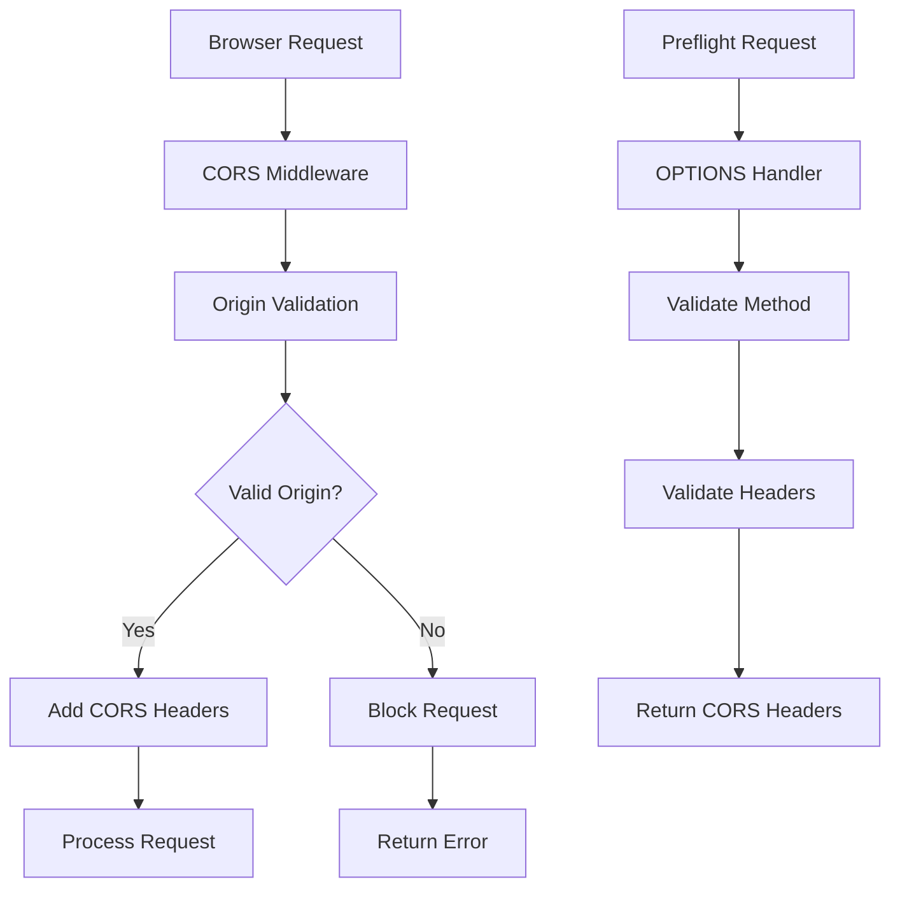

# CORS Security Configuration

## Summary

Comprehensive guide for implementing secure CORS (Cross-Origin Resource Sharing) configuration in the Axisor platform. This document covers CORS policies, security headers, origin validation, and protection against cross-origin attacks.

## CORS Architecture



## CORS Configuration

### Basic CORS Setup

```typescript
// backend/src/index.ts
import cors from '@fastify/cors';

// Register CORS plugin
await fastify.register(cors, {
  origin: (origin, callback) => {
    // Allow requests with no origin (mobile apps, Postman, etc.)
    if (!origin) return callback(null, true);

    // List of allowed origins
    const allowedOrigins = [
      'http://localhost:3000',
      'http://localhost:13000',
      'https://app.axisor.com',
      'https://staging.axisor.com',
      'https://admin.axisor.com'
    ];

    // Check if origin is allowed
    if (allowedOrigins.includes(origin)) {
      return callback(null, true);
    }

    // Check for subdomain patterns
    const subdomainPattern = /^https:\/\/[\w-]+\.axisor\.com$/;
    if (subdomainPattern.test(origin)) {
      return callback(null, true);
    }

    // Origin not allowed
    return callback(new Error('Not allowed by CORS'), false);
  },
  methods: ['GET', 'POST', 'PUT', 'DELETE', 'OPTIONS', 'PATCH'],
  allowedHeaders: [
    'Origin',
    'X-Requested-With',
    'Content-Type',
    'Accept',
    'Authorization',
    'X-API-Key',
    'X-Request-ID'
  ],
  exposedHeaders: [
    'X-Total-Count',
    'X-Page-Count',
    'X-RateLimit-Limit',
    'X-RateLimit-Remaining',
    'X-RateLimit-Reset'
  ],
  credentials: true,
  maxAge: 86400, // 24 hours
  preflightContinue: false,
  optionsSuccessStatus: 204
});
```

### Environment-Based CORS Configuration

```typescript
// backend/src/config/cors.ts
export interface CORSConfig {
  origins: string[];
  methods: string[];
  allowedHeaders: string[];
  exposedHeaders: string[];
  credentials: boolean;
  maxAge: number;
  preflightContinue: boolean;
  optionsSuccessStatus: number;
}

export const corsConfig: CORSConfig = {
  origins: [
    // Development
    ...(process.env.NODE_ENV === 'development' ? [
      'http://localhost:3000',
      'http://localhost:13000',
      'http://127.0.0.1:3000',
      'http://127.0.0.1:13000'
    ] : []),
    
    // Staging
    ...(process.env.NODE_ENV === 'staging' ? [
      'https://staging.axisor.com',
      'https://staging-admin.axisor.com'
    ] : []),
    
    // Production
    ...(process.env.NODE_ENV === 'production' ? [
      'https://app.axisor.com',
      'https://admin.axisor.com'
    ] : []),
    
    // Common patterns
    'https://*.axisor.com'
  ],
  methods: ['GET', 'POST', 'PUT', 'DELETE', 'OPTIONS', 'PATCH'],
  allowedHeaders: [
    'Origin',
    'X-Requested-With',
    'Content-Type',
    'Accept',
    'Authorization',
    'X-API-Key',
    'X-Request-ID',
    'X-CSRF-Token'
  ],
  exposedHeaders: [
    'X-Total-Count',
    'X-Page-Count',
    'X-RateLimit-Limit',
    'X-RateLimit-Remaining',
    'X-RateLimit-Reset',
    'X-Request-ID'
  ],
  credentials: true,
  maxAge: 86400,
  preflightContinue: false,
  optionsSuccessStatus: 204
};
```

### Advanced CORS Service

```typescript
// backend/src/services/cors-security.service.ts
export class CORSSecurityService {
  private allowedOrigins: Set<string>;
  private allowedPatterns: RegExp[];

  constructor() {
    this.allowedOrigins = new Set(corsConfig.origins.filter(origin => !origin.includes('*')));
    this.allowedPatterns = corsConfig.origins
      .filter(origin => origin.includes('*'))
      .map(pattern => new RegExp(pattern.replace(/\*/g, '.*')));
  }

  /**
   * Validate origin
   */
  validateOrigin(origin: string): boolean {
    // Check exact matches
    if (this.allowedOrigins.has(origin)) {
      return true;
    }

    // Check patterns
    return this.allowedPatterns.some(pattern => pattern.test(origin));
  }

  /**
   * Get CORS headers for response
   */
  getCORSHeaders(origin: string): Record<string, string> {
    if (!this.validateOrigin(origin)) {
      throw new Error('Invalid origin');
    }

    return {
      'Access-Control-Allow-Origin': origin,
      'Access-Control-Allow-Methods': corsConfig.methods.join(', '),
      'Access-Control-Allow-Headers': corsConfig.allowedHeaders.join(', '),
      'Access-Control-Expose-Headers': corsConfig.exposedHeaders.join(', '),
      'Access-Control-Allow-Credentials': corsConfig.credentials.toString(),
      'Access-Control-Max-Age': corsConfig.maxAge.toString()
    };
  }

  /**
   * Handle preflight request
   */
  handlePreflight(request: FastifyRequest, reply: FastifyReply): void {
    const origin = request.headers.origin;
    
    if (!origin || !this.validateOrigin(origin)) {
      return reply.status(403).send({
        error: 'Forbidden',
        message: 'Origin not allowed by CORS policy'
      });
    }

    const method = request.headers['access-control-request-method'];
    const headers = request.headers['access-control-request-headers'];

    // Validate requested method
    if (method && !corsConfig.methods.includes(method)) {
      return reply.status(403).send({
        error: 'Forbidden',
        message: `Method ${method} not allowed`
      });
    }

    // Validate requested headers
    if (headers) {
      const requestedHeaders = headers.split(',').map(h => h.trim());
      const invalidHeaders = requestedHeaders.filter(
        h => !corsConfig.allowedHeaders.includes(h)
      );
      
      if (invalidHeaders.length > 0) {
        return reply.status(403).send({
          error: 'Forbidden',
          message: `Headers not allowed: ${invalidHeaders.join(', ')}`
        });
      }
    }

    // Add CORS headers
    const corsHeaders = this.getCORSHeaders(origin);
    Object.entries(corsHeaders).forEach(([key, value]) => {
      reply.header(key, value);
    });

    return reply.status(corsConfig.optionsSuccessStatus).send();
  }
}
```

## Security Headers

### Security Headers Middleware

```typescript
// backend/src/middleware/security-headers.middleware.ts
import { FastifyRequest, FastifyReply } from 'fastify';

export async function securityHeadersMiddleware(
  request: FastifyRequest,
  reply: FastifyReply
): Promise<void> {
  const origin = request.headers.origin;

  // Content Security Policy
  reply.header('Content-Security-Policy', [
    "default-src 'self'",
    `connect-src 'self' ${origin || ''} https://api.lnmarkets.com https://api.testnet.lnmarkets.com`,
    "script-src 'self' 'unsafe-inline' 'unsafe-eval' https://cdn.jsdelivr.net",
    "style-src 'self' 'unsafe-inline' https://fonts.googleapis.com",
    "font-src 'self' https://fonts.gstatic.com",
    "img-src 'self' data: https:",
    "frame-src 'none'",
    "object-src 'none'",
    "base-uri 'self'",
    "form-action 'self'"
  ].join('; '));

  // Security headers
  reply.header('X-Content-Type-Options', 'nosniff');
  reply.header('X-Frame-Options', 'DENY');
  reply.header('X-XSS-Protection', '1; mode=block');
  reply.header('Referrer-Policy', 'strict-origin-when-cross-origin');
  reply.header('Permissions-Policy', [
    'camera=()',
    'microphone=()',
    'geolocation=()',
    'interest-cohort=()'
  ].join(', '));

  // HSTS (only for HTTPS)
  if (request.protocol === 'https') {
    reply.header('Strict-Transport-Security', 'max-age=31536000; includeSubDomains; preload');
  }

  // CORS headers (if origin is valid)
  if (origin) {
    const corsService = new CORSSecurityService();
    if (corsService.validateOrigin(origin)) {
      const corsHeaders = corsService.getCORSHeaders(origin);
      Object.entries(corsHeaders).forEach(([key, value]) => {
        reply.header(key, value);
      });
    }
  }
}
```

## CORS Validation

### Origin Validation Service

```typescript
// backend/src/services/origin-validation.service.ts
export class OriginValidationService {
  private allowedOrigins: Map<string, OriginConfig>;
  private blockedOrigins: Set<string>;

  constructor() {
    this.allowedOrigins = new Map();
    this.blockedOrigins = new Set();
    this.initializeOrigins();
  }

  /**
   * Initialize allowed and blocked origins
   */
  private initializeOrigins(): void {
    // Development origins
    if (process.env.NODE_ENV === 'development') {
      this.allowedOrigins.set('http://localhost:3000', {
        environment: 'development',
        allowedMethods: ['GET', 'POST', 'PUT', 'DELETE', 'OPTIONS'],
        allowedHeaders: ['*'],
        credentials: true
      });
    }

    // Production origins
    this.allowedOrigins.set('https://app.axisor.com', {
      environment: 'production',
      allowedMethods: ['GET', 'POST', 'PUT', 'DELETE', 'OPTIONS', 'PATCH'],
      allowedHeaders: ['Authorization', 'Content-Type', 'X-Requested-With'],
      credentials: true
    });

    // Blocked origins (known malicious)
    this.blockedOrigins.add('http://malicious-site.com');
    this.blockedOrigins.add('https://phishing-axisor.com');
  }

  /**
   * Validate origin with additional checks
   */
  async validateOrigin(origin: string, request: FastifyRequest): Promise<{
    valid: boolean;
    reason?: string;
    config?: OriginConfig;
  }> {
    // Check if origin is blocked
    if (this.blockedOrigins.has(origin)) {
      await this.logSecurityEvent('BLOCKED_ORIGIN', origin, request);
      return { valid: false, reason: 'Origin is blocked' };
    }

    // Check if origin is in allowed list
    const config = this.allowedOrigins.get(origin);
    if (!config) {
      // Check patterns
      const corsService = new CORSSecurityService();
      if (!corsService.validateOrigin(origin)) {
        await this.logSecurityEvent('INVALID_ORIGIN', origin, request);
        return { valid: false, reason: 'Origin not in allowed list' };
      }
    }

    // Additional security checks
    const securityChecks = await this.performSecurityChecks(origin, request);
    if (!securityChecks.valid) {
      await this.logSecurityEvent('SECURITY_CHECK_FAILED', origin, request);
      return { valid: false, reason: securityChecks.reason };
    }

    return { valid: true, config };
  }

  /**
   * Perform additional security checks
   */
  private async performSecurityChecks(
    origin: string,
    request: FastifyRequest
  ): Promise<{ valid: boolean; reason?: string }> {
    // Check for suspicious patterns
    if (this.hasSuspiciousPattern(origin)) {
      return { valid: false, reason: 'Suspicious origin pattern' };
    }

    // Check referrer
    const referrer = request.headers.referer;
    if (referrer && !this.validateReferrer(origin, referrer)) {
      return { valid: false, reason: 'Invalid referrer' };
    }

    // Check user agent for bot detection
    const userAgent = request.headers['user-agent'];
    if (userAgent && this.isSuspiciousUserAgent(userAgent)) {
      return { valid: false, reason: 'Suspicious user agent' };
    }

    return { valid: true };
  }

  /**
   * Check for suspicious origin patterns
   */
  private hasSuspiciousPattern(origin: string): boolean {
    const suspiciousPatterns = [
      /axisor.*\.tk$/i,
      /axisor.*\.ml$/i,
      /axisor.*\.ga$/i,
      /axisor.*\.cf$/i,
      /phishing/i,
      /fake/i,
      /malicious/i
    ];

    return suspiciousPatterns.some(pattern => pattern.test(origin));
  }

  /**
   * Validate referrer
   */
  private validateReferrer(origin: string, referrer: string): boolean {
    try {
      const referrerUrl = new URL(referrer);
      const originUrl = new URL(origin);
      
      // Referrer should match origin domain
      return referrerUrl.hostname === originUrl.hostname;
    } catch {
      return false;
    }
  }

  /**
   * Check for suspicious user agents
   */
  private isSuspiciousUserAgent(userAgent: string): boolean {
    const suspiciousPatterns = [
      /bot/i,
      /crawler/i,
      /spider/i,
      /scraper/i,
      /curl/i,
      /wget/i,
      /python-requests/i
    ];

    return suspiciousPatterns.some(pattern => pattern.test(userAgent));
  }

  /**
   * Log security events
   */
  private async logSecurityEvent(
    event: string,
    origin: string,
    request: FastifyRequest
  ): Promise<void> {
    // Log to security audit log
    console.warn(`Security Event: ${event}`, {
      origin,
      ip: request.ip,
      userAgent: request.headers['user-agent'],
      timestamp: new Date().toISOString()
    });
  }
}

interface OriginConfig {
  environment: string;
  allowedMethods: string[];
  allowedHeaders: string[];
  credentials: boolean;
}
```

## CORS Testing

### CORS Test Suite

```typescript
// backend/src/tests/cors.test.ts
import { test } from 'tap';
import Fastify from 'fastify';
import cors from '@fastify/cors';

test('CORS configuration', async (t) => {
  const fastify = Fastify();
  
  await fastify.register(cors, {
    origin: ['https://app.axisor.com', 'http://localhost:3000'],
    credentials: true
  });

  // Test allowed origin
  t.test('should allow requests from allowed origins', async (t) => {
    const response = await fastify.inject({
      method: 'GET',
      url: '/',
      headers: {
        origin: 'https://app.axisor.com'
      }
    });

    t.equal(response.statusCode, 404); // Route not found, but CORS should pass
    t.ok(response.headers['access-control-allow-origin']);
  });

  // Test blocked origin
  t.test('should block requests from blocked origins', async (t) => {
    const response = await fastify.inject({
      method: 'GET',
      url: '/',
      headers: {
        origin: 'https://malicious-site.com'
      }
    });

    t.equal(response.statusCode, 404);
    t.notOk(response.headers['access-control-allow-origin']);
  });

  // Test preflight request
  t.test('should handle preflight requests correctly', async (t) => {
    const response = await fastify.inject({
      method: 'OPTIONS',
      url: '/',
      headers: {
        origin: 'https://app.axisor.com',
        'access-control-request-method': 'POST',
        'access-control-request-headers': 'content-type'
      }
    });

    t.equal(response.statusCode, 204);
    t.ok(response.headers['access-control-allow-origin']);
    t.ok(response.headers['access-control-allow-methods']);
  });

  await fastify.close();
});
```

## CORS Monitoring

### CORS Analytics Service

```typescript
// backend/src/services/cors-analytics.service.ts
export class CORSAnalyticsService {
  private prisma: PrismaClient;

  constructor(prisma: PrismaClient) {
    this.prisma = prisma;
  }

  /**
   * Log CORS request
   */
  async logCORSRequest(
    origin: string,
    method: string,
    allowed: boolean,
    request: FastifyRequest
  ): Promise<void> {
    await this.prisma.corsLog.create({
      data: {
        origin,
        method,
        allowed,
        ip_address: request.ip,
        user_agent: request.headers['user-agent'],
        referer: request.headers.referer,
        timestamp: new Date()
      }
    });
  }

  /**
   * Get CORS statistics
   */
  async getCORSStats(): Promise<{
    totalRequests: number;
    allowedRequests: number;
    blockedRequests: number;
    topOrigins: any[];
    topBlockedOrigins: any[];
  }> {
    const [
      totalRequests,
      allowedRequests,
      blockedRequests,
      topOrigins,
      topBlockedOrigins
    ] = await Promise.all([
      this.prisma.corsLog.count({
        where: {
          timestamp: { gte: new Date(Date.now() - 24 * 60 * 60 * 1000) }
        }
      }),
      this.prisma.corsLog.count({
        where: {
          allowed: true,
          timestamp: { gte: new Date(Date.now() - 24 * 60 * 60 * 1000) }
        }
      }),
      this.prisma.corsLog.count({
        where: {
          allowed: false,
          timestamp: { gte: new Date(Date.now() - 24 * 60 * 60 * 1000) }
        }
      }),
      this.prisma.corsLog.groupBy({
        by: ['origin'],
        where: {
          allowed: true,
          timestamp: { gte: new Date(Date.now() - 24 * 60 * 60 * 1000) }
        },
        _count: { origin: true },
        orderBy: { _count: { origin: 'desc' } },
        take: 10
      }),
      this.prisma.corsLog.groupBy({
        by: ['origin'],
        where: {
          allowed: false,
          timestamp: { gte: new Date(Date.now() - 24 * 60 * 60 * 1000) }
        },
        _count: { origin: true },
        orderBy: { _count: { origin: 'desc' } },
        take: 10
      })
    ]);

    return {
      totalRequests,
      allowedRequests,
      blockedRequests,
      topOrigins,
      topBlockedOrigins
    };
  }

  /**
   * Detect suspicious CORS activity
   */
  async detectSuspiciousActivity(): Promise<any[]> {
    const suspiciousOrigins = await this.prisma.corsLog.groupBy({
      by: ['origin'],
      where: {
        allowed: false,
        timestamp: { gte: new Date(Date.now() - 60 * 60 * 1000) } // Last hour
      },
      _count: { origin: true },
      having: {
        origin: {
          _count: {
            gte: 10 // 10+ blocked requests in 1 hour
          }
        }
      }
    });

    return suspiciousOrigins.map(origin => ({
      origin: origin.origin,
      blockedCount: origin._count.origin,
      lastSeen: new Date()
    }));
  }
}
```

## How to Use This Document

- **For Configuration**: Use the CORS configuration examples for different environments
- **For Security**: Use the security headers and origin validation for enhanced protection
- **For Testing**: Use the test suite examples for CORS validation
- **For Monitoring**: Use the analytics service for CORS insights and threat detection
