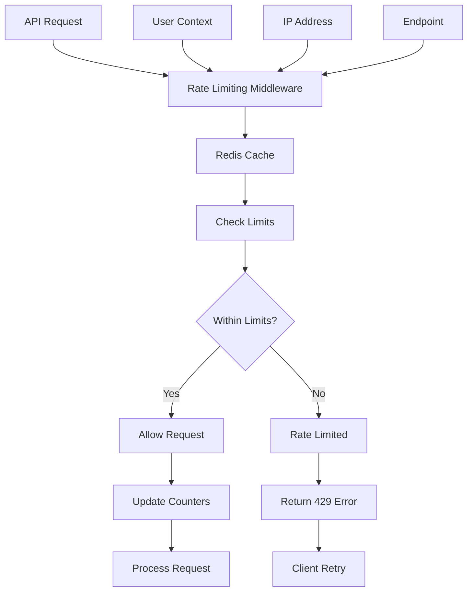

# API Rate Limiting

## Summary

Comprehensive guide for implementing API rate limiting in the Axisor platform. This document covers rate limiting strategies, middleware implementation, Redis-based throttling, user-specific limits, and protection against abuse and DDoS attacks.

## Rate Limiting Architecture



## Fastify Rate Limiting Implementation

### Basic Rate Limiting Configuration

```typescript
// backend/src/index.ts
import rateLimit from '@fastify/rate-limit';

// Register rate limiting plugin
await fastify.register(rateLimit, {
  global: true,
  max: 100, // Maximum number of requests
  timeWindow: '1 minute', // Time window
  redis: fastify.redis, // Redis instance
  keyGenerator: (request) => {
    // Generate key based on user ID if authenticated, otherwise IP
    const userId = (request as any).user?.id;
    return userId ? `rate_limit:user:${userId}` : `rate_limit:ip:${request.ip}`;
  },
  errorResponseBuilder: (request, context) => ({
    statusCode: 429,
    error: 'Too Many Requests',
    message: `Rate limit exceeded, retry in ${Math.round(context.ttl / 1000)} seconds`,
    retryAfter: Math.round(context.ttl / 1000)
  })
});
```

### Advanced Rate Limiting Service

```typescript
// backend/src/services/rate-limiting.service.ts
import { Redis } from 'ioredis';
import { PrismaClient } from '@prisma/client';

export interface RateLimitConfig {
  windowMs: number;
  maxRequests: number;
  skipSuccessfulRequests?: boolean;
  skipFailedRequests?: boolean;
  keyPrefix?: string;
}

export interface RateLimitResult {
  allowed: boolean;
  remaining: number;
  resetTime: number;
  retryAfter?: number;
}

export class RateLimitingService {
  private redis: Redis;
  private prisma: PrismaClient;

  constructor(redis: Redis, prisma: PrismaClient) {
    this.redis = redis;
    this.prisma = prisma;
  }

  /**
   * Check rate limit for user/IP
   */
  async checkRateLimit(
    identifier: string,
    config: RateLimitConfig,
    endpoint?: string
  ): Promise<RateLimitResult> {
    const key = this.generateKey(identifier, config.keyPrefix, endpoint);
    const window = Math.floor(Date.now() / config.windowMs);
    const windowKey = `${key}:${window}`;

    // Get current count
    const currentCount = await this.redis.get(windowKey);
    const count = currentCount ? parseInt(currentCount) : 0;

    if (count >= config.maxRequests) {
      const nextWindow = window + 1;
      const resetTime = nextWindow * config.windowMs;
      const retryAfter = Math.ceil((resetTime - Date.now()) / 1000);

      return {
        allowed: false,
        remaining: 0,
        resetTime,
        retryAfter
      };
    }

    // Increment counter
    await this.redis.incr(windowKey);
    await this.redis.expire(windowKey, Math.ceil(config.windowMs / 1000));

    return {
      allowed: true,
      remaining: config.maxRequests - count - 1,
      resetTime: (window + 1) * config.windowMs
    };
  }

  /**
   * Check user-specific rate limits
   */
  async checkUserRateLimit(
    userId: string,
    endpoint: string
  ): Promise<RateLimitResult> {
    // Get user's plan-based limits
    const user = await this.prisma.user.findUnique({
      where: { id: userId },
      select: { plan_type: true }
    });

    const planLimits = this.getPlanBasedLimits(user?.plan_type || 'free');
    const endpointConfig = planLimits[endpoint] || planLimits.default;

    return await this.checkRateLimit(
      `user:${userId}`,
      endpointConfig,
      endpoint
    );
  }

  /**
   * Check IP-based rate limits
   */
  async checkIPRateLimit(
    ipAddress: string,
    endpoint: string
  ): Promise<RateLimitResult> {
    const ipLimits = this.getIPBasedLimits();
    const endpointConfig = ipLimits[endpoint] || ipLimits.default;

    return await this.checkRateLimit(
      `ip:${ipAddress}`,
      endpointConfig,
      endpoint
    );
  }

  /**
   * Generate Redis key
   */
  private generateKey(
    identifier: string,
    prefix?: string,
    endpoint?: string
  ): string {
    const parts = ['rate_limit'];
    if (prefix) parts.push(prefix);
    parts.push(identifier);
    if (endpoint) parts.push(endpoint);
    return parts.join(':');
  }

  /**
   * Get plan-based rate limits
   */
  private getPlanBasedLimits(planType: string): Record<string, RateLimitConfig> {
    const baseConfig = {
      windowMs: 60 * 1000, // 1 minute
      keyPrefix: 'user'
    };

    const limits = {
      free: {
        default: { ...baseConfig, maxRequests: 60 },
        auth: { ...baseConfig, maxRequests: 5 },
        trading: { ...baseConfig, maxRequests: 10 },
        api: { ...baseConfig, maxRequests: 100 }
      },
      basic: {
        default: { ...baseConfig, maxRequests: 120 },
        auth: { ...baseConfig, maxRequests: 10 },
        trading: { ...baseConfig, maxRequests: 30 },
        api: { ...baseConfig, maxRequests: 200 }
      },
      advanced: {
        default: { ...baseConfig, maxRequests: 240 },
        auth: { ...baseConfig, maxRequests: 15 },
        trading: { ...baseConfig, maxRequests: 60 },
        api: { ...baseConfig, maxRequests: 400 }
      },
      pro: {
        default: { ...baseConfig, maxRequests: 480 },
        auth: { ...baseConfig, maxRequests: 20 },
        trading: { ...baseConfig, maxRequests: 120 },
        api: { ...baseConfig, maxRequests: 800 }
      },
      lifetime: {
        default: { ...baseConfig, maxRequests: 960 },
        auth: { ...baseConfig, maxRequests: 30 },
        trading: { ...baseConfig, maxRequests: 240 },
        api: { ...baseConfig, maxRequests: 1600 }
      }
    };

    return limits[planType] || limits.free;
  }

  /**
   * Get IP-based rate limits
   */
  private getIPBasedLimits(): Record<string, RateLimitConfig> {
    const baseConfig = {
      windowMs: 60 * 1000,
      keyPrefix: 'ip'
    };

    return {
      default: { ...baseConfig, maxRequests: 100 },
      auth: { ...baseConfig, maxRequests: 5 },
      api: { ...baseConfig, maxRequests: 200 },
      upload: { ...baseConfig, maxRequests: 10 },
      download: { ...baseConfig, maxRequests: 20 }
    };
  }

  /**
   * Reset rate limit for identifier
   */
  async resetRateLimit(
    identifier: string,
    prefix?: string,
    endpoint?: string
  ): Promise<void> {
    const pattern = this.generateKey(identifier, prefix, endpoint) + '*';
    const keys = await this.redis.keys(pattern);
    
    if (keys.length > 0) {
      await this.redis.del(...keys);
    }
  }

  /**
   * Get rate limit status
   */
  async getRateLimitStatus(
    identifier: string,
    prefix?: string,
    endpoint?: string
  ): Promise<{
    current: number;
    limit: number;
    resetTime: number;
    remaining: number;
  }> {
    const key = this.generateKey(identifier, prefix, endpoint);
    const window = Math.floor(Date.now() / 60000); // 1 minute window
    const windowKey = `${key}:${window}`;

    const current = await this.redis.get(windowKey);
    const count = current ? parseInt(current) : 0;

    // Get limit from config (simplified)
    const limit = 100; // Default limit
    const resetTime = (window + 1) * 60000;

    return {
      current: count,
      limit,
      resetTime,
      remaining: Math.max(0, limit - count)
    };
  }
}
```

## Middleware Implementation

### Rate Limiting Middleware

```typescript
// backend/src/middleware/rate-limiting.middleware.ts
import { FastifyRequest, FastifyReply } from 'fastify';
import { RateLimitingService } from '../services/rate-limiting.service';

export function createRateLimitMiddleware(
  rateLimitingService: RateLimitingService,
  config?: {
    endpoint?: string;
    skipAuth?: boolean;
    customKey?: (request: FastifyRequest) => string;
  }
) {
  return async (request: FastifyRequest, reply: FastifyReply): Promise<void> => {
    try {
      let identifier: string;
      let endpoint = config?.endpoint;

      // Generate identifier
      if (config?.customKey) {
        identifier = config.customKey(request);
      } else if (config?.skipAuth || !(request as any).user) {
        // Use IP address for unauthenticated requests
        identifier = request.ip;
        endpoint = endpoint || 'public';
      } else {
        // Use user ID for authenticated requests
        identifier = (request as any).user.id;
        endpoint = endpoint || 'authenticated';
      }

      // Check rate limit
      const result = await rateLimitingService.checkUserRateLimit(
        identifier,
        endpoint
      );

      // Add rate limit headers
      reply.header('X-RateLimit-Limit', result.remaining);
      reply.header('X-RateLimit-Remaining', result.remaining);
      reply.header('X-RateLimit-Reset', Math.ceil(result.resetTime / 1000));

      if (!result.allowed) {
        reply.header('Retry-After', result.retryAfter);
        return reply.status(429).send({
          error: 'Too Many Requests',
          message: 'Rate limit exceeded',
          retryAfter: result.retryAfter
        });
      }
    } catch (error) {
      console.error('Rate limiting error:', error);
      // Continue without rate limiting on error
    }
  };
}

/**
 * Strict rate limiting for sensitive endpoints
 */
export function strictRateLimit(
  rateLimitingService: RateLimitingService
) {
  return createRateLimitMiddleware(rateLimitingService, {
    endpoint: 'strict'
  });
}

/**
 * Authentication rate limiting
 */
export function authRateLimit(
  rateLimitingService: RateLimitingService
) {
  return createRateLimitMiddleware(rateLimitingService, {
    endpoint: 'auth',
    skipAuth: true
  });
}

/**
 * API rate limiting
 */
export function apiRateLimit(
  rateLimitingService: RateLimitingService
) {
  return createRateLimitMiddleware(rateLimitingService, {
    endpoint: 'api'
  });
}
```

### Route-Specific Rate Limiting

```typescript
// backend/src/routes/auth.routes.ts
export async function authRoutes(fastify: FastifyInstance) {
  const rateLimitingService = new RateLimitingService(
    fastify.redis,
    fastify.prisma
  );

  // Login endpoint with strict rate limiting
  fastify.post('/login', {
    preHandler: [
      authRateLimit(rateLimitingService)
    ],
    handler: async (request: FastifyRequest, reply: FastifyReply) => {
      // Login logic
    }
  });

  // Registration endpoint
  fastify.post('/register', {
    preHandler: [
      createRateLimitMiddleware(rateLimitingService, {
        endpoint: 'auth',
        maxRequests: 3,
        windowMs: 15 * 60 * 1000 // 15 minutes
      })
    ],
    handler: async (request: FastifyRequest, reply: FastifyReply) => {
      // Registration logic
    }
  });

  // Password reset endpoint
  fastify.post('/reset-password', {
    preHandler: [
      createRateLimitMiddleware(rateLimitingService, {
        endpoint: 'password-reset',
        maxRequests: 3,
        windowMs: 60 * 60 * 1000 // 1 hour
      })
    ],
    handler: async (request: FastifyRequest, reply: FastifyReply) => {
      // Password reset logic
    }
  });
}

// API routes with different limits
export async function apiRoutes(fastify: FastifyInstance) {
  const rateLimitingService = new RateLimitingService(
    fastify.redis,
    fastify.prisma
  );

  // Trading endpoints with higher limits for premium users
  fastify.post('/trading/order', {
    preHandler: [
      fastify.authenticate,
      apiRateLimit(rateLimitingService)
    ],
    handler: async (request: FastifyRequest, reply: FastifyReply) => {
      // Trading logic
    }
  });

  // Data export with strict limits
  fastify.get('/export/data', {
    preHandler: [
      fastify.authenticate,
      createRateLimitMiddleware(rateLimitingService, {
        endpoint: 'export',
        maxRequests: 5,
        windowMs: 60 * 60 * 1000 // 1 hour
      })
    ],
    handler: async (request: FastifyRequest, reply: FastifyReply) => {
      // Data export logic
    }
  });
}
```

## Advanced Rate Limiting Features

### Sliding Window Rate Limiting

```typescript
// backend/src/services/sliding-window-rate-limit.service.ts
export class SlidingWindowRateLimitService {
  private redis: Redis;

  constructor(redis: Redis) {
    this.redis = redis;
  }

  /**
   * Sliding window rate limiting
   */
  async checkSlidingWindowLimit(
    key: string,
    windowMs: number,
    maxRequests: number
  ): Promise<RateLimitResult> {
    const now = Date.now();
    const windowStart = now - windowMs;

    // Use Redis sorted set for sliding window
    const pipeline = this.redis.pipeline();

    // Remove old entries
    pipeline.zremrangebyscore(key, 0, windowStart);

    // Count current requests
    pipeline.zcard(key);

    // Add current request
    pipeline.zadd(key, now, `${now}-${Math.random()}`);

    // Set expiration
    pipeline.expire(key, Math.ceil(windowMs / 1000));

    const results = await pipeline.exec();
    const currentCount = results[1][1] as number;

    if (currentCount >= maxRequests) {
      // Get oldest request time
      const oldest = await this.redis.zrange(key, 0, 0, 'WITHSCORES');
      const oldestTime = oldest.length > 0 ? parseInt(oldest[1]) : now;
      const retryAfter = Math.ceil((oldestTime + windowMs - now) / 1000);

      return {
        allowed: false,
        remaining: 0,
        resetTime: oldestTime + windowMs,
        retryAfter
      };
    }

    return {
      allowed: true,
      remaining: maxRequests - currentCount - 1,
      resetTime: now + windowMs
    };
  }
}
```

### Token Bucket Rate Limiting

```typescript
// backend/src/services/token-bucket-rate-limit.service.ts
export class TokenBucketRateLimitService {
  private redis: Redis;

  constructor(redis: Redis) {
    this.redis = redis;
  }

  /**
   * Token bucket rate limiting
   */
  async checkTokenBucketLimit(
    key: string,
    capacity: number,
    refillRate: number, // tokens per second
    tokensRequested: number = 1
  ): Promise<RateLimitResult> {
    const now = Date.now();
    const bucketKey = `bucket:${key}`;

    const luaScript = `
      local key = KEYS[1]
      local capacity = tonumber(ARGV[1])
      local refillRate = tonumber(ARGV[2])
      local tokensRequested = tonumber(ARGV[3])
      local now = tonumber(ARGV[4])
      
      local bucket = redis.call('HMGET', key, 'tokens', 'lastRefill')
      local tokens = tonumber(bucket[1]) or capacity
      local lastRefill = tonumber(bucket[2]) or now
      
      -- Calculate tokens to add based on time elapsed
      local timeElapsed = (now - lastRefill) / 1000
      local tokensToAdd = timeElapsed * refillRate
      tokens = math.min(capacity, tokens + tokensToAdd)
      
      -- Check if enough tokens available
      if tokens >= tokensRequested then
        tokens = tokens - tokensRequested
        redis.call('HMSET', key, 'tokens', tokens, 'lastRefill', now)
        redis.call('EXPIRE', key, 3600) -- 1 hour expiration
        return {1, tokens}
      else
        redis.call('HMSET', key, 'tokens', tokens, 'lastRefill', now)
        redis.call('EXPIRE', key, 3600)
        return {0, tokens}
      end
    `;

    const result = await this.redis.eval(
      luaScript,
      1,
      bucketKey,
      capacity,
      refillRate,
      tokensRequested,
      now
    ) as [number, number];

    const allowed = result[0] === 1;
    const remainingTokens = result[1];

    return {
      allowed,
      remaining: Math.floor(remainingTokens),
      resetTime: now + (capacity / refillRate * 1000)
    };
  }
}
```

## Rate Limiting Configuration

### Environment Configuration

```typescript
// backend/src/config/rate-limiting.ts
export interface RateLimitingConfig {
  global: {
    enabled: boolean;
    maxRequests: number;
    windowMs: number;
  };
  endpoints: {
    [endpoint: string]: {
      maxRequests: number;
      windowMs: number;
      skipSuccessfulRequests?: boolean;
      skipFailedRequests?: boolean;
    };
  };
  plans: {
    [planType: string]: {
      multiplier: number;
      additionalRequests: number;
    };
  };
}

export const rateLimitingConfig: RateLimitingConfig = {
  global: {
    enabled: true,
    maxRequests: 100,
    windowMs: 60 * 1000 // 1 minute
  },
  endpoints: {
    auth: {
      maxRequests: 5,
      windowMs: 15 * 60 * 1000 // 15 minutes
    },
    password_reset: {
      maxRequests: 3,
      windowMs: 60 * 60 * 1000 // 1 hour
    },
    api: {
      maxRequests: 200,
      windowMs: 60 * 1000 // 1 minute
    },
    trading: {
      maxRequests: 50,
      windowMs: 60 * 1000 // 1 minute
    },
    export: {
      maxRequests: 5,
      windowMs: 60 * 60 * 1000 // 1 hour
    }
  },
  plans: {
    free: {
      multiplier: 1,
      additionalRequests: 0
    },
    basic: {
      multiplier: 2,
      additionalRequests: 50
    },
    advanced: {
      multiplier: 4,
      additionalRequests: 100
    },
    pro: {
      multiplier: 8,
      additionalRequests: 200
    },
    lifetime: {
      multiplier: 16,
      additionalRequests: 400
    }
  }
};
```

## Monitoring and Analytics

### Rate Limiting Analytics

```typescript
// backend/src/services/rate-limiting-analytics.service.ts
export class RateLimitingAnalyticsService {
  private prisma: PrismaClient;
  private redis: Redis;

  constructor(prisma: PrismaClient, redis: Redis) {
    this.prisma = prisma;
    this.redis = redis;
  }

  /**
   * Get rate limiting statistics
   */
  async getRateLimitStats(): Promise<{
    totalRequests: number;
    rateLimitedRequests: number;
    topLimitedEndpoints: any[];
    topLimitedIPs: any[];
    planDistribution: any;
  }> {
    const [
      totalRequests,
      rateLimitedRequests,
      topLimitedEndpoints,
      topLimitedIPs,
      planDistribution
    ] = await Promise.all([
      this.getTotalRequests(),
      this.getRateLimitedRequests(),
      this.getTopLimitedEndpoints(),
      this.getTopLimitedIPs(),
      this.getPlanDistribution()
    ]);

    return {
      totalRequests,
      rateLimitedRequests,
      topLimitedEndpoints,
      topLimitedIPs,
      planDistribution
    };
  }

  /**
   * Log rate limit event
   */
  async logRateLimitEvent(
    identifier: string,
    endpoint: string,
    limited: boolean,
    userAgent?: string,
    ipAddress?: string
  ): Promise<void> {
    await this.prisma.rateLimitLog.create({
      data: {
        identifier,
        endpoint,
        limited,
        user_agent: userAgent,
        ip_address: ipAddress,
        timestamp: new Date()
      }
    });
  }

  /**
   * Get rate limit alerts
   */
  async getRateLimitAlerts(): Promise<any[]> {
    // Check for unusual rate limiting patterns
    const recentLimits = await this.prisma.rateLimitLog.findMany({
      where: {
        limited: true,
        timestamp: { gte: new Date(Date.now() - 60 * 60 * 1000) } // Last hour
      },
      orderBy: { timestamp: 'desc' }
    });

    // Group by identifier to find suspicious activity
    const suspiciousActivity = recentLimits.reduce((acc, log) => {
      if (!acc[log.identifier]) {
        acc[log.identifier] = [];
      }
      acc[log.identifier].push(log);
      return acc;
    }, {} as Record<string, any[]>);

    // Filter for high-frequency limiters
    return Object.entries(suspiciousActivity)
      .filter(([_, logs]) => logs.length >= 10) // 10+ rate limits in 1 hour
      .map(([identifier, logs]) => ({
        identifier,
        count: logs.length,
        endpoints: [...new Set(logs.map(l => l.endpoint))],
        lastSeen: logs[0].timestamp
      }));
  }

  private async getTotalRequests(): Promise<number> {
    return await this.prisma.rateLimitLog.count({
      where: {
        timestamp: { gte: new Date(Date.now() - 24 * 60 * 60 * 1000) }
      }
    });
  }

  private async getRateLimitedRequests(): Promise<number> {
    return await this.prisma.rateLimitLog.count({
      where: {
        limited: true,
        timestamp: { gte: new Date(Date.now() - 24 * 60 * 60 * 1000) }
      }
    });
  }

  private async getTopLimitedEndpoints(): Promise<any[]> {
    return await this.prisma.rateLimitLog.groupBy({
      by: ['endpoint'],
      where: {
        limited: true,
        timestamp: { gte: new Date(Date.now() - 24 * 60 * 60 * 1000) }
      },
      _count: { endpoint: true },
      orderBy: { _count: { endpoint: 'desc' } },
      take: 10
    });
  }

  private async getTopLimitedIPs(): Promise<any[]> {
    return await this.prisma.rateLimitLog.groupBy({
      by: ['ip_address'],
      where: {
        limited: true,
        timestamp: { gte: new Date(Date.now() - 24 * 60 * 60 * 1000) }
      },
      _count: { ip_address: true },
      orderBy: { _count: { ip_address: 'desc' } },
      take: 10
    });
  }

  private async getPlanDistribution(): Promise<any> {
    // This would require joining with user data
    return await this.prisma.user.groupBy({
      by: ['plan_type'],
      _count: { plan_type: true }
    });
  }
}
```

## Error Handling and Responses

### Rate Limit Error Responses

```typescript
// backend/src/utils/rate-limit-errors.ts
export class RateLimitError extends Error {
  public statusCode: number = 429;
  public retryAfter?: number;
  public remaining?: number;
  public resetTime?: number;

  constructor(
    message: string,
    retryAfter?: number,
    remaining?: number,
    resetTime?: number
  ) {
    super(message);
    this.retryAfter = retryAfter;
    this.remaining = remaining;
    this.resetTime = resetTime;
  }
}

export function createRateLimitResponse(
  error: RateLimitError,
  request: FastifyRequest
): any {
  const response: any = {
    statusCode: 429,
    error: 'Too Many Requests',
    message: error.message
  };

  if (error.retryAfter) {
    response.retryAfter = error.retryAfter;
  }

  if (error.remaining !== undefined) {
    response.remaining = error.remaining;
  }

  if (error.resetTime) {
    response.resetTime = new Date(error.resetTime).toISOString();
  }

  // Add helpful information
  response.timestamp = new Date().toISOString();
  response.path = request.url;
  response.method = request.method;

  return response;
}
```

## How to Use This Document

- **For Implementation**: Use the rate limiting service and middleware examples for API protection
- **For Configuration**: Use the configuration examples for different endpoint limits
- **For Monitoring**: Use the analytics service for rate limiting insights
- **For Advanced Features**: Use the sliding window and token bucket implementations for complex scenarios