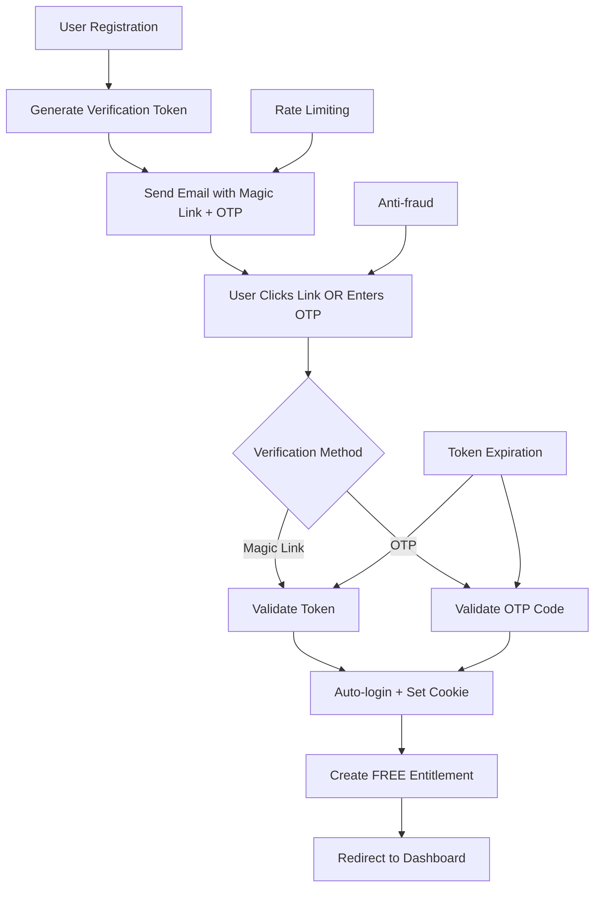

# Email Verification Security

## Summary

Comprehensive security guide for the email verification system implementing magic links, OTP codes, rate limiting, and anti-abuse measures. This document covers the complete verification flow, security considerations, and best practices for production deployments.

## Email Verification Architecture



## Verification Methods

### Magic Link Verification

**Security Features:**
- Single-use tokens (invalidated after use)
- 24-hour expiration
- Secure random generation
- HttpOnly cookie storage

```typescript
// Token generation with SHA256 hashing (GitHub style)
async generateVerificationToken(userId: string): Promise<string> {
  const token = crypto.randomBytes(32).toString('hex'); // 64 chars
  const tokenHash = crypto.createHash('sha256').update(token).digest('hex');
  
  await this.prisma.user.update({
    where: { id: userId },
    data: {
      email_verification_token: tokenHash, // Store SHA256 hash
      email_verification_expires: new Date(Date.now() + 24 * 60 * 60 * 1000)
    }
  });
  
  return token; // Return plain token for email
}
```

### OTP (One-Time Password) Verification

**Security Features:**
- 6-digit numeric codes
- 10-minute expiration
- bcrypt hashing
- Rate limiting (5 attempts per 15 minutes)

```typescript
// OTP generation and validation (stored separately from magic link)
async generateOTP(userId: string): Promise<string> {
  const otp = Math.floor(100000 + Math.random() * 900000).toString();
  const otpHash = await bcrypt.hash(otp, 10);
  
  // Store OTP in separate fields (temporary solution)
  await this.prisma.user.update({
    where: { id: userId },
    data: {
      password_reset_token: otpHash, // Temporary storage
      password_reset_expires: new Date(Date.now() + 10 * 60 * 1000)
    }
  });
  
  return otp;
}

async validateOTP(email: string, code: string): Promise<boolean> {
  const user = await this.prisma.user.findUnique({ 
    where: { email: email.toLowerCase() } 
  });
  
  if (!user || !user.password_reset_token) return false;
  if (user.password_reset_expires < new Date()) return false;
  
  return await bcrypt.compare(code, user.password_reset_token);
}
```

## Rate Limiting and Anti-Abuse

### OTP Rate Limiting

```typescript
// Rate limiting configuration
export const otpRateLimit = rateLimit({
  max: 5, // 5 attempts
  timeWindow: '15 minutes',
  keyGenerator: (request) => {
    const { email } = request.body as { email: string };
    return `${request.ip}-${email}`;
  },
  errorResponseBuilder: (request, context) => {
    return {
      success: false,
      error: 'RATE_LIMIT_EXCEEDED',
      message: 'Muitas tentativas de OTP. Tente novamente em 15 minutos.',
      retryAfter: Math.round(context.ttl / 1000)
    };
  }
});
```

### Email Resend Rate Limiting

```typescript
// Resend rate limiting
export const resendRateLimit = rateLimit({
  max: 3, // 3 resends
  timeWindow: '1 hour',
  keyGenerator: (request) => {
    const { email } = request.body as { email: string };
    return `resend-${request.ip}-${email}`;
  }
});
```

### IP Tracking and Blacklisting

```typescript
// Anti-fraud tracking
interface FraudDetection {
  ip: string;
  userAgent: string;
  attempts: number;
  lastAttempt: Date;
  blacklisted: boolean;
}

async trackVerificationAttempt(ip: string, userAgent: string, success: boolean) {
  const key = `fraud:${ip}`;
  const data = await redis.get(key);
  
  if (data) {
    const fraud: FraudDetection = JSON.parse(data);
    fraud.attempts++;
    fraud.lastAttempt = new Date();
    
    if (fraud.attempts > 10) {
      fraud.blacklisted = true;
      await redis.setex(key, 86400, JSON.stringify(fraud)); // 24h ban
    }
  }
}
```

## Email Template Security

### Template Structure

```handlebars
<!-- Verification email template with dual methods -->
{{#if otp}}
<div class="otp-section">
  <p><strong>Use este código de verificação:</strong></p>
  <div class="otp-code">{{otp}}</div>
  <p class="expiry">Código expira em 10 minutos</p>
</div>

<div class="separator">- OU -</div>
{{/if}}

<div class="magic-link-section">
  <a href="{{verificationUrl}}" class="button">
    ✅ Verificar Meu Email
  </a>
  <p class="expiry">Link expira em 24 horas</p>
</div>
```

### Security Considerations

1. **OTP Display**: Only show OTP in email, never in logs
2. **Token Expiration**: Clear visual indication of expiration
3. **Single Use**: Tokens invalidated after successful verification
4. **HTTPS Only**: All verification links use HTTPS
5. **Hash Comparison**: Magic link tokens use SHA256 hash comparison for security
6. **Dual Methods**: Both Magic Link and OTP shown simultaneously for user choice

## Auto-Login Security

### Cookie Configuration

```typescript
// Secure cookie settings
reply.setCookie('access_token', jwt, {
  httpOnly: true,           // Prevent XSS
  secure: process.env.NODE_ENV === 'production', // HTTPS only in prod
  sameSite: 'lax',          // CSRF protection
  path: '/',                // Available site-wide
  maxAge: 7 * 24 * 60 * 60  // 7 days
});
```

### JWT Token Security

```typescript
// JWT payload structure
const jwtPayload = {
  sub: user.id,
  email: user.email,
  email_verified: true,
  iat: Math.floor(Date.now() / 1000),
  exp: Math.floor(Date.now() / 1000) + (7 * 24 * 60 * 60) // 7 days
};
```

## Security Checklist

### Pre-Production Checklist

- [ ] **Email Service**: SMTP configured with proper authentication
- [ ] **Rate Limiting**: OTP and resend limits configured
- [ ] **Token Security**: Random generation, proper hashing
- [ ] **Expiration**: 24h magic link, 10min OTP
- [ ] **HTTPS**: All verification links use HTTPS
- [ ] **Cookies**: HttpOnly, Secure, SameSite configured
- [ ] **Logging**: No sensitive data in logs
- [ ] **Monitoring**: Fraud detection and alerting

### Production Monitoring

- [ ] **Deliverability**: Email delivery rates >98%
- [ ] **Verification Rate**: >95% verify within 24h
- [ ] **Abuse Detection**: <1% accounts flagged as spam
- [ ] **Rate Limit Effectiveness**: <0.1% false positives
- [ ] **Error Rates**: <0.5% verification failures

## Troubleshooting Security Issues

### Common Issues

1. **Emails Not Delivered**
   - Check SMTP configuration
   - Verify DNS records (SPF, DKIM, DMARC)
   - Monitor bounce rates

2. **OTP Not Working**
   - Verify bcrypt comparison
   - Check expiration times
   - Validate rate limiting

3. **Magic Links Invalid**
   - Ensure single-use token logic
   - Check expiration handling
   - Verify URL encoding

4. **Rate Limiting Issues**
   - Check Redis connection
   - Verify key generation
   - Monitor false positives

## Best Practices

### Development

1. **Never log sensitive data** (OTP codes, tokens)
2. **Use environment variables** for all secrets
3. **Implement proper error handling** without information leakage
4. **Test rate limiting** thoroughly
5. **Validate all inputs** before processing

### Production

1. **Monitor email deliverability** continuously
2. **Set up fraud detection** alerts
3. **Regular security audits** of verification flow
4. **Backup verification methods** (SMS, alternative email)
5. **Document incident response**

## References

- [OWASP Authentication Cheat Sheet](https://cheatsheetseries.owasp.org/cheatsheets/Authentication_Cheat_Sheet.html)
- [RFC 6238 - TOTP Algorithm](https://tools.ietf.org/html/rfc6238)
- [Email Security Best Practices](https://www.ietf.org/rfc/rfc5321.txt)
- [JWT Security Best Practices](https://tools.ietf.org/html/rfc7519)

## Related Documentation

- [JWT Implementation](./jwt-implementation.md)
- [Anti-fraud System](../anti-fraud-system.md)
- [Rate Limiting Configuration](../../operations/rate-limiting.md)

---

## How to Use This Document

• **For Developers**: Use as reference for implementing secure email verification components and understanding security requirements.

• **For Security Team**: Use to validate security measures and conduct security audits of the verification system.

• **For DevOps**: Use to understand infrastructure requirements, monitoring needs, and security configurations.

• **For Product Team**: Use to understand user experience implications of security measures and rate limiting.
